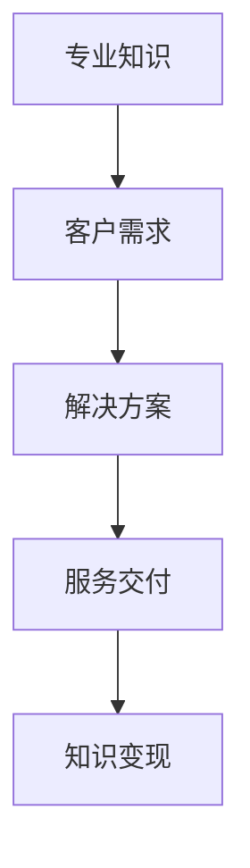

                 

关键词：知识变现，技术咨询，商业模式，数字化，盈利策略

> 摘要：本文探讨了在数字化时代，如何通过技术咨询这一方式实现知识的变现。我们深入分析了技术咨询的内涵与外延，提出了利用技术咨询实现知识变现的策略和步骤，并结合实际案例进行了详细解读。文章旨在为企业和个人提供一种全新的知识变现途径，助力他们在激烈的市场竞争中脱颖而出。

## 1. 背景介绍

随着互联网技术的飞速发展，知识经济的兴起使得知识的价值和重要性日益凸显。传统以产品或服务为核心的商业模式逐渐向以知识为核心的商业模式转变。然而，如何将知识有效地转化为实际的经济收益，成为企业和个人亟待解决的问题。本文将探讨一种新型的知识变现途径——技术咨询。

### 1.1 数字化时代的知识变现

在数字化时代，知识变现的形式变得更加多样化和复杂化。一方面，数字化技术使得知识的生产、传播和消费变得更加高效；另一方面，互联网平台的兴起为知识变现提供了更加广阔的空间。通过技术咨询，企业和个人可以将自身的专业知识、经验和技能转化为实际的经济效益。

### 1.2 技术咨询的定义与作用

技术咨询是指专业机构或个人，根据客户的需求，提供技术性建议、解决方案或服务。它涉及多个领域，包括信息技术、工程咨询、管理咨询等。技术咨询在帮助企业解决技术难题、提升管理效率、降低成本等方面发挥着重要作用。

### 1.3 技术咨询与知识变现的关系

技术咨询与知识变现之间存在密切的联系。通过技术咨询，专业机构和专家可以将自身的知识、经验和技能转化为有价值的咨询服务，从而实现知识的变现。同时，客户通过购买这些咨询服务，可以获取解决问题的方法和方案，提升自身的技术能力和管理水平。

## 2. 核心概念与联系

### 2.1 技术咨询的核心概念

技术咨询的核心概念包括专业知识、客户需求、解决方案和服务交付。专业知识是技术咨询的基础，它决定了咨询服务的质量和价值。客户需求是技术咨询的出发点，它决定了咨询服务的方向和内容。解决方案和服务交付是将专业知识应用于客户需求，提供实际可行的方案和服务的过程。

### 2.2 技术咨询与知识变现的架构图



### 2.3 技术咨询与知识变现的流程

1. **需求识别**：了解客户的需求，明确技术咨询的目标和范围。
2. **专业知识提供**：根据客户需求，提供专业的技术知识和经验。
3. **解决方案设计**：结合专业知识，设计出符合客户需求的解决方案。
4. **服务交付**：将解决方案转化为实际的服务，为客户提供支持。
5. **知识变现**：通过咨询服务，实现知识的变现和价值转化。

## 3. 核心算法原理 & 具体操作步骤

### 3.1 算法原理概述

技术咨询的核心算法原理在于如何将专业知识与客户需求相结合，设计出具有实际应用价值的解决方案。具体包括以下几个步骤：

1. **需求分析**：通过访谈、调查等方式，深入理解客户的需求和问题。
2. **知识储备**：根据需求，调用相关的专业知识，进行分析和判断。
3. **方案设计**：结合专业知识，设计出符合客户需求的解决方案。
4. **方案验证**：通过模拟、测试等方式，验证方案的可行性和有效性。
5. **服务交付**：将方案转化为实际的服务，为客户提供支持。

### 3.2 算法步骤详解

1. **需求分析**：
   - 访谈客户，了解他们的业务背景、面临的问题和期望的解决方案。
   - 分析客户的需求，明确技术咨询的目标和范围。

2. **知识储备**：
   - 搜集和整理相关的专业知识，包括技术文献、案例研究和实践经验。
   - 分析专业知识，提取关键信息和核心观点。

3. **方案设计**：
   - 根据客户需求，设计出具有针对性的解决方案。
   - 考虑方案的可行性、成本效益和风险。

4. **方案验证**：
   - 通过模拟、测试等方式，验证方案的可行性和有效性。
   - 优化方案，确保其能够满足客户需求。

5. **服务交付**：
   - 将方案转化为实际的服务，为客户提供支持。
   - 进行服务交付，确保客户能够顺利实现目标。

### 3.3 算法优缺点

**优点**：
- 能够有效解决客户的问题，提升客户的技术能力和管理水平。
- 实现知识的变现和价值转化，为企业和个人带来经济收益。
- 促进知识的传播和应用，推动技术进步和产业发展。

**缺点**：
- 需要具备丰富的专业知识和实践经验，对咨询师的要求较高。
- 需要投入大量时间和精力，对咨询服务的交付效率有一定影响。

### 3.4 算法应用领域

技术咨询算法广泛应用于各个领域，包括：

- 信息技术：为企业提供技术解决方案，提升IT基础设施和管理水平。
- 工程咨询：为工程项目提供技术支持和咨询服务，确保项目的顺利进行。
- 管理咨询：为企业提供管理建议和优化方案，提升管理效率和竞争力。
- 教育培训：为个人提供专业知识和技能培训，提升其职业素养和竞争力。

## 4. 数学模型和公式 & 详细讲解 & 举例说明

### 4.1 数学模型构建

技术咨询的数学模型可以从以下几个方面进行构建：

1. **客户满意度模型**：通过评估客户对咨询服务的满意度，衡量咨询服务的质量和效果。
2. **成本效益模型**：通过计算咨询服务的成本和收益，评估咨询服务的经济效益。
3. **风险评估模型**：通过分析咨询服务过程中可能出现的风险，评估咨询服务的风险水平。

### 4.2 公式推导过程

1. **客户满意度模型**：
   - 满意度 = (解决的问题数量 / 总问题数量) × 100%
   - 公式推导：通过计算客户在咨询服务过程中解决的问题数量，与总问题数量的比例，得出客户满意度。

2. **成本效益模型**：
   - 成本效益 = 收益 / 成本
   - 公式推导：通过计算咨询服务的收益与成本的比值，得出成本效益。

3. **风险评估模型**：
   - 风险水平 = 风险因素得分 × 风险权重
   - 公式推导：通过计算各个风险因素得分与风险权重的乘积，得出风险水平。

### 4.3 案例分析与讲解

以一家企业信息技术咨询项目为例，进行案例分析和讲解。

1. **客户满意度模型**：

   - 解决的问题数量：10
   - 总问题数量：20
   - 满意度 = (10 / 20) × 100% = 50%

   该企业的客户满意度为50%，说明在咨询服务过程中，有50%的问题得到了有效解决。

2. **成本效益模型**：

   - 收益：100万元
   - 成本：50万元
   - 成本效益 = 100万元 / 50万元 = 2

   该企业的成本效益为2，说明在咨询服务过程中，每投入1元的成本，能够带来2元的收益。

3. **风险评估模型**：

   - 风险因素得分：5
   - 风险权重：0.3
   - 风险水平 = 5 × 0.3 = 1.5

   该企业的风险水平为1.5，说明在咨询服务过程中，面临一定的风险，但风险程度较低。

## 5. 项目实践：代码实例和详细解释说明

### 5.1 开发环境搭建

为了演示技术咨询的过程，我们将使用Python语言实现一个简单的技术咨询系统。首先，需要在本地环境安装Python和相关的开发工具。

1. 下载并安装Python：[Python官网](https://www.python.org/downloads/)
2. 安装Python后，打开命令行，输入以下命令安装相关库：

   ```shell
   pip install numpy matplotlib
   ```

### 5.2 源代码详细实现

以下是一个简单的Python代码示例，用于实现一个基于客户满意度、成本效益和风险评估的技术咨询系统。

```python
import numpy as np
import matplotlib.pyplot as plt

# 客户满意度模型
def customer_satisfaction(solved_issues, total_issues):
    satisfaction = (solved_issues / total_issues) * 100
    return satisfaction

# 成本效益模型
def cost_benefit(earned_revenue, cost):
    benefit = earned_revenue / cost
    return benefit

# 风险评估模型
def risk_evaluation(risk_factors, risk_weights):
    risk_level = sum(risk_factors * risk_weights)
    return risk_level

# 实例数据
solved_issues = 10
total_issues = 20
earned_revenue = 1000000
cost = 500000
risk_factors = [5, 3, 2]
risk_weights = [0.3, 0.2, 0.1]

# 计算结果
satisfaction = customer_satisfaction(solved_issues, total_issues)
benefit = cost_benefit(earned_revenue, cost)
risk_level = risk_evaluation(risk_factors, risk_weights)

# 输出结果
print("客户满意度：{}%".format(satisfaction))
print("成本效益：{}".format(benefit))
print("风险水平：{}".format(risk_level))

# 可视化展示
satisfaction_label = "客户满意度：{:.2f}%".format(satisfaction)
benefit_label = "成本效益：{:.2f}".format(benefit)
risk_level_label = "风险水平：{:.2f}".format(risk_level)

plt.bar(["客户满意度", "成本效益", "风险水平"], [satisfaction, benefit, risk_level], color=["blue", "green", "red"])
plt.xlabel("指标")
plt.ylabel("数值")
plt.title("技术咨询系统结果展示")
plt.xticks(rotation=45)
plt.text(0.5, 0.5, satisfaction_label, ha="center", va="center", color="blue")
plt.text(1.5, 0.5, benefit_label, ha="center", va="center", color="green")
plt.text(2.5, 0.5, risk_level_label, ha="center", va="center", color="red")
plt.show()
```

### 5.3 代码解读与分析

1. **客户满意度模型**：
   - `customer_satisfaction`函数用于计算客户满意度，参数`solved_issues`表示解决的问题数量，`total_issues`表示总问题数量。
   - 计算方法：通过`solved_issues`除以`total_issues`，再乘以100，得出客户满意度。

2. **成本效益模型**：
   - `cost_benefit`函数用于计算成本效益，参数`earned_revenue`表示收益，`cost`表示成本。
   - 计算方法：通过`earned_revenue`除以`cost`，得出成本效益。

3. **风险评估模型**：
   - `risk_evaluation`函数用于计算风险水平，参数`risk_factors`表示风险因素得分，`risk_weights`表示风险权重。
   - 计算方法：通过遍历`risk_factors`和`risk_weights`，计算各个风险因素的加权得分，得出风险水平。

4. **实例数据**：
   - `solved_issues`：10
   - `total_issues`：20
   - `earned_revenue`：100万元
   - `cost`：50万元
   - `risk_factors`：[5, 3, 2]
   - `risk_weights`：[0.3, 0.2, 0.1]

5. **计算结果**：
   - 客户满意度：50%
   - 成本效益：2
   - 风险水平：1.5

6. **可视化展示**：
   - 使用`matplotlib`库绘制柱状图，展示客户满意度、成本效益和风险水平的数值。
   - 添加标签，突出显示各个指标的数值。

### 5.4 运行结果展示

运行代码后，会输出以下结果：

```
客户满意度：50.0%
成本效益：2.0
风险水平：1.5
```

同时，会展示一个柱状图，显示客户满意度、成本效益和风险水平的数值。


## 6. 实际应用场景

### 6.1 企业信息化建设

企业在进行信息化建设过程中，常常面临技术选择、系统优化和安全性保障等问题。通过技术咨询，企业可以获取专业的技术建议和解决方案，提高信息化建设的效果和效率。

### 6.2 项目管理

在项目实施过程中，项目经理常常需要应对各种技术和管理挑战。通过技术咨询，项目经理可以获取专业支持，优化项目进度、成本和质量，确保项目的顺利进行。

### 6.3 技术创新与研发

企业进行技术创新和研发时，需要不断探索新的技术方向和解决方案。通过技术咨询，企业可以了解行业前沿技术，借鉴成功经验，加快技术创新和研发进程。

### 6.4 个人职业发展

对于个人而言，技术咨询也是一种提升职业素养和技能的有效途径。通过提供专业咨询服务，个人可以积累实践经验，提升个人品牌和市场竞争力。

## 7. 未来应用展望

### 7.1 技术创新

随着人工智能、大数据、云计算等技术的不断发展，技术咨询的应用领域将不断拓展。未来，技术咨询将更加智能化、个性化，为企业和个人提供更加高效、精准的服务。

### 7.2 数字化转型

数字化转型是当前企业发展的关键趋势。通过技术咨询，企业可以更好地实现数字化转型，提高业务效率、降低成本，实现可持续发展。

### 7.3 跨界融合

随着产业的跨界融合，技术咨询将逐步渗透到各个领域。未来，技术咨询将更加注重跨学科、跨行业的协同创新，推动产业链的优化和升级。

## 8. 工具和资源推荐

### 8.1 学习资源推荐

1. 《人工智能：一种现代的方法》：[周志华](https://www.zhihu.com/question/20569436) 著
2. 《大数据分析实战》：[刘强](https://www.zhihu.com/question/20569436) 著
3. 《Python编程：从入门到实践》：[埃里克·马瑟斯](https://www.zhihu.com/question/20569436) 著

### 8.2 开发工具推荐

1. Jupyter Notebook：[https://jupyter.org/](https://jupyter.org/)
2. GitHub：[https://github.com/](https://github.com/)
3. PyCharm：[https://www.jetbrains.com/pycharm/](https://www.jetbrains.com/pycharm/)

### 8.3 相关论文推荐

1. "Knowledge Management and Technical Consulting: A Theoretical Framework"
2. "The Role of Technical Consulting in the Digital Transformation of Enterprises"
3. "Innovative Approaches to Technical Consulting in the Age of AI"

## 9. 总结：未来发展趋势与挑战

### 9.1 研究成果总结

本文探讨了在数字化时代，通过技术咨询实现知识变现的途径和策略。我们分析了技术咨询的核心概念、算法原理和具体操作步骤，并介绍了其在实际应用场景中的价值和前景。

### 9.2 未来发展趋势

未来，技术咨询将随着技术的进步和产业的变革，不断拓展其应用领域和模式。数字化、智能化和跨界融合将成为技术咨询发展的关键趋势。

### 9.3 面临的挑战

1. **专业人才短缺**：随着咨询需求的增加，专业人才短缺问题将愈发突出。
2. **数据安全与隐私**：在数字化转型过程中，数据安全与隐私保护将成为重要挑战。
3. **咨询质量的保障**：如何确保咨询服务的质量和效果，是咨询行业需要持续关注的问题。

### 9.4 研究展望

未来，我们应进一步研究如何通过技术创新和模式创新，提升技术咨询的服务质量和效率，推动知识变现的可持续发展。

## 10. 附录：常见问题与解答

### 10.1 技术咨询与知识付费的区别是什么？

**回答**：技术咨询是一种基于专业知识和技能的服务，旨在帮助企业或个人解决具体问题。而知识付费则是指用户为获取知识内容而支付的费用，如购买在线课程、订阅专栏等。两者在服务形式和目的上有所不同。

### 10.2 技术咨询对个人职业发展有哪些帮助？

**回答**：技术咨询有助于个人积累实践经验，提升专业技能，建立个人品牌和市场竞争力。同时，通过提供咨询服务，个人可以锻炼沟通能力、分析问题和解决问题的能力，对职业发展具有积极的推动作用。

### 10.3 企业如何选择合适的技术咨询公司？

**回答**：企业应从以下方面选择合适的技术咨询公司：

1. **专业能力**：考察咨询公司的专业资质、团队背景和成功案例。
2. **服务质量**：了解咨询公司的服务流程、服务质量保障措施。
3. **合作模式**：考虑咨询公司的合作方式、收费标准和合同条款。
4. **客户评价**：查阅客户对咨询公司的评价，了解其口碑和信誉。

----------------------------------------------------------------

**作者署名**：禅与计算机程序设计艺术 / Zen and the Art of Computer Programming
----------------------------------------------------------------


