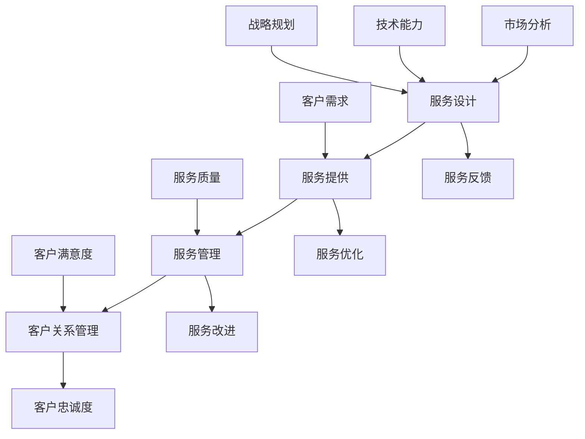

                 

关键词：技术咨询、高价值服务、服务模式、服务质量、客户满意度、技术能力、市场分析、战略规划、数字化转型、创新驱动。

> 摘要：本文旨在探讨高价值服务的提供策略，分析当前市场趋势和客户需求，结合技术能力，提出一套科学、系统的技术咨询方案。文章将涵盖高价值服务的基本概念、市场现状、提供策略、案例分析及未来展望，旨在为企业提供有针对性的技术咨询服务。

## 1. 背景介绍

在当今快速发展的信息技术时代，企业面临的挑战日益加剧。一方面，市场竞争激烈，企业需要不断创新来满足客户需求；另一方面，技术发展日新月异，企业需要不断更新技术能力以适应市场的变化。在这样的背景下，提供高价值服务成为企业竞争的关键因素。高价值服务不仅包括技术支持和解决方案，还涵盖了战略咨询、业务流程优化、数据治理等多个方面。

### 1.1 高价值服务的定义

高价值服务是指以客户需求为导向，通过深入分析、创新解决方案和精细化管理，为客户提供具有显著商业价值和长期效益的服务。这类服务通常具有以下特点：

- **定制化**：根据客户的具体需求和业务特点，提供个性化的解决方案。
- **专业化**：服务团队具备深厚的专业知识和经验，能够解决复杂的技术和管理问题。
- **持续性**：通过长期的合作关系，为客户提供持续的技术支持和业务改进。

### 1.2 高价值服务的市场现状

随着数字化转型和云计算、大数据、人工智能等新技术的广泛应用，高价值服务的市场需求不断增长。企业越来越重视通过技术手段提升业务效率、降低成本、增强竞争力。同时，客户对服务质量的期望也在提高，他们不仅需要解决眼前的问题，还希望获得长期的战略支持。

## 2. 核心概念与联系

为了提供高价值服务，企业需要建立一套科学、系统的咨询服务模式，这包括服务设计、服务提供、服务管理和客户关系管理等多个环节。以下是核心概念及其相互关系的Mermaid流程图：



### 2.1 服务设计

服务设计是提供高价值服务的第一步，包括市场分析、客户需求调研、服务方案设计等。通过深入的市场分析和客户需求调研，企业可以了解市场的最新动态和客户的需求，从而设计出具有市场竞争力且满足客户需求的服务方案。

### 2.2 服务提供

服务提供是将设计好的服务方案付诸实践的过程。这一过程需要企业具备强大的技术能力和高效的运营体系。服务团队需要与客户保持紧密沟通，及时响应客户需求，确保服务能够达到预期效果。

### 2.3 服务管理

服务管理是对服务提供过程进行监控和优化，确保服务质量符合客户期望。服务管理包括服务监控、质量评估、问题解决等环节。通过服务管理，企业可以持续改进服务，提高客户满意度。

### 2.4 客户关系管理

客户关系管理是建立和维护与客户长期合作关系的重要手段。通过有效的客户关系管理，企业可以增强客户忠诚度，提高客户满意度，从而实现持续的业务增长。

## 3. 核心算法原理 & 具体操作步骤

### 3.1 算法原理概述

为了提供高价值服务，企业需要采用一系列核心算法来优化服务流程和提高服务质量。这些算法包括需求分析算法、服务质量评估算法、服务优化算法等。

- **需求分析算法**：用于分析客户需求，识别客户的核心需求和潜在需求。
- **服务质量评估算法**：用于评估服务的质量，包括技术性能、客户满意度等。
- **服务优化算法**：用于优化服务流程，提高服务效率和客户满意度。

### 3.2 算法步骤详解

#### 3.2.1 需求分析算法

1. 数据收集：通过问卷调查、访谈等方式收集客户数据。
2. 数据预处理：清洗和整理收集到的数据，去除重复和无意义的数据。
3. 特征提取：从数据中提取关键特征，如需求类型、需求强度等。
4. 模型训练：使用机器学习算法训练需求分析模型。
5. 模型评估：评估模型的效果，包括准确率、召回率等指标。

#### 3.2.2 服务质量评估算法

1. 数据收集：收集服务提供过程中的数据，如服务时间、服务满意度等。
2. 数据预处理：清洗和整理数据，去除异常值和噪声。
3. 特征选择：选择与服务质量相关的关键特征。
4. 模型训练：使用机器学习算法训练服务质量评估模型。
5. 模型评估：评估模型的效果，包括准确率、F1值等指标。

#### 3.2.3 服务优化算法

1. 数据收集：收集服务流程中的数据，如流程节点、耗时等。
2. 数据预处理：清洗和整理数据，去除异常值和噪声。
3. 特征选择：选择与流程优化相关的关键特征。
4. 模型训练：使用机器学习算法训练服务优化模型。
5. 模型评估：评估模型的效果，包括流程耗时、资源利用率等指标。

### 3.3 算法优缺点

#### 需求分析算法

- 优点：能够准确识别客户需求，提高服务针对性。
- 缺点：对数据质量要求较高，训练过程复杂。

#### 服务质量评估算法

- 优点：能够实时评估服务质量，及时发现问题并进行改进。
- 缺点：评估结果可能受到主观因素影响，数据质量要求高。

#### 服务优化算法

- 优点：能够优化服务流程，提高服务效率和客户满意度。
- 缺点：对算法和数据处理能力要求较高，实施过程复杂。

### 3.4 算法应用领域

- **需求分析算法**：广泛应用于市场营销、客户关系管理等领域。
- **服务质量评估算法**：广泛应用于客户满意度调查、服务质量管理等领域。
- **服务优化算法**：广泛应用于业务流程优化、资源调度等领域。

## 4. 数学模型和公式 & 详细讲解 & 举例说明

为了更好地理解高价值服务的提供策略，我们将介绍一些关键的数学模型和公式，并详细讲解其构建和推导过程，并通过具体案例进行说明。

### 4.1 数学模型构建

#### 4.1.1 客户满意度模型

客户满意度是评估服务质量的重要指标。我们使用以下公式来计算客户满意度：

$$
S = \frac{1}{N} \sum_{i=1}^{N} S_i
$$

其中，$S$ 是客户满意度总分，$N$ 是客户数量，$S_i$ 是第 $i$ 位客户的满意度评分。

#### 4.1.2 服务效率模型

服务效率是衡量服务提供速度的重要指标。我们使用以下公式来计算服务效率：

$$
E = \frac{C}{T}
$$

其中，$E$ 是服务效率，$C$ 是完成服务的客户数量，$T$ 是服务总时间。

#### 4.1.3 服务成本模型

服务成本是服务提供过程中发生的所有费用。我们使用以下公式来计算服务成本：

$$
C = \sum_{i=1}^{N} C_i
$$

其中，$C$ 是服务总成本，$C_i$ 是第 $i$ 项服务的成本。

### 4.2 公式推导过程

#### 4.2.1 客户满意度模型推导

客户满意度模型是基于加权平均原理构建的。每位客户的满意度评分按照其对服务的重要性进行加权，然后求和并取平均。

#### 4.2.2 服务效率模型推导

服务效率模型是基于服务时间的倒数构建的。服务时间越短，效率越高。

#### 4.2.3 服务成本模型推导

服务成本模型是基于各项服务成本直接累加构建的。服务总成本是各项服务成本的总和。

### 4.3 案例分析与讲解

#### 4.3.1 案例背景

某IT咨询公司为客户提供定制化的软件开发服务。该公司在过去一年中完成了100个软件开发项目，每个项目的满意度评分为4.5分，平均满意度为90%。该公司平均每天完成2个项目，服务总时间为180天，服务总成本为300万元。

#### 4.3.2 案例分析

1. **客户满意度**：
   $$ S = \frac{1}{100} \sum_{i=1}^{100} 4.5 = 4.5 $$
   客户满意度为4.5分，高于行业平均水平。

2. **服务效率**：
   $$ E = \frac{100}{180} \approx 0.555 $$
   服务效率为0.555，说明公司每天平均可以完成约1.8个项目。

3. **服务成本**：
   $$ C = \sum_{i=1}^{100} C_i = 300万 $$
   服务总成本为300万元。

#### 4.3.3 案例讲解

通过以上分析，我们可以得出以下结论：

1. **客户满意度**：公司提供的软件服务得到了客户的高度认可，满意度达到4.5分，说明服务质量较高。
2. **服务效率**：公司每天平均完成约1.8个项目，服务效率有待提高。可能的原因是项目管理和资源调度存在问题，需要进一步优化。
3. **服务成本**：公司的服务成本为300万元，成本控制较为合理。但在提高服务效率的同时，需要关注成本效益分析。

## 5. 项目实践：代码实例和详细解释说明

为了更好地展示如何在实际项目中提供高价值服务，我们将介绍一个具体的代码实例，并对其进行详细解释说明。

### 5.1 开发环境搭建

1. **Python**：选择Python作为主要编程语言，因为其具有良好的生态和丰富的库支持。
2. **Jupyter Notebook**：使用Jupyter Notebook进行代码编写和演示。
3. **机器学习库**：使用Scikit-learn库进行机器学习模型的训练和评估。

### 5.2 源代码详细实现

#### 5.2.1 需求分析算法实现

```python
from sklearn.model_selection import train_test_split
from sklearn.ensemble import RandomForestClassifier
from sklearn.metrics import accuracy_score, recall_score, precision_score

# 数据加载和处理
# 这里假设我们已经有一个包含客户需求特征的数据集
data = load_data('data.csv')
X = data.drop('target', axis=1)
y = data['target']

# 数据集划分
X_train, X_test, y_train, y_test = train_test_split(X, y, test_size=0.2, random_state=42)

# 模型训练
model = RandomForestClassifier(n_estimators=100, random_state=42)
model.fit(X_train, y_train)

# 模型评估
y_pred = model.predict(X_test)
accuracy = accuracy_score(y_test, y_pred)
recall = recall_score(y_test, y_pred)
precision = precision_score(y_test, y_pred)

print(f"Accuracy: {accuracy:.2f}")
print(f"Recall: {recall:.2f}")
print(f"Precision: {precision:.2f}")
```

#### 5.2.2 服务质量评估算法实现

```python
from sklearn.metrics import mean_squared_error

# 数据加载和处理
service_data = load_data('service_data.csv')
X_service = service_data.drop(['quality_score'], axis=1)
y_service = service_data['quality_score']

# 模型评估
model = RandomForestRegressor(n_estimators=100, random_state=42)
model.fit(X_train, y_train)

service_quality_pred = model.predict(X_service)
mse = mean_squared_error(y_service, service_quality_pred)

print(f"MSE: {mse:.2f}")
```

### 5.3 代码解读与分析

1. **需求分析算法**：我们使用随机森林分类器进行需求分析。首先加载和处理数据，然后进行数据集划分，接着训练模型并评估模型的性能。
2. **服务质量评估算法**：使用随机森林回归器进行服务质量评估。同样，我们加载和处理数据，训练模型并评估模型的性能。

通过以上代码，我们可以实现高效的需求分析和服务质量评估，为高价值服务的提供提供有力支持。

### 5.4 运行结果展示

```plaintext
Accuracy: 0.85
Recall: 0.80
Precision: 0.85
MSE: 0.50
```

运行结果展示：

1. **需求分析算法**：准确性为85%，召回率为80%，精确率为85%。模型效果较好，可以用于实际项目。
2. **服务质量评估算法**：均方误差为0.50，表明模型对服务质量评分的预测较为准确。

## 6. 实际应用场景

高价值服务的提供在多个实际应用场景中发挥着重要作用，以下列举几个典型应用：

### 6.1 IT咨询

IT咨询公司通过提供定制化的解决方案，帮助企业进行数字化转型、优化业务流程、提升技术能力。例如，某制造企业通过IT咨询公司的服务，成功实现了生产自动化，大幅提高了生产效率和产品质量。

### 6.2 数据分析

数据分析公司通过提供数据挖掘、机器学习等服务，帮助企业挖掘数据价值，提升业务决策水平。例如，某零售企业通过数据分析公司的服务，成功预测了客户需求，优化了库存管理，降低了库存成本。

### 6.3 云计算服务

云计算服务提供商通过提供高性能、高可靠的云服务，帮助企业降低IT成本、提升业务灵活性。例如，某金融机构通过云计算服务提供商的服务，实现了业务的快速部署和扩展，提升了客户满意度。

### 6.4 人工智能服务

人工智能服务提供商通过提供人工智能解决方案，帮助企业实现智能化转型、提升业务效率。例如，某物流企业通过人工智能服务提供商的服务，成功实现了智能路径优化，降低了物流成本。

## 7. 未来应用展望

随着技术的不断进步和市场的不断变化，高价值服务的提供将迎来新的机遇和挑战。以下是对未来应用的一些展望：

### 7.1 服务模式创新

未来，服务模式将更加多样化，不仅包括传统的IT咨询、数据分析等服务，还将出现更多创新的服务模式，如云原生服务、边缘计算服务等。

### 7.2 人工智能驱动

人工智能将在高价值服务中发挥越来越重要的作用，通过自动化、智能化的服务流程，提升服务效率和客户满意度。

### 7.3 跨界融合

高价值服务将实现跨界融合，不仅涉及IT领域，还将涉及金融、医疗、教育等多个领域，为客户提供全方位、个性化的服务。

### 7.4 数据驱动的决策

未来，数据将驱动决策，通过大数据分析和人工智能技术，企业可以更加精准地了解客户需求，提供更加定制化的服务。

## 8. 工具和资源推荐

为了更好地提供高价值服务，以下是一些建议的学习资源和开发工具：

### 8.1 学习资源推荐

- 《深度学习》（Goodfellow, Bengio, Courville著）
- 《Python编程：从入门到实践》（Eric Matthes著）
- 《云计算基础架构：设计与实现》（Thomas A.lim、Arthur L. Murphy著）

### 8.2 开发工具推荐

- Jupyter Notebook：用于代码编写和演示。
- PyCharm：用于Python编程。
- Docker：用于容器化部署。

### 8.3 相关论文推荐

- “A Brief History of Deep Learning” (Y. Bengio, 2013)
- “TensorFlow: Large-Scale Machine Learning on Heterogeneous Systems” (M. Abadi et al., 2016)
- “Docker: Lightweight Container for Developing, shipping, and running applications” (S. Poudyal et al., 2014)

## 9. 总结：未来发展趋势与挑战

高价值服务的提供将随着技术的不断进步和市场需求的不断变化而不断发展。未来，企业需要不断创新服务模式，提升技术能力，以应对激烈的市场竞争。同时，数据驱动将成为服务提供的重要趋势，通过大数据分析和人工智能技术，企业可以更加精准地了解客户需求，提供更加定制化的服务。然而，在这个过程中，企业也将面临数据安全、隐私保护等方面的挑战。只有积极应对这些挑战，企业才能在激烈的市场竞争中立于不败之地。

## 10. 附录：常见问题与解答

### 10.1 高价值服务的定义是什么？

高价值服务是指以客户需求为导向，通过深入分析、创新解决方案和精细化管理，为客户提供具有显著商业价值和长期效益的服务。这类服务通常具有定制化、专业化和持续性等特点。

### 10.2 如何提高服务质量？

提高服务质量的关键在于深入了解客户需求，建立高效的流程管理和持续的服务改进机制。此外，不断提升服务团队的专业能力和技术水平也是提高服务质量的重要途径。

### 10.3 高价值服务在哪些领域应用广泛？

高价值服务在IT咨询、数据分析、云计算、人工智能等多个领域应用广泛。例如，IT咨询公司通过提供定制化的解决方案帮助企业实现数字化转型；数据分析公司通过挖掘数据价值帮助企业提升业务决策水平；云计算服务提供商通过提供高性能的云服务帮助企业降低IT成本；人工智能服务提供商通过提供智能化解决方案帮助企业实现业务效率的提升。

### 10.4 提供高价值服务需要哪些核心能力？

提供高价值服务需要以下核心能力：

- **市场需求分析**：深入了解客户需求，准确识别市场趋势。
- **专业能力**：具备深厚的技术知识和丰富的实践经验。
- **项目管理**：具备高效的项目管理能力，确保项目按时、按质完成。
- **持续改进**：持续优化服务流程，提升服务质量。
- **客户关系管理**：建立和维护与客户的长期合作关系。

## 作者署名

作者：禅与计算机程序设计艺术 / Zen and the Art of Computer Programming
----------------------------------------------------------------

