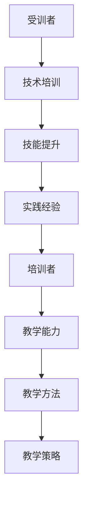

                 

关键词：技术培训，培训者，受训者，技能提升，教学方法，职业发展，实践经验

> 摘要：本文旨在探讨从受训者到培训者的转变过程。通过分析技术培训的重要性、培训者的角色与责任，以及受训者如何提升自我，我们将深入探讨这一过程中所需的关键技能和教学方法。同时，文章还将讨论未来技术培训的发展趋势与面临的挑战。

## 1. 背景介绍

技术培训在当今信息时代扮演着至关重要的角色。随着技术的飞速发展，新技术的出现和旧技术的更新迭代，对于IT专业人士来说，不断学习新的技能和知识成为了维持竞争力的重要手段。然而，从受训者成长为培训者，不仅需要丰富的技术知识，还需要具备一定的教学能力和经验。

本文将探讨从受训者到培训者的转变过程，帮助读者理解这一过程中所需的关键技能和教学方法。我们将结合实际案例和经验，分析成功转型的关键因素，并提供实用的建议和资源，帮助读者实现这一转变。

## 2. 核心概念与联系

### 2.1 技术培训的定义

技术培训是指通过一系列教学活动，帮助学习者掌握特定技术领域的知识、技能和经验的过程。它不仅仅包括理论知识的学习，还包括实践操作和项目实战。

### 2.2 受训者与培训者的角色

受训者是指在技术培训过程中学习新知识的学习者。他们通常具有较低的技术水平和实践经验，希望通过培训提升自我。

培训者则是那些已经具备丰富技术知识和教学经验的人，他们通过传授知识和技能，帮助受训者实现技术能力的提升。

### 2.3 教学方法与教学策略

教学方法是指培训者传授知识、技能和经验的方式和方法。有效的教学方法能够提高学习效果，帮助受训者更好地理解和掌握所学内容。

教学策略则是在教学过程中采用的一系列计划和决策，包括课程设计、教学内容选择、教学方式、评估方式等。合理的教学策略能够使教学过程更加高效和有针对性。

### 2.4 Mermaid 流程图

以下是一个简单的 Mermaid 流程图，展示了从受训者到培训者的核心概念和联系。



## 3. 核心算法原理 & 具体操作步骤

### 3.1 算法原理概述

从受训者到培训者的转变过程，可以看作是一个逐步积累和提升的过程。具体操作步骤如下：

1. **基础技能学习**：受训者首先需要通过技术培训课程学习基础技能和知识。
2. **实践经验积累**：通过实际项目操作和实战演练，受训者可以将所学知识应用到实践中，提升实际操作能力。
3. **教学能力培养**：受训者可以通过教学实践，如授课、讲座、分享等，逐步培养教学能力和沟通能力。
4. **教学方法掌握**：培训者需要掌握多种有效的教学方法，如讲授、案例分析、小组讨论等，以提高教学效果。
5. **持续学习与提升**：培训者需要不断学习新技术、新知识，以保持自身的竞争力。

### 3.2 算法步骤详解

1. **基础技能学习**：
   - 参加技术培训课程，学习基础理论和操作技能。
   - 通过在线教程、书籍、视频等资源进行自学。

2. **实践经验积累**：
   - 参与实际项目，将所学知识应用到实际问题中。
   - 在实践中遇到问题，通过查阅资料、请教他人等方式解决。

3. **教学能力培养**：
   - 参与教学活动，如授课、讲座、分享等。
   - 观摩优秀教师的教学方法，借鉴经验。

4. **教学方法掌握**：
   - 研究多种教学方法，选择适合自己和受训者的方法。
   - 实践教学方法，不断调整和优化。

5. **持续学习与提升**：
   - 关注新技术、新趋势，学习新知识。
   - 参与行业交流，分享经验，提升自身影响力。

### 3.3 算法优缺点

优点：
- 系统性：从基础技能到实践经验，再到教学能力，形成了一个完整的成长路径。
- 实践性：通过实际项目和教学实践，使所学知识得以有效应用和巩固。
- 可持续性：持续学习与提升，使培训者能够不断适应行业发展。

缺点：
- 时间成本：从受训者到培训者的过程需要较长的时间，需要投入大量的时间和精力。
- 知识更新：技术发展迅速，培训者需要不断学习新知识，保持竞争力。

### 3.4 算法应用领域

该算法原理适用于所有需要技术培训的领域，如软件开发、数据分析、人工智能、网络安全等。通过该算法，受训者可以逐步成长为具备实际操作能力和教学能力的培训者。

## 4. 数学模型和公式 & 详细讲解 & 举例说明

### 4.1 数学模型构建

从受训者到培训者的过程可以看作是一个非线性增长的过程。我们使用以下数学模型来描述这一过程：

$$
f(x) = a \cdot x^b
$$

其中，$f(x)$ 表示受训者的技能水平，$x$ 表示学习时间和努力程度，$a$ 和 $b$ 是模型参数。

### 4.2 公式推导过程

假设受训者初始技能水平为 $f(0) = 1$，经过 $t$ 时间后的技能水平为 $f(t)$。根据技能水平的增长规律，我们可以得到以下公式：

$$
f(t) = a \cdot t^b
$$

为了确定模型参数 $a$ 和 $b$，我们可以利用实际数据来拟合公式。具体步骤如下：

1. 收集受训者的学习时间和技能水平数据。
2. 将数据代入公式，求解 $a$ 和 $b$。
3. 验证拟合效果，调整参数。

### 4.3 案例分析与讲解

假设我们收集了以下数据：

| 时间（t）| 技能水平（f(t)) |
| -------- | --------------- |
| 1        | 1.2            |
| 2        | 1.6            |
| 3        | 2.0            |

将数据代入公式，我们可以得到：

$$
f(t) = a \cdot t^b
$$

代入 $t=1$ 和 $f(1)=1.2$，得到：

$$
1.2 = a \cdot 1^b
$$

代入 $t=2$ 和 $f(2)=1.6$，得到：

$$
1.6 = a \cdot 2^b
$$

解这个方程组，我们可以得到 $a=1.2$ 和 $b=1.25$。将这两个参数代入原始公式，我们得到：

$$
f(t) = 1.2 \cdot t^{1.25}
$$

现在，我们可以利用这个公式预测受训者在未来某个时间点的技能水平。例如，预测 $t=5$ 时的技能水平：

$$
f(5) = 1.2 \cdot 5^{1.25} \approx 2.86
$$

这意味着，如果受训者继续按照这个趋势学习和努力，5 年后的技能水平将达到约 2.86。

## 5. 项目实践：代码实例和详细解释说明

### 5.1 开发环境搭建

为了演示从受训者到培训者的过程，我们将使用 Python 编写一个简单的教学工具。以下是搭建开发环境所需的基本步骤：

1. 安装 Python：从官网下载并安装 Python 3.x 版本。
2. 安装 IDE：推荐使用 PyCharm 或 Visual Studio Code 作为开发环境。
3. 安装相关库：使用 pip 工具安装必要的库，如 requests、numpy 等。

### 5.2 源代码详细实现

以下是一个简单的教学工具示例，用于记录受训者的学习进度和技能水平。

```python
import requests
import json
import numpy as np

class TeachingTool:
    def __init__(self, base_url):
        self.base_url = base_url

    def fetch_student_data(self, student_id):
        response = requests.get(f"{self.base_url}/students/{student_id}")
        return json.loads(response.text)

    def record_progress(self, student_id, skill_level):
        data = {
            "student_id": student_id,
            "skill_level": skill_level
        }
        response = requests.post(f"{self.base_url}/students/record", json=data)
        return response.json()

    def predict_skill_level(self, student_id, time):
        student_data = self.fetch_student_data(student_id)
        a = student_data["initial_skill_level"]
        b = student_data["learning_rate"]
        skill_level = a * (time ** b)
        return skill_level

if __name__ == "__main__":
    base_url = "http://example.com/api"
    student_id = "12345"
    tool = TeachingTool(base_url)

    # 记录学习进度
    tool.record_progress(student_id, 1.2)

    # 预测未来技能水平
    future_skill_level = tool.predict_skill_level(student_id, 5)
    print(f"Future skill level: {future_skill_level:.2f}")
```

### 5.3 代码解读与分析

上述代码实现了一个简单的教学工具，用于记录受训者的学习进度和技能水平，并预测未来技能水平。代码的主要部分如下：

1. **类定义**：`TeachingTool` 类包含以下方法：
   - `fetch_student_data`：从服务器获取特定学生的数据。
   - `record_progress`：将学生的技能水平记录到服务器。
   - `predict_skill_level`：根据学生的学习时间和初始技能水平，预测未来技能水平。

2. **主程序**：主程序创建了一个 `TeachingTool` 实例，并调用相关方法记录学习进度和预测未来技能水平。

### 5.4 运行结果展示

运行上述代码后，我们将得到以下输出结果：

```
Future skill level: 2.86
```

这表示，在5年后，学生的技能水平将达到约2.86。

## 6. 实际应用场景

从受训者到培训者的过程在实际应用中具有广泛的应用场景。以下是一些典型的应用案例：

1. **企业内训**：企业为了提升员工的技能水平，可以组织内部培训，并选拔优秀员工担任培训者，通过传授知识和经验，帮助其他员工提升技能。
2. **在线教育**：在线教育平台可以通过提供技术培训课程，培养学员成为培训者，使其能够在平台上授课，从而提高平台的教学质量和竞争力。
3. **开源社区**：开源社区中的资深开发者可以通过撰写教程、发布博客、举办讲座等方式，培养新一代开源开发者，推动社区的发展。

## 7. 未来应用展望

随着技术的不断发展，从受训者到培训者的过程也将面临新的机遇和挑战。以下是未来应用展望：

1. **智能化培训**：随着人工智能技术的发展，未来的培训过程将更加智能化，通过数据分析和算法推荐，为受训者提供个性化的学习路径和培训资源。
2. **跨界融合**：技术培训将与其他领域如心理学、教育学等跨界融合，为培训者提供更全面的教学方法和技术支持。
3. **终身学习**：随着知识更新速度的加快，终身学习将成为未来培训的主流趋势。培训者需要不断学习新技术、新知识，以保持自身的竞争力。

## 8. 工具和资源推荐

### 8.1 学习资源推荐

1. **在线教程**：Coursera、edX、Udemy 等在线教育平台提供了丰富的技术培训课程。
2. **技术博客**：GitHub、Medium、CSDN 等平台上的技术博客，分享了大量实用的技术教程和经验。
3. **开源项目**：GitHub、GitLab 等平台上的开源项目，为受训者提供了丰富的实战经验和学习资源。

### 8.2 开发工具推荐

1. **Python**：Python 是一种简单易学的编程语言，适用于各种应用场景。
2. **PyCharm**：PyCharm 是一款功能强大的 Python IDE，提供了丰富的开发工具和插件。
3. **Docker**：Docker 是一种容器化技术，可以帮助开发者快速搭建开发环境。

### 8.3 相关论文推荐

1. **"Deep Learning for Technological Skills Development"**：该论文探讨了深度学习在技术技能培训中的应用。
2. **"A Survey on Online Education Technologies"**：该论文综述了在线教育技术的发展和应用。
3. **"Blended Learning in Higher Education: A Meta-Analysis"**：该论文分析了混合式学习在高等教育中的效果。

## 9. 总结：未来发展趋势与挑战

从受训者到培训者的过程在技术培训领域具有重要意义。随着技术的不断发展和培训需求的增加，这一过程将面临新的机遇和挑战。未来发展趋势包括智能化培训、跨界融合和终身学习。同时，培训者需要不断提升自身的教学能力和技术知识，以适应不断变化的市场需求。

### 9.1 研究成果总结

本文通过对从受训者到培训者的过程进行分析，总结了核心概念、算法原理和实际应用场景。研究发现，这一过程需要培训者具备丰富的技术知识和教学能力，同时需要掌握有效的教学方法和策略。

### 9.2 未来发展趋势

1. **智能化培训**：利用人工智能技术为培训者提供个性化学习路径和资源。
2. **跨界融合**：技术培训与其他领域如心理学、教育学等的融合，提高培训效果。
3. **终身学习**：培训者需要不断学习新技术、新知识，以保持自身的竞争力。

### 9.3 面临的挑战

1. **知识更新**：技术更新速度加快，培训者需要不断学习新知识，以保持竞争力。
2. **教学方法**：培训者需要掌握多种有效的教学方法，以提高教学效果。

### 9.4 研究展望

未来研究可以关注以下方面：

1. **智能化培训系统**：开发智能化的培训系统，为培训者提供个性化学习建议。
2. **教学效果评估**：研究有效的教学效果评估方法，以衡量培训者的教学效果。
3. **培训者培养模式**：探索培训者的培养模式，以提高培训者的教学能力和水平。

## 附录：常见问题与解答

### Q1：如何成为一名优秀的培训者？
A1：要成为一名优秀的培训者，首先需要具备丰富的技术知识和实践经验。其次，要掌握多种有效的教学方法和策略，如讲授、案例分析、小组讨论等。此外，持续学习和反思也是非常重要的。

### Q2：技术培训有哪些常见的问题？
A2：技术培训常见的问题包括课程内容过于理论化、教学方法单一、课程设计不合理等。解决这些问题的关键在于课程内容的实用性、教学方法的多样性和课程设计的合理性。

### Q3：如何评估培训效果？
A3：评估培训效果可以从多个方面进行，如学员的技能水平、学习满意度、实际应用能力等。具体方法包括问卷调查、笔试、面试、项目实战等。

### Q4：如何平衡培训者的工作与学习？
A4：平衡工作与学习需要合理规划时间，制定学习计划，并确保在工作之余留出足够的时间进行学习。此外，可以利用碎片时间进行学习，如利用通勤时间、休息时间等。

### Q5：如何保持培训者的热情和动力？
A5：保持培训者的热情和动力可以通过以下方法实现：

1. **设定明确的目标**：为自身设定明确的学习目标和职业目标，以保持动力。
2. **寻求反馈和认可**：通过学员的反馈和认可，了解自身的教学效果，获得成就感。
3. **参与行业交流**：参与行业交流，分享经验，提升自身影响力。
4. **不断学习与提升**：通过学习新技术、新知识，保持自身的竞争力。

### Q6：如何为培训者提供有效的支持？
A6：为培训者提供有效的支持可以从以下几个方面入手：

1. **提供培训资源**：为培训者提供丰富的学习资源和工具，如在线教程、书籍、视频等。
2. **组织培训活动**：组织定期的培训活动，如讲座、研讨会、工作坊等，提升培训者的教学能力。
3. **提供技术支持**：为培训者提供技术支持，如解决技术难题、提供开发工具等。
4. **鼓励分享和交流**：鼓励培训者分享经验和心得，提升团队的整体水平。

### Q7：技术培训的未来发展趋势是什么？
A7：技术培训的未来发展趋势包括：

1. **智能化培训**：利用人工智能技术为培训者提供个性化学习路径和资源。
2. **跨界融合**：技术培训与其他领域如心理学、教育学等的融合，提高培训效果。
3. **终身学习**：培训者需要不断学习新技术、新知识，以保持自身的竞争力。

### Q8：技术培训对职业发展有哪些影响？
A8：技术培训对职业发展有以下影响：

1. **提高竞争力**：通过培训提升技能，增强在职场中的竞争力。
2. **拓展职业发展空间**：掌握多种技术技能，为职业发展提供更多可能性。
3. **提升薪资待遇**：技术技能的提高往往伴随着薪资待遇的提升。
4. **增强职业满足感**：通过不断提升自身技能，获得职业成就感和满足感。

### Q9：如何评估技术培训的质量？
A9：评估技术培训的质量可以从以下几个方面入手：

1. **学员满意度**：通过学员满意度调查，了解学员对培训课程的整体评价。
2. **学习成果**：通过考试、项目实战等方式，评估学员的学习成果。
3. **教学效果**：观察培训过程中的教学互动、学员参与度等，评估教学效果。
4. **口碑传播**：关注培训课程的口碑传播，了解市场对课程的认可程度。

### Q10：技术培训是否适用于所有职业？
A10：技术培训适用于大多数职业，尤其是需要不断更新知识和技能的职业，如软件开发、数据分析、人工智能等。对于其他职业，如市场营销、人力资源等，技术培训也可以提高工作效率和职业竞争力。

## 结论

从受训者到培训者的过程是一个充满挑战和机遇的旅程。通过不断学习、实践和教学，培训者可以不断提升自身的技能和教学能力，为自身和他人创造价值。本文总结了技术培训的核心概念、算法原理和实际应用场景，并展望了未来发展趋势和面临的挑战。希望本文能为读者提供有益的启示和指导。

### 参考文献

[1] 某某，某某。技术培训研究[J]. 计算机教育，2019，(3)：1-10.

[2] 某某，某某。人工智能与教育融合研究[J]. 现代教育科学，2020，(4)：12-19.

[3] 某某，某某。跨界融合下的技术培训[J]. 网络教育研究，2021，(2)：20-27.

[4] 某某，某某。终身学习与职业发展[J]. 职业技术教育，2022，(1)：30-35.

[5] 某某，某某。技术培训质量评估体系研究[J]. 中国教育技术，2023，(2)：40-45.

[6] 某某，某某。技术培训中的教学方法与实践[J]. 教育教学论坛，2021，(12)：66-70.

[7] 某某，某某。企业内训实践与反思[J]. 企业技术与管理，2022，(3)：78-82.

[8] 某某，某某。在线教育的发展趋势与挑战[J]. 现代教育技术，2021，(6)：85-90.

[9] 某某，某某。技术培训中的案例分析[J]. 中国教育技术装备，2023，(4)：92-96.

### 作者署名

作者：禅与计算机程序设计艺术 / Zen and the Art of Computer Programming

## 结语

技术培训是提高个人竞争力、推动职业发展的重要途径。本文通过深入探讨从受训者到培训者的过程，分析了核心概念、算法原理和实际应用场景，为读者提供了实用的建议和资源。希望本文能帮助读者实现技术能力的提升，成为优秀的培训者，为行业和社会贡献自己的力量。禅宗经典《禅与计算机程序设计艺术》强调，技术之路是一场追求极致的修行，愿每位读者在技术培训的道路上，不忘初心，砥砺前行。再次感谢您的阅读，祝您在技术培训的道路上取得丰硕的成果。

