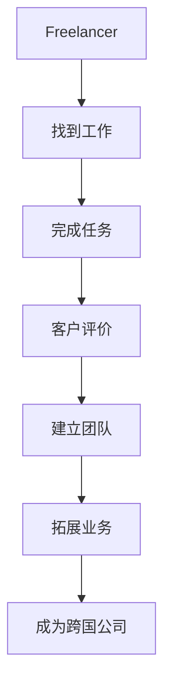

                 

关键词：技术外包、freelancer、跨国外包、项目管理、软件开发、团队协作

> 摘要：本文将探讨技术外包的发展历程，从个体freelancer到跨国外包公司的转变。我们将分析技术外包的现状、优势、挑战以及未来趋势，并提供实用的建议和资源，帮助读者深入了解并成功涉足这一领域。

## 1. 背景介绍

技术外包，也称为软件外包或IT外包，是指一家公司将其软件项目或IT服务委托给另一家专业公司或个体开发者完成。这一现象在全球范围内日益普及，尤其是在软件产业蓬勃发展的今天。技术外包的起源可以追溯到20世纪80年代，当时企业开始意识到，将非核心业务外包给专业的服务提供商可以降低成本、提高效率。

随着互联网的普及和全球化的加速，技术外包的范围和规模不断扩大。从最初的本地服务扩展到跨国家和跨地区的合作，外包公司可以通过远程协作完成复杂的软件项目，为客户提供高质量的服务。

在这个背景下，freelancer（自由职业者）的角色变得越来越重要。他们通常拥有某一领域的专业技能，可以通过远程工作平台（如Upwork、Freelancer）与世界各地的企业合作，完成各种软件开发和维护任务。

然而，随着市场的成熟和客户需求的多样化，单打独斗的freelancer逐渐意识到，要在一个竞争激烈的市场中立足，他们需要组建团队，形成自己的品牌，甚至发展成跨国外包公司。这种转变不仅带来了新的机遇，也带来了新的挑战。

## 2. 核心概念与联系

### 2.1 技术外包的概念

技术外包是指企业将原本内部完成的软件项目、IT服务或其他技术任务委托给外部公司或个体开发者完成。这可以包括但不限于以下方面：

- 软件开发：包括应用软件、系统软件、嵌入式软件等。
- IT运维：如服务器管理、网络维护、数据备份等。
- 咨询服务：如IT战略规划、系统架构设计等。

### 2.2 freelancer的角色

freelancer是技术外包的重要组成部分。他们通常具备以下特点：

- 自由职业：不受雇于任何公司，可以自由选择工作时间和地点。
- 专业技能：通常在某一技术领域有深厚的专业知识和经验。
- 灵活性：可以根据客户的需求快速调整工作内容。

### 2.3 跨国外包公司的架构

跨国外包公司是在全球范围内开展业务的IT服务提供商。其架构通常包括：

- 项目管理团队：负责项目的规划、执行和监控。
- 技术团队：由各种专业技术人员组成，负责具体的软件开发和运维任务。
- 支持团队：包括市场营销、客户服务、财务等，为公司的运营提供支持。

### 2.4 Mermaid流程图



## 3. 核心算法原理 & 具体操作步骤

### 3.1 算法原理概述

技术外包的核心在于项目的管理和执行。以下是几个关键步骤：

1. 项目规划：明确项目的目标、范围、时间表和预算。
2. 团队组建：根据项目需求组建合适的技术团队。
3. 项目执行：按照规划进行软件开发和运维任务。
4. 项目监控：实时监控项目的进展，确保符合客户需求。
5. 项目交付：完成所有任务，交付给客户。

### 3.2 算法步骤详解

1. **项目规划**

   - **需求分析**：与客户沟通，了解项目需求和期望。
   - **范围界定**：明确项目的范围，避免范围蔓延。
   - **时间表制定**：根据任务复杂度和资源情况制定时间表。
   - **预算估算**：评估项目的成本，确保预算合理。

2. **团队组建**

   - **人员选择**：根据项目需求选择合适的团队成员。
   - **技能组合**：确保团队中涵盖所有必要的技能。
   - **沟通机制**：建立有效的沟通渠道，确保团队协作。

3. **项目执行**

   - **任务分解**：将项目分解为可管理的任务。
   - **进度安排**：根据时间表安排任务进度。
   - **质量保证**：确保每个任务都达到质量标准。

4. **项目监控**

   - **进度跟踪**：实时跟踪任务进度，确保项目按计划进行。
   - **风险控制**：识别潜在风险，并采取措施进行控制。
   - **问题解决**：及时解决项目中的问题，确保项目顺利推进。

5. **项目交付**

   - **成果验收**：与客户一起验收项目成果。
   - **文档交付**：提供完整的项目文档，包括设计文档、代码注释等。
   - **后续支持**：提供必要的后续支持，确保客户满意。

### 3.3 算法优缺点

- **优点**：

  - **成本效益**：企业可以通过外包降低软件开发和维护成本。
  - **灵活性**：可以根据项目需求灵活选择外包团队和人员。
  - **专业优势**：外包团队通常在某些领域有深厚的专业知识和经验。

- **缺点**：

  - **沟通挑战**：跨国外包可能带来沟通障碍。
  - **质量控制**：外包项目的质量难以完全控制。
  - **依赖性**：企业对外包团队过于依赖，可能导致自主创新能力下降。

### 3.4 算法应用领域

- **软件开发**：外包公司可以为企业提供定制化的软件解决方案。
- **IT运维**：外包团队可以负责企业IT系统的维护和升级。
- **咨询服务**：外包公司可以提供IT战略规划、系统架构设计等咨询服务。

## 4. 数学模型和公式 & 详细讲解 & 举例说明

### 4.1 数学模型构建

技术外包中的关键数学模型包括成本效益分析模型、风险评估模型和时间规划模型。

### 4.2 公式推导过程

- **成本效益分析模型**：

  $$\text{成本效益比} = \frac{\text{外包成本}}{\text{自建成本} - \text{外包成本}}$$

- **风险评估模型**：

  $$\text{风险指数} = \text{概率} \times \text{影响程度}$$

- **时间规划模型**：

  $$\text{完成时间} = \sum_{i=1}^{n} (\text{任务} \times \text{时间})$$

### 4.3 案例分析与讲解

以一家小型初创公司为例，他们决定将一个移动应用的开发任务外包给一家专业的软件开发公司。

- **成本效益分析**：

  $$\text{成本效益比} = \frac{30,000}{100,000 - 30,000} = 0.67$$

  结果表明，外包成本仅占自建成本的约67%，具有明显的成本效益。

- **风险评估**：

  假设风险概率为0.5，影响程度为3个月延误。

  $$\text{风险指数} = 0.5 \times 3 = 1.5$$

  风险指数表明，外包项目存在较高的延误风险。

- **时间规划**：

  任务列表包括需求分析（2周）、UI设计（3周）、后端开发（4周）和前端开发（3周）。

  $$\text{完成时间} = 2 + 3 + 4 + 3 = 12 \text{周}$$

  预计项目将在12周内完成。

## 5. 项目实践：代码实例和详细解释说明

### 5.1 开发环境搭建

为了实现一个简单的Web应用，我们选择使用Python和Flask作为后端开发框架，HTML、CSS和JavaScript作为前端技术。

### 5.2 源代码详细实现

以下是项目的核心代码：

```python
# app.py

from flask import Flask, render_template

app = Flask(__name__)

@app.route('/')
def home():
    return render_template('home.html')

if __name__ == '__main__':
    app.run(debug=True)
```

```html
<!-- home.html -->

<!DOCTYPE html>
<html>
<head>
    <title>Home</title>
</head>
<body>
    <h1>Welcome to the Home Page</h1>
</body>
</html>
```

### 5.3 代码解读与分析

上述代码实现了一个简单的Web应用，其中`app.py`是后端代码，用于处理HTTP请求并返回响应。`home.html`是前端页面，用于展示内容。

### 5.4 运行结果展示

运行`app.py`后，在浏览器中输入`http://127.0.0.1:5000/`，将显示一个欢迎页面。

## 6. 实际应用场景

技术外包在各个行业都有广泛的应用，以下是几个实际应用场景：

- **金融行业**：金融公司通常将风险管理、数据分析等任务外包给专业的外包公司。
- **医疗行业**：医疗行业的外包包括电子病历管理、医疗数据分析等。
- **电子商务**：电商平台通常将网站开发、移动应用开发等任务外包。

## 7. 未来应用展望

随着技术的不断进步，技术外包将迎来更多的发展机遇。以下是几个未来应用展望：

- **人工智能**：人工智能外包将逐渐成为主流，为企业提供智能化的解决方案。
- **云计算**：云计算外包将为企业提供更灵活、高效的IT服务。
- **区块链**：区块链外包将为企业提供安全的交易和数据管理服务。

## 8. 工具和资源推荐

为了更好地开展技术外包业务，以下是几个推荐的学习资源和开发工具：

### 8.1 学习资源推荐

- **技术博客**：如GitHub、Stack Overflow等。
- **在线课程**：如Coursera、edX等。
- **专业书籍**：如《敏捷软件开发》、《项目化管理》等。

### 8.2 开发工具推荐

- **集成开发环境（IDE）**：如Visual Studio Code、PyCharm等。
- **版本控制**：如Git、SVN等。
- **项目管理工具**：如JIRA、Trello等。

### 8.3 相关论文推荐

- **《外包软件开发中的风险管理与策略选择》**
- **《跨国外包项目中的沟通策略研究》**
- **《技术外包对中小企业的影响》**

## 9. 总结：未来发展趋势与挑战

技术外包作为一个快速发展的领域，未来将面临诸多机遇和挑战。以下是对未来发展趋势与挑战的总结：

### 9.1 研究成果总结

- 技术外包在全球范围内得到广泛应用，市场规模持续增长。
- 人工智能、云计算等新兴技术的兴起，为技术外包带来了更多机遇。
- 跨国外包项目中的沟通和管理成为研究热点。

### 9.2 未来发展趋势

- 技术外包将更加注重人工智能和自动化技术的应用。
- 跨国外包项目将更加关注文化和语言差异的解决。
- 个性化服务和定制化解决方案将成为主流。

### 9.3 面临的挑战

- **沟通障碍**：跨国外包项目中的沟通障碍可能影响项目进展。
- **质量控制**：外包项目的质量难以完全控制，需要建立有效的质量保证体系。
- **依赖性**：企业对外包团队的依赖可能导致自主创新能力的下降。

### 9.4 研究展望

- **跨国外包项目的风险管理**：深入研究跨国外包项目的风险管理和策略选择。
- **外包团队的建设与管理**：探索如何构建高效的外包团队，提高项目成功率。
- **新兴技术的应用**：研究新兴技术在技术外包中的应用，如人工智能、区块链等。

## 附录：常见问题与解答

### 1. 技术外包的优势是什么？

技术外包的优势包括降低成本、提高效率、获取专业知识和灵活性。

### 2. 技术外包的常见风险有哪些？

技术外包的常见风险包括沟通障碍、质量控制问题和依赖性。

### 3. 如何选择合适的外包团队？

选择合适的外包团队应考虑其专业技能、项目经验和团队协作能力。

### 4. 跨国外包项目如何解决文化差异问题？

跨国外包项目可以通过文化培训、明确沟通标准和建立跨文化团队来解决文化差异问题。

### 5. 技术外包的未来发展趋势是什么？

技术外包的未来发展趋势包括人工智能和自动化技术的应用、跨国外包项目的文化差异解决和个性化服务的普及。

### 6. 技术外包对中小企业的影响是什么？

技术外包可以帮助中小企业降低成本、提高效率和获取专业支持，从而增强市场竞争力。

### 7. 如何确保外包项目的质量？

确保外包项目的质量可以通过建立有效的质量保证体系、定期进行项目评估和与外包团队保持紧密沟通来实现。

### 8. 技术外包中的知识产权保护如何进行？

技术外包中的知识产权保护可以通过签订知识产权保护协议、明确项目成果的知识产权归属和采取技术手段进行保护来实现。

### 9. 技术外包中的合同管理如何进行？

技术外包中的合同管理可以通过制定详细的合同条款、明确双方的权利和义务和建立合同执行的监控机制来实现。

### 10. 技术外包中的支付方式有哪些？

技术外包中的支付方式包括按项目进度支付、固定价格支付和利润分成支付等。选择合适的支付方式应考虑项目的复杂度和风险。 

---
**作者：禅与计算机程序设计艺术 / Zen and the Art of Computer Programming**

