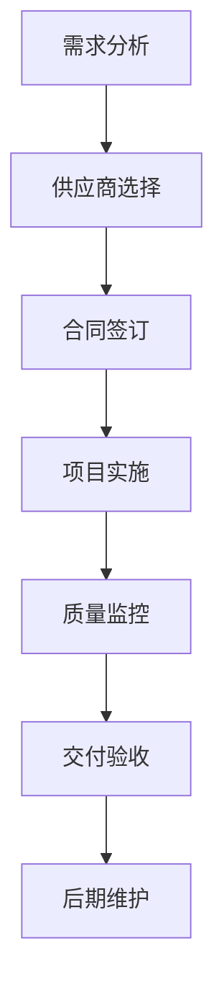

                 

关键词：技术外包、项目管理、团队建设、流程优化、成本控制、效率提升、合作模式、技能匹配、风险预防

> 摘要：随着全球经济的快速发展，技术外包已成为企业降低成本、提高效率的重要手段。本文将深入探讨技术外包的整个生命周期，从接单、团队组建、项目管理到最终交付，提供实用的策略和建议，帮助企业实现技术外包的优化和成功。

## 1. 背景介绍

技术外包，作为现代企业的一项重要战略，可以为企业带来诸多益处。首先，外包能够帮助企业集中资源，专注于核心业务，从而提高效率和竞争力。其次，外包可以降低成本，通过利用外部专业团队的技能和资源，企业可以避免昂贵的设备投资和人才招聘成本。此外，外包还能帮助企业快速响应市场变化，灵活调整业务策略。

然而，技术外包并非易事。在实施过程中，企业常常面临项目范围蔓延、成本超支、质量控制难、沟通障碍等问题。因此，如何有效地管理技术外包项目，确保外包合作成功，成为企业亟需解决的问题。

本文将围绕技术外包的各个环节，提供实用的指导和建议，帮助企业顺利实现技术外包的目标。

## 2. 核心概念与联系

### 2.1 技术外包的定义

技术外包是指企业将部分或全部信息技术服务外包给第三方专业团队，以实现成本节约、效率提升和业务扩展的目的。

### 2.2 技术外包的组成部分

技术外包主要包括以下几个组成部分：

- **需求分析**：明确外包项目的具体需求和目标，制定详细的任务清单。
- **供应商选择**：通过招标、比选等方式，选择合适的外包供应商。
- **合同签订**：与供应商签订正式的合同，明确双方的权利和义务。
- **项目实施**：根据合同规定，进行外包项目的具体实施和执行。
- **质量监控**：对项目实施过程进行质量监控，确保项目达到预期目标。
- **交付验收**：项目完成后，进行交付验收，确保交付成果符合要求。
- **后期维护**：项目交付后，进行必要的维护和支持，确保系统的稳定运行。

### 2.3 技术外包与内部开发的对比

- **成本**：外包通常能显著降低成本，但可能存在质量控制风险。
- **效率**：外包可以快速获得专业团队的支持，提高项目效率。
- **风险**：外包项目的风险相对较高，需要严格管理。
- **灵活性**：外包项目通常更具灵活性，能快速响应市场需求。

### 2.4 Mermaid 流程图



## 3. 核心算法原理 & 具体操作步骤

### 3.1 算法原理概述

技术外包的核心在于高效的项目管理和团队协作。以下是技术外包的基本原理和操作步骤：

- **需求分析**：通过调研和分析，明确项目需求和目标，确保项目能够按时、按质完成。
- **供应商选择**：通过招标、比选等方式，选择合适的外包供应商，确保其具有专业的技能和经验。
- **合同签订**：明确双方的权利和义务，确保项目的顺利进行。
- **项目实施**：根据合同规定，制定详细的项目计划，确保项目按计划进行。
- **质量监控**：对项目实施过程进行质量监控，确保项目达到预期目标。
- **交付验收**：项目完成后，进行交付验收，确保交付成果符合要求。
- **后期维护**：项目交付后，进行必要的维护和支持，确保系统的稳定运行。

### 3.2 算法步骤详解

1. **需求分析**：与客户沟通，明确项目需求和目标，制定详细的任务清单。
2. **供应商选择**：通过招标、比选等方式，选择合适的外包供应商，评估其技术能力、服务质量和响应速度。
3. **合同签订**：与供应商签订正式的合同，明确双方的权利和义务，包括项目范围、交付标准、费用支付等。
4. **项目实施**：根据合同规定，制定详细的项目计划，包括时间表、资源分配、风险评估等。
5. **质量监控**：对项目实施过程进行质量监控，确保项目达到预期目标，包括定期汇报、项目评审等。
6. **交付验收**：项目完成后，进行交付验收，确保交付成果符合要求，包括功能测试、性能测试等。
7. **后期维护**：项目交付后，进行必要的维护和支持，确保系统的稳定运行，包括技术支持、故障排除等。

### 3.3 算法优缺点

#### 优点：

- **降低成本**：通过外包，企业可以避免昂贵的设备投资和人才招聘成本。
- **提高效率**：外包团队通常具有专业的技能和经验，能快速响应市场需求。
- **灵活性**：外包项目通常更具灵活性，能快速调整业务策略。

#### 缺点：

- **质量控制难**：外包项目的质量控制难度较高，需要严格管理。
- **沟通障碍**：企业与外包团队之间的沟通可能存在障碍，影响项目进度。

### 3.4 算法应用领域

技术外包广泛应用于软件开发、IT维护、系统集成、数据分析等领域。以下是一些具体的案例：

- **软件开发**：企业可以将软件开发的某些模块或功能外包给专业团队，以快速实现产品开发。
- **IT维护**：企业可以将IT系统的维护工作外包给专业公司，确保系统的稳定运行。
- **系统集成**：企业可以将系统集成的工作外包给具备专业能力的团队，提高系统集成效率。
- **数据分析**：企业可以将数据分析的工作外包给专业团队，利用外部数据专家的优势。

## 4. 数学模型和公式 & 详细讲解 & 举例说明

### 4.1 数学模型构建

在技术外包项目中，成本控制和效率提升是关键。以下是一个简化的数学模型，用于评估外包项目的成本和效率：

- **成本模型**：C = C1 + C2 + C3
  - C1：固定成本，包括设备投资、人力资源等。
  - C2：可变成本，包括外包费用、项目管理费用等。
  - C3：间接成本，包括风险成本、沟通成本等。

- **效率模型**：E = E1 + E2 + E3
  - E1：内部开发效率，基于企业自身的技术水平和资源。
  - E2：外包团队效率，基于外包团队的技术能力和经验。
  - E3：协调效率，基于企业与外包团队之间的沟通和协作。

### 4.2 公式推导过程

#### 成本模型推导

- **固定成本**：C1 = K1 * T1
  - K1：每项资源的价格。
  - T1：所需的资源数量。

- **可变成本**：C2 = K2 * T2
  - K2：每项外包服务的价格。
  - T2：所需的外包服务数量。

- **间接成本**：C3 = K3 * T3
  - K3：每项间接成本的价格。
  - T3：所需的间接成本数量。

#### 效率模型推导

- **内部开发效率**：E1 = P1 * T1
  - P1：内部开发人员的生产率。
  - T1：内部开发所需的时间。

- **外包团队效率**：E2 = P2 * T2
  - P2：外包团队的生产率。
  - T2：外包团队完成工作所需的时间。

- **协调效率**：E3 = P3 * T3
  - P3：协调人员的生产率。
  - T3：协调所需的时间。

### 4.3 案例分析与讲解

假设一家企业计划开发一款新的软件产品，决定采用技术外包的方式进行。以下是具体的成本和效率分析：

#### 成本分析

- **固定成本**：C1 = 1000美元/月 * 6个月 = 6000美元
- **可变成本**：C2 = 2000美元/月 * 6个月 = 12000美元
- **间接成本**：C3 = 500美元/月 * 6个月 = 3000美元
- **总成本**：C = C1 + C2 + C3 = 6000美元 + 12000美元 + 3000美元 = 21000美元

#### 效率分析

- **内部开发效率**：E1 = 1000行代码/月 * 6个月 = 6000行代码
- **外包团队效率**：E2 = 1500行代码/月 * 6个月 = 9000行代码
- **协调效率**：E3 = 200行代码/月 * 6个月 = 1200行代码
- **总效率**：E = E1 + E2 + E3 = 6000行代码 + 9000行代码 + 1200行代码 = 16200行代码

通过以上分析，我们可以得出以下结论：

- **成本优势**：外包方式的总成本为21000美元，比内部开发方式的总成本（包括固定成本和可变成本）更低。
- **效率优势**：外包团队的总效率更高，能够更快速地完成开发工作。

然而，需要注意的是，外包项目存在一定的风险，如质量控制问题和沟通障碍。因此，企业在选择外包供应商时，应严格评估其技术能力和服务质量，确保项目的成功实施。

## 5. 项目实践：代码实例和详细解释说明

### 5.1 开发环境搭建

在本案例中，我们将使用Java语言进行软件开发，开发环境包括JDK 11、Eclipse IDE、Maven构建工具等。以下是开发环境的搭建步骤：

1. **安装JDK**：下载并安装JDK 11，配置环境变量。
2. **安装Eclipse**：下载并安装Eclipse IDE，配置Java开发插件。
3. **安装Maven**：下载并安装Maven，配置Maven环境变量。
4. **创建Maven项目**：在Eclipse中创建一个新的Maven项目，并配置项目依赖。

### 5.2 源代码详细实现

以下是技术外包项目的一个简单示例，用于实现一个基础的Web服务。以下是项目的结构：

```plaintext
technologymarketplace/
|-- pom.xml
|-- src/
    |-- main/
        |-- java/
            |-- com/
                |-- example/
                    |-- WebService.java
        |-- resources/
            |-- application.properties
```

**pom.xml**（Maven项目构建文件）：

```xml
<?xml version="1.0" encoding="UTF-8"?>
<project xmlns="http://maven.apache.org/POM/4.0.0"
         xmlns:xsi="http://www.w3.org/2001/XMLSchema-instance"
         xsi:schemaLocation="http://maven.apache.org/POM/4.0.0 http://maven.apache.org/xsd/maven-4.0.0.xsd">
    <modelVersion>4.0.0</modelVersion>

    <groupId>com.example</groupId>
    <artifactId>technologymarketplace</artifactId>
    <version>1.0-SNAPSHOT</version>

    <dependencies>
        <dependency>
            <groupId>org.springframework.boot</groupId>
            <artifactId>spring-boot-starter-web</artifactId>
        </dependency>
    </dependencies>
</project>
```

**WebService.java**（Web服务实现类）：

```java
package com.example;

import org.springframework.boot.SpringApplication;
import org.springframework.boot.autoconfigure.SpringBootApplication;
import org.springframework.web.bind.annotation.GetMapping;
import org.springframework.web.bind.annotation.RestController;

@SpringBootApplication
public class WebService {
    public static void main(String[] args) {
        SpringApplication.run(WebService.class, args);
    }
}

@RestController
public class WebController {
    @GetMapping("/hello")
    public String hello() {
        return "Hello, World!";
    }
}
```

**application.properties**（应用配置文件）：

```properties
server.port=8080
```

### 5.3 代码解读与分析

- **pom.xml**：该文件定义了Maven项目的依赖关系，包括Spring Boot Web Starter，用于构建Web服务。
- **WebService.java**：该类是Spring Boot应用程序的入口，使用Spring Boot的注解和配置，实现了一个基础的Web服务。
- **WebController.java**：该类是控制器类，使用Spring MVC的注解，提供了一个简单的GET请求处理方法。

通过以上代码实现，我们可以快速搭建一个基础的Web服务，对外提供“/hello”接口的HTTP响应。

### 5.4 运行结果展示

1. **启动项目**：在命令行中运行以下命令，启动Web服务：

   ```shell
   ./mvnw spring-boot:run
   ```

2. **访问服务**：在浏览器中输入以下URL，访问Web服务：

   ```url
   http://localhost:8080/hello
   ```

3. **查看响应**：浏览器显示响应内容：“Hello, World!”，表明Web服务启动成功。

通过这个简单的例子，我们可以看到技术外包项目的基本实现过程，包括开发环境搭建、代码编写、测试和运行。在实际项目中，外包团队需要根据具体需求和业务逻辑，编写更为复杂的代码，并进行充分的测试和验证。

## 6. 实际应用场景

技术外包在各个行业和领域得到了广泛应用，以下是几个典型的应用场景：

### 6.1 软件开发

软件企业经常将部分或全部软件开发任务外包给专业团队，以降低开发成本和缩短项目周期。例如，一家大型电商平台可以将前端开发、后端开发、移动应用开发等任务分别外包给不同的团队，从而提高开发效率，快速响应市场需求。

### 6.2 IT运维

企业可以将IT运维任务外包给专业的IT服务公司，如服务器维护、网络安全、数据中心管理等。这种方式不仅能够降低运营成本，还能确保IT系统的稳定运行，提高企业工作效率。

### 6.3 系统集成

系统集成项目通常涉及多个供应商的产品和技术，外包可以整合不同供应商的资源，提高项目实施效率。例如，一家企业可以将企业资源规划（ERP）系统的实施任务外包给专业的系统集成公司，以实现系统的快速部署和上线。

### 6.4 数据分析

数据分析外包可以帮助企业快速获取专业数据分析师的支持，提高数据分析效率。例如，一家电商企业可以将大数据分析任务外包给专业的数据服务公司，利用外部团队的专业技能，挖掘数据价值，优化业务策略。

### 6.5 云服务

随着云计算技术的发展，越来越多的企业选择将IT基础设施和应用程序外包到云平台上。这种方式不仅能够降低IT基础设施的采购成本，还能提高系统的灵活性和可扩展性。例如，一家金融公司可以将其客户关系管理系统（CRM）部署到AWS云平台上，以实现高效的客户服务和管理。

### 6.6 创新研发

创新研发外包可以帮助企业利用外部专业团队的创新能力，加速新产品开发。例如，一家生物制药企业可以将新药研发中的某些环节外包给专业的生物科技公司，利用外部团队的专业知识和经验，提高研发效率和成功率。

### 6.7 市场营销

市场营销外包可以帮助企业利用外部专业团队的市场推广能力和资源，提高市场营销效果。例如，一家互联网企业可以将社交媒体营销任务外包给专业的数字营销公司，利用外部团队的专业技术和市场洞察力，提高品牌知名度和市场份额。

## 7. 未来应用展望

随着技术的不断进步和全球化的发展，技术外包在未来将呈现出以下趋势：

### 7.1 专业化与细分市场

技术外包将越来越专业化，不同领域和行业的专业需求将促使外包服务更加细分。例如，AI、大数据、区块链等新兴技术的快速发展，将催生出更多专业的外包服务公司，为不同领域的企业提供定制化的解决方案。

### 7.2 自动化和智能化

自动化和智能化技术将逐渐应用于技术外包的各个环节，提高外包服务的效率和准确性。例如，通过自动化工具实现项目管理和任务分配，通过人工智能技术提高代码审查和测试的效率。

### 7.3 全球化协作

全球化的进程将加速，跨国技术外包将越来越普遍。企业可以通过互联网和远程协作工具，与全球各地的专业团队进行高效合作，充分利用全球资源，实现业务拓展和创新。

### 7.4 安全和合规

随着数据隐私和合规要求的日益严格，外包服务提供商需要加强信息安全措施，确保数据的安全和合规性。企业在外包项目中选择供应商时，也将更加重视其安全能力和合规水平。

### 7.5 持续集成和交付

持续集成和持续交付（CI/CD）将成为技术外包的重要趋势。企业将更多地采用敏捷开发和DevOps文化，通过与外包团队的紧密合作，实现快速迭代和持续交付，提高产品的质量和市场响应速度。

### 7.6 平台化服务

技术外包服务将逐渐平台化，通过建立在线服务平台，提供一站式外包解决方案。企业可以通过这些平台，快速寻找合适的供应商，进行项目管理和协作，降低外包交易成本。

## 8. 工具和资源推荐

为了有效地开展技术外包工作，以下是几种推荐的学习资源、开发工具和相关论文：

### 8.1 学习资源推荐

- **《项目管理知识体系指南》（PMBOK）》：全面介绍了项目管理的基本概念、流程和方法。
- **《敏捷项目管理》**：探讨敏捷方法在外包项目管理中的应用。
- **《技术外包实践指南》**：针对技术外包的各个环节，提供了实用的操作指南。

### 8.2 开发工具推荐

- **GitLab**：用于代码托管、项目管理、持续集成和持续交付。
- **JIRA**：用于项目管理和敏捷开发。
- **Confluence**：用于文档管理和知识共享。
- **Slack**：用于团队沟通和协作。

### 8.3 相关论文推荐

- **《基于云计算的外包服务模型研究》**：探讨云计算在技术外包中的应用。
- **《外包项目的风险管理策略》**：分析外包项目中的风险因素和管理方法。
- **《敏捷外包实践研究》**：研究敏捷方法在外包项目中的应用和实践。

## 9. 总结：未来发展趋势与挑战

随着技术的不断进步和全球化的深入发展，技术外包在未来将继续发挥重要作用。企业通过外包，可以实现成本节约、效率提升和业务创新。然而，外包项目也面临着诸多挑战，如质量控制、沟通协调、信息安全等。为了应对这些挑战，企业需要采取一系列措施，包括选择合适的供应商、建立有效的项目管理体系、加强信息安全和合规管理等。

未来，技术外包将朝着专业化、智能化、全球化方向发展。企业应充分利用外部专业团队的优势，结合自身实际情况，制定合理的外包策略，实现业务目标和持续发展。

## 10. 附录：常见问题与解答

### 10.1 外包供应商选择标准

- **技术能力**：供应商应具备相关技术领域的专业资质和经验。
- **服务质量**：供应商应提供优质的服务，确保项目质量和交付时间。
- **成本效益**：供应商的报价应在合理范围内，具备成本优势。
- **信誉度**：供应商应有良好的商业信誉和客户评价。

### 10.2 外包项目的风险管理

- **风险评估**：在项目启动前，进行全面的风险评估，识别潜在风险。
- **风险监控**：建立风险监控机制，定期评估和更新风险情况。
- **风险应对**：制定风险应对策略，如风险转移、风险规避等。
- **应急计划**：制定应急预案，确保在风险发生时能够迅速响应和处理。

### 10.3 外包项目的沟通协调

- **沟通机制**：建立有效的沟通机制，明确沟通渠道和频率。
- **团队协作**：鼓励外包团队与企业团队之间的协作和合作。
- **信息共享**：确保信息在双方之间的及时共享和更新。
- **定期会议**：定期举行项目会议，及时解决沟通和协作中的问题。

### 10.4 外包项目的成本控制

- **预算管理**：制定详细的预算计划，严格控制项目成本。
- **成本评估**：定期对项目成本进行评估，及时发现和纠正成本超支问题。
- **成本优化**：通过优化流程和资源配置，降低项目成本。
- **合同管理**：明确合同中的费用标准和支付方式，确保成本控制的有效性。

## 11. 结语

技术外包作为一种现代企业的重要战略，有助于企业实现成本节约、效率提升和业务创新。通过本文的探讨，我们了解了技术外包的核心概念、流程、算法原理和实际应用场景，并提出了未来发展趋势和挑战。企业应根据自身实际情况，制定合理的外包策略，充分利用外部专业团队的优势，实现业务目标和持续发展。

### 作者署名

作者：禅与计算机程序设计艺术 / Zen and the Art of Computer Programming

