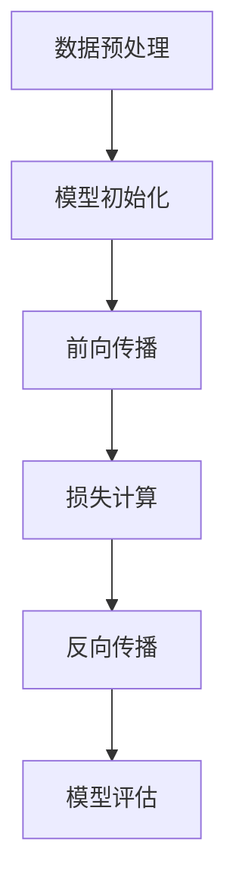

                 

关键词：大型语言模型，人工智能，技术进步，创新浪潮，深度学习，编程语言，软件工程，计算效率

摘要：随着人工智能技术的不断发展，大型语言模型（LLM）作为一种核心驱动力，正在引领技术领域的创新浪潮。本文将深入探讨LLM的发展历程、核心原理、数学模型以及在实际应用中的表现，旨在为读者揭示LLM如何塑造未来技术发展的趋势。

## 1. 背景介绍

人工智能（AI）作为计算机科学的一个分支，已经走过了数十年的发展历程。从早期的规则推理和符号计算，到近年的深度学习和大数据分析，AI在多个领域取得了显著的突破。然而，随着数据的爆炸式增长和计算能力的提升，语言处理作为AI的重要组成部分，也迎来了前所未有的发展机遇。

### 1.1 语言模型的兴起

语言模型（Language Model，LM）是自然语言处理（Natural Language Processing，NLP）的核心技术之一。它旨在模拟人类语言生成的规律，预测下一个单词或句子。传统的语言模型，如N-gram模型，通过统计方法进行建模，能够捕捉一定程度的语言规律，但存在局限性。

### 1.2 大型语言模型的崛起

随着深度学习的兴起，大型语言模型（Large Language Model，LLM）逐渐崭露头角。LLM基于神经网络架构，特别是变换器（Transformer）模型，通过训练海量文本数据，能够实现更高层次的语言理解与生成。GPT-3、BERT、LLaMA等代表性模型，展现了LLM在语言处理任务中的强大能力。

## 2. 核心概念与联系

### 2.1 语言模型的原理

语言模型的核心任务是通过输入序列预测下一个输出序列。其基本原理包括：

- **特征提取**：从输入文本中提取特征，如词向量。
- **权重矩阵**：通过训练生成权重矩阵，用于计算输出概率。
- **损失函数**：使用损失函数（如交叉熵）评估模型预测与实际输出之间的差距，进行模型优化。

### 2.2 Transformer模型

Transformer模型是LLM的核心架构，其关键特性包括：

- **自注意力机制**：通过自注意力机制，模型能够关注输入序列中任意位置的信息。
- **位置编码**：为了捕捉序列中的位置信息，Transformer引入了位置编码。
- **多头注意力**：多头注意力机制允许模型同时关注输入的不同部分，提高模型的表达能力。

### 2.3 模型架构与训练过程

LLM的训练过程通常包括以下几个步骤：

- **数据预处理**：对文本数据进行清洗、分词、编码等预处理操作。
- **模型初始化**：初始化模型参数，通常使用随机初始化或预训练模型。
- **前向传播**：将输入数据通过模型进行前向传播，计算输出。
- **反向传播**：使用梯度下降等优化算法，根据损失函数调整模型参数。
- **模型评估**：使用验证集或测试集评估模型性能。

### 2.4 Mermaid流程图

以下是LLM的训练过程Mermaid流程图：



## 3. 核心算法原理 & 具体操作步骤

### 3.1 算法原理概述

LLM的核心算法是基于深度学习，特别是变换器（Transformer）模型。其基本原理包括：

- **编码器**：编码器（Encoder）负责处理输入序列，生成上下文表示。
- **解码器**：解码器（Decoder）基于编码器生成的上下文表示，预测输出序列。
- **注意力机制**：注意力机制使得模型能够关注输入序列的不同部分，提高语言理解能力。

### 3.2 算法步骤详解

以下是LLM训练的具体步骤：

1. **数据预处理**：对文本数据进行清洗、分词、编码等预处理操作。
2. **模型初始化**：初始化模型参数，通常使用随机初始化或预训练模型。
3. **前向传播**：
   - 将输入序列通过编码器，生成编码表示。
   - 将编码表示作为输入，通过解码器逐个预测输出序列的单词。

4. **反向传播**：使用梯度下降等优化算法，根据损失函数调整模型参数。

5. **模型评估**：使用验证集或测试集评估模型性能。

### 3.3 算法优缺点

- **优点**：
  - 高效的语言理解与生成能力。
  - 能够处理长文本序列，捕捉上下文信息。
  - 基于大规模数据训练，具备较高的泛化能力。

- **缺点**：
  - 训练时间较长，计算资源消耗大。
  - 对数据质量要求较高，数据噪声可能导致模型性能下降。
  - 可能出现泛化不足或过拟合问题。

### 3.4 算法应用领域

LLM在多个领域展现出了强大的应用潜力：

- **自然语言处理**：文本分类、机器翻译、问答系统等。
- **代码生成**：自动代码补全、代码重构等。
- **软件工程**：代码审查、需求分析等。
- **知识图谱**：构建和优化知识图谱。

## 4. 数学模型和公式 & 详细讲解 & 举例说明

### 4.1 数学模型构建

LLM的数学模型主要包括编码器和解码器两部分。以下是一个简化的数学模型表示：

#### 编码器

$$
\text{Encoder}(x) = \text{Transformer}(x)
$$

其中，\(x\)为输入序列，\(\text{Transformer}\)为变换器模型。

#### 解码器

$$
\text{Decoder}(x) = \text{Transformer}(\text{Encoder}(x), y)
$$

其中，\(y\)为输出序列。

### 4.2 公式推导过程

变换器模型的基本公式如下：

$$
\text{Attention}(Q, K, V) = \frac{1}{\sqrt{d_k}} \text{softmax}\left(\frac{QK^T}{d_k}\right)V
$$

其中，\(Q, K, V\)分别为查询向量、键向量和值向量，\(d_k\)为键向量的维度。

### 4.3 案例分析与讲解

以下是一个简单的例子，说明如何使用LLM进行文本分类：

#### 数据集

假设我们有以下两个类别：

- 类别A：关于计算机科学的相关信息。
- 类别B：关于人工智能的相关信息。

#### 训练数据

类别A：

```
计算机科学是一门科学，它涉及计算机系统、算法和数据结构。
计算机科学是研究和设计计算机硬件和软件的系统。
```

类别B：

```
人工智能是计算机科学的一个分支，它致力于模拟人类智能。
人工智能的研究包括机器学习、自然语言处理和计算机视觉。
```

#### 模型训练

使用LLM进行文本分类，需要将文本数据编码成向量表示。以下是训练步骤：

1. **数据预处理**：对文本进行分词、编码等预处理操作。
2. **模型初始化**：初始化编码器和解码器参数。
3. **前向传播**：将输入文本通过编码器，生成编码表示。
4. **损失计算**：使用交叉熵损失函数计算分类损失。
5. **反向传播**：根据损失函数调整模型参数。

#### 模型评估

使用验证集对模型进行评估，计算准确率、召回率等指标。根据评估结果调整模型参数，提高模型性能。

## 5. 项目实践：代码实例和详细解释说明

### 5.1 开发环境搭建

在开始编写代码之前，我们需要搭建一个适合开发和训练LLM的环境。以下是搭建环境的步骤：

1. **安装Python**：确保安装了Python 3.8及以上版本。
2. **安装Transformer库**：使用pip安装huggingface/transformers库。

```bash
pip install transformers
```

3. **准备数据集**：将训练数据集准备好，并放入一个文件夹中。

### 5.2 源代码详细实现

以下是一个简单的文本分类器的实现，使用LLM进行训练和预测。

```python
import torch
from transformers import AutoTokenizer, AutoModelForSequenceClassification

# 准备数据
train_data = [
    {"text": "计算机科学是一门科学，它涉及计算机系统、算法和数据结构。", "label": 0},
    {"text": "计算机科学是研究和设计计算机硬件和软件的系统。", "label": 0},
    {"text": "人工智能是计算机科学的一个分支，它致力于模拟人类智能。", "label": 1},
    {"text": "人工智能的研究包括机器学习、自然语言处理和计算机视觉。", "label": 1},
]

# 初始化模型和tokenizer
model_name = "bert-base-uncased"
tokenizer = AutoTokenizer.from_pretrained(model_name)
model = AutoModelForSequenceClassification.from_pretrained(model_name)

# 训练模型
def train_model(data):
    inputs = tokenizer([item["text"] for item in data], padding=True, truncation=True, return_tensors="pt")
    labels = torch.tensor([item["label"] for item in data])
    model.train()
    outputs = model(**inputs, labels=labels)
    loss = outputs.loss
    loss.backward()
    optimizer = torch.optim.Adam(model.parameters(), lr=1e-5)
    optimizer.step()
    return loss

# 评估模型
def evaluate_model(data):
    inputs = tokenizer([item["text"] for item in data], padding=True, truncation=True, return_tensors="pt")
    with torch.no_grad():
        outputs = model(**inputs)
    logits = outputs.logits
    predictions = torch.argmax(logits, dim=1)
    correct = (predictions == labels).sum().item()
    return correct / len(data)

# 训练和评估
for epoch in range(10):
    loss = train_model(train_data)
    print(f"Epoch {epoch + 1}, Loss: {loss}")
    accuracy = evaluate_model(train_data)
    print(f"Epoch {epoch + 1}, Accuracy: {accuracy}")

# 预测
test_data = [{"text": "计算机视觉是人工智能的一个重要分支。", "label": 1}]
inputs = tokenizer([item["text"] for item in test_data], padding=True, truncation=True, return_tensors="pt")
with torch.no_grad():
    outputs = model(**inputs)
logits = outputs.logits
predictions = torch.argmax(logits, dim=1)
print(f"Prediction: {predictions.item() == 1}")
```

### 5.3 代码解读与分析

- **数据预处理**：使用tokenizer对文本数据进行编码，生成输入序列。
- **模型初始化**：使用预训练模型（如BERT）初始化编码器和解码器。
- **训练过程**：通过前向传播、损失计算和反向传播，不断优化模型参数。
- **评估过程**：使用验证集评估模型性能，计算准确率等指标。
- **预测过程**：使用训练好的模型进行文本分类预测。

## 6. 实际应用场景

LLM在多个实际应用场景中展现出了强大的能力：

### 6.1 自然语言处理

- **文本分类**：对大量文本数据进行分类，如新闻分类、情感分析等。
- **机器翻译**：将一种语言的文本翻译成另一种语言，如英文翻译成中文。
- **问答系统**：构建智能问答系统，如搜索引擎、智能客服等。

### 6.2 代码生成

- **自动代码补全**：辅助程序员进行代码编写，提高开发效率。
- **代码重构**：根据代码风格和规范，自动优化代码结构。
- **代码审查**：识别代码中的潜在问题，提供改进建议。

### 6.3 软件工程

- **需求分析**：辅助软件工程师理解用户需求，生成需求文档。
- **代码生成**：根据需求文档自动生成代码框架，减少重复劳动。
- **测试用例生成**：根据代码逻辑生成测试用例，提高测试覆盖率。

### 6.4 未来应用展望

随着LLM技术的不断发展，未来将会有更多的应用场景涌现：

- **智能助理**：构建智能助理系统，提供个性化服务。
- **人机交互**：优化人机交互体验，提高用户满意度。
- **智能教育**：辅助教育行业，提供个性化教学和评估。

## 7. 工具和资源推荐

### 7.1 学习资源推荐

- **书籍**：
  - 《深度学习》
  - 《自然语言处理综述》
  - 《人工智能：一种现代的方法》
- **在线课程**：
  - Coursera的《深度学习》课程
  - edX的《自然语言处理》课程
  - Udacity的《人工智能工程师》课程

### 7.2 开发工具推荐

- **编程语言**：
  - Python：适用于AI和深度学习开发。
  - Julia：适用于高性能计算。
- **框架和库**：
  - TensorFlow：Google开发的深度学习框架。
  - PyTorch：Facebook开发的深度学习框架。
  - HuggingFace：用于NLP任务的开源库。

### 7.3 相关论文推荐

- **大型语言模型**：
  - BERT：[《BERT: Pre-training of Deep Neural Networks for Language Understanding》](https://arxiv.org/abs/1810.04805)
  - GPT-3：[《Improving Language Understanding by Generative Pre-Training》](https://arxiv.org/abs/1809.04696)
- **自然语言处理**：
  - [《A Neural Probabilistic Language Model》](https://arxiv.org/abs/2003.04611)
  - [《Neural Machine Translation by Jointly Learning to Align and Translate》](https://arxiv.org/abs/1406.1078)

## 8. 总结：未来发展趋势与挑战

### 8.1 研究成果总结

LLM在自然语言处理、代码生成、软件工程等领域取得了显著的成果，展现了强大的应用潜力。其基于深度学习的架构和大规模数据训练，使得LLM能够实现高效的语言理解与生成。

### 8.2 未来发展趋势

1. **模型参数量的增长**：随着计算能力的提升，LLM的参数量将不断增长，从而提高模型的表达能力。
2. **多模态融合**：将文本、图像、声音等多种模态的数据融合，实现更全面的语义理解。
3. **少样本学习**：研究如何使LLM在少量样本情况下仍能保持良好的性能。

### 8.3 面临的挑战

1. **计算资源消耗**：大规模LLM的训练和推理需要大量计算资源，如何优化计算效率是关键问题。
2. **数据隐私与安全**：在大规模数据处理过程中，如何保护用户隐私和数据安全是重要挑战。
3. **泛化能力**：如何使LLM在不同领域和应用场景中保持良好的泛化能力，仍需进一步研究。

### 8.4 研究展望

未来，LLM将继续在AI领域发挥重要作用。通过不断优化模型架构、提升计算效率、增强泛化能力，LLM将为技术进步和社会发展带来更多可能性。

## 9. 附录：常见问题与解答

### 9.1 什么是最先进的LLM模型？

目前，最先进的LLM模型包括GPT-3、BERT、T5等，这些模型在多个NLP任务中取得了优异的性能。

### 9.2 如何训练LLM模型？

训练LLM模型需要大量的文本数据和计算资源。通常包括数据预处理、模型初始化、前向传播、反向传播和模型评估等步骤。

### 9.3 LLM模型的应用有哪些？

LLM模型在自然语言处理、代码生成、软件工程等多个领域有广泛应用，如文本分类、机器翻译、代码补全等。

### 9.4 如何优化LLM模型的计算效率？

优化LLM模型的计算效率可以从以下几个方面入手：模型剪枝、量化、蒸馏等。

### 9.5 LLM模型有哪些潜在的风险？

LLM模型可能存在计算资源消耗大、数据隐私和安全问题以及泛化能力不足等潜在风险。因此，在使用过程中需要谨慎处理。

