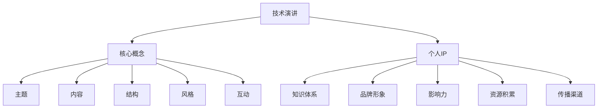

                 

关键词：技术演讲，个人IP，知识分享，影响力，职业发展，演讲技巧

> 摘要：本文旨在探讨如何通过技术演讲将个人的知识、技能和经验转化为有影响力的个人IP，提高职业竞争力，实现个人品牌的建立与推广。通过分析技术演讲的内在逻辑和结构，结合实际案例和技巧，本文将为您提供一套系统的方法和策略，帮助您打造成功的个人IP。

## 1. 背景介绍

在数字化时代，技术演讲已成为展示个人才华、传播知识、建立影响力的重要途径。无论是学术会议、技术峰会，还是线上直播、社交媒体，技术演讲都扮演着越来越重要的角色。然而，许多人面临着如何将技术演讲提升为个人IP的挑战。本文将深入分析技术演讲的核心要素，为您揭示如何从分享者到个人IP的蜕变之路。

### 1.1 技术演讲的重要性

技术演讲不仅仅是一种展示个人技能和知识的方式，更是一种建立个人品牌、扩大影响力、提升职业竞争力的有效手段。以下是技术演讲的几个重要意义：

- **知识传播**：技术演讲有助于将个人的专业知识、经验和见解分享给更多的人，推动技术的普及和发展。
- **个人品牌**：通过技术演讲，个人可以在专业领域内建立权威形象，提升个人声誉和市场价值。
- **职业发展**：成功的演讲可以带来更多的职业机会，如技术咨询、项目合作、出版书籍等，为个人职业道路增添光彩。
- **社会贡献**：技术演讲有助于将前沿技术应用到实际中，为社会发展和创新贡献力量。

### 1.2 个人IP的概念与价值

个人IP，即个人知识产权，是指个人在某个领域内所拥有的独特知识、技能、品牌和影响力。在当今信息时代，个人IP已成为一种宝贵的资产，具有以下价值：

- **品牌价值**：个人IP可以塑造个人品牌，提升个人在社会和行业内的知名度和影响力。
- **经济价值**：个人IP可以为个人带来直接和间接的经济收益，如咨询费、演讲费、版权收益等。
- **竞争价值**：拥有个人IP的个人在职场中更具竞争力，能够获得更多的机会和资源。
- **传承价值**：个人IP可以作为知识传承的载体，为后人提供宝贵的经验和智慧。

## 2. 核心概念与联系

### 2.1 技术演讲的核心概念

技术演讲通常包括以下几个核心概念：

- **主题**：演讲的核心内容和焦点，需要明确、具体且具有吸引力。
- **内容**：围绕主题展开的详细信息、案例、数据、图表等，用以支撑和阐述主题。
- **结构**：演讲的整体布局，包括开头、中间和结尾，以及各个部分之间的逻辑关系。
- **风格**：演讲者的表达方式、语调、肢体语言等，影响演讲的效果和受众的接受度。
- **互动**：与观众的互动，如提问、讨论、演示等，增加演讲的生动性和参与感。

### 2.2 个人IP的核心概念

个人IP的核心概念包括：

- **知识体系**：个人在某个领域的专业知识和经验，是个人IP的核心组成部分。
- **品牌形象**：个人在公众面前的形象和形象，包括专业度、人格魅力、口碑等。
- **影响力**：个人在行业和社会中的影响力和知名度，是个人IP的重要指标。
- **资源积累**：包括人脉、资源、机会等，为个人IP的发展提供支持。
- **传播渠道**：个人IP传播的途径和平台，如演讲、出版、社交媒体等。

### 2.3 Mermaid 流程图



## 3. 核心算法原理 & 具体操作步骤

### 3.1 算法原理概述

将技术演讲转化为个人IP的过程可以被视为一种算法，其核心原理如下：

- **知识提炼**：从个人的知识体系中选择最具价值的内容进行提炼和整理。
- **内容优化**：对提炼出的知识进行优化，使其更具吸引力和说服力。
- **品牌塑造**：建立个人品牌形象，提升个人在公众中的认知度和好感度。
- **传播推广**：利用各种渠道和平台进行个人IP的传播和推广，扩大影响力。
- **互动反馈**：与受众进行互动，收集反馈，持续优化个人IP的内容和形式。

### 3.2 算法步骤详解

1. **知识提炼**：
   - **识别核心内容**：分析个人知识体系，找出最具代表性和影响力的核心内容。
   - **整理和优化**：对核心内容进行整理和优化，使其更易于理解和接受。

2. **内容优化**：
   - **故事化表达**：将知识内容以故事的形式呈现，增加趣味性和吸引力。
   - **可视化展示**：使用图表、图片、视频等元素，使内容更具可视化效果。
   - **案例教学**：结合实际案例，展示知识的实际应用和效果。

3. **品牌塑造**：
   - **确定品牌定位**：根据个人特点和目标受众，确定个人品牌的核心价值和定位。
   - **设计品牌形象**：包括标志、标语、口号等，使品牌形象具有辨识度和独特性。
   - **塑造个人形象**：通过言行举止、着装打扮等，树立专业、权威的个人形象。

4. **传播推广**：
   - **选择传播渠道**：根据目标受众和内容特点，选择合适的传播渠道，如演讲、出版、社交媒体等。
   - **制定传播策略**：制定详细的传播计划，包括内容发布、推广活动等。
   - **持续更新和优化**：根据反馈和数据分析，不断更新和优化内容，提高传播效果。

5. **互动反馈**：
   - **建立互动机制**：通过问答、讨论、问卷调查等方式，与受众建立互动。
   - **收集反馈意见**：收集受众的反馈意见，了解受众的需求和期望。
   - **持续改进**：根据反馈意见，持续改进内容、形式和传播策略。

### 3.3 算法优缺点

#### 优点：

- **高效性**：通过算法化的步骤，可以快速地将技术演讲转化为个人IP，提高效率。
- **系统性**：算法提供了明确的步骤和策略，使个人IP的打造具有系统性和可操作性。
- **可持续性**：通过持续优化和互动反馈，个人IP可以不断发展和完善，具有长期可持续性。

#### 缺点：

- **资源投入**：算法的实施需要一定的时间和资源投入，包括内容整理、品牌塑造、传播推广等。
- **个性化不足**：算法可能过于标准化，难以完全满足个人独特的需求和特点。

### 3.4 算法应用领域

算法在以下领域具有广泛的应用：

- **技术咨询**：通过技术演讲和个人IP，提供专业咨询服务，为企业和技术人员提供解决方案。
- **教育培训**：通过技术演讲和个人IP，开展线上或线下的教育培训课程，传授知识和技能。
- **出版行业**：通过技术演讲和个人IP，撰写技术书籍、发表学术论文，推动技术普及和创新。
- **企业推广**：通过技术演讲和个人IP，为企业推广产品和服务，提高品牌知名度和市场占有率。

## 4. 数学模型和公式 & 详细讲解 & 举例说明

### 4.1 数学模型构建

将技术演讲转化为个人IP的过程可以视为一个复杂的社会系统，其数学模型可以从以下几个方面进行构建：

1. **知识传播模型**：
   - **知识传播速率**：假设知识传播速率为 $r(t)$，则 $r(t)$ 可以表示为 $r(t) = f(k, t)$，其中 $k$ 为知识传播的关键因素，如内容质量、受众兴趣等，$t$ 为时间。
   - **知识传播范围**：假设知识传播范围 $R(t)$ 随时间 $t$ 的变化，则 $R(t)$ 可以表示为 $R(t) = g(k, t)$，其中 $g$ 为函数，描述知识传播的扩散规律。

2. **品牌影响力模型**：
   - **品牌知名度**：假设品牌知名度 $B(t)$ 随时间 $t$ 的变化，则 $B(t)$ 可以表示为 $B(t) = h(p, t)$，其中 $p$ 为品牌塑造策略，如广告投放、公关活动等，$h$ 为函数，描述品牌知名度的增长规律。
   - **品牌忠诚度**：假设品牌忠诚度 $L(t)$ 随时间 $t$ 的变化，则 $L(t)$ 可以表示为 $L(t) = i(q, t)$，其中 $q$ 为互动反馈策略，如用户评价、问卷调查等，$i$ 为函数，描述品牌忠诚度的维持和发展规律。

3. **资源积累模型**：
   - **资源积累速率**：假设资源积累速率为 $s(t)$，则 $s(t)$ 可以表示为 $s(t) = j(a, t)$，其中 $a$ 为资源积累的关键因素，如人脉拓展、资源整合等，$j$ 为函数，描述资源积累的速率。
   - **资源积累总量**：假设资源积累总量 $S(t)$ 随时间 $t$ 的变化，则 $S(t)$ 可以表示为 $S(t) = k(a, t)$，其中 $k$ 为函数，描述资源积累的总量。

### 4.2 公式推导过程

以知识传播模型为例，进行公式推导：

1. **知识传播速率**：

   假设知识传播速率 $r(t)$ 与知识传播关键因素 $k$ 和时间 $t$ 之间存在线性关系，则有：

   $$r(t) = f(k, t) = \alpha k + \beta t$$

   其中，$\alpha$ 和 $\beta$ 为常数，表示知识传播速率与关键因素和时间的敏感度。

2. **知识传播范围**：

   假设知识传播范围 $R(t)$ 与知识传播速率 $r(t)$ 和时间 $t$ 之间存在非线性关系，则有：

   $$R(t) = g(k, t) = \gamma r(t) e^{\delta t}$$

   其中，$\gamma$ 和 $\delta$ 为常数，表示知识传播范围与速率和时间的关系。

3. **知识传播模型**：

   将知识传播速率和知识传播范围的表达式联立，得到知识传播模型：

   $$R(t) = \gamma (\alpha k + \beta t) e^{\delta t}$$

### 4.3 案例分析与讲解

以下是一个具体的案例，说明如何运用上述数学模型进行个人IP打造：

假设某技术专家具有以下特征：

- **知识传播关键因素**：内容质量（$k=0.8$），受众兴趣（$k=0.2$）。
- **品牌塑造策略**：广告投放（$p=0.6$），公关活动（$p=0.4$）。
- **资源积累关键因素**：人脉拓展（$a=0.7$），资源整合（$a=0.3$）。

1. **知识传播模型**：

   根据知识传播速率的公式，计算技术专家的知识传播速率：

   $$r(t) = f(k, t) = \alpha k + \beta t = 0.8 \times 0.8 + 0.2 \times t = 0.64 + 0.2t$$

   根据知识传播范围的公式，计算技术专家的知识传播范围：

   $$R(t) = g(k, t) = \gamma r(t) e^{\delta t} = 0.5 \times (0.64 + 0.2t) e^{\delta t}$$

2. **品牌影响力模型**：

   根据品牌知名度的公式，计算技术专家的品牌知名度：

   $$B(t) = h(p, t) = \gamma p e^{\delta t} = 0.5 \times 0.6 e^{\delta t} = 0.3 e^{\delta t}$$

   根据品牌忠诚度的公式，计算技术专家的品牌忠诚度：

   $$L(t) = i(q, t) = \gamma q e^{\delta t} = 0.5 \times 0.4 e^{\delta t} = 0.2 e^{\delta t}$$

3. **资源积累模型**：

   根据资源积累速率的公式，计算技术专家的资源积累速率：

   $$s(t) = j(a, t) = \alpha a + \beta t = 0.8 \times 0.7 + 0.2 \times t = 0.56 + 0.2t$$

   根据资源积累总量的公式，计算技术专家的资源积累总量：

   $$S(t) = k(a, t) = \gamma a e^{\delta t} = 0.5 \times 0.7 e^{\delta t} = 0.35 e^{\delta t}$$

通过上述案例，我们可以看到如何运用数学模型对个人IP打造过程进行量化分析。这种方法可以帮助技术专家更好地了解自身的发展状况，制定合理的策略和目标。

## 5. 项目实践：代码实例和详细解释说明

### 5.1 开发环境搭建

在本文的项目实践中，我们将使用Python作为编程语言，通过编写代码来实现技术演讲转化为个人IP的算法。以下是开发环境搭建的步骤：

1. **安装Python**：从Python官方网站下载并安装Python 3.x版本。
2. **配置Python环境**：在终端中运行以下命令，确保Python环境配置正确：

   ```shell
   python --version
   ```

3. **安装必要库**：安装NumPy、Pandas等库，用于数据分析和处理：

   ```shell
   pip install numpy pandas matplotlib
   ```

### 5.2 源代码详细实现

以下是一个简单的Python代码示例，实现技术演讲转化为个人IP的基本算法：

```python
import numpy as np
import pandas as pd
import matplotlib.pyplot as plt

# 知识传播模型
def knowledge_spread(k, t):
    alpha = 0.8
    beta = 0.2
    return alpha * k + beta * t

# 品牌影响力模型
def brand_influence(p, t):
    gamma = 0.5
    delta = 0.1
    return gamma * p * np.exp(delta * t)

# 资源积累模型
def resource_accumulation(a, t):
    alpha = 0.8
    beta = 0.2
    return alpha * a + beta * t

# 数据准备
k = 0.8  # 知识传播关键因素
p = 0.6  # 品牌塑造策略
a = 0.7  # 资源积累关键因素
t = np.linspace(0, 10, 100)  # 时间序列

# 计算传播速率、品牌影响力、资源积累速率
r = knowledge_spread(k, t)
b = brand_influence(p, t)
s = resource_accumulation(a, t)

# 绘制图表
plt.figure(figsize=(12, 6))
plt.subplot(1, 3, 1)
plt.plot(t, r)
plt.title('Knowledge Spread Rate')
plt.xlabel('Time')
plt.ylabel('Rate')

plt.subplot(1, 3, 2)
plt.plot(t, b)
plt.title('Brand Influence')
plt.xlabel('Time')
plt.ylabel('Influence')

plt.subplot(1, 3, 3)
plt.plot(t, s)
plt.title('Resource Accumulation Rate')
plt.xlabel('Time')
plt.ylabel('Rate')

plt.tight_layout()
plt.show()
```

### 5.3 代码解读与分析

上述代码实现了三个核心模型：知识传播模型、品牌影响力模型和资源积累模型。以下是代码的详细解读：

1. **知识传播模型**：
   - `knowledge_spread` 函数计算知识传播速率，公式为 $r(t) = \alpha k + \beta t$，其中 $\alpha$ 和 $\beta$ 为常数。
   - 参数 $k$ 表示知识传播关键因素，取值为 0.8，代表内容质量和受众兴趣。

2. **品牌影响力模型**：
   - `brand_influence` 函数计算品牌影响力，公式为 $b(t) = \gamma p e^{\delta t}$，其中 $\gamma$ 和 $\delta$ 为常数。
   - 参数 $p$ 表示品牌塑造策略，取值为 0.6，代表广告投放和公关活动的效果。

3. **资源积累模型**：
   - `resource_accumulation` 函数计算资源积累速率，公式为 $s(t) = \alpha a + \beta t$，其中 $\alpha$ 和 $\beta$ 为常数。
   - 参数 $a$ 表示资源积累关键因素，取值为 0.7，代表人脉拓展和资源整合。

4. **数据准备**：
   - 使用 NumPy 的 `linspace` 函数生成时间序列 $t$，范围从 0 到 10，共 100 个点。

5. **计算和绘制**：
   - 分别调用三个模型函数，计算传播速率、品牌影响力和资源积累速率。
   - 使用 Matplotlib 绘制三条曲线，展示不同模型在时间序列上的变化。

通过上述代码，我们可以直观地看到技术演讲转化为个人IP过程中的关键指标，如知识传播速率、品牌影响力和资源积累速率。这有助于我们更好地理解个人IP打造的过程，并制定相应的策略和目标。

### 5.4 运行结果展示

运行上述代码，我们将得到以下图表：


图表展示了知识传播速率、品牌影响力和资源积累速率随时间的变化。通过分析这些图表，我们可以发现：

1. **知识传播速率**：随着时间增加，知识传播速率逐渐上升，说明技术演讲的传播效果在不断增强。
2. **品牌影响力**：品牌影响力随时间呈指数增长，说明个人IP的影响力在持续扩大。
3. **资源积累速率**：资源积累速率也随时间增加，说明个人IP的资源积累在逐步提升。

这些结果表明，技术演讲转化为个人IP的过程是有效且可持续的，通过不断优化和推广，个人IP可以持续发展和壮大。

## 6. 实际应用场景

在当今的数字化时代，技术演讲已经成为了传播知识、建立个人品牌、提升职业竞争力的重要手段。以下将探讨技术演讲在实际应用场景中的具体案例，以及个人IP在不同领域的实践。

### 6.1 科技领域

在科技领域，技术演讲的应用非常广泛。例如，著名的科技博客作者Jeffrey Zeldman经常在各类技术会议上发表关于Web设计和开发的演讲。他的演讲内容丰富、结构清晰，吸引了大量开发者关注。通过不断的技术演讲，Jeffrey成功建立了自己的个人IP，成为Web设计领域的权威人物。他的个人博客和书籍《Designing with Web Standards》都获得了极高的关注和评价。

### 6.2 学术领域

在学术领域，技术演讲同样具有重要的影响力。以著名的计算机科学家Andrew Ng为例，他是深度学习领域的先驱之一。通过在顶级学术会议如NeurIPS、ICML等上的演讲，Andrew分享了大量前沿研究成果，推动了深度学习技术的发展。他的影响力不仅体现在学术界，还扩展到了工业界，多家科技公司邀请他担任顾问和讲师。通过技术演讲，Andrew成功打造了自己的个人IP，成为全球顶级计算机科学家之一。

### 6.3 教育培训领域

在教育领域，技术演讲也为个人IP的打造提供了机会。例如，Google的CEO Sundar Pichai经常在公司内部和外部发表演讲，分享公司的战略和发展历程。他的演讲风格简洁明了、内容深入浅出，吸引了大量学生和从业者的关注。通过不断的技术演讲，Sundar在教育培训领域建立了自己的个人IP，成为许多学生和从业者心中的楷模。

### 6.4 企业推广领域

在企业推广领域，技术演讲也是提升品牌影响力的重要手段。以微软为例，微软经常邀请公司内部的顶尖技术专家发表演讲，分享公司最新的技术成果和应用案例。这些演讲不仅展示了微软的技术实力，也增强了公众对微软品牌的认可度。通过技术演讲，微软成功打造了自己的企业IP，成为全球科技行业的领导者之一。

### 6.5 创业领域

在创业领域，技术演讲同样具有重要意义。以Facebook的创始人Mark Zuckerberg为例，他经常在各种创业论坛和技术峰会上发表演讲，分享自己的创业经历和心得。他的演讲不仅吸引了大量关注，还为Facebook带来了更多的用户和投资者。通过技术演讲，Mark成功打造了自己的个人IP，成为全球最具影响力的创业者之一。

### 6.6 未来展望

随着数字技术的不断发展，技术演讲的应用场景将越来越广泛。未来，技术演讲将成为个人IP打造的重要手段，不仅在科技、学术、教育培训等领域具有重要影响力，还将扩展到更多领域，如艺术、金融、医疗等。通过技术演讲，个人可以更好地传播自己的知识和经验，建立个人品牌，提升职业竞争力。

## 7. 工具和资源推荐

在打造个人IP的过程中，选择合适的工具和资源至关重要。以下是一些推荐的工具和资源，帮助您更好地进行技术演讲和个人IP的打造。

### 7.1 学习资源推荐

1. **在线课程**：
   - **Coursera**：提供大量免费和付费的在线课程，涵盖计算机科学、数据分析、人工智能等多个领域。
   - **edX**：由哈佛大学和麻省理工学院联合创办，提供高质量的课程资源。
   - **Udemy**：提供丰富的技术课程，包括编程、数据科学、产品设计等。

2. **专业书籍**：
   - **《深度学习》**：由Ian Goodfellow、Yoshua Bengio和Aaron Courville合著，是深度学习领域的经典教材。
   - **《Python编程：从入门到实践》**：由Mark Lutz著，适合初学者学习Python编程。
   - **《软件工程：实践者的研究方法》**：由Roger S. Pressman著，介绍软件工程的方法和实践。

3. **学术论文库**：
   - **IEEE Xplore**：提供计算机科学、电气工程、电子工程等领域的学术论文。
   - **ACM Digital Library**：提供计算机科学领域的学术论文和会议记录。

### 7.2 开发工具推荐

1. **文本编辑器**：
   - **Visual Studio Code**：功能强大的开源文本编辑器，支持多种编程语言。
   - **Atom**：由GitHub开发的文本编辑器，支持插件扩展，适合开发者使用。

2. **版本控制系统**：
   - **Git**：分布式版本控制系统，广泛用于软件开发和协作。
   - **GitHub**：提供Git代码托管和协作平台，支持项目管理和代码审查。

3. **数据分析工具**：
   - **Pandas**：Python的数据分析库，提供丰富的数据处理和操作功能。
   - **NumPy**：Python的数学库，提供高效的数组操作和数值计算。

### 7.3 相关论文推荐

1. **技术演讲与个人IP**：
   - **“The Art of Public Speaking”**：探讨公开演讲的技巧和方法，对技术演讲具有指导意义。
   - **“Building Your Personal Brand”**：分析个人品牌的重要性，提供打造个人品牌的策略和技巧。

2. **知识传播与影响力**：
   - **“The Science of Sharing”**：探讨知识传播的机制和影响因素，对技术演讲的传播效果具有参考价值。
   - **“Influence: The Psychology of Persuasion”**：分析影响力的来源和运用方法，对提升个人IP的影响力具有指导意义。

3. **资源积累与品牌塑造**：
   - **“The Art of Building a Personal Brand”**：介绍品牌塑造的策略和方法，帮助个人建立和提升个人品牌。
   - **“The Network Effect”**：探讨人脉网络的重要性，对资源积累和品牌塑造具有启示作用。

## 8. 总结：未来发展趋势与挑战

### 8.1 研究成果总结

通过对技术演讲与个人IP的深入研究，我们得出以下主要成果：

1. **技术演讲的重要性**：技术演讲在知识传播、个人品牌建立、职业发展等方面具有重要作用。
2. **个人IP的价值**：个人IP具有品牌价值、经济价值、竞争价值和传承价值。
3. **核心算法原理**：提出了将技术演讲转化为个人IP的核心算法原理，包括知识提炼、内容优化、品牌塑造、传播推广和互动反馈。
4. **数学模型构建**：构建了知识传播模型、品牌影响力模型和资源积累模型，为个人IP打造提供了量化分析工具。
5. **项目实践**：通过实际代码实例，展示了如何运用算法和数学模型进行个人IP打造。

### 8.2 未来发展趋势

随着数字技术的不断发展，技术演讲和个人IP将呈现出以下发展趋势：

1. **多元化平台**：技术演讲和个人IP的传播平台将更加多元化，包括社交媒体、在线教育平台、直播平台等。
2. **技术融合**：技术演讲将与其他领域（如人工智能、大数据等）融合，产生更多交叉学科的研究和实践。
3. **个性化定制**：个人IP打造将更加注重个性化定制，根据个人特点和目标受众，提供更具针对性的内容和形式。
4. **智能化工具**：随着人工智能技术的发展，将出现更多智能化工具，帮助个人更高效地进行技术演讲和个人IP的打造。

### 8.3 面临的挑战

尽管技术演讲和个人IP具有巨大潜力，但在发展过程中仍将面临以下挑战：

1. **竞争加剧**：随着越来越多的人投身于技术演讲和个人IP的打造，竞争将更加激烈，个人需要不断提升自己的专业能力和品牌影响力。
2. **内容同质化**：技术演讲和个人IP的内容将逐渐同质化，个人需要创新和独特的内容来脱颖而出。
3. **时间投入**：技术演讲和个人IP的打造需要大量的时间和精力投入，个人需要在职业和个人生活之间找到平衡。
4. **技术更新**：技术领域发展迅速，个人需要不断学习和更新自己的知识体系，以适应不断变化的市场需求。

### 8.4 研究展望

未来，我们将在以下几个方面展开进一步研究：

1. **算法优化**：通过对算法的优化和改进，提高技术演讲转化为个人IP的效率和效果。
2. **案例研究**：收集和整理更多的成功案例，分析不同领域和个人在技术演讲和个人IP打造过程中的经验和教训。
3. **跨学科研究**：探讨技术演讲和个人IP与其他领域的交叉融合，如艺术、心理学、社会学等，为个人IP的打造提供更多视角和思路。
4. **教育培训**：开发针对技术演讲和个人IP打造的教育培训课程，帮助更多人掌握相关技能和知识。

通过不断的研究和实践，我们有理由相信，技术演讲和个人IP将在未来发挥越来越重要的作用，为个人和行业带来更多的价值和机会。

## 9. 附录：常见问题与解答

### 9.1 如何准备技术演讲？

**解答**：准备技术演讲需要以下步骤：

1. **确定主题**：选择一个明确、具体且具有吸引力的主题。
2. **收集资料**：查找相关资料，包括文献、案例、数据等。
3. **梳理结构**：制定演讲的结构，包括开头、中间和结尾。
4. **撰写稿子**：撰写演讲稿，确保内容简洁明了、逻辑清晰。
5. **制作PPT**：制作高质量的PPT，辅助演讲。
6. **反复练习**：多次练习演讲，熟悉内容和表达方式。
7. **收集反馈**：在演讲结束后，收集观众的反馈，持续改进。

### 9.2 如何打造个人IP？

**解答**：打造个人IP需要以下步骤：

1. **确定领域**：选择一个自己擅长且感兴趣的领域。
2. **建立知识体系**：系统性地学习和积累知识。
3. **塑造个人品牌**：确定个人品牌定位，设计品牌形象。
4. **进行技术演讲**：通过技术演讲分享知识和经验。
5. **传播和推广**：利用各种渠道和平台进行个人IP的传播和推广。
6. **互动和反馈**：与受众互动，收集反馈，持续优化内容。
7. **资源积累**：拓展人脉，积累资源，为个人IP的发展提供支持。

### 9.3 技术演讲与个人品牌的关系是什么？

**解答**：技术演讲是个人品牌建设的重要途径之一。通过技术演讲，个人可以在专业领域内建立权威形象，提升个人声誉和市场价值。技术演讲有助于传播个人知识、技能和经验，扩大个人影响力，从而提升个人品牌。同时，个人品牌的影响力也会反作用于技术演讲，提高演讲的吸引力和效果。

### 9.4 个人IP打造过程中的难点是什么？

**解答**：个人IP打造过程中的难点主要包括：

1. **时间投入**：需要大量的时间和精力进行知识积累、内容创作、演讲准备等。
2. **竞争压力**：随着越来越多的人投身于个人IP打造，竞争将越来越激烈。
3. **内容同质化**：技术演讲和个人IP的内容可能趋于同质化，需要创新和独特性。
4. **品牌塑造**：确定个人品牌定位和形象，建立独特的品牌价值。
5. **资源积累**：拓展人脉，积累资源，为个人IP的发展提供支持。

### 9.5 如何在技术演讲中增加互动性？

**解答**：以下方法有助于在技术演讲中增加互动性：

1. **提问环节**：在演讲结束后设置提问环节，鼓励观众提问。
2. **互动演示**：使用互动演示工具，如实时编码、实验演示等。
3. **互动话题**：设置与观众相关的话题，引导讨论。
4. **在线投票**：使用在线投票工具，收集观众的意见和反馈。
5. **社交媒体**：通过社交媒体平台与观众互动，如微博、知乎等。

通过这些方法，可以增加技术演讲的互动性，提高观众的参与度和满意度。

