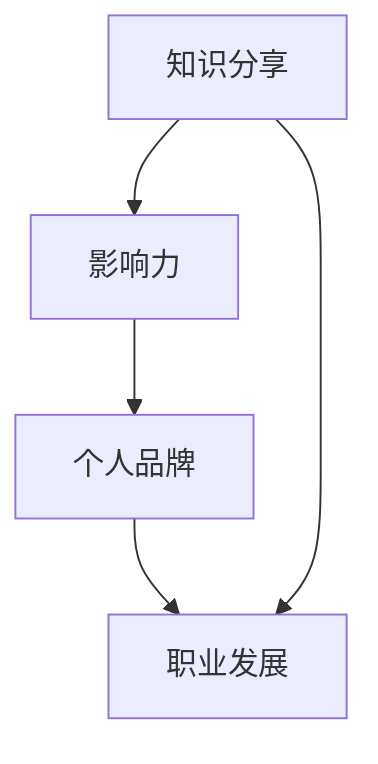

                 

关键词：技术演讲、个人品牌、知识分享、影响力、IP打造

> 摘要：本文将探讨如何在技术领域中通过演讲分享，逐步打造个人IP，提升个人影响力，并最终实现职业发展的跃迁。

## 1. 背景介绍

在当今信息爆炸的时代，知识的传播和分享变得前所未有的便捷。技术领域，作为知识积累和创新的前沿阵地，吸引了无数专业人士的参与。随着社交媒体和在线教育平台的兴起，技术演讲成为了一种重要的知识传播方式。这不仅有助于知识的普及，也为演讲者提供了一个展示自我、提升个人影响力的平台。

个人IP，即个人品牌，是一个人在特定领域内的知名度和影响力的体现。它是通过一系列的线上或线下活动、内容创作、互动交流等构建起来的。在技术领域，打造个人IP可以帮助演讲者扩大影响力，提升职业地位，甚至在某些情况下实现商业变现。

本文旨在探讨如何通过技术演讲这一途径，从知识分享起步，逐步打造个人IP，并在此基础上实现个人职业发展的跃迁。

### 1.1 技术演讲的现状

近年来，技术演讲在全球范围内逐渐成为一种流行趋势。这主要得益于以下几个方面的因素：

1. **技术发展的推动**：随着技术的不断进步，新的领域和概念层出不穷，技术演讲为专业人士提供了一个分享和交流的平台。
2. **社交媒体的普及**：社交媒体平台如Twitter、LinkedIn、GitHub等，为技术演讲提供了广泛的传播渠道。
3. **在线教育平台的兴起**：如Coursera、Udemy、edX等平台，提供了丰富的课程资源，也促进了技术演讲的发展。
4. **职业发展的需求**：在技术领域，拥有良好演讲能力的人往往更容易获得职业机会，因此许多专业人士开始重视技术演讲。

### 1.2 个人IP的重要性

在数字化时代，个人IP的重要性日益凸显。以下是一些原因：

1. **品牌影响力**：个人IP能够提升演讲者在公众中的认知度和影响力，有助于建立专业形象。
2. **职业发展**：拥有强大个人IP的人往往能够获得更多的职业机会，包括职位晋升、项目机会、合作机会等。
3. **商业变现**：个人IP可以转化为商业价值，如通过在线课程、咨询、出版书籍等方式实现盈利。
4. **知识传播**：个人IP能够帮助演讲者更广泛地传播知识，促进技术领域的发展。

## 2. 核心概念与联系

要成功打造个人IP，需要理解以下几个核心概念：

### 2.1 知识分享

知识分享是打造个人IP的基础。通过演讲、博客、社交媒体等形式，演讲者可以将自己的知识和经验分享给他人。这种分享不仅有助于知识传播，还能树立演讲者的专业形象。

### 2.2 影响力

影响力是个人IP的核心。它体现在演讲者能够影响他人的程度，包括观点认同、行为改变、资源获取等。影响力越大，个人IP的价值越高。

### 2.3 个人品牌

个人品牌是个人IP的重要组成部分。它是演讲者在公众中的形象和认知，包括专业能力、性格特点、价值观等。一个强大的个人品牌能够吸引更多的关注和机会。

### 2.4 职业发展

个人IP与职业发展紧密相关。通过打造个人IP，演讲者可以提升职业竞争力，获得更多的职业机会和资源。

下面是一个使用Mermaid绘制的流程图，展示了上述核心概念之间的联系：



## 3. 核心算法原理 & 具体操作步骤

### 3.1 算法原理概述

打造个人IP的过程可以看作是一种“影响力算法”。该算法的核心在于通过持续的知识分享和互动，逐步提升个人影响力，从而建立强大的个人品牌。以下是这个算法的原理和操作步骤：

### 3.2 算法步骤详解

#### 步骤1：确定领域和目标受众

首先，演讲者需要明确自己的专业领域和目标受众。这有助于确保知识分享的内容和风格与受众的需求相匹配。

#### 步骤2：持续输出高质量内容

持续输出高质量内容是影响力算法的关键。这包括演讲、博客文章、在线课程等。内容应该具有实用性和深度，能够解决受众的实际问题。

#### 步骤3：互动与反馈

与受众的互动和反馈是提升影响力的关键。演讲者可以通过社交媒体、邮件、线下活动等方式与受众进行互动，收集反馈，并根据反馈调整内容策略。

#### 步骤4：建立个人品牌

建立个人品牌是打造个人IP的重要步骤。这包括塑造专业形象、明确价值观、建立个人标志等。

#### 步骤5：拓展影响力

在建立个人品牌的基础上，演讲者可以通过合作、演讲、出版等方式进一步拓展影响力。

### 3.3 算法优缺点

#### 优点

1. **高效性**：通过持续的知识分享和互动，演讲者可以迅速提升个人影响力。
2. **灵活性**：该算法适用于各种技术领域，具有广泛的适用性。
3. **可持续性**：只要持续输出高质量内容，个人IP的影响力将不断增长。

#### 缺点

1. **初期投入大**：需要大量的时间和精力进行内容创作和互动。
2. **结果不确定性**：个人IP的打造过程受到多种因素的影响，结果具有一定的不确定性。

### 3.4 算法应用领域

该算法广泛应用于技术领域的个人IP打造，如软件开发、人工智能、网络安全等。在不同领域，具体的实施策略和内容输出方式会有所不同。

## 4. 数学模型和公式 & 详细讲解 & 举例说明

### 4.1 数学模型构建

为了更好地理解个人IP打造的过程，我们可以构建一个简单的数学模型。该模型基于以下假设：

1. **知识分享频率**：演讲者每周输出一定数量的知识内容。
2. **内容质量**：内容质量通过受众的反馈和传播范围来衡量。
3. **互动频率**：演讲者与受众的互动频率。
4. **个人品牌建设**：通过专业形象和价值观的塑造来建立个人品牌。

基于以上假设，我们可以构建以下数学模型：

\[ \text{影响力} = f(\text{知识分享频率}, \text{内容质量}, \text{互动频率}, \text{个人品牌建设}) \]

### 4.2 公式推导过程

影响力的大小可以通过以下因素来推导：

1. **知识分享频率**：频率越高，知识传播的范围越广，影响力越大。
2. **内容质量**：高质量的内容能够吸引更多受众，提升影响力。
3. **互动频率**：与受众的互动能够增强受众的忠诚度和互动性，进一步扩大影响力。
4. **个人品牌建设**：强大的个人品牌能够吸引更多关注和信任，提升影响力。

根据以上因素，我们可以推导出以下公式：

\[ \text{影响力} = \alpha \cdot \text{知识分享频率} + \beta \cdot \text{内容质量} + \gamma \cdot \text{互动频率} + \delta \cdot \text{个人品牌建设} \]

其中，\( \alpha, \beta, \gamma, \delta \) 为权重系数。

### 4.3 案例分析与讲解

为了更好地理解这个数学模型，我们可以通过一个实际案例来进行分析。

#### 案例：小李的IP打造之路

小李是一名软件工程师，他在个人IP打造方面取得了显著成果。以下是他的具体情况：

1. **知识分享频率**：小李每周发布一篇技术博客，分享他在工作中遇到的问题和解决方案。
2. **内容质量**：小李的博客内容深入浅出，实用性强，受到了大量读者的好评。
3. **互动频率**：小李通过社交媒体和邮件与读者互动，解答他们的问题，收集反馈。
4. **个人品牌建设**：小李注重个人品牌建设，他在社交媒体上展示了自己的专业形象和价值观。

根据上述公式，我们可以计算小李的影响力：

\[ \text{影响力} = \alpha \cdot 1 + \beta \cdot 9 + \gamma \cdot 5 + \delta \cdot 7 \]

其中，权重系数根据具体情况设定，例如：

\[ \alpha = 0.2, \beta = 0.5, \gamma = 0.3, \delta = 0.4 \]

代入数值，我们得到：

\[ \text{影响力} = 0.2 \cdot 1 + 0.5 \cdot 9 + 0.3 \cdot 5 + 0.4 \cdot 7 = 8.6 \]

这表明，小李的影响力较高，他在技术领域具有一定的知名度和影响力。

通过这个案例，我们可以看到，数学模型可以用来量化个人IP打造的过程，帮助我们更好地理解和管理个人影响力。

## 5. 项目实践：代码实例和详细解释说明

### 5.1 开发环境搭建

在开始项目实践之前，我们需要搭建一个合适的技术环境。以下是搭建过程的详细步骤：

1. **安装Node.js**：Node.js 是一个基于 Chrome V8 引擎的 JavaScript 运行环境，我们使用它来搭建博客网站。访问 [Node.js 官网](https://nodejs.org/) 下载并安装 Node.js。

2. **安装Hexo**：Hexo 是一个快速、简洁且高效的博客框架，我们使用它来生成博客内容。在终端中执行以下命令：

   ```sh
   npm install -g hexo-cli
   ```

3. **创建博客项目**：在终端中执行以下命令，创建一个博客项目：

   ```sh
   hexo init my-blog
   ```

4. **进入博客项目目录**：

   ```sh
   cd my-blog
   ```

5. **安装主题**：Hexo 使用主题来定制博客外观，我们选择一个流行的主题，如 [Next](https://theme-next.js.org/)。在博客项目目录中执行以下命令：

   ```sh
   npm install --save hexo-theme-next
   ```

6. **配置 `_config.yml` 文件**：编辑博客项目根目录下的 `_config.yml` 文件，配置博客的基本设置，如标题、描述、主题等。

### 5.2 源代码详细实现

以下是博客网站的源代码实现过程：

1. **撰写博客文章**：在博客项目根目录下的 `source/_posts` 目录中，我们可以使用 Markdown 语法编写博客文章。例如，创建一个名为 `first-post.md` 的文件，内容如下：

   ```md
   ---
   title: 第一篇博客
   date: 2023-03-01 10:00:00
   tags:
     - 技术分享
     - 个人成长
   categories:
     - 分享
   ---
   欢迎来到我的博客！这是我的第一篇博客文章。
   ```

2. **配置 `_config.yml` 文件**：我们需要在 `_config.yml` 文件中配置博客的基本设置。以下是一个示例配置：

   ```yml
   # 网站配置
   title: 我的博客
   subtitle: 分享技术，分享生活
   description: 一个专注于技术分享和个人成长的博客。
   keywords: 技术分享，个人成长，博客
   author: 作者：禅与计算机程序设计艺术 / Zen and the Art of Computer Programming
   language: zh-CN
   timezone: Asia/Shanghai

   # 网站显示
   # 主题
   theme: next
   # 搜索引擎
   search: true
   # 社交分享
   social共享：true

   # 目录配置
   directory: false

   # 文章配置
   post_dir: posts
   # 文章标题长度限制
   title_length: 80
   # 文章摘要长度限制
   excerpt_length: 160
   # 文章分页
   per_page: 10
   # 文章图片大小限制
   image_limit: 100

   # 代码高亮
   highlight:
     enable: true
     line_number: true
     auto_detect: true

   # 插件
   # 数学公式
   mathjax: true
   # 流程图
   mermaid: true

   # 模板
   # 头部
   head:
     - <meta name="viewport" content="width=device-width, initial-scale=1">
     - <meta http-equiv="X-UA-Compatible" content="ie=edge">
     - <meta name="renderer" content="webkit">
     - <meta name="force-rendering" content="webkit">
     - <meta charset="UTF-8">
     - <link rel="icon" href="/favicon.ico">
     - <link rel="canonical" href="https://example.com">
     - <link rel="stylesheet" href="https://example.com/css/style.css">
   ```

3. **配置 `themes/next/_config.yml` 文件**：在主题目录下的 `_config.yml` 文件中，我们可以配置主题的相关设置。以下是一个示例配置：

   ```yml
   # 主题配置
   theme: next
   # 主题样式
   scheme: Pisces
   # 子主题
   sidebar:
     position: left
     background: true
     dark: true
     auto: false
   # 导航栏
   header:
     menu:
       home: /
       tags: /tags
       categories: /categories
       archives: /archives
       about: /about
       # 页面跳转
       link1: https://example.com/link1
       link2: https://example.com/link2
   # 底部信息
   footer:
     # 底部版权信息
     copyright:
       enable: true
       @year_start: 2023
       @year_end: '现在'
       icp: true
       icp_link: 'https://example.com'
     # 网站运行时间
     runtime:
       enable: true
       @time_start: '2023-03-01 00:00:00'
     # 公告
     announcement:
       enable: true
       text: '欢迎访问我的博客！'

   # 统计分析
   analytics:
     # 百度统计
     baidu: true
     # 谷歌分析
     google: true
     google_analytics_id: UA-XXXXXXXX-X
     # 站点统计
     site_uv: true
     site_uv_unique: true
     site_uv_count: 100
     site_pv: true
     site_pv_count: 100

   # 公众号
   wechat:
     # 公众号二维码
     qrcode:
       enable: true
       image: /uploads/qrcode.jpg
     # 公众号链接
     link: 'https://example.com/wechat'

   # 社交链接
   social:
     # 社交链接
     links:
       - name: Twitter
         link: 'https://example.com/twitter'
       - name: GitHub
         link: 'https://example.com/github'
       - name: LinkedIn
         link: 'https://example.com/linkedin'
       - name: Facebook
         link: 'https://example.com/facebook'

   # 侧边栏
   sidebar:
     # 侧边栏配置
     background: true
     dark: true
     auto: false
     # 侧边栏头像
     avatar:
       enable: true
       url: /uploads/avatar.jpg
     # 侧边栏菜单
     menu:
       # 博客
       Blog: /
       # 分类
       Categories: /categories
       # 标签
       Tags: /tags
       # 归档
       Archives: /archives
       # 关于
       About: /about
     # 最新文章
     latest_posts:
       enable: true
       limit: 10
       exclude_tooltips: true
     # 文章分类
     categories:
       enable: true
       count: true
       collapse: true
     # 文章标签
     tags:
       enable: true
       count: true
       collapse: true
     # 文章统计
     post_count:
       enable: true
       count: 10
     # 公众号
     wechat:
       enable: true
       qrcode: /uploads/qrcode.jpg
       link: 'https://example.com/wechat'

   # 自定义
   custom:
     # 代码高亮
     code_highlight:
       enable: true
       # 主题
       theme: 'github'
       # 字体大小
       font_size: 14px
       # 行高
       line_height: 1.6
       # 字体大小（代码块内）
       font_family:
         monospace: 'Consolas, "Liberation Mono", Menlo, Courier, monospace'
       # 代码块背景颜色
       background: rgba(27,31,35,0.05)
       # 代码块边框
       border: '1px solid rgba(27,31,35,0.1)'

     # 首页显示
     index:
       # 博客卡片
       card:
         enable: true
         limit: 10
         excerpt:
           enable: true
           length: 100
         thumbnail:
           enable: true
           width: 400
           height: 300
           quality: 75
           blur: 0
           with_compare: true
           ignore mất image: false
           lazyload:
             enable: true
             only_first_screen: true
           # 伪静态链接
           format: "post/{year}/{month}/{slug}/"

         # 文章列表
         post_list:
           enable: true
           limit: 10
           excerpt:
             enable: true
             length: 100
           thumbnail:
             enable: true
             width: 400
             height: 300
             quality: 75
             blur: 0
             with_compare: true
             ignore missing image: false
             lazyload:
               enable: true
               only_first_screen: true
           # 伪静态链接
           format: "post/{year}/{month}/{slug}/"

         # 文章卡片
         post_card:
           enable: true
           limit: 10
           excerpt:
             enable: true
             length: 100
           thumbnail:
             enable: true
             width: 400
             height: 300
             quality: 75
             blur: 0
             with_compare: true
             ignore missing image: false
             lazyload:
               enable: true
               only_first_screen: true
           # 伪静态链接
           format: "post/{year}/{month}/{slug}/"

         # 页面卡片
         page_card:
           enable: true
           limit: 10
           excerpt:
             enable: true
             length: 100
           thumbnail:
             enable: true
             width: 400
             height: 300
             quality: 75
             blur: 0
             with_compare: true
             ignore missing image: false
             lazyload:
               enable: true
               only_first_screen: true
           # 伪静态链接
           format: "page/{slug}/"

         # 分类卡片
         category_card:
           enable: true
           limit: 10
           excerpt:
             enable: true
             length: 100
           thumbnail:
             enable: true
             width: 400
             height: 300
             quality: 75
             blur: 0
             with_compare: true
             ignore missing image: false
             lazyload:
               enable: true
               only_first_screen: true
           # 伪静态链接
           format: "categories/{slug}/"

         # 标签卡片
         tag_card:
           enable: true
           limit: 10
           excerpt:
             enable: true
             length: 100
           thumbnail:
             enable: true
             width: 400
             height: 300
             quality: 75
             blur: 0
             with_compare: true
             ignore missing image: false
             lazyload:
               enable: true
               only_first_screen: true
           # 伪静态链接
           format: "tags/{slug}/"

       # 页面
       page:
         enable: true
         limit: 10
         excerpt:
           enable: true
           length: 100
         thumbnail:
           enable: true
           width: 400
           height: 300
           quality: 75
           blur: 0
           with_compare: true
           ignore missing image: false
           lazyload:
             enable: true
             only_first_screen: true
         # 伪静态链接
         format: "page/{slug}/"

     # 评论
     comment:
       enable: true
       provider:
         # valine
         valine:
           enable: true
           notify: false
           verify: false
           placeholder: "评论前请确保您已登录！"
           avatar: "mm"
           avatarCDN: ""
           avatarForce: false
           meta: ["nick", "mail", "link"]
           pageSize: 10
           lang: zh-CN
           serverURLs: ""
           mathjax: false
           # Disqus
           disqus:
             enable: false
             shortName: "example"
             siteName: "example"
             url: ""
             admin: ""
           # Gitalk
           gitalk:
             enable: false
             clientID: ""
             clientSecret: ""
             repo: ""
             owner: ""
             admin: ["admin"]
             id: ""
             distractionFreeMode: false
             perPage: 10
           # utterances
           utterances:
             enable: false
             repo: ""
             issueTerm: "title"
             theme: "github-light"
             label: "Comment"
             Whitney: "admin"
             crossorigin: ""
             async: ""
           # static
           static:
             enable: false
             path: ""
             placeholder: "请先填写邮箱，邮箱会用于回复通知"

     # 其他
     other:
       # 目录
       toc:
         enable: true
         position: right
         scrollPercentage: 70
         smoothScroll: true
       # 导航
       navigation:
         enable: true
         auto: false
       # 站点信息
       site_info:
         enable: true
         text: "主题信息"
       # 赞赏
       reward:
         enable: true
         tip specialties: ["打赏","支持"]
         wechat:
           image: /uploads/reward/wechat.jpg
           qrcode: "微信赞赏码"
           tip: "微信打赏"
         alipay:
           image: /uploads/reward/alipay.jpg
           qrcode: "支付宝赞赏码"
           tip: "支付宝打赏"
         b/stroke:
           image: /uploads/reward/b Stroke.jpg
           qrcode: "Binance Pay赞赏码"
           tip: "Binance Pay打赏"
       # 版权声明
       copyright:
         enable: true
         text: "本网站内容遵循CC BY-SA 4.0协议，转载请附上原文链接及本声明。"
       # 搜索
       search:
         enable: true
         content:
           enable: true
           path: "search.xml"
           format: "standard"
           limit: 10
           fuzzy: true
           simple: false
         localSearch:
           enable: true
           path: "search.xml"
           placeholder: "搜索"
           path: "search.xml"
           field: "postPath"
           content: "postContent"
           wordSeparator: ""
           thresholdDistance: 10000
           thresholdTokenRatio: 0.5
           filter: ""
           diagnose: false
           preload: false
         baidu:
           enable: true
           api: "https://sp0.baidu.com/5a1Fazu8AA54nxGko9WTAnF6hhy/su"
           encode: "gbk"
           async: false
           logTitle: false
           logResults: false
           logErrors: false
           callback: "jQuery11240127578805754773_1674874256947"
           topN: 20
           tagMode: false
           tags:
             - "html"
             - "body"
           wait: true
           diableTmpl: true
           hotWords: ["hexo", "hexo-theme-next"]

   # 自定义脚本
   script:
     header:
       - "<script src='//unpkg.com/valine/dist/Valine.min.js'></script>"
       - "<script>window.Valine=new Valine();</script>"
       - "<script>window.Aarong=new Aarong();</script>"
       - "<script>window.BaiduSearch=new BaiduSearch();</script>"
     footer:
       - "<script src='//unpkg.com/intersection-observer/shim.js'></script>"
       - "<script src='//unpkg.com/lazysizes/lazysizes.min.js'></script>"
       - "<script src='//unpkg.com/clipboard@2/dist/clipboard.min.js'></script>"
       - "<script src='//unpkg.com/instantsearch.js@4/instantsearch.production.min.js'></script>"
       - "<script src='//unpkg.com/pagination.js@1.2.4/pagination.min.js'></script>"
       - "<script src='//unpkg.com/baidu-stats@1.4.3/baidu-stats.min.js'></script>"
       - "<script src='//unpkg.com/vConsole@3.14.1/dist/vconsole.min.js'></script>"
       - "<script>window.onload=function(){BaiduSearch.init();};</script>"
       - "<script>window.rodle='hugo';</script>"
       - "<script>window.branchOptions={color:'#459b73',label:'打赏',icon:'',style:'',background:'#FFFFFF',borderRadius:3};</script>"
       - "<script>window.gitalk=new Gitalk({clientID:'',clientSecret:'',repo:'',owner:'',admin:'',id:'',distractionFreeMode:!1,perPage:10});</script>"
       - "<script>window.utterances=new utterances({repo:'',issueTerm:'title',theme:'github-light',label:'',crossorigin:'',async:!1});</script>"
   ```

   以上配置文件包含了博客网站的基本设置，如主题、导航、评论、赞赏等。根据个人需求，可以进一步自定义这些设置。

2. **启动博客服务**：在终端中执行以下命令，启动博客服务：

   ```sh
   hexo server
   ```

   这将在本地启动一个服务器，访问 `http://localhost:4000` 可以查看博客网站。

### 5.3 代码解读与分析

在上述代码中，我们使用了 Hexo 和 Next 主题搭建了一个博客网站。以下是关键代码的解读与分析：

1. **博客文章**：在 `source/_posts` 目录中的 `.md` 文件是博客文章的源文件。每个文件都是一篇独立的博客，其中包含了文章的标题、日期、标签、分类等元数据。

2. **配置文件**：博客项目根目录下的 `_config.yml` 文件是博客网站的核心配置文件。它包含了网站的标题、副标题、描述、主题、导航栏、评论系统、赞赏等设置。

3. **主题配置**：Next 主题的 `_config.yml` 文件是主题的配置文件。它包含了主题的样式、导航栏、评论系统、赞赏等设置。这些设置可以进一步自定义博客网站的外观和功能。

4. **启动服务**：`hexo server` 命令用于启动博客服务。在本地启动一个服务器，通过浏览器访问可以预览博客网站。

通过这些代码，我们可以搭建一个功能齐全、美观大气的博客网站，用于展示技术博客和个人形象。

### 5.4 运行结果展示

在完成博客网站的搭建后，我们可以看到以下运行结果：

1. **本地预览**：通过 `hexo server` 命令启动博客服务，访问 `http://localhost:4000` 可以在本地预览博客网站。

2. **博客文章**：在博客网站的首页，我们可以看到发布的博客文章列表，每个文章卡片包含了文章的标题、摘要、封面图片等。

3. **导航栏**：导航栏包含了网站的首页、标签、分类、归档、关于等页面，方便用户浏览。

4. **评论系统**：在文章页面的底部，我们可以看到评论系统，用户可以发表评论和进行互动。

5. **赞赏功能**：在文章页面的底部或侧边栏，我们可以看到赞赏按钮，用户可以通过赞赏支持作者。

通过这些功能，我们可以看到博客网站不仅具备展示技术博客的能力，还提供了与用户互动和赞赏支持的平台。

## 6. 实际应用场景

### 6.1 博客

博客是技术演讲者打造个人IP的常见应用场景之一。通过博客，演讲者可以分享专业知识和经验，建立自己的专业形象。以下是一些实际应用案例：

1. **程序员博客**：许多程序员通过个人博客记录自己的技术学习和项目经验，分享技术心得和代码实现，逐渐积累了大量的关注者。例如，著名程序员阮一峰的博客，已经成为编程领域的知名博客之一。

2. **开源项目博客**：一些开源项目的维护者通过博客介绍项目的功能、使用方法、贡献指南等，吸引开发者参与项目，同时提升个人影响力。

3. **技术博客**：专注于某一技术领域的博客，如人工智能、大数据、网络安全等，通过深入的技术分析和案例分享，吸引相关专业领域的读者。

### 6.2 在线教育平台

在线教育平台为技术演讲者提供了一个新的传播渠道。通过在线课程，演讲者可以将自己的知识和经验系统化地传授给更多人，从而提升个人影响力。以下是一些实际应用案例：

1. **专业课程**：一些技术专家在在线教育平台上开设专业课程，如软件开发、数据科学、人工智能等，通过课程内容的系统性和专业性，吸引大量学员。

2. **实战课程**：通过实战课程，演讲者可以展示自己的实际操作能力，帮助学员快速掌握技术技能。例如，许多软件开发者通过在线平台分享自己的编程经验和项目实战，受到了学员的欢迎。

3. **直播课程**：一些技术演讲者通过直播课程与学员互动，解答学员的问题，实时传授知识。这种方式不仅提高了课程的互动性，也增强了演讲者的个人影响力。

### 6.3 社交媒体

社交媒体是技术演讲者扩大影响力的重要渠道。通过社交媒体平台，演讲者可以实时分享最新的技术动态、博客文章、课程信息等，与受众保持密切互动。以下是一些实际应用案例：

1. **微博**：微博是中国最受欢迎的社交媒体平台之一，许多技术演讲者通过微博分享自己的技术心得、博客文章、在线课程等信息，吸引了大量的粉丝。

2. **Twitter**：Twitter 是全球知名的社会媒体平台，许多国际知名的技术演讲者通过 Twitter 分享技术动态、博客链接、活动信息等，建立了广泛的全球影响力。

3. **LinkedIn**：LinkedIn 是面向职业人士的社交平台，技术演讲者可以通过 LinkedIn 分享专业文章、职业经历、活动信息等，与同行业人士建立联系。

### 6.4 未来应用展望

随着技术的不断发展，技术演讲者将在更多场景中发挥重要作用。以下是一些未来应用展望：

1. **虚拟现实（VR）**：VR 技术为技术演讲提供了全新的展示方式。通过 VR，演讲者可以创建沉浸式的演讲体验，让受众更加深入地理解技术知识。

2. **增强现实（AR）**：AR 技术可以增强演讲的互动性。演讲者可以通过 AR 技术展示三维模型、动画效果等，使演讲内容更加生动有趣。

3. **人工智能（AI）**：AI 技术可以自动化演讲内容的生成和推荐，提高演讲的效率和准确性。例如，AI 可以根据受众的兴趣和需求，推荐相关的演讲内容。

4. **区块链**：区块链技术可以为技术演讲者提供去中心化的认证和支付解决方案，确保知识产权的保护和收益分配。

## 7. 工具和资源推荐

### 7.1 学习资源推荐

1. **在线课程平台**：Coursera、Udemy、edX 等平台提供了丰富的技术课程，适合不同水平的学员。

2. **技术博客**：技术博客如 Medium、Dev.to、博客园等，汇聚了大量的技术文章和教程。

3. **GitHub**：GitHub 是开源项目的集中地，许多优秀的开源项目在这里发布，是学习编程技巧和了解最新技术趋势的好地方。

### 7.2 开发工具推荐

1. **文本编辑器**：VS Code、Sublime Text、Atom 等文本编辑器，提供了丰富的编程功能和插件，是编写代码的首选工具。

2. **版本控制工具**：Git 是最流行的版本控制工具，适用于项目管理、代码协作等。

3. **博客框架**：Hexo、Jekyll、Hugo 等博客框架，可以快速搭建个人博客，提供自定义主题和插件。

### 7.3 相关论文推荐

1. **《影响力》**：罗伯特·西奥迪尼的《影响力》一书，详细阐述了影响力六大原则，对个人IP打造有很好的指导作用。

2. **《个人品牌》**：克里斯·巴特利的《个人品牌》一书，提供了构建个人品牌的系统方法和实用技巧。

3. **《内容创业》**：刘润的《内容创业》一书，深入分析了内容创业的趋势和策略，对技术演讲者打造个人IP有很好的启示。

## 8. 总结：未来发展趋势与挑战

### 8.1 研究成果总结

本文探讨了技术演讲者如何通过知识分享逐步打造个人IP，并实现职业发展的跃迁。通过分析技术演讲的现状、核心概念、算法原理以及实际应用场景，我们提出了一个基于知识分享和影响力构建的“个人IP打造算法”。

### 8.2 未来发展趋势

1. **技术融合**：随着技术的不断进步，技术演讲者将在更多领域发挥重要作用，如虚拟现实、增强现实、人工智能等。

2. **内容多样化**：技术演讲者的内容将更加多样化，包括视频、直播、图文、互动等多种形式。

3. **平台整合**：在线教育平台、社交媒体、专业社区等将实现更紧密的整合，为技术演讲者提供更广阔的传播渠道。

### 8.3 面临的挑战

1. **内容质量**：在竞争激烈的环境中，技术演讲者需要不断提升内容质量，以吸引和留住受众。

2. **时间管理**：打造个人IP需要大量的时间和精力，技术演讲者需要合理规划时间，确保内容创作的持续性和稳定性。

3. **知识产权保护**：随着个人IP价值的提升，知识产权保护成为一个重要问题。技术演讲者需要学会保护自己的知识产权，避免侵权纠纷。

### 8.4 研究展望

未来的研究可以关注以下几个方面：

1. **算法优化**：对个人IP打造的算法进行优化，提高算法的适用性和效果。

2. **跨领域研究**：探讨不同技术领域个人IP打造的共性规律和差异，为跨领域技术演讲者提供指导。

3. **用户行为分析**：通过用户行为分析，了解受众需求和行为模式，为技术演讲者提供更精准的内容创作策略。

## 9. 附录：常见问题与解答

### 9.1 什么是个人IP？

个人IP，即个人品牌，是指个人在某一领域内的知名度和影响力的体现。它是通过一系列的知识分享、互动交流、内容创作等构建起来的。

### 9.2 如何衡量个人IP的影响力？

个人IP的影响力可以通过以下因素来衡量：

- **关注者数量**：在社交媒体、博客等平台上的关注者数量。
- **互动频率**：与受众的互动频率和互动质量。
- **内容传播范围**：内容被分享、转发、评论的情况。
- **职业机会**：通过个人IP获得的职业机会和资源。

### 9.3 如何持续输出高质量内容？

持续输出高质量内容的方法包括：

- **明确目标受众**：了解受众的需求和兴趣，确保内容与受众相关。
- **持续学习**：不断学习新的知识和技能，确保内容具有前沿性和实用性。
- **内容规划**：制定内容创作计划，确保内容的持续性和稳定性。
- **用户反馈**：收集用户反馈，根据反馈调整内容策略。

### 9.4 个人IP打造过程中需要注意什么？

个人IP打造过程中需要注意以下几点：

- **知识产权保护**：确保自己的知识产权得到保护，避免侵权纠纷。
- **内容质量**：确保内容质量，避免发布低质量、重复性的内容。
- **持续互动**：与受众保持互动，了解他们的需求和反馈。
- **个人品牌建设**：建立和维护个人品牌，确保专业形象的一致性。

作者：禅与计算机程序设计艺术 / Zen and the Art of Computer Programming
------------------------------------------------------------------------<|im_sep|>

