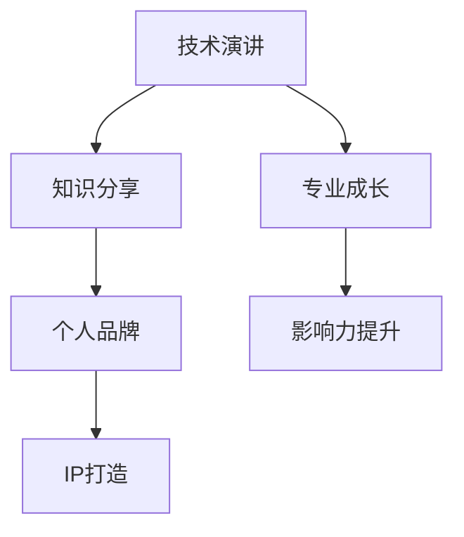

                 

关键词：技术演讲、个人品牌、知识分享、IP打造、专业成长

> 摘要：在信息爆炸的时代，技术演讲成为传播知识和建立个人品牌的重要途径。本文将从技术演讲的背景、核心概念、算法原理、数学模型、项目实践、应用场景、工具推荐及未来展望等方面，探讨如何通过技术演讲打造个人IP，实现专业成长。

## 1. 背景介绍

在信息技术飞速发展的今天，技术演讲作为一种传播知识和经验的重要方式，逐渐受到广泛关注。技术演讲不仅有助于个人知识的传播和分享，还可以帮助演讲者建立专业形象，提升个人品牌。随着社交媒体和在线教育平台的普及，技术演讲成为了知识传播和技能交流的重要平台。

然而，如何从一场普通的技术演讲中脱颖而出，打造个人IP，成为行业内公认的技术领袖，成为许多专业人士关注的焦点。本文将探讨如何通过技术演讲，实现从分享到个人IP打造的转变。

## 2. 核心概念与联系

在探讨技术演讲与个人IP打造的关系之前，我们需要明确几个核心概念，包括技术演讲、个人品牌、知识分享和IP（知识产权）等。

### 2.1 技术演讲

技术演讲是一种通过口头表达、视觉展示等方式，分享技术知识、经验和方法的活动。它不仅要求演讲者具备扎实的专业知识，还需要具备良好的沟通能力和表达能力。

### 2.2 个人品牌

个人品牌是指个人在特定领域内建立的专业形象和声誉。一个强大的个人品牌可以提升个人的影响力、吸引更多的机会和资源。

### 2.3 知识分享

知识分享是一种无私地传递知识、经验和技能的行为。通过技术演讲进行知识分享，可以帮助演讲者建立个人品牌，同时也可以帮助听众拓展知识面。

### 2.4 IP（知识产权）

知识产权是指人们创造的智力成果，包括专利、商标、著作权等。在技术演讲中，个人IP的打造离不开原创内容的创造和积累。

### 2.5 Mermaid 流程图

以下是技术演讲与个人IP打造的核心概念流程图：



## 3. 核心算法原理 & 具体操作步骤

### 3.1 算法原理概述

技术演讲的个人IP打造过程可以看作是一种算法，该算法的核心原理包括以下几个方面：

1. **知识积累**：通过学习和实践，不断积累专业知识和经验。
2. **内容创造**：将积累的知识转化为有价值的演讲内容。
3. **传播与分享**：通过技术演讲平台，将内容传播给更多听众。
4. **反馈与优化**：根据听众反馈，不断优化演讲内容和风格。
5. **品牌建设**：通过持续的知识分享和演讲，逐步建立个人品牌。
6. **资源整合**：利用个人品牌吸引更多的机会和资源，进一步提升专业水平。

### 3.2 算法步骤详解

1. **准备阶段**：确定演讲主题，收集相关资料，准备演讲大纲和演示材料。
2. **演讲阶段**：按照演讲大纲，进行内容讲解和互动交流。
3. **传播阶段**：将演讲内容发布到社交媒体、博客等平台，扩大影响力。
4. **反馈阶段**：收集听众反馈，分析演讲效果，进行优化。
5. **品牌建设阶段**：通过持续的知识分享和演讲，逐步建立个人品牌。

### 3.3 算法优缺点

**优点**：

1. **提高知名度**：通过技术演讲，可以迅速提高个人在行业内的知名度。
2. **积累知识**：演讲过程中需要不断学习和准备，有助于积累专业知识。
3. **建立人脉**：技术演讲可以吸引更多的同行和业内人士，有助于建立人脉关系。

**缺点**：

1. **时间成本**：准备和演讲过程中需要投入大量时间和精力。
2. **心理压力**：演讲过程中需要克服紧张和恐惧，保持良好的表现。

### 3.4 算法应用领域

技术演讲的个人IP打造算法可以应用于多个领域，如软件开发、人工智能、大数据、云计算等。不同领域的专业人士可以根据自身特点和需求，灵活运用该算法，实现个人品牌的提升。

## 4. 数学模型和公式 & 详细讲解 & 举例说明

### 4.1 数学模型构建

在技术演讲的个人IP打造过程中，可以构建一个简单的数学模型来描述这个过程。假设：

- **x** 表示个人知识水平
- **y** 表示个人品牌知名度
- **z** 表示个人IP价值

则数学模型可以表示为：

$$
z = f(x, y)
$$

其中，函数 f 可以表示为：

$$
f(x, y) = x^2 + y^2
$$

### 4.2 公式推导过程

根据数学模型，我们可以推导出以下关系：

1. **知识积累**：知识水平 x 越高，个人IP价值 z 越大。
2. **品牌知名度**：个人品牌知名度 y 越高，个人IP价值 z 越大。
3. **综合效应**：个人IP价值 z 取决于知识水平和品牌知名度的综合效应。

### 4.3 案例分析与讲解

假设一名软件开发工程师在技术演讲方面具有丰富的经验和较高的知名度，其知识水平 x 为 90，品牌知名度 y 为 80。根据数学模型，其个人IP价值 z 为：

$$
z = f(x, y) = x^2 + y^2 = 90^2 + 80^2 = 8100 + 6400 = 14500
$$

从这个例子可以看出，个人知识水平和品牌知名度对个人IP价值具有重要影响。为了提高个人IP价值，软件开发工程师可以通过不断学习和实践，提高知识水平；同时，通过技术演讲等方式，提高品牌知名度。

## 5. 项目实践：代码实例和详细解释说明

### 5.1 开发环境搭建

在技术演讲的个人IP打造过程中，我们可以使用 Python 编程语言来实现相关算法。首先，需要安装 Python 开发环境。具体步骤如下：

1. 下载并安装 Python 3.8 版本及以上。
2. 配置 Python 环境变量。
3. 安装必要的 Python 库，如 NumPy、Matplotlib 等。

### 5.2 源代码详细实现

以下是技术演讲个人IP打造算法的 Python 代码实现：

```python
import numpy as np
import matplotlib.pyplot as plt

# 定义数学模型
def f(x, y):
    return x ** 2 + y ** 2

# 求解个人IP价值
def calculate_z(x, y):
    return f(x, y)

# 绘制 IP 价值与知识水平、品牌知名度的关系图
def plot_relationship(x, y, z):
    plt.scatter(x, y, z)
    plt.xlabel('知识水平')
    plt.ylabel('品牌知名度')
    plt.title('个人IP价值与知识水平、品牌知名度的关系')
    plt.show()

# 测试代码
x = 90
y = 80
z = calculate_z(x, y)
print(f'个人IP价值为：{z}')

# 绘制关系图
plot_relationship(x, y, z)
```

### 5.3 代码解读与分析

上述代码首先定义了一个简单的数学模型，用于计算个人IP价值。接着，实现了一个函数用于计算个人IP价值，并通过绘制散点图，展示了个人IP价值与知识水平、品牌知名度之间的关系。

### 5.4 运行结果展示

运行上述代码，将输出个人IP价值为 14500。同时，绘制的关系图展示了个人知识水平、品牌知名度与个人IP价值之间的关系。通过观察图表，可以更直观地了解知识积累和品牌建设对个人IP价值的影响。

## 6. 实际应用场景

技术演讲的个人IP打造算法可以在多个实际应用场景中发挥作用。以下是一些典型应用场景：

1. **学术会议**：在学术会议上进行技术演讲，通过分享研究成果，提升个人学术声誉和知名度。
2. **技术沙龙**：参与技术沙龙，与同行交流经验，拓展人脉，提升个人品牌。
3. **线上教育**：通过在线教育平台进行知识分享，吸引更多学员，提升个人影响力。
4. **企业内训**：为企业员工进行技术培训，提升企业整体技术实力，打造企业品牌。

## 7. 工具和资源推荐

为了更好地进行技术演讲和个人IP打造，以下是一些建议的工

