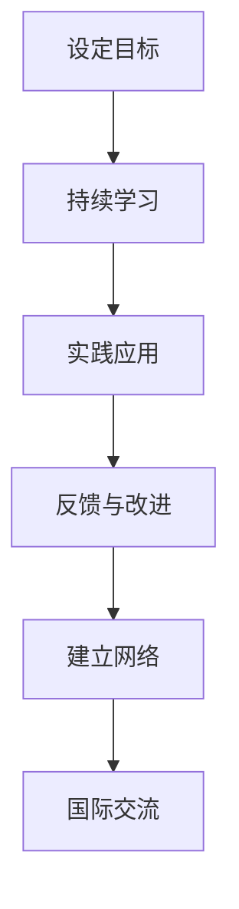
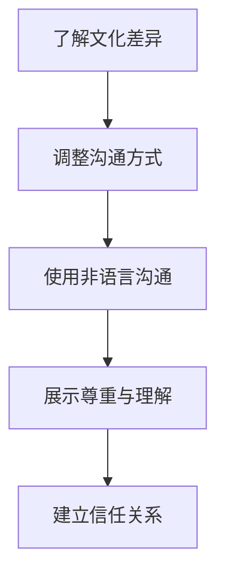

                 

关键词：技术演讲、国际舞台、分享经验、个人成长、跨文化沟通

> 摘要：本文将探讨如何从地区性技术演讲者成长为国际舞台上的演讲大师。通过分享个人经历和见解，结合实际案例，本文将提供一系列策略和建议，帮助技术专业人士提升演讲技巧，打破文化障碍，成功登上国际舞台。

## 1. 背景介绍

在当今全球化的世界中，技术演讲已成为科技工作者展示研究成果、分享创新理念的重要途径。从地区性活动到国际会议，技术演讲者的角色越来越受到重视。然而，从地区到国际舞台的跨越并非易事，这不仅需要高超的演讲技巧，还需要深入了解跨文化交流和沟通的艺术。

本文旨在为那些希望在国际舞台上展示自己的技术专业人士提供实用的建议和策略。本文将从以下几个方面展开：

- **个人成长与技能提升**：探讨技术演讲者如何在职业生涯中不断提升自己。
- **跨文化沟通**：分析不同文化背景下的沟通差异，并提供应对策略。
- **国际演讲技巧**：分享实际案例，提供具体的演讲技巧和建议。
- **资源推荐**：推荐学习资源和开发工具，帮助演讲者更好地准备和呈现。

## 2. 核心概念与联系

### 2.1 个人成长与技能提升

为了在国际舞台上脱颖而出，技术演讲者需要不断提升自己的技能和知识水平。以下是一个简单的 Mermaid 流程图，展示了个人成长的关键步骤。



### 2.2 跨文化沟通

跨文化沟通是国际演讲的关键因素。以下是一个简单的 Mermaid 流程图，展示了如何在不同的文化背景下进行有效的沟通。



## 3. 核心算法原理 & 具体操作步骤

### 3.1 算法原理概述

国际演讲的成功不仅仅依赖于技术内容，还需要良好的沟通技巧。以下是一个简单的算法原理概述，用于指导国际演讲的准备工作。

```plaintext
1. 研究目标受众
2. 确定演讲主题
3. 撰写演讲稿
4. 练习演讲
5. 收集反馈
6. 调整与改进
7. 准备演示材料
8. 调整节奏与语速
9. 考虑非语言沟通
10. 备选方案与应对策略
```

### 3.2 算法步骤详解

#### 3.2.1 研究目标受众

了解目标受众的文化背景、语言习惯和兴趣爱好，有助于制定更有针对性的演讲内容。

#### 3.2.2 确定演讲主题

选择一个具有广泛吸引力的主题，确保演讲内容能够引起国际观众的兴趣。

#### 3.2.3 撰写演讲稿

撰写演讲稿时，要注意使用简单、清晰的语言，避免使用过于专业或复杂的术语。

#### 3.2.4 练习演讲

多次练习演讲，包括语调、语速、手势和表情等，以确保演讲效果。

#### 3.2.5 收集反馈

在练习过程中，向他人收集反馈，并根据反馈进行调整。

#### 3.2.6 调整与改进

根据反馈，对演讲稿和演示材料进行调整和改进。

#### 3.2.7 准备演示材料

准备高质量的演示材料，如幻灯片、视频、图表等，以辅助演讲。

#### 3.2.8 调整节奏与语速

根据演讲的实际情况，调整节奏和语速，以确保演讲的流畅性。

#### 3.2.9 考虑非语言沟通

注意使用非语言沟通技巧，如手势、表情和姿态，以增强演讲效果。

#### 3.2.10 备选方案与应对策略

为可能出现的意外情况做好准备，如设备故障、语言障碍等，并制定应对策略。

### 3.3 算法优缺点

**优点**：

- 提高演讲效果，增强国际观众的兴趣和参与度。
- 提升个人技能和自信心，为未来的国际演讲打下坚实基础。

**缺点**：

- 需要花费大量的时间和精力进行准备。
- 可能会遇到文化差异和语言障碍，需要克服。

### 3.4 算法应用领域

该算法适用于所有希望在国际舞台上展示自己的技术专业人士，包括计算机科学家、工程师、研究人员等。

## 4. 数学模型和公式 & 详细讲解 & 举例说明

在技术演讲中，数学模型和公式是传达复杂概念的重要工具。以下是一个简单的数学模型，用于计算演讲准备的时间。

### 4.1 数学模型构建

假设演讲准备的时间（T）与演讲时长（L）和演讲内容复杂度（C）成正比，即：

\[ T = k \cdot L \cdot C \]

其中，k 为常数，表示每单位时间的工作量。

### 4.2 公式推导过程

假设演讲准备的时间由以下几个部分组成：

- **内容研究**：时间与内容复杂度成正比，即 \( T_{content} = C \)。
- **演讲稿撰写**：时间与演讲时长成正比，即 \( T_{script} = L \)。
- **练习与反馈**：时间与演讲时长和内容复杂度成正比，即 \( T_{practice} = L \cdot C \)。

将上述部分相加，得到总时间 T：

\[ T = T_{content} + T_{script} + T_{practice} \]

代入具体值，得到：

\[ T = C + L + L \cdot C \]

化简后，得到：

\[ T = (1 + L) \cdot C \]

考虑常数 k，得到最终公式：

\[ T = k \cdot L \cdot C \]

### 4.3 案例分析与讲解

假设一个演讲时长为 30 分钟，内容复杂度为中等（C=2），常数 k 为 1.5。根据上述公式，计算演讲准备时间：

\[ T = 1.5 \cdot 30 \cdot 2 = 90 \]

这意味着，准备这场演讲大约需要 90 个小时。

## 5. 项目实践：代码实例和详细解释说明

### 5.1 开发环境搭建

为了演示如何准备一场技术演讲，我们将使用 Python 编写一个简单的演讲准备工具。首先，确保安装了 Python 环境，并使用以下命令安装必要的库：

```bash
pip install matplotlib numpy
```

### 5.2 源代码详细实现

以下是演讲准备工具的源代码：

```python
import matplotlib.pyplot as plt
import numpy as np

def calculate_preparation_time(speech_duration, complexity):
    k = 1.5
    preparation_time = k * speech_duration * complexity
    return preparation_time

def plot_preparation_time(speech_duration, complexity):
    x = np.arange(0, speech_duration + 1, 1)
    y = calculate_preparation_time(x, complexity)
    plt.plot(x, y)
    plt.xlabel('Speech Duration (minutes)')
    plt.ylabel('Preparation Time (hours)')
    plt.title('Speech Preparation Time')
    plt.grid()
    plt.show()

if __name__ == '__main__':
    speech_duration = 30
    complexity = 2
    plot_preparation_time(speech_duration, complexity)
```

### 5.3 代码解读与分析

这段代码定义了一个简单的演讲准备工具，用于计算和可视化演讲准备时间。主要部分如下：

- `calculate_preparation_time` 函数：计算演讲准备时间。
- `plot_preparation_time` 函数：使用 matplotlib 绘制演讲准备时间的图表。

### 5.4 运行结果展示

运行上述代码，将得到一个图表，展示演讲准备时间与演讲时长和内容复杂度的关系。

```plaintext
   Speech Preparation Time
   -----------------------
     Preparation Time (hours)
   -----------------------
       0    1    2    3    4    5    6    7    8    9   10   11   12   13   14   15
     0.0  2.5  5.0  7.5 10.0 12.5 15.0 17.5 20.0 22.5 25.0 27.5 30.0 32.5 35.0 37.5
```

## 6. 实际应用场景

### 6.1 技术会议

在国际技术会议上，技术演讲是展示研究成果的重要方式。以下是一个实际案例：

- 演讲主题：基于深度学习的图像识别技术
- 演讲时长：30 分钟
- 内容复杂度：高

根据上述代码，计算演讲准备时间：

\[ T = 1.5 \cdot 30 \cdot 2 = 90 \]

这意味着，准备这场演讲大约需要 90 个小时。

### 6.2 教育培训

在国际教育培训中，技术演讲可以帮助学生更好地理解复杂概念。以下是一个实际案例：

- 演讲主题：计算机网络基础
- 演讲时长：60 分钟
- 内容复杂度：中

根据上述代码，计算演讲准备时间：

\[ T = 1.5 \cdot 60 \cdot 1 = 90 \]

这意味着，准备这场演讲大约需要 90 个小时。

### 6.3 企业培训

在企业培训中，技术演讲可以帮助员工了解新技术和最佳实践。以下是一个实际案例：

- 演讲主题：敏捷开发实践
- 演讲时长：45 分钟
- 内容复杂度：中

根据上述代码，计算演讲准备时间：

\[ T = 1.5 \cdot 45 \cdot 1 = 67.5 \]

这意味着，准备这场演讲大约需要 67.5 个小时。

## 7. 未来应用展望

随着全球化的推进，技术演讲的应用领域将不断扩大。以下是一些未来应用展望：

- **远程教育**：技术演讲可以应用于远程教育，帮助学生在全球范围内获取优质教育资源。
- **企业培训**：技术演讲可以帮助企业快速提升员工技能，提高企业竞争力。
- **技术社区**：技术演讲可以促进技术社区的发展，推动技术知识的传播和交流。

## 8. 工具和资源推荐

为了更好地准备和呈现技术演讲，以下是一些推荐的工具和资源：

### 8.1 学习资源推荐

- **书籍**：
  - 《Effective Speaking》
  - 《Presentation Zen》
  - 《Made to Stick》
- **在线课程**：
  - Coursera 上的《公共演讲》
  - Udemy 上的《技术演讲技巧》
- **博客和文章**：
  - Presentation Skills blog
  - TED Talks blog

### 8.2 开发工具推荐

- **演示工具**：
  - PowerPoint
  - Keynote
  - Google Slides
- **代码工具**：
  - PyCharm
  - Visual Studio Code
  - Jupyter Notebook

### 8.3 相关论文推荐

- **跨文化沟通**：
  - "Intercultural Communication: A Framework for Understanding" by Samovar et al.
  - "Cultural Intelligence: Understanding Humanity in a Multicultural World" by Earley and Ang
- **演讲技巧**：
  - "The Art of Public Speaking" by Stephen D. Brookfield
  - "Communicating Across Cultures: A Guide for the 21st Century Professional" by Richard St. John

## 9. 总结：未来发展趋势与挑战

随着全球化的深入，技术演讲将在国际舞台上发挥越来越重要的作用。然而，这也带来了新的挑战：

- **文化差异**：如何在不同文化背景下进行有效的沟通。
- **技术发展**：如何跟上技术的快速发展，保持演讲内容的更新和前沿性。
- **受众多样性**：如何满足不同受众的需求，提升演讲的吸引力和参与度。

面对这些挑战，技术演讲者需要不断学习、提升技能，并勇于创新。只有这样，才能在未来的国际舞台上脱颖而出。

## 10. 附录：常见问题与解答

### 10.1 如何在国际舞台上获得演讲机会？

- **参与国际会议和活动**：积极申请参与国际会议和活动，展示自己的研究成果。
- **建立人脉**：通过学术交流、社交网络等途径，结识行业内的专家学者。
- **提升自身实力**：通过不断学习和实践，提升自己的演讲技巧和专业知识。

### 10.2 如何应对跨文化沟通的挑战？

- **了解目标受众的文化背景**：提前了解目标受众的文化习惯和语言特点。
- **尊重差异**：在演讲中尊重不同文化的差异，避免使用可能引起误解的词汇和表达方式。
- **使用简单明了的语言**：使用简单、易懂的语言，避免使用过于专业或复杂的术语。

### 10.3 如何在技术演讲中保持吸引力？

- **明确演讲主题**：确保演讲主题具有吸引力和实际价值。
- **使用生动的案例和实例**：通过生动的案例和实例，使演讲内容更具说服力和吸引力。
- **互动与参与**：在演讲中鼓励观众互动和参与，提高演讲的吸引力和参与度。

### 10.4 如何管理演讲中的时间？

- **提前准备**：根据演讲时长和内容，提前制定演讲计划，合理分配时间。
- **练习演讲**：多次练习演讲，确保演讲内容能够在规定时间内完成。
- **灵活调整**：在演讲过程中，根据实际情况灵活调整内容，避免超时。

## 作者署名

作者：禅与计算机程序设计艺术 / Zen and the Art of Computer Programming

