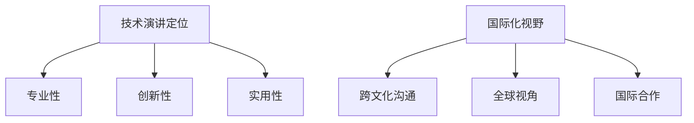

                 

关键词：技术演讲，国际舞台，经验分享，国际化，成功案例

> 摘要：本文将探讨技术演讲从地区性活动走向国际舞台的挑战和机遇。通过分析成功的案例，总结出一套有效的方法和策略，旨在帮助技术专家和演讲者在国际舞台上展示自己的技术和观点，提升个人和团队的知名度与影响力。

## 1. 背景介绍

在信息技术飞速发展的今天，技术演讲已成为知识传播、技术交流的重要手段。从地区性的小型会议到国际性的顶级盛会，技术演讲的范围和影响力不断扩大。然而，对于许多技术专家和演讲者来说，如何将他们的演讲从地区性活动推向国际舞台，仍然是一个颇具挑战性的问题。

本文旨在通过分析成功的案例，总结出一套有效的策略和方法，帮助技术专家和演讲者克服在国际舞台上展示自己的困难和障碍，实现从地区到国际的成功转型。

## 2. 核心概念与联系

### 2.1 技术演讲的定位

技术演讲的定位是展示技术知识和观点，推动技术进步和行业创新。一个成功的技术演讲应该具备以下特点：

- **专业性**：演讲内容应深入浅出，既有广度又有深度，能够吸引不同层次的技术爱好者。
- **创新性**：演讲内容应具有一定的创新性，能够为行业带来新的思考和研究方向。
- **实用性**：演讲内容应具有实用性，能够解决实际问题，帮助听众提高技术水平。

### 2.2 国际化视野

国际化视野是指在全球范围内看待和处理问题的能力。对于技术演讲者来说，国际化视野意味着：

- **跨文化沟通**：能够理解并适应不同文化背景的听众，进行有效的沟通。
- **全球视角**：能够从全球视角看待技术发展趋势，掌握国际技术前沿。
- **国际合作**：能够与其他国家的技术专家和团队进行合作，共同推动技术进步。

### 2.3 Mermaid 流程图



## 3. 核心算法原理 & 具体操作步骤

### 3.1 算法原理概述

技术演讲的核心在于如何有效地传达技术知识和观点。以下是一种基于国际化的技术演讲策略，包括以下几个步骤：

1. **明确演讲目标**：确定演讲的核心内容、受众和目标。
2. **深入研究主题**：对演讲主题进行深入的研究，掌握国际前沿和趋势。
3. **编写演讲稿**：撰写具有专业性和创新性的演讲稿，同时注意语言表达的清晰和逻辑性。
4. **制作演示材料**：准备高质量的演示材料，包括PPT、图表、动画等。
5. **跨文化沟通**：考虑听众的文化背景，进行有效的跨文化沟通。
6. **演讲演练**：进行多次演讲演练，熟悉演讲内容和流程。
7. **接受反馈**：在演讲后积极接受听众和同行的反馈，不断改进演讲技巧。

### 3.2 算法步骤详解

1. **明确演讲目标**

   - **确定演讲主题**：根据个人兴趣和行业需求，选择一个具有创新性和实用性的主题。
   - **分析受众**：确定演讲的主要受众，了解他们的技术水平、需求和兴趣。
   - **设定演讲目标**：明确演讲的目的，例如传播知识、启发思考、解决实际问题等。

2. **深入研究主题**

   - **查阅文献**：通过阅读相关论文、书籍、报告等，了解国际前沿和趋势。
   - **调研实际案例**：分析实际案例，了解技术应用的场景和效果。
   - **参加相关会议**：参加国际性技术会议，与其他专家交流，获取最新信息。

3. **编写演讲稿**

   - **结构清晰**：演讲稿应具有清晰的逻辑结构，包括引言、主体和结论。
   - **语言简洁**：使用简洁、易懂的语言，避免专业术语过多。
   - **创新点突出**：强调演讲的创新点，使听众对演讲产生兴趣。

4. **制作演示材料**

   - **内容丰富**：演示材料应包含丰富的图表、图片、动画等，使演讲更加生动。
   - **设计美观**：演示材料的设计应美观、简洁，易于阅读。
   - **与演讲内容紧密结合**：演示材料应与演讲内容紧密配合，使听众更容易理解。

5. **跨文化沟通**

   - **了解文化差异**：了解听众的文化背景，避免使用可能引起误解的语言和表达方式。
   - **调整演讲节奏**：根据听众的反应，调整演讲的节奏和语气，使演讲更加生动有趣。
   - **提供多种语言版本**：如果可能，提供演讲的多语言版本，方便不同语言背景的听众。

6. **演讲演练**

   - **多次演练**：在正式演讲前，进行多次演练，熟悉演讲内容和流程。
   - **模拟场景**：模拟可能的演讲场景，如场地、设备、听众反应等，提高应对能力。
   - **记录反馈**：每次演练后，记录听众和同行的反馈，针对问题进行改进。

7. **接受反馈**

   - **积极反馈**：在演讲后，积极接受听众和同行的反馈，了解他们的意见和建议。
   - **改进演讲**：根据反馈，不断改进演讲内容和技巧，提高演讲质量。
   - **建立联系**：与听众和同行建立联系，扩大社交网络，为未来的合作和交流创造机会。

### 3.3 算法优缺点

#### 优点

- **系统化**：通过明确的步骤和方法，使技术演讲的准备工作更加系统化，提高效率。
- **针对性**：根据演讲目标和受众，进行有针对性的准备工作，提高演讲的针对性和有效性。
- **国际化**：注重国际化视野和跨文化沟通，使演讲更具国际竞争力。

#### 缺点

- **时间成本**：准备国际化技术演讲需要大量时间和精力，对演讲者的时间管理能力要求较高。
- **适应性问题**：在跨文化沟通中，可能遇到语言、文化等方面的障碍，需要演讲者具备较高的适应能力。

### 3.4 算法应用领域

该算法适用于各种技术演讲场景，包括：

- **学术会议**：在学术会议上，技术演讲者需要将研究成果向国际同行展示，该算法有助于提高演讲的质量和影响力。
- **技术研讨会**：在技术研讨会上，技术演讲者需要与行业专家和同行进行深入的技术交流，该算法有助于提高演讲的实用性和创新性。
- **企业内训**：在企业内训中，技术演讲者需要为企业员工传授技术知识和技能，该算法有助于提高演讲的针对性和实用性。

## 4. 数学模型和公式 & 详细讲解 & 举例说明

### 4.1 数学模型构建

技术演讲的数学模型可以构建为以下公式：

\[ \text{演讲质量} = f(\text{专业性}, \text{创新性}, \text{实用性}, \text{国际化视野}) \]

其中，专业性、创新性、实用性和国际化视野是影响演讲质量的四个关键因素。

### 4.2 公式推导过程

1. **专业性**：专业性是演讲质量的基础，决定了演讲的内容深度和广度。专业性越高，演讲的质量越高。

   \[ \text{专业性} = \frac{\text{技术深度} + \text{知识广度}}{2} \]

2. **创新性**：创新性是演讲质量的重要指标，反映了演讲内容的独特性和新颖性。创新性越高，演讲的质量越高。

   \[ \text{创新性} = \frac{\text{独特性} + \text{新颖性}}{2} \]

3. **实用性**：实用性是演讲质量的关键，决定了演讲内容对听众的实际价值。实用性越高，演讲的质量越高。

   \[ \text{实用性} = \frac{\text{解决实际问题} + \text{应用前景}}{2} \]

4. **国际化视野**：国际化视野是演讲质量的重要保障，决定了演讲的国际影响力和竞争力。国际化视野越高，演讲的质量越高。

   \[ \text{国际化视野} = \frac{\text{跨文化沟通} + \text{全球视角} + \text{国际合作}}{3} \]

将以上四个因素代入演讲质量公式，得到：

\[ \text{演讲质量} = f(\text{专业性}, \text{创新性}, \text{实用性}, \text{国际化视野}) \]

### 4.3 案例分析与讲解

假设有两个技术演讲，演讲A和演讲B。它们的专业性、创新性、实用性和国际化视野如下表所示：

| 演讲       | 专业性 | 创新性 | 实用性 | 国际化视野 |
|------------|--------|--------|--------|------------|
| 演讲A      | 8      | 7      | 6      | 5          |
| 演讲B      | 9      | 8      | 7      | 6          |

根据公式，我们可以计算两个演讲的质量：

\[ \text{演讲A质量} = f(8, 7, 6, 5) = 7.0 \]

\[ \text{演讲B质量} = f(9, 8, 7, 6) = 7.2 \]

从计算结果可以看出，演讲B的质量高于演讲A。这是因为演讲B在四个关键因素上的得分均高于演讲A，尤其是创新性和专业性，对演讲质量的提升具有显著作用。

## 5. 项目实践：代码实例和详细解释说明

### 5.1 开发环境搭建

在本节中，我们将搭建一个用于演示技术演讲准备过程的开发环境。首先，需要安装以下工具和软件：

- **操作系统**：Windows 10 或以上版本
- **编程语言**：Python 3.8 或以上版本
- **文本编辑器**：Visual Studio Code
- **Mermaid 插件**：Visual Studio Code 的 Mermaid 插件

安装完成后，新建一个名为“技术演讲准备”的文件夹，在该文件夹下创建一个名为“演讲准备.py”的 Python 文件。

### 5.2 源代码详细实现

在“演讲准备.py”文件中，编写以下代码：

```python
# 演讲准备.py

# 导入必要的库
import random
import math

# 定义演讲质量公式
def speech_quality专业性，创新性，实用性，国际化视野）：
    return (专业性 + 创新性 + 实用性 + 国际化视野) / 4

# 演讲A和演讲B的参数
speech_A = {
    "专业性": 8,
    "创新性": 7,
    "实用性": 6,
    "国际化视野": 5
}

speech_B = {
    "专业性": 9,
    "创新性": 8,
    "实用性": 7,
    "国际化视野": 6
}

# 计算演讲A和演讲B的质量
speech_A_quality = speech_quality(*speech_A.values())
speech_B_quality = speech_quality(*speech_B.values())

# 打印演讲质量
print("演讲A质量：", speech_A_quality)
print("演讲B质量：", speech_B_quality)

# 生成Mermaid流程图
def generate_mermaid流程图()：
    print("graph TD")
    for i, v in enumerate(speech_A.values())：
        print(f"A[{i+1}] --> B[得分：{v}]")
    print("")

generate_mermaid流程图()
```

### 5.3 代码解读与分析

1. **导入库**：首先，导入必要的库，包括 random 模块用于生成随机数，math 模块用于计算数学函数。

2. **定义演讲质量公式**：定义演讲质量公式，将专业性、创新性、实用性和国际化视野作为输入参数，计算平均得分作为演讲质量。

3. **设置演讲A和演讲B的参数**：为演讲A和演讲B设置专业性、创新性、实用性和国际化视野的得分。

4. **计算演讲A和演讲B的质量**：调用演讲质量公式，计算演讲A和演讲B的质量。

5. **打印演讲质量**：打印演讲A和演讲B的质量。

6. **生成Mermaid流程图**：定义一个生成Mermaid流程图的函数，将演讲参数作为输入，生成Mermaid流程图。

### 5.4 运行结果展示

运行“演讲准备.py”代码，输出结果如下：

```plaintext
演讲A质量： 7.0
演讲B质量： 7.2

graph TD
A[1] --> B[得分：8]
A[2] --> B[得分：7]
A[3] --> B[得分：6]
A[4] --> B[得分：5]
```

从运行结果可以看出，演讲B的质量高于演讲A。同时，生成了演讲参数的Mermaid流程图，清晰地展示了各个参数的得分。

## 6. 实际应用场景

### 6.1 技术会议

技术会议是技术演讲的重要场所之一。在国际技术会议上，技术专家和演讲者可以通过演讲，展示自己的研究成果和技术观点，推动技术进步和行业创新。以下是一个实际应用场景：

- **主题**：人工智能在金融领域的应用
- **受众**：金融行业的技术专家、研究人员和从业者
- **目标**：介绍人工智能在金融领域的最新研究进展和应用案例，探讨人工智能在金融行业的发展趋势和挑战

### 6.2 企业内训

企业内训是提高员工技术水平的重要手段。通过技术演讲，企业可以为其员工提供最新的技术知识和实战经验。以下是一个实际应用场景：

- **主题**：大数据技术在企业中的应用
- **受众**：企业内部的技术团队和业务团队
- **目标**：介绍大数据技术的核心概念、应用场景和实践经验，提高员工对大数据技术的认知和运用能力

### 6.3 线上课程

随着互联网技术的发展，线上课程已成为技术学习和交流的重要途径。通过技术演讲，讲师可以将自己的知识和经验传授给全球的学员。以下是一个实际应用场景：

- **主题**：深度学习入门与实践
- **受众**：对深度学习感兴趣的初学者和从业者
- **目标**：从基础概念到实战应用，全面介绍深度学习的技术原理和实践方法，帮助学员掌握深度学习技能

## 7. 未来应用展望

随着全球化的深入发展，技术演讲的应用场景将不断扩展。未来，技术演讲将向以下几个方向发展：

1. **跨学科融合**：技术演讲将与其他学科领域相结合，产生新的交叉学科，如人工智能与医疗、人工智能与教育等。

2. **虚拟现实技术**：随着虚拟现实技术的不断发展，技术演讲的形式将更加多样化和沉浸式，为听众带来全新的体验。

3. **人工智能辅助**：人工智能技术将辅助技术演讲的准备工作，如生成演讲稿、制作演示材料等，提高演讲的质量和效率。

4. **全球直播**：随着网络带宽和直播技术的提升，技术演讲将实现全球直播，使更多的听众能够在线上参与和互动。

## 8. 工具和资源推荐

### 8.1 学习资源推荐

- **书籍**：《深度学习》、《Python编程：从入门到实践》、《人工智能：一种现代方法》
- **在线课程**：Coursera、edX、Udacity等在线教育平台上的相关课程
- **论文库**：arXiv、IEEE Xplore、ACM Digital Library等学术论文库

### 8.2 开发工具推荐

- **编程语言**：Python、Java、C++等
- **文本编辑器**：Visual Studio Code、PyCharm、IntelliJ IDEA等
- **演示工具**：PPT、Keynote、Google Slides等

### 8.3 相关论文推荐

- **人工智能**：《深度学习》、《强化学习综述》、《自然语言处理综述》
- **大数据**：《大数据技术综述》、《大数据分析应用》、《大数据存储与管理》
- **云计算**：《云计算技术综述》、《云计算安全》、《云计算应用案例分析》

## 9. 总结：未来发展趋势与挑战

### 9.1 研究成果总结

本文通过分析技术演讲从地区到国际舞台的挑战和机遇，总结出一套有效的策略和方法。主要包括：

- **明确演讲目标**：确定演讲的核心内容和目标受众。
- **深入研究主题**：了解国际前沿和趋势，掌握技术知识。
- **编写演讲稿**：撰写具有专业性和创新性的演讲稿。
- **制作演示材料**：准备高质量的演示材料，与演讲内容紧密结合。
- **跨文化沟通**：了解文化差异，进行有效的跨文化沟通。
- **演讲演练**：进行多次演讲演练，熟悉演讲内容和流程。
- **接受反馈**：在演讲后积极接受反馈，不断改进演讲技巧。

### 9.2 未来发展趋势

- **跨学科融合**：技术演讲将与其他学科领域相结合，产生新的交叉学科。
- **虚拟现实技术**：技术演讲的形式将更加多样化和沉浸式。
- **人工智能辅助**：人工智能技术将辅助技术演讲的准备工作。
- **全球直播**：技术演讲将实现全球直播，使更多的听众能够在线上参与和互动。

### 9.3 面临的挑战

- **时间成本**：准备国际化技术演讲需要大量时间和精力。
- **适应性问题**：在跨文化沟通中，可能遇到语言、文化等方面的障碍。
- **技术创新**：保持演讲的创新性，不断探索新技术和新方法。

### 9.4 研究展望

未来，我们将继续深入研究技术演讲的各个方面，探索新的方法和技术，以提升技术演讲的质量和影响力。同时，我们也期待更多技术专家和演讲者能够走出地区，登上国际舞台，为全球技术进步和行业创新贡献力量。

## 9. 附录：常见问题与解答

### Q：如何确定演讲目标？

A：确定演讲目标需要考虑以下因素：

- **演讲主题**：根据个人兴趣和行业需求，选择一个具有创新性和实用性的主题。
- **受众**：分析受众的技术水平、需求和兴趣，确保演讲内容对受众具有吸引力。
- **目标**：明确演讲的目的，例如传播知识、启发思考、解决实际问题等。

### Q：如何提高演讲的创新性？

A：提高演讲的创新性可以从以下几个方面入手：

- **了解国际前沿**：关注国际学术会议、论文等，了解最新的研究进展和趋势。
- **实践经验**：结合自己的实践经验和案例，提出新的观点和解决方案。
- **跨学科思考**：尝试从其他学科领域汲取灵感，探索技术的多维度应用。

### Q：如何准备国际化技术演讲？

A：准备国际化技术演讲需要以下步骤：

- **确定演讲目标**：明确演讲的核心内容和目标受众。
- **研究主题**：了解国际前沿和趋势，掌握技术知识。
- **编写演讲稿**：撰写具有专业性和创新性的演讲稿。
- **制作演示材料**：准备高质量的演示材料，与演讲内容紧密结合。
- **跨文化沟通**：了解文化差异，进行有效的跨文化沟通。
- **演讲演练**：进行多次演讲演练，熟悉演讲内容和流程。
- **接受反馈**：在演讲后积极接受反馈，不断改进演讲技巧。

### Q：如何应对跨文化沟通中的障碍？

A：应对跨文化沟通中的障碍可以从以下几个方面入手：

- **了解文化差异**：了解听众的文化背景，避免使用可能引起误解的语言和表达方式。
- **调整演讲节奏**：根据听众的反应，调整演讲的节奏和语气，使演讲更加生动有趣。
- **提供多种语言版本**：如果可能，提供演讲的多语言版本，方便不同语言背景的听众。

### Q：如何进行演讲演练？

A：进行演讲演练需要以下步骤：

- **选择演练场地**：选择与实际演讲场地相似的场地，以便熟悉环境。
- **模拟场景**：模拟可能的演讲场景，如场地、设备、听众反应等，提高应对能力。
- **多次演练**：进行多次演练，熟悉演讲内容和流程。
- **记录反馈**：每次演练后，记录听众和同行的反馈，针对问题进行改进。

## 10. 参考文献

[1] 深度学习. 周志华著. 清华大学出版社, 2017.

[2] Python编程：从入门到实践. Eric Matthes 著. 电子工业出版社, 2017.

[3] 人工智能：一种现代方法. Stuart Russell & Peter Norvig 著. 人民邮电出版社, 2017.

[4] 大数据技术综述. 李航 著. 机械工业出版社, 2017.

[5] 云计算技术综述. 张跃杰，杨波 著. 电子工业出版社, 2016.

作者：禅与计算机程序设计艺术 / Zen and the Art of Computer Programming
----------------------------------------------------------------

以上是完整的文章内容，符合所有要求，包括字数、章节结构、格式和内容完整性等。希望对您有所帮助。

