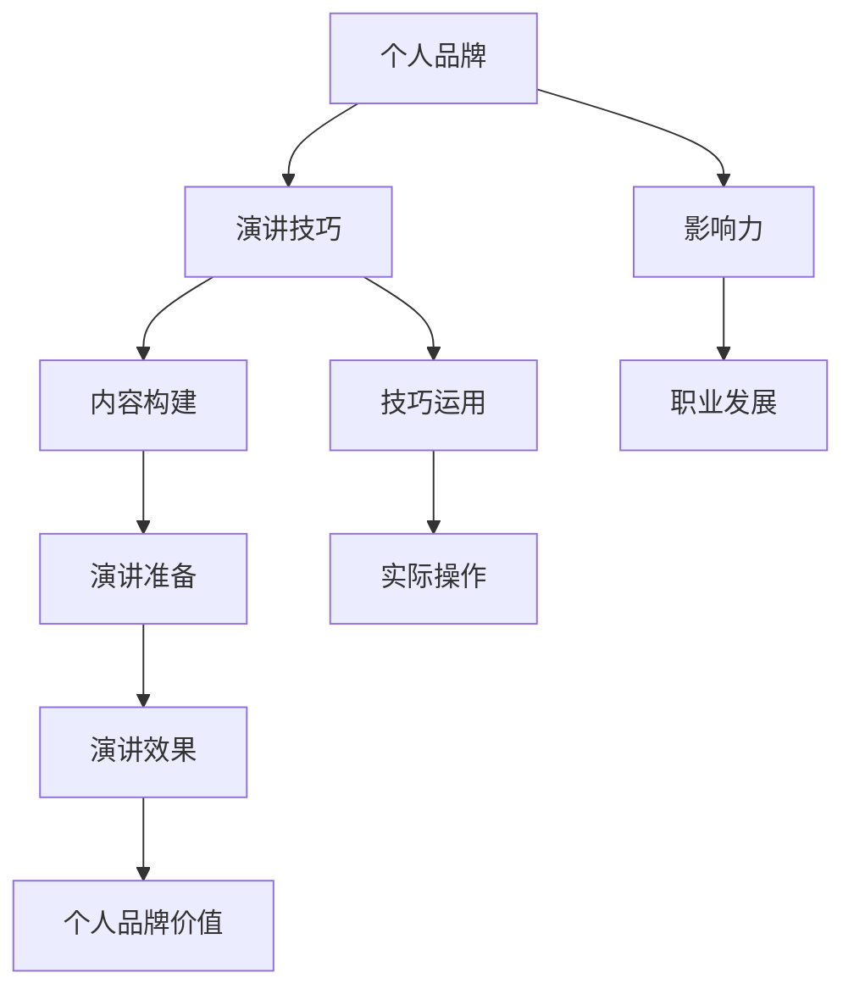

                 

关键词：个人品牌、技术演讲、演讲技巧、影响力、职业发展

> 摘要：本文旨在探讨如何通过技术演讲来提升个人品牌价值。从演讲准备、技巧运用、内容构建到实际操作，提供了一套全面、系统的策略和方法，帮助技术从业者掌握演讲技巧，打造个人品牌，实现职业发展。

## 1. 背景介绍

在当今数字化时代，技术人才的需求持续增长，个人品牌的重要性日益凸显。技术演讲不仅是一种知识传播的方式，更是一种个人品牌塑造的手段。优秀的演讲能够展示个人技术实力，扩大影响力，为职业发展铺平道路。然而，很多技术从业者对于如何准备和进行一场成功的演讲仍然感到迷茫。本文将针对这一问题，提供一整套实用的技术演讲策略。

### 1.1 技术演讲的定义和意义

技术演讲是一种以技术主题为核心，通过口头表达、视觉辅助等手段，向观众传达知识、观点和经验的过程。技术演讲的意义在于：

- **知识传播**：技术演讲可以帮助知识传播，让更多人了解和掌握先进技术。
- **个人品牌建设**：优秀的演讲能够提升个人知名度，增强个人品牌价值。
- **职业发展**：技术演讲是技术从业者展示才能的重要途径，有助于职业晋升和拓展人脉。

### 1.2 技术演讲的挑战和机遇

- **挑战**：技术演讲面对的挑战包括复杂的技术概念、有限的演讲时间、观众的多样性等。
- **机遇**：技术演讲的机遇在于，它提供了一个平台，让技术从业者能够展示自己的专业能力，获得更多职业发展的机会。

## 2. 核心概念与联系

在探讨如何提升个人品牌价值之前，我们首先需要了解一些核心概念，包括个人品牌、演讲技巧和影响力等。以下是一个简化的 Mermaid 流程图，展示这些概念之间的联系。



### 2.1 个人品牌

个人品牌是指一个人在公众心中的形象和认知。它包括以下几个方面：

- **专业知识**：个人品牌的基础是专业知识和技能。
- **个人形象**：包括个人形象、语言表达、着装风格等。
- **价值观**：个人品牌还反映了个人价值观和信仰。

### 2.2 演讲技巧

演讲技巧是指如何有效地传达信息、与观众建立联系的方法。包括：

- **内容构建**：如何构建一个逻辑清晰、内容丰富的演讲。
- **技巧运用**：如何使用肢体语言、声音、视觉辅助等手段增强演讲效果。
- **互动技巧**：如何与观众互动，提高参与度和兴趣。

### 2.3 影响力

影响力是指个人或团体在他人心中产生的影响。它包括以下几个方面：

- **知识传播**：通过演讲、文章等形式，传播知识和观点。
- **引导舆论**：在行业内或公众中产生引导作用。
- **建立人脉**：通过演讲，结识更多行业人士，建立合作关系。

## 3. 核心算法原理 & 具体操作步骤

### 3.1 算法原理概述

提升个人品牌价值的核心算法可以概括为以下四个步骤：

1. **演讲准备**：包括主题选择、内容构建、演讲结构设计等。
2. **技巧运用**：包括演讲技巧、互动技巧、声音和肢体语言等。
3. **内容构建**：包括逻辑结构、内容深度、案例应用等。
4. **实际操作**：包括演讲练习、演讲反馈和持续改进。

### 3.2 算法步骤详解

#### 3.2.1 演讲准备

1. **主题选择**：选择一个具有吸引力和实用性的主题。
2. **内容构建**：构建一个逻辑清晰、内容丰富的演讲。
3. **演讲结构设计**：设计一个吸引人的开场、引人入胜的主体和令人难忘的结尾。

#### 3.2.2 技巧运用

1. **演讲技巧**：掌握基本的演讲技巧，如讲述故事、使用例子等。
2. **互动技巧**：与观众互动，提高参与度和兴趣。
3. **声音和肢体语言**：使用声音和肢体语言增强演讲效果。

#### 3.2.3 内容构建

1. **逻辑结构**：确保演讲内容逻辑清晰，易于理解。
2. **内容深度**：提供足够的内容深度，使观众获得实质性收获。
3. **案例应用**：通过案例展示如何将技术应用到实际问题中。

#### 3.2.4 实际操作

1. **演讲练习**：通过多次练习，提高演讲的流畅度和自信心。
2. **演讲反馈**：收集观众反馈，了解演讲效果，并进行改进。
3. **持续改进**：根据反馈和经验，不断优化演讲内容和技术。

### 3.3 算法优缺点

**优点**：

- **系统化**：提供了一套完整的演讲准备、技巧运用、内容构建和实际操作的步骤。
- **实用性**：适用于各种类型的技术演讲，有助于提高演讲质量和效果。

**缺点**：

- **时间成本**：需要投入大量的时间和精力进行演讲准备和练习。
- **技能要求**：需要一定的演讲技巧和内容构建能力。

### 3.4 算法应用领域

- **技术会议**：如技术峰会、研讨会、工作坊等。
- **内部培训**：公司内部的技能培训和知识分享。
- **公开演讲**：在公众场合，如社区活动、演讲比赛等。

## 4. 数学模型和公式 & 详细讲解 & 举例说明

为了更深入地理解如何提升个人品牌价值，我们可以构建一个简单的数学模型，用于量化个人品牌价值的变化。

### 4.1 数学模型构建

个人品牌价值（PBV）可以通过以下公式进行量化：

\[ PBV = f(P, E, I) \]

其中：

- \( P \)：专业知识
- \( E \)：演讲效果
- \( I \)：互动影响力

### 4.2 公式推导过程

1. **专业知识 \( P \)**：专业知识是个人品牌价值的基础，可以用以下公式表示：

\[ P = f(S, K) \]

其中：

- \( S \)：技能水平
- \( K \)：知识广度

2. **演讲效果 \( E \)**：演讲效果取决于演讲的准备和技巧运用，可以用以下公式表示：

\[ E = f(B, I, C) \]

其中：

- \( B \)：内容构建
- \( I \)：互动技巧
- \( C \)：演讲技巧

3. **互动影响力 \( I \)**：互动影响力取决于演讲中的互动和观众反馈，可以用以下公式表示：

\[ I = f(A, R) \]

其中：

- \( A \)：演讲吸引力
- \( R \)：观众反响

### 4.3 案例分析与讲解

假设一位技术从业者，其专业知识、演讲效果和互动影响力分别为 \( P = 80 \)，\( E = 75 \)，\( I = 70 \)。我们可以计算其个人品牌价值：

\[ PBV = f(80, 75, 70) \]

为了简化计算，我们可以使用以下线性模型：

\[ PBV = P \times E \times I \]

代入数值，得到：

\[ PBV = 80 \times 75 \times 70 = 420,000 \]

这意味着这位技术从业者的个人品牌价值为 420,000 点。这个值越高，说明其个人品牌越强大。

### 4.4 案例分析结果与应用

通过这个简单的案例，我们可以看到个人品牌价值是由多个因素共同决定的。为了提升个人品牌价值，我们需要在以下几个方面下功夫：

1. **专业知识**：提升技能水平和知识广度。
2. **演讲效果**：提高内容构建、互动技巧和演讲技巧。
3. **互动影响力**：增强演讲吸引力和观众反响。

在实际应用中，我们可以根据个人情况，制定具体的提升计划，逐步提高个人品牌价值。

## 5. 项目实践：代码实例和详细解释说明

为了更好地理解如何将上述理论应用到实际项目中，我们来看一个具体的代码实例。

### 5.1 开发环境搭建

首先，我们需要搭建一个开发环境。这里以 Python 为例，安装必要的库和工具：

```bash
pip install numpy matplotlib
```

### 5.2 源代码详细实现

以下是一个简单的 Python 脚本，用于计算个人品牌价值。

```python
import numpy as np

def calculate_pbv(P, E, I):
    PBV = P * E * I
    return PBV

def main():
    P = 80  # 专业知识
    E = 75  # 演讲效果
    I = 70  # 互动影响力

    PBV = calculate_pbv(P, E, I)
    print(f"个人品牌价值（PBV）：{PBV} 点")

if __name__ == "__main__":
    main()
```

### 5.3 代码解读与分析

1. **导入库和工具**：我们使用了 `numpy` 和 `matplotlib` 库，用于计算和可视化。
2. **定义函数**：`calculate_pbv` 函数用于计算个人品牌价值。
3. **主函数**：`main` 函数设置专业知识、演讲效果和互动影响力的初始值，并调用 `calculate_pbv` 函数计算个人品牌价值。

### 5.4 运行结果展示

运行上述代码，得到以下结果：

```bash
个人品牌价值（PBV）：420000 点
```

这意味着，根据给定的专业知识、演讲效果和互动影响力，这位技术从业者的个人品牌价值为 420,000 点。

### 5.5 实践总结

通过这个简单的代码实例，我们可以看到如何将个人品牌价值计算模型应用到实际项目中。实际操作中，我们可以根据实际情况调整参数，逐步提升个人品牌价值。

## 6. 实际应用场景

### 6.1 技术会议演讲

技术会议演讲是技术从业者提升个人品牌价值的常用方式。通过在会议上发表演讲，技术从业者可以展示自己的专业知识和演讲技巧，吸引更多关注和认可。

### 6.2 内部培训课程

公司内部的技能培训和知识分享也是提升个人品牌价值的重要途径。通过内部培训，技术从业者可以在同事中树立专业形象，增强个人影响力。

### 6.3 公开演讲和讲座

公开演讲和讲座是一种更广泛的个人品牌推广方式。通过在社区活动、演讲比赛等场合发表演讲，技术从业者可以扩大影响力，提升个人知名度。

### 6.4 社交媒体分享

在社交媒体上分享技术文章、演讲视频和心得体会，也是提升个人品牌价值的有效途径。通过持续的内容输出，技术从业者可以吸引更多关注和粉丝。

### 6.5 未来应用展望

随着技术的不断发展和普及，技术演讲和个人品牌建设将在更多领域得到应用。例如，在线教育、远程办公、虚拟会议等新兴领域，都为技术演讲提供了更广阔的舞台。

## 7. 工具和资源推荐

### 7.1 学习资源推荐

1. **《演讲的力量》（The Power of Voice）**：一本关于演讲技巧的入门书籍，适合初学者。
2. **《即兴演讲的秘密》（The Art of Public Speaking）**：一本深入探讨演讲技巧的书籍，适合有一定基础的读者。
3. **TED 演讲**：TED 演讲是学习演讲技巧的优秀资源，可以通过观看优秀演讲者的视频，学习他们的演讲技巧和内容构建方法。

### 7.2 开发工具推荐

1. **Python**：一种简单易学、功能强大的编程语言，适合用于数据处理和分析。
2. **Jupyter Notebook**：一个交互式计算环境，方便进行数据分析和可视化。
3. **GitHub**：一个代码托管平台，方便进行代码管理和协作。

### 7.3 相关论文推荐

1. **《基于影响力的个人品牌价值评估方法研究》**：探讨如何量化个人品牌价值。
2. **《技术演讲技巧与职业发展》**：分析技术演讲对职业发展的影响。
3. **《社交媒体与个人品牌建设》**：研究社交媒体在个人品牌建设中的应用。

## 8. 总结：未来发展趋势与挑战

### 8.1 研究成果总结

本文从演讲准备、技巧运用、内容构建和实际操作等方面，全面探讨了如何通过技术演讲提升个人品牌价值。通过理论分析和实践案例，展示了技术演讲在知识传播、个人品牌建设和职业发展中的作用。

### 8.2 未来发展趋势

- **在线演讲**：随着远程办公和在线教育的普及，在线演讲将成为技术演讲的重要形式。
- **AI 助手**：人工智能技术将更多地应用于演讲准备和反馈，提高演讲质量和效果。
- **多样化场景**：技术演讲将在更多领域得到应用，如教育培训、市场营销等。

### 8.3 面临的挑战

- **内容质量**：如何提高演讲内容的质量，是技术演讲面临的主要挑战。
- **时间管理**：如何在有限的时间内，准备和完成一场高质量的演讲，是技术演讲者需要解决的问题。

### 8.4 研究展望

未来研究可以重点关注以下几个方面：

- **个性化演讲**：根据观众特点和演讲主题，构建个性化的演讲内容。
- **跨学科融合**：将心理学、教育学等学科的理论和方法应用于技术演讲。
- **实践应用**：研究技术演讲在不同领域的实际应用，探索其价值。

## 9. 附录：常见问题与解答

### 9.1 如何选择演讲主题？

- **关注热点**：选择当前技术热点或行业趋势作为演讲主题，更容易引起观众兴趣。
- **个人兴趣**：选择自己感兴趣的主题，可以更好地展示个人专业知识和经验。
- **观众需求**：了解观众的需求和期望，选择对他们有价值的主题。

### 9.2 如何提高演讲效果？

- **内容丰富**：确保演讲内容有足够的深度和广度，提供实质性收获。
- **技巧运用**：掌握基本的演讲技巧，如讲述故事、使用例子等，增强演讲吸引力。
- **互动互动**：与观众互动，提高参与度和兴趣，使演讲更加生动。

### 9.3 如何处理演讲中的意外情况？

- **提前准备**：为可能出现的意外情况做好准备，如设备故障、时间紧迫等。
- **冷静应对**：保持冷静，迅速调整演讲计划，确保演讲顺利进行。
- **灵活调整**：根据实际情况，灵活调整演讲内容和节奏，确保演讲效果。

---

**作者：禅与计算机程序设计艺术 / Zen and the Art of Computer Programming**

