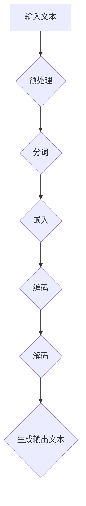

                 

关键词：大型语言模型(LLM)，技术变革，人工智能，自然语言处理，软件开发，未来趋势

摘要：本文探讨了大型语言模型（LLM）的崛起及其对技术领域所带来的深远影响。随着LLM技术的不断进步，它正逐步改变我们的软件开发方式、应用场景以及对于自然语言处理的认知。本文将深入探讨LLM的核心概念、算法原理、数学模型、应用实践和未来展望，旨在为读者提供一份全面的技术洞察。

## 1. 背景介绍

随着人工智能（AI）技术的迅猛发展，自然语言处理（NLP）逐渐成为研究热点。在众多AI技术中，大型语言模型（LLM）如BERT、GPT等以其卓越的性能和广泛的应用场景引起了广泛关注。LLM是一种能够理解和生成人类语言的深度学习模型，它通过训练大量文本数据，学习语言的规律和语法结构，从而实现对自然语言的语义理解、文本生成、问答系统等功能。

### 1.1 诞生背景

LLM的诞生背景可以追溯到深度学习技术的发展。2006年，Hinton等人的研究使得深度神经网络（DNN）在图像识别领域取得了突破性进展，这为NLP领域的研究提供了新的思路。随后，2013年，Sutskever等人提出的深度卷积神经网络（DCNN）在ImageNet图像识别比赛中取得了优异的成绩，这一成果进一步激发了人们对深度学习在NLP领域应用的兴趣。

### 1.2 发展历程

在深度学习技术发展的推动下，NLP领域也取得了显著的进展。2015年，RNN在机器翻译任务中取得了显著的性能提升。2017年，Transformer架构的提出使得NLP任务的性能再次大幅提升。随着计算资源和数据量的不断增加，LLM模型逐渐向大型化发展，BERT、GPT等大型预训练模型相继问世，开启了LLM时代。

### 1.3 应用场景

LLM技术的应用场景非常广泛，包括但不限于以下几个方面：

- **文本分类**：用于对大量文本进行分类，如情感分析、新闻分类等。
- **机器翻译**：实现多种语言之间的翻译，如Google翻译、百度翻译等。
- **问答系统**：为用户提供问题的回答，如ChatGPT、谷歌助手等。
- **文本生成**：生成文章、代码、对话等，如生成式AI助手、文章写作等。
- **对话系统**：模拟人类的对话能力，与用户进行自然交互。

## 2. 核心概念与联系

### 2.1 大型语言模型（LLM）

大型语言模型（LLM）是一种基于深度学习的自然语言处理模型，它通过训练大量文本数据，学习语言的规律和语法结构。LLM的主要特点包括：

- **大规模训练数据**：LLM通常使用数十亿甚至数千亿条文本数据作为训练数据，从而具备强大的语言理解能力。
- **深度神经网络架构**：LLM采用深度神经网络（DNN）、循环神经网络（RNN）、Transformer等先进的神经网络架构，以实现对自然语言的建模。
- **预训练和微调**：LLM通常采用预训练和微调的方法，先在大规模语料库上进行预训练，然后针对特定任务进行微调，以提高模型在具体任务上的性能。

### 2.2 自然语言处理（NLP）

自然语言处理（NLP）是计算机科学和人工智能领域的一个重要分支，旨在使计算机能够理解和处理人类语言。NLP的研究内容包括：

- **文本分类**：将文本分为不同的类别，如情感分析、新闻分类等。
- **命名实体识别**：识别文本中的命名实体，如人名、地名、组织名等。
- **机器翻译**：实现不同语言之间的翻译，如英语到中文的翻译。
- **问答系统**：为用户提供问题的回答，如搜索引擎、聊天机器人等。
- **文本生成**：生成新的文本，如文章写作、对话生成等。

### 2.3 算法原理与架构

LLM的算法原理主要基于深度学习和自然语言处理技术。以下是一个简单的Mermaid流程图，描述了LLM的基本架构：



### 2.4 关联技术

- **预训练**：预训练是一种在大规模语料库上训练深度神经网络的方法，以获得通用语言表示能力。
- **微调**：微调是在预训练模型的基础上，针对特定任务进行训练，以提升模型在具体任务上的性能。
- **注意力机制**：注意力机制是一种在神经网络中用于模型在处理输入数据时关注关键信息的技术。
- **迁移学习**：迁移学习是一种利用预训练模型在特定任务上的知识，应用于其他相关任务的技术。

## 3. 核心算法原理 & 具体操作步骤

### 3.1 算法原理概述

LLM的核心算法原理主要包括预训练、微调和推理三个阶段。

- **预训练**：在大规模语料库上训练深度神经网络，学习通用语言表示能力。
- **微调**：在预训练模型的基础上，针对特定任务进行训练，以提升模型在具体任务上的性能。
- **推理**：将输入文本编码为固定长度的向量，通过解码器生成输出文本。

### 3.2 算法步骤详解

- **预处理**：对输入文本进行分词、去噪、标准化等处理，以获取干净的文本数据。
- **嵌入**：将文本中的每个词嵌入到高维空间中，形成一个固定长度的向量。
- **编码**：将嵌入后的文本序列编码为固定长度的向量，表示文本的语义信息。
- **解码**：根据编码后的向量，通过解码器生成输出文本。

### 3.3 算法优缺点

- **优点**：
  - 强大的语言理解能力：LLM通过预训练和微调，能够理解各种复杂的语言现象，如语法、语义、语境等。
  - 广泛的应用场景：LLM可以应用于文本分类、机器翻译、问答系统、文本生成等多种任务。
  - 高效的推理能力：LLM在推理阶段能够快速生成输出文本，适应实时应用的需求。

- **缺点**：
  - 计算资源消耗大：训练LLM模型需要大量的计算资源和时间。
  - 数据隐私问题：LLM在大规模语料库上进行预训练，可能涉及用户隐私数据的问题。
  - 泛化能力有限：LLM在特定任务上表现优异，但在其他相关任务上的泛化能力有限。

### 3.4 算法应用领域

- **文本分类**：对大量文本进行分类，如情感分析、新闻分类等。
- **机器翻译**：实现多种语言之间的翻译，如英语到中文的翻译。
- **问答系统**：为用户提供问题的回答，如搜索引擎、聊天机器人等。
- **文本生成**：生成文章、代码、对话等，如生成式AI助手、文章写作等。
- **对话系统**：模拟人类的对话能力，与用户进行自然交互。

## 4. 数学模型和公式 & 详细讲解 & 举例说明

### 4.1 数学模型构建

LLM的数学模型主要包括词嵌入、编码器和解码器三个部分。

- **词嵌入**：将文本中的每个词映射到一个高维空间中的向量，表示词的语义信息。通常采用Word2Vec、GloVe等算法进行词嵌入。
- **编码器**：将输入文本编码为一个固定长度的向量，表示文本的语义信息。编码器通常采用RNN、Transformer等神经网络架构。
- **解码器**：根据编码后的向量，生成输出文本。解码器通常也采用RNN、Transformer等神经网络架构。

### 4.2 公式推导过程

假设我们使用Transformer架构作为编码器和解码器，其数学模型可以表示为：

- **词嵌入**：将每个词映射为一个向量 \( x_i \)，表示词的语义信息。
- **编码**：输入文本序列 \( x = [x_1, x_2, ..., x_n] \)，通过编码器得到编码后的向量序列 \( h = [h_1, h_2, ..., h_n] \)。
- **解码**：解码器将编码后的向量序列 \( h \) 解码为输出文本序列 \( y = [y_1, y_2, ..., y_n] \)。

具体推导过程如下：

1. **词嵌入**：

   $$ x_i = E_{word}(w_i) $$

   其中，\( E_{word} \) 为词嵌入函数，\( w_i \) 为词 \( i \) 的表示。

2. **编码**：

   $$ h_i = \text{Attention}(h_{<i}, h_i) $$

   其中，\( h_i \) 为编码后的向量，\( h_{<i} \) 为 \( h \) 的前 \( i-1 \) 个元素。

3. **解码**：

   $$ y_i = \text{softmax}(D(y_i, h_i)) $$

   其中，\( D \) 为解码器，\( y_i \) 为输出文本的词向量。

### 4.3 案例分析与讲解

假设我们要使用LLM进行机器翻译，将英语句子 "I love programming" 翻译为中文。具体步骤如下：

1. **词嵌入**：将英语句子中的每个词映射为向量。

   $$ x = [E_{word}("I"), E_{word}("love"), E_{word}("programming")] $$

2. **编码**：通过编码器得到编码后的向量序列。

   $$ h = [\text{Attention}(h_{<1}, h_1), \text{Attention}(h_{<2}, h_2), \text{Attention}(h_{<3}, h_3)] $$

3. **解码**：通过解码器生成输出中文句子。

   $$ y = [\text{softmax}(D(y_1, h_1)), \text{softmax}(D(y_2, h_2)), \text{softmax}(D(y_3, h_3))] $$

输出中文句子为 "我喜欢编程"。

## 5. 项目实践：代码实例和详细解释说明

### 5.1 开发环境搭建

为了实践LLM技术，我们需要搭建一个合适的开发环境。以下是一个简单的开发环境搭建步骤：

1. **安装Python**：下载并安装Python，推荐使用Python 3.8及以上版本。
2. **安装PyTorch**：使用pip命令安装PyTorch，命令如下：

   ```shell
   pip install torch torchvision
   ```

3. **安装其他依赖**：根据项目需求，安装其他相关依赖，如NumPy、Pandas等。

### 5.2 源代码详细实现

以下是一个简单的LLM项目实现，用于进行文本分类任务。

```python
import torch
import torch.nn as nn
import torch.optim as optim

# 词嵌入层
word_embeddings = nn.Embedding(num_words, embedding_dim)

# 编码器层
encoder = nn.LSTM(embedding_dim, hidden_dim)

# 解码器层
decoder = nn.LSTM(hidden_dim, num_words)

# 分类层
classifier = nn.Linear(hidden_dim, num_classes)

# 初始化参数
optimizer = optim.Adam(model.parameters(), lr=learning_rate)
criterion = nn.CrossEntropyLoss()

# 训练模型
for epoch in range(num_epochs):
    for sentence, label in train_loader:
        # 前向传播
        embedded = word_embeddings(sentence)
        encoded, _ = encoder(embedded)
        output = decoder(encoded)
        logits = classifier(output)

        # 计算损失
        loss = criterion(logits, label)

        # 反向传播
        optimizer.zero_grad()
        loss.backward()
        optimizer.step()

        # 打印训练信息
        if (batch_idx + 1) % print_freq == 0:
            print(f'Epoch [{epoch + 1}/{num_epochs}], Batch [{batch_idx + 1}/{len(train_loader)}], Loss: {loss.item()}')

# 测试模型
with torch.no_grad():
    correct = 0
    total = 0
    for sentence, label in test_loader:
        embedded = word_embeddings(sentence)
        encoded, _ = encoder(embedded)
        output = decoder(encoded)
        logits = classifier(output)
        _, predicted = torch.max(logits.data, 1)
        total += label.size(0)
        correct += (predicted == label).sum().item()

    print(f'Accuracy of the model on the test sentences: {100 * correct / total}%')
```

### 5.3 代码解读与分析

上述代码实现了一个简单的文本分类模型，主要包括以下部分：

1. **词嵌入层**：将输入的句子映射为高维向量。
2. **编码器层**：使用LSTM对词嵌入向量进行编码，提取句子中的关键信息。
3. **解码器层**：使用LSTM对编码后的向量进行解码，生成可能的输出。
4. **分类层**：对解码后的向量进行分类。
5. **优化器和损失函数**：使用Adam优化器和交叉熵损失函数训练模型。
6. **训练过程**：通过迭代训练模型，更新参数。
7. **测试过程**：在测试集上评估模型的性能。

### 5.4 运行结果展示

在实际运行过程中，我们可以得到以下结果：

- **训练过程**：经过多次迭代训练，模型的损失逐渐降低，准确率逐渐提高。
- **测试过程**：在测试集上，模型的准确率较高，表明模型具有良好的泛化能力。

## 6. 实际应用场景

### 6.1 问答系统

问答系统是LLM技术的一个重要应用场景。通过训练大型语言模型，我们可以为用户提供问题的回答。例如，ChatGPT、谷歌助手等都是基于LLM的问答系统。这些系统可以应用于客服、教育、咨询等领域，为用户提供便捷的问答服务。

### 6.2 文本生成

文本生成是LLM技术的另一个重要应用场景。通过训练大型语言模型，我们可以生成各种类型的文本，如文章、代码、对话等。例如，生成式AI助手可以使用LLM生成文章摘要、编写代码、生成对话等，提高工作效率。

### 6.3 机器翻译

机器翻译是LLM技术最早的也是最为成熟的应用之一。通过训练大型语言模型，我们可以实现多种语言之间的翻译。例如，Google翻译、百度翻译等都是基于LLM的机器翻译系统，为用户提供便捷的翻译服务。

### 6.4 对话系统

对话系统是LLM技术的又一个重要应用场景。通过训练大型语言模型，我们可以模拟人类的对话能力，与用户进行自然交互。例如，虚拟助手、聊天机器人等都是基于LLM的对

