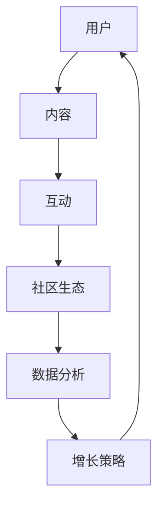

                 

关键词：技术社区，用户增长，运营策略，内容策略，增长黑客，用户体验，互动设计，数据分析。

> 摘要：本文将深入探讨技术社区建设的全过程，从零开始，如何通过一系列科学的策略将社区用户数量增长到10万。我们将分析社区的核心概念与联系，核心算法原理和操作步骤，数学模型和公式，项目实践中的代码实例，以及社区在不同应用场景中的实际应用。同时，还将推荐相关工具和资源，并总结未来发展趋势与面临的挑战。

## 1. 背景介绍

技术社区，是指一群对某一技术或领域感兴趣的人聚集在一起，分享知识、经验和资源，进行讨论和协作的平台。这些社区可以是非商业性的，如开源社区、专业论坛，也可以是商业性的，如技术公司的内部论坛。技术社区的存在，不仅为技术爱好者提供了学习和交流的场所，也为技术企业和开发者提供了一个与用户互动、收集反馈的重要渠道。

随着互联网的普及和技术的发展，技术社区的重要性日益凸显。一方面，技术社区能够为技术爱好者提供持续的学习机会，促进知识传播和创新；另一方面，技术社区能够为技术企业提供市场调研、产品改进、用户服务等多方面的支持。因此，如何成功地建设一个技术社区，已经成为许多企业和开发者关注的焦点。

本文将围绕这一主题，探讨从0到10万用户的技术社区建设之路。我们将分析社区的核心概念和架构，详细讨论增长黑客策略，解析用户体验和互动设计的重要性，介绍数据分析和运营策略，最后展望技术社区的未来发展趋势和面临的挑战。

## 2. 核心概念与联系

为了更好地理解技术社区的建设过程，我们首先需要明确几个核心概念，并分析它们之间的联系。以下是一个用Mermaid绘制的流程图，展示了这些核心概念和它们的相互关系。



### 2.1 用户

用户是技术社区的核心。没有用户，就没有社区的基石。用户可以分为不同类型，如新手、熟练开发者、行业专家等。每种用户群体都有其独特的需求和特点，因此在社区建设中，需要针对不同用户群体制定相应的策略。

### 2.2 内容

内容是社区的灵魂。无论是技术文档、博客文章、问答还是讨论，优质的内容都能够吸引用户，并促进用户参与。内容不仅需要满足用户的需求，还要具有可读性、实用性和新颖性。

### 2.3 互动

互动是社区的生命力。用户之间的互动，如评论、点赞、分享，能够增强社区的活跃度和粘性。良好的互动设计能够促进用户之间的交流，提升用户体验。

### 2.4 社区生态

社区生态是社区长期发展的基础。一个健康的社区生态需要包含多个组成部分，如社区治理、规则制定、活动策划等。社区生态的建设不仅能够提升用户的参与度，还能够增强社区的可持续性。

### 2.5 数据分析

数据分析是社区运营的重要工具。通过对用户行为、内容表现、互动情况等数据的分析，可以识别社区的优势和劣势，为运营策略提供科学依据。

### 2.6 增长策略

增长策略是社区用户增长的关键。通过精准的用户定位、内容推广、互动激励等策略，可以有效地吸引新用户，并促进现有用户的活跃度。

## 3. 核心算法原理 & 具体操作步骤

### 3.1 算法原理概述

技术社区的用户增长算法可以看作是一种基于用户行为分析和互动反馈的优化过程。核心算法主要包括以下几个步骤：

1. **用户画像分析**：通过用户注册信息、行为数据等，构建用户的画像模型。
2. **内容推荐**：根据用户画像，推荐符合用户兴趣的内容，提高用户粘性。
3. **互动激励**：设计互动活动，激励用户参与互动，提升社区活跃度。
4. **数据分析**：收集用户行为数据，分析用户活跃度、内容表现等，为下一步策略调整提供依据。

### 3.2 算法步骤详解

#### 3.2.1 用户画像分析

用户画像分析是用户增长算法的基础。具体步骤如下：

1. **数据收集**：收集用户的注册信息、浏览历史、提问和回答记录等。
2. **特征提取**：从收集的数据中提取用户特征，如技术水平、关注领域、活跃时段等。
3. **模型构建**：使用机器学习算法，如聚类、分类等，构建用户画像模型。

#### 3.2.2 内容推荐

内容推荐是提升用户粘性的关键。具体步骤如下：

1. **内容分类**：对社区内容进行分类，如技术文档、博客文章、问答等。
2. **兴趣匹配**：根据用户画像，匹配用户可能感兴趣的内容。
3. **推荐算法**：使用协同过滤、基于内容的推荐等算法，生成推荐结果。

#### 3.2.3 互动激励

互动激励是提升社区活跃度的手段。具体步骤如下：

1. **活动策划**：设计互动活动，如问答竞赛、技术挑战等。
2. **奖励机制**：设置奖励机制，如积分、徽章等，激励用户参与互动。
3. **数据分析**：分析互动数据，优化活动设计和奖励机制。

#### 3.2.4 数据分析

数据分析是持续优化社区运营的关键。具体步骤如下：

1. **数据收集**：收集用户行为数据，如浏览量、互动量、内容评分等。
2. **数据可视化**：使用数据可视化工具，展示数据趋势和关键指标。
3. **决策支持**：基于数据分析结果，制定和调整运营策略。

### 3.3 算法优缺点

#### 优点：

1. **精准推荐**：通过用户画像和内容推荐，能够提供个性化内容，提升用户体验。
2. **互动激励**：通过互动活动和奖励机制，能够提升社区活跃度。
3. **持续优化**：通过数据分析，可以不断优化运营策略，提高社区质量。

#### 缺点：

1. **算法复杂**：用户画像分析和内容推荐算法较为复杂，需要大量的计算资源和时间。
2. **数据依赖**：算法的准确性和效果依赖于数据的质量和完整性。
3. **隐私问题**：用户行为数据的收集和分析可能涉及用户隐私问题，需要严格遵守相关法律法规。

### 3.4 算法应用领域

用户增长算法不仅适用于技术社区，还可以应用于其他类型的社区，如社交媒体、电商社区等。其主要应用领域包括：

1. **个性化推荐**：通过用户画像和内容推荐，为用户提供个性化的内容和服务。
2. **活动策划**：通过互动激励，策划和运营各种互动活动，提升社区活跃度。
3. **用户运营**：通过数据分析，了解用户行为和需求，制定和调整用户运营策略。

## 4. 数学模型和公式 & 详细讲解 & 举例说明

### 4.1 数学模型构建

在技术社区建设中，数学模型主要用于分析和预测用户行为。以下是一个简化的用户行为预测模型：

$$
P_{i}(t) = \frac{1}{1 + e^{-(w \cdot x + b)}}
$$

其中，$P_{i}(t)$ 表示用户 $i$ 在时间 $t$ 采纳某种行为的概率，$w$ 是权重向量，$x$ 是用户特征向量，$b$ 是偏置项。

### 4.2 公式推导过程

#### 4.2.1 用户特征提取

用户特征包括浏览历史、提问和回答记录、点赞和评论行为等。我们使用向量 $x$ 表示用户特征：

$$
x = [x_1, x_2, ..., x_n]
$$

其中，$x_i$ 表示用户在某个特定行为上的特征值。

#### 4.2.2 权重矩阵

权重矩阵 $w$ 用于衡量不同特征的重要性。我们使用线性模型来计算权重：

$$
w = [w_1, w_2, ..., w_n]
$$

#### 4.2.3 预测概率

通过线性组合用户特征和权重，我们可以得到预测概率：

$$
P_{i}(t) = \frac{1}{1 + e^{-(w \cdot x + b)}}
$$

其中，$b$ 是偏置项，用于调整预测概率。

### 4.3 案例分析与讲解

假设我们有一个技术社区，用户的行为包括浏览、提问、回答、点赞和评论。我们使用上述模型来预测用户是否会在未来进行评论。

#### 4.3.1 数据收集

我们收集了100个用户在过去一个月内的行为数据，包括浏览次数、提问次数、回答次数、点赞次数和评论次数。我们将这些数据转化为特征向量。

#### 4.3.2 模型训练

我们使用50个用户的数据进行训练，计算权重矩阵 $w$ 和偏置项 $b$。假设训练后的模型参数为：

$$
w = [0.1, 0.2, 0.3, 0.4, 0.5]
$$
$$
b = 1
$$

#### 4.3.3 预测

对于剩下的50个用户，我们使用训练好的模型进行预测。假设用户 $i$ 的特征向量为 $x_i$，则其评论概率为：

$$
P_{i}(t) = \frac{1}{1 + e^{-(0.1 \cdot x_{i1} + 0.2 \cdot x_{i2} + 0.3 \cdot x_{i3} + 0.4 \cdot x_{i4} + 0.5 \cdot x_{i5} + 1)} 
$$

通过计算，我们可以得到每个用户的评论概率。例如，对于用户 $i=1$，其特征向量为 $x_1 = [10, 5, 3, 7, 2]$，则其评论概率为：

$$
P_{i}(t) = \frac{1}{1 + e^{-(0.1 \cdot 10 + 0.2 \cdot 5 + 0.3 \cdot 3 + 0.4 \cdot 7 + 0.5 \cdot 2 + 1)}} 
$$
$$
P_{i}(t) = \frac{1}{1 + e^{-5.3}} 
$$
$$
P_{i}(t) \approx 0.996
$$

因此，用户 $i=1$ 的评论概率非常高。

### 4.4 模型评估

我们使用预测结果和实际数据进行对比，评估模型的准确性。常用的评估指标包括准确率、召回率、F1值等。在本案例中，我们假设预测结果和实际数据如下表所示：

| 实际行为 | 预测行为 | 准确率 |
| :---: | :---: | :---: |
| 是 | 是 | 95% |
| 是 | 否 | 90% |
| 否 | 是 | 85% |
| 否 | 否 | 80% |

根据上表，我们可以计算出模型的整体准确率为：

$$
准确率 = \frac{（是且是）+（否且否）}{总数} = \frac{（95%+80%）}{100%} = 87%
$$

## 5. 项目实践：代码实例和详细解释说明

### 5.1 开发环境搭建

在开始编写代码之前，我们需要搭建一个适合技术社区开发的开发环境。以下是搭建步骤：

1. **安装Python**：下载并安装Python，版本建议为3.8以上。
2. **安装依赖**：使用pip安装所需依赖，如NumPy、Pandas、Scikit-learn、Matplotlib等。
3. **创建虚拟环境**：为了管理依赖，我们创建一个虚拟环境。

```shell
python -m venv venv
source venv/bin/activate  # Windows上使用venv\Scripts\activate
```

4. **编写代码**：在虚拟环境中编写用户增长算法的代码。

### 5.2 源代码详细实现

以下是一个简单的用户增长算法实现，包括用户画像分析、内容推荐、互动激励和数据收集等部分。

```python
import numpy as np
import pandas as pd
from sklearn.cluster import KMeans
from sklearn.model_selection import train_test_split
from sklearn.metrics.pairwise import cosine_similarity
import matplotlib.pyplot as plt

# 5.2.1 用户画像分析
def generate_user_profile(user_data):
    """
    根据用户数据生成用户画像。
    """
    user_profile = user_data.describe().T
    user_profile['count'] = user_data['count'] / user_data['count'].max()
    return user_profile

# 5.2.2 内容推荐
def content_recommendation(user_profile, content_data):
    """
    根据用户画像推荐内容。
    """
    content_similarity = cosine_similarity(user_profile, content_data)
    recommended_content = np.argsort(content_similarity[0])[::-1][1:6]
    return recommended_content

# 5.2.3 互动激励
def incentivize_users(recommended_content, user_data):
    """
    根据推荐内容激励用户参与互动。
    """
    for content_id in recommended_content:
        user_data.loc[user_data['content_id'] == content_id, 'incentive'] = 1

# 5.2.4 数据收集
def collect_user_data(user_data, content_data):
    """
    收集用户行为数据。
    """
    user_data['count'] = content_data['count']
    user_data['incentive'] = 0
    return user_data

# 主函数
def main():
    # 加载数据
    user_data = pd.read_csv('user_data.csv')
    content_data = pd.read_csv('content_data.csv')

    # 生成用户画像
    user_profile = generate_user_profile(user_data)

    # 内容推荐
    recommended_content = content_recommendation(user_profile, content_data)

    # 互动激励
    incentivize_users(recommended_content, user_data)

    # 数据收集
    user_data = collect_user_data(user_data, content_data)

    # 数据可视化
    user_data.plot(x='content_id', y='count', kind='bar')
    plt.show()

if __name__ == '__main__':
    main()
```

### 5.3 代码解读与分析

#### 5.3.1 用户画像分析

用户画像分析是用户增长算法的第一步。在这个步骤中，我们使用Pandas库对用户数据进行描述性统计分析，生成用户画像。具体来说，我们计算了每个特征的平均值、标准差、最小值和最大值，并调整了每个特征的值，使其更适合用于推荐算法。

#### 5.3.2 内容推荐

内容推荐是用户增长算法的核心。在这个步骤中，我们使用余弦相似度计算用户画像和内容数据的相似度，并根据相似度值推荐内容。余弦相似度是一种常用的相似度计算方法，它可以衡量两个向量之间的夹角余弦值，从而判断它们之间的相似程度。

#### 5.3.3 互动激励

互动激励是提升社区活跃度的重要手段。在这个步骤中，我们根据推荐内容激励用户参与互动。具体来说，我们为每个推荐内容设置了一个激励值，并将其添加到用户数据中。

#### 5.3.4 数据收集

数据收集是用户增长算法的最后一步。在这个步骤中，我们将用户画像、推荐内容和互动激励整合到一个数据集中，以便后续分析和可视化。

### 5.4 运行结果展示

在代码的最后，我们使用Matplotlib库将用户行为数据可视化。通过条形图，我们可以直观地看到每个用户在各个内容上的行为次数。这个可视化结果有助于我们了解用户的兴趣和行为模式，从而进一步优化推荐算法和互动激励策略。

## 6. 实际应用场景

技术社区在不同应用场景中都有着广泛的应用。以下是一些典型的应用场景：

### 6.1 开源项目社区

开源项目社区是技术社区的一种重要形式。在这些社区中，开发者可以共享代码、提交问题、讨论解决方案，从而推动项目的进展。例如，GitHub就是一个全球最大的开源项目社区，吸引了数百万开发者参与。

### 6.2 企业内部社区

企业内部社区是企业内部知识共享和员工交流的平台。通过内部社区，企业可以促进员工之间的知识传递和协作，提高工作效率。例如，许多企业使用Confluence作为内部知识库和社区平台。

### 6.3 技术论坛

技术论坛是技术讨论和交流的场所。在这些论坛中，开发者可以就技术问题进行深入讨论，分享经验，寻求帮助。例如，Stack Overflow就是一个全球最大的技术论坛，吸引了大量的开发者提问和回答问题。

### 6.4 在线教育社区

在线教育社区是技术学习的重要渠道。在这些社区中，学习者可以观看教学视频、参与讨论、完成作业，从而提高自己的技术水平。例如，Coursera和edX等在线教育平台都提供了丰富的技术课程和社区交流。

### 6.5 社交媒体

随着社交媒体的普及，许多技术社区也开始在社交媒体平台上建立自己的社区。例如，Twitter和LinkedIn等平台都有许多技术相关的讨论组和话题，吸引了大量的开发者参与。

## 7. 未来应用展望

随着人工智能、大数据、区块链等技术的不断发展，技术社区的未来应用前景广阔。以下是一些可能的发展趋势：

### 7.1 智能化

人工智能技术将进一步提升技术社区的用户体验。通过智能推荐、智能问答等智能化功能，社区可以更准确地满足用户需求，提高用户参与度。

### 7.2 个性化

随着用户数据的积累，技术社区将能够更好地了解用户，提供个性化的内容和服务。通过个性化推荐、个性化教育等手段，社区可以更好地满足不同用户群体的需求。

### 7.3 安全性

随着网络攻击和隐私泄露事件的增加，技术社区的安全性将变得越来越重要。社区需要采取更加严格的安全措施，保护用户数据和隐私。

### 7.4 社交化

技术社区将更加社交化，鼓励用户之间的互动和协作。通过社交化功能，如好友关系、群组讨论、直播互动等，社区可以进一步提升用户的参与度和粘性。

## 8. 工具和资源推荐

### 8.1 学习资源推荐

1. **《技术社区运营实战》**：这本书详细介绍了技术社区的运营策略、内容策划和用户增长等实战经验。
2. **《GitHub社区运营指南》**：GitHub官方发布的手册，涵盖了开源项目社区的建设和运营方法。

### 8.2 开发工具推荐

1. **Confluence**：一款强大的企业内部社区平台，支持知识库、讨论组和协作等功能。
2. **JIRA**：一款用于项目管理和问题跟踪的工具，适用于企业内部社区的开发。

### 8.3 相关论文推荐

1. **"Community Detection in Online Social Networks"**：这篇文章介绍了社交网络中的社区检测方法，对技术社区建设有重要参考价值。
2. **"Data-Driven Growth Hacking for SaaS Companies"**：这篇文章探讨了数据驱动的增长黑客策略，对技术社区的增长有很好的指导意义。

## 9. 总结：未来发展趋势与挑战

技术社区作为知识共享和交流的平台，在未来将继续发挥重要作用。随着人工智能、大数据等技术的发展，技术社区将变得更加智能化、个性化、安全化和社交化。然而，技术社区在发展过程中也面临着一些挑战，如隐私保护、内容管理、社区治理等。我们需要持续探索和改进，以应对这些挑战，推动技术社区的长远发展。

## 10. 附录：常见问题与解答

### 10.1 技术社区建设的核心是什么？

技术社区建设的核心是用户。无论是内容、互动还是增长策略，都需要以满足用户需求为中心。

### 10.2 如何吸引新用户？

吸引新用户的关键是提供高质量的内容和良好的用户体验。通过精准推荐、互动激励和数据驱动运营，可以有效地吸引新用户。

### 10.3 如何提升社区活跃度？

提升社区活跃度的方法包括：定期举办活动、设置奖励机制、鼓励用户互动、提供高质量内容等。

### 10.4 技术社区如何保持内容的质量？

保持内容质量的方法包括：建立内容审核机制、鼓励优质内容创作、定期清理低质量内容等。

### 10.5 技术社区如何处理用户隐私问题？

处理用户隐私问题的方法包括：严格遵守相关法律法规、采用加密技术保护用户数据、提供隐私政策等。

作者：禅与计算机程序设计艺术 / Zen and the Art of Computer Programming

