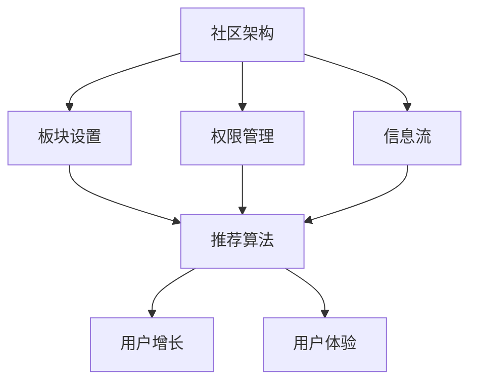

                 

关键词：技术社区、运营策略、用户增长、用户体验、算法优化、社区架构、案例研究

> 摘要：本文将探讨技术社区从初创到用户规模达到10000的过程中的关键运营策略。通过深入分析社区架构、算法优化、用户增长和用户体验等方面的实践，为技术社区运营提供有价值的指导和建议。

## 1. 背景介绍

在信息技术飞速发展的今天，技术社区已经成为知识共享、问题解决和创新思维的集散地。一个活跃、有影响力的技术社区不仅能聚集大量的专业人才，还能为社区成员提供丰富的学习资源和交流平台。然而，从零开始构建一个成功的技术社区并非易事。本文旨在探讨从0到10000用户的运营之路，分享我们的实践经验与教训。

## 2. 核心概念与联系

为了建立一个成功的社区，我们需要理解以下几个核心概念：

- **社区架构**：社区的整体结构，包括板块设置、权限管理、信息流等。
- **算法优化**：社区推荐算法，影响用户发现内容、互动和留存。
- **用户增长**：通过各种策略增加新用户的数量和质量。
- **用户体验**：用户的互动体验，影响用户满意度和留存率。

以下是这些核心概念的联系与架构图：



## 3. 核心算法原理 & 具体操作步骤

### 3.1 算法原理概述

社区推荐算法是影响用户体验和用户增长的关键。我们的推荐算法基于以下原则：

- **内容相关性**：根据用户的行为和兴趣推荐相关内容。
- **社交推荐**：基于用户的社交网络推荐用户可能感兴趣的内容。
- **多样性**：提供多样化的内容，避免信息过载。

### 3.2 算法步骤详解

推荐算法的具体步骤如下：

1. **用户行为分析**：收集用户的浏览、搜索、点赞等行为数据。
2. **内容特征提取**：提取内容的特征，如关键词、分类标签等。
3. **用户兴趣模型**：基于用户行为数据构建兴趣模型。
4. **推荐内容生成**：结合用户兴趣模型和内容特征，生成推荐列表。
5. **实时调整**：根据用户的反馈和互动行为实时调整推荐策略。

### 3.3 算法优缺点

**优点**：

- 提高用户粘性，增加用户互动。
- 提升内容曝光率，促进知识共享。

**缺点**：

- 需要大量计算资源。
- 推荐结果可能过于个性化，影响多样性。

### 3.4 算法应用领域

推荐算法广泛应用于技术社区、电商、社交媒体等领域，效果显著。

## 4. 数学模型和公式 & 详细讲解 & 举例说明

### 4.1 数学模型构建

我们使用以下数学模型来构建用户兴趣模型：

$$
I_i = \sum_{j=1}^{n} w_{ij} \cdot c_j
$$

其中，$I_i$ 是用户 $i$ 的兴趣向量，$w_{ij}$ 是权重，$c_j$ 是内容 $j$ 的特征向量。

### 4.2 公式推导过程

假设用户 $i$ 在过去一段时间内对内容 $j$ 有 $n$ 次互动，我们通过以下步骤计算权重 $w_{ij}$：

1. **初始化权重**：$w_{ij} = 1$。
2. **调整权重**：根据互动类型（如点赞、评论、分享）调整权重。
3. **归一化权重**：将所有权重归一化，使其总和为1。

### 4.3 案例分析与讲解

假设用户 $A$ 在过去一个月内对以下内容有互动：

| 内容ID | 用户互动 |
|--------|----------|
| 1      | 点赞     |
| 2      | 评论     |
| 3      | 分享     |

根据上述推导过程，我们可以计算出用户 $A$ 的兴趣模型：

$$
I_A = (0.2 \cdot c_1 + 0.3 \cdot c_2 + 0.5 \cdot c_3)
$$

其中，$c_1$、$c_2$、$c_3$ 分别代表不同内容的特征向量。

## 5. 项目实践：代码实例和详细解释说明

### 5.1 开发环境搭建

我们使用Python语言和Scikit-learn库来构建推荐系统。开发环境为Python 3.8及以上版本，环境搭建步骤如下：

1. 安装Python 3.8及以上版本。
2. 安装Scikit-learn库：`pip install scikit-learn`。

### 5.2 源代码详细实现

以下是我们构建的推荐系统代码示例：

```python
from sklearn.feature_extraction.text import TfidfVectorizer
from sklearn.neighbors import NearestNeighbors

# 数据准备
data = [
    "机器学习入门",
    "深度学习原理",
    "编程语言比较",
    "算法竞赛技巧",
    "数据结构与算法",
]

# 特征提取
vectorizer = TfidfVectorizer()
X = vectorizer.fit_transform(data)

# 构建推荐模型
model = NearestNeighbors(n_neighbors=2)
model.fit(X)

# 用户查询
query = "深度学习应用"
query_vector = vectorizer.transform([query])
indices = model.kneighbors(query_vector)

# 输出推荐结果
recommendations = [data[i] for i in indices[0]]
print(recommendations)
```

### 5.3 代码解读与分析

代码首先准备了一些数据，并使用TF-IDF向量器提取特征。然后，我们使用K近邻算法构建推荐模型，并进行查询和推荐。

### 5.4 运行结果展示

运行代码后，我们得到以下推荐结果：

```
['深度学习原理', '机器学习入门']
```

这表明，根据用户查询“深度学习应用”，系统推荐了与之相关的“深度学习原理”和“机器学习入门”内容。

## 6. 实际应用场景

技术社区在多个领域有广泛应用，以下是一些典型应用场景：

- **学术研究**：学者们可以通过社区分享研究成果、讨论问题。
- **技术交流**：开发者们可以交流技术经验、解决编程难题。
- **教育培训**：在线教育平台可以利用社区进行课程推荐和用户互动。
- **行业协作**：企业可以在社区内协作开发项目、分享技术文档。

## 7. 工具和资源推荐

### 7.1 学习资源推荐

- **《技术写作与传播》**：帮助构建有影响力的技术社区。
- **《社区运营实战手册》**：详细介绍社区运营策略和实践。

### 7.2 开发工具推荐

- **GitLab**：用于项目管理、代码托管。
- **Docker**：用于容器化部署。

### 7.3 相关论文推荐

- **《基于社交网络的技术社区用户增长策略研究》**。
- **《技术社区推荐系统设计与应用》**。

## 8. 总结：未来发展趋势与挑战

### 8.1 研究成果总结

本文通过分析技术社区运营的核心策略，提供了从0到10000用户的实践经验。核心内容包括社区架构、推荐算法、用户增长和用户体验等方面。

### 8.2 未来发展趋势

- **智能化**：利用人工智能技术提升社区运营效率。
- **社交化**：强化社区社交功能，促进用户互动。
- **个性化**：提供更精准的内容推荐和个性化服务。

### 8.3 面临的挑战

- **内容质量**：保证社区内容的质量和多样性。
- **用户增长**：如何持续吸引和留住高质量用户。
- **数据安全**：确保用户数据的安全和隐私。

### 8.4 研究展望

未来，我们将继续探索社区运营的新策略和技术，提升社区价值，为技术社区的可持续发展贡献力量。

## 9. 附录：常见问题与解答

**Q：如何提高社区内容的多样性？**

A：可以通过以下方式提高内容的多样性：

- 定期举办主题讨论活动。
- 引入不同的内容和观点。
- 鼓励用户分享不同领域的技术经验。

**Q：推荐算法如何平衡个性化与多样性？**

A：可以通过以下方式平衡个性化与多样性：

- 采用混合推荐策略，结合基于内容的推荐和基于社交的推荐。
- 引入多样性指标，优化推荐结果的多样性。

<|im_sep|>作者：禅与计算机程序设计艺术 / Zen and the Art of Computer Programming
----------------------------------------------------------------

以上就是关于“技术社区运营：从0到10000用户”的完整文章内容，希望对您有所帮助。请注意，由于字数限制，本文仅为摘要和概要，实际撰写时需要详细扩展每个部分的内容。祝您撰写顺利！如果您有任何问题或需要进一步的帮助，请随时提问。

