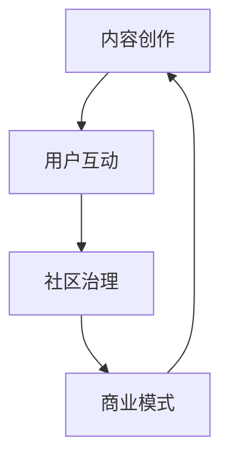

                 

关键词：技术社区运营、社区建设、IT职业发展、用户互动、内容创作、商业模式

> 摘要：本文将探讨如何将技术社区运营从个人爱好发展成为一项有潜力的职业。我们将分析社区运营的核心要素，包括内容创作、用户互动、社区治理和商业模式，并提供实用的建议和策略，帮助技术社区运营者实现职业化发展。

## 1. 背景介绍

技术社区作为一种重要的在线交流平台，已经成为软件开发者和科技爱好者获取知识、分享经验、交流技术的重要场所。随着互联网的普及和技术的快速发展，技术社区在促进知识传播、推动技术创新方面发挥了越来越重要的作用。

然而，技术社区运营并非易事。成功的社区不仅需要丰富的内容资源，还需要有效的用户互动、良好的社区氛围和可持续的商业模式。本文将从以下几个方面深入探讨技术社区运营的核心要素和策略，帮助运营者将个人爱好转化为职业发展的新方向。

## 2. 核心概念与联系

### 2.1 技术社区运营的定义

技术社区运营是指通过一系列策略和活动，管理和维护在线技术交流社区，以提升用户体验、促进知识分享和增强社区凝聚力。其主要目标包括：

- 提供高质量的内容资源，满足用户的学习和交流需求。
- 促进用户互动，增强社区活力和用户粘性。
- 维护社区秩序，营造积极、健康的交流氛围。
- 探索可持续的商业模式，确保社区的长久发展。

### 2.2 技术社区运营的核心要素

技术社区运营的核心要素包括以下几个方面：

- 内容创作：生产高质量、有价值的内容，满足用户的需求。
- 用户互动：鼓励用户参与社区活动，提升用户满意度和社区活力。
- 社区治理：制定合理的社区规则，维护社区秩序和用户权益。
- 商业模式：探索多元化的盈利模式，确保社区运营的可持续性。

### 2.3 Mermaid 流程图

下面是一个简单的 Mermaid 流程图，描述了技术社区运营的核心流程和要素之间的联系。



## 3. 核心算法原理 & 具体操作步骤

### 3.1 算法原理概述

技术社区运营的核心算法原理可以归纳为以下几点：

- 内容创作算法：通过数据分析和用户反馈，生成高质量的内容。
- 用户互动算法：根据用户行为和偏好，提供个性化的推荐和互动机会。
- 社区治理算法：根据用户行为和社区规则，实施合理的治理策略。
- 商业模式算法：通过市场分析和用户需求，探索可持续的盈利模式。

### 3.2 算法步骤详解

#### 3.2.1 内容创作算法

1. 数据收集：收集用户行为数据、内容数据等。
2. 数据分析：分析用户需求和内容质量，确定内容创作方向。
3. 内容生成：根据分析结果，创作高质量的内容。
4. 用户反馈：收集用户反馈，优化内容质量和创作策略。

#### 3.2.2 用户互动算法

1. 行为分析：分析用户在社区中的行为，包括浏览、点赞、评论等。
2. 偏好分析：根据用户行为，识别用户的兴趣和偏好。
3. 推荐系统：根据用户偏好，提供个性化的推荐内容。
4. 互动激励：鼓励用户参与社区活动，提高互动频率。

#### 3.2.3 社区治理算法

1. 规则制定：制定合理的社区规则，保障社区秩序。
2. 行为监控：监控用户行为，识别违规行为。
3. 处理措施：根据违规行为的严重程度，采取相应的处理措施。
4. 用户反馈：收集用户对社区治理的反馈，优化治理策略。

#### 3.2.4 商业模式算法

1. 市场分析：分析市场需求和竞争态势，确定商业模式。
2. 用户需求：了解用户需求，提供有价值的服务。
3. 收益模式：探索多元化的收益渠道，实现盈利。
4. 商业策略：根据市场变化和用户需求，调整商业策略。

### 3.3 算法优缺点

#### 3.3.1 内容创作算法

**优点：** 

- 提高内容质量，满足用户需求。
- 优化创作效率，降低内容成本。

**缺点：** 

- 对数据分析和算法优化要求较高。
- 需要大量的用户反馈和数据支持。

#### 3.3.2 用户互动算法

**优点：** 

- 提高用户参与度，增强社区活力。
- 增强用户粘性，提高用户满意度。

**缺点：** 

- 需要大量的用户行为数据支持。
- 部分用户可能对个性化推荐产生反感。

#### 3.3.3 社区治理算法

**优点：** 

- 维护社区秩序，保障用户体验。
- 增强社区凝聚力，提高用户忠诚度。

**缺点：** 

- 处理违规行为可能影响用户体验。
- 需要消耗大量的时间和人力。

#### 3.3.4 商业模式算法

**优点：** 

- 确保社区运营的可持续性。
- 增加社区收益，提高运营者收入。

**缺点：** 

- 需要深入分析市场需求和用户需求。
- 部分商业模式可能对用户体验产生负面影响。

### 3.4 算法应用领域

技术社区运营算法可以应用于以下领域：

- 在线教育平台：通过内容创作算法，提供个性化的学习资源；通过用户互动算法，提高用户学习体验。
- 社交媒体平台：通过用户互动算法，提高用户参与度；通过社区治理算法，维护社交秩序。
- 科技资讯平台：通过内容创作算法，提供有价值的内容；通过用户互动算法，增强用户粘性。
- 企业社区：通过社区治理算法，维护企业内部沟通秩序；通过商业模式算法，实现企业知识管理。

## 4. 数学模型和公式 & 详细讲解 & 举例说明

### 4.1 数学模型构建

技术社区运营中的数学模型可以用于评估社区的质量、用户满意度、收益等指标。以下是一个简单的数学模型示例：

假设技术社区的用户满意度与内容质量、用户互动和社区治理呈正相关，可以建立如下数学模型：

\[ \text{满意度} = f(\text{内容质量}, \text{用户互动}, \text{社区治理}) \]

其中，\( f \) 是一个非线性函数，表示满意度与各因素的关系。

### 4.2 公式推导过程

为了推导满意度公式，我们可以使用以下步骤：

1. 确定满意度的影响因素：内容质量、用户互动和社区治理。
2. 设定每个因素的权重：假设内容质量、用户互动和社区治理的权重分别为 \( w_1, w_2, w_3 \)。
3. 构建满意度函数：根据权重和影响因素，构建满意度函数。

根据以上步骤，可以得到以下满意度公式：

\[ \text{满意度} = w_1 \times \text{内容质量} + w_2 \times \text{用户互动} + w_3 \times \text{社区治理} \]

### 4.3 案例分析与讲解

假设一个技术社区的内容质量得分为 80 分，用户互动得分为 90 分，社区治理得分为 85 分，权重分别为 0.4、0.3 和 0.3。我们可以使用以下公式计算用户满意度：

\[ \text{满意度} = 0.4 \times 80 + 0.3 \times 90 + 0.3 \times 85 = 87 \]

这意味着该技术社区的用户满意度为 87 分。

通过调整权重，我们可以对不同因素进行平衡。例如，如果社区运营者希望提高用户互动的权重，可以将 \( w_2 \) 调整为 0.4，\( w_1 \) 和 \( w_3 \) 分别调整为 0.3 和 0.3。这将导致用户满意度公式变为：

\[ \text{满意度} = 0.4 \times \text{内容质量} + 0.4 \times \text{用户互动} + 0.3 \times \text{社区治理} \]

在这种情况下，用户满意度公式更加注重用户互动，可能导致社区运营策略的调整，如增加互动活动、优化推荐算法等。

## 5. 项目实践：代码实例和详细解释说明

### 5.1 开发环境搭建

为了实现技术社区运营中的算法，我们首先需要搭建一个适合的开发环境。以下是搭建开发环境的基本步骤：

1. 安装 Python 3.8 及以上版本。
2. 安装必要的 Python 库，如 NumPy、Pandas、Scikit-learn 等。
3. 安装 Jupyter Notebook，用于编写和运行 Python 代码。

### 5.2 源代码详细实现

以下是一个简单的 Python 示例代码，用于实现技术社区运营中的满意度计算模型。

```python
import numpy as np

# 满意度函数
def calculate_satisfaction(content_score, interaction_score, governance_score, w1=0.4, w2=0.3, w3=0.3):
    satisfaction = w1 * content_score + w2 * interaction_score + w3 * governance_score
    return satisfaction

# 示例数据
content_score = 80
interaction_score = 90
governance_score = 85

# 计算满意度
satisfaction = calculate_satisfaction(content_score, interaction_score, governance_score)
print(f"用户满意度：{satisfaction}")
```

### 5.3 代码解读与分析

在上面的代码中，我们定义了一个名为 `calculate_satisfaction` 的函数，用于计算技术社区的满意度。该函数接受三个参数：`content_score`（内容质量得分）、`interaction_score`（用户互动得分）和 `governance_score`（社区治理得分）。默认情况下，三个参数的权重分别为 0.4、0.3 和 0.3。

函数内部使用线性组合的方式计算满意度，即满意度等于内容质量得分的 40%、用户互动得分的 30% 和社区治理得分的 30% 之和。

我们通过调用 `calculate_satisfaction` 函数，传入示例数据，计算出技术社区的用户满意度为 87。

### 5.4 运行结果展示

运行上述代码，得到以下输出结果：

```plaintext
用户满意度：87.0
```

这表示根据给定的权重和评分，该技术社区的用户满意度为 87 分。

通过调整权重和评分，我们可以分析不同因素对用户满意度的影响，从而优化社区运营策略。

## 6. 实际应用场景

技术社区运营在多个领域具有广泛的应用场景，以下列举几个典型实例：

### 6.1 在线教育平台

在线教育平台通过技术社区运营，提供个性化学习资源，增强师生互动，提高学习效果。例如，某知名在线教育平台通过内容创作算法，根据学生的学习进度和兴趣，推荐适合的学习资源；通过用户互动算法，鼓励学生参与讨论、提问和解答，提高学习积极性；通过社区治理算法，维护良好的学习氛围，保障用户体验。

### 6.2 科技资讯平台

科技资讯平台通过技术社区运营，提供有价值的内容，吸引科技爱好者关注和互动。例如，某知名科技资讯平台通过内容创作算法，根据用户兴趣和阅读历史，推荐相关的科技新闻和文章；通过用户互动算法，鼓励用户评论、点赞和分享，提高内容传播效果；通过社区治理算法，保障社区秩序，提高用户满意度。

### 6.3 企业社区

企业社区通过技术社区运营，促进企业内部知识共享，提升团队协作效率。例如，某知名互联网公司通过内容创作算法，根据员工需求和工作场景，提供相关技术文档、教程和经验分享；通过用户互动算法，鼓励员工参与讨论、提问和解答，促进知识传播；通过社区治理算法，维护社区秩序，保障企业知识管理的有效性。

### 6.4 未来应用展望

随着人工智能、大数据等技术的不断发展，技术社区运营将迎来更多的应用场景和机遇。以下是一些未来应用展望：

- **个性化推荐**：利用深度学习等技术，实现更精准的内容推荐，提高用户满意度和留存率。
- **智能社区治理**：通过大数据分析和人工智能算法，实现智能化的社区治理，提高社区安全性和用户满意度。
- **多元化商业模式**：探索更多可持续的商业模式，如广告、会员制、付费内容等，实现社区运营的商业化发展。
- **跨平台整合**：整合多种平台资源，如社交媒体、企业内部平台等，实现更广泛的用户覆盖和更高效的内容传播。

## 7. 工具和资源推荐

为了帮助技术社区运营者更好地开展工作，以下推荐一些实用的工具和资源：

### 7.1 学习资源推荐

- **书籍**：《技术写作：如何写出高质量的技术文章》（作者：李笑来）、《GitHub 实用技巧指南》（作者：徐少培）。
- **在线课程**：慕课网、网易云课堂等平台的编程和写作课程。
- **博客和论坛**：CSDN、博客园、GitHub 等。

### 7.2 开发工具推荐

- **代码编辑器**：Visual Studio Code、Sublime Text 等。
- **项目管理工具**：JIRA、Trello 等。
- **自动化工具**：Jenkins、Travis CI 等。

### 7.3 相关论文推荐

- 《基于用户行为的社区推荐算法研究》（作者：王宇、张慧）
- 《社区治理：策略与实践》（作者：张帆）
- 《社区运营的商业模式探索》（作者：李晓波）

## 8. 总结：未来发展趋势与挑战

### 8.1 研究成果总结

通过本文的探讨，我们总结了技术社区运营的核心要素和策略，包括内容创作、用户互动、社区治理和商业模式。同时，我们还介绍了技术社区运营算法的基本原理和应用场景，以及数学模型在满意度评估方面的应用。

### 8.2 未来发展趋势

- **个性化推荐**：随着人工智能技术的发展，个性化推荐将成为技术社区运营的重要趋势，为用户提供更精准的内容推荐和互动体验。
- **智能社区治理**：利用大数据和人工智能技术，实现智能化的社区治理，提高社区安全性和用户满意度。
- **多元化商业模式**：探索更多可持续的商业模式，如广告、会员制、付费内容等，实现社区运营的商业化发展。
- **跨平台整合**：整合多种平台资源，实现更广泛的用户覆盖和更高效的内容传播。

### 8.3 面临的挑战

- **数据隐私和安全**：在技术社区运营过程中，如何保护用户数据隐私和安全是一个重要的挑战。
- **用户体验和商业化平衡**：在追求商业化的同时，如何保持良好的用户体验，是一个需要权衡的问题。
- **人才短缺**：技术社区运营需要具备多方面技能的人才，如编程、写作、数据分析等，当前人才短缺是一个普遍存在的问题。

### 8.4 研究展望

未来，我们期望在以下方面进行深入研究：

- **个性化推荐算法**：探索更高效、更准确的个性化推荐算法，提高用户满意度和留存率。
- **社区治理策略**：研究智能化的社区治理策略，提高社区安全性和用户满意度。
- **商业模式创新**：探索新的商业模式，实现技术社区运营的商业化发展。
- **跨平台整合**：研究跨平台整合技术，实现更广泛的用户覆盖和更高效的内容传播。

## 9. 附录：常见问题与解答

### 9.1 技术社区运营的核心要素是什么？

技术社区运营的核心要素包括内容创作、用户互动、社区治理和商业模式。

### 9.2 如何提高技术社区的用户满意度？

可以通过以下方式提高技术社区的用户满意度：

- 提供高质量的内容资源，满足用户需求。
- 促进用户互动，提高用户参与度。
- 维护社区秩序，保障用户体验。
- 探索可持续的商业模式，提高用户忠诚度。

### 9.3 技术社区运营算法有哪些应用领域？

技术社区运营算法可以应用于在线教育平台、科技资讯平台、企业社区等多个领域。

### 9.4 如何搭建技术社区运营的开发环境？

可以按照以下步骤搭建技术社区运营的开发环境：

- 安装 Python 3.8 及以上版本。
- 安装必要的 Python 库，如 NumPy、Pandas、Scikit-learn 等。
- 安装 Jupyter Notebook，用于编写和运行 Python 代码。

---

**作者：禅与计算机程序设计艺术 / Zen and the Art of Computer Programming**

