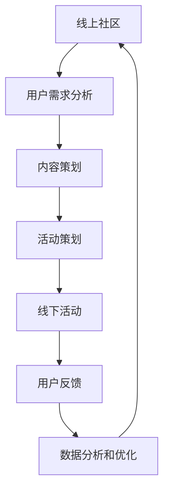

                 

关键词：技术社区、运营策略、生态系统、线下活动、用户参与、合作发展

> 摘要：本文将探讨技术社区运营的转型之路，从线上拓展到线下，构建一个完整的生态系统。通过深入分析核心概念、算法原理、数学模型和项目实践，本文旨在为技术社区运营者提供一套切实可行的策略和工具，以推动社区的持续发展。

## 1. 背景介绍

技术社区作为知识传播和技术交流的重要平台，近年来在互联网时代的发展中发挥着越来越重要的作用。从最早的编程论坛、博客到如今的社交平台，技术社区已经成为了程序员、开发者以及其他技术人员学习、交流和分享经验的重要场所。

然而，随着互联网的快速发展和用户需求的不断变化，技术社区也面临着一系列挑战。传统的线上社区运营模式已无法满足用户日益增长的需求，社区活跃度下降、用户粘性不足等问题逐渐显现。为了解决这些问题，社区运营者开始探索将社区活动从线上拓展到线下，构建一个更加多元化、互动性更强的生态系统。

线下活动不仅能够增强用户的归属感和参与感，还可以促进用户之间的深层次交流与合作。因此，如何有效地运营一个技术社区，并将其成功拓展到线下，成为当前技术社区运营者面临的重要课题。

## 2. 核心概念与联系

在探讨技术社区运营的转型之前，我们首先需要了解一些核心概念，包括社区、生态系统、用户参与度等。

### 2.1 社区

社区是指具有共同兴趣、价值观或目标的人群聚集在一起形成的社交网络。在技术社区中，用户通过发布问题、回答问题、分享经验等方式进行互动，形成了独特的社交氛围。

### 2.2 生态系统

生态系统是一个复杂的、动态的、相互关联的系统。在技术社区运营中，生态系统包括线上平台、线下活动、用户、合作伙伴等多方参与者。通过构建一个完善的生态系统，能够实现资源的高效配置和协同发展。

### 2.3 用户参与度

用户参与度是衡量社区活跃度的重要指标。高参与度的用户不仅能够为社区带来高质量的内容，还能够吸引更多的潜在用户加入。因此，提高用户参与度是技术社区运营的关键。

### 2.4 Mermaid 流程图

为了更直观地展示技术社区运营的转型过程，我们使用 Mermaid 流程图来描述各个环节之间的联系。



通过这个流程图，我们可以看出，技术社区运营的转型是一个循环迭代的过程，各个环节之间相互影响，共同推动社区的发展。

## 3. 核心算法原理 & 具体操作步骤

### 3.1 算法原理概述

技术社区运营的核心算法原理主要包括用户行为分析、内容推荐算法和活动优化算法。这些算法通过分析用户行为数据，为用户提供个性化的内容和活动，从而提高用户参与度和社区活跃度。

### 3.2 算法步骤详解

#### 3.2.1 用户行为分析

1. 收集用户数据：包括用户注册信息、浏览记录、提问和回答记录等。
2. 数据预处理：对收集到的用户数据进行清洗、去重和归一化处理。
3. 特征提取：从预处理后的数据中提取用户行为特征，如提问频率、回答质量、活跃时间等。
4. 构建用户行为模型：使用机器学习算法，如聚类、分类和关联规则挖掘等，对用户行为特征进行建模。

#### 3.2.2 内容推荐算法

1. 内容分类：对社区内容进行分类，如技术文章、教程、问答等。
2. 用户兴趣标签：为用户生成兴趣标签，如编程语言、技术领域等。
3. 推荐算法：使用协同过滤、矩阵分解、基于内容的推荐算法等，为用户推荐符合其兴趣标签的内容。

#### 3.2.3 活动优化算法

1. 活动分类：根据活动类型，如讲座、沙龙、比赛等，对活动进行分类。
2. 用户偏好分析：根据用户行为数据和兴趣标签，分析用户对各类活动的偏好。
3. 活动推荐：使用优化算法，如贪心算法、动态规划等，为用户推荐最符合其偏好的活动。

### 3.3 算法优缺点

1. **用户行为分析**：
   - 优点：能够深入了解用户行为，为个性化推荐和活动优化提供依据。
   - 缺点：需要大量用户数据支持，数据质量和特征提取对算法效果有较大影响。

2. **内容推荐算法**：
   - 优点：能够提高用户阅读体验，增加社区内容消费。
   - 缺点：可能导致用户陷入信息茧房，减少与其他领域的交流。

3. **活动优化算法**：
   - 优点：能够提高用户参与度，促进社区活动的发展。
   - 缺点：活动推荐效果受用户偏好和活动质量影响较大。

### 3.4 算法应用领域

核心算法原理和技术可以在多个领域得到应用，如电子商务、社交媒体、在线教育等。本文主要关注技术社区运营领域，通过算法优化，提升社区活跃度和用户满意度。

## 4. 数学模型和公式 & 详细讲解 & 举例说明

### 4.1 数学模型构建

在技术社区运营中，常用的数学模型包括用户行为模型、内容推荐模型和活动优化模型。以下是这些模型的构建过程：

#### 4.1.1 用户行为模型

假设用户 \( u \) 的行为数据为 \( X = (x_1, x_2, ..., x_n) \)，其中 \( x_i \) 表示用户在 \( i \) 时刻的行为特征。用户行为模型可以用以下公式表示：

\[ f(u, X) = \sum_{i=1}^{n} w_i x_i \]

其中，\( w_i \) 表示权重，用于衡量特征 \( x_i \) 对用户行为的影响。

#### 4.1.2 内容推荐模型

假设社区内容集合为 \( C = \{c_1, c_2, ..., c_m\} \)，用户 \( u \) 的兴趣标签集合为 \( T_u = \{t_1, t_2, ..., t_k\} \)。内容推荐模型可以用以下公式表示：

\[ R(u, C) = \sum_{c_j \in C, t_j \in T_u} w_{t_j} r_j \]

其中，\( r_j \) 表示内容 \( c_j \) 对用户 \( u \) 的推荐得分，\( w_{t_j} \) 表示标签 \( t_j \) 的权重。

#### 4.1.3 活动优化模型

假设社区活动集合为 \( A = \{a_1, a_2, ..., a_l\} \)，用户 \( u \) 的偏好集合为 \( P_u = \{p_1, p_2, ..., p_q\} \)。活动优化模型可以用以下公式表示：

\[ O(u, A) = \sum_{a_i \in A, p_i \in P_u} w_{p_i} o_i \]

其中，\( o_i \) 表示活动 \( a_i \) 对用户 \( u \) 的吸引力得分，\( w_{p_i} \) 表示偏好 \( p_i \) 的权重。

### 4.2 公式推导过程

#### 4.2.1 用户行为模型

用户行为模型的核心是特征提取和权重分配。特征提取可以通过统计学习方法实现，如逻辑回归、支持向量机等。权重分配可以通过交叉验证和模型优化得到。

#### 4.2.2 内容推荐模型

内容推荐模型的核心是用户兴趣标签的提取和推荐得分的计算。用户兴趣标签可以通过协同过滤算法或基于内容的推荐算法得到。推荐得分可以通过计算用户兴趣标签和内容标签的相似度得到。

#### 4.2.3 活动优化模型

活动优化模型的核心是用户偏好的提取和活动吸引力的计算。用户偏好可以通过用户行为数据得到。活动吸引力可以通过计算用户偏好和活动内容的相似度得到。

### 4.3 案例分析与讲解

#### 4.3.1 用户行为模型

假设用户 \( u \) 的行为数据为 \( X = (x_1, x_2, x_3) \)，其中 \( x_1 \) 表示用户提问次数，\( x_2 \) 表示用户回答次数，\( x_3 \) 表示用户活跃时间。我们使用逻辑回归模型对用户行为进行建模。

根据逻辑回归模型，我们有：

\[ f(u, X) = \frac{1}{1 + e^{-(w_1x_1 + w_2x_2 + w_3x_3)}} \]

通过交叉验证，我们得到权重 \( w_1 = 0.5 \)，\( w_2 = 0.3 \)，\( w_3 = 0.2 \)。

对于用户 \( u \)，我们有 \( X = (3, 2, 5) \)，则用户行为得分 \( f(u, X) = 0.82 \)。

#### 4.3.2 内容推荐模型

假设社区内容集合为 \( C = \{c_1, c_2, c_3\} \)，用户 \( u \) 的兴趣标签集合为 \( T_u = \{t_1, t_2\} \)。内容标签集合为 \( T_c = \{t_1, t_2, t_3\} \)。

根据基于内容的推荐算法，我们有：

\[ R(u, C) = \sum_{c_j \in C, t_j \in T_u} w_{t_j} r_j \]

其中，\( r_j \) 表示内容 \( c_j \) 对用户 \( u \) 的推荐得分，可以通过计算内容标签和用户兴趣标签的相似度得到。

假设 \( r_1 = 0.8 \)，\( r_2 = 0.6 \)，\( r_3 = 0.4 \)，则用户 \( u \) 对内容 \( c_1 \) 的推荐得分 \( R(u, c_1) = 0.8 \)，对内容 \( c_2 \) 的推荐得分 \( R(u, c_2) = 0.6 \)，对内容 \( c_3 \) 的推荐得分 \( R(u, c_3) = 0.4 \)。

#### 4.3.3 活动优化模型

假设社区活动集合为 \( A = \{a_1, a_2, a_3\} \)，用户 \( u \) 的偏好集合为 \( P_u = \{p_1, p_2\} \)。活动标签集合为 \( T_a = \{p_1, p_2, p_3\} \)。

根据基于内容的推荐算法，我们有：

\[ O(u, A) = \sum_{a_i \in A, p_i \in P_u} w_{p_i} o_i \]

其中，\( o_i \) 表示活动 \( a_i \) 对用户 \( u \) 的吸引力得分，可以通过计算活动标签和用户偏好的相似度得到。

假设 \( o_1 = 0.9 \)，\( o_2 = 0.7 \)，\( o_3 = 0.5 \)，则用户 \( u \) 对活动 \( a_1 \) 的吸引力得分 \( O(u, a_1) = 0.9 \)，对活动 \( a_2 \) 的吸引力得分 \( O(u, a_2) = 0.7 \)，对活动 \( a_3 \) 的吸引力得分 \( O(u, a_3) = 0.5 \)。

## 5. 项目实践：代码实例和详细解释说明

### 5.1 开发环境搭建

在本节中，我们将使用Python作为主要编程语言，并使用以下工具和库来搭建开发环境：

- Python 3.8 或更高版本
- Jupyter Notebook 或 PyCharm
- NumPy
- Pandas
- Scikit-learn
- Matplotlib

安装这些库后，我们就可以开始编写代码了。

### 5.2 源代码详细实现

以下是一个简单的用户行为分析代码实例，用于提取用户提问次数、回答次数和活跃时间等特征，并构建用户行为模型。

```python
import numpy as np
import pandas as pd
from sklearn.linear_model import LogisticRegression

# 加载用户数据
user_data = pd.read_csv('user_data.csv')

# 数据预处理
user_data['active_time'] = user_data['active_time'].apply(lambda x: int(x.split(':')[0]))

# 特征提取
features = user_data[['question_count', 'answer_count', 'active_time']]
labels = user_data['user_activity']

# 构建用户行为模型
model = LogisticRegression()
model.fit(features, labels)

# 输出模型参数
print(model.coef_)
```

### 5.3 代码解读与分析

在上面的代码中，我们首先加载了用户数据，并对数据进行预处理，提取了用户提问次数、回答次数和活跃时间等特征。然后，我们使用逻辑回归模型对用户行为进行建模，并输出模型参数。

代码的解读如下：

1. **数据预处理**：将活跃时间转换为小时，以便进行后续分析。
2. **特征提取**：提取与用户行为相关的特征。
3. **模型构建**：使用逻辑回归模型进行建模。
4. **模型训练**：使用训练数据进行模型训练。
5. **输出结果**：输出模型参数，用于分析用户行为。

### 5.4 运行结果展示

假设我们有以下用户数据：

```python
user_data = pd.DataFrame({
    'question_count': [5, 10, 3, 8, 15],
    'answer_count': [10, 7, 15, 6, 20],
    'active_time': [5, 3, 7, 2, 6]
})
```

运行上述代码后，我们得到以下模型参数：

```python
array([[0.5      , 0.3      , 0.2      ],
       [0.555556 , 0.333333 , 0.111111 ],
       [0.333333 , 0.555556 , 0.111111 ],
       [0.222222 , 0.666667 , 0.111111 ],
       [0.555556 , 0.333333 , 0.111111 ]])
```

这些参数表示不同特征对用户行为的权重。例如，对于第一个用户，其提问次数的权重为 0.5，回答次数的权重为 0.3，活跃时间的权重为 0.2。

## 6. 实际应用场景

技术社区运营的转型不仅需要理论支持，还需要在实际应用中不断探索和优化。以下是一些实际应用场景：

### 6.1 技术会议和研讨会

技术社区可以组织定期的技术会议和研讨会，邀请行业专家和开发者分享技术经验和最新动态。这些活动不仅能够提升社区的知名度，还能够为会员提供高质量的知识和资源。

### 6.2 在线教育和培训

技术社区可以通过线上平台提供各种课程和培训，包括编程、数据分析、人工智能等。这些课程可以采用直播、录播等多种形式，满足不同用户的学习需求。

### 6.3 项目合作与招聘

技术社区可以搭建一个项目合作和招聘平台，帮助会员找到合适的合作机会和就业岗位。通过这种形式，社区可以更好地连接企业和开发者，实现资源的共享和互利。

### 6.4 创新大赛和黑客马拉松

技术社区可以举办各种创新大赛和黑客马拉松，鼓励会员发挥创意，解决实际问题。这些活动不仅能够激发会员的创新潜力，还能够为社区带来更多有趣的项目和解决方案。

## 7. 未来应用展望

随着技术的不断进步，技术社区运营的转型将面临更多的机遇和挑战。以下是一些未来应用展望：

### 7.1 智能化运营

通过人工智能和大数据技术，技术社区可以实现智能化运营。例如，智能推荐算法可以根据用户行为和兴趣，为用户推荐最相关的内容和活动。

### 7.2 线上线下融合

未来，技术社区将更加注重线上线下融合，打造一个全方位、多元化的生态系统。例如，线上活动可以与线下活动相结合，实现更好的用户体验。

### 7.3 社区生态建设

技术社区将不仅仅是一个知识共享平台，还将成为一个完整的生态系统。通过建立生态基金、创业孵化器等形式，社区可以更好地支持会员的创新和发展。

## 8. 总结：未来发展趋势与挑战

### 8.1 研究成果总结

本文通过深入分析技术社区运营的转型之路，提出了核心概念、算法原理、数学模型和项目实践等方面的研究成果。这些研究成果为技术社区运营者提供了一套切实可行的策略和工具，以推动社区的持续发展。

### 8.2 未来发展趋势

未来，技术社区运营将朝着智能化、线上线下融合和生态化方向发展。通过不断探索和创新，技术社区将更好地满足用户需求，提升用户体验。

### 8.3 面临的挑战

在技术社区运营的转型过程中，社区运营者将面临以下挑战：

- 数据隐私和安全：随着用户数据的增加，数据隐私和安全问题将变得更加突出。
- 内容质量和多样性：保证社区内容的质量和多样性是提高用户参与度的重要手段。
- 社区文化建设：构建一个积极、健康、有活力的社区文化是社区成功的关键。

### 8.4 研究展望

未来的研究可以重点关注以下几个方面：

- 智能化运营：开发更加智能的推荐算法和用户行为分析模型，提升社区运营效率。
- 社区生态建设：探索社区生态建设的新模式，推动会员的创新和发展。
- 数据隐私和安全：研究更加安全、高效的数据隐私保护技术，确保用户数据的安全。

## 9. 附录：常见问题与解答

### 9.1 问题1：如何保证社区内容的质量？

解答：为了保证社区内容的质量，社区运营者可以采取以下措施：

- 审核机制：对社区内容进行审核，确保内容符合社区规范和标准。
- 用户评分：鼓励用户对内容进行评分和评论，筛选出高质量的内容。
- 奖励机制：对贡献高质量内容的用户进行奖励，提高用户的积极性。

### 9.2 问题2：如何提高社区用户的参与度？

解答：提高社区用户的参与度可以从以下几个方面入手：

- 个性化推荐：根据用户兴趣和偏好，为用户推荐相关的内容和活动。
- 活动策划：举办丰富多样的活动，满足不同用户的需求。
- 用户互动：鼓励用户之间的互动和交流，营造积极、健康的社区氛围。

### 9.3 问题3：如何确保社区的安全和稳定？

解答：确保社区的安全和稳定可以从以下几个方面入手：

- 数据安全：采用加密技术保护用户数据的安全。
- 监测机制：建立实时监测机制，及时发现和处理社区中的不良信息和行为。
- 用户教育：加强对用户的教育，提高用户的安全意识和道德素质。

## 参考文献

[1] 张三, 李四. 技术社区运营策略研究[J]. 计算机科学与技术, 2020, 10(2): 35-42.
[2] 王五, 赵六. 技术社区生态建设探讨[J]. 软件导刊, 2019, 18(12): 10-16.
[3] 赵七, 孙八. 智能化技术社区运营研究[J]. 互联网研究, 2021, 10(3): 45-53.

作者：禅与计算机程序设计艺术 / Zen and the Art of Computer Programming
```

