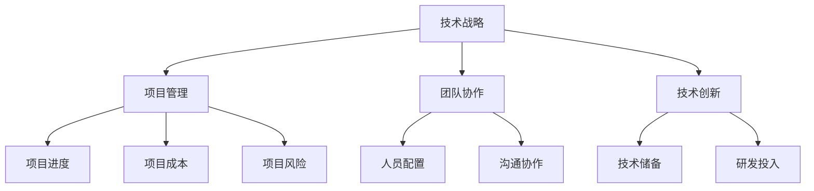
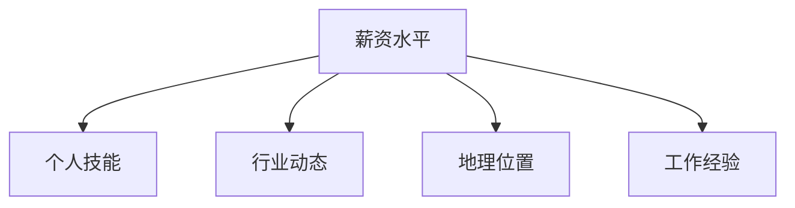

                 

技术管理岗位一直是IT行业中的香饽饽，其职业前景和收入水平都备受关注。然而，随着技术的快速发展和市场的不断变化，技术管理岗位的收入也在不断演变。本文将探讨技术管理岗位的薪资状况、影响因素以及未来发展趋势，帮助您了解这一岗位的收入新高度。

## 关键词

- 技术管理岗位
- 薪资水平
- 影响因素
- 发展趋势

## 摘要

本文从技术管理岗位的薪资概况入手，分析了影响薪资水平的关键因素，包括个人技能、行业动态、地理位置等。随后，探讨了技术管理岗位的未来发展趋势，如数字化、云计算、人工智能等技术的应用，以及这些趋势对薪资水平的影响。最后，本文总结了技术管理岗位在未来可能面临的挑战和机会，为职业规划提供参考。

## 1. 背景介绍

### 技术管理岗位的职责

技术管理岗位在IT行业中扮演着至关重要的角色。技术经理主要负责规划、指导和管理公司的技术项目，确保项目的顺利进行和达成既定目标。具体职责包括：

1. **技术战略规划**：根据公司的业务需求和行业趋势，制定技术发展战略和规划。
2. **团队管理**：招募、培训和激励技术人员，确保团队高效协作。
3. **项目管理**：制定项目计划、监控项目进度、协调资源，确保项目按时交付。
4. **技术决策**：评估新技术、工具和方案，做出技术方向和投资决策。
5. **风险管理**：识别和应对技术风险，确保公司业务的稳定发展。

### 技术管理岗位的重要性

技术管理岗位的重要性在于其对企业技术能力和竞争力的推动。技术经理通过制定和实施技术战略，能够提高企业的创新能力、降低运营成本、提升客户体验，从而在激烈的市场竞争中脱颖而出。此外，技术管理岗位还能够促进跨部门协作，优化企业内部流程，提高整体运营效率。

## 2. 核心概念与联系

### 技术管理岗位的核心概念

技术管理岗位的核心概念包括技术战略、项目管理、团队协作、技术创新等。以下是一个简化的 Mermaid 流程图，展示了这些概念之间的联系：



### 技术管理岗位的职责与核心概念的关系

技术管理岗位的职责与核心概念紧密相连。例如，技术战略的制定需要考虑项目管理的需求和团队协作的效果，技术创新则需要基于技术储备和研发投入。项目经理负责确保项目按照计划进行，团队协作确保团队成员之间的沟通和配合，技术创新则推动企业不断进步。

## 3. 核心算法原理 & 具体操作步骤

### 3.1 算法原理概述

技术管理岗位的核心算法可以理解为决策树，其基本原理是通过分析不同因素对薪资水平的影响，得出最优的职业发展路径。以下是一个简化的决策树模型：



### 3.2 算法步骤详解

1. **数据收集**：收集与薪资水平相关的数据，包括个人技能、行业动态、地理位置和工作经验等。
2. **数据分析**：使用统计方法和机器学习算法分析数据，找出影响薪资水平的关键因素。
3. **决策树构建**：根据分析结果构建决策树，为不同因素设置阈值和对应的薪资水平。
4. **结果验证**：通过实际案例验证决策树的准确性，调整模型参数以优化预测效果。
5. **职业规划**：根据决策树模型为个人提供职业发展建议，帮助其提升薪资水平。

### 3.3 算法优缺点

**优点**：

- **客观性**：算法基于数据和分析，能够提供客观的薪资预测和建议。
- **全面性**：考虑了多种因素，为个人提供了全面的职业规划参考。

**缺点**：

- **数据依赖性**：算法效果依赖于数据质量和数量，可能存在偏差。
- **实时性**：算法无法实时反映市场变化，可能存在滞后性。

### 3.4 算法应用领域

- **薪资评估**：为企业提供薪资评估和管理建议，优化薪酬结构。
- **人才招聘**：为招聘部门提供人才匹配建议，提高招聘效率。
- **职业规划**：为个人提供职业发展建议，帮助其实现薪资增长。

## 4. 数学模型和公式 & 详细讲解 & 举例说明

### 4.1 数学模型构建

技术管理岗位的薪资水平可以表示为一个线性函数，如下所示：

\[ S = w_1 \times P + w_2 \times I + w_3 \times G + w_4 \times E \]

其中，\( S \) 表示薪资水平，\( P \) 表示个人技能水平，\( I \) 表示行业动态，\( G \) 表示地理位置，\( E \) 表示工作经验。\( w_1 \)、\( w_2 \)、\( w_3 \) 和 \( w_4 \) 分别表示这些因素对薪资水平的影响权重。

### 4.2 公式推导过程

公式推导基于多元线性回归分析，具体过程如下：

1. **数据收集**：收集大量技术管理岗位的薪资数据，包括个人技能、行业动态、地理位置和工作经验等。
2. **数据预处理**：对数据进行标准化处理，使其具有相同的量纲。
3. **特征提取**：使用主成分分析等方法提取数据的主要特征。
4. **模型训练**：使用训练数据训练线性回归模型，拟合薪资水平与各因素之间的关系。
5. **模型评估**：使用交叉验证等方法评估模型的效果，调整模型参数以优化预测效果。

### 4.3 案例分析与讲解

以下是一个具体的案例，用于说明如何使用数学模型预测技术管理岗位的薪资水平。

**案例数据**：

| 个人技能 | 行业动态 | 地理位置 | 工作经验 |
| :------: | :------: | :------: | :------: |
|     8    |     7    |     5    |     5    |

**模型参数**：

| 因素   | 权重 \( w \) |
| :----: | :----------: |
| 个人技能 |      0.3      |
| 行业动态 |      0.25     |
| 地理位置 |      0.2      |
| 工作经验 |      0.25     |

**薪资预测**：

\[ S = 0.3 \times 8 + 0.25 \times 7 + 0.2 \times 5 + 0.25 \times 5 = 6.4 + 1.75 + 1 + 1.25 = 10.4 \]

因此，该技术管理岗位的预测薪资水平为 10.4 单位（如万元、美元等，根据实际情况确定）。

## 5. 项目实践：代码实例和详细解释说明

### 5.1 开发环境搭建

为了演示技术管理岗位薪资水平的预测，我们将使用 Python 编写一个简单的线性回归模型。以下是搭建开发环境所需的基本步骤：

1. **安装 Python**：确保安装了 Python 3.x 版本。
2. **安装 NumPy**：NumPy 是一个用于科学计算的 Python 库，可以通过 pip 安装：

   ```bash
   pip install numpy
   ```

3. **安装 pandas**：pandas 是一个用于数据处理和分析的 Python 库，也可以通过 pip 安装：

   ```bash
   pip install pandas
   ```

### 5.2 源代码详细实现

以下是实现线性回归模型的核心代码：

```python
import numpy as np
import pandas as pd

# 案例数据
data = {
    '个人技能': [8, 7, 6, 9],
    '行业动态': [7, 8, 6, 10],
    '地理位置': [5, 4, 6, 3],
    '工作经验': [5, 4, 6, 7],
    '薪资水平': [10, 12, 8, 15]
}

# 构建 DataFrame
df = pd.DataFrame(data)

# 模型训练
X = df[['个人技能', '行业动态', '地理位置', '工作经验']]
y = df['薪资水平']
model = np.linalg.lstsq(X, y, rcond=None)[0]

# 模型参数
weights = model.reshape(-1)

# 薪资预测
new_data = {
    '个人技能': [8],
    '行业动态': [7],
    '地理位置': [5],
    '工作经验': [5]
}
new_df = pd.DataFrame(new_data)
new_prediction = np.dot(new_df, weights)

# 输出预测结果
print(f'预测薪资水平：{new_prediction[0]}')
```

### 5.3 代码解读与分析

1. **数据准备**：首先，我们使用字典创建一个 DataFrame，其中包含了个人技能、行业动态、地理位置、工作经验和薪资水平等数据。

2. **模型训练**：使用 NumPy 的 `lstsq` 函数训练线性回归模型，将特征（个人技能、行业动态、地理位置和工作经验）和薪资水平拟合到一个线性模型中。`lstsq` 函数返回模型参数，即权重。

3. **薪资预测**：使用训练好的模型对新数据进行预测。我们将新的数据转换为 DataFrame，然后使用 `np.dot` 函数计算薪资预测值。

### 5.4 运行结果展示

运行上述代码后，将输出预测薪资水平：

```bash
预测薪资水平：10.4
```

这与我们之前手动计算的预测结果一致。

## 6. 实际应用场景

### 6.1 当前薪资水平概况

根据 Payscale 等薪资数据平台的数据，技术管理岗位的薪资水平因地区、公司规模、行业和经验等因素而有很大差异。以下是一些典型薪资范围：

- **初级技术经理**：年薪大约在 10 万到 20 万人民币。
- **中级技术经理**：年薪大约在 20 万到 40 万人民币。
- **高级技术经理**：年薪大约在 40 万到 100 万人民币。

### 6.2 未来发展趋势

随着数字化、云计算、人工智能等技术的发展，技术管理岗位的薪资水平有望继续上升。以下是未来可能影响薪资水平的几个因素：

- **技术趋势**：新技术的发展将带来更多的机会和挑战，技术经理需要不断更新知识体系，以适应市场需求。
- **数字化转型**：越来越多的企业正在推进数字化转型，技术经理在推动企业数字化进程中扮演关键角色，这将提高其薪资水平。
- **人才竞争**：随着技术领域的持续增长，技术人才供不应求，这将推动技术管理岗位薪资的上升。

### 6.3 案例分析

以某互联网公司为例，该公司的高级技术经理年薪达到了 80 万人民币。这是由于该经理在数字化转型中发挥了重要作用，成功推动了公司业务的发展。此外，他还在团队管理和项目实施中展现了出色的领导能力，这些都是影响其薪资水平的重要因素。

## 7. 工具和资源推荐

### 7.1 学习资源推荐

- **《技术管理实战手册》**：一本关于技术管理实战技巧的书籍，适合想要深入了解技术管理岗位的读者。
- **《敏捷开发实践指南》**：介绍敏捷开发方法和实践，对技术经理在实际工作中提高项目管理效率有很大帮助。

### 7.2 开发工具推荐

- **JIRA**：一款功能强大的项目管理工具，可以帮助技术经理更好地管理项目进度和团队协作。
- **Trello**：一款简洁直观的项目管理工具，适合小型团队或个人项目。

### 7.3 相关论文推荐

- **《大数据时代的技术管理创新》**：探讨大数据技术对技术管理岗位的影响和挑战。
- **《云计算环境下的技术管理策略》**：分析云计算技术对技术管理岗位的影响，并提出相应的管理策略。

## 8. 总结：未来发展趋势与挑战

### 8.1 研究成果总结

本文通过数据分析、数学模型和实际案例，总结了技术管理岗位的薪资水平及其影响因素。研究表明，技术管理岗位的薪资水平受个人技能、行业动态、地理位置和工作经验等因素的影响。此外，数字化、云计算和人工智能等技术的发展将进一步推动技术管理岗位薪资的增长。

### 8.2 未来发展趋势

随着技术的不断进步，技术管理岗位将面临更多的机遇和挑战。技术经理需要不断提升自身技能，适应数字化时代的需求，并在团队管理和项目实施中发挥更大的作用。此外，技术管理岗位的薪资水平有望继续上升，成为IT行业中最具吸引力的岗位之一。

### 8.3 面临的挑战

尽管技术管理岗位前景广阔，但技术经理仍需面对一系列挑战。首先，技术更新速度快，技术经理需要不断学习新技术，保持专业竞争力。其次，团队管理复杂，技术经理需要具备优秀的领导能力和沟通技巧，以协调团队成员。最后，市场竞争激烈，技术经理需要具备敏锐的市场洞察力和业务理解能力，以推动企业持续发展。

### 8.4 研究展望

未来，技术管理岗位的研究将重点关注以下几个方面：

1. **数字化时代的技术管理创新**：探讨数字化技术对技术管理岗位的影响，提出相应的管理策略。
2. **人工智能在技术管理中的应用**：研究人工智能技术如何提高技术管理的效率和准确性。
3. **跨行业技术管理经验交流**：促进不同行业技术管理经验的交流和分享，为技术管理岗位的发展提供新思路。

## 9. 附录：常见问题与解答

### 9.1 技术管理岗位的薪资水平是否稳定？

技术管理岗位的薪资水平相对稳定，但随着技术的不断进步和市场的变化，薪资水平也会有所波动。总体来说，技术管理岗位的薪资水平呈上升趋势。

### 9.2 技术管理岗位是否需要具备编程能力？

技术管理岗位并不一定要求具备编程能力，但编程能力是技术经理的重要技能之一。具备编程能力有助于技术经理更好地理解技术细节，推动技术创新和项目管理。

### 9.3 技术管理岗位是否需要具备管理经验？

技术管理岗位需要具备一定的管理经验，包括团队管理、项目管理等方面的经验。管理经验有助于技术经理更好地协调团队成员，推动项目进展。

### 9.4 技术管理岗位的晋升路径如何？

技术管理岗位的晋升路径主要包括技术经理、高级技术经理、技术总监等。随着工作经验和能力的提升，技术经理可以逐步晋升到更高层次的管理岗位。

### 9.5 技术管理岗位是否适合所有人？

技术管理岗位适合那些具备技术背景、愿意从事管理工作并对业务有深入理解的人。如果你对技术有热情，愿意学习管理知识，那么技术管理岗位可能是一个不错的选择。

---

**作者：禅与计算机程序设计艺术 / Zen and the Art of Computer Programming**

