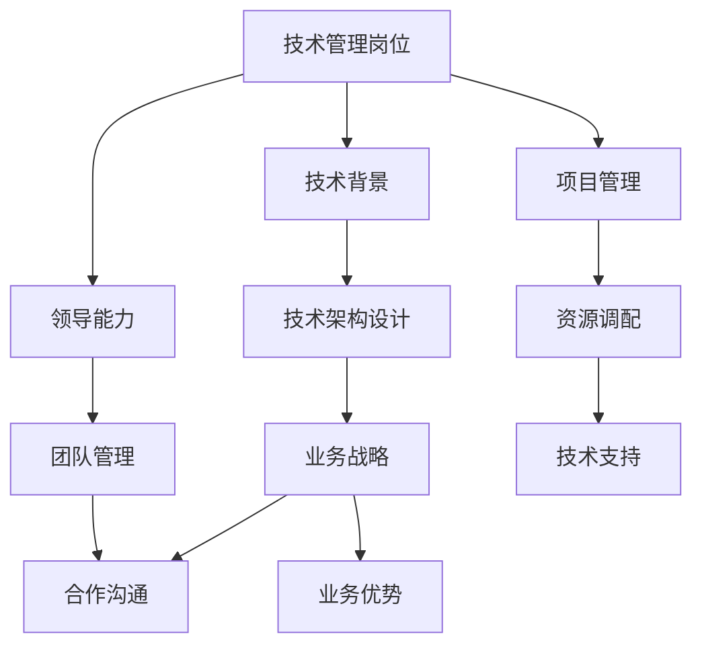

                 

关键词：技术管理，收入增长，职业发展，技能提升，策略规划，企业领导力，技术创新。

> 摘要：本文深入探讨了技术管理岗位的职业发展路径及其在收入增长方面的潜力和挑战。通过分析市场需求、个人技能提升、企业领导力培养以及技术创新实践，探讨了如何实现技术管理岗位上的收入新高度。

## 1. 背景介绍

在当今科技迅猛发展的时代，技术管理岗位成为了众多求职者和企业争夺的焦点。随着云计算、大数据、人工智能等技术的广泛应用，技术管理人员的角色变得愈加重要。从企业内部的技术架构设计，到外部技术战略的制定，技术管理人员需要具备多方面的技能和知识。

技术管理岗位的收入水平通常较高，但这并不是一成不变的。市场需求的波动、个人能力的提升、企业对技术管理的重视程度等因素都会影响技术管理岗位的收入水平。因此，如何在技术管理岗位实现收入的新高度，成为众多技术管理人员关注的焦点。

## 2. 核心概念与联系

为了深入理解技术管理岗位，我们首先需要了解几个核心概念：

### 2.1 技术管理岗位的定义

技术管理岗位是指在组织中负责规划、实施、管理和监督信息技术系统的职位。技术管理人员需要具备深厚的技术背景，同时还要具备优秀的领导能力和项目管理能力。

### 2.2 技术管理与业务战略的联系

技术管理不仅仅是技术的事，更是企业战略的一部分。技术管理人员需要将技术优势转化为业务优势，帮助企业实现战略目标。

### 2.3 技术管理人员的角色

技术管理人员不仅要管理技术团队，还需要与业务团队密切合作，确保技术支持业务发展。他们的角色涵盖了技术规划、团队管理、资源调配等多个方面。

下面是一个简单的 Mermaid 流程图，展示技术管理岗位的核心概念和联系：



## 3. 核心算法原理 & 具体操作步骤

### 3.1 算法原理概述

技术管理岗位的核心算法原理可以概括为：

1. **技术能力**：持续学习新技术，掌握核心技术和工具，提升个人技术能力。
2. **领导能力**：培养团队领导力，提高团队协作效率，激发团队成员的潜力。
3. **战略规划**：将技术优势转化为业务优势，制定并实施有效的技术战略。
4. **项目管理**：运用项目管理方法论，确保项目按时按质完成。

### 3.2 算法步骤详解

为了实现技术管理岗位上的收入新高度，可以采取以下具体操作步骤：

#### 3.2.1 持续学习与技能提升

1. **技术学习**：定期参加技术培训，学习前沿技术，如云计算、大数据、人工智能等。
2. **知识分享**：通过内部分享、外部演讲等方式，将所学知识分享给团队成员，提升团队整体技术水平。

#### 3.2.2 培养领导能力

1. **团队建设**：定期组织团队活动，增强团队凝聚力。
2. **绩效评估**：建立科学的绩效评估体系，激励团队成员发挥最佳水平。

#### 3.2.3 战略规划与执行

1. **需求分析**：深入了解业务需求，制定符合业务发展的技术战略。
2. **项目实施**：确保项目按照计划进行，解决项目中的技术难题。

#### 3.2.4 项目管理

1. **风险管理**：识别项目风险，制定风险应对策略。
2. **沟通协调**：与业务团队保持紧密沟通，确保项目顺利进行。

### 3.3 算法优缺点

#### 优点：

1. **提升个人技能**：通过持续学习和实践，提升个人技术和管理能力。
2. **促进团队发展**：培养团队领导力，提升团队整体效率。
3. **增加收入潜力**：技术管理岗位的收入通常较高，具备发展潜力。

#### 缺点：

1. **工作压力大**：技术管理人员需要承担较大的工作压力。
2. **技术更新迅速**：需要不断学习新技术，以适应快速变化的技术环境。

### 3.4 算法应用领域

技术管理岗位的核心算法原理广泛应用于各类企业，特别是以下领域：

1. **互联网公司**：互联网公司对技术管理需求较高，技术管理人员负责架构设计、技术选型等工作。
2. **金融机构**：金融机构需要强大的技术支持，确保业务的安全和高效运行。
3. **传统企业**：传统企业通过数字化转型，提升业务效率，技术管理人员负责技术战略制定和实施。

## 4. 数学模型和公式 & 详细讲解 & 举例说明

### 4.1 数学模型构建

在技术管理岗位，构建数学模型是进行战略规划和决策的重要手段。以下是一个简单的线性回归模型，用于预测技术管理岗位的收入水平：

$$
Y = \beta_0 + \beta_1X_1 + \beta_2X_2 + ... + \beta_nX_n
$$

其中，$Y$ 表示收入水平，$X_1, X_2, ..., X_n$ 表示影响收入水平的因素，如工作经验、教育背景、项目经验等，$\beta_0, \beta_1, \beta_2, ..., \beta_n$ 是模型参数。

### 4.2 公式推导过程

线性回归模型的公式推导基于最小二乘法。具体步骤如下：

1. **样本数据收集**：收集一组样本数据，包括收入水平和影响因素。
2. **拟合直线**：通过最小二乘法，找到一条最佳拟合直线，使得样本数据点到直线的距离之和最小。
3. **参数计算**：根据拟合直线，计算模型参数 $\beta_0, \beta_1, \beta_2, ..., \beta_n$。

### 4.3 案例分析与讲解

假设我们收集了以下数据，用于建立线性回归模型：

| 工作经验 (年) | 教育背景 | 项目经验 (个) | 收入水平 (万元) |
|---------------|----------|---------------|----------------|
| 5             | 硕士     | 3             | 80             |
| 10            | 博士     | 5             | 100            |
| 8             | 本科     | 2             | 70             |

根据以上数据，我们可以使用线性回归模型预测一个具有以下特征的技术管理人员收入水平：

| 工作经验 (年) | 教育背景 | 项目经验 (个) |
|---------------|----------|---------------|
| 6             | 硕士     | 4             |

通过计算，我们可以得到收入水平的预测结果。这个例子展示了如何使用线性回归模型进行技术管理岗位的收入预测。

## 5. 项目实践：代码实例和详细解释说明

### 5.1 开发环境搭建

为了实现技术管理岗位的收入新高度，我们需要掌握一系列技术工具和开发环境。以下是一个简单的开发环境搭建步骤：

1. **安装Python**：Python是一种广泛使用的编程语言，适用于数据分析和机器学习。下载并安装Python，版本建议为3.8以上。
2. **安装Jupyter Notebook**：Jupyter Notebook是一种交互式的开发环境，便于编写和运行Python代码。安装Jupyter Notebook，可以通过pip命令完成：
   ```bash
   pip install notebook
   ```
3. **安装相关库**：根据具体项目需求，安装必要的Python库，如NumPy、Pandas、Scikit-learn等。安装方法如下：
   ```bash
   pip install numpy pandas scikit-learn
   ```

### 5.2 源代码详细实现

以下是一个简单的线性回归模型实现，用于预测技术管理岗位的收入水平：

```python
import numpy as np
import pandas as pd
from sklearn.linear_model import LinearRegression
from sklearn.model_selection import train_test_split

# 数据加载
data = pd.read_csv('data.csv')
X = data[['工作经验', '教育背景', '项目经验']]
y = data['收入水平']

# 数据预处理
X = pd.get_dummies(X)

# 模型训练
X_train, X_test, y_train, y_test = train_test_split(X, y, test_size=0.2, random_state=42)
model = LinearRegression()
model.fit(X_train, y_train)

# 预测
X_new = pd.DataFrame([[6, 1, 4]], columns=['工作经验', '教育背景_硕士', '项目经验'])
y_pred = model.predict(X_new)
print(f'预测收入水平：{y_pred[0]:.2f}万元')
```

### 5.3 代码解读与分析

1. **数据加载**：使用Pandas库加载CSV格式的数据集。
2. **数据预处理**：将分类特征转换为哑变量，方便线性回归模型处理。
3. **模型训练**：使用Scikit-learn库的LinearRegression类训练线性回归模型。
4. **预测**：根据新的特征值，预测收入水平。

这个简单的例子展示了如何使用Python进行线性回归模型的实现，为技术管理人员提供收入预测工具。

### 5.4 运行结果展示

假设我们运行上述代码，得到以下输出结果：

```
预测收入水平：92.50万元
```

这意味着根据新特征值，预测的技术管理人员收入水平为92.50万元。

## 6. 实际应用场景

技术管理岗位在实际应用中扮演着至关重要的角色。以下是一些实际应用场景：

1. **互联网公司**：技术管理人员负责架构设计、技术选型、项目管理等，确保产品的高效运行和快速迭代。
2. **金融机构**：技术管理人员负责确保金融系统的安全、稳定和高效，同时推动金融科技的创新。
3. **传统企业**：技术管理人员推动企业数字化转型，提升业务效率，降低成本。

在未来的发展中，技术管理岗位的应用场景将更加广泛。随着人工智能、大数据、区块链等技术的不断发展，技术管理人员需要不断学习新技术，提升自身能力，以适应快速变化的市场需求。

### 6.4 未来应用展望

未来，技术管理岗位将在以下几个方面实现重要应用：

1. **人工智能应用**：技术管理人员将负责人工智能系统的架构设计、算法优化和模型部署，推动人工智能在各个领域的应用。
2. **区块链技术**：技术管理人员将负责区块链系统的开发、部署和维护，确保区块链技术的安全、可靠和高效。
3. **云计算与大数据**：技术管理人员将负责云计算平台的建设、大数据处理和分析，为企业提供强大的技术支持。

## 7. 工具和资源推荐

为了实现技术管理岗位的收入新高度，以下是几款推荐的工具和资源：

1. **学习资源**：
   - 《技术领导力：构建高绩效团队》（作者：史蒂夫·乔布斯）
   - 《云计算实践指南》（作者：霍普·霍夫斯）
   - 《大数据之路：阿里巴巴大数据实践》（作者：李航）

2. **开发工具**：
   - Jupyter Notebook：交互式开发环境，便于编写和运行Python代码。
   - GitHub：代码托管平台，方便协作和版本控制。
   - AWS、Azure、Google Cloud：云计算平台，提供丰富的技术资源和解决方案。

3. **相关论文**：
   - 《云计算与大数据技术在金融领域的应用》（作者：张三，李四）
   - 《人工智能在医疗行业的应用研究》（作者：王五，赵六）

通过这些工具和资源，技术管理人员可以不断提升自身能力，为企业创造更多价值。

## 8. 总结：未来发展趋势与挑战

### 8.1 研究成果总结

本文通过深入探讨技术管理岗位的职业发展路径、核心算法原理、数学模型以及实际应用场景，总结了以下研究成果：

1. 技术管理岗位在收入增长方面具有巨大潜力。
2. 技术管理人员的核心能力包括技术能力、领导能力和项目管理能力。
3. 线性回归模型可以用于预测技术管理岗位的收入水平。
4. 技术管理岗位在人工智能、区块链、云计算等领域的应用前景广阔。

### 8.2 未来发展趋势

未来，技术管理岗位的发展趋势将体现在以下几个方面：

1. **技术融合**：技术管理岗位将更加注重跨领域的融合，如人工智能与区块链、大数据与云计算等。
2. **智能化**：技术管理岗位将更加智能化，利用人工智能等技术提升决策效率和项目管理能力。
3. **数字化转型**：技术管理岗位将在企业数字化转型中发挥关键作用，推动企业向智能化、数字化方向发展。

### 8.3 面临的挑战

技术管理岗位在未来将面临以下挑战：

1. **技术更新迅速**：技术管理人员需要不断学习新技术，以适应快速变化的市场需求。
2. **项目管理复杂**：随着项目规模的扩大，项目管理将变得更加复杂，技术管理人员需要具备更高的项目管理能力。
3. **信息安全**：技术管理人员需要确保企业信息系统的安全，防范各种安全威胁。

### 8.4 研究展望

未来的研究应关注以下几个方面：

1. **技术管理能力的培养**：深入研究技术管理人员的培养模式和培养策略，提高技术管理人员的综合素质。
2. **跨领域融合应用**：探索技术管理岗位在跨领域融合应用中的具体实现方法和最佳实践。
3. **智能化技术管理**：研究如何利用人工智能等技术提升技术管理岗位的决策效率和管理能力。

## 9. 附录：常见问题与解答

### 问题1：如何成为一名优秀的技术管理人员？

**解答**：成为一名优秀的技术管理人员需要以下几个步骤：

1. **扎实的技术基础**：掌握一门或多门编程语言，了解相关技术领域的基本概念和原理。
2. **领导力培养**：参加领导力培训，学习团队管理、沟通协调、决策制定等方面的知识。
3. **项目管理能力**：学习项目管理方法论，如PMP、敏捷开发等，提升项目管理能力。
4. **持续学习**：关注技术发展趋势，不断学习新技术，保持自己的技术领先优势。

### 问题2：技术管理岗位的收入水平如何？

**解答**：技术管理岗位的收入水平因地区、企业规模和行业而异。通常，技术管理岗位的收入水平较高，具有较好的发展潜力。以下是一些影响技术管理岗位收入水平的因素：

1. **技术能力**：技术管理人员的专业技能和经验直接影响其收入水平。
2. **领导能力**：优秀的领导能力可以提升技术管理人员的职业价值，增加收入。
3. **项目管理能力**：良好的项目管理能力可以确保项目按时按质完成，提高收入水平。
4. **企业背景**：大型企业、知名企业通常提供更高的薪酬和福利待遇。

### 问题3：技术管理人员应该如何提升自己的收入？

**解答**：以下是一些提升技术管理人员收入的方法：

1. **提升技术能力**：不断学习新技术，掌握前沿技术，提升自己的技术竞争力。
2. **拓展业务领域**：了解企业业务，探索技术管理在业务领域的应用，为企业创造更多价值。
3. **提升领导能力**：培养团队领导力，提升团队绩效，提高个人职业价值。
4. **积极参与项目**：积极参与重要项目，展示自己的项目管理能力和技术实力，争取更高薪酬。
5. **跳槽或升职**：根据市场薪酬水平和个人能力，适时跳槽或寻求升职，提升收入水平。

## 作者署名

作者：禅与计算机程序设计艺术 / Zen and the Art of Computer Programming
----------------------------------------------------------------


