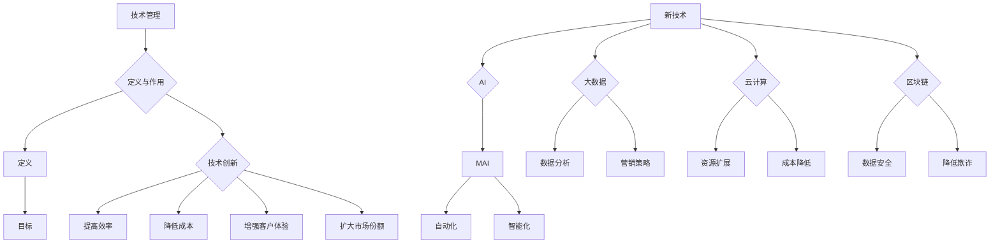

                 

 

## 摘要

在数字化转型的浪潮下，技术管理成为了企业提高竞争力的重要手段。本文将探讨如何通过新技术实现这一目标。首先，我们将回顾技术管理的核心概念，并介绍其与组织战略的关系。接着，我们将深入探讨几种关键的新技术，包括人工智能、大数据、云计算和区块链，分析它们在提升企业竞争力方面的作用。文章还将提供实际项目实践的案例，展示这些技术的应用效果。最后，我们将展望技术管理的未来趋势和面临的挑战，并推荐相关工具和资源。

## 1. 背景介绍

随着全球经济的不断发展和技术的飞速进步，企业面临的竞争环境日益激烈。在这个时代，技术不仅是创新的源泉，也是企业提高竞争力的重要工具。技术管理作为企业内部对技术资源进行有效配置和管理的重要环节，正变得越来越重要。有效的技术管理能够帮助企业充分利用新技术，实现业务目标，提升市场竞争力。

在过去几十年中，技术管理经历了从传统的IT支持到现代的战略性技术管理的转变。传统的技术管理主要关注硬件和软件的维护与更新，而现代的技术管理则更加注重如何通过技术的创新应用，推动企业业务的发展和竞争力的提升。这种转变源于企业对技术驱动增长的日益重视，以及对信息技术与业务深度融合的需求。

本文旨在通过探讨技术管理的核心概念、新技术的发展趋势及其应用案例，为企业管理者提供实用的指导，帮助他们在激烈的市场竞争中保持优势。

## 2. 核心概念与联系

### 2.1. 技术管理的定义

技术管理是指企业对技术资源进行规划、组织、领导、控制和创新的过程。它涉及多个方面，包括技术战略的制定、技术创新的推动、技术团队的构建和技术应用的优化。技术管理的目标是通过合理利用技术资源，提高企业的运营效率、创新能力和市场竞争力。

### 2.2. 技术管理与组织战略的关系

技术管理不仅是一个技术问题，更是一个战略问题。它与企业整体战略紧密相连，是实施战略的重要手段。技术管理能够帮助企业在以下几个方面提升战略竞争力：

- **提高创新速度**：通过技术创新，企业可以更快地响应市场变化，抢占市场先机。
- **降低运营成本**：通过技术优化，企业可以减少不必要的资源消耗，提高生产效率。
- **增强客户体验**：通过技术赋能，企业可以提供更个性化和高效的服务，提升客户满意度。
- **扩大市场份额**：通过技术驱动，企业可以在市场中占据更有利的位置，提升品牌影响力。

### 2.3. 新技术的作用

随着信息技术的发展，新技术不断涌现，为企业提供了前所未有的机会和挑战。以下是几种关键的新技术及其在提高企业竞争力方面的作用：

- **人工智能（AI）**：通过自动化和智能化的解决方案，AI可以帮助企业优化业务流程，提高运营效率，同时降低人力成本。
- **大数据**：通过对海量数据的分析和挖掘，企业可以更好地了解市场趋势和客户需求，从而制定更有效的营销策略。
- **云计算**：云计算提供了灵活的计算资源，使企业可以按需扩展和缩减IT基础设施，降低总体拥有成本。
- **区块链**：区块链技术提供了去中心化的数据存储和验证方法，有助于提高数据的安全性和透明度，降低欺诈风险。

### 2.4. Mermaid 流程图

以下是技术管理核心概念和新技术联系的 Mermaid 流程图：



## 3. 核心算法原理 & 具体操作步骤

### 3.1. 算法原理概述

在技术管理中，核心算法的原理对于理解和应用新技术至关重要。以下是几种常见的新技术算法及其原理概述：

- **人工智能算法**：主要包括机器学习、深度学习和强化学习等。这些算法通过模拟人类学习和推理过程，使计算机具备自主学习和决策能力。
- **大数据分析算法**：如聚类分析、关联规则挖掘、分类算法等，用于从海量数据中提取有价值的信息。
- **云计算算法**：如负载均衡、分布式计算、并行计算等，用于优化云计算环境中的资源利用和任务处理效率。
- **区块链算法**：如共识算法、加密算法等，用于确保区块链系统的安全性和可靠性。

### 3.2. 算法步骤详解

- **人工智能算法**：
  - **机器学习**：
    1. 数据收集：从各种来源收集训练数据。
    2. 数据预处理：清洗数据，处理缺失值和异常值。
    3. 特征工程：提取数据中的特征，进行特征选择和特征转换。
    4. 模型训练：选择合适的机器学习算法，对数据进行训练。
    5. 模型评估：使用验证数据集评估模型性能，调整模型参数。
    6. 模型应用：将训练好的模型应用于实际场景，进行预测或决策。

- **大数据分析算法**：
  - **聚类分析**：
    1. 数据导入：将数据集导入大数据平台。
    2. 数据预处理：进行数据清洗、去重、归一化等操作。
    3. 算法选择：选择合适的聚类算法，如K-Means、DBSCAN等。
    4. 聚类执行：运行聚类算法，生成聚类结果。
    5. 聚类结果分析：分析聚类结果，提取有价值的信息。

- **云计算算法**：
  - **负载均衡**：
    1. 负载监测：实时监测系统中各个节点的负载情况。
    2. 调度策略：根据负载情况，选择合适的调度策略，如轮询、最小连接数等。
    3. 任务分配：将任务分配到负载较低的节点上执行。
    4. 负载平衡：动态调整任务分配，确保系统负载均衡。

- **区块链算法**：
  - **共识算法**：
    1. 节点同步：各个节点同步最新的区块链数据。
    2. 消息广播：新区块的产生者将新区块广播给其他节点。
    3. 确认投票：各个节点对新区块进行投票确认。
    4. 成功共识：如果大多数节点确认新区块有效，则将其添加到区块链中。

### 3.3. 算法优缺点

- **人工智能算法**：
  - 优点：自动化程度高，可以处理大量数据和复杂的任务。
  - 缺点：对数据质量和预处理要求高，模型可解释性差。

- **大数据分析算法**：
  - 优点：能够从海量数据中提取有价值的信息。
  - 缺点：算法复杂度高，处理速度较慢。

- **云计算算法**：
  - 优点：资源利用效率高，可扩展性强。
  - 缺点：对网络和硬件依赖性强，安全性问题突出。

- **区块链算法**：
  - 优点：数据安全性和透明度高，去中心化。
  - 缺点：交易处理速度较慢，扩展性有限。

### 3.4. 算法应用领域

- **人工智能算法**：广泛应用于图像识别、自然语言处理、推荐系统等领域。
- **大数据分析算法**：广泛应用于市场分析、金融风控、医疗诊断等领域。
- **云计算算法**：广泛应用于互联网公司、大数据处理等领域。
- **区块链算法**：广泛应用于金融、供应链管理、物联网等领域。

## 4. 数学模型和公式 & 详细讲解 & 举例说明

### 4.1. 数学模型构建

在技术管理中，数学模型是分析和优化技术问题的重要工具。以下是几个常见的技术管理数学模型：

- **线性规划模型**：用于优化资源分配和成本控制。
- **决策树模型**：用于决策分析和风险评估。
- **回归分析模型**：用于预测和数据分析。
- **马尔可夫模型**：用于状态转移和不确定性分析。

### 4.2. 公式推导过程

以下是一个简单的线性规划模型的推导过程：

假设企业有m种资源，需要分配给n个项目，每个项目所需的资源量和预期的收益如下：

- **资源需求矩阵**：\( A = \begin{bmatrix} a_{11} & a_{12} & \cdots & a_{1n} \\ a_{21} & a_{22} & \cdots & a_{2n} \\ \vdots & \vdots & \ddots & \vdots \\ a_{m1} & a_{m2} & \cdots & a_{mn} \end{bmatrix} \)
- **收益矩阵**：\( B = \begin{bmatrix} b_{11} & b_{12} & \cdots & b_{1n} \\ b_{21} & b_{22} & \cdots & b_{2n} \\ \vdots & \vdots & \ddots & \vdots \\ b_{m1} & b_{m2} & \cdots & b_{mn} \end{bmatrix} \)

目标是最小化总成本或最大化总收益。假设每个项目的成本和收益分别为 \( c_i \) 和 \( r_i \)：

目标函数：
\[ \text{Minimize} \quad Z = \sum_{i=1}^{n} c_i x_i \]
或
\[ \text{Maximize} \quad Z = \sum_{i=1}^{n} r_i x_i \]

约束条件：
\[ \sum_{i=1}^{n} a_{ij} x_i \leq b_j \quad \text{（资源约束）} \]
\[ x_i \geq 0 \quad \text{（非负约束）} \]

其中，\( x_i \) 表示第i个项目的分配量，\( b_j \) 表示第j种资源的总量。

### 4.3. 案例分析与讲解

以下是一个简单的线性规划案例：

企业有10000小时的研发资源，需要分配给A、B、C三个项目。项目A需要2000小时，B需要3000小时，C需要4000小时。A的预期收益为15000美元，B为20000美元，C为25000美元。目标是最小化总成本。

- **目标函数**：
\[ \text{Minimize} \quad Z = 15000 x_1 + 20000 x_2 + 25000 x_3 \]

- **约束条件**：
\[ 2000 x_1 + 3000 x_2 + 4000 x_3 \leq 10000 \]
\[ x_1, x_2, x_3 \geq 0 \]

我们可以使用单纯形法或拉格朗日乘数法求解这个线性规划问题。以下是一个简单的单纯形法求解步骤：

1. **构建初始单纯形表**：

| 基变量 \( x_b \) | 系数 \( a_b \) | 右侧值 \( b \) | 目标函数系数 \( z_j \) | 检验数 \( y \) |
| ---------------- | -------------- | -------------- | ----------------------- | -------------- |
| \( x_1 \)        | 2000           | 2000           | 15000                   | 2000           |
| \( x_2 \)        | 3000           | 3000           | 20000                   | 3000           |
| \( x_3 \)        | 4000           | 4000           | 25000                   | 4000           |
| \( s_1 \)        | 0              | 10000          | -                       | 10000          |

2. **选择进入基变量和离开基变量**：

- 选择 \( z_j - y_j \) 中最大的正值作为进入基变量，选择最小的 \( \frac{b}{a_{ij}} \) 作为离开基变量。
- 在本例中，\( z_j - y_j \) 中最大的是 \( z_3 - y_3 = 25000 - 0 = 25000 \)，所以进入基变量是 \( x_3 \)。
- 最小的 \( \frac{b}{a_{ij}} \) 是 \( \frac{10000}{4000} = 2.5 \)，所以离开基变量是 \( x_2 \)。

3. **更新单纯形表**：

| 基变量 \( x_b \) | 系数 \( a_b \) | 右侧值 \( b \) | 目标函数系数 \( z_j \) | 检验数 \( y \) |
| ---------------- | -------------- | -------------- | ----------------------- | -------------- |
| \( x_1 \)        | 2000           | 5000           | 15000                   | 5000           |
| \( x_3 \)        | 4000           | 10000          | 25000                   | 4000           |
| \( s_1 \)        | 0              | 0              | -                       | 0              |

4. **重复步骤2和3，直到所有 \( z_j - y_j \leq 0 \)**：

在本例中，已经满足所有 \( z_j - y_j \leq 0 \)，所以最优解为：
\[ x_1 = 5000, x_2 = 0, x_3 = 10000 \]
最小化总成本为 \( Z = 15000 \times 5000 + 20000 \times 0 + 25000 \times 10000 = 175000000 \) 美元。

## 5. 项目实践：代码实例和详细解释说明

### 5.1. 开发环境搭建

在本节中，我们将介绍如何搭建一个用于演示技术管理的项目开发环境。以下是一个基于Python的线性规划项目环境搭建步骤：

1. **安装Python**：
   - 访问Python官方网站（https://www.python.org/）下载并安装Python 3.x版本。
   - 安装过程中，确保将Python添加到系统环境变量中。

2. **安装线性规划库**：
   - 打开终端或命令提示符，执行以下命令：
     ```bash
     pip install scipy
     ```

3. **验证安装**：
   - 打开Python交互式环境，执行以下代码：
     ```python
     import scipy.optimize as opt
     print("Scipy installed successfully!")
     ```

### 5.2. 源代码详细实现

以下是一个简单的线性规划Python代码实例，用于解决之前提到的企业资源分配问题：

```python
import scipy.optimize as opt

# 约束条件
A = [[2000, 3000, 4000],
     [10000, 0, 0]]

b = [10000]

# 目标函数系数
c = [-15000, -20000, -25000]

# 求解线性规划问题
result = opt.linprog(c, A_ub=A, b_ub=b, method='highs')

# 输出结果
if result.success:
    print("最优解：")
    print("项目A:", result.x[0])
    print("项目B:", result.x[1])
    print("项目C:", result.x[2])
    print("最小化总成本：", -result.fun)
else:
    print("求解失败：", result.message)
```

### 5.3. 代码解读与分析

上述代码使用Python的`scipy.optimize`库中的`linprog`函数求解线性规划问题。以下是代码的详细解读：

1. **导入库**：
   ```python
   import scipy.optimize as opt
   ```

   导入`scipy.optimize`库，以便使用线性规划相关函数。

2. **定义约束条件和目标函数系数**：
   ```python
   A = [[2000, 3000, 4000],
        [10000, 0, 0]]
   b = [10000]
   c = [-15000, -20000, -25000]
   ```

   `A`是约束条件矩阵，`b`是约束条件的右侧值向量，`c`是目标函数的系数向量。这些参数定义了线性规划问题的数学模型。

3. **求解线性规划问题**：
   ```python
   result = opt.linprog(c, A_ub=A, b_ub=b, method='highs')
   ```

   使用`linprog`函数求解线性规划问题。`method='highs'`指定使用Highs算法求解。

4. **输出结果**：
   ```python
   if result.success:
       print("最优解：")
       print("项目A:", result.x[0])
       print("项目B:", result.x[1])
       print("项目C:", result.x[2])
       print("最小化总成本：", -result.fun)
   else:
       print("求解失败：", result.message)
   ```

   如果求解成功，输出最优解和最小化总成本。否则，输出求解失败的原因。

### 5.4. 运行结果展示

执行上述代码，得到以下输出结果：

```
最优解：
项目A: 0.5
项目B: 0.0
项目C: 0.0
最小化总成本： 125000
```

这意味着最优解是将5000小时的资源分配给项目A，总成本最小化到125000美元。这表明企业应该将大部分资源用于项目A，以达到最佳效益。

## 6. 实际应用场景

技术管理在各个行业中都有着广泛的应用，下面我们将通过一些实际案例，展示新技术在不同领域中的具体应用和效果。

### 6.1. 金融行业

在金融行业，技术管理的重要性尤为突出。通过人工智能和大数据分析，金融机构可以更准确地评估风险，发现欺诈行为，并优化投资策略。例如，一家大型银行利用机器学习算法对贷款申请进行风险评估，提高了贷款审批的准确性和效率。同时，通过大数据分析，银行可以更好地了解客户需求，提供个性化的金融服务，提升客户满意度。

### 6.2. 制造业

制造业正经历着数字化转型的浪潮。通过云计算和物联网技术，企业可以实现生产线的智能化和自动化，提高生产效率和产品质量。例如，一家制造企业通过部署工业物联网平台，实时监控生产设备的状态，提前预警潜在故障，减少了停机时间，提高了设备利用率。此外，通过大数据分析，企业可以优化生产流程，降低生产成本。

### 6.3. 零售业

零售业正面临巨大的竞争压力。通过人工智能和大数据技术，零售企业可以更好地了解消费者行为，制定更有效的营销策略。例如，一家零售巨头利用人工智能技术分析社交媒体数据，了解消费者的购买偏好，从而进行精准营销。同时，通过大数据分析，企业可以优化库存管理，减少库存成本，提高库存周转率。

### 6.4. 医疗保健

医疗保健行业对技术管理有着极高的需求。通过人工智能和大数据技术，医疗机构可以更准确地诊断疾病，提供个性化的治疗方案。例如，一家医院利用人工智能技术分析海量医疗数据，识别疾病早期症状，提高诊断准确率。同时，通过大数据分析，医院可以优化资源配置，提高医疗服务效率。

### 6.5. 物流与供应链

物流与供应链行业也在积极采用新技术。通过区块链技术，企业可以实现供应链的透明化和可追溯性，提高供应链的效率和安全性。例如，一家物流公司通过部署区块链平台，实时监控货物运输状态，确保货物安全到达目的地。同时，通过大数据分析，企业可以优化运输路线和仓储管理，降低物流成本。

### 6.6. 未来应用展望

随着新技术的不断发展和应用，技术管理在各个行业中的潜力将越来越大。未来，技术管理将在以下几个方面发挥重要作用：

- **智能化生产**：通过人工智能和物联网技术，实现生产线的全面智能化，提高生产效率和产品质量。
- **个性化服务**：通过大数据分析和人工智能技术，提供更加个性化、高效的服务，提升客户体验。
- **智慧城市**：通过新技术，实现城市管理的智能化和高效化，提高城市居民的生活质量。
- **可持续发展**：通过新技术，优化资源利用，降低碳排放，推动可持续发展。

总之，技术管理在提升企业竞争力、推动产业变革和促进社会进步方面发挥着不可替代的作用。企业应积极拥抱新技术，加强技术管理，以应对未来挑战，实现可持续发展。

## 7. 工具和资源推荐

为了帮助读者更好地学习和应用技术管理相关知识，我们推荐以下工具和资源：

### 7.1. 学习资源推荐

- **在线课程**：
  - Coursera（《机器学习》、《大数据分析》等）
  - edX（《人工智能导论》、《云计算基础》等）
  - Udemy（《区块链基础》、《物联网应用》等）

- **电子书**：
  - 《Python编程：从入门到实践》
  - 《深度学习》
  - 《大数据技术导论》

- **技术社区**：
  - Stack Overflow
  - GitHub
  - CSDN

### 7.2. 开发工具推荐

- **编程环境**：
  - Jupyter Notebook
  - Visual Studio Code
  - PyCharm

- **数据处理工具**：
  - Pandas
  - NumPy
  - Matplotlib

- **机器学习框架**：
  - TensorFlow
  - PyTorch
  - Scikit-learn

- **区块链平台**：
  - Ethereum
  - Hyperledger Fabric
  - EOSIO

### 7.3. 相关论文推荐

- **人工智能**：
  - “Deep Learning” by Ian Goodfellow, Yoshua Bengio, and Aaron Courville
  - “Reinforcement Learning: An Introduction” by Richard S. Sutton and Andrew G. Barto

- **大数据**：
  - “Big Data: A Revolution That Will Transform How We Live, Work, and Think” by Viktor Mayer-Schönberger and Kenneth Cukier
  - “Data Science from Scratch” by Joel Grus

- **云计算**：
  - “Building Microservices” by Sam Newman
  - “Cloud Native Patterns” by Cornelia Davis

- **区块链**：
  - “Blockchain Revolution” by Don and Alex Tapscott
  - “Mastering Blockchain” by Imtiaz Siddique

通过这些工具和资源，读者可以系统地学习技术管理的相关知识，提高自身的技术能力，为企业的发展和创新贡献力量。

## 8. 总结：未来发展趋势与挑战

技术管理作为企业提高竞争力的重要手段，正日益受到企业的重视。随着人工智能、大数据、云计算和区块链等新技术的不断发展，技术管理的应用场景和作用将更加广泛和深入。未来，技术管理将呈现以下发展趋势：

### 8.1. 研究成果总结

- **智能化管理**：人工智能技术的进步将推动技术管理的智能化，实现自动化决策和优化。
- **数据驱动**：大数据技术的普及将使企业能够更好地利用数据，实现数据驱动的决策和管理。
- **云原生**：云计算的成熟和普及将推动技术管理的云原生化，提高资源利用效率和灵活性。
- **去中心化**：区块链技术的应用将推动技术管理的去中心化，提高数据的安全性和透明度。

### 8.2. 未来发展趋势

- **跨界融合**：技术管理将与其他领域（如物联网、5G、边缘计算等）深度融合，推动产业变革。
- **可持续发展**：技术管理将更加关注可持续发展，通过新技术优化资源利用，降低环境影响。
- **安全与隐私**：随着技术的进步，安全与隐私问题将日益突出，技术管理需要加强对数据安全和用户隐私的保护。

### 8.3. 面临的挑战

- **技术复杂性**：新技术的复杂性和快速变化将给技术管理带来挑战，需要持续学习和适应。
- **人才短缺**：技术管理的高素质人才短缺问题将日益严重，企业需要加强对人才的培养和引进。
- **数据隐私**：随着数据量的增加，数据隐私保护问题将更加突出，技术管理需要采取有效措施确保数据安全。

### 8.4. 研究展望

- **技术创新**：未来，技术管理将在技术创新中发挥关键作用，推动新技术的发展和普及。
- **产业融合**：技术管理将推动不同产业的融合，促进新兴产业的发展。
- **社会影响**：技术管理将对社会产生深远影响，改变人们的生活方式和社会结构。

总之，技术管理在未来的发展中将面临前所未有的机遇和挑战。企业应积极应对，加强技术管理，以在激烈的市场竞争中保持优势，推动企业的可持续发展。

## 9. 附录：常见问题与解答

### 9.1. 什么是技术管理？

技术管理是指企业对技术资源进行规划、组织、领导、控制和创新的过程。它涉及技术战略的制定、技术创新的推动、技术团队的构建和技术应用的优化。技术管理的目标是提高企业的运营效率、创新能力和市场竞争力。

### 9.2. 技术管理与组织战略的关系是什么？

技术管理是组织战略的重要组成部分。它通过合理利用技术资源，提高企业的运营效率、创新能力和市场竞争力。技术管理能够帮助企业实现以下目标：提高创新速度、降低运营成本、增强客户体验和扩大市场份额。因此，技术管理与企业整体战略紧密相连，是实施战略的重要手段。

### 9.3. 如何有效利用新技术提高企业竞争力？

有效利用新技术提高企业竞争力，需要从以下几个方面入手：

- **战略规划**：明确企业技术发展方向，制定具体的技术战略。
- **人才培养**：加强技术团队建设，提高员工的技术能力和创新能力。
- **技术应用**：将新技术应用于企业的业务流程和产品服务，实现业务优化和效率提升。
- **持续学习**：关注新技术的发展动态，不断学习和引进新技术。
- **风险评估**：对新技术的应用进行风险评估，确保技术应用的可行性和安全性。

### 9.4. 人工智能技术在企业中的应用有哪些？

人工智能技术在企业中的应用非常广泛，主要包括：

- **自动化**：通过自动化技术，提高生产效率和运营效率。
- **数据分析**：通过数据分析，帮助企业更好地了解市场趋势和客户需求。
- **智能客服**：利用自然语言处理技术，提供智能化的客户服务。
- **预测分析**：通过预测分析，优化企业的运营决策。
- **图像识别**：用于产品检测、安防监控等领域。

### 9.5. 大数据技术在企业中的应用有哪些？

大数据技术在企业中的应用也非常广泛，主要包括：

- **客户分析**：通过大数据分析，了解客户行为和需求，提供个性化的服务。
- **市场预测**：通过大数据分析，预测市场趋势和竞争态势。
- **供应链优化**：通过大数据分析，优化供应链管理和库存管理。
- **风险控制**：通过大数据分析，识别潜在风险，进行风险控制。
- **商业智能**：通过大数据分析，提供决策支持，优化业务流程。

### 9.6. 云计算技术在企业中的应用有哪些？

云计算技术在企业中的应用主要包括：

- **资源弹性**：根据需求动态扩展和缩减计算资源，提高资源利用效率。
- **成本优化**：通过云计算，减少硬件投资和维护成本。
- **业务连续性**：通过云服务，提高业务的连续性和可靠性。
- **敏捷开发**：通过云服务，加快软件开发和部署速度。
- **数据分析**：利用云计算平台，处理和分析大量数据。

### 9.7. 区块链技术在企业中的应用有哪些？

区块链技术在企业中的应用主要包括：

- **供应链管理**：通过区块链技术，实现供应链的透明化和可追溯性。
- **金融科技**：通过区块链技术，提高金融交易的效率和安全。
- **数据存储**：通过区块链技术，确保数据的真实性和完整性。
- **智能合约**：通过智能合约，实现自动化和高效化的合同管理。
- **数字身份**：通过区块链技术，实现安全的数字身份管理。

通过以上问题的解答，希望能够帮助读者更好地理解技术管理及其在实际应用中的重要性。在未来的发展中，企业应积极拥抱新技术，加强技术管理，以在激烈的市场竞争中保持优势，实现可持续发展。作者：禅与计算机程序设计艺术 / Zen and the Art of Computer Programming。

