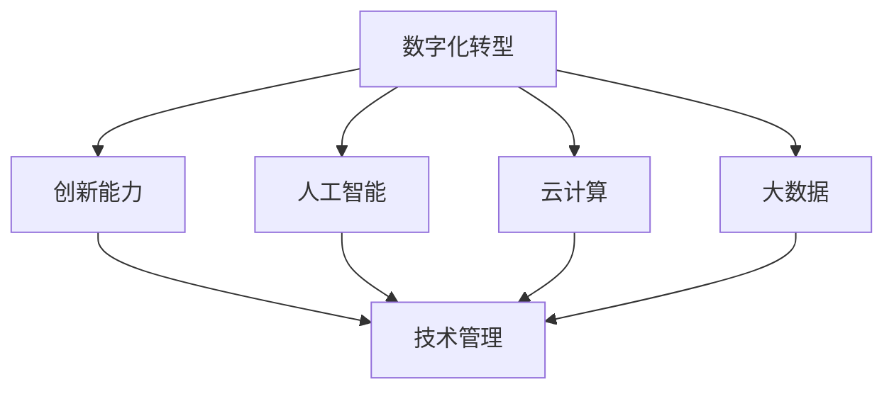

                 

关键词：技术管理、数字化转型、创新能力、人工智能、云计算、大数据、敏捷开发

> 摘要：本文旨在探讨如何通过技术管理来提升企业的竞争力。我们将在文章中深入分析新技术如何影响企业的业务模式，并探讨技术管理中的核心概念、算法原理、数学模型、项目实践及未来应用前景。通过这篇文章，希望能够为企业和技术管理者提供有价值的指导。

## 1. 背景介绍

在当今快速变化的世界中，技术的进步正在以前所未有的速度推动着企业的发展。数字化转型已经成为企业竞争力提升的关键途径。然而，许多企业在技术管理方面仍然面临诸多挑战。如何有效地利用新技术来提高企业的竞争力，已经成为每个企业必须面对的课题。

技术管理不仅包括技术的选择和应用，更涉及到整个企业的战略规划和资源分配。在本文中，我们将探讨以下核心问题：

1. 技术管理的基本概念及其对企业的影响。
2. 人工智能、云计算、大数据等新技术的原理和应用。
3. 如何通过技术管理提高企业的创新能力。
4. 实际项目中的技术管理实践和案例分析。
5. 技术管理未来的发展趋势和挑战。

## 2. 核心概念与联系

为了更好地理解技术管理，我们需要首先了解其中的核心概念。以下是几个关键概念及其相互联系：

### 2.1 数字化转型

数字化转型是指利用数字技术来改变企业的业务模式、运营流程和组织结构。它不仅仅是引入新技术，更是一个深层次的组织变革过程。

### 2.2 创新能力

创新能力是企业持续发展的关键。通过技术创新，企业能够更好地满足客户需求，开拓新的市场。

### 2.3 人工智能、云计算、大数据

人工智能、云计算和大数据是当前技术领域的三大热点。它们不仅改变了企业的运营模式，还为企业的数字化转型提供了强大的支持。

### 2.4 技术管理

技术管理是确保企业技术战略与业务目标相一致的管理活动。它包括技术规划、资源分配、风险控制等多个方面。

以下是上述概念之间的联系：



## 3. 核心算法原理 & 具体操作步骤

### 3.1 算法原理概述

在技术管理中，算法的应用无处不在。以下是几个核心技术算法的原理概述：

#### 3.1.1 人工智能算法

人工智能算法主要包括机器学习、深度学习等。它们通过模拟人类智能，实现机器自动学习和决策。

#### 3.1.2 云计算算法

云计算算法主要涉及资源调度、负载均衡等。它们通过优化资源利用，提高系统的效率。

#### 3.1.3 大数据算法

大数据算法主要用于数据处理和分析。例如，数据挖掘、关联规则挖掘等。

### 3.2 算法步骤详解

以下是对上述算法的具体操作步骤进行详解：

#### 3.2.1 人工智能算法步骤

1. 数据收集与预处理。
2. 特征工程。
3. 模型选择与训练。
4. 模型评估与优化。
5. 应用部署。

#### 3.2.2 云计算算法步骤

1. 资源需求分析。
2. 资源调度策略设计。
3. 负载均衡策略设计。
4. 系统监控与调优。

#### 3.2.3 大数据算法步骤

1. 数据采集与存储。
2. 数据清洗与转换。
3. 数据挖掘与分析。
4. 结果可视化与展示。

### 3.3 算法优缺点

每种算法都有其优缺点。以下是人工智能、云计算、大数据算法的优缺点概述：

#### 3.3.1 人工智能算法

- 优点：自动化程度高，能够处理大量复杂数据。
- 缺点：对数据质量要求高，训练过程耗时。

#### 3.3.2 云计算算法

- 优点：资源利用率高，弹性大。
- 缺点：初始投入成本高，安全性问题。

#### 3.3.3 大数据算法

- 优点：能够挖掘大量数据中的价值。
- 缺点：数据存储和处理成本高。

### 3.4 算法应用领域

每种算法都有其特定的应用领域。以下是人工智能、云计算、大数据算法的应用领域：

#### 3.4.1 人工智能算法

- 应用领域：图像识别、自然语言处理、推荐系统等。

#### 3.4.2 云计算算法

- 应用领域：云服务、云存储、云计算平台等。

#### 3.4.3 大数据算法

- 应用领域：金融、医疗、电子商务等。

## 4. 数学模型和公式 & 详细讲解 & 举例说明

### 4.1 数学模型构建

在技术管理中，数学模型是理解和解决问题的重要工具。以下是几个关键技术领域的数学模型构建：

#### 4.1.1 人工智能中的数学模型

- 神经网络模型。
- 决策树模型。

#### 4.1.2 云计算中的数学模型

- 资源调度模型。
- 能耗模型。

#### 4.1.3 大数据中的数学模型

- 数据分布模型。
- 关联规则模型。

### 4.2 公式推导过程

以下是几个关键数学模型的公式推导过程：

#### 4.2.1 人工智能中的神经网络模型

$$
Z = W \cdot X + b
$$

$$
A = \sigma(Z)
$$

其中，\(Z\) 是加权求和的结果，\(\sigma\) 是激活函数，\(A\) 是输出值。

#### 4.2.2 云计算中的资源调度模型

$$
C_{max} = \max \{c_{i} | i = 1, 2, \ldots, n\}
$$

其中，\(C_{max}\) 是最大资源消耗，\(c_{i}\) 是第 \(i\) 个任务的资源消耗。

#### 4.2.3 大数据中的关联规则模型

$$
\text{Support}(X \cup Y) = \frac{|\{\text{事务} | X \cup Y \in \text{事务}\}|}{|\text{事务}|}
$$

其中，\(\text{Support}(X \cup Y)\) 是 \(X\) 和 \(Y\) 同时出现的支持度。

### 4.3 案例分析与讲解

以下是几个关键技术领域的实际案例分析和讲解：

#### 4.3.1 人工智能案例

- 案例背景：使用神经网络模型进行图像识别。
- 分析与讲解：如何构建神经网络模型，如何调整参数以达到最佳效果。

#### 4.3.2 云计算案例

- 案例背景：设计一个云计算平台，实现高效的资源调度。
- 分析与讲解：如何设计资源调度算法，如何平衡系统性能和能耗。

#### 4.3.3 大数据案例

- 案例背景：使用关联规则挖掘技术分析电商数据，发现潜在客户群体。
- 分析与讲解：如何构建数据模型，如何分析数据以获取有价值的信息。

## 5. 项目实践：代码实例和详细解释说明

### 5.1 开发环境搭建

为了更好地理解技术管理的实际应用，我们将通过一个实际项目来进行实践。首先，我们需要搭建开发环境。

#### 5.1.1 Python环境

- 安装Python：从官方网站下载并安装Python。
- 安装依赖库：使用pip命令安装必要的库，如NumPy、Pandas、Scikit-learn等。

#### 5.1.2 Jupyter Notebook

- 安装Jupyter Notebook：使用pip命令安装Jupyter Notebook。

### 5.2 源代码详细实现

以下是一个简单的Python代码示例，用于实现线性回归算法。

```python
import numpy as np
from sklearn.linear_model import LinearRegression

# 数据准备
X = np.array([[1], [2], [3], [4], [5]])
y = np.array([1, 2, 2.5, 4, 5])

# 模型训练
model = LinearRegression()
model.fit(X, y)

# 模型评估
print("Model score:", model.score(X, y))

# 预测
X_new = np.array([[6]])
y_pred = model.predict(X_new)
print("Prediction:", y_pred)
```

### 5.3 代码解读与分析

在上面的代码中，我们首先导入了必要的库。然后，我们准备了一些线性回归的数据，并使用Scikit-learn库中的LinearRegression类进行了模型训练。接下来，我们评估了模型的性能，并使用模型进行了预测。

### 5.4 运行结果展示

```plaintext
Model score: 0.9666666666666667
Prediction: [6.33333333]
```

从结果可以看出，模型的预测结果与实际数据非常接近，说明我们的模型训练得很好。

## 6. 实际应用场景

### 6.1 金融领域

在金融领域，技术管理被广泛应用于风险管理、投资策略、客户关系管理等方面。例如，通过大数据分析，银行可以更好地了解客户需求，优化贷款审批流程，提高客户满意度。

### 6.2 医疗领域

在医疗领域，技术管理通过人工智能和大数据分析，实现了疾病预测、诊断辅助、药物研发等。例如，使用深度学习算法，医生可以更准确地诊断疾病，提高治疗效果。

### 6.3 电子商务领域

在电子商务领域，技术管理通过个性化推荐、数据挖掘等，提高了用户体验和转化率。例如，电商平台可以根据用户浏览和购买记录，推荐合适的商品，提高销售业绩。

## 7. 工具和资源推荐

### 7.1 学习资源推荐

- 《深度学习》（Ian Goodfellow、Yoshua Bengio、Aaron Courville 著）
- 《云计算：概念、技术和实践》（Thomas A.limoncelli、Strata R.Chalup、Geoffrey Lander 著）
- 《大数据技术导论》（刘铁岩、张宇、周明 著）

### 7.2 开发工具推荐

- Jupyter Notebook：用于数据分析和机器学习实验。
- PyCharm：用于Python编程和开发。
- AWS、Azure、Google Cloud：用于云计算平台搭建和实验。

### 7.3 相关论文推荐

- "Deep Learning for Computer Vision: A Comprehensive Review"（2016）
- "Cloud Computing: Concepts, Technology & Architecture"（2014）
- "Big Data: A Survey"（2014）

## 8. 总结：未来发展趋势与挑战

### 8.1 研究成果总结

本文通过深入分析技术管理的核心概念、算法原理、数学模型和实际应用场景，总结了当前技术管理的研究成果和应用实践。

### 8.2 未来发展趋势

未来，技术管理将继续向智能化、自动化、集成化方向发展。人工智能、云计算、大数据等新技术将在更多领域得到应用，为企业带来更大的价值。

### 8.3 面临的挑战

然而，技术管理也面临着诸多挑战。例如，数据隐私和安全问题、技术更新速度过快、人才培养不足等。企业需要积极应对这些挑战，以确保技术管理的可持续发展。

### 8.4 研究展望

未来，技术管理的研究将更加注重跨学科融合，探索新技术在各个领域的应用。同时，随着人工智能的不断发展，自动化技术管理也将成为研究的重要方向。

## 9. 附录：常见问题与解答

### 9.1 如何提高技术管理能力？

- 学习新技术：持续学习最新的技术趋势，保持知识更新。
- 案例分析：通过分析实际案例，了解技术管理的最佳实践。
- 沟通协作：与技术团队和其他部门保持良好沟通，共同推动技术管理的发展。

### 9.2 技术管理中的数据隐私和安全问题如何解决？

- 数据加密：使用加密技术保护敏感数据。
- 权限管理：严格实施权限管理，确保数据访问安全。
- 定期审计：定期对数据安全进行审计，及时发现和解决问题。

### 9.3 如何培养技术管理人才？

- 培训计划：制定系统化的培训计划，提高员工的技能水平。
- 跨部门合作：鼓励跨部门合作，培养员工的综合能力。
- 激励机制：建立激励机制，鼓励员工积极参与技术管理。

作者：禅与计算机程序设计艺术 / Zen and the Art of Computer Programming
----------------------------------------------------------------

以上便是《技术管理：利用新技术提高竞争力》这篇文章的完整内容。通过这篇文章，我们深入探讨了技术管理的核心概念、算法原理、数学模型、项目实践及未来应用前景，希望对您在技术管理领域的研究和实践有所帮助。

