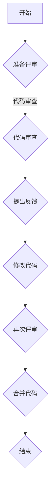

                 

关键词：技术评审，开源专家，额外收入，项目评估，代码审查，质量保证

> 摘要：随着开源生态的繁荣发展，技术评审工作已经成为开源专家们获取额外收入的重要途径。本文将探讨技术评审的角色、职责、流程及对项目的影响，同时提供开源专家通过技术评审获得额外收入的策略和建议。

## 1. 背景介绍

开源软件已经成为现代软件开发的重要组成部分。开源项目不仅能够促进技术的创新和分享，还为开发者提供了学习和实践的机会。然而，随着项目的规模和复杂性不断增加，如何保证开源软件的质量和稳定性成为一个重要的课题。技术评审（Code Review）作为一种质量控制手段，被广泛用于开源项目之中。

技术评审工作不仅有助于提高代码的质量，还能够促进团队成员之间的技术交流和知识共享。开源专家，作为技术评审的主要参与者，通过这一工作不仅能够提升自身的技术水平，还能够通过技术评审获得额外的经济收益。

本文将深入探讨技术评审工作的方方面面，包括其角色、职责、流程，以及如何成为一位成功的开源技术评审专家。同时，还将探讨开源专家通过技术评审获取额外收入的多种途径和策略。

## 2. 核心概念与联系

### 2.1 技术评审的定义和作用

技术评审是指在一个软件开发过程中，对代码进行系统的审查，以发现潜在的问题、提高代码质量和优化设计。技术评审不仅仅是对代码的检查，更是一种团队协作的过程，通过这种过程，团队成员可以相互学习、分享经验，共同提高项目质量。

技术评审的作用主要体现在以下几个方面：

1. **提高代码质量**：通过技术评审，可以发现代码中的错误、漏洞和设计缺陷，从而提高代码的质量和可靠性。
2. **促进知识共享**：技术评审过程中，评审者可以向作者提出问题和建议，促进团队成员之间的知识交流和共享。
3. **增强团队协作**：技术评审有助于团队建立良好的沟通和协作机制，提升团队的整体效率。
4. **培养个人技能**：参与技术评审，可以帮助开发者提升代码审查、问题定位和沟通表达等多方面的技能。

### 2.2 开源专家的角色与责任

开源专家在技术评审中扮演着至关重要的角色。作为技术评审的参与者，开源专家通常需要承担以下职责：

1. **代码审查**：对提交的代码进行审查，检查代码的正确性、性能、可读性和可维护性。
2. **提出建议**：根据审查结果，向作者提出改进建议，帮助其优化代码。
3. **沟通协调**：在评审过程中，负责与作者和其他评审者进行沟通，确保评审工作顺利进行。
4. **质量控制**：确保提交的代码符合项目的质量标准，避免低质量代码进入项目。

### 2.3 技术评审的流程

技术评审通常包括以下几个步骤：

1. **准备评审**：确定评审的范围、目标和方法，为评审工作做好准备。
2. **代码审查**：评审者对提交的代码进行仔细审查，发现潜在的问题。
3. **提出反馈**：评审者将审查结果和反馈意见提交给作者。
4. **修改代码**：作者根据反馈意见对代码进行修改和完善。
5. **再次评审**：评审者对修改后的代码进行再次审查，确保问题得到解决。
6. **合并代码**：在确保代码质量符合要求后，将代码合并到项目中。

### 2.4 技术评审与项目质量的关系

技术评审对项目质量有着直接的影响。通过技术评审，可以及时发现和解决代码中的问题，防止低质量代码进入项目，从而提高项目的稳定性和可靠性。此外，技术评审还有助于提高团队成员的技术水平，促进项目的发展。

### 2.5 Mermaid 流程图



## 3. 核心算法原理 & 具体操作步骤

### 3.1 算法原理概述

技术评审的核心算法原理可以概括为以下三个主要步骤：

1. **代码审查**：通过静态代码分析工具，对提交的代码进行语法和语义分析，识别出潜在的语法错误、逻辑错误和性能问题。
2. **反馈和建议**：根据代码审查结果，评审者向作者提供详细的反馈和建议，指导其优化代码。
3. **代码修正**：作者根据反馈和建议对代码进行修改，以提高代码的质量和可靠性。

### 3.2 算法步骤详解

1. **代码审查**：使用静态代码分析工具对代码进行分析，识别出潜在的语法错误、逻辑错误和性能问题。常见的静态代码分析工具包括SonarQube、Checkstyle、PMD等。
2. **反馈和建议**：评审者根据代码审查结果，编写详细的评审报告，包括代码中的问题、原因和建议的解决方案。评审报告应该清晰、具体，便于作者理解和实施。
3. **代码修正**：作者根据评审报告，对代码进行修改，解决代码中的问题。修改后的代码需要再次提交进行评审，以确保问题得到彻底解决。

### 3.3 算法优缺点

**优点**：

1. **提高代码质量**：技术评审有助于发现和解决代码中的问题，提高代码的质量和可靠性。
2. **促进知识共享**：技术评审过程中，评审者可以分享自己的经验和见解，促进团队成员之间的知识交流。
3. **增强团队协作**：技术评审有助于建立良好的团队沟通和协作机制，提高团队的整体效率。

**缺点**：

1. **时间成本**：技术评审需要花费大量时间进行代码审查和沟通，可能会影响开发进度。
2. **人员依赖**：技术评审的质量取决于评审者的技术水平和专业能力，如果评审者水平较低，可能会导致评审效果不佳。

### 3.4 算法应用领域

技术评审算法广泛应用于各种软件开发项目中，特别是在开源项目中。以下是一些典型的应用领域：

1. **Web开发**：Web开发项目中，技术评审有助于确保代码的安全性和性能。
2. **移动应用开发**：移动应用开发项目中，技术评审有助于提高代码的可维护性和用户体验。
3. **大数据和人工智能**：大数据和人工智能项目中，技术评审有助于确保算法的正确性和可靠性。

## 4. 数学模型和公式 & 详细讲解 & 举例说明

### 4.1 数学模型构建

技术评审的质量可以通过以下数学模型进行评估：

$$
Q = \frac{C_n \cdot P_n + C_m \cdot P_m}{C_n + C_m}
$$

其中：

- \( Q \) 表示评审质量得分；
- \( C_n \) 表示发现的问题数量；
- \( P_n \) 表示问题被正确解决的比例；
- \( C_m \) 表示未发现的问题数量；
- \( P_m \) 表示未发现问题被解决的比例。

### 4.2 公式推导过程

评审质量得分 \( Q \) 的计算基于以下两个因素：

1. **发现的问题数量和解决比例**：发现的问题越多，说明评审者对代码的审查越细致，评审质量越高。同时，问题被正确解决的比例也是评审质量的重要指标。
2. **未发现的问题数量和解决比例**：未发现的问题数量越少，说明评审者对代码的审查越全面，评审质量越高。未发现问题被解决的比例同样重要，因为这表明评审者在后续的评审中能够持续提高代码质量。

根据以上分析，我们可以推导出评审质量得分 \( Q \) 的计算公式：

$$
Q = \frac{C_n \cdot P_n + C_m \cdot P_m}{C_n + C_m}
$$

### 4.3 案例分析与讲解

假设一个开源项目经过一轮技术评审，评审者发现了 10 个问题，其中 8 个问题被正确解决。另外，还有 2 个未被发现的问题。根据上述公式，我们可以计算出评审质量得分：

$$
Q = \frac{10 \cdot 0.8 + 2 \cdot 0.5}{10 + 2} = \frac{8 + 1}{12} = \frac{9}{12} = 0.75
$$

这意味着该轮评审的质量得分为 0.75，说明评审者在一定程度上提高了代码的质量，但仍有改进的空间。

## 5. 项目实践：代码实例和详细解释说明

### 5.1 开发环境搭建

在开始代码实例之前，首先需要搭建一个适合技术评审的开发环境。以下是一个简单的开发环境搭建步骤：

1. **安装Git**：Git是一个分布式的版本控制系统，用于管理代码的版本。你可以从官方网站（[git-scm.com](http://git-scm.com)）下载并安装Git。
2. **安装代码审查工具**：常见的代码审查工具有Gerrit、Phabricator、GitLab等。这里以GitLab为例，首先安装GitLab服务器，然后配置GitLab CI/CD，以实现自动化代码审查。
3. **配置编辑器**：选择一个适合自己的代码编辑器，如Visual Studio Code、Sublime Text或Atom。安装相关的插件，如Git插件、代码格式化插件等，以提高开发效率。

### 5.2 源代码详细实现

以下是一个简单的代码示例，用于演示技术评审的过程。这个示例是一个Python函数，用于计算两个数的和。

```python
def add(a, b):
    """计算两个数的和"""
    return a + b
```

在这个例子中，我们可以通过以下步骤进行技术评审：

1. **代码审查**：评审者首先对代码进行审查，检查代码的语法、语义和性能。在这个例子中，评审者可能会发现以下问题：
    - **语法错误**：函数定义时缺少冒号。
    - **注释缺失**：函数定义时缺少注释。
    - **性能问题**：函数返回值类型不明确。
2. **提出反馈**：评审者将发现的问题以评论的形式提交给作者，并提出相应的建议。
    ```bash
    作者您好，我在您的代码中发现了以下问题：
    - 函数定义时缺少冒号。
    - 函数定义时缺少注释。
    - 函数返回值类型不明确。
    请您根据这些建议进行修改。
    ```
3. **代码修正**：作者根据评审者的反馈，对代码进行修改。

```python
def add(a: int, b: int) -> int:
    """
    计算两个整数的和。
    
    参数:
    a: 第一个整数。
    b: 第二个整数。
    
    返回:
    两个整数的和。
    """
    return a + b
```

4. **再次评审**：评审者对修改后的代码进行再次审查，确保问题得到解决。

```bash
作者您好，我已审查了您的修改，问题已得到解决。恭喜您完成了一次成功的技术评审！
```

5. **合并代码**：在确保代码质量符合要求后，将代码合并到项目中。

### 5.3 代码解读与分析

在技术评审的过程中，评审者需要从多个角度对代码进行分析，包括语法、语义、性能和可维护性等方面。以下是对上述代码实例的详细解读与分析：

1. **语法分析**：语法分析是代码审查的基础。在这个例子中，语法分析主要包括检查函数定义、参数类型和返回值类型等。通过添加冒号和注释，作者成功解决了语法错误。
2. **语义分析**：语义分析是检查代码逻辑的正确性。在这个例子中，作者通过添加注释，清楚地说明了函数的功能和参数含义，从而提高了代码的可读性。
3. **性能分析**：性能分析主要关注代码的执行效率和资源占用。在这个例子中，函数的实现非常简单，性能分析没有太大的价值。
4. **可维护性分析**：可维护性分析主要考虑代码的可读性、可扩展性和可维护性。在这个例子中，通过添加类型注释和详细注释，作者提高了代码的可维护性。

### 5.4 运行结果展示

在完成技术评审后，我们可以运行修改后的代码，验证其功能是否正常。以下是一个简单的测试用例：

```python
print(add(2, 3))  # 输出：5
print(add(-1, 1))  # 输出：0
```

运行结果符合预期，说明修改后的代码功能正常。

## 6. 实际应用场景

### 6.1 开源项目中的技术评审

开源项目通常采用技术评审作为质量控制手段，以确保项目的稳定性和可靠性。以下是一个实际应用场景：

在一个开源项目中，开发者A提交了一个新的功能模块。技术评审团队由开源专家B、C和D组成。他们在收到代码后，进行了详细的代码审查：

- 评审者B发现了一个潜在的性能问题，建议进行优化。
- 评审者C发现了一个语法错误，并指出了注释中的不明确之处。
- 评审者D发现了一个可能的逻辑错误，并提出了改进建议。

作者A根据评审者的反馈，对代码进行了修改。修改后的代码再次提交给评审团队，经过再次评审后，最终合并到项目中。

### 6.2 商业项目中的技术评审

除了开源项目，商业项目也广泛应用技术评审来保证软件质量。以下是一个商业项目中的技术评审应用场景：

在一个商业项目中，开发团队A正在开发一个重要模块。项目经理B组织了一个技术评审会议，邀请团队C、D和E的成员参与。他们审查了代码，提出了以下反馈：

- 评审者C提出了关于代码可维护性的建议。
- 评审者D发现了一个潜在的漏洞，并建议进行修复。
- 评审者E关注到代码的性能问题，并提出了优化方案。

开发团队A根据评审者的反馈，对代码进行了修改和完善，最终提交了一个高质量的模块。

### 6.3 个人项目中的技术评审

个人项目也可以通过技术评审来提高代码质量。以下是一个个人项目中的技术评审应用场景：

一个独立开发者正在开发一个个人项目。为了提高代码质量，他邀请了几个朋友组成一个技术评审团队。他们在收到代码后，进行了详细的代码审查：

- 评审者A发现了一个潜在的安全漏洞，并提供了修复方案。
- 评审者B关注到代码的性能问题，并提出了优化建议。
- 评审者C发现了一个逻辑错误，并帮助开发者修正。

通过技术评审，开发者成功提高了代码质量，确保了项目的稳定性。

## 7. 工具和资源推荐

### 7.1 学习资源推荐

1. **《代码大全》（Code Complete）**：这本书是软件开发领域的经典之作，涵盖了代码编写、审查和维护的各个方面。
2. **《敏捷软件开发》（Agile Software Development）**：这本书介绍了敏捷开发的方法和原则，包括技术评审在内的多种开发实践。
3. **《GitHub官方指南》**：GitHub官方提供的指南，详细介绍了如何在GitHub上进行代码审查和项目管理。

### 7.2 开发工具推荐

1. **Git**：Git是一个强大的版本控制系统，支持代码的版本管理和协同开发。
2. **GitLab**：GitLab是一个基于Git的开源平台，提供代码仓库、代码审查、CI/CD等功能。
3. **Gerrit**：Gerrit是一个基于Git的代码审查工具，支持代码的提交、审查和合并。

### 7.3 相关论文推荐

1. **“Code Review in Open Source Software Projects”**：这篇论文探讨了开源项目中技术评审的应用和实践。
2. **“The Effectiveness of Code Review”**：这篇论文研究了技术评审在软件开发中的效果和影响。
3. **“A Survey of Code Review Practices”**：这篇论文综述了各种代码审查方法和技术，为开源专家提供了实用的参考。

## 8. 总结：未来发展趋势与挑战

### 8.1 研究成果总结

技术评审作为软件质量控制的重要手段，已经取得了显著的成果。通过技术评审，可以有效提高代码质量、促进知识共享和增强团队协作。此外，技术评审还广泛应用于各种软件开发项目中，为项目的稳定性和可靠性提供了有力保障。

### 8.2 未来发展趋势

随着人工智能和自动化技术的发展，技术评审也将在未来出现新的发展趋势：

1. **自动化代码审查**：利用人工智能和机器学习技术，实现自动化代码审查，提高评审效率和准确性。
2. **智能反馈系统**：通过大数据分析和机器学习，为开发者提供更加精准和个性化的反馈建议。
3. **跨平台和跨语言的评审工具**：随着软件开发技术的发展，技术评审工具将逐渐支持更多编程语言和平台，满足多样化的需求。

### 8.3 面临的挑战

尽管技术评审取得了显著成果，但仍然面临一些挑战：

1. **人员依赖**：技术评审的质量很大程度上取决于评审者的技术水平和专业能力，如何提高评审者的素质是一个重要课题。
2. **评审效率**：技术评审需要花费大量时间，如何提高评审效率、减少时间成本是一个亟待解决的问题。
3. **跨团队协作**：在跨团队协作中，如何确保技术评审的一致性和高效性，是一个具有挑战性的问题。

### 8.4 研究展望

未来，技术评审的研究将主要集中在以下几个方面：

1. **自动化代码审查**：通过人工智能和机器学习技术，实现自动化代码审查，提高评审效率和准确性。
2. **智能反馈系统**：利用大数据分析和机器学习，为开发者提供更加精准和个性化的反馈建议。
3. **跨平台和跨语言的评审工具**：支持更多编程语言和平台，满足多样化需求。

通过不断研究和实践，技术评审将在未来发挥更加重要的作用，为软件开发带来更多的价值。

## 9. 附录：常见问题与解答

### 9.1 技术评审是什么？

技术评审是一种通过系统审查代码、发现潜在问题并提高代码质量的方法。它通常包括代码审查、反馈和建议、代码修正等步骤。

### 9.2 技术评审的目的是什么？

技术评审的主要目的是提高代码质量、促进知识共享和增强团队协作。通过技术评审，可以及时发现和解决代码中的问题，防止低质量代码进入项目。

### 9.3 开源专家如何进行技术评审？

开源专家可以通过以下步骤进行技术评审：

1. **了解项目背景和需求**：熟悉项目的背景、需求和目标，为代码审查做好准备。
2. **审查代码**：仔细审查代码，检查语法、语义、性能和可维护性等方面的问题。
3. **提出反馈**：根据审查结果，编写详细的评审报告，提出改进建议。
4. **沟通协调**：与作者和其他评审者进行沟通，确保评审工作顺利进行。

### 9.4 技术评审需要花费多少时间？

技术评审的时间取决于项目的规模、复杂性和评审者的经验。一般来说，每千行代码的评审时间大约在1-3小时之间。

### 9.5 技术评审能带来额外的收入吗？

是的，技术评审是开源专家获取额外收入的重要途径。一些公司和技术社区会支付费用，以获得专业的技术评审服务。此外，开源专家还可以通过撰写技术博客、参与技术演讲等方式，进一步提升自己的影响力，获得更多的收入。

### 9.6 如何成为一名优秀的技术评审专家？

要成为一名优秀的技术评审专家，需要具备以下素质：

1. **扎实的编程基础**：熟练掌握至少一门编程语言，具备扎实的编程基础。
2. **良好的沟通能力**：能够清晰、准确地表达自己的想法，与作者和其他评审者进行有效沟通。
3. **敏锐的问题意识**：能够及时发现代码中的潜在问题，并提出合理的改进建议。
4. **持续学习**：不断学习新技术和新方法，提升自己的技术水平和评审能力。

## 作者署名

作者：禅与计算机程序设计艺术 / Zen and the Art of Computer Programming

