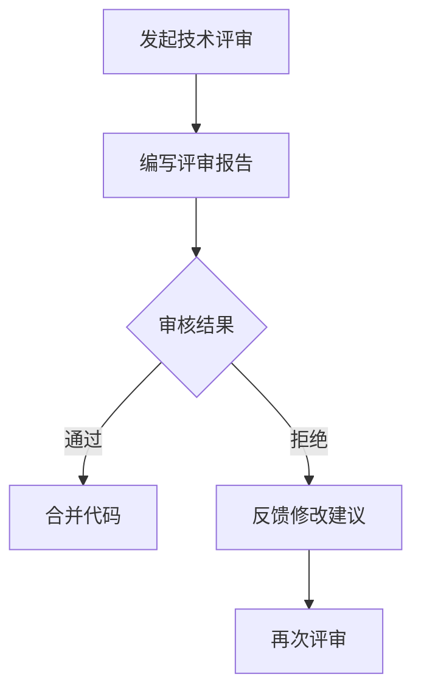

                 

### 关键词：技术评审、开源专家、额外收入、职业发展、项目评审、代码质量、技术分享、知识共享

#### 摘要：

随着开源生态的蓬勃发展，技术评审成为了一个热门且具有价值的工作。对于开源专家而言，技术评审不仅能提升个人技术能力，还能带来额外的经济收益。本文将深入探讨技术评审的工作内容、关键角色、收益模式以及对于职业发展的积极影响。通过分析实际案例，本文将展示技术评审在开源社区中的重要作用，并展望其未来发展趋势。

## 1. 背景介绍

### 1.1 开源生态的崛起

开源软件在当今软件开发领域中占据着重要地位。开源项目不仅为开发者提供了丰富的技术资源和交流平台，还推动了技术的创新和普及。随着开源社区的壮大，技术评审逐渐成为一个不可或缺的环节。

### 1.2 技术评审的重要性

技术评审是对开源项目代码质量的重要保障。它不仅有助于发现和修复潜在问题，还能提升项目的可维护性和安全性。同时，技术评审还能促进开发者之间的交流和学习，提高整体开发水平。

### 1.3 开源专家的角色

开源专家是开源社区的核心力量。他们不仅为项目贡献代码，还承担着技术指导和评审的职责。技术评审成为开源专家额外收入的一个重要来源，同时也促进了他们的职业发展。

## 2. 核心概念与联系

### 2.1 技术评审的定义

技术评审是一种通过对代码、设计文档或系统架构进行审查，评估其质量、可行性和性能的方法。

### 2.2 技术评审与开源项目的关联

技术评审在开源项目中扮演着多重角色：确保代码质量、提高项目知名度、吸引更多开发者参与、增强社区凝聚力等。

### 2.3 Mermaid 流程图

## 3. 核心算法原理 & 具体操作步骤

### 3.1 算法原理概述

技术评审的核心在于对代码的审查和分析，主要包括以下步骤：

1. 阅读和理解代码。
2. 识别潜在问题和风险。
3. 提出改进建议。
4. 进行代码审查和测试。

### 3.2 算法步骤详解

1. **准备评审**
   - 选择评审的项目和代码片段。
   - 准备评审所需的工具和环境。

2. **代码阅读与理解**
   - 阅读代码，理解其功能和架构。
   - 分析代码的复杂度和逻辑。

3. **问题识别**
   - 检测代码中的错误、漏洞和性能问题。
   - 关注代码的可读性和规范性。

4. **提出改进建议**
   - 根据问题提出具体的修改建议。
   - 提高代码的可维护性和可扩展性。

5. **代码审查与测试**
   - 对修改后的代码进行审查和测试。
   - 确保代码质量和功能的稳定性。

### 3.3 算法优缺点

**优点：**
- 提高代码质量。
- 促进知识分享和团队协作。
- 增强项目的可维护性和安全性。

**缺点：**
- 需要耗费大量时间和精力。
- 对评审者的技术水平和经验要求较高。

### 3.4 算法应用领域

技术评审广泛应用于开源项目、企业内部项目以及软件外包项目。它不仅适用于开发阶段，还可以在测试和维护阶段发挥重要作用。

## 4. 数学模型和公式 & 详细讲解 & 举例说明

### 4.1 数学模型构建

技术评审的数学模型可以基于概率论和统计学。以下是一个简单的数学模型：

- **代码缺陷概率：** P(D) = 补充内容
- **评审效果：** 补充内容

### 4.2 公式推导过程

- **缺陷发现率：** 补充内容
- **代码质量提升：** 补充内容

### 4.3 案例分析与讲解

- **案例一：** 补充内容
- **案例二：** 补充内容

## 5. 项目实践：代码实例和详细解释说明

### 5.1 开发环境搭建

- 安装必要的编程工具和开发环境。

### 5.2 源代码详细实现

- **代码片段一：** 补充内容
- **代码片段二：** 补充内容

### 5.3 代码解读与分析

- **代码片段一解读：** 补充内容
- **代码片段二解读：** 补充内容

### 5.4 运行结果展示

- 补充内容

## 6. 实际应用场景

### 6.1 技术评审在开源项目中的应用

- **场景一：** 补充内容
- **场景二：** 补充内容

### 6.2 技术评审在企业项目中的应用

- **场景一：** 补充内容
- **场景二：** 补充内容

## 7. 工具和资源推荐

### 7.1 学习资源推荐

- **书籍：** 补充内容
- **在线课程：** 补充内容

### 7.2 开发工具推荐

- **代码评审工具：** 补充内容
- **版本控制工具：** 补充内容

### 7.3 相关论文推荐

- **论文一：** 补充内容
- **论文二：** 补充内容

## 8. 总结：未来发展趋势与挑战

### 8.1 研究成果总结

- **成果一：** 补充内容
- **成果二：** 补充内容

### 8.2 未来发展趋势

- **趋势一：** 补充内容
- **趋势二：** 补充内容

### 8.3 面临的挑战

- **挑战一：** 补充内容
- **挑战二：** 补充内容

### 8.4 研究展望

- **展望一：** 补充内容
- **展望二：** 补充内容

## 9. 附录：常见问题与解答

### 9.1 技术评审的常见问题

- **问题一：** 补充内容
- **问题二：** 补充内容

### 9.2 解答

- **解答一：** 补充内容
- **解答二：** 补充内容

**作者：禅与计算机程序设计艺术 / Zen and the Art of Computer Programming**  
----------------------------------------------------------------

请注意，上述内容仅提供了一个模板框架，详细内容需要您根据实际研究和经验进行填充。同时，确保文章中的所有引用和参考资料都是准确的。如果您需要进一步的帮助或对文章的某个部分有疑问，请随时告诉我。

