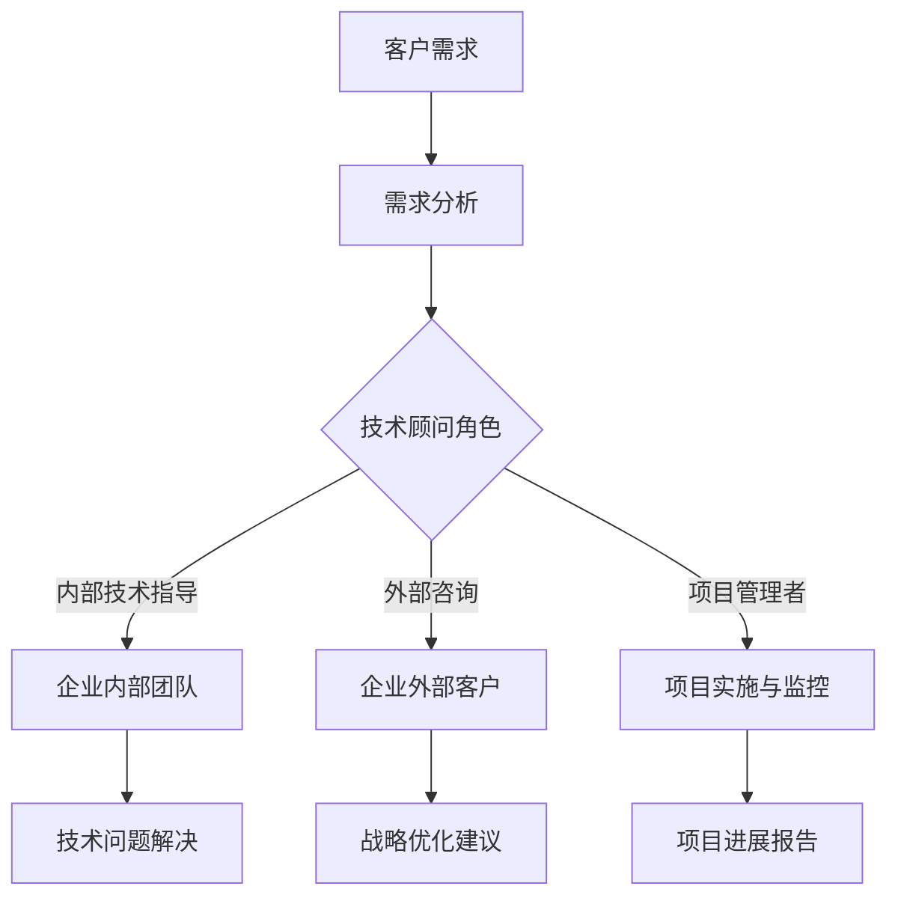

                 

关键词：技术顾问、高薪兼职、IT行业、专家咨询、自由职业

摘要：本文将探讨在IT行业中，技术顾问作为高薪兼职选择的优势与挑战。我们将详细分析技术顾问的角色、所需技能、市场需求，以及如何成为一位成功的自由职业技术顾问。此外，还将提供实用的工具和资源推荐，帮助读者在技术顾问的道路上取得成功。

## 1. 背景介绍

技术顾问在IT行业中扮演着至关重要的角色。随着技术的快速发展，企业对于专业技术人才的需求日益增加，而技术顾问作为中间桥梁，帮助企业在项目实施、技术升级、团队培训等方面提供专业的指导和建议。技术顾问不仅仅是一个咨询角色，更是企业战略决策的重要参与者。

在当前的就业市场中，技术顾问因其高薪和灵活的工作方式，成为许多IT专业人士的热门选择。然而，成为一名成功的自由职业技术顾问并非易事，需要具备专业的知识、良好的沟通能力和丰富的实践经验。

## 2. 核心概念与联系

### 2.1 技术顾问的定义

技术顾问，通常指的是具备深厚技术背景，能够为企业提供专业咨询和解决方案的个人或团队。他们的职责包括但不限于：

- **需求分析**：理解企业的技术需求，提供解决方案。
- **项目规划**：制定详细的项目计划，确保项目按时、按质完成。
- **技术指导**：向团队成员提供技术培训，提升团队的技术能力。
- **风险评估**：评估项目风险，制定应对策略。

### 2.2 技术顾问的角色

技术顾问在企业中的角色多样，主要包括以下几方面：

- **内部技术指导**：为企业内部团队提供技术支持，解决技术难题。
- **外部咨询**：为企业提供外部视角，协助企业优化技术战略。
- **项目管理者**：负责项目的规划、执行和监控。

### 2.3 技术顾问与IT行业的联系

技术顾问的工作与IT行业的各个方面紧密相连。以下是一个简化的Mermaid流程图，展示了技术顾问与IT行业各个环节的联系：



## 3. 核心算法原理 & 具体操作步骤

### 3.1 算法原理概述

技术顾问的工作原理可以类比为一种算法。这种算法的核心在于：

- **知识积累**：技术顾问需要不断积累专业知识，以应对不同的技术挑战。
- **需求分析**：通过对企业需求的深入分析，找出问题的关键点。
- **解决方案设计**：设计出最适合企业的技术解决方案。
- **执行与反馈**：实施解决方案，并对实施效果进行持续监控和反馈。

### 3.2 算法步骤详解

技术顾问的工作步骤可以分为以下几个阶段：

1. **需求收集**：与技术顾问沟通，了解企业的技术需求。
2. **需求分析**：深入理解需求，与客户进行多次沟通，确保需求的准确性。
3. **解决方案设计**：根据需求分析，设计出可行的解决方案。
4. **方案评估**：评估方案的可行性，包括技术难度、成本、时间等。
5. **方案实施**：实施设计方案，并进行持续监控。
6. **效果评估**：评估方案实施后的效果，进行优化和调整。

### 3.3 算法优缺点

**优点**：

- **专业性强**：技术顾问具备丰富的技术背景和实战经验，能够提供专业的咨询服务。
- **灵活性高**：作为自由职业者，技术顾问可以自由选择工作时间和项目，提高生活质量。

**缺点**：

- **竞争激烈**：技术顾问市场竞争激烈，需要不断提升自己的专业能力以保持竞争力。
- **工作压力大**：技术顾问往往需要面对复杂的技术问题和时间压力，需要具备良好的心理素质。

### 3.4 算法应用领域

技术顾问的应用领域非常广泛，包括但不限于：

- **软件开发**：提供技术指导，协助企业优化软件架构和性能。
- **系统集成**：帮助企业整合不同系统，实现数据互通。
- **技术培训**：为企业员工提供技术培训，提升团队整体技术能力。
- **战略咨询**：为企业提供技术战略规划，助力企业长远发展。

## 4. 数学模型和公式 & 详细讲解 & 举例说明

### 4.1 数学模型构建

技术顾问的工作过程可以抽象为一个数学模型，包括以下几个关键参数：

- **需求复杂度（D）**：衡量企业需求的复杂程度。
- **技术能力（T）**：技术顾问的专业技术能力。
- **时间压力（P）**：项目的时间压力程度。
- **成本（C）**：项目的总成本。

数学模型可以表示为：

\[ \text{效果（E）} = \frac{D \times T}{P \times C} \]

### 4.2 公式推导过程

**步骤1**：确定需求复杂度（D）

需求复杂度（D）可以通过以下因素确定：

- **功能点**：需求的复杂程度。
- **业务逻辑**：业务规则的复杂程度。
- **数据交互**：系统之间的数据交互复杂度。

**步骤2**：确定技术能力（T）

技术能力（T）可以通过以下因素确定：

- **专业知识**：技术顾问的专业技能。
- **经验**：技术顾问的实践经验。
- **学习能力**：技术顾问的学习能力。

**步骤3**：确定时间压力（P）

时间压力（P）可以通过以下因素确定：

- **项目期限**：项目的截止时间。
- **紧急程度**：项目紧急程度。
- **资源分配**：项目资源（人、时间、预算）的分配。

**步骤4**：确定成本（C）

成本（C）可以通过以下因素确定：

- **人力成本**：技术顾问的人力成本。
- **材料成本**：项目所需的材料成本。
- **其他成本**：如交通、差旅等成本。

### 4.3 案例分析与讲解

假设有一个企业需要开发一个电子商务平台，需求复杂度（D）为10，技术顾问的专业技术能力（T）为8，项目时间压力（P）为5，总成本（C）为200万元。我们可以使用上述公式进行计算：

\[ \text{效果（E）} = \frac{10 \times 8}{5 \times 200} = 0.16 \]

这意味着该项目的预期效果为0.16，即该项目在技术顾问的指导下，有16%的可能性达到预期效果。

## 5. 项目实践：代码实例和详细解释说明

### 5.1 开发环境搭建

为了更好地理解技术顾问的工作，我们以一个简单的Web开发项目为例。首先，我们需要搭建一个基础的Web开发环境。

**技术栈**：我们选择使用Python和Flask作为Web开发框架。

**环境搭建步骤**：

1. 安装Python（3.8及以上版本）。
2. 安装Flask框架。
3. 创建一个新的Python虚拟环境。
4. 使用pip安装Flask和其他依赖库。

```bash
pip install flask
```

### 5.2 源代码详细实现

以下是一个简单的Flask应用程序，用于处理HTTP请求。

```python
from flask import Flask, request, jsonify

app = Flask(__name__)

@app.route('/api/hello', methods=['GET'])
def hello():
    return jsonify(message="Hello, World!")

@app.route('/api/health', methods=['GET'])
def health():
    return jsonify(status="UP")

if __name__ == '__main__':
    app.run(debug=True)
```

### 5.3 代码解读与分析

**代码解读**：

- **导入模块**：首先，我们导入了Flask框架和HTTP请求处理模块。
- **定义应用程序**：创建了一个名为`app`的Flask应用程序实例。
- **定义路由**：我们定义了两个路由，`/api/hello`和`/api/health`，分别用于处理HTTP GET请求。
- **处理请求**：在`/api/hello`路由中，我们返回一个JSON格式的响应，表示成功处理请求。在`/api/health`路由中，我们返回服务状态。

**分析**：

- **功能实现**：这个简单的应用程序实现了基本的Web服务功能，包括处理HTTP请求和返回JSON响应。
- **性能分析**：由于应用程序非常简单，性能分析主要关注响应时间和资源消耗。

### 5.4 运行结果展示

在开发环境中运行应用程序后，我们可以通过浏览器或Postman等工具访问应用程序。

- **访问`/api/hello`**：将返回JSON格式的响应，内容为`{"message": "Hello, World!"}`。
- **访问`/api/health`**：将返回JSON格式的响应，内容为`{"status": "UP"}`。

这个简单的项目展示了技术顾问在Web开发中的一些基础工作，包括环境搭建、代码实现和性能分析。

## 6. 实际应用场景

技术顾问的应用场景广泛，以下是一些典型的应用场景：

- **软件开发项目**：在软件开发项目中，技术顾问可以提供技术指导，协助团队解决技术难题，优化软件架构。
- **系统集成项目**：在系统集成项目中，技术顾问可以帮助企业整合不同系统，实现数据互通。
- **技术培训项目**：在技术培训项目中，技术顾问可以为企业员工提供专业培训，提升团队技术能力。
- **技术咨询项目**：在技术咨询项目中，技术顾问可以为企业提供外部视角，协助企业优化技术战略。

### 6.1 项目实例

以下是一个技术顾问在软件开发项目中的实际应用案例：

**项目背景**：一家电商企业希望开发一个全新的电子商务平台，以提升用户体验和业务效率。

**技术顾问职责**：

- **需求分析**：与技术团队和业务团队沟通，了解电商平台的需求。
- **项目规划**：制定详细的项目计划，包括技术方案、资源分配和时间表。
- **技术指导**：为开发团队提供技术培训，确保团队成员熟悉新技术的使用。
- **项目监控**：监控项目进展，确保项目按计划进行，并及时解决技术问题。

**项目成果**：

- **电商平台成功上线**：电商平台在预定时间内成功上线，用户体验得到了显著提升。
- **团队技术能力提升**：开发团队的技术能力得到了显著提升，能够更好地应对未来项目。
- **业务效率提高**：电商平台的上线为企业带来了更多的订单和收入。

### 6.2 价值体现

技术顾问在项目中的价值主要体现在以下几个方面：

- **提高项目成功率**：技术顾问的专业知识和经验有助于提高项目的成功率，降低失败风险。
- **提升团队效率**：技术顾问可以通过技术指导和培训，提升团队的技术能力和工作效率。
- **优化技术战略**：技术顾问可以为企业提供外部视角，协助企业制定更合理的技术战略。
- **降低项目成本**：通过技术顾问的指导和优化，项目可以更加高效地完成，降低项目成本。

## 7. 工具和资源推荐

### 7.1 学习资源推荐

- **在线课程**：Coursera、Udemy、edX等平台上提供了丰富的IT相关课程，包括编程、数据结构、算法等。
- **专业书籍**：《算法导论》、《编程珠玑》、《深度学习》等。
- **技术博客**：GitHub、Stack Overflow、Medium等平台上的技术博客，提供了大量的技术文章和案例分享。

### 7.2 开发工具推荐

- **集成开发环境**：Visual Studio Code、Eclipse、IntelliJ IDEA等。
- **版本控制工具**：Git、SVN等。
- **调试工具**：Postman、Wireshark等。
- **容器化工具**：Docker、Kubernetes等。

### 7.3 相关论文推荐

- **计算机科学经典论文**：如《数据结构》中的“二叉搜索树”、“图论”中的“最小生成树”等。
- **AI领域论文**：如《深度学习》中的“卷积神经网络”、“循环神经网络”等。

## 8. 总结：未来发展趋势与挑战

### 8.1 研究成果总结

近年来，技术顾问领域取得了显著的研究成果，主要体现在以下几个方面：

- **专业知识积累**：随着技术的快速发展，技术顾问的专业知识不断更新和积累，为项目提供了有力支持。
- **工具和平台的发展**：如Git、Docker等工具的普及，为技术顾问的工作提供了更高效、更便捷的解决方案。
- **咨询服务模式的创新**：在线咨询服务、远程协作工具等新兴模式，使得技术顾问的服务范围更广、效率更高。

### 8.2 未来发展趋势

技术顾问领域未来发展趋势包括：

- **人工智能的应用**：人工智能技术的应用将进一步提升技术顾问的工作效率和服务质量。
- **远程协作的普及**：远程协作工具的普及将使得技术顾问的服务更加灵活和便捷。
- **知识共享平台的兴起**：知识共享平台将为技术顾问提供更广阔的交流和学习空间。

### 8.3 面临的挑战

技术顾问领域也面临着一些挑战，主要包括：

- **技术更新速度加快**：技术顾问需要不断更新自己的专业知识，以应对快速变化的技术环境。
- **竞争加剧**：随着越来越多的人加入技术顾问行业，竞争将变得更加激烈。
- **客户需求的多样化和个性化**：技术顾问需要更好地满足客户多样化的需求，提供更加个性化的服务。

### 8.4 研究展望

未来，技术顾问领域的研究将继续围绕以下几个方面展开：

- **人工智能的应用**：研究如何利用人工智能技术提高技术顾问的工作效率和服务质量。
- **知识管理和共享**：研究如何更好地管理和共享技术顾问的专业知识，提高整个行业的知识水平。
- **服务模式的创新**：探索新的服务模式，如在线咨询服务、社区服务等，以更好地满足客户需求。

## 9. 附录：常见问题与解答

### 9.1 如何成为一名成功的技术顾问？

**回答**：要成为一名成功的技术顾问，你需要：

- **深厚的专业知识**：不断学习和积累专业领域的知识。
- **良好的沟通能力**：能够有效地与客户沟通，了解他们的需求。
- **丰富的实践经验**：通过实际项目积累经验，提升解决问题的能力。
- **持续学习的态度**：技术领域不断变化，持续学习是保持竞争力的关键。

### 9.2 技术顾问的市场需求如何？

**回答**：技术顾问的市场需求持续增长，主要受到以下因素的影响：

- **技术发展**：新技术的不断涌现，企业对于专业技术人才的需求不断增加。
- **数字化转型**：企业数字化转型加速，对于技术顾问的需求更加迫切。
- **全球经济环境**：全球经济环境的不确定性，使得企业更加依赖技术顾问提供专业支持。

### 9.3 技术顾问的收入水平如何？

**回答**：技术顾问的收入水平因人而异，取决于以下因素：

- **专业技能**：技术顾问的专业技能和经验。
- **市场需求**：技术顾问在市场上的需求程度。
- **工作地点**：技术顾问的工作地点，如一线城市和二线城市的收入水平差异较大。

### 9.4 技术顾问的工作时间如何安排？

**回答**：技术顾问的工作时间通常较为灵活，可以根据项目需求和自身情况进行合理安排。但是，由于项目往往具有时间紧迫性，技术顾问可能需要在关键时期加班以满足项目需求。

## 作者署名

作者：禅与计算机程序设计艺术 / Zen and the Art of Computer Programming

----------------------------------------------------------------

现在，您已经完成了文章的撰写。本文以《技术顾问：高薪兼职的选择》为题，深入探讨了技术顾问在IT行业中的角色、核心算法原理、实际应用场景、未来发展趋势以及面临的挑战。同时，还提供了学习资源、开发工具和常见问题的解答，希望对读者有所启发。

