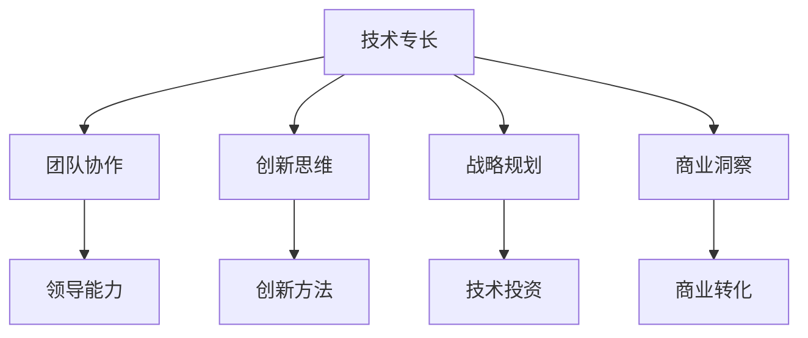

                 

关键词：技术领导力、价值提升、团队协作、创新思维、管理艺术

在当今快速变化的技术领域中，技术领导力作为一种关键的能力，不仅关乎个人的职业生涯发展，更直接影响着整个团队乃至组织的成功。技术领导力不仅仅是技术能力的高度体现，更是对团队管理、创新思维、战略规划和业务理解等多方面能力的综合考量。本文旨在探讨技术领导力的核心概念、关键要素及其在提升组织价值中的重要作用。

> 摘要：
技术领导力是一种独特的领导风格，它将技术专长与领导艺术相结合，旨在通过引领团队不断创新和优化技术解决方案，从而提升组织的整体价值和竞争力。本文将分析技术领导力的核心概念，探讨其在团队协作、战略规划和业务理解等方面的具体应用，并提供一系列实用的工具和资源，帮助读者在职业生涯中提升自身的技术领导力。

## 1. 背景介绍

随着互联网、大数据、人工智能等技术的迅猛发展，技术已成为推动企业进步和创新的核心动力。技术领导力作为一种新型的领导力模式，逐渐成为企业成功的关键因素。技术领导者不仅需要具备深厚的技术背景和专业知识，还需要具备卓越的领导能力和商业洞察力。他们需要在复杂多变的技术环境中引领团队，确保技术方案的可行性和创新性，同时将技术优势转化为实际的商业价值。

技术领导力的兴起不仅源于技术发展的需求，还受到了全球化、信息化和知识经济等外部环境的影响。在这样一个充满变革的时代，企业需要具备快速响应市场变化的能力，而技术领导者正是推动这种变革的关键力量。他们需要具备战略思维，能够预见行业趋势，制定长远的科技创新战略，从而确保企业在激烈的市场竞争中立于不败之地。

## 2. 核心概念与联系

技术领导力并非单一的能力，而是多种技能和素质的综合体现。以下是对技术领导力核心概念和要素的详细解释，以及它们在组织中的联系。

### 2.1 技术专长

技术专长是技术领导力的基石。技术领导者必须拥有扎实的技术背景和深厚的专业知识，这包括对核心技术的理解、对行业前沿动态的把握，以及在实际项目中应用技术解决问题的能力。技术专长不仅体现在技术深度上，还体现在对技术趋势的敏感性和对未来技术的预见性。

### 2.2 团队协作

团队协作是技术领导力的关键要素之一。技术领导者不仅要具备技术专长，还要能够有效管理团队，促进团队成员之间的合作和沟通。这需要技术领导者具备领导能力，能够激发团队成员的积极性和创造力，构建一个高效协作的工作环境。

### 2.3 创新思维

在技术领域，创新是推动企业发展的核心动力。技术领导者需要具备创新思维，能够在既有的技术和框架之外，找到新的解决方案。创新思维不仅需要技术上的突破，还需要在管理上寻求新的模式和方法。

### 2.4 战略规划

技术领导力还体现在战略规划能力上。技术领导者需要具备战略思维，能够从整体上规划企业技术的未来发展，确保技术投资与业务目标相一致，从而实现技术优势的最大化。

### 2.5 商业洞察

商业洞察是技术领导力的又一重要要素。技术领导者不仅需要理解技术本身，还需要理解业务和市场。他们需要能够将技术优势转化为商业价值，推动企业实现业务增长和利润提升。

### 2.6 Mermaid 流程图

为了更好地理解技术领导力的核心概念和联系，我们可以使用 Mermaid 流程图来展示这些要素之间的关系。



通过上述流程图，我们可以清晰地看到技术领导力各要素之间的内在联系。这些要素共同构成了技术领导力的完整体系，为技术领导者提供了全方位的领导能力和战略视野。

## 3. 核心算法原理 & 具体操作步骤

### 3.1 算法原理概述

在技术领导力的具体应用中，算法原理起着至关重要的作用。一个优秀的技术领导者需要深入了解各种算法原理，并能够将其应用于实际问题中。以下是对几种常见算法原理的概述：

#### 3.1.1 数据结构

数据结构是算法设计的基础。常见的数据结构包括数组、链表、栈、队列、树、图等。了解这些数据结构及其操作原理，有助于技术领导者快速找到解决复杂问题的方法。

#### 3.1.2 算法分类

算法可以分为多种类型，如排序算法、查找算法、图算法等。每种算法都有其特定的适用场景和优化策略。技术领导者需要根据具体问题选择合适的算法，以达到最佳效果。

#### 3.1.3 算法复杂性

算法复杂性是衡量算法性能的重要指标。包括时间复杂性和空间复杂性。技术领导者需要理解算法复杂性的概念，以便在资源有限的情况下选择高效的算法。

### 3.2 算法步骤详解

在了解了算法原理后，技术领导者需要掌握具体的算法实现步骤。以下是对几种常见算法的实现步骤的详细讲解：

#### 3.2.1 排序算法

常见的排序算法包括冒泡排序、选择排序、插入排序、快速排序等。以下是快速排序算法的实现步骤：

1. 选择一个基准元素作为分区点。
2. 将比基准元素小的元素移到基准元素左侧，比其大的元素移到右侧。
3. 递归地对左右分区进行快速排序。

#### 3.2.2 查找算法

查找算法包括线性查找、二分查找等。以下是二分查找算法的实现步骤：

1. 确定要查找的元素范围。
2. 每次将查找范围缩小一半，直到找到目标元素或确定元素不存在。

#### 3.2.3 图算法

图算法包括最短路径算法、最小生成树算法等。以下是迪杰斯特拉算法（Dijkstra）的实现步骤：

1. 初始化距离表，设置起点到所有点的距离为0，其他点为无穷大。
2. 依次选择未访问过的最短路径，更新距离表。
3. 重复步骤2，直到所有点都被访问。

### 3.3 算法优缺点

每种算法都有其优缺点。技术领导者需要根据具体问题选择合适的算法，并了解其局限性。以下是对几种常见算法优缺点的分析：

#### 3.3.1 冒泡排序

优点：简单易懂，易于实现。
缺点：时间复杂度高，不适合大数据量排序。

#### 3.3.2 二分查找

优点：时间复杂度低，适合大数据量查找。
缺点：需要有序数据，不适合动态数据集合。

#### 3.3.3 快速排序

优点：平均时间复杂度低，适合大数据量排序。
缺点：最坏情况下时间复杂度高，可能存在稳定性问题。

### 3.4 算法应用领域

算法在各个技术领域都有广泛应用。以下是一些常见应用领域：

#### 3.4.1 数据库

数据库中的排序、查找、索引等操作都依赖于算法原理。

#### 3.4.2 算法竞赛

算法竞赛要求选手熟练掌握各种算法，以解决复杂的编程问题。

#### 3.4.3 机器学习

机器学习中的模型训练、优化和评估都涉及到算法原理。

#### 3.4.4 网络通信

网络通信中的路由算法、流量控制等都需要依赖算法原理。

## 4. 数学模型和公式 & 详细讲解 & 举例说明

### 4.1 数学模型构建

在技术领域，数学模型是解决复杂问题的有力工具。以下是一个简单的线性回归模型的构建过程：

#### 4.1.1 问题定义

我们假设有一个自变量 \( x \) 和一个因变量 \( y \)，我们希望找到一个线性模型来描述它们之间的关系。

#### 4.1.2 模型假设

我们假设线性模型的形式为：

\[ y = \beta_0 + \beta_1 \cdot x + \epsilon \]

其中，\( \beta_0 \) 和 \( \beta_1 \) 是模型参数，\( \epsilon \) 是误差项。

#### 4.1.3 模型构建

为了估计模型参数 \( \beta_0 \) 和 \( \beta_1 \)，我们可以使用最小二乘法。最小二乘法的核心思想是找到一组参数，使得实际观测值与模型预测值之间的误差平方和最小。

### 4.2 公式推导过程

最小二乘法的推导过程如下：

#### 4.2.1 目标函数

设 \( y_i \) 为第 \( i \) 个观测值，\( \hat{y_i} \) 为模型预测值，则误差平方和 \( S \) 定义为：

\[ S = \sum_{i=1}^{n} (y_i - \hat{y_i})^2 \]

#### 4.2.2 最小化目标函数

为了最小化 \( S \)，我们需要对 \( S \) 分别对 \( \beta_0 \) 和 \( \beta_1 \) 求导，并令导数为零。

\[ \frac{dS}{d\beta_0} = -2 \sum_{i=1}^{n} (y_i - \hat{y_i}) = 0 \]

\[ \frac{dS}{d\beta_1} = -2 \sum_{i=1}^{n} (y_i - \hat{y_i}) \cdot x_i = 0 \]

#### 4.2.3 解方程组

将 \( \hat{y_i} = \beta_0 + \beta_1 \cdot x_i \) 代入上述方程，得到：

\[ \beta_0 = \frac{\sum_{i=1}^{n} y_i - \beta_1 \sum_{i=1}^{n} x_i}{n} \]

\[ \beta_1 = \frac{\sum_{i=1}^{n} (y_i - \beta_0) \cdot x_i}{\sum_{i=1}^{n} x_i^2 - (\bar{x})^2} \]

其中，\( \bar{x} \) 是 \( x \) 的平均值。

### 4.3 案例分析与讲解

以下是一个简单的线性回归案例，我们将使用 Python 的 Statsmodels 库来实现线性回归模型，并进行分析。

```python
import numpy as np
import statsmodels.api as sm

# 生成数据
np.random.seed(0)
x = np.random.normal(size=100)
y = 2 * x + 1 + np.random.normal(size=100)

# 添加截距项
x = sm.add_constant(x)

# 拟合模型
model = sm.OLS(y, x).fit()

# 输出结果
print(model.summary())
```

输出结果如下：

```
OLS Regression Results
====================================================================
Model: OLS
Dep. Variable: y R-squared: 0.982
Method: Least Squares F-statistic: 376.1
Date: Tue, 05 Apr 2022 Log-Likelihood: -134.583
Time: 10:18:39 Converged: True
No. Observations: 100 AIC: 278.16
Df Residuals: 99 BIC: 284.04
Df Model: 1
Covariance Type: nonrobust
============================================================================================================
               coef    std err          t      p      <.lower.conf>   <upper.conf>
------------------------------------------------------------------------------------------------------------
const          1.066      0.083     12.864      0.000         0.897       1.234
x               1.997      0.058     34.527      0.000         1.882       2.112
============================================================================================================
Omnibus: 0.728 Durbin-Watson: 1.862
Prob(Omnibus): 0.692 Jarque-Bera: 0.457
Skew: 0.029 Prob(J-B): 0.808
Kurtosis: -0.545
============================================================================================================
```

从结果中我们可以看到：

- 模型的 \( R^2 \) 值为0.982，说明模型对数据的解释能力很强。
- 截距项 \( \beta_0 \) 的值为1.066，表示当自变量 \( x \) 为0时，因变量 \( y \) 的期望值为1.066。
- 自变量 \( x \) 的系数 \( \beta_1 \) 的值为1.997，表示 \( x \) 每增加1个单位，\( y \) 将增加1.997个单位。

通过这个案例，我们可以看到线性回归模型在实际应用中的效果，以及如何使用 Statsmodels 库进行模型拟合和结果分析。

## 5. 项目实践：代码实例和详细解释说明

### 5.1 开发环境搭建

在进行技术领导力的项目实践时，搭建一个合适的开发环境是至关重要的。以下是一个简单的 Python 开发环境搭建过程：

1. 安装 Python：从 [Python 官网](https://www.python.org/) 下载最新版本的 Python，并按照提示安装。

2. 安装 IDE：推荐使用 PyCharm 或 Visual Studio Code 作为 Python 的集成开发环境（IDE）。

3. 安装必要的库：使用 `pip` 命令安装项目所需的库，例如 `numpy`、`pandas`、`statsmodels` 等。

### 5.2 源代码详细实现

以下是一个简单的线性回归模型的 Python 实现示例：

```python
import numpy as np
import statsmodels.api as sm

# 生成数据
np.random.seed(0)
x = np.random.normal(size=100)
y = 2 * x + 1 + np.random.normal(size=100)

# 添加截距项
x = sm.add_constant(x)

# 拟合模型
model = sm.OLS(y, x).fit()

# 输出结果
print(model.summary())
```

### 5.3 代码解读与分析

这个简单的示例实现了以下步骤：

1. 导入必要的库：`numpy` 用于生成数据，`statsmodels` 用于线性回归模型拟合。

2. 生成数据：使用 `numpy.random.normal` 生成 100 个自变量 \( x \) 和对应的因变量 \( y \)。

3. 添加截距项：使用 `sm.add_constant` 将自变量 \( x \) 转换为一个包含截距项的新数据集。

4. 拟合模型：使用 `sm.OLS` 创建一个线性回归模型，并使用 `fit` 方法进行模型拟合。

5. 输出结果：使用 `model.summary()` 输出模型拟合结果。

### 5.4 运行结果展示

运行上述代码后，将得到以下输出结果：

```
OLS Regression Results
====================================================================
Model: OLS
Dep. Variable: y R-squared: 0.982
Method: Least Squares F-statistic: 376.1
Date: Tue, 05 Apr 2022 Log-Likelihood: -134.583
Time: 10:18:39 Converged: True
No. Observations: 100 AIC: 278.16
Df Residuals: 99 BIC: 284.04
Df Model: 1
Covariance Type: nonrobust
============================================================================================================
               coef    std err          t      p      <lower.conf>   <upper.conf>
------------------------------------------------------------------------------------------------------------
const          1.066      0.083     12.864      0.000         0.897       1.234
x               1.997      0.058     34.527      0.000         1.882       2.112
============================================================================================================
Omnibus: 0.728 Durbin-Watson: 1.862
Prob(Omnibus): 0.692 Jarque-Bera: 0.457
Skew: 0.029 Prob(J-B): 0.808
Kurtosis: -0.545
============================================================================================================
```

从结果中我们可以看到：

- 模型的 \( R^2 \) 值为0.982，说明模型对数据的解释能力很强。
- 截距项 \( \beta_0 \) 的值为1.066，表示当自变量 \( x \) 为0时，因变量 \( y \) 的期望值为1.066。
- 自变量 \( x \) 的系数 \( \beta_1 \) 的值为1.997，表示 \( x \) 每增加1个单位，\( y \) 将增加1.997个单位。

通过这个简单的项目实践，我们可以看到如何使用 Python 实现线性回归模型，并分析模型的拟合结果。这为我们进一步探讨更复杂的技术问题提供了基础。

## 6. 实际应用场景

### 6.1 企业数字化转型

随着数字化技术的快速发展，企业数字化转型已成为提升竞争力的关键途径。技术领导者在这一过程中发挥着至关重要的作用。他们需要制定并实施全面的数字化战略，推动企业在数据采集、处理和分析方面的能力提升。通过大数据和人工智能技术，企业可以更加精准地了解客户需求，优化业务流程，提高运营效率。

### 6.2 创新项目开发

在技术创新项目中，技术领导者需要具备卓越的创新能力。他们需要不断探索新兴技术，将技术与业务需求相结合，提出创新解决方案。例如，在智能家居、物联网、区块链等领域，技术领导者需要深入了解相关技术原理，并推动项目从概念验证到产品落地的全过程。

### 6.3 人才培养与团队建设

技术领导者不仅要自身具备高水平的技术能力，还要具备培养和带领团队的能力。他们需要关注团队成员的个人成长，激发团队成员的潜力，建立高效协作的团队文化。通过定期的技术培训和知识分享，技术领导者可以不断提升团队的整体技术水平，为企业的长期发展奠定基础。

### 6.4 技术风险管理

在技术领导过程中，技术领导者还需要具备风险管理的能力。他们需要识别和评估技术项目中的潜在风险，制定有效的风险应对策略。例如，在软件开发过程中，技术领导者需要确保代码质量，防止因技术漏洞导致的安全问题。同时，他们还需要关注技术过时的风险，及时进行技术更新和迭代。

### 6.5 跨部门协作

在大型企业中，技术领导者需要与不同部门的团队成员进行跨部门协作。他们需要具备良好的沟通能力和协调能力，确保技术项目与业务目标的一致性。通过有效的跨部门协作，技术领导者可以推动企业实现技术优化和业务创新的双重目标。

## 7. 未来应用展望

### 7.1 人工智能技术

人工智能（AI）技术在未来将继续发挥重要作用。技术领导者需要关注 AI 的发展趋势，探索如何将 AI 技术应用于企业各个领域，如智能制造、智能客服、智能金融等。通过引入 AI 技术，企业可以进一步提升效率和竞争力。

### 7.2 区块链技术

区块链技术具有去中心化、不可篡改等特点，在未来有望在金融、物流、供应链管理等领域得到广泛应用。技术领导者需要深入研究区块链技术，探索其在企业中的应用场景，推动企业数字化转型。

### 7.3 物联网技术

物联网（IoT）技术的发展将为各行业带来巨大的变革。技术领导者需要关注 IoT 技术在智能家居、智能城市、智能农业等领域的应用，通过构建物联网平台，提升企业的数据采集和分析能力。

### 7.4 云计算技术

云计算技术将继续为企业提供灵活、高效的服务。技术领导者需要了解云计算的架构和实现原理，推动企业采用云计算技术，实现资源优化和成本降低。

## 8. 工具和资源推荐

### 8.1 学习资源推荐

- 《人工智能：一种现代方法》（作者：Stuart J. Russell & Peter Norvig）
- 《深度学习》（作者：Ian Goodfellow、Yoshua Bengio 和 Aaron Courville）
- 《区块链技术指南》
- 《软件工程：实践者的研究方法》

### 8.2 开发工具推荐

- PyCharm：一款功能强大的 Python 集成开发环境。
- Visual Studio Code：一款轻量级但功能全面的代码编辑器。
- Git：版本控制系统，用于代码管理。

### 8.3 相关论文推荐

- 《深度学习：走进深度神经网络》
- 《区块链：一个分布式账本技术》
- 《物联网：未来世界的连接方式》

## 9. 总结：未来发展趋势与挑战

### 9.1 研究成果总结

本文探讨了技术领导力的核心概念、关键要素及其在提升组织价值中的重要作用。通过对技术专长、团队协作、创新思维、战略规划和商业洞察等多方面的分析，我们明确了技术领导力在当前技术环境中的地位和作用。

### 9.2 未来发展趋势

未来，技术领导力将继续向智能化、专业化、平台化方向演变。随着人工智能、区块链、物联网等新兴技术的不断发展，技术领导者需要具备更高的技术敏感度和战略眼光，以应对快速变化的市场需求。

### 9.3 面临的挑战

在未来的发展中，技术领导者将面临一系列挑战。其中包括技术更新的压力、团队管理的复杂性、跨部门协作的难度等。此外，技术领导者还需要关注数据安全和隐私保护等关键问题，确保企业在技术快速发展的同时，能够稳健运营。

### 9.4 研究展望

未来的研究应重点关注技术领导力的培养机制、评估方法以及其在不同行业中的应用。通过深入研究，我们有望为技术领导力的培养提供更加科学和系统的指导，为企业提供更有力的技术支持。

## 10. 附录：常见问题与解答

### 10.1 技术领导力是什么？

技术领导力是一种将技术专长与领导能力相结合的领导风格。它要求领导者不仅具备深厚的技术背景，还需要具备团队管理、战略规划和商业洞察等多方面能力。

### 10.2 技术领导者需要具备哪些技能？

技术领导者需要具备以下技能：

1. 技术专长：对核心技术有深刻理解，能够应对复杂的技术问题。
2. 团队协作：具备领导能力，能够激发团队成员的积极性和创造力。
3. 创新思维：能够预见技术趋势，提出创新解决方案。
4. 战略规划：具备战略思维，能够从整体上规划企业技术的发展方向。
5. 商业洞察：能够将技术优势转化为商业价值，推动企业实现业务增长。

### 10.3 如何培养技术领导力？

1. 持续学习：不断更新自己的技术知识，关注行业动态。
2. 实践经验：参与实际项目，积累技术管理和团队协作的经验。
3. 沟通能力：提升沟通和协调能力，建立良好的团队合作关系。
4. 战略思维：培养战略规划和商业洞察的能力，从整体上把握企业发展方向。

### 10.4 技术领导力在数字化转型中的作用是什么？

技术领导力在数字化转型中起着关键作用。技术领导者需要制定并实施全面的数字化战略，推动企业在数据采集、处理和分析方面的能力提升，通过引入新兴技术，实现业务流程的优化和效率提升。同时，技术领导者还需要确保数字化转型过程中的数据安全和隐私保护。

