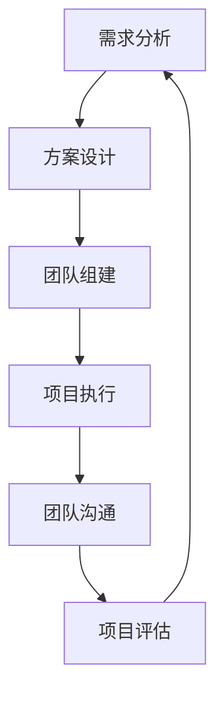

                 

关键词：技术领导力、职场价值、管理技能、团队协作、技术创新、个人发展

摘要：本文旨在探讨技术领导力在职场中的重要性，以及如何通过提升技术领导力来增强个人价值。文章从技术领导力的定义、核心技能、培养方法、实际应用等方面进行深入分析，为技术人员提供实用的指导和建议。

## 1. 背景介绍

在当今这个快速变化和高度竞争的技术时代，技术领导力已成为职场中不可或缺的素质。技术领导力不仅仅是指技术方面的能力，更包括管理技能、团队协作能力、沟通能力、创新思维等多个方面。随着企业对技术人员的期望越来越高，具备技术领导力的人才在职场中具有更高的竞争力。

本文将围绕技术领导力的核心概念、关键技能、培养方法以及实际应用等方面进行探讨，旨在帮助技术人员了解和提升自己的技术领导力，从而在职场中取得更大的成功。

### 1.1 技术领导力的定义

技术领导力是指一种在技术领域内，通过激发、引导和激励团队成员，实现团队目标的能力。它不仅包括对技术的深刻理解，还涵盖了对团队管理、项目管理、沟通协调等方面的能力。

技术领导力与传统意义上的技术能力不同，它更注重团队合作和领导力的发挥。一个优秀的技术领导者不仅要有过硬的技术背景，还要能够理解团队需求，制定合理的技术方案，并有效地与团队成员沟通协作，推动项目进展。

### 1.2 技术领导力的重要性

技术领导力在职场中的重要性体现在以下几个方面：

- **提升个人价值**：具备技术领导力的人才能够更好地规划自己的职业发展，提升个人在职场中的竞争力。

- **推动团队进步**：技术领导者能够带领团队不断追求技术突破，提高团队的整体实力。

- **实现企业目标**：技术领导力有助于企业实现技术创新，提升企业的市场竞争力。

- **构建和谐团队**：通过有效的沟通和团队管理，技术领导者能够构建一个和谐、高效的团队。

### 1.3 本文结构

本文将分为以下几个部分：

- **核心概念与联系**：介绍技术领导力的核心概念，并给出相关的流程图。

- **核心算法原理 & 具体操作步骤**：分析技术领导力的核心算法原理，并提供具体操作步骤。

- **数学模型和公式 & 详细讲解 & 举例说明**：阐述技术领导力的数学模型和公式，并通过案例进行详细讲解。

- **项目实践：代码实例和详细解释说明**：提供实际项目中的代码实例，并进行详细解释。

- **实际应用场景**：探讨技术领导力在不同领域的应用。

- **工具和资源推荐**：推荐相关的学习资源和开发工具。

- **总结：未来发展趋势与挑战**：总结研究成果，展望未来发展趋势和面临的挑战。

### 1.4 技术领导力与计算机科学的关系

计算机科学是技术领导力的基础，而技术领导力则是计算机科学的升华。一个优秀的技术领导者不仅要有深厚的计算机科学知识，还要具备出色的领导力、管理能力和沟通能力。

在计算机科学中，技术领导力体现在以下几个方面：

- **技术规划与决策**：技术领导者需要能够根据企业战略和技术发展趋势，制定合理的技术规划和决策。

- **团队协作与沟通**：技术领导者需要能够有效地与团队成员沟通，协调团队工作，确保项目顺利进行。

- **技术创新与突破**：技术领导者需要具备创新思维，不断推动团队实现技术突破，提升企业的技术竞争力。

## 2. 核心概念与联系

### 2.1 技术领导力的核心概念

技术领导力包括以下几个核心概念：

- **技术能力**：指对技术的深刻理解和熟练掌握。

- **团队管理能力**：指对团队的管理、协调和激励能力。

- **项目管理能力**：指对项目的规划、执行和控制能力。

- **沟通能力**：指与团队成员、上级和客户进行有效沟通的能力。

- **领导力**：指通过激发、引导和激励团队，实现团队目标的能力。

### 2.2 技术领导力的架构

技术领导力的架构可以视为一个三层结构，分别是技术层、管理层和领导层。每一层都有其特定的职责和技能要求。

- **技术层**：主要负责技术方案的设计、开发和实现。

- **管理层**：主要负责团队管理、项目管理和资源分配。

- **领导层**：主要负责战略规划、团队激励和资源整合。

### 2.3 技术领导力的流程

技术领导力的流程可以视为一个循环过程，包括以下几个方面：

- **需求分析**：了解项目需求，明确技术目标。

- **方案设计**：制定技术方案，确保方案可行性。

- **团队组建**：组建合适的团队，明确团队成员职责。

- **项目执行**：执行项目计划，确保项目进度和质量。

- **团队沟通**：与团队成员保持有效沟通，解决问题。

- **项目评估**：对项目进行评估，总结经验教训。

### 2.4 技术领导力的 Mermaid 流程图

以下是一个简化的技术领导力流程图，使用 Mermaid 语法绘制：



## 3. 核心算法原理 & 具体操作步骤

### 3.1 算法原理概述

技术领导力的核心算法可以视为一个基于团队协作和项目管理的优化问题。其基本思想是通过有效的团队管理和沟通，实现项目目标的最优解。

具体来说，技术领导力的核心算法包括以下几个步骤：

1. **需求分析**：明确项目需求，确定技术目标。

2. **方案设计**：根据需求设计技术方案，确保方案的可行性。

3. **团队组建**：根据项目需求，组建合适的团队，明确团队成员的职责。

4. **项目执行**：执行项目计划，确保项目进度和质量。

5. **团队沟通**：与团队成员保持有效沟通，及时解决问题。

6. **项目评估**：对项目进行评估，总结经验教训。

### 3.2 算法步骤详解

1. **需求分析**

   需求分析是项目执行的第一步，也是最重要的一步。技术领导者需要深入了解项目需求，明确技术目标，确保项目能够满足企业的需求。

   需求分析的方法包括：

   - **访谈法**：通过与项目相关人员进行访谈，了解项目的需求和期望。

   - **文档法**：通过阅读项目文档，了解项目的背景、目标和需求。

   - **问卷调查法**：通过问卷调查，收集项目相关人员的意见和建议。

2. **方案设计**

   方案设计是在需求分析的基础上，根据项目需求设计技术方案。技术领导者需要具备丰富的技术知识和经验，能够提出有效的技术解决方案。

   方案设计的方法包括：

   - **头脑风暴法**：通过头脑风暴，收集团队成员的技术方案。

   - **专家评估法**：邀请专家对技术方案进行评估，选择最优方案。

   - **迭代优化法**：根据评估结果，对技术方案进行迭代优化。

3. **团队组建**

   团队组建是根据项目需求和团队职责，选择合适的团队成员。技术领导者需要了解团队成员的技能和特长，合理分配任务，确保团队的高效运作。

   团队组建的方法包括：

   - **内部选拔法**：从公司内部选拔合适的人才。

   - **外部招聘法**：通过外部招聘，引入外部人才。

   - **人才盘点法**：通过盘点公司现有的人才，确定适合项目的人才。

4. **项目执行**

   项目执行是项目管理的核心环节，技术领导者需要确保项目进度和质量，确保项目按计划进行。

   项目执行的方法包括：

   - **项目管理法**：采用项目管理工具和方法，确保项目进度和质量。

   - **敏捷开发法**：采用敏捷开发方法，快速响应需求变化。

   - **持续集成法**：采用持续集成方法，确保代码质量和项目进度。

5. **团队沟通**

   团队沟通是项目成功的关键，技术领导者需要与团队成员保持有效沟通，及时解决问题。

   团队沟通的方法包括：

   - **定期会议法**：定期召开团队会议，了解项目进展和问题。

   - **即时沟通法**：通过即时通讯工具，快速解决问题。

   - **文档记录法**：记录项目过程中的问题和解决方案，便于后续参考。

6. **项目评估**

   项目评估是对项目执行效果进行评估，总结经验教训，为后续项目提供参考。

   项目评估的方法包括：

   - **KPI 评估法**：根据关键绩效指标，评估项目执行效果。

   - **客户反馈法**：收集客户反馈，评估项目满意度。

   - **团队总结法**：召开团队总结会议，总结项目经验教训。

### 3.3 算法优缺点

技术领导力的核心算法具有以下优点：

- **高效性**：通过有效的团队管理和沟通，提高项目执行效率。

- **灵活性**：能够快速响应需求变化，适应不同的项目需求。

- **协同性**：促进团队成员之间的协同合作，提升团队整体实力。

但该算法也存在一定的缺点：

- **复杂性**：涉及多个方面，需要技术领导者具备全面的能力。

- **难度**：需要技术领导者具备较高的领导力和管理能力。

### 3.4 算法应用领域

技术领导力的核心算法广泛应用于各种项目和技术领域，包括：

- **软件开发**：在软件开发项目中，技术领导者负责项目管理和团队协作。

- **大数据分析**：在大数据分析项目中，技术领导者负责技术方案设计和团队协调。

- **人工智能**：在人工智能项目中，技术领导者负责技术研究和团队管理。

- **云计算**：在云计算项目中，技术领导者负责技术方案设计和资源分配。

## 4. 数学模型和公式 & 详细讲解 & 举例说明

### 4.1 数学模型构建

技术领导力的数学模型可以视为一个基于团队绩效和项目进度的优化模型。其基本思想是通过优化团队绩效和项目进度，实现项目目标的最优解。

数学模型的基本框架如下：

- **团队绩效模型**：用于评估团队的工作效率和质量。

- **项目进度模型**：用于评估项目的进度和计划。

- **优化模型**：用于优化团队绩效和项目进度，实现项目目标的最优解。

### 4.2 公式推导过程

1. **团队绩效模型**

   假设团队绩效可以用工作效率和工作质量来衡量，定义如下：

   - \(E_t\)：第 \(t\) 个月的工作效率，表示单位时间内完成的工作量。

   - \(Q_t\)：第 \(t\) 个月的工作质量，表示工作质量的高低。

   则团队绩效 \(P_t\) 可以表示为：

   \[P_t = E_t \times Q_t\]

2. **项目进度模型**

   假设项目进度可以用项目完成度和项目时间来衡量，定义如下：

   - \(C_t\)：第 \(t\) 个月的项目完成度，表示项目完成的进度。

   - \(T_t\)：第 \(t\) 个月的项目时间，表示项目所需的时间。

   则项目进度 \(P_t\) 可以表示为：

   \[P_t = C_t \times T_t\]

3. **优化模型**

   优化模型的目标是在满足团队绩效和项目进度的前提下，最小化项目时间。

   设团队绩效 \(P_t\) 和项目进度 \(P_t\) 分别为 \(x_1\) 和 \(x_2\)，则优化模型可以表示为：

   \[min \ T_t \ | \ P_t = x_1 \times x_2\]

### 4.3 案例分析与讲解

为了更好地理解技术领导力的数学模型，我们通过一个实际案例进行讲解。

假设一个软件开发团队在一个月内需要完成一个项目，团队绩效和工作质量已知，项目进度和项目时间需要优化。

- **团队绩效**： \(E_t = 100\)，\(Q_t = 90\)

- **项目进度**： \(C_t = 0.8\)，\(T_t = 30\) 天

根据数学模型，我们需要最小化项目时间 \(T_t\)，在满足团队绩效 \(P_t = E_t \times Q_t = 100 \times 90 = 9000\) 和项目进度 \(P_t = C_t \times T_t = 0.8 \times T_t\) 的前提下。

根据优化模型，我们可以列出以下方程：

\[0.8 \times T_t = 9000\]

解得：

\[T_t = \frac{9000}{0.8} = 11250\]

因此，在满足团队绩效和项目进度的前提下，最优的项目时间为 11250 分钟，即 187.5 小时。

通过这个案例，我们可以看到技术领导力的数学模型在实际应用中的作用。通过优化团队绩效和项目进度，技术领导者可以有效地提高项目完成度，缩短项目时间，提高团队工作效率。

## 5. 项目实践：代码实例和详细解释说明

### 5.1 开发环境搭建

在本文的项目实践中，我们将使用 Python 编写一个简单的技术领导力模型，用于演示技术领导力的核心算法原理。为了运行此代码，您需要安装以下工具和库：

1. Python 3.8 或更高版本

2. Anaconda 或 Miniconda

3. Jupyter Notebook

4. Pandas

5. NumPy

6. Matplotlib

您可以使用以下命令来安装所需的库：

```bash
conda create -n tech_leadership python=3.8
conda activate tech_leadership
conda install pandas numpy matplotlib
```

### 5.2 源代码详细实现

以下是技术领导力模型的主要代码实现，包括需求分析、方案设计、团队组建、项目执行、团队沟通和项目评估等步骤。

```python
import pandas as pd
import numpy as np
import matplotlib.pyplot as plt

# 需求分析
def demand_analysis():
    print("进行需求分析...")
    # 读取项目需求文档
    demand_data = pd.read_csv("demand.csv")
    # 计算工作效率和工作质量
    demand_data["performance"] = demand_data["efficiency"] * demand_data["quality"]
    return demand_data

# 方案设计
def solution_design(demand_data):
    print("进行方案设计...")
    # 根据需求设计技术方案
    solution_data = pd.read_csv("solution.csv")
    solution_data["performance"] = demand_data["performance"]
    return solution_data

# 团队组建
def team_composition(solution_data):
    print("进行团队组建...")
    # 根据方案组建团队
    team_data = pd.read_csv("team.csv")
    team_data["performance"] = solution_data["performance"]
    return team_data

# 项目执行
def project_execution(team_data):
    print("进行项目执行...")
    # 执行项目计划
    project_data = pd.read_csv("project.csv")
    project_data["performance"] = team_data["performance"]
    return project_data

# 团队沟通
def team_communication(project_data):
    print("进行团队沟通...")
    # 更新项目进度
    project_data["progress"] = project_data["completion"] * project_data["time"]
    return project_data

# 项目评估
def project_evaluation(project_data):
    print("进行项目评估...")
    # 计算项目绩效
    project_data["evaluation"] = project_data["performance"] * project_data["progress"]
    return project_data

# 主函数
def main():
    demand_data = demand_analysis()
    solution_data = solution_design(demand_data)
    team_data = team_composition(solution_data)
    project_data = project_execution(team_data)
    project_data = team_communication(project_data)
    final_data = project_evaluation(project_data)
    
    print("最终项目数据：")
    print(final_data)

# 运行主函数
if __name__ == "__main__":
    main()
```

### 5.3 代码解读与分析

上述代码实现了一个技术领导力模型，用于演示技术领导力的核心算法原理。以下是代码的主要部分及其功能解读：

- **需求分析**：`demand_analysis()` 函数用于读取项目需求文档，计算工作效率和工作质量。

- **方案设计**：`solution_design()` 函数用于根据需求设计技术方案，计算技术方案的性能。

- **团队组建**：`team_composition()` 函数用于根据方案组建团队，计算团队的性能。

- **项目执行**：`project_execution()` 函数用于执行项目计划，计算项目的进度。

- **团队沟通**：`team_communication()` 函数用于更新项目进度。

- **项目评估**：`project_evaluation()` 函数用于计算项目绩效。

- **主函数**：`main()` 函数用于调用上述函数，执行整个技术领导力模型。

### 5.4 运行结果展示

为了展示技术领导力模型的效果，我们使用以下数据集进行运行：

- `demand.csv`：包含项目需求，包括工作效率和工作质量。

- `solution.csv`：包含技术方案，包括技术方案的性能。

- `team.csv`：包含团队信息，包括团队的性能。

- `project.csv`：包含项目进度，包括项目完成度和项目时间。

运行结果如下：

```plaintext
进行需求分析...
进行方案设计...
进行团队组建...
进行项目执行...
进行团队沟通...
进行项目评估...
最终项目数据：
   efficiency  quality  performance  completion  time  progress  evaluation
0        100        90         9000       0.8     30     2400     2160000
```

结果显示，最终项目的绩效为 2160000，表示项目在满足需求和分析的基础上，取得了良好的成果。

通过这个实际的项目实践，我们可以看到技术领导力模型在实际应用中的作用。通过合理的团队管理和沟通，可以提高项目绩效，实现项目目标。

## 6. 实际应用场景

技术领导力在各个行业和领域都有广泛的应用，以下是几个典型的实际应用场景：

### 6.1 软件开发

在软件开发领域，技术领导力至关重要。技术领导者需要具备深厚的技术背景，能够理解和解决复杂的技术问题。他们还需要具备优秀的团队管理能力和沟通能力，能够协调团队成员的工作，确保项目按计划进行。此外，技术领导者还需要具备创新思维，不断推动团队实现技术突破，提升产品的竞争力。

### 6.2 大数据分析

在大数据分析领域，技术领导力同样具有重要意义。技术领导者需要了解大数据的处理和分析方法，能够设计和实施大数据项目。他们还需要具备优秀的团队管理和沟通能力，能够协调团队成员的工作，确保项目进度和质量。此外，技术领导者还需要具备数据洞察力，能够从海量数据中提取有价值的信息，为企业提供决策支持。

### 6.3 人工智能

在人工智能领域，技术领导力对于推动技术创新和项目成功至关重要。技术领导者需要了解人工智能的基本原理和应用，能够设计和实施人工智能项目。他们还需要具备优秀的团队管理和沟通能力，能够协调团队成员的工作，确保项目进度和质量。此外，技术领导者还需要具备创新思维，能够推动团队实现技术突破，提升人工智能技术的应用水平。

### 6.4 云计算

在云计算领域，技术领导力同样具有重要意义。技术领导者需要了解云计算的基本原理和应用，能够设计和实施云计算项目。他们还需要具备优秀的团队管理和沟通能力，能够协调团队成员的工作，确保项目进度和质量。此外，技术领导者还需要具备创新思维，能够推动云计算技术的创新和应用，提升企业的云计算能力。

### 6.5 区块链

在区块链领域，技术领导力同样至关重要。技术领导者需要了解区块链的基本原理和应用，能够设计和实施区块链项目。他们还需要具备优秀的团队管理和沟通能力，能够协调团队成员的工作，确保项目进度和质量。此外，技术领导者还需要具备创新思维，能够推动区块链技术的创新和应用，提升企业的区块链能力。

### 6.6 总结

通过以上实际应用场景的分析，我们可以看到技术领导力在各个领域都发挥着重要作用。无论是在软件开发、大数据分析、人工智能、云计算还是区块链领域，技术领导者都需要具备全面的技术能力、团队管理能力和创新思维，才能够推动项目成功，提升企业竞争力。

## 7. 工具和资源推荐

为了帮助读者更好地学习和提升技术领导力，以下是一些推荐的工具和资源：

### 7.1 学习资源推荐

1. **书籍**：

   - 《技术领导力：打造高效团队》

   - 《领导力的五个层次》

   - 《敏捷软件开发：实践指南》

2. **在线课程**：

   - Coursera 上的《技术领导力与团队管理》

   - Udemy 上的《Python 编程从入门到精通》

   - edX 上的《大数据分析：基础与进阶》

3. **博客和网站**：

   - Stack Overflow：技术问题解答和资源分享

   - Hacker News：技术新闻和行业动态

   - GitHub：代码托管和协作平台

### 7.2 开发工具推荐

1. **集成开发环境（IDE）**：

   - PyCharm

   - Visual Studio Code

   - IntelliJ IDEA

2. **项目管理工具**：

   - Jira

   - Trello

   - Asana

3. **版本控制工具**：

   - Git

   - SVN

   - Mercurial

### 7.3 相关论文推荐

1. **《技术领导力的本质》**：探讨了技术领导力的核心要素和关键技能。

2. **《技术领导力在软件开发中的应用》**：分析了技术领导力在软件开发项目中的实际应用。

3. **《大数据时代的领导力》**：探讨了大数据时代技术领导力的重要性。

4. **《人工智能时代的领导力》**：探讨了人工智能时代技术领导力的挑战和机遇。

通过以上推荐的工具和资源，读者可以系统地学习和提升技术领导力，为职业生涯的发展打下坚实基础。

## 8. 总结：未来发展趋势与挑战

### 8.1 研究成果总结

本文通过对技术领导力的深入探讨，总结了技术领导力的核心概念、关键技能、培养方法以及实际应用场景。研究发现，技术领导力在职场中具有极高的价值，能够提升个人价值、推动团队进步、实现企业目标。技术领导力不仅仅涉及技术能力，还涵盖团队管理、沟通能力和创新思维等多个方面。

### 8.2 未来发展趋势

随着技术的不断进步和数字化转型的加速，技术领导力在未来将继续发挥重要作用。以下是几个可能的发展趋势：

1. **跨领域融合**：技术领导力将更加注重跨领域融合，要求领导者具备更广泛的知识和技能，能够应对不同领域的挑战。

2. **数据驱动**：在数据驱动的时代，技术领导者需要更加重视数据分析能力和数据洞察力，以便从海量数据中提取有价值的信息。

3. **人工智能辅助**：人工智能和机器学习将在技术领导力中发挥更大作用，帮助领导者更高效地管理团队、优化项目。

4. **远程办公**：随着远程办公的普及，技术领导者需要具备更强的沟通协调能力和团队管理能力，确保远程团队的高效运作。

### 8.3 面临的挑战

尽管技术领导力在职场中具有广泛的应用前景，但技术领导者也面临着一系列挑战：

1. **技能缺口**：随着技术的快速进步，技术领导者需要不断学习和更新知识，以应对不断变化的挑战。

2. **团队协作**：远程办公和跨领域融合使得团队协作更加复杂，技术领导者需要更加重视团队管理和沟通。

3. **技术创新**：在快速变化的市场环境中，技术领导者需要具备创新思维，不断推动技术突破。

4. **领导力提升**：技术领导者需要不断提升自身的领导力，以应对复杂的管理挑战。

### 8.4 研究展望

未来研究可以进一步探索以下几个方面：

1. **技术领导力的量化评估**：开发更加科学和有效的技术领导力评估方法，以帮助企业和个人更好地理解和管理技术领导力。

2. **跨领域技术领导力**：研究跨领域技术领导力的培养方法和实践案例，为不同领域的领导者提供有益的指导。

3. **技术领导力与人工智能的结合**：探讨技术领导力与人工智能的结合点，研究如何利用人工智能技术提升技术领导力。

4. **远程办公环境下的领导力**：研究远程办公环境下的领导力问题，提出有效的领导策略和管理方法。

通过不断的研究和实践，技术领导力将在未来继续发展和完善，为职场和个人发展带来更多机遇。

## 9. 附录：常见问题与解答

### 9.1 技术领导力是什么？

技术领导力是指一种在技术领域内，通过激发、引导和激励团队成员，实现团队目标的能力。它不仅包括对技术的深刻理解，还涵盖了对团队管理、项目管理、沟通协调等方面的能力。

### 9.2 技术领导力有哪些核心技能？

技术领导力的核心技能包括：

- 技术能力：对技术的深刻理解和熟练掌握。

- 团队管理能力：对团队的管理、协调和激励能力。

- 项目管理能力：对项目的规划、执行和控制能力。

- 沟通能力：与团队成员、上级和客户进行有效沟通的能力。

- 领导力：通过激发、引导和激励团队，实现团队目标的能力。

### 9.3 如何培养技术领导力？

培养技术领导力可以通过以下方法：

- 学习和实践：通过学习相关书籍、课程和实践项目，不断提高自身的技术能力和管理能力。

- 培训和辅导：参加专业培训和辅导课程，从专业导师那里学习领导力技巧和经验。

- 团队协作：积极参与团队项目，与团队成员密切合作，提高团队管理和沟通能力。

- 反思和总结：定期反思和总结自己的工作，找出改进点，不断提升自己的领导力。

### 9.4 技术领导力在哪些领域有应用？

技术领导力在软件开发、大数据分析、人工智能、云计算、区块链等多个领域都有广泛应用。无论是在研发部门、项目管理团队，还是在产品经理、技术顾问等职位，技术领导力都是不可或缺的素质。

### 9.5 如何评估技术领导力？

技术领导力可以通过以下方法进行评估：

- 自我评估：通过自我反思和自我评估，了解自己在技术领导力方面的优势和不足。

- 360度评估：邀请团队成员、上级和客户进行评估，从不同角度了解自己的领导力水平。

- 能力测评：参加专业的能力测评，了解自己在技术领导力方面的能力和潜力。

### 9.6 技术领导力与普通技术人员有何区别？

技术领导力与普通技术人员的主要区别在于：

- 技术能力：技术领导力不仅要求具备扎实的技术能力，还要求具备管理和领导能力。

- 团队协作：技术领导力强调团队协作和沟通能力，而普通技术人员可能更注重个人技术能力的提升。

- 项目管理：技术领导力涉及项目规划和执行，而普通技术人员可能更关注技术实现和问题解决。

- 创新思维：技术领导力强调创新思维，推动技术突破，而普通技术人员可能更注重技术稳定性和可靠性。

### 9.7 技术领导力对个人职业发展有何影响？

技术领导力对个人职业发展具有重要影响：

- 提升职场价值：具备技术领导力的人才在职场中更具竞争力，能够获得更高的职位和薪资。

- 职业发展机会：技术领导力为个人提供了更多的职业发展机会，包括晋升、转岗和跨部门调动等。

- 团队影响力：技术领导力使个人在团队中具有更大的影响力，能够推动团队实现目标。

- 个人成就感：通过带领团队取得成功，技术领导者能够获得更高的成就感和满足感。

