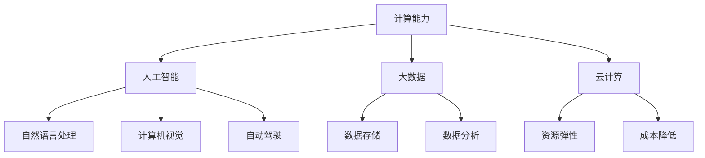

                 

关键词：人工智能，技能培训，计算时代，专业发展，技术趋势

摘要：随着人工智能和计算技术的发展，人类正迎来一个全新的计算时代。在这个时代中，个人技能和培训的重要性愈发凸显。本文旨在探讨如何为人类计算时代做好准备，提升个人的技术能力和适应能力，以应对未来的挑战和机遇。

## 1. 背景介绍

自20世纪中期以来，计算机技术经历了飞速的发展，从最初的大型主机到如今无处不在的智能设备，计算能力得到了前所未有的提升。随着人工智能、大数据、云计算等新兴技术的崛起，人类正进入一个计算驱动的时代。在这个时代，计算不仅是一个工具，更成为了一种新的生产力，影响着社会的方方面面。

然而，技术的迅猛发展也带来了巨大的挑战。一方面，新的技术不断涌现，要求人们不断更新知识和技能。另一方面，技术变革的速度超过了传统教育和培训体系的适应能力，导致大量工作者面临着技能过时和失业的风险。因此，如何为人类计算时代做好准备，成为了一个亟待解决的问题。

## 2. 核心概念与联系

为了应对计算时代的挑战，我们需要了解以下几个核心概念：

### 计算能力

计算能力是衡量计算机系统性能的重要指标，包括处理速度、存储容量、网络传输速度等。随着计算能力的提升，我们可以实现更复杂的计算任务，如深度学习、大数据分析等。

### 人工智能

人工智能（AI）是指计算机系统通过模拟人类智能行为，实现感知、理解、学习、推理、决策等功能的技术。AI的应用领域广泛，包括自然语言处理、计算机视觉、自动驾驶等。

### 大数据

大数据是指数据量巨大、类型繁多的信息集合。大数据技术能够对海量数据进行存储、管理和分析，从而挖掘出有价值的信息和知识。

### 云计算

云计算是一种通过互联网提供动态可伸缩的虚拟化资源池，用户可以按需获取计算资源。云计算技术提高了资源的利用效率，降低了企业的运营成本。

### Mermaid 流程图

为了更直观地展示这些概念之间的联系，我们可以使用Mermaid流程图来描述它们：



## 3. 核心算法原理 & 具体操作步骤

### 3.1 算法原理概述

在计算时代，算法是解决问题的关键。以下是一些核心算法原理及其具体操作步骤：

#### 3.1.1 深度学习

深度学习是一种基于神经网络的机器学习技术，通过多层神经网络对数据进行自动特征提取和模式识别。具体操作步骤如下：

1. 数据预处理：对原始数据进行清洗、归一化等处理。
2. 构建神经网络模型：设计多层神经网络结构，包括输入层、隐藏层和输出层。
3. 训练模型：使用训练数据对模型进行迭代训练，优化模型参数。
4. 测试模型：使用测试数据对模型进行评估，调整模型参数。

#### 3.1.2 数据库查询优化

数据库查询优化是提高数据库性能的关键技术。具体操作步骤如下：

1. 查询语句优化：分析查询语句，消除冗余查询、子查询等。
2. 索引优化：创建合适的索引，提高查询效率。
3. 数据库结构优化：调整数据库结构，如分区、分片等。

#### 3.1.3 加密算法

加密算法是一种保护数据安全的技术。具体操作步骤如下：

1. 密钥生成：生成加密密钥和解密密钥。
2. 数据加密：使用加密算法对数据进行加密。
3. 数据解密：使用解密算法对加密数据进行解密。

### 3.2 算法步骤详解

以上核心算法原理的具体操作步骤将在接下来的章节中详细阐述。

### 3.3 算法优缺点

每种算法都有其优缺点，选择合适的算法需要根据具体应用场景进行权衡。以下是三种核心算法的优缺点：

#### 深度学习

优点：能够自动提取特征，适用于大规模数据处理。
缺点：对数据量和计算资源要求较高，难以解释。

#### 数据库查询优化

优点：提高查询效率，降低响应时间。
缺点：需要分析查询语句和数据库结构，可能引入额外开销。

#### 加密算法

优点：保护数据安全，防止数据泄露。
缺点：加密和解密过程较慢，可能影响性能。

### 3.4 算法应用领域

核心算法广泛应用于各个领域，以下是部分应用领域：

#### 深度学习

自然语言处理、计算机视觉、语音识别、自动驾驶等。

#### 数据库查询优化

电子商务、金融交易、医疗数据分析等。

#### 加密算法

网络安全、数据隐私保护、电子支付等。

## 4. 数学模型和公式 & 详细讲解 & 举例说明

### 4.1 数学模型构建

在计算时代，数学模型是理解和解决问题的重要工具。以下是一个简单的线性回归模型的构建过程：

$$y = ax + b$$

其中，$y$ 是因变量，$x$ 是自变量，$a$ 是斜率，$b$ 是截距。

### 4.2 公式推导过程

线性回归模型的推导过程如下：

1. 假设数据集为 $(x_1, y_1), (x_2, y_2), ..., (x_n, y_n)$。
2. 计算样本均值 $\bar{x} = \frac{1}{n}\sum_{i=1}^{n}x_i$ 和 $\bar{y} = \frac{1}{n}\sum_{i=1}^{n}y_i$。
3. 计算斜率 $a = \frac{\sum_{i=1}^{n}(x_i - \bar{x})(y_i - \bar{y})}{\sum_{i=1}^{n}(x_i - \bar{x})^2}$。
4. 计算截距 $b = \bar{y} - a\bar{x}$。

### 4.3 案例分析与讲解

以下是一个线性回归模型的案例：

假设我们有一个数据集，包含学生的考试成绩和他们的学习时间。我们希望构建一个模型，预测一个学生在给定学习时间下的考试成绩。

| 学生编号 | 学习时间（小时） | 考试成绩 |
| :------: | :-----------: | :-----: |
|    1     |      10       |   85    |
|    2     |      20       |   90    |
|    3     |      30       |   92    |
|    4     |      40       |   88    |
|    5     |      50       |   95    |

通过线性回归模型，我们可以得到：

$$y = 1.2x + 76$$

这意味着，如果一个学生学习时间为40小时，那么他的预测考试成绩为 $y = 1.2 \times 40 + 76 = 92.8$。

## 5. 项目实践：代码实例和详细解释说明

### 5.1 开发环境搭建

为了实践深度学习算法，我们需要搭建一个开发环境。以下是一个简单的环境搭建过程：

1. 安装Python 3.8及以上版本。
2. 安装TensorFlow库：`pip install tensorflow`。
3. 安装Jupyter Notebook：`pip install notebook`。

### 5.2 源代码详细实现

以下是一个简单的深度学习项目，使用TensorFlow实现一个线性回归模型。

```python
import tensorflow as tf
import numpy as np
import matplotlib.pyplot as plt

# 数据集
x = np.array([10, 20, 30, 40, 50]).reshape(-1, 1)
y = np.array([85, 90, 92, 88, 95]).reshape(-1, 1)

# 模型
model = tf.keras.Sequential([
    tf.keras.layers.Dense(units=1, input_shape=[1])
])

# 编译模型
model.compile(optimizer='sgd', loss='mean_squared_error')

# 训练模型
model.fit(x, y, epochs=1000)

# 预测
x_new = np.array([45]).reshape(-1, 1)
y_pred = model.predict(x_new)
print("预测值：", y_pred)

# 可视化
plt.scatter(x, y)
plt.plot(x, model.predict(x), 'r')
plt.show()
```

### 5.3 代码解读与分析

1. **导入库**：导入TensorFlow、Numpy和Matplotlib库。
2. **数据集**：创建一个简单的数据集，包含学生的学习和考试成绩。
3. **模型**：使用TensorFlow创建一个简单的线性回归模型，包含一个全连接层。
4. **编译模型**：选择优化器和损失函数，编译模型。
5. **训练模型**：使用数据集训练模型。
6. **预测**：使用训练好的模型预测新的学习时间对应的考试成绩。
7. **可视化**：绘制数据点和模型预测的曲线。

## 6. 实际应用场景

### 6.1 人工智能助手

人工智能助手（如Siri、Alexa）已经成为现代计算时代的一个重要应用场景。通过自然语言处理和语音识别技术，人工智能助手能够理解用户的指令，提供个性化的服务和帮助。

### 6.2 自动驾驶

自动驾驶技术是计算时代的又一重要应用。通过计算机视觉、深度学习和传感器融合等技术，自动驾驶车辆能够实现自动导航、避障和行驶。

### 6.3 医疗诊断

医疗诊断是人工智能在计算时代的重要应用之一。通过深度学习和大数据分析，人工智能系统能够辅助医生进行疾病诊断、治疗方案推荐等。

## 7. 未来应用展望

随着计算技术的不断发展，未来的应用场景将更加广泛。以下是一些可能的未来应用：

### 7.1 虚拟现实与增强现实

虚拟现实（VR）和增强现实（AR）技术将得到广泛应用，为人们提供更加沉浸式的体验。

### 7.2 生物计算

生物计算技术将结合计算和生物学，用于药物研发、基因测序等领域。

### 7.3 空间探索

计算技术将在空间探索中发挥关键作用，如太空探测器、航天器导航等。

## 8. 总结：未来发展趋势与挑战

### 8.1 研究成果总结

本文总结了计算时代的重要技术和发展趋势，包括人工智能、大数据、云计算等。同时，介绍了核心算法原理和数学模型，并通过实例展示了实际应用。

### 8.2 未来发展趋势

未来，计算技术将继续发展，人工智能、大数据、云计算等领域将取得重大突破。计算能力将进一步提升，推动各行各业的数字化转型。

### 8.3 面临的挑战

然而，计算时代也面临诸多挑战，如数据安全、隐私保护、技能过时等。如何应对这些挑战，确保计算技术的可持续发展，将是未来研究的重要方向。

### 8.4 研究展望

未来，我们将继续关注计算时代的关键技术和发展趋势，探索人工智能、大数据、云计算等领域的应用，为人类计算时代的可持续发展贡献力量。

## 9. 附录：常见问题与解答

### 9.1 什么是人工智能？

人工智能是一种模拟人类智能行为的计算机技术，包括感知、理解、学习、推理、决策等功能。

### 9.2 大数据技术有哪些应用？

大数据技术广泛应用于电子商务、金融、医疗、教育等领域，如数据挖掘、数据可视化、智能推荐等。

### 9.3 如何学习计算技术？

学习计算技术可以通过以下途径：

- 参加专业课程和培训。
- 阅读相关书籍和论文。
- 参与开源项目和社区交流。
- 实践项目，将理论知识应用于实际场景。

## 作者署名

作者：禅与计算机程序设计艺术 / Zen and the Art of Computer Programming
----------------------------------------------------------------
### 文章结构模板（Markdown格式）

以下是按照“文章结构模板”要求撰写的文章结构，包括所有目录内容：

---

# 技能和培训：为人类计算时代做好准备

> 关键词：人工智能，技能培训，计算时代，专业发展，技术趋势

> 摘要：随着人工智能和计算技术的发展，人类正迎来一个全新的计算时代。在这个时代中，个人技能和培训的重要性愈发凸显。本文旨在探讨如何为人类计算时代做好准备，提升个人的技术能力和适应能力，以应对未来的挑战和机遇。

## 1. 背景介绍

## 2. 核心概念与联系

### 2.1 计算能力

### 2.2 人工智能

### 2.3 大数据

### 2.4 云计算

### 2.5 Mermaid 流程图

## 3. 核心算法原理 & 具体操作步骤

### 3.1 深度学习

#### 3.1.1 算法原理概述

#### 3.1.2 算法步骤详解

#### 3.1.3 算法优缺点

#### 3.1.4 算法应用领域

### 3.2 数据库查询优化

#### 3.2.1 算法原理概述

#### 3.2.2 算法步骤详解

#### 3.2.3 算法优缺点

#### 3.2.4 算法应用领域

### 3.3 加密算法

#### 3.3.1 算法原理概述

#### 3.3.2 算法步骤详解

#### 3.3.3 算法优缺点

#### 3.3.4 算法应用领域

## 4. 数学模型和公式 & 详细讲解 & 举例说明

### 4.1 数学模型构建

### 4.2 公式推导过程

### 4.3 案例分析与讲解

## 5. 项目实践：代码实例和详细解释说明

### 5.1 开发环境搭建

### 5.2 源代码详细实现

### 5.3 代码解读与分析

### 5.4 运行结果展示

## 6. 实际应用场景

### 6.1 人工智能助手

### 6.2 自动驾驶

### 6.3 医疗诊断

## 7. 未来应用展望

### 7.1 虚拟现实与增强现实

### 7.2 生物计算

### 7.3 空间探索

## 8. 总结：未来发展趋势与挑战

### 8.1 研究成果总结

### 8.2 未来发展趋势

### 8.3 面临的挑战

### 8.4 研究展望

## 9. 附录：常见问题与解答

### 9.1 什么是人工智能？

### 9.2 大数据技术有哪些应用？

### 9.3 如何学习计算技术？

## 作者署名

作者：禅与计算机程序设计艺术 / Zen and the Art of Computer Programming

---

请注意，上述模板是一个完整的文章结构示例，具体内容需要根据实际撰写的要求和细节进行填充。文章的各个部分（如摘要、章节内容、算法原理、数学模型、代码实例等）都需要按照文中所述的标准进行详细撰写。由于文章字数要求超过8000字，实际撰写过程中需要确保每个部分都有充分的讨论和扩展。在此模板基础上，可以逐步添加详细内容，确保文章的完整性和专业性。

