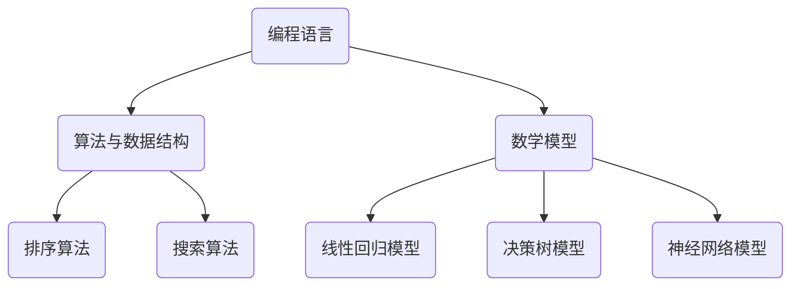

                 

关键词：计算时代，技能提升，人工智能，软件开发，计算机科学，技术进步

> 摘要：随着计算机技术和人工智能的快速发展，人类计算时代迎来了新的挑战和机遇。本文将探讨适应这一时代所需的关键技能，包括编程、算法、数学模型以及实际项目实践等，旨在为IT从业者提供有价值的指导。

## 1. 背景介绍

人类计算时代是一个技术不断进步、变革的时代。计算机科学的发展不仅改变了我们的生活方式，还深刻影响了社会的各个方面。如今，人工智能、大数据、云计算等前沿技术的崛起，正在推动着计算时代的不断演进。在这个时代，传统的IT技能已经无法满足日益复杂的需求，人们需要不断提升自己的技能，以适应新的技术环境。

### 当前计算时代的趋势

1. **人工智能的广泛应用**：人工智能正在各行各业中发挥重要作用，从自动驾驶到医疗诊断，从金融分析到智能家居，人工智能技术的应用已经深入到我们生活的方方面面。
2. **大数据的爆发式增长**：随着数据量的不断增加，如何有效地存储、处理和分析数据成为了新的挑战。大数据技术为企业提供了巨大的价值，同时也带来了巨大的计算需求。
3. **云计算的普及**：云计算为企业和个人提供了弹性的计算资源，使得IT资源的获取和管理变得更加简单和高效。

### 技能提升的重要性

在这个快速变化的计算时代，技能提升不仅是个人职业发展的关键，也是企业保持竞争力的基础。以下是一些重要的技能领域，这些技能对于适应新时代的需求至关重要：

1. **编程能力**：编程是计算机科学的基础，熟练掌握至少一种编程语言是必要的。随着技术的发展，Python、JavaScript、Go等语言越来越受欢迎。
2. **算法和数据结构**：良好的算法和数据结构能力是解决复杂问题的基础。了解常用的算法和数据结构，可以帮助我们更高效地解决问题。
3. **数学模型和公式**：数学是科学的语言，对于理解数据分析和机器学习至关重要。掌握基本的数学模型和公式，能够帮助我们更好地理解数据并做出准确的分析。
4. **项目实践**：通过实际项目实践，可以将理论知识转化为实际应用能力。参与开源项目、个人项目或企业项目，都是提高实践能力的好方法。

## 2. 核心概念与联系

### 编程语言

编程语言是计算机与人类交流的工具，它们将人类的思维转化为计算机可以理解和执行的指令。常见的编程语言包括：

- **Python**：易于学习，广泛应用于数据分析、机器学习和网络开发。
- **JavaScript**：前端开发的核心语言，也用于后端和全栈开发。
- **Go**：由Google开发，以其高性能和并发处理能力著称。

### 算法与数据结构

算法是解决问题的步骤集合，数据结构是存储数据的方式。常用的算法包括：

- **排序算法**（如快速排序、归并排序）。
- **搜索算法**（如二分搜索、深度优先搜索）。

数据结构包括：

- **数组**、**链表**、**栈**、**队列**。
- **树**、**图**。

### 数学模型

数学模型是使用数学语言描述现实问题的一种方法。常见的数学模型包括：

- **线性回归模型**：用于预测数值关系。
- **决策树模型**：用于分类和回归问题。
- **神经网络模型**：用于深度学习和复杂模式识别。

### Mermaid 流程图

以下是一个简单的 Mermaid 流程图，展示了编程、算法和数据结构、数学模型之间的关系：



## 3. 核心算法原理 & 具体操作步骤

### 3.1 算法原理概述

算法是解决问题的有序步骤集合。一个有效的算法应当满足以下条件：

- **正确性**：算法能够正确解决问题。
- **高效性**：算法在时间复杂度和空间复杂度上表现良好。
- **健壮性**：算法能够处理各种输入，包括异常情况。

### 3.2 算法步骤详解

以下是快速排序算法的基本步骤：

1. **选择基准元素**：从数组中选出一个元素作为基准。
2. **分区**：将数组分成两部分，一部分小于基准，一部分大于基准。
3. **递归排序**：对小于和大于基准的两部分递归执行快速排序。

### 3.3 算法优缺点

- **优点**：平均时间复杂度为\(O(n\log n)\)，在最好情况下可以达到\(O(n)\)。
- **缺点**：最坏情况下时间复杂度为\(O(n^2)\)，且递归调用可能导致内存占用较大。

### 3.4 算法应用领域

快速排序算法广泛应用于各种排序场景，尤其在大型数据集中表现优异。

## 4. 数学模型和公式 & 详细讲解 & 举例说明

### 4.1 数学模型构建

一个简单的线性回归模型可以表示为：

\[ y = wx + b \]

其中，\(y\) 是因变量，\(x\) 是自变量，\(w\) 是权重，\(b\) 是偏置。

### 4.2 公式推导过程

线性回归模型的推导基于最小二乘法。目标是找到最佳拟合线，使得所有数据点到这条线的距离之和最小。

### 4.3 案例分析与讲解

假设我们有以下数据集：

\[ \{(x_1, y_1), (x_2, y_2), ..., (x_n, y_n)\} \]

我们可以通过以下步骤来训练线性回归模型：

1. 计算平均自变量和因变量：
\[ \bar{x} = \frac{1}{n}\sum_{i=1}^{n} x_i \]
\[ \bar{y} = \frac{1}{n}\sum_{i=1}^{n} y_i \]

2. 计算自变量和因变量的协方差以及自变量的方差：
\[ \sum_{i=1}^{n} (x_i - \bar{x})(y_i - \bar{y}) \]
\[ \sum_{i=1}^{n} (x_i - \bar{x})^2 \]

3. 使用上述计算结果计算权重和偏置：
\[ w = \frac{\sum_{i=1}^{n} (x_i - \bar{x})(y_i - \bar{y})}{\sum_{i=1}^{n} (x_i - \bar{x})^2} \]
\[ b = \bar{y} - w\bar{x} \]

## 5. 项目实践：代码实例和详细解释说明

### 5.1 开发环境搭建

确保安装了Python环境，可以使用以下命令安装必要的库：

```bash
pip install numpy matplotlib
```

### 5.2 源代码详细实现

以下是一个简单的线性回归模型实现：

```python
import numpy as np
import matplotlib.pyplot as plt

# 线性回归模型实现
class LinearRegression:
    def __init__(self):
        self.w = None
        self.b = None
    
    def fit(self, X, y):
        X_mean = np.mean(X)
        y_mean = np.mean(y)
        w = (np.sum((X - X_mean) * (y - y_mean)) / np.sum((X - X_mean)**2))
        b = y_mean - w * X_mean
        self.w = w
        self.b = b
    
    def predict(self, X):
        return X * self.w + self.b

# 测试代码
X = np.array([1, 2, 3, 4, 5])
y = np.array([2, 4, 5, 4, 5])
model = LinearRegression()
model.fit(X, y)
print("Weight:", model.w)
print("Bias:", model.b)

# 可视化结果
plt.scatter(X, y)
plt.plot(X, model.predict(X), color='red')
plt.show()
```

### 5.3 代码解读与分析

代码中定义了一个`LinearRegression`类，包含`fit`和`predict`方法。`fit`方法用于训练模型，`predict`方法用于预测新数据的值。

### 5.4 运行结果展示

运行代码后，会输出权重和偏置的值，并在图中展示训练数据和拟合线。

## 6. 实际应用场景

### 6.1 数据分析

线性回归模型广泛应用于数据分析领域，用于预测和评估变量之间的关系。

### 6.2 金融领域

金融领域中，线性回归模型用于风险评估、资产定价等。

### 6.3 电子商务

电子商务平台可以使用线性回归模型预测商品销量，优化库存管理。

### 6.4 未来应用展望

随着计算能力的提升，线性回归模型将应用于更多复杂的场景，如深度学习中的特征提取等。

## 7. 工具和资源推荐

### 7.1 学习资源推荐

- **《Python编程：从入门到实践》**：适合初学者入门Python编程。
- **《深度学习》**：由Ian Goodfellow等作者撰写的深度学习经典教材。

### 7.2 开发工具推荐

- **PyCharm**：强大的Python集成开发环境。
- **Jupyter Notebook**：适用于数据分析和机器学习的交互式环境。

### 7.3 相关论文推荐

- **《Deep Learning》**：Ian Goodfellow等人撰写的关于深度学习的论文集。
- **《Learning to Rank for Information Retrieval》**：关于信息检索中的排序算法的论文。

## 8. 总结：未来发展趋势与挑战

### 8.1 研究成果总结

本文介绍了适应人类计算时代所需的关键技能，包括编程、算法、数学模型以及实际项目实践等。

### 8.2 未来发展趋势

随着技术的不断进步，计算时代将朝着更加智能化、自动化的方向发展。

### 8.3 面临的挑战

数据处理能力、安全性、隐私保护等问题将是未来计算时代面临的挑战。

### 8.4 研究展望

人工智能、大数据和云计算等领域将继续推动计算时代的进步，带来新的机遇和挑战。

## 9. 附录：常见问题与解答

### 9.1 什么是线性回归？

线性回归是一种用于预测连续数值数据的统计方法。

### 9.2 如何选择合适的算法？

根据问题的性质和数据特点选择合适的算法。

### 9.3 编程语言有哪些优缺点？

不同的编程语言适用于不同的场景，如Python适用于数据分析，C++适用于高性能计算。

-----------------------------------------------------------------

### 作者署名

作者：禅与计算机程序设计艺术 / Zen and the Art of Computer Programming

