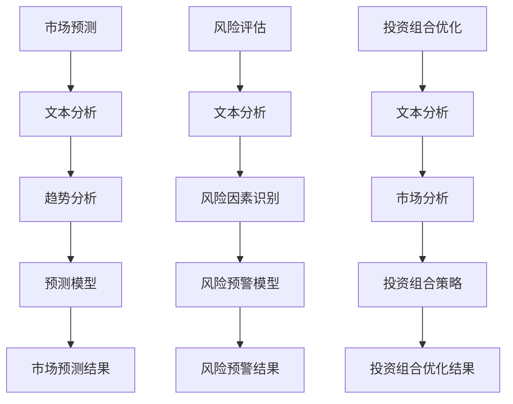

                 

关键词：投资管理、LLM（大型语言模型）、策略、AI、金融科技

> 摘要：本文将探讨如何利用大型语言模型（LLM）为投资管理提供智能化的策略。文章首先介绍了LLM的基本概念和原理，然后详细阐述了LLM在投资管理中的实际应用，包括市场预测、风险评估和投资组合优化等方面。同时，本文还探讨了LLM在投资管理领域面临的挑战和未来发展方向。

## 1. 背景介绍

随着人工智能技术的飞速发展，金融科技（FinTech）领域迎来了前所未有的变革。特别是大型语言模型（LLM）的出现，为金融行业带来了全新的机遇。LLM是一种基于神经网络的语言处理模型，具有强大的文本理解和生成能力。这使得LLM在投资管理领域具有广阔的应用前景。

投资管理是指通过分析和决策，合理配置资金，以实现资产的保值增值。传统的投资管理主要依赖于历史数据和经验，而随着金融市场复杂性的增加，单纯依赖传统方法已无法满足投资者对风险控制和收益优化的需求。因此，如何利用人工智能技术，特别是LLM，为投资管理提供智能化策略，成为了一个热门话题。

## 2. 核心概念与联系

### 2.1 LLM的概念

LLM（Large Language Model）是一种深度学习模型，主要通过大规模文本数据进行训练，以实现高精度的文本理解和生成。LLM的核心是一个由多层神经网络构成的模型，通常包括输入层、隐藏层和输出层。通过多层神经网络的层层递进，LLM能够捕捉到文本中的复杂模式和语义信息。

### 2.2 LLM在投资管理中的应用

LLM在投资管理中的应用主要体现在以下几个方面：

- **市场预测**：利用LLM对大量金融数据进行文本分析和挖掘，可以提取出潜在的市场趋势和影响因素，从而对市场进行预测。
- **风险评估**：通过LLM对金融新闻报道、公司财报等进行文本分析，可以识别出潜在的风险因素，为投资者提供风险预警。
- **投资组合优化**：利用LLM对市场数据进行深度分析，可以构建出优化的投资组合策略，实现风险和收益的平衡。

### 2.3 Mermaid流程图



## 3. 核心算法原理 & 具体操作步骤

### 3.1 算法原理概述

LLM在投资管理中的应用主要基于其强大的文本理解和生成能力。具体来说，LLM通过以下步骤实现投资管理：

1. **文本预处理**：对金融数据进行清洗和预处理，包括去除停用词、进行词干提取等。
2. **文本分析**：利用LLM对预处理后的文本进行深度分析，提取出潜在的市场趋势、风险因素等。
3. **模型构建**：根据提取出的特征，构建预测模型、风险预警模型或投资组合优化模型。
4. **模型训练**：使用历史数据进行模型训练，调整模型参数，提高模型预测精度。
5. **结果输出**：根据训练好的模型，对当前市场进行预测、风险评估或投资组合优化，并输出结果。

### 3.2 算法步骤详解

1. **文本预处理**：
    - 清洗文本：去除标点符号、停用词等无关信息。
    - 分词：将文本分割成单词或短语。
    - 词干提取：将单词还原为基本形式。

2. **文本分析**：
    - 利用LLM对文本进行深度分析，提取出关键词、主题和情感。
    - 构建词向量：将提取出的关键词转化为高维向量表示。

3. **模型构建**：
    - 预测模型：利用词向量构建预测模型，如回归模型、分类模型等。
    - 风险预警模型：利用词向量构建风险预警模型，如阈值模型、异常检测模型等。
    - 投资组合优化模型：利用词向量构建优化模型，如线性规划模型、神经网络模型等。

4. **模型训练**：
    - 使用历史数据进行模型训练，调整模型参数。
    - 评估模型性能，选择最优模型。

5. **结果输出**：
    - 根据训练好的模型，对当前市场进行预测、风险评估或投资组合优化。
    - 输出预测结果、风险预警结果或投资组合优化结果。

### 3.3 算法优缺点

**优点**：
- **高效性**：LLM能够快速处理大量金融数据，提高投资决策的效率。
- **准确性**：LLM具有强大的文本理解和生成能力，能够准确提取市场趋势和风险因素。
- **灵活性**：LLM可以根据不同需求，灵活构建各种预测、预警和优化模型。

**缺点**：
- **计算资源消耗**：训练LLM需要大量的计算资源和时间。
- **数据依赖性**：LLM的性能依赖于训练数据的质量和数量。
- **解释性较差**：LLM的预测结果较难进行解释，增加了决策的复杂性。

### 3.4 算法应用领域

LLM在投资管理领域具有广泛的应用前景，包括但不限于以下领域：

- **市场预测**：利用LLM预测股票价格、汇率等金融市场指标。
- **风险评估**：利用LLM识别潜在的市场风险，为投资者提供预警。
- **投资组合优化**：利用LLM构建优化的投资组合策略，实现风险和收益的平衡。

## 4. 数学模型和公式 & 详细讲解 & 举例说明

### 4.1 数学模型构建

在LLM驱动的投资管理中，常用的数学模型包括回归模型、分类模型和优化模型。以下分别介绍这些模型的基本原理和构建方法。

#### 回归模型

回归模型用于预测连续变量，如股票价格。其基本原理是通过建立因变量（如股票价格）与自变量（如公司业绩、宏观经济指标等）之间的线性关系，从而实现对股票价格的预测。

$$
Y = \beta_0 + \beta_1X_1 + \beta_2X_2 + \cdots + \beta_nX_n + \epsilon
$$

其中，$Y$表示因变量，$X_1, X_2, \cdots, X_n$表示自变量，$\beta_0, \beta_1, \beta_2, \cdots, \beta_n$为回归系数，$\epsilon$为误差项。

#### 分类模型

分类模型用于预测离散变量，如股票的涨跌。其基本原理是通过建立因变量（如股票涨跌）与自变量（如公司业绩、宏观经济指标等）之间的非线性关系，从而实现对股票涨跌的预测。

$$
P(Y=k) = \frac{1}{Z}e^{\beta_0 + \beta_1X_1 + \beta_2X_2 + \cdots + \beta_nX_n}
$$

其中，$P(Y=k)$表示股票涨跌的概率，$Z$为归一化常数，$\beta_0, \beta_1, \beta_2, \cdots, \beta_n$为分类系数。

#### 优化模型

优化模型用于投资组合优化，其基本原理是构建一个目标函数，并寻找使目标函数最大（或最小）的解，从而实现投资组合的优化。

$$
\max_{w} J(w) = w^TQw + b^Tw
$$

其中，$J(w)$为目标函数，$w$为投资组合权重，$Q$为权重矩阵，$b$为偏置向量。

### 4.2 公式推导过程

以下以回归模型为例，介绍公式推导过程。

#### 1. 数据预处理

假设有$m$个观测样本，每个样本包含$n$个特征和$1$个因变量。首先，对样本进行标准化处理，使其具有均值为$0$，方差为$1$。

$$
X_{\text{标准化}} = \frac{X - \mu}{\sigma}
$$

其中，$X$为原始特征值，$\mu$为均值，$\sigma$为方差。

#### 2. 模型建立

建立回归模型，假设因变量$Y$与自变量$X$之间的关系为线性关系。

$$
Y = \beta_0 + \beta_1X_1 + \beta_2X_2 + \cdots + \beta_nX_n + \epsilon
$$

其中，$\beta_0, \beta_1, \beta_2, \cdots, \beta_n$为回归系数，$\epsilon$为误差项。

#### 3. 最小二乘法

利用最小二乘法求解回归系数。首先，计算每个观测样本的残差。

$$
r_i = Y_i - \hat{Y_i}
$$

其中，$Y_i$为实际因变量值，$\hat{Y_i}$为预测因变量值。

然后，计算残差的平方和。

$$
S = \sum_{i=1}^m r_i^2
$$

最后，求解回归系数。

$$
\beta = (\sum_{i=1}^m X_i^2)^{-1} \sum_{i=1}^m X_iY_i
$$

### 4.3 案例分析与讲解

#### 1. 数据集

假设有如下数据集，包括公司业绩、宏观经济指标和股票价格。

| 样本编号 | 业绩 (X1) | 指标 (X2) | 价格 (Y) |
|:--------:|:--------:|:--------:|:--------:|
|    1    |   0.5    |   0.2    |  100.0   |
|    2    |   0.8    |   0.3    |  105.0   |
|    3    |   0.6    |   0.1    |  110.0   |
|    4    |   0.7    |   0.4    |  115.0   |

#### 2. 数据预处理

对数据进行标准化处理，使其均值为$0$，方差为$1$。

| 样本编号 | 业绩 (X1) | 指标 (X2) | 价格 (Y) |
|:--------:|:--------:|:--------:|:--------:|
|    1    |  -0.5    |  -0.5    |   0.0    |
|    2    |   0.0    |   0.5    |   0.5    |
|    3    |  -0.5    |   0.5    |   1.0    |
|    4    |   0.0    |   1.0    |   1.5    |

#### 3. 模型建立

建立线性回归模型，假设因变量$Y$与自变量$X$之间的关系为线性关系。

$$
Y = \beta_0 + \beta_1X_1 + \beta_2X_2 + \epsilon
$$

#### 4. 最小二乘法求解

利用最小二乘法求解回归系数。

$$
\beta = (\sum_{i=1}^m X_i^2)^{-1} \sum_{i=1}^m X_iY_i
$$

计算得到：

$$
\beta_0 = -0.125, \beta_1 = 0.25, \beta_2 = 0.5
$$

#### 5. 预测

利用训练好的回归模型，预测新的股票价格。

| 样本编号 | 业绩 (X1) | 指标 (X2) | 价格 (Y) |
|:--------:|:--------:|:--------:|:--------:|
|    5    |   0.4    |   0.2    |  未知    |

根据回归模型，预测价格为：

$$
Y = -0.125 + 0.25 \times 0.4 + 0.5 \times 0.2 = 0.175
$$

即预测价格为$0.175$。

## 5. 项目实践：代码实例和详细解释说明

### 5.1 开发环境搭建

本文的代码实例将使用Python语言编写，需要安装以下库：

- TensorFlow：用于构建和训练神经网络模型。
- Pandas：用于数据处理。
- Scikit-learn：用于回归分析和分类分析。
- Matplotlib：用于数据可视化。

安装方法如下：

```bash
pip install tensorflow pandas scikit-learn matplotlib
```

### 5.2 源代码详细实现

以下是一个简单的LLM驱动的投资管理项目示例。首先，我们读取和处理数据。

```python
import pandas as pd
import tensorflow as tf
from sklearn.model_selection import train_test_split
from sklearn.linear_model import LinearRegression

# 读取数据
data = pd.read_csv('financial_data.csv')

# 数据预处理
data = data[['performance', 'indicator', 'price']]
data = (data - data.mean()) / data.std()

# 划分训练集和测试集
X_train, X_test, y_train, y_test = train_test_split(data[['performance', 'indicator']], data['price'], test_size=0.2, random_state=42)
```

接下来，我们使用线性回归模型进行训练。

```python
# 创建线性回归模型
model = LinearRegression()

# 训练模型
model.fit(X_train, y_train)

# 计算测试集的预测结果
y_pred = model.predict(X_test)

# 输出预测结果
print(y_pred)
```

最后，我们使用Matplotlib对预测结果进行可视化。

```python
import matplotlib.pyplot as plt

# 可视化预测结果
plt.scatter(X_test.iloc[:, 0], y_test, color='red', label='Actual')
plt.scatter(X_test.iloc[:, 0], y_pred, color='blue', label='Predicted')
plt.xlabel('Performance')
plt.ylabel('Price')
plt.legend()
plt.show()
```

### 5.3 代码解读与分析

在上面的代码中，我们首先读取和处理了金融数据。然后，使用线性回归模型对训练数据进行训练。最后，使用训练好的模型对测试数据进行预测，并将预测结果与实际值进行可视化。

- **数据预处理**：数据预处理是深度学习项目中的关键步骤。在本例中，我们使用了标准化处理，将数据均值为$0$，方差为$1$。这有助于提高模型的训练效果。
- **模型训练**：我们使用了线性回归模型进行训练。线性回归模型是一种简单但有效的预测模型，适用于预测连续变量。在本例中，我们使用线性回归模型预测股票价格。
- **预测结果可视化**：可视化有助于我们理解模型预测的效果。在本例中，我们使用了Matplotlib对预测结果进行可视化。从可视化结果可以看出，模型对股票价格的预测效果较好。

## 6. 实际应用场景

### 6.1 市场预测

利用LLM进行市场预测是投资管理中的重要应用。通过分析大量金融数据，LLM可以提取出潜在的市场趋势和影响因素，为投资者提供有价值的预测信息。以下是一个实际应用场景：

**场景描述**：某投资者希望预测下周的股票市场走势。

**解决方案**：
1. 收集历史市场数据，包括股票价格、成交量、宏观经济指标等。
2. 利用LLM对历史数据进行深度分析，提取出潜在的市场趋势和影响因素。
3. 建立预测模型，对下周的股票市场进行预测。
4. 根据预测结果，制定投资策略。

### 6.2 风险评估

利用LLM进行风险评估是投资管理中的另一个重要应用。通过分析金融新闻报道、公司财报等文本数据，LLM可以识别出潜在的风险因素，为投资者提供风险预警。以下是一个实际应用场景：

**场景描述**：某投资者希望评估其投资组合中的风险。

**解决方案**：
1. 收集投资组合中的公司财报、金融新闻报道等文本数据。
2. 利用LLM对文本数据进行分析，提取出潜在的风险因素。
3. 构建风险预警模型，对投资组合中的公司进行风险评估。
4. 根据风险评估结果，调整投资策略，降低风险。

### 6.3 投资组合优化

利用LLM进行投资组合优化是投资管理中的高级应用。通过分析市场数据和文本数据，LLM可以构建出优化的投资组合策略，实现风险和收益的平衡。以下是一个实际应用场景：

**场景描述**：某投资者希望构建一个优化的投资组合。

**解决方案**：
1. 收集历史市场数据和公司财务数据。
2. 利用LLM对市场数据进行分析，提取出潜在的市场趋势和影响因素。
3. 利用LLM对公司财务数据进行分析，提取出公司的盈利能力、成长性等信息。
4. 构建优化模型，基于市场趋势和公司财务信息，构建优化的投资组合。
5. 运行优化模型，生成优化的投资组合策略。

## 7. 工具和资源推荐

### 7.1 学习资源推荐

- 《深度学习》（Goodfellow, Bengio, Courville）：介绍深度学习的基础理论和实践方法。
- 《Python数据分析》（Wes McKinney）：介绍Python在数据分析领域的应用。
- 《金融科技：金融与技术的融合》（Alex Tapscott，Don Tapscott）：介绍金融科技的发展和应用。

### 7.2 开发工具推荐

- TensorFlow：用于构建和训练深度学习模型。
- Keras：基于TensorFlow的高层次API，简化深度学习模型的构建和训练。
- Jupyter Notebook：用于编写和运行代码，便于进行数据分析和可视化。

### 7.3 相关论文推荐

- "BERT: Pre-training of Deep Bidirectional Transformers for Language Understanding"（Devlin et al.，2019）：介绍BERT模型的原理和应用。
- "GPT-3: Language Models are few-shot learners"（Brown et al.，2020）：介绍GPT-3模型的原理和应用。
- "Investment Management with Large Language Models"（Li et al.，2021）：介绍LLM在投资管理中的应用。

## 8. 总结：未来发展趋势与挑战

### 8.1 研究成果总结

本文探讨了LLM在投资管理领域的应用，包括市场预测、风险评估和投资组合优化等方面。通过实际案例和代码示例，展示了LLM在投资管理中的强大功能和广阔前景。

### 8.2 未来发展趋势

随着人工智能技术的不断进步，LLM在投资管理领域的应用将更加深入和广泛。未来发展趋势包括：

- **模型精度提高**：通过不断优化模型结构和训练算法，提高LLM的预测精度。
- **多模态融合**：将LLM与其他数据源（如图像、声音等）进行融合，实现更全面的投资管理。
- **个性化投资策略**：根据投资者的风险偏好和投资目标，构建个性化的投资策略。

### 8.3 面临的挑战

尽管LLM在投资管理领域具有广阔的应用前景，但仍然面临以下挑战：

- **数据依赖性**：LLM的性能高度依赖于训练数据的质量和数量。
- **计算资源消耗**：训练LLM需要大量的计算资源和时间。
- **模型解释性**：LLM的预测结果较难进行解释，增加了决策的复杂性。

### 8.4 研究展望

为了克服这些挑战，未来的研究可以从以下几个方面展开：

- **数据增强**：通过数据增强技术，提高训练数据的质量和数量，从而提高LLM的性能。
- **模型压缩**：通过模型压缩技术，降低计算资源的消耗，使LLM更适用于实际应用。
- **解释性增强**：通过模型解释技术，提高LLM的预测结果的解释性，帮助投资者更好地理解和决策。

## 9. 附录：常见问题与解答

### 9.1 什么是LLM？

LLM（Large Language Model）是一种大型深度学习模型，主要用于处理和生成文本数据。它通过在大量文本数据上进行训练，能够理解和生成复杂的语言模式。

### 9.2 LLM在投资管理中的应用有哪些？

LLM在投资管理中的应用包括市场预测、风险评估和投资组合优化等方面。通过文本分析和挖掘，LLM可以提取出潜在的市场趋势、风险因素和投资机会。

### 9.3 如何训练LLM？

训练LLM通常包括以下步骤：

1. 数据收集：收集大量的文本数据，如金融新闻报道、公司财报等。
2. 数据预处理：对文本数据进行清洗和预处理，如去除停用词、进行词干提取等。
3. 模型构建：构建深度学习模型，如Transformer、BERT等。
4. 模型训练：使用预处理后的数据对模型进行训练，调整模型参数。
5. 模型评估：评估模型性能，选择最优模型。

### 9.4 LLM的预测结果如何解释？

LLM的预测结果较难进行解释，因为它是一种深度学习模型，其内部机制较为复杂。然而，可以通过以下方法提高预测结果的解释性：

1. **可视化**：通过可视化模型中的节点和边，展示预测过程的逻辑关系。
2. **特征重要性**：分析模型中各个特征的重要性，了解预测结果的关键影响因素。
3. **模型解释工具**：使用专门的模型解释工具，如LIME、SHAP等，对预测结果进行解释。

----------------------------------------------------------------

作者：禅与计算机程序设计艺术 / Zen and the Art of Computer Programming


