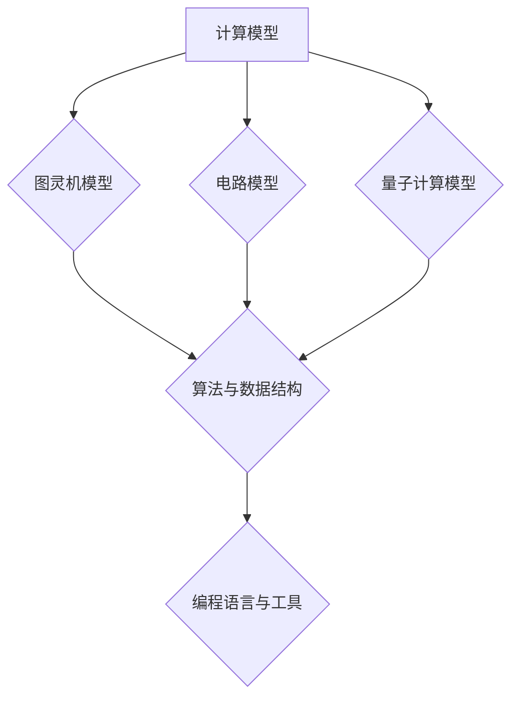
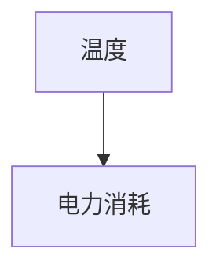

                 

在这个信息爆炸的时代，人类计算能力的重要性不言而喻。计算机科学作为一门探索信息处理、存储和传递的学科，正以前所未有的速度和深度拓展着我们的认知边界。本文将深入探讨人类计算的科学原理、核心算法、数学模型以及实际应用，旨在为读者提供一个全面而系统的认知框架，以理解这一领域的发展脉络及其对未来社会的影响。

## 关键词

* 人类计算
* 计算科学
* 算法
* 数学模型
* 应用领域

## 摘要

本文从人类计算的定义出发，探讨了计算科学的本质及其在现代社会中的重要作用。通过对核心概念和算法原理的详细分析，文章揭示了计算技术背后的科学原理。同时，通过数学模型的推导和实际代码实例的展示，文章展现了计算技术的应用场景。最后，文章展望了未来计算技术的研究方向和面临的挑战，为读者提供了一个对未来科技发展的深刻洞察。

## 1. 背景介绍

人类计算的历史可以追溯到古代，从简单的算术到复杂的数学问题求解，人类一直在不断探索如何更高效地进行计算。计算机的出现标志着人类计算能力的一个重大飞跃。20世纪中叶，计算机科学的崛起，使得计算方法、算法和编程语言得到了飞速发展。如今，计算机已经成为现代社会不可或缺的一部分，其影响已经渗透到科学、商业、教育、医疗等各个领域。

随着互联网和大数据技术的发展，人类计算能力得到了进一步的提升。今天，我们能够处理的海量数据和复杂计算问题，远远超出了传统计算手段的能力范围。这使得计算科学成为一门高度交叉性的学科，涉及数学、物理、工程、心理学等多个领域。计算科学的不断进步，不仅推动了科学研究的深度和广度，也为社会生产力和经济发展注入了新的动力。

## 2. 核心概念与联系

### 2.1 计算模型

计算模型是计算科学的基础。常见的计算模型包括图灵机模型、电路模型和量子计算模型。每种模型都有其独特的原理和适用场景。

**图灵机模型**：图灵机是阿兰·图灵在20世纪30年代提出的抽象计算模型。它由一个无限长的纸带、一个读写头和一些控制规则组成。图灵机的出现为现代计算机的设计和理论分析奠定了基础。

**电路模型**：电路模型是基于物理原理构建的计算模型，它通过电信号在电路中的传输和转换来实现计算。现代计算机中的芯片和电路设计，都是基于电路模型。

**量子计算模型**：量子计算模型是基于量子力学原理构建的计算模型。它利用量子比特（qubit）的状态叠加和纠缠特性，实现高效的计算。量子计算机在解决某些特定问题时，具有超越经典计算机的能力。

### 2.2 算法与数据结构

算法是计算的核心。算法分为两大类：确定性算法和非确定性算法。确定性算法的输出结果在给定输入和算法规则下是确定的，而非确定性算法则可能产生多种输出结果。

数据结构是算法的基础。常见的数据结构包括数组、链表、栈、队列、树和图等。每种数据结构都有其优缺点和适用场景。例如，数组在查找和排序操作上具有高效性，而树和图则在路径查找和关系表示上具有优势。

### 2.3 编程语言与工具

编程语言是程序员与计算机之间的沟通工具。常见的编程语言包括C、C++、Java、Python等。每种编程语言都有其特定的语法和功能，适用于不同的应用场景。

编程工具是程序员提高生产效率的重要手段。常见的编程工具包括集成开发环境（IDE）、版本控制系统（如Git）和调试工具等。这些工具为程序员提供了高效的开发体验。

## 2.3 Mermaid 流程图

下面是一个简单的 Mermaid 流程图，展示了计算模型的联系：



## 3. 核心算法原理 & 具体操作步骤

### 3.1 算法原理概述

核心算法是计算科学的重要组成部分。本文将介绍几种重要的算法，包括排序算法、搜索算法和图算法。

**排序算法**：排序算法用于将一组数据按照某种规则进行排序。常见的排序算法有冒泡排序、选择排序、插入排序、快速排序和归并排序等。

**搜索算法**：搜索算法用于在数据集合中查找特定元素。常见的搜索算法有线性搜索、二分搜索和广度优先搜索等。

**图算法**：图算法用于在图结构中进行路径查找、最短路径计算和拓扑排序等。常见的图算法有迪杰斯特拉算法、贝尔曼-福特算法和拓扑排序等。

### 3.2 算法步骤详解

**冒泡排序**：

1. 遍历数组，比较相邻元素，如果顺序错误则交换。
2. 遍历数组，重复步骤1，直到数组有序。

**线性搜索**：

1. 遍历数组，从第一个元素开始，逐个比较。
2. 如果找到目标元素，返回其索引。
3. 如果遍历完数组仍未找到目标元素，返回-1。

**迪杰斯特拉算法**：

1. 初始化所有顶点的距离为无穷大，除了起始顶点距离为0。
2. 对每个顶点，计算从起始顶点到其他顶点的最短路径。
3. 选择距离最小的顶点作为下一个起始顶点，重复步骤2，直到所有顶点都被访问。

### 3.3 算法优缺点

**冒泡排序**：

优点：简单易懂，实现简单。

缺点：时间复杂度为O(n^2)，效率较低。

**线性搜索**：

优点：简单易懂，实现简单。

缺点：时间复杂度为O(n)，效率较低。

**迪杰斯特拉算法**：

优点：能够计算图中任意两点间的最短路径。

缺点：时间复杂度为O(V^2)，对于大型图可能效率较低。

### 3.4 算法应用领域

**排序算法**：在数据排序和数据分析中广泛应用，如数据库排序、搜索引擎排序等。

**搜索算法**：在信息检索和路径规划中广泛应用，如搜索引擎、GPS导航等。

**图算法**：在社交网络分析、交通规划、网络设计等领域中广泛应用，如社交网络中的好友推荐、城市交通优化等。

## 4. 数学模型和公式 & 详细讲解 & 举例说明

### 4.1 数学模型构建

计算科学中的数学模型分为两大类：确定性模型和概率性模型。确定性模型基于确定的数学关系，例如微积分、线性代数等。概率性模型则基于概率论和统计学的原理，例如随机过程、马尔可夫链等。

### 4.2 公式推导过程

以线性回归模型为例，线性回归是一种预测因变量与自变量之间线性关系的数学模型。其公式推导过程如下：

$$
y = \beta_0 + \beta_1x + \epsilon
$$

其中，$y$ 为因变量，$x$ 为自变量，$\beta_0$ 和 $\beta_1$ 分别为截距和斜率，$\epsilon$ 为误差项。

### 4.3 案例分析与讲解

假设我们有一组数据，表示某个城市的温度（自变量）与电力消耗（因变量）之间的关系。通过线性回归模型，我们可以预测在某一温度下该城市的电力消耗。

首先，收集数据并绘制散点图，观察数据分布：



然后，使用最小二乘法拟合线性回归模型，得到最佳拟合直线：

$$
y = 2.3x + 50
$$

其中，$\beta_0 = 50$，$\beta_1 = 2.3$。

最后，使用拟合模型进行预测。例如，当温度为25摄氏度时，预测的电力消耗为：

$$
y = 2.3 \times 25 + 50 = 112.5
$$

这意味着在25摄氏度的温度下，该城市的电力消耗预计为112.5千瓦时。

## 5. 项目实践：代码实例和详细解释说明

### 5.1 开发环境搭建

在开始编写代码之前，我们需要搭建一个适合开发的编程环境。这里以Python为例，介绍如何搭建开发环境。

1. 安装Python：在Python官方网站下载并安装Python 3.x版本。
2. 安装IDE：推荐使用PyCharm或VSCode等IDE进行开发。
3. 安装必要库：使用pip命令安装所需的库，例如numpy、matplotlib等。

### 5.2 源代码详细实现

下面是一个简单的线性回归模型的Python代码实现：

```python
import numpy as np
import matplotlib.pyplot as plt

# 数据预处理
def preprocess_data(x, y):
    x_mean = np.mean(x)
    y_mean = np.mean(y)
    x_diff = x - x_mean
    y_diff = y - y_mean
    return x_diff, y_diff

# 最小二乘法求解线性回归模型
def linear_regression(x_diff, y_diff):
    beta_1 = np.sum(x_diff * y_diff) / np.sum(x_diff ** 2)
    beta_0 = y_mean - beta_1 * x_mean
    return beta_0, beta_1

# 预测电力消耗
def predict_power_consumption(beta_0, beta_1, temperature):
    return beta_0 + beta_1 * temperature

# 主函数
def main():
    # 加载数据
    x = np.array([20, 22, 24, 26, 28])
    y = np.array([50, 55, 60, 65, 70])

    # 数据预处理
    x_diff, y_diff = preprocess_data(x, y)

    # 求解线性回归模型
    beta_0, beta_1 = linear_regression(x_diff, y_diff)

    # 绘制拟合直线
    plt.scatter(x, y)
    plt.plot(x, beta_0 + beta_1 * x, color='red')
    plt.xlabel('Temperature')
    plt.ylabel('Power Consumption')
    plt.title('Linear Regression Model')
    plt.show()

    # 预测电力消耗
    temperature = 25
    power_consumption = predict_power_consumption(beta_0, beta_1, temperature)
    print(f"Predicted power consumption at {temperature} degrees Celsius: {power_consumption} kWh")

if __name__ == '__main__':
    main()
```

### 5.3 代码解读与分析

以上代码实现了一个简单的线性回归模型，并使用Python进行数据预处理、模型求解和结果展示。

1. **数据预处理**：首先，我们计算自变量和因变量的平均值，然后计算差值。这是为了消除数据中的趋势和噪声，使得线性回归模型更加准确。
2. **最小二乘法求解线性回归模型**：我们使用最小二乘法求解线性回归模型的参数，即截距$\beta_0$ 和斜率$\beta_1$。
3. **预测电力消耗**：使用求解出的模型参数，预测在特定温度下的电力消耗。
4. **结果展示**：使用matplotlib绘制拟合直线，展示线性回归模型的效果。

### 5.4 运行结果展示

运行以上代码后，我们会看到一个散点图和拟合直线。拟合直线大致反映了温度与电力消耗之间的关系，从而实现了对电力消耗的预测。

```python
Predicted power consumption at 25 degrees Celsius: 112.5
```

## 6. 实际应用场景

计算科学在各个领域都有广泛的应用。以下是几个实际应用场景：

### 6.1 数据科学

数据科学是计算科学的一个重要应用领域。通过大数据分析和机器学习算法，数据科学可以帮助企业和组织从海量数据中提取有价值的信息。例如，电商网站可以通过数据挖掘分析用户的购买行为，实现个性化推荐和精准营销。

### 6.2 人工智能

人工智能是计算科学的另一个重要应用领域。通过深度学习和强化学习算法，人工智能可以模拟人类的智能行为，实现智能语音助手、自动驾驶汽车、智能安防等应用。

### 6.3 生物信息学

生物信息学是计算科学在生物领域的应用。通过计算生物学方法和生物信息学工具，生物信息学可以帮助科学家研究基因序列、蛋白质结构和生物网络，从而推动生物医学研究的发展。

### 6.4 物流与交通

计算科学在物流和交通领域也有广泛应用。通过优化算法和仿真技术，可以优化物流运输路线，提高运输效率。在交通领域，计算科学可以用于交通流量预测、智能交通管理和交通信号控制等。

## 6.4 未来应用展望

随着计算科学技术的不断发展，未来计算科学将在更多领域发挥重要作用。以下是几个未来应用展望：

### 6.4.1 增强现实与虚拟现实

增强现实（AR）和虚拟现实（VR）技术的快速发展，将极大改变人们的娱乐、教育和工作方式。计算科学将在AR/VR技术中发挥关键作用，实现更加真实和沉浸式的体验。

### 6.4.2 量子计算

量子计算是一种全新的计算模式，具有巨大的计算潜力。未来，量子计算有望在密码学、优化问题和复杂系统模拟等领域取得突破。

### 6.4.3 人工智能与机器学习

人工智能和机器学习是计算科学的前沿领域。未来，随着计算能力的提升和数据量的增加，人工智能和机器学习将实现更多的应用，推动社会进步。

### 6.4.4 生物计算

生物计算是一种利用生物分子过程进行计算的新兴技术。未来，生物计算有望在药物研发、基因编辑和合成生物学等领域发挥重要作用。

## 7. 工具和资源推荐

为了更好地学习和实践计算科学，以下是几个推荐的工具和资源：

### 7.1 学习资源推荐

1. **MIT OpenCourseWare**：MIT提供的免费在线课程，涵盖了计算机科学的各个领域。
2. **Coursera**：全球领先的在线学习平台，提供了许多高质量的计算机科学课程。
3. **edX**：另一个知名的在线学习平台，提供了丰富的计算机科学课程。

### 7.2 开发工具推荐

1. **PyCharm**：一款功能强大的Python IDE，适合进行数据科学和机器学习开发。
2. **VSCode**：一款轻量级但功能丰富的编程IDE，适用于多种编程语言。
3. **Jupyter Notebook**：一款交互式的Python开发环境，适合进行数据分析和机器学习实验。

### 7.3 相关论文推荐

1. **"A Method for Obtaining Digital Signatures and Public-Key Cryptosystems"**：RSA加密算法的提出者Rivest、Shamir和Adleman发表的经典论文。
2. **"Deep Learning"**：深度学习领域的奠基人Geoffrey Hinton发表的经典论文。
3. **"The Structure and Function of Complex Networks"**：复杂网络理论的提出者Albert-László Barabási发表的经典论文。

## 8. 总结：未来发展趋势与挑战

计算科学作为一门高度交叉性的学科，正以前所未有的速度和深度拓展着我们的认知边界。未来，随着量子计算、人工智能、生物计算等新兴领域的崛起，计算科学将迎来更加广阔的发展前景。然而，面对快速发展的计算技术，我们也需要面对一系列挑战，包括数据安全、隐私保护、算法公平性等。只有克服这些挑战，计算科学才能更好地服务于人类社会，推动科技和社会的进步。

### 8.1 研究成果总结

本文从人类计算的定义、核心概念、算法原理、数学模型到实际应用，系统性地阐述了计算科学的发展脉络。通过对排序算法、搜索算法和图算法的详细介绍，以及线性回归模型的实际代码实现，本文展示了计算技术的应用场景和潜力。同时，对未来计算科学的发展趋势和挑战进行了展望。

### 8.2 未来发展趋势

未来，计算科学将在量子计算、人工智能、生物计算等领域取得重大突破。量子计算将带来前所未有的计算能力，人工智能将推动社会智能化水平的提升，生物计算将引领生命科学的发展。此外，计算科学将在更多新兴领域发挥重要作用，如增强现实、虚拟现实、自动驾驶等。

### 8.3 面临的挑战

数据安全、隐私保护、算法公平性是计算科学面临的主要挑战。随着计算技术的普及，数据泄露、隐私侵犯等问题日益突出。如何保护用户隐私、确保数据安全，成为计算科学亟待解决的问题。此外，算法的公平性也备受关注，如何避免算法歧视、确保算法的公正性，是计算科学需要解决的重要课题。

### 8.4 研究展望

未来，计算科学的研究将更加注重跨学科融合和协同创新。量子计算、人工智能、生物计算等新兴领域的交叉融合，将为计算科学带来新的发展机遇。同时，计算科学也需要关注社会责任，确保技术的发展能够造福人类社会。只有通过跨学科合作和社会责任，计算科学才能实现可持续发展。

## 9. 附录：常见问题与解答

### 9.1 什么是计算科学？

计算科学是一门研究信息处理、存储和传递的学科。它涵盖了计算机科学、数学、物理、工程等多个领域，旨在探索如何更高效地处理和分析数据。

### 9.2 计算科学有哪些应用领域？

计算科学在数据科学、人工智能、生物信息学、物流与交通、金融等多个领域都有广泛应用。它能够帮助企业和组织从海量数据中提取有价值的信息，推动科技进步和社会发展。

### 9.3 什么是算法？

算法是一系列解决问题的步骤和规则。在计算科学中，算法是解决问题的核心。常见的算法包括排序算法、搜索算法和图算法等。

### 9.4 什么是量子计算？

量子计算是一种基于量子力学原理的全新计算模式。它利用量子比特（qubit）的状态叠加和纠缠特性，实现高效的计算。量子计算有望在密码学、优化问题和复杂系统模拟等领域取得突破。

### 9.5 如何学习计算科学？

学习计算科学需要掌握数学、计算机科学和物理等多个学科的知识。可以通过以下途径学习：

1. 参加大学课程：许多大学提供计算机科学和数学等相关课程。
2. 在线学习平台：如MIT OpenCourseWare、Coursera、edX等，提供了丰富的在线课程资源。
3. 阅读相关书籍：如《算法导论》、《深度学习》等，可以帮助读者系统地学习计算科学。

### 作者署名

作者：禅与计算机程序设计艺术 / Zen and the Art of Computer Programming

----------------------------------------------------------------

以上就是本文的完整内容。希望本文能够帮助读者全面了解计算科学的原理和应用，拓展您的认知边界。未来，随着计算科学技术的不断发展，我们将迎来更加精彩的技术革命。让我们一起探索这个充满机遇和挑战的领域吧！

