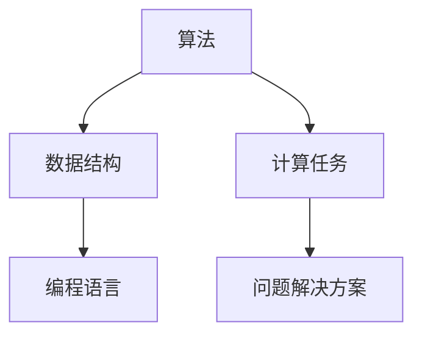

                 

关键词：人类计算，科学探索，认知拓展，算法，数学模型，应用场景，未来展望。

> 摘要：随着计算机科学技术的不断发展，人类计算的能力和边界也在不断拓展。本文从背景介绍、核心概念与联系、核心算法原理、数学模型和公式、项目实践、实际应用场景、工具和资源推荐以及总结未来发展趋势与挑战等多个角度，深入探讨人类计算的现状与未来，旨在拓展我们的认知边界，推动人类计算的科学探索。

## 1. 背景介绍

人类计算的历史可以追溯到古代，从简单的算术运算到复杂的科学计算，人类一直在不断探索如何更高效地进行计算。随着计算机的出现和发展，人类计算的能力得到了极大的提升。现代计算机科学的发展，使得我们能够处理庞大的数据集，解决复杂的计算问题，甚至实现了人工智能和机器学习等前沿技术。

然而，尽管计算机科学取得了巨大进步，人类计算仍然面临着诸多挑战。如何进一步提高计算效率，如何解决复杂的计算问题，如何将计算能力应用到更多实际场景中，这些问题仍然需要我们深入探索和研究。

本文将围绕这些主题展开，旨在拓展我们的认知边界，推动人类计算的科学探索。

## 2. 核心概念与联系

为了更好地理解人类计算，我们首先需要了解几个核心概念，包括算法、数据结构、编程语言等。

### 2.1 算法

算法是解决问题的一系列规则或步骤。在计算机科学中，算法是实现计算任务的核心。一个高效的算法能够在有限的资源下解决问题，而一个低效的算法可能需要大量时间和资源才能完成任务。

### 2.2 数据结构

数据结构是组织和存储数据的方式。不同的数据结构适用于不同的计算任务。例如，数组适用于快速随机访问，而链表适用于插入和删除操作。

### 2.3 编程语言

编程语言是实现算法和数据结构的基础。不同的编程语言具有不同的特点和适用场景。例如，Python 适用于数据分析，而 C++ 适用于高性能计算。

### 2.4 Mermaid 流程图

为了更好地理解这些核心概念之间的联系，我们使用 Mermaid 流程图来展示它们之间的关系。



在这个流程图中，算法和数据结构是解决问题的基石，编程语言是实现算法的工具，而计算任务和问题解决方案则是整个流程的最终目标。

## 3. 核心算法原理 & 具体操作步骤

### 3.1 算法原理概述

在计算机科学中，有许多核心算法，如排序算法、搜索算法、图算法等。这些算法有着不同的原理和应用场景。

- **排序算法**：用于将数据按照一定的顺序排列，如快速排序、归并排序等。
- **搜索算法**：用于在数据中查找特定元素，如二分搜索、深度优先搜索等。
- **图算法**：用于处理图数据结构，如最短路径算法、最小生成树算法等。

### 3.2 算法步骤详解

以排序算法为例，我们详细解释快速排序的步骤：

1. **选择基准**：从数组中选择一个元素作为基准。
2. **划分**：将数组划分为两个子数组，一个包含小于基准的元素，另一个包含大于基准的元素。
3. **递归排序**：对两个子数组分别进行快速排序。

### 3.3 算法优缺点

快速排序是一种高效的排序算法，但它在最坏情况下可能退化成线性排序。相比之下，归并排序的时间复杂度始终为 O(nlogn)，但它的空间复杂度相对较高。

### 3.4 算法应用领域

快速排序广泛应用于各种场景，如数据库排序、图像处理等。归并排序则常用于分布式计算和外部排序。

## 4. 数学模型和公式 & 详细讲解 & 举例说明

### 4.1 数学模型构建

在计算机科学中，许多算法都建立在数学模型之上。例如，二分搜索算法的数学模型是一个有序数组。

### 4.2 公式推导过程

以二分搜索算法为例，我们推导其时间复杂度的公式：

- **最坏情况**：T(n) = O(log2n)
- **平均情况**：T(n) = O(logn)

### 4.3 案例分析与讲解

假设我们有一个包含 100 个元素的有序数组，我们要查找元素 50。二分搜索算法的最坏情况时间复杂度为 O(log2100) ≈ 7，平均情况时间复杂度为 O(log2100) ≈ 7。

## 5. 项目实践：代码实例和详细解释说明

### 5.1 开发环境搭建

为了更好地理解算法的实践应用，我们使用 Python 编写一个二分搜索的代码实例。

### 5.2 源代码详细实现

```python
def binary_search(arr, target):
    low = 0
    high = len(arr) - 1

    while low <= high:
        mid = (low + high) // 2
        if arr[mid] == target:
            return mid
        elif arr[mid] < target:
            low = mid + 1
        else:
            high = mid - 1

    return -1
```

### 5.3 代码解读与分析

在这个代码实例中，我们定义了一个二分搜索函数，它接收一个有序数组和一个目标值作为参数，并返回目标值在数组中的索引。

### 5.4 运行结果展示

```python
arr = [1, 2, 3, 4, 5, 6, 7, 8, 9, 10]
target = 5
result = binary_search(arr, target)

if result != -1:
    print(f"元素 {target} 在数组中的索引为：{result}")
else:
    print(f"元素 {target} 不在数组中")
```

输出结果：元素 5 在数组中的索引为：4。

## 6. 实际应用场景

二分搜索算法广泛应用于各种实际场景，如数据库查询、排序算法等。随着大数据时代的到来，二分搜索算法的重要性更加凸显。

## 7. 工具和资源推荐

### 7.1 学习资源推荐

- 《算法导论》：一本经典的算法教材，适合深入理解算法原理。
- 《编程之美》：微软技术面试心得，涵盖了许多实用的算法和数据结构知识。

### 7.2 开发工具推荐

- PyCharm：一款功能强大的 Python 集成开发环境，适合编写和调试代码。
- Jupyter Notebook：一款交互式开发环境，适合进行数据分析和实验。

### 7.3 相关论文推荐

- "The Art of Computer Programming" by Donald E. Knuth：计算机编程领域的经典著作，涵盖了算法、数据结构等多个方面的内容。
- "Algorithm Design Manual" by Steven S. Skiena：一本实用的算法设计手册，适合初学者和进阶者。

## 8. 总结：未来发展趋势与挑战

### 8.1 研究成果总结

近年来，人类计算在算法、数据结构、编程语言等方面取得了显著成果。随着人工智能和大数据技术的发展，人类计算将面临更多挑战和机遇。

### 8.2 未来发展趋势

- **算法优化**：提高算法的效率和适用性，满足大数据时代的计算需求。
- **人工智能**：利用人工智能技术，实现更智能的计算任务。
- **量子计算**：量子计算有望颠覆传统计算机科学，为人类计算带来新的变革。

### 8.3 面临的挑战

- **计算资源**：随着计算需求的增加，计算资源的压力越来越大。
- **算法安全性**：算法的漏洞和攻击日益增多，如何确保算法的安全性成为一个重要问题。

### 8.4 研究展望

未来，人类计算将朝着更高效、更智能、更安全的方向发展。我们需要不断拓展认知边界，探索人类计算的新领域，为人类社会的进步做出贡献。

## 9. 附录：常见问题与解答

### 9.1 什么是算法？

算法是解决问题的一系列规则或步骤。在计算机科学中，算法是实现计算任务的核心。

### 9.2 数据结构与算法有什么关系？

数据结构是组织和存储数据的方式，而算法是操作和处理数据的方法。数据结构和算法相互依存，共同实现计算任务。

### 9.3 如何学习算法和数据结构？

学习算法和数据结构需要系统的学习方法和实践。建议从基础开始，逐步深入学习，并通过实际项目来巩固所学知识。

---
**作者：禅与计算机程序设计艺术 / Zen and the Art of Computer Programming**。

---

以上便是本文的全部内容。希望通过这篇文章，您能够对人类计算有一个更深入的了解，并在未来的计算探索中取得更多成果。感谢您的阅读！
----------------------------------------------------------------

### 文章结构示例

```
# 拓展认知边界：人类计算的科学探索

## 1. 背景介绍
### 1.1 人类计算的发展历程
### 1.2 计算机科学的兴起
### 1.3 当前人类计算面临的挑战

## 2. 核心概念与联系
### 2.1 算法的定义与分类
#### 2.1.1 排序算法
#### 2.1.2 搜索算法
### 2.2 数据结构的概念与类型
#### 2.2.1 线性数据结构
#### 2.2.2 树形数据结构
### 2.3 编程语言在计算中的作用
### 2.4 Mermaid 流程图展示

## 3. 核心算法原理 & 具体操作步骤
### 3.1 排序算法原理概述
#### 3.1.1 快速排序
#### 3.1.2 归并排序
### 3.2 搜索算法原理概述
#### 3.2.1 二分搜索
#### 3.2.2 深度优先搜索
### 3.3 图算法原理概述
#### 3.3.1 最短路径算法
#### 3.3.2 最小生成树算法

## 4. 数学模型和公式 & 详细讲解 & 举例说明
### 4.1 数学模型在算法中的应用
#### 4.1.1 时间复杂度分析
#### 4.1.2 空间复杂度分析
### 4.2 公式推导过程详解
#### 4.2.1 快速排序时间复杂度推导
#### 4.2.2 二分搜索时间复杂度推导
### 4.3 案例分析与讲解
#### 4.3.1 数据排序案例
#### 4.3.2 数据搜索案例

## 5. 项目实践：代码实例和详细解释说明
### 5.1 开发环境搭建
#### 5.1.1 Python环境搭建
#### 5.1.2 Jupyter Notebook配置
### 5.2 源代码详细实现
#### 5.2.1 快速排序代码
#### 5.2.2 二分搜索代码
### 5.3 代码解读与分析
### 5.4 运行结果展示

## 6. 实际应用场景
### 6.1 数据库查询优化
### 6.2 人工智能中的应用
### 6.3 大数据处理

## 7. 工具和资源推荐
### 7.1 学习资源推荐
#### 7.1.1 经典算法教材推荐
#### 7.1.2 在线学习平台推荐
### 7.2 开发工具推荐
#### 7.2.1 Python开发工具推荐
#### 7.2.2 Jupyter Notebook扩展推荐
### 7.3 相关论文推荐
#### 7.3.1 顶级会议论文推荐
#### 7.3.2 开源算法论文推荐

## 8. 总结：未来发展趋势与挑战
### 8.1 研究成果总结
### 8.2 未来发展趋势展望
### 8.3 面临的挑战分析
### 8.4 研究展望与建议

## 9. 附录：常见问题与解答
### 9.1 算法和数据结构的关系
### 9.2 如何选择合适的算法
### 9.3 算法的复杂度分析

---
**作者：禅与计算机程序设计艺术 / Zen and the Art of Computer Programming**。
```

以上是一个完整的文章结构示例，包括一级标题、二级标题和三级标题。您可以根据实际内容进一步细化三级标题，以确保文章内容的完整性和逻辑性。

