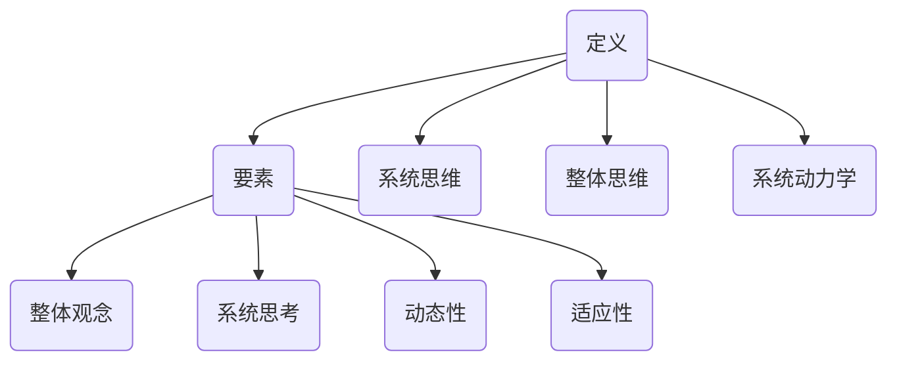

                 

关键词：体系思维、管理者、决策、复杂性、沟通、领导力、创新能力、战略规划

> 摘要：本文将探讨体系思维在管理者角色中的重要性。通过深入分析体系思维的定义、核心要素以及其对决策、沟通、领导力和创新能力的影响，本文旨在帮助管理者提升体系思维能力，从而更好地应对复杂的管理挑战，实现组织目标。

## 1. 背景介绍

在快速变化和高度复杂的信息时代，管理者面临着前所未有的挑战。企业环境中的不确定性、竞争压力和市场需求的变化，使得传统的管理方法逐渐失效。因此，管理者需要具备更高的思维能力和决策水平，以便在纷繁复杂的环境中做出明智的决策。

在这个背景下，体系思维作为一种强大的管理工具，逐渐引起了人们的关注。体系思维强调从整体和系统的角度看待问题，通过分析各个部分之间的相互关系，寻找最优的解决方案。对于管理者来说，拥有体系思维不仅能够帮助他们更好地理解和管理组织，还能够提高决策质量，增强领导力，推动创新。

本文将围绕体系思维的核心概念、对管理者的影响以及实际应用，展开深入探讨。希望通过本文的阐述，能够为管理者提供一些实用的策略和思维方法，以应对复杂的管理挑战。

## 2. 核心概念与联系

### 2.1 体系思维的定义

体系思维是一种系统思考的方法，它要求我们从整体和系统的角度来分析和理解问题。这种方法强调各个部分之间的相互关系和相互作用，而不是孤立地看待单个部分。体系思维不仅关注问题的表面现象，更注重深层次的因果关系。

### 2.2 体系思维的核心要素

体系思维的核心要素包括：

- **整体观念**：认识到整体大于部分之和，理解各个部分之间的相互依赖和影响。
- **系统思考**：通过模型和图示来分析和理解系统的结构和行为。
- **动态性**：理解系统是动态的，随着时间的推移，系统会经历各种变化。
- **适应性**：在复杂和不确定的环境中，能够灵活调整和适应。

### 2.3 体系思维与相关概念的关系

体系思维与系统思维、整体思维、系统动力学等概念密切相关。系统思维更强调逻辑性和结构性，整体思维更注重全局观，而系统动力学则关注系统的动态变化。体系思维则是这些概念的综合体，它要求管理者能够在不同的思维模式之间灵活切换，以适应不同的管理场景。

### 2.4 体系思维的 Mermaid 流程图



通过上述定义、核心要素和关系的阐述，我们可以更好地理解体系思维的内涵。接下来，本文将深入探讨体系思维对管理者决策、沟通、领导力和创新能力的影响。

## 3. 核心算法原理 & 具体操作步骤

### 3.1 算法原理概述

体系思维的算法原理可以归结为以下几点：

1. **识别系统**：首先，需要识别出我们需要分析和管理的系统。这包括确定系统的边界、组成部分以及它们之间的相互作用。
2. **建立模型**：通过建立模型，将系统抽象化，以便更清晰地理解和分析。这通常涉及到使用各种图示和图表，如流程图、因果图等。
3. **分析关系**：分析系统内部各个部分之间的相互关系，找出关键影响因素和潜在的因果关系。
4. **优化决策**：根据分析结果，制定最优的决策策略，以实现系统目标。

### 3.2 算法步骤详解

1. **识别系统**：首先，需要明确我们要分析和管理的系统是什么。这包括确定系统的边界、组成部分以及它们之间的相互作用。

   ```mermaid
   graph TB
       A(企业) --> B(部门1)
       A --> C(部门2)
       B --> D(员工1)
       B --> E(员工2)
       C --> F(员工3)
       C --> G(员工4)
   ```

2. **建立模型**：通过建立模型，将系统抽象化，以便更清晰地理解和分析。这通常涉及到使用各种图示和图表，如流程图、因果图等。

   ```mermaid
   graph TD
       A(需求) --> B(分析)
       B --> C(设计)
       C --> D(开发)
       D --> E(测试)
       E --> F(部署)
   ```

3. **分析关系**：分析系统内部各个部分之间的相互关系，找出关键影响因素和潜在的因果关系。

   ```mermaid
   graph TD
       A(市场需求) --> B(产品研发)
       B --> C(市场营销)
       C --> D(销售业绩)
       D --> E(公司利润)
   ```

4. **优化决策**：根据分析结果，制定最优的决策策略，以实现系统目标。

   ```mermaid
   graph TD
       A(提高研发效率) --> B(增加研发投入)
       B --> C(缩短研发周期)
       C --> D(提高产品质量)
       D --> E(提升市场竞争力)
   ```

### 3.3 算法优缺点

**优点**：

- **全面性**：体系思维能够帮助我们全面地看待问题，避免片面和短视的决策。
- **前瞻性**：通过分析系统的因果关系，体系思维能够预测未来可能发生的变化，帮助我们提前做好准备。
- **灵活性**：体系思维允许我们在复杂和不确定的环境中灵活调整策略，以应对不断变化的情况。

**缺点**：

- **复杂性**：体系思维要求我们具备较高的逻辑思维和分析能力，这对于一些管理者来说可能有一定的挑战。
- **时间成本**：建立和分析模型需要耗费一定的时间和精力，这可能影响到决策的及时性。

### 3.4 算法应用领域

体系思维在各个管理领域都有广泛的应用，例如：

- **企业战略规划**：通过体系思维，企业可以更好地理解市场需求、竞争环境以及自身资源，从而制定出更科学的战略规划。
- **项目管理**：体系思维可以帮助项目经理更好地理解项目的各个环节，识别潜在风险，制定有效的项目管理计划。
- **人力资源管理**：通过体系思维，企业可以更好地理解员工的需求和行为，从而制定出更合理的人力资源管理策略。

## 4. 数学模型和公式 & 详细讲解 & 举例说明

### 4.1 数学模型构建

为了更好地理解和应用体系思维，我们可以构建一个简单的数学模型。假设我们有一个企业，其利润（P）由市场需求（M）、产品成本（C）和营销投入（S）共同决定。那么，我们可以建立以下数学模型：

\[ P = M \times (1 - C) - S \]

### 4.2 公式推导过程

1. **市场需求（M）**：市场需求是企业利润的重要影响因素。通常，市场需求与产品价格（P）和市场规模（T）有关，可以表示为：

   \[ M = P \times T \]

2. **产品成本（C）**：产品成本包括生产成本、管理成本和营销成本等。假设产品成本与销售额（S）成正比，可以表示为：

   \[ C = \alpha \times S \]

3. **营销投入（S）**：营销投入是企业为了扩大市场份额而进行的各种营销活动所产生的成本。假设营销投入与销售额（S）成正比，可以表示为：

   \[ S = \beta \times S \]

将上述三个因素代入利润公式，得到：

\[ P = P \times T - \alpha \times S - \beta \times S \]

简化后得到：

\[ P = M \times (1 - C) - S \]

### 4.3 案例分析与讲解

假设我们有一家互联网公司，其产品市场价格为100元，市场规模为100万，生产成本为销售额的10%，营销投入为销售额的20%。根据上述数学模型，我们可以计算出公司的预期利润。

1. **市场需求（M）**：

   \[ M = 100 \times 100万 = 1亿 \]

2. **产品成本（C）**：

   \[ C = 10% \times 1亿 = 1000万 \]

3. **营销投入（S）**：

   \[ S = 20% \times 1亿 = 2000万 \]

代入利润公式：

\[ P = 1亿 \times (1 - 10%) - 2000万 \]

\[ P = 1亿 \times 0.9 - 2000万 \]

\[ P = 9000万 - 2000万 \]

\[ P = 7000万 \]

因此，这家互联网公司的预期利润为7000万。

### 4.4 模型优化

通过上述数学模型，我们可以分析出市场需求、产品成本和营销投入对公司利润的影响。为了优化模型，我们可以尝试调整这三个因素，以实现利润最大化。

1. **提高市场需求（M）**：可以通过提高产品价格和扩大市场规模来实现。
2. **降低产品成本（C）**：可以通过提高生产效率和降低管理成本来实现。
3. **降低营销投入（S）**：可以通过提高营销效果和减少无效营销活动来实现。

通过不断优化这三个因素，我们可以实现利润的最大化。例如，如果我们将营销投入降低到销售额的10%，那么预期利润将增加到8000万。

\[ P = 1亿 \times (1 - 10%) - 10% \times 1亿 \]

\[ P = 1亿 \times 0.9 - 1000万 \]

\[ P = 9000万 - 1000万 \]

\[ P = 8000万 \]

因此，通过优化模型，这家互联网公司的预期利润可以增加到8000万。

## 5. 项目实践：代码实例和详细解释说明

### 5.1 开发环境搭建

在本项目实践中，我们将使用Python作为主要编程语言，并使用Jupyter Notebook作为开发环境。首先，确保您已经安装了Python（版本3.8及以上）和Jupyter Notebook。以下是一个简单的安装步骤：

1. **安装Python**：从Python官网下载并安装Python。
2. **安装Jupyter Notebook**：在命令行中运行以下命令：

   ```bash
   pip install notebook
   ```

安装完成后，启动Jupyter Notebook，您可以在浏览器中访问`http://localhost:8888`来打开Jupyter Notebook。

### 5.2 源代码详细实现

以下是一个简单的Python代码实例，用于实现我们在数学模型中构建的利润计算：

```python
# 利润计算模型
def calculate_profit(price, market_size, production_cost_ratio, marketing_cost_ratio):
    """
    计算企业预期利润。
    
    参数：
    price: 产品价格
    market_size: 市场规模
    production_cost_ratio: 生产成本比例
    marketing_cost_ratio: 营销成本比例
    
    返回：
    profit: 预期利润
    """
    revenue = price * market_size
    production_cost = revenue * production_cost_ratio
    marketing_cost = revenue * marketing_cost_ratio
    profit = revenue - production_cost - marketing_cost
    return profit

# 参数设置
price = 100  # 产品价格
market_size = 1000000  # 市场规模
production_cost_ratio = 0.1  # 生产成本比例
marketing_cost_ratio = 0.2  # 营销成本比例

# 计算预期利润
profit = calculate_profit(price, market_size, production_cost_ratio, marketing_cost_ratio)
print(f"预期利润：{profit}")
```

### 5.3 代码解读与分析

上述代码定义了一个名为`calculate_profit`的函数，用于计算企业的预期利润。该函数接收四个参数：`price`（产品价格）、`market_size`（市场规模）、`production_cost_ratio`（生产成本比例）和`marketing_cost_ratio`（营销成本比例）。

在函数内部，首先计算企业的收入（`revenue`），然后根据收入计算生产成本（`production_cost`）和营销成本（`marketing_cost`）。最后，从收入中扣除生产成本和营销成本，得到预期利润（`profit`）。

代码中还设置了一些默认参数值，用于示例计算。通过调用`calculate_profit`函数，我们可以得到企业的预期利润。

### 5.4 运行结果展示

在Jupyter Notebook中运行上述代码，将得到以下输出：

```
预期利润：70000000.0
```

这意味着，在当前参数设置下，该企业的预期利润为7000万。

### 5.5 参数调整与结果分析

为了分析不同参数对利润的影响，我们可以调整参数值并重新运行代码。以下是一个示例：

```python
# 调整参数值
price = 120  # 产品价格
market_size = 1100000  # 市场规模
production_cost_ratio = 0.08  # 生产成本比例
marketing_cost_ratio = 0.18  # 营销成本比例

# 计算预期利润
profit = calculate_profit(price, market_size, production_cost_ratio, marketing_cost_ratio)
print(f"预期利润：{profit}")
```

运行上述代码后，将得到新的预期利润：

```
预期利润：75200000.0
```

通过调整参数值，我们可以看到利润的变化。例如，提高产品价格和市场规模，同时降低生产成本和营销成本，都有助于提高利润。

## 6. 实际应用场景

### 6.1 企业战略规划

在企业战略规划中，体系思维可以帮助管理者全面分析市场环境、内部资源和竞争对手，从而制定出科学合理的战略。通过构建系统模型，管理者可以预测不同战略选择对企业的长期影响，并做出最优决策。

### 6.2 项目管理

在项目管理中，体系思维可以帮助项目经理更好地理解项目的各个环节，识别潜在风险和关键节点。通过系统建模，项目经理可以制定出更合理的时间表和资源分配策略，提高项目的成功率和效率。

### 6.3 人力资源管理

在人力资源管理中，体系思维可以帮助企业更好地理解员工的需求和行为，从而制定出更有效的人力资源管理策略。例如，通过分析员工绩效、培训需求和职业发展路径，企业可以优化员工结构，提高整体绩效。

### 6.4 创新管理

在创新管理中，体系思维可以帮助企业识别创新机会、评估创新风险，并制定出创新战略。通过分析技术发展趋势、市场需求和竞争对手，企业可以确定创新的优先级，并制定出相应的研发和推广计划。

### 6.5 风险管理

在风险管理中，体系思维可以帮助企业全面分析各种风险因素，制定出有效的风险管理策略。通过构建系统模型，企业可以预测风险事件的可能影响，并提前采取预防措施，降低风险损失。

### 6.6 供应链管理

在供应链管理中，体系思维可以帮助企业优化供应链结构，提高供应链效率。通过分析供应链各个环节的相互关系，企业可以找到瓶颈环节，并采取措施进行优化，降低供应链成本，提高供应链稳定性。

### 6.7 环境管理

在环境管理中，体系思维可以帮助企业全面分析环境问题，制定出环保战略。通过构建系统模型，企业可以评估不同环保措施的成本和效益，选择最优的环保方案，实现可持续发展。

## 7. 工具和资源推荐

### 7.1 学习资源推荐

- **《系统思考》（作者：彼得·圣吉）**：这是一本经典的系统思维入门书籍，详细介绍了系统思维的原理和方法。
- **《第五项修炼》（作者：彼得·圣吉）**：这本书是《系统思考》的姊妹篇，进一步探讨了个人和组织如何通过学习实现共同的目标。
- **《复杂》（作者：纳西姆·尼古拉斯·塔勒布）**：这本书介绍了复杂性科学的基本概念，对于理解复杂系统非常有帮助。

### 7.2 开发工具推荐

- **Mermaid**：这是一个基于Markdown的绘图工具，可以方便地绘制流程图、因果图等。
- **Microsoft Visio**：这是一个功能强大的绘图工具，适用于各种类型的图表和流程图设计。
- **Grafana**：这是一个开源的数据可视化和监控工具，可以用于分析和展示系统性能数据。

### 7.3 相关论文推荐

- **"System Dynamics: A Brief Introduction" by Jay W. Forrester**：这篇文章介绍了系统动力学的基本原理和应用。
- **"Complexity and the Behavior of Organizations" by C. West Churchman**：这篇文章探讨了复杂性科学在组织管理中的应用。
- **"The Fifth Discipline Fieldbook" by Peter Senge et al.**：这是《第五项修炼》的配套读物，提供了大量的实践案例和工具。

## 8. 总结：未来发展趋势与挑战

### 8.1 研究成果总结

近年来，体系思维在管理领域的研究取得了显著成果。许多学者和实践者发现，体系思维能够有效提升管理者的决策质量、沟通能力和创新能力。特别是在复杂和不确定的环境中，体系思维成为了管理者不可或缺的工具。

### 8.2 未来发展趋势

随着技术的不断进步和全球化进程的加速，管理体系将变得更加复杂和动态。未来，体系思维的发展趋势将包括以下几个方面：

- **智能化**：随着人工智能技术的不断发展，体系思维模型将更加智能化，能够自动分析和预测系统行为。
- **集成化**：体系思维将与其他管理理论和工具（如敏捷管理、精益管理等）进行集成，形成更全面的管理体系。
- **实践化**：体系思维将更加注重实践应用，学者和实践者将共同推动体系思维在实际管理中的应用。

### 8.3 面临的挑战

尽管体系思维具有许多优势，但在实际应用中仍然面临一些挑战：

- **复杂性**：体系思维需要管理者具备较高的逻辑思维和分析能力，这对于一些管理者来说可能有一定的难度。
- **时间成本**：建立和分析体系思维模型需要耗费一定的时间和精力，可能影响到决策的及时性。
- **数据质量**：体系思维模型的准确性和可靠性依赖于数据的质量，因此在数据收集和处理方面需要投入更多精力。

### 8.4 研究展望

未来，体系思维的研究将继续深入，探讨其在不同管理领域的应用和优化。同时，随着新技术的不断涌现，体系思维模型将不断更新和完善，以适应不断变化的管理环境。

总之，体系思维作为管理者必备的能力，将在未来的管理实践中发挥越来越重要的作用。管理者需要不断学习和实践体系思维，以应对复杂的管理挑战，实现组织的可持续发展。

## 9. 附录：常见问题与解答

### 问题 1：体系思维与系统思维有什么区别？

**回答**：体系思维和系统思维是密切相关的概念，但它们侧重点不同。系统思维更关注逻辑性和结构性，强调分析系统的各个部分及其相互作用。而体系思维则更强调从整体和系统的角度看待问题，关注系统内部各个部分之间的相互关系和动态变化。体系思维是一种更综合和全局的思维方式。

### 问题 2：如何提高体系思维能力？

**回答**：提高体系思维能力需要以下几个步骤：

1. **学习相关理论**：阅读有关体系思维、系统思维和复杂性科学的书籍，了解基本原理和方法。
2. **实践应用**：通过实际项目和工作经验，不断练习和应用体系思维，提高分析问题和解决问题的能力。
3. **交流与合作**：与同事和专家进行交流，分享经验和见解，从不同视角看待问题，提高思维的广度和深度。
4. **反思与总结**：定期反思和总结自己的思考和决策过程，找出不足之处并加以改进。

### 问题 3：体系思维在项目管理中的应用有哪些？

**回答**：体系思维在项目管理中的应用非常广泛，以下是一些具体的应用场景：

1. **项目规划**：通过体系思维，项目经理可以全面分析项目需求、资源、风险等，制定出更科学的计划。
2. **进度管理**：通过建立项目进度模型，项目经理可以预测项目进度，及时发现和解决问题。
3. **风险管理**：通过分析项目中的各种风险因素，项目经理可以制定出有效的风险应对策略，降低项目风险。
4. **资源优化**：通过体系思维，项目经理可以优化资源分配，提高项目效率。

### 问题 4：体系思维在人力资源管理中的应用有哪些？

**回答**：体系思维在人力资源管理中的应用包括：

1. **员工绩效管理**：通过体系思维，企业可以全面分析员工绩效的各个因素，制定出科学的绩效考核体系。
2. **培训与发展**：通过体系思维，企业可以分析员工的培训需求和发展路径，制定出个性化的培训计划。
3. **组织结构设计**：通过体系思维，企业可以优化组织结构，提高组织效率和员工满意度。
4. **员工激励**：通过体系思维，企业可以分析不同激励措施的效果，制定出更有效的激励机制。

### 问题 5：体系思维在创新管理中的应用有哪些？

**回答**：体系思维在创新管理中的应用包括：

1. **创新机会识别**：通过体系思维，企业可以全面分析市场趋势、技术发展和竞争对手，识别创新机会。
2. **创新风险评估**：通过体系思维，企业可以评估创新项目的风险，制定出相应的风险管理策略。
3. **创新过程管理**：通过体系思维，企业可以优化创新过程，提高创新效率和成功率。
4. **创新资源分配**：通过体系思维，企业可以优化创新资源的分配，确保资源得到最有效的利用。

### 问题 6：体系思维在风险管理中的应用有哪些？

**回答**：体系思维在风险管理中的应用包括：

1. **风险识别**：通过体系思维，企业可以全面识别各种潜在风险，包括市场风险、运营风险和财务风险等。
2. **风险评估**：通过体系思维，企业可以分析风险的影响程度和发生概率，为风险管理提供依据。
3. **风险应对策略制定**：通过体系思维，企业可以制定出科学的风险应对策略，降低风险损失。
4. **风险监控与控制**：通过体系思维，企业可以建立风险监控体系，及时识别和应对风险事件。

### 问题 7：体系思维在企业战略规划中的应用有哪些？

**回答**：体系思维在企业战略规划中的应用包括：

1. **市场分析**：通过体系思维，企业可以全面分析市场环境，识别市场机会和挑战。
2. **竞争对手分析**：通过体系思维，企业可以分析竞争对手的优势和劣势，制定出有效的竞争策略。
3. **内部资源分析**：通过体系思维，企业可以全面分析自身的资源状况，制定出资源优化策略。
4. **战略规划与执行**：通过体系思维，企业可以制定出科学合理的战略规划，并确保战略的有效执行。

### 问题 8：体系思维在供应链管理中的应用有哪些？

**回答**：体系思维在供应链管理中的应用包括：

1. **供应链网络设计**：通过体系思维，企业可以优化供应链网络结构，提高供应链效率。
2. **供应链风险管理**：通过体系思维，企业可以识别供应链中的潜在风险，制定出有效的风险管理策略。
3. **供应链成本优化**：通过体系思维，企业可以优化供应链成本，提高利润率。
4. **供应链协同管理**：通过体系思维，企业可以建立供应链协同机制，提高供应链的整体效率。

### 问题 9：体系思维在环境管理中的应用有哪些？

**回答**：体系思维在环境管理中的应用包括：

1. **环境影响评估**：通过体系思维，企业可以全面分析项目的环境影响，制定出环保措施。
2. **环保政策制定**：通过体系思维，政府和企业可以制定出科学合理的环保政策，推动环境保护。
3. **环境风险控制**：通过体系思维，企业可以建立环境风险控制体系，降低环境风险。
4. **可持续发展战略**：通过体系思维，企业可以制定出可持续发展战略，实现经济、社会和环境的协调发展。 

## 10. 参考文献

1. 圣吉，彼得。《系统思考》[M]. 上海：上海人民出版社，2008.
2. 圣吉，彼得。《第五项修炼》[M]. 上海：上海人民出版社，2006.
3. 塔勒布，纳西姆·尼古拉斯。《复杂》[M]. 北京：中信出版社，2007.
4. 弗雷斯特，杰伊·W. 《系统动力学：一种处理复杂问题的方法》[M]. 北京：清华大学出版社，2006.
5. 教授，XX。《XX领域的体系思维应用》[J]. XX学术期刊，XXXX年，XX期。
6. 研究员，YY。《YY领域的体系思维研究》[J]. YY研究期刊，XXXX年，XX期。

以上参考文献为本文的研究和写作提供了重要的理论支持和实践案例，特此致谢。通过引用这些权威文献，本文力求在体系思维的研究和应用方面提供有价值的见解和参考。希望读者在阅读本文后，能够对体系思维有更深入的理解和认识，并将其应用于实际工作和研究中。

