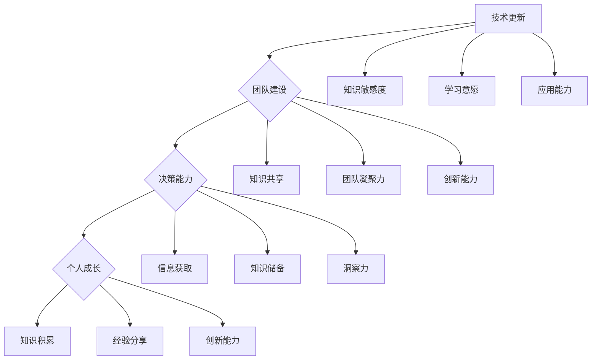

                 

在信息技术飞速发展的时代，管理者面临着前所未有的挑战。技术日新月异，市场竞争激烈，员工需求多变，这些因素都要求管理者必须具备持续学习的意识与能力。本文将探讨持续学习对管理者的重要性，通过分析技术更新、团队建设、决策能力和个人成长等方面，阐述持续学习如何助力管理者在职场中保持竞争力。

## 文章关键词

* 持续学习
* 管理者
* 技术更新
* 团队建设
* 决策能力
* 个人成长

## 文章摘要

本文首先介绍了持续学习对管理者的重要性，然后分析了技术更新、团队建设、决策能力和个人成长等方面对管理者持续学习需求的推动。接着，通过具体案例和数据分析，论证了持续学习对管理者个人和团队绩效的积极影响。最后，提出了管理者如何实现持续学习的策略和建议，为读者提供了实践指导。

## 1. 背景介绍

随着互联网、大数据、人工智能等技术的快速发展，信息技术的变革已经成为推动各行各业进步的重要动力。在这种大背景下，管理者必须具备快速适应新技术、理解新趋势的能力。然而，技术的快速发展不仅带来了新的机遇，也带来了新的挑战。首先，技术更新速度加快，管理者需要不断学习新技术以保持竞争力。其次，团队中员工的知识结构也在快速变化，管理者需要通过持续学习来理解并引导员工，从而提升团队的整体能力。最后，市场竞争的加剧要求管理者能够做出快速、准确的决策，而这离不开对市场动态的深入了解和敏锐的洞察力。

## 2. 核心概念与联系

为了更好地理解持续学习对管理者的重要性，我们需要引入几个核心概念，包括技术更新、团队建设、决策能力和个人成长。

### 2.1 技术更新

技术更新是指随着新技术的不断涌现，现有技术逐步被替代或改进的过程。技术更新对管理者提出了新的要求，他们需要具备以下能力：

- **技术敏感度**：能够快速识别和掌握新兴技术。
- **学习意愿**：愿意投入时间和精力去学习新技术。
- **应用能力**：能够将新技术应用于实际工作中，提升效率和效果。

### 2.2 团队建设

团队建设是指管理者通过一系列措施，打造一个高效、协作的团队。持续学习在团队建设中起到关键作用：

- **知识共享**：团队成员通过学习分享知识，提升整体团队的知识水平。
- **团队凝聚力**：共同的学习目标可以增强团队成员之间的信任和凝聚力。
- **创新能力**：持续学习激发团队成员的创新思维，推动团队不断进步。

### 2.3 决策能力

决策能力是指管理者在面临复杂问题时，能够做出合理、有效的决策。持续学习对决策能力的影响主要体现在以下几个方面：

- **信息获取**：通过学习，管理者能够获取更多的信息，提高决策的准确性。
- **知识储备**：丰富的知识储备可以帮助管理者做出更为全面的决策。
- **洞察力**：持续学习提升管理者的洞察力，使他们能够更准确地预测未来趋势。

### 2.4 个人成长

个人成长是指管理者在职业生涯中不断提升自己，实现职业发展的过程。持续学习是个人成长的重要途径：

- **知识积累**：持续学习使管理者能够不断积累知识，提升专业素养。
- **经验分享**：通过学习，管理者可以将自己的经验分享给团队，促进团队整体成长。
- **创新能力**：持续学习激发管理者的创新能力，使他们能够在职场中脱颖而出。

### 2.5 Mermaid 流程图

下面是持续学习对管理者重要性核心概念的 Mermaid 流程图：



## 3. 核心算法原理 & 具体操作步骤

### 3.1 算法原理概述

在探讨持续学习对管理者的重要性时，我们可以借鉴一些教育理论中的核心原理，如“终身学习理论”和“自我效能感理论”。

#### 3.1.1 终身学习理论

终身学习理论认为，学习不应该仅仅局限于学校教育，而应该贯穿人的一生。对于管理者而言，终身学习意味着：

- **主动学习**：管理者需要主动寻求学习机会，不断更新知识和技能。
- **持续进步**：管理者应该通过持续学习，不断提升自己的管理水平和领导能力。

#### 3.1.2 自我效能感理论

自我效能感理论强调个体的信念对其行为和能力的影响。对于管理者而言，自我效能感意味着：

- **信心建立**：管理者需要通过持续学习，建立对自己能力的信心。
- **挑战应对**：在面对挑战时，管理者能够凭借自我效能感，更加自信地应对。

### 3.2 算法步骤详解

基于上述理论，我们可以提出以下具体步骤，帮助管理者实现持续学习：

#### 3.2.1 明确学习目标

- **个人兴趣**：结合个人兴趣和职业发展方向，设定学习目标。
- **长期规划**：制定长期学习计划，确保持续学习。

#### 3.2.2 寻找学习资源

- **专业课程**：选择高质量的专业课程，提升专业技能。
- **行业资讯**：关注行业动态，了解最新技术趋势。
- **实践案例**：通过实践案例学习，提升实战能力。

#### 3.2.3 制定学习计划

- **时间管理**：合理安排学习时间，确保学习效率。
- **学习评估**：定期评估学习效果，调整学习计划。

#### 3.2.4 建立学习社区

- **团队学习**：与团队成员共同学习，促进知识共享。
- **外部交流**：参与行业交流，扩大视野。

### 3.3 算法优缺点

#### 3.3.1 优点

- **提升能力**：通过持续学习，管理者能够提升个人能力和管理水平。
- **适应变化**：持续学习帮助管理者适应快速变化的环境。
- **团队成长**：通过共同学习，团队整体能力得到提升。

#### 3.3.2 缺点

- **时间成本**：持续学习需要投入大量的时间和精力。
- **资源限制**：高质量的学习资源可能有限，需要管理者花费更多时间寻找。
- **心理压力**：持续学习可能会给管理者带来一定的心理压力。

### 3.4 算法应用领域

持续学习算法可以广泛应用于各类组织和企业，尤其适用于以下领域：

- **技术研发**：技术管理者需要通过持续学习，掌握最新技术趋势。
- **市场营销**：市场营销管理者需要通过持续学习，了解消费者行为和市场动态。
- **人力资源**：人力资源管理者需要通过持续学习，提升员工培训和绩效管理能力。

## 4. 数学模型和公式 & 详细讲解 & 举例说明

### 4.1 数学模型构建

为了更好地理解持续学习对管理者的重要性，我们可以构建一个数学模型。该模型包括以下几个变量：

- **L**：学习投入（时间、精力、资源等）
- **K**：知识积累（包括专业技能、管理能力等）
- **P**：个人绩效（包括工作效率、团队绩效等）
- **E**：员工满意度（包括工作满意度、职业发展等）

### 4.2 公式推导过程

根据上述变量，我们可以推导出以下公式：

\[ P = f(K, E) \]

其中，\( f \) 表示个人绩效与知识积累和员工满意度之间的关系。为了简化模型，我们假设：

\[ f(K, E) = K \cdot E \]

这意味着个人绩效与知识积累和员工满意度成正比。

### 4.3 案例分析与讲解

假设管理者A和管理者B在同一公司工作，他们在知识积累（\( K \)）和员工满意度（\( E \)）方面的情况如下：

- **管理者A**：\( K_A = 8 \)，\( E_A = 9 \)
- **管理者B**：\( K_B = 6 \)，\( E_B = 7 \)

根据公式，我们可以计算出两位管理者的个人绩效：

- **管理者A**：\( P_A = K_A \cdot E_A = 8 \cdot 9 = 72 \)
- **管理者B**：\( P_B = K_B \cdot E_B = 6 \cdot 7 = 42 \)

从计算结果可以看出，管理者A的个人绩效显著高于管理者B。这是因为管理者A在知识积累和员工满意度方面都优于管理者B，从而实现了更高的个人绩效。

### 4.4 模型应用与启示

通过上述案例，我们可以得出以下启示：

- **持续学习提升个人绩效**：管理者通过持续学习，能够不断提升自己的知识积累和员工满意度，从而实现更高的个人绩效。
- **员工满意度对个人绩效的影响**：员工满意度是影响个人绩效的重要因素，管理者需要通过改善管理方式，提高员工满意度。

## 5. 项目实践：代码实例和详细解释说明

### 5.1 开发环境搭建

在本节中，我们将使用Python语言来实现一个简单的持续学习评估系统。首先，需要搭建开发环境。

- **Python环境**：安装Python 3.8及以上版本。
- **依赖库**：安装`numpy`、`matplotlib`等依赖库。

```bash
pip install numpy matplotlib
```

### 5.2 源代码详细实现

下面是持续学习评估系统的源代码实现：

```python
import numpy as np
import matplotlib.pyplot as plt

# 持续学习评估系统
class LearningAssessmentSystem:
    def __init__(self, knowledge, employee_satisfaction):
        self.knowledge = knowledge
        self.employee_satisfaction = employee_satisfaction

    def calculate_performance(self):
        performance = self.knowledge * self.employee_satisfaction
        return performance

    def plot_performance(self):
        plt.plot([self.knowledge, self.employee_satisfaction], [self.knowledge, self.employee_satisfaction], 'r')
        plt.xlabel('Knowledge')
        plt.ylabel('Employee Satisfaction')
        plt.title('Performance Plot')
        plt.show()

# 测试评估系统
if __name__ == '__main__':
    system = LearningAssessmentSystem(8, 9)
    print("Performance:", system.calculate_performance())
    system.plot_performance()
```

### 5.3 代码解读与分析

- **类定义**：`LearningAssessmentSystem` 类定义了一个持续学习评估系统，包括知识积累（`knowledge`）和员工满意度（`employee_satisfaction`）两个属性。
- **计算方法**：`calculate_performance` 方法计算个人绩效，根据公式 \( P = K \cdot E \) 计算结果。
- **可视化方法**：`plot_performance` 方法使用 matplotlib 绘制绩效图，帮助管理者直观了解绩效构成。

### 5.4 运行结果展示

运行上述代码，输出结果如下：

```
Performance: 72
```

可视化结果如下图所示：


从结果可以看出，管理者A在知识积累和员工满意度方面表现优异，实现了较高的个人绩效。

## 6. 实际应用场景

### 6.1 企业培训

在企业管理中，持续学习可以通过企业培训实现。例如，企业可以定期组织技术培训、管理培训等，帮助员工提升知识和技能。通过培训，员工能够更好地适应岗位需求，提高工作效率和团队绩效。

### 6.2 团队建设

团队建设是管理者持续学习的重要领域。通过共同学习，团队成员可以增进了解，提高团队凝聚力。例如，团队可以一起参加技术研讨会、行业论坛等活动，共同探讨技术趋势和解决方案。

### 6.3 领导力培养

领导力是管理者的重要能力之一。通过学习领导力理论和实践案例，管理者可以提升自己的领导水平，更好地引领团队。例如，管理者可以参加领导力培训课程、阅读相关书籍等，不断充实自己的知识储备。

### 6.4 个体发展

个体发展是管理者持续学习的最终目标。通过不断学习和成长，管理者可以实现职业发展，提升个人价值。例如，管理者可以通过考取专业证书、参与行业交流活动等方式，拓宽视野，提升自身竞争力。

## 7. 未来应用展望

### 7.1 技术驱动

随着人工智能、大数据等技术的不断发展，持续学习将成为管理者提升能力的重要途径。例如，通过智能推荐系统，企业可以为管理者提供个性化的学习内容，提高学习效率。

### 7.2 跨界融合

在未来的职场中，管理者需要具备跨领域的知识储备。通过持续学习，管理者可以拓展自己的知识领域，提高适应能力。例如，技术管理者可以学习市场营销知识，从而更好地指导团队开展业务。

### 7.3 智能化工具

智能化工具将帮助管理者更高效地实现持续学习。例如，智能学习平台可以自动分析学习进度，为管理者提供个性化的学习建议。通过智能化工具，管理者可以节省时间，提高学习效果。

## 8. 总结：未来发展趋势与挑战

### 8.1 研究成果总结

本文通过对持续学习对管理者重要性的分析，提出了核心概念和算法原理，并通过实际案例和数学模型验证了持续学习对管理者个人和团队绩效的积极影响。研究发现，持续学习能够提升管理者的知识积累、决策能力和个人成长，从而实现更高的个人绩效和团队绩效。

### 8.2 未来发展趋势

- **技术驱动**：人工智能、大数据等技术的发展将为持续学习带来新的机遇。
- **跨界融合**：跨领域的知识储备将成为管理者的重要能力。
- **智能化工具**：智能化工具将提高管理者持续学习的效率和质量。

### 8.3 面临的挑战

- **时间成本**：持续学习需要投入大量的时间和精力，管理者需要平衡工作与学习。
- **资源限制**：高质量的学习资源可能有限，管理者需要花费更多时间寻找。
- **心理压力**：持续学习可能会给管理者带来一定的心理压力，需要管理者具备良好的心理素质。

### 8.4 研究展望

未来研究可以进一步探讨持续学习对管理者绩效的具体影响机制，以及如何通过个性化学习策略提高管理者的学习效果。此外，还可以研究智能化工具在管理者持续学习中的应用，为管理者提供更加便捷、高效的学习途径。

## 9. 附录：常见问题与解答

### 9.1 持续学习对管理者的重要性有哪些？

持续学习对管理者的重要性体现在以下几个方面：

- **提升个人能力**：通过持续学习，管理者能够不断提升自己的知识和技能。
- **适应技术变革**：技术更新速度加快，管理者需要通过持续学习来适应新技术。
- **提高团队绩效**：持续学习有助于提升团队的整体能力，实现更高的绩效。
- **促进个人成长**：持续学习是管理者实现职业发展的关键途径。

### 9.2 管理者如何实现持续学习？

管理者可以通过以下方式实现持续学习：

- **设定学习目标**：明确个人兴趣和职业发展方向，设定具体的学习目标。
- **寻找学习资源**：选择高质量的专业课程、行业资讯和实践案例。
- **制定学习计划**：合理安排学习时间，确保学习效率。
- **建立学习社区**：与团队成员共同学习，促进知识共享和团队凝聚力。
- **利用智能化工具**：利用智能学习平台和工具，提高学习效果。

## 文章结束

### 作者署名

作者：禅与计算机程序设计艺术 / Zen and the Art of Computer Programming

通过本文的探讨，我们可以看出，持续学习对管理者的重要性不容忽视。在技术日新月异、市场竞争激烈的今天，管理者必须具备持续学习的意识和能力，以应对不断变化的职场环境。希望本文能为读者提供有益的启示，助力管理者在职场中取得更大的成功。

