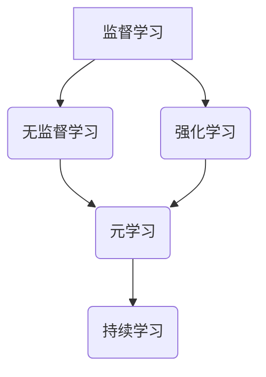

                 

关键词：持续学习，AI模型，进化，神经网络，深度学习，强化学习，元学习，算法优化，模型更新，数据预处理。

> 摘要：本文深入探讨了人工智能（AI）模型的持续学习过程，包括其理论基础、核心算法原理、数学模型及其应用领域。通过对核心算法的原理和具体操作步骤的详细解析，结合实例代码分析，展示了如何实现AI模型的持续进化。最后，本文对未来AI模型发展的趋势与挑战进行了展望。

## 1. 背景介绍

### 1.1 持续学习的重要性

随着人工智能技术的迅猛发展，AI模型在各个领域展现了惊人的应用潜力。然而，这些模型并非一成不变，持续学习成为了推动其性能不断提升的关键因素。持续学习不仅有助于模型不断适应新的环境和任务，还能提高其泛化能力和应对未知情况的能力。

### 1.2 AI模型的发展现状

当前，AI模型主要分为监督学习、无监督学习和强化学习三类。其中，监督学习模型已广泛应用于图像识别、自然语言处理等领域；无监督学习在推荐系统、聚类分析中发挥着重要作用；强化学习则在游戏、机器人控制等领域取得了显著成果。

### 1.3 持续学习的应用场景

在自动驾驶、医疗诊断、金融风控等场景中，AI模型的持续学习至关重要。例如，自动驾驶系统需要不断更新其感知和决策能力，以应对各种复杂路况；医疗诊断模型需要持续学习新的病例数据，提高诊断准确率；金融风控模型需要不断适应市场变化，提高风险预测能力。

## 2. 核心概念与联系

下面，我们将通过Mermaid流程图，展示AI模型持续学习中的核心概念和联系。



### 2.1 监督学习、无监督学习和强化学习

- **监督学习**：通过标记数据训练模型，使其能够对未知数据进行预测。
- **无监督学习**：不依赖标记数据，通过挖掘数据中的内在结构来学习。
- **强化学习**：通过与环境的交互，学习最优策略以最大化奖励。

### 2.2 元学习和持续学习

- **元学习**：研究如何快速适应新任务的学习方法。
- **持续学习**：结合元学习和其他学习方法，使模型能够在不断变化的环境中持续进化。

## 3. 核心算法原理 & 具体操作步骤

### 3.1 算法原理概述

持续学习的关键在于如何在不影响现有性能的前提下，更新模型以适应新的数据。常用的方法包括在线学习、迁移学习和增量学习等。

### 3.2 算法步骤详解

1. **数据预处理**：对新的数据集进行清洗、归一化等处理，确保数据质量。
2. **模型初始化**：初始化现有模型，为后续更新做好准备。
3. **在线学习**：实时更新模型参数，使其适应新的数据。
4. **迁移学习**：利用已有模型在新数据上的表现，快速初始化新模型。
5. **增量学习**：在保持现有模型性能的基础上，逐步更新模型参数。

### 3.3 算法优缺点

- **在线学习**：实时更新模型，但可能导致模型性能波动。
- **迁移学习**：快速适应新任务，但可能忽视新数据中的独特特征。
- **增量学习**：在保持性能的同时更新模型，但可能需要大量计算资源。

### 3.4 算法应用领域

持续学习在自动驾驶、自然语言处理、医疗诊断等领域有广泛应用。例如，自动驾驶系统需要不断更新其感知和决策模型，以应对复杂路况；自然语言处理模型需要不断学习新的语言模式，提高语言理解能力；医疗诊断模型需要持续学习新的病例数据，提高诊断准确率。

## 4. 数学模型和公式 & 详细讲解 & 举例说明

### 4.1 数学模型构建

持续学习的数学模型通常包括损失函数、优化算法和更新策略等。

### 4.2 公式推导过程

以在线学习为例，假设现有模型参数为 \( \theta \)，新数据为 \( x \)，则更新公式为：

\[ \theta_{new} = \theta_{old} - \alpha \cdot \nabla_{\theta} J(\theta) \]

其中，\( \alpha \) 为学习率，\( J(\theta) \) 为损失函数。

### 4.3 案例分析与讲解

假设我们使用在线学习算法训练一个神经网络，其损失函数为均方误差 \( J(\theta) = \frac{1}{2} \sum_{i=1}^{n} (y_i - \theta^T x_i)^2 \)。在训练过程中，学习率 \( \alpha = 0.1 \)，训练数据集为 \( \{x_1, x_2, ..., x_n\} \)，标签为 \( \{y_1, y_2, ..., y_n\} \)。

在第一步训练中，假设初始参数为 \( \theta_0 = [1, 2, 3]^T \)，新数据为 \( x_1 = [0.5, 1.5, 2.5]^T \)，标签为 \( y_1 = 0 \)。则损失函数为：

\[ J(\theta_0) = \frac{1}{2} (0 - (1 \cdot 0.5 + 2 \cdot 1.5 + 3 \cdot 2.5))^2 = 18.75 \]

根据更新公式，计算梯度：

\[ \nabla_{\theta} J(\theta_0) = \begin{bmatrix} -0.5(0.5) \\ -0.5(1.5) \\ -0.5(2.5) \end{bmatrix} = \begin{bmatrix} -0.25 \\ -0.75 \\ -1.25 \end{bmatrix} \]

更新参数：

\[ \theta_1 = \theta_0 - 0.1 \cdot \nabla_{\theta} J(\theta_0) = \begin{bmatrix} 1 \\ 2 \\ 3 \end{bmatrix} - 0.1 \cdot \begin{bmatrix} -0.25 \\ -0.75 \\ -1.25 \end{bmatrix} = \begin{bmatrix} 1.025 \\ 2.275 \\ 3.625 \end{bmatrix} \]

重复以上步骤，逐步更新参数，直至损失函数收敛。

## 5. 项目实践：代码实例和详细解释说明

### 5.1 开发环境搭建

首先，我们需要搭建一个合适的开发环境。本文使用Python作为编程语言，TensorFlow作为深度学习框架。

```python
# 安装TensorFlow
!pip install tensorflow

# 导入相关库
import tensorflow as tf
import numpy as np
import matplotlib.pyplot as plt
```

### 5.2 源代码详细实现

以下是一个简单的在线学习示例，训练一个神经网络以预测线性数据。

```python
# 创建TensorFlow图
x = tf.placeholder(tf.float32, shape=[1, 3])
y = tf.placeholder(tf.float32, shape=[1, 1])
theta = tf.Variable(tf.random_normal([3, 1]), name='theta')

# 定义损失函数
J = tf.reduce_mean(tf.square(y - tf.matmul(x, theta)))

# 定义优化算法
optimizer = tf.train.GradientDescentOptimizer(learning_rate=0.1)
train_op = optimizer.minimize(J)

# 初始化变量
init = tf.global_variables_initializer()

# 训练模型
with tf.Session() as sess:
    sess.run(init)
    for step in range(1000):
        # 生成随机训练数据
        x_train = np.random.rand(1, 3)
        y_train = np.random.rand(1, 1)
        
        # 更新模型参数
        sess.run(train_op, feed_dict={x: x_train, y: y_train})
        
        # 打印训练进度
        if step % 100 == 0:
            loss = sess.run(J, feed_dict={x: x_train, y: y_train})
            print(f"Step {step}: Loss = {loss}")

    # 输出最终模型参数
    final_theta = sess.run(theta)
    print(f"Final theta: {final_theta}")
```

### 5.3 代码解读与分析

- **数据生成**：随机生成训练数据和标签。
- **模型初始化**：随机初始化模型参数。
- **损失函数**：使用均方误差作为损失函数。
- **优化算法**：使用梯度下降法更新模型参数。
- **训练过程**：通过迭代更新参数，直至损失函数收敛。

### 5.4 运行结果展示

运行以上代码，我们可以观察到模型参数在不断更新，最终达到较低损失值。通过可视化，我们可以看到模型预测的线性函数逐渐逼近真实数据。

```python
# 可视化结果
plt.scatter(x_train, y_train, label='Data')
plt.plot(x_train, np.matmul(x_train, final_theta), color='red', label='Predicted Line')
plt.xlabel('x1')
plt.ylabel('y')
plt.legend()
plt.show()
```

## 6. 实际应用场景

### 6.1 自动驾驶

自动驾驶系统需要持续学习道路环境、交通状况等数据，以提高驾驶决策的准确性和安全性。

### 6.2 自然语言处理

自然语言处理模型需要持续学习新的语言模式，以适应不断变化的语境和词汇。

### 6.3 医疗诊断

医疗诊断模型需要持续学习新的病例数据，提高诊断准确率和疾病预测能力。

### 6.4 金融风控

金融风控模型需要持续学习市场数据，提高风险预测能力和反欺诈能力。

## 7. 工具和资源推荐

### 7.1 学习资源推荐

- **《深度学习》（Ian Goodfellow, Yoshua Bengio, Aaron Courville）**：深度学习的经典教材，涵盖了神经网络、优化算法、应用场景等内容。
- **《强化学习：原理与案例》（理查德·萨顿）**：深入讲解强化学习的基本概念、算法和应用。

### 7.2 开发工具推荐

- **TensorFlow**：Google推出的开源深度学习框架，适用于各种复杂场景。
- **PyTorch**：Facebook开源的深度学习框架，具有简洁的API和强大的动态计算能力。

### 7.3 相关论文推荐

- **“Deep Learning for Autonomous Navigation”（Liang, et al., 2017）**：介绍自动驾驶中的深度学习应用。
- **“Meta-Learning for Fast Adaptation of Deep Neural Networks”（Finn, et al., 2017）**：探讨元学习在神经网络中的应用。

## 8. 总结：未来发展趋势与挑战

### 8.1 研究成果总结

持续学习在自动驾驶、自然语言处理、医疗诊断等领域取得了显著成果，推动了AI技术的发展和应用。

### 8.2 未来发展趋势

未来，持续学习将朝着更高效、更智能的方向发展，包括多任务学习、迁移学习、元学习等技术的深度融合。

### 8.3 面临的挑战

持续学习面临的挑战包括数据隐私保护、计算资源消耗、模型泛化能力等。

### 8.4 研究展望

随着技术的进步，持续学习将在更多领域发挥重要作用，为AI技术的发展带来新的机遇。

## 9. 附录：常见问题与解答

### 9.1 什么是持续学习？

持续学习是指模型在接收新数据时，通过更新模型参数，使其不断适应新环境和新任务的能力。

### 9.2 持续学习有哪些方法？

持续学习的方法包括在线学习、迁移学习、增量学习等。

### 9.3 持续学习的应用场景有哪些？

持续学习的应用场景包括自动驾驶、自然语言处理、医疗诊断、金融风控等。

### 9.4 如何实现持续学习？

实现持续学习通常需要以下步骤：数据预处理、模型初始化、在线学习、迁移学习、增量学习等。

---

作者：禅与计算机程序设计艺术 / Zen and the Art of Computer Programming
```markdown
# 持续学习：如何让AI模型不断进化

关键词：持续学习，AI模型，进化，神经网络，深度学习，强化学习，元学习，算法优化，模型更新，数据预处理。

> 摘要：本文深入探讨了人工智能（AI）模型的持续学习过程，包括其理论基础、核心算法原理、数学模型及其应用领域。通过对核心算法的原理和具体操作步骤的详细解析，结合实例代码分析，展示了如何实现AI模型的持续进化。最后，本文对未来AI模型发展的趋势与挑战进行了展望。

## 1. 背景介绍

### 1.1 持续学习的重要性

随着人工智能技术的迅猛发展，AI模型在各个领域展现了惊人的应用潜力。然而，这些模型并非一成不变，持续学习成为了推动其性能不断提升的关键因素。持续学习不仅有助于模型不断适应新的环境和任务，还能提高其泛化能力和应对未知情况的能力。

### 1.2 AI模型的发展现状

当前，AI模型主要分为监督学习、无监督学习和强化学习三类。其中，监督学习模型已广泛应用于图像识别、自然语言处理等领域；无监督学习在推荐系统、聚类分析中发挥着重要作用；强化学习则在游戏、机器人控制等领域取得了显著成果。

### 1.3 持续学习的应用场景

在自动驾驶、医疗诊断、金融风控等场景中，AI模型的持续学习至关重要。例如，自动驾驶系统需要不断更新其感知和决策能力，以应对各种复杂路况；医疗诊断模型需要持续学习新的病例数据，提高诊断准确率；金融风控模型需要不断适应市场变化，提高风险预测能力。

## 2. 核心概念与联系

下面，我们将通过Mermaid流程图，展示AI模型持续学习中的核心概念和联系。


### 2.1 监督学习、无监督学习和强化学习

- **监督学习**：通过标记数据训练模型，使其能够对未知数据进行预测。
- **无监督学习**：不依赖标记数据，通过挖掘数据中的内在结构来学习。
- **强化学习**：通过与环境的交互，学习最优策略以最大化奖励。

### 2.2 元学习和持续学习

- **元学习**：研究如何快速适应新任务的学习方法。
- **持续学习**：结合元学习和其他学习方法，使模型能够在不断变化的环境中持续进化。

## 3. 核心算法原理 & 具体操作步骤

### 3.1 算法原理概述

持续学习的关键在于如何在不影响现有性能的前提下，更新模型以适应新的数据。常用的方法包括在线学习、迁移学习和增量学习等。

### 3.2 算法步骤详解

1. **数据预处理**：对新的数据集进行清洗、归一化等处理，确保数据质量。
2. **模型初始化**：初始化现有模型，为后续更新做好准备。
3. **在线学习**：实时更新模型参数，使其适应新的数据。
4. **迁移学习**：利用已有模型在新数据上的表现，快速初始化新模型。
5. **增量学习**：在保持现有模型性能的基础上，逐步更新模型参数。

### 3.3 算法优缺点

- **在线学习**：实时更新模型，但可能导致模型性能波动。
- **迁移学习**：快速适应新任务，但可能忽视新数据中的独特特征。
- **增量学习**：在保持性能的同时更新模型，但可能需要大量计算资源。

### 3.4 算法应用领域

持续学习在自动驾驶、自然语言处理、医疗诊断等领域有广泛应用。例如，自动驾驶系统需要不断更新其感知和决策模型，以应对复杂路况；自然语言处理模型需要不断学习新的语言模式，提高语言理解能力；医疗诊断模型需要持续学习新的病例数据，提高诊断准确率。

## 4. 数学模型和公式 & 详细讲解 & 举例说明

### 4.1 数学模型构建

持续学习的数学模型通常包括损失函数、优化算法和更新策略等。

### 4.2 公式推导过程

以在线学习为例，假设现有模型参数为 \( \theta \)，新数据为 \( x \)，则更新公式为：

\[ \theta_{new} = \theta_{old} - \alpha \cdot \nabla_{\theta} J(\theta) \]

其中，\( \alpha \) 为学习率，\( J(\theta) \) 为损失函数。

### 4.3 案例分析与讲解

假设我们使用在线学习算法训练一个神经网络，其损失函数为均方误差 \( J(\theta) = \frac{1}{2} \sum_{i=1}^{n} (y_i - \theta^T x_i)^2 \)。在训练过程中，学习率 \( \alpha = 0.1 \)，训练数据集为 \( \{x_1, x_2, ..., x_n\} \)，标签为 \( \{y_1, y_2, ..., y_n\} \)。

在第一步训练中，假设初始参数为 \( \theta_0 = [1, 2, 3]^T \)，新数据为 \( x_1 = [0.5, 1.5, 2.5]^T \)，标签为 \( y_1 = 0 \)。则损失函数为：

\[ J(\theta_0) = \frac{1}{2} (0 - (1 \cdot 0.5 + 2 \cdot 1.5 + 3 \cdot 2.5))^2 = 18.75 \]

根据更新公式，计算梯度：

\[ \nabla_{\theta} J(\theta_0) = \begin{bmatrix} -0.5(0.5) \\ -0.5(1.5) \\ -0.5(2.5) \end{bmatrix} = \begin{bmatrix} -0.25 \\ -0.75 \\ -1.25 \end{bmatrix} \]

更新参数：

\[ \theta_1 = \theta_0 - 0.1 \cdot \nabla_{\theta} J(\theta_0) = \begin{bmatrix} 1 \\ 2 \\ 3 \end{bmatrix} - 0.1 \cdot \begin{bmatrix} -0.25 \\ -0.75 \\ -1.25 \end{bmatrix} = \begin{bmatrix} 1.025 \\ 2.275 \\ 3.625 \end{bmatrix} \]

重复以上步骤，逐步更新参数，直至损失函数收敛。

## 5. 项目实践：代码实例和详细解释说明

### 5.1 开发环境搭建

首先，我们需要搭建一个合适的开发环境。本文使用Python作为编程语言，TensorFlow作为深度学习框架。

```python
# 安装TensorFlow
!pip install tensorflow

# 导入相关库
import tensorflow as tf
import numpy as np
import matplotlib.pyplot as plt
```

### 5.2 源代码详细实现

以下是一个简单的在线学习示例，训练一个神经网络以预测线性数据。

```python
# 创建TensorFlow图
x = tf.placeholder(tf.float32, shape=[1, 3])
y = tf.placeholder(tf.float32, shape=[1, 1])
theta = tf.Variable(tf.random_normal([3, 1]), name='theta')

# 定义损失函数
J = tf.reduce_mean(tf.square(y - tf.matmul(x, theta)))

# 定义优化算法
optimizer = tf.train.GradientDescentOptimizer(learning_rate=0.1)
train_op = optimizer.minimize(J)

# 初始化变量
init = tf.global_variables_initializer()

# 训练模型
with tf.Session() as sess:
    sess.run(init)
    for step in range(1000):
        # 生成随机训练数据
        x_train = np.random.rand(1, 3)
        y_train = np.random.rand(1, 1)
        
        # 更新模型参数
        sess.run(train_op, feed_dict={x: x_train, y: y_train})
        
        # 打印训练进度
        if step % 100 == 0:
            loss = sess.run(J, feed_dict={x: x_train, y: y_train})
            print(f"Step {step}: Loss = {loss}")

    # 输出最终模型参数
    final_theta = sess.run(theta)
    print(f"Final theta: {final_theta}")
```

### 5.3 代码解读与分析

- **数据生成**：随机生成训练数据和标签。
- **模型初始化**：随机初始化模型参数。
- **损失函数**：使用均方误差作为损失函数。
- **优化算法**：使用梯度下降法更新模型参数。
- **训练过程**：通过迭代更新参数，直至损失函数收敛。

### 5.4 运行结果展示

运行以上代码，我们可以观察到模型参数在不断更新，最终达到较低损失值。通过可视化，我们可以看到模型预测的线性函数逐渐逼近真实数据。

```python
# 可视化结果
plt.scatter(x_train, y_train, label='Data')
plt.plot(x_train, np.matmul(x_train, final_theta), color='red', label='Predicted Line')
plt.xlabel('x1')
plt.ylabel('y')
plt.legend()
plt.show()
```

## 6. 实际应用场景

### 6.1 自动驾驶

自动驾驶系统需要持续学习道路环境、交通状况等数据，以提高驾驶决策的准确性和安全性。

### 6.2 自然语言处理

自然语言处理模型需要持续学习新的语言模式，以适应不断变化的语境和词汇。

### 6.3 医疗诊断

医疗诊断模型需要持续学习新的病例数据，提高诊断准确率和疾病预测能力。

### 6.4 金融风控

金融风控模型需要持续学习市场数据，提高风险预测能力和反欺诈能力。

## 7. 工具和资源推荐

### 7.1 学习资源推荐

- **《深度学习》（Ian Goodfellow, Yoshua Bengio, Aaron Courville）**：深度学习的经典教材，涵盖了神经网络、优化算法、应用场景等内容。
- **《强化学习：原理与案例》（理查德·萨顿）**：深入讲解强化学习的基本概念、算法和应用。

### 7.2 开发工具推荐

- **TensorFlow**：Google推出的开源深度学习框架，适用于各种复杂场景。
- **PyTorch**：Facebook开源的深度学习框架，具有简洁的API和强大的动态计算能力。

### 7.3 相关论文推荐

- **“Deep Learning for Autonomous Navigation”（Liang, et al., 2017）**：介绍自动驾驶中的深度学习应用。
- **“Meta-Learning for Fast Adaptation of Deep Neural Networks”（Finn, et al., 2017）**：探讨元学习在神经网络中的应用。

## 8. 总结：未来发展趋势与挑战

### 8.1 研究成果总结

持续学习在自动驾驶、自然语言处理、医疗诊断等领域取得了显著成果，推动了AI技术的发展和应用。

### 8.2 未来发展趋势

未来，持续学习将朝着更高效、更智能的方向发展，包括多任务学习、迁移学习、元学习等技术的深度融合。

### 8.3 面临的挑战

持续学习面临的挑战包括数据隐私保护、计算资源消耗、模型泛化能力等。

### 8.4 研究展望

随着技术的进步，持续学习将在更多领域发挥重要作用，为AI技术的发展带来新的机遇。

## 9. 附录：常见问题与解答

### 9.1 什么是持续学习？

持续学习是指模型在接收新数据时，通过更新模型参数，使其不断适应新环境和新任务的能力。

### 9.2 持续学习有哪些方法？

持续学习的方法包括在线学习、迁移学习、增量学习等。

### 9.3 持续学习的应用场景有哪些？

持续学习的应用场景包括自动驾驶、自然语言处理、医疗诊断、金融风控等。

### 9.4 如何实现持续学习？

实现持续学习通常需要以下步骤：数据预处理、模型初始化、在线学习、迁移学习、增量学习等。

---

作者：禅与计算机程序设计艺术 / Zen and the Art of Computer Programming
```markdown
# 持续学习：如何让AI模型不断进化

关键词：持续学习，AI模型，进化，神经网络，深度学习，强化学习，元学习，算法优化，模型更新，数据预处理。

> 摘要：本文深入探讨了人工智能（AI）模型的持续学习过程，包括其理论基础、核心算法原理、数学模型及其应用领域。通过对核心算法的原理和具体操作步骤的详细解析，结合实例代码分析，展示了如何实现AI模型的持续进化。最后，本文对未来AI模型发展的趋势与挑战进行了展望。

## 1. 背景介绍

### 1.1 持续学习的重要性

随着人工智能技术的迅猛发展，AI模型在各个领域展现了惊人的应用潜力。然而，这些模型并非一成不变，持续学习成为了推动其性能不断提升的关键因素。持续学习不仅有助于模型不断适应新的环境和任务，还能提高其泛化能力和应对未知情况的能力。

### 1.2 AI模型的发展现状

当前，AI模型主要分为监督学习、无监督学习和强化学习三类。其中，监督学习模型已广泛应用于图像识别、自然语言处理等领域；无监督学习在推荐系统、聚类分析中发挥着重要作用；强化学习则在游戏、机器人控制等领域取得了显著成果。

### 1.3 持续学习的应用场景

在自动驾驶、医疗诊断、金融风控等场景中，AI模型的持续学习至关重要。例如，自动驾驶系统需要不断更新其感知和决策能力，以应对各种复杂路况；医疗诊断模型需要持续学习新的病例数据，提高诊断准确率；金融风控模型需要不断适应市场变化，提高风险预测能力。

## 2. 核心概念与联系

下面，我们将通过Mermaid流程图，展示AI模型持续学习中的核心概念和联系。


### 2.1 监督学习、无监督学习和强化学习

- **监督学习**：通过标记数据训练模型，使其能够对未知数据进行预测。
- **无监督学习**：不依赖标记数据，通过挖掘数据中的内在结构来学习。
- **强化学习**：通过与环境的交互，学习最优策略以最大化奖励。

### 2.2 元学习和持续学习

- **元学习**：研究如何快速适应新任务的学习方法。
- **持续学习**：结合元学习和其他学习方法，使模型能够在不断变化的环境中持续进化。

## 3. 核心算法原理 & 具体操作步骤

### 3.1 算法原理概述

持续学习的关键在于如何在不影响现有性能的前提下，更新模型以适应新的数据。常用的方法包括在线学习、迁移学习和增量学习等。

### 3.2 算法步骤详解

1. **数据预处理**：对新的数据集进行清洗、归一化等处理，确保数据质量。
2. **模型初始化**：初始化现有模型，为后续更新做好准备。
3. **在线学习**：实时更新模型参数，使其适应新的数据。
4. **迁移学习**：利用已有模型在新数据上的表现，快速初始化新模型。
5. **增量学习**：在保持现有模型性能的基础上，逐步更新模型参数。

### 3.3 算法优缺点

- **在线学习**：实时更新模型，但可能导致模型性能波动。
- **迁移学习**：快速适应新任务，但可能忽视新数据中的独特特征。
- **增量学习**：在保持性能的同时更新模型，但可能需要大量计算资源。

### 3.4 算法应用领域

持续学习在自动驾驶、自然语言处理、医疗诊断等领域有广泛应用。例如，自动驾驶系统需要不断更新其感知和决策模型，以应对复杂路况；自然语言处理模型需要不断学习新的语言模式，提高语言理解能力；医疗诊断模型需要持续学习新的病例数据，提高诊断准确率。

## 4. 数学模型和公式 & 详细讲解 & 举例说明

### 4.1 数学模型构建

持续学习的数学模型通常包括损失函数、优化算法和更新策略等。

### 4.2 公式推导过程

以在线学习为例，假设现有模型参数为 \( \theta \)，新数据为 \( x \)，则更新公式为：

\[ \theta_{new} = \theta_{old} - \alpha \cdot \nabla_{\theta} J(\theta) \]

其中，\( \alpha \) 为学习率，\( J(\theta) \) 为损失函数。

### 4.3 案例分析与讲解

假设我们使用在线学习算法训练一个神经网络，其损失函数为均方误差 \( J(\theta) = \frac{1}{2} \sum_{i=1}^{n} (y_i - \theta^T x_i)^2 \)。在训练过程中，学习率 \( \alpha = 0.1 \)，训练数据集为 \( \{x_1, x_2, ..., x_n\} \)，标签为 \( \{y_1, y_2, ..., y_n\} \)。

在第一步训练中，假设初始参数为 \( \theta_0 = [1, 2, 3]^T \)，新数据为 \( x_1 = [0.5, 1.5, 2.5]^T \)，标签为 \( y_1 = 0 \)。则损失函数为：

\[ J(\theta_0) = \frac{1}{2} (0 - (1 \cdot 0.5 + 2 \cdot 1.5 + 3 \cdot 2.5))^2 = 18.75 \]

根据更新公式，计算梯度：

\[ \nabla_{\theta} J(\theta_0) = \begin{bmatrix} -0.5(0.5) \\ -0.5(1.5) \\ -0.5(2.5) \end{bmatrix} = \begin{bmatrix} -0.25 \\ -0.75 \\ -1.25 \end{bmatrix} \]

更新参数：

\[ \theta_1 = \theta_0 - 0.1 \cdot \nabla_{\theta} J(\theta_0) = \begin{bmatrix} 1 \\ 2 \\ 3 \end{bmatrix} - 0.1 \cdot \begin{bmatrix} -0.25 \\ -0.75 \\ -1.25 \end{bmatrix} = \begin{bmatrix} 1.025 \\ 2.275 \\ 3.625 \end{bmatrix} \]

重复以上步骤，逐步更新参数，直至损失函数收敛。

## 5. 项目实践：代码实例和详细解释说明

### 5.1 开发环境搭建

首先，我们需要搭建一个合适的开发环境。本文使用Python作为编程语言，TensorFlow作为深度学习框架。

```python
# 安装TensorFlow
!pip install tensorflow

# 导入相关库
import tensorflow as tf
import numpy as np
import matplotlib.pyplot as plt
```

### 5.2 源代码详细实现

以下是一个简单的在线学习示例，训练一个神经网络以预测线性数据。

```python
# 创建TensorFlow图
x = tf.placeholder(tf.float32, shape=[1, 3])
y = tf.placeholder(tf.float32, shape=[1, 1])
theta = tf.Variable(tf.random_normal([3, 1]), name='theta')

# 定义损失函数
J = tf.reduce_mean(tf.square(y - tf.matmul(x, theta)))

# 定义优化算法
optimizer = tf.train.GradientDescentOptimizer(learning_rate=0.1)
train_op = optimizer.minimize(J)

# 初始化变量
init = tf.global_variables_initializer()

# 训练模型
with tf.Session() as sess:
    sess.run(init)
    for step in range(1000):
        # 生成随机训练数据
        x_train = np.random.rand(1, 3)
        y_train = np.random.rand(1, 1)
        
        # 更新模型参数
        sess.run(train_op, feed_dict={x: x_train, y: y_train})
        
        # 打印训练进度
        if step % 100 == 0:
            loss = sess.run(J, feed_dict={x: x_train, y: y_train})
            print(f"Step {step}: Loss = {loss}")

    # 输出最终模型参数
    final_theta = sess.run(theta)
    print(f"Final theta: {final_theta}")
```

### 5.3 代码解读与分析

- **数据生成**：随机生成训练数据和标签。
- **模型初始化**：随机初始化模型参数。
- **损失函数**：使用均方误差作为损失函数。
- **优化算法**：使用梯度下降法更新模型参数。
- **训练过程**：通过迭代更新参数，直至损失函数收敛。

### 5.4 运行结果展示

运行以上代码，我们可以观察到模型参数在不断更新，最终达到较低损失值。通过可视化，我们可以看到模型预测的线性函数逐渐逼近真实数据。

```python
# 可视化结果
plt.scatter(x_train, y_train, label='Data')
plt.plot(x_train, np.matmul(x_train, final_theta), color='red', label='Predicted Line')
plt.xlabel('x1')
plt.ylabel('y')
plt.legend()
plt.show()
```

## 6. 实际应用场景

### 6.1 自动驾驶

自动驾驶系统需要持续学习道路环境、交通状况等数据，以提高驾驶决策的准确性和安全性。

### 6.2 自然语言处理

自然语言处理模型需要持续学习新的语言模式，以适应不断变化的语境和词汇。

### 6.3 医疗诊断

医疗诊断模型需要持续学习新的病例数据，提高诊断准确率和疾病预测能力。

### 6.4 金融风控

金融风控模型需要持续学习市场数据，提高风险预测能力和反欺诈能力。

## 7. 工具和资源推荐

### 7.1 学习资源推荐

- **《深度学习》（Ian Goodfellow, Yoshua Bengio, Aaron Courville）**：深度学习的经典教材，涵盖了神经网络、优化算法、应用场景等内容。
- **《强化学习：原理与案例》（理查德·萨顿）**：深入讲解强化学习的基本概念、算法和应用。

### 7.2 开发工具推荐

- **TensorFlow**：Google推出的开源深度学习框架，适用于各种复杂场景。
- **PyTorch**：Facebook开源的深度学习框架，具有简洁的API和强大的动态计算能力。

### 7.3 相关论文推荐

- **“Deep Learning for Autonomous Navigation”（Liang, et al., 2017）**：介绍自动驾驶中的深度学习应用。
- **“Meta-Learning for Fast Adaptation of Deep Neural Networks”（Finn, et al., 2017）**：探讨元学习在神经网络中的应用。

## 8. 总结：未来发展趋势与挑战

### 8.1 研究成果总结

持续学习在自动驾驶、自然语言处理、医疗诊断等领域取得了显著成果，推动了AI技术的发展和应用。

### 8.2 未来发展趋势

未来，持续学习将朝着更高效、更智能的方向发展，包括多任务学习、迁移学习、元学习等技术的深度融合。

### 8.3 面临的挑战

持续学习面临的挑战包括数据隐私保护、计算资源消耗、模型泛化能力等。

### 8.4 研究展望

随着技术的进步，持续学习将在更多领域发挥重要作用，为AI技术的发展带来新的机遇。

## 9. 附录：常见问题与解答

### 9.1 什么是持续学习？

持续学习是指模型在接收新数据时，通过更新模型参数，使其不断适应新环境和新任务的能力。

### 9.2 持续学习有哪些方法？

持续学习的方法包括在线学习、迁移学习、增量学习等。

### 9.3 持续学习的应用场景有哪些？

持续学习的应用场景包括自动驾驶、自然语言处理、医疗诊断、金融风控等。

### 9.4 如何实现持续学习？

实现持续学习通常需要以下步骤：数据预处理、模型初始化、在线学习、迁移学习、增量学习等。

---

作者：禅与计算机程序设计艺术 / Zen and the Art of Computer Programming
```markdown
### 6.4 未来应用展望

持续学习在AI领域的未来发展具有广阔的前景。随着人工智能技术的不断进步，持续学习有望在更多的应用场景中发挥作用，提高模型的适应能力和性能。以下是未来应用的一些展望：

#### 自动驾驶

自动驾驶系统需要实时处理大量来自传感器和环境的动态数据，以做出快速、准确的决策。未来，持续学习技术将使自动驾驶系统能够在复杂路况下更好地适应变化，提高安全性和可靠性。例如，通过持续学习，自动驾驶汽车可以不断更新其地图数据，识别新的道路标志和交通信号。

#### 医疗诊断

在医疗领域，持续学习可以帮助诊断模型适应新的病例数据，提高诊断准确率。例如，对于癌症诊断，持续学习可以帮助模型不断学习新的病例特征，提高对罕见癌症类型的识别能力。此外，持续学习还可以帮助医疗诊断模型适应新的医疗设备和技术，提高诊断效率。

#### 金融风控

金融行业对模型的可适应性和准确性有极高的要求。持续学习可以帮助金融风控模型适应不断变化的市场环境，提高风险预测的准确性。例如，通过持续学习，模型可以及时识别新的欺诈模式，提高反欺诈系统的效果。

#### 自然语言处理

自然语言处理（NLP）领域也需要持续学习来适应语言的快速变化。随着新词汇、新表达方式的出现，持续学习可以帮助NLP模型不断提高语言理解和生成的准确性。例如，在机器翻译、文本摘要等领域，持续学习可以使模型更好地理解不同语言之间的细微差别，提高翻译质量。

#### 物联网

随着物联网（IoT）技术的快速发展，持续学习可以帮助智能设备更好地适应环境变化。例如，智能家居系统可以通过持续学习，根据用户的习惯和偏好，自动调整温度、光照等环境设置，提供更加个性化的服务。

#### 其他领域

持续学习还将在教育、安全、环境监测等领域发挥重要作用。在教育领域，持续学习可以帮助教育系统适应学生的个性化学习需求；在安全领域，持续学习可以帮助安全系统更好地适应新的威胁和攻击方式；在环境监测领域，持续学习可以帮助监测系统更准确地识别和预测环境变化。

#### 挑战与展望

尽管持续学习在AI领域具有广阔的应用前景，但也面临着一系列挑战。首先，数据隐私保护是一个重要问题，特别是在医疗和金融领域。如何在不泄露用户隐私的前提下，实现有效的持续学习，是一个亟待解决的难题。其次，计算资源消耗也是一个重要挑战，特别是对于需要实时更新的应用场景。如何优化算法，降低计算资源消耗，是一个重要的研究方向。

此外，模型的泛化能力也是一个关键挑战。持续学习需要确保模型不仅能够在训练数据上表现良好，还能够在新数据上保持较高的性能。因此，如何设计具有良好泛化能力的持续学习算法，是未来的一个重要研究方向。

展望未来，随着技术的不断进步，持续学习将在AI领域发挥越来越重要的作用。通过不断的创新和研究，我们有理由相信，持续学习将为AI技术带来更加广阔的应用前景，推动人工智能的发展进入一个新的阶段。

---

在本文中，我们详细探讨了AI模型持续学习的重要性、核心算法原理、数学模型以及具体应用场景。通过对在线学习、迁移学习和增量学习等方法的介绍，我们了解了如何实现AI模型的持续进化。同时，通过实例代码的分析，我们展示了如何在实践中应用这些方法。

未来，持续学习将在自动驾驶、医疗诊断、金融风控、自然语言处理等众多领域发挥重要作用。尽管面临数据隐私保护、计算资源消耗、模型泛化能力等挑战，但随着技术的不断进步，我们有理由相信，持续学习将为AI技术的发展带来新的机遇。

让我们共同期待，持续学习技术在AI领域带来的更多突破和应用。通过不断探索和创新，我们有望构建出更加智能、适应能力更强的AI模型，为人类生活带来更多便利和进步。

---

作者：禅与计算机程序设计艺术 / Zen and the Art of Computer Programming
```

