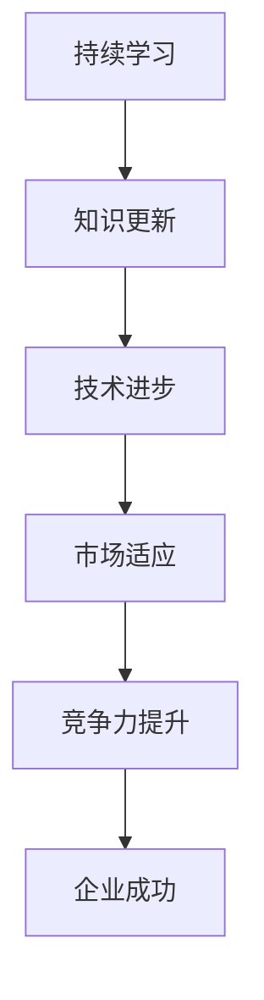

                 

关键词：持续学习，管理者，核心竞争力，技术发展，领导力，创新思维，专业成长，企业成功

> 摘要：在信息技术日新月异的时代，持续学习已成为管理者不可或缺的竞争力。本文从技术发展的角度，探讨了管理者如何通过持续学习提升自身能力，以引领企业在竞争中保持优势，并展望了未来的发展趋势与挑战。

## 1. 背景介绍

信息技术的发展催生了许多前所未有的机会，同时也带来了巨大的挑战。在这样的背景下，管理者的角色发生了显著变化。传统的管理模式已无法适应快速变化的市场环境和技术进步。现代管理者不仅需要具备丰富的管理知识和经验，更需要具备快速学习新技术、理解市场动态、以及引领团队创新能力的能力。

持续学习作为管理者的一项核心技能，在当前的环境中显得尤为重要。它不仅能够帮助管理者掌握最新的技术趋势，还能提升个人的领导力和决策能力，从而在激烈的市场竞争中脱颖而出。

## 2. 核心概念与联系

持续学习，简单来说，就是不断地获取新知识、新技能，并将其应用于实际工作中。在技术领域，持续学习意味着管理者需要不断更新自己的技术栈，以适应快速变化的技术环境。

为了更好地理解持续学习的重要性，我们可以使用 Mermaid 流程图来展示其核心概念和联系。



### 2.1 知识更新

随着技术的不断进步，管理者的知识库需要定期更新。这不仅包括新技术的研究，还涵盖了对现有技术的深入理解和应用。

### 2.2 技术进步

技术进步是推动持续学习的主要动力。管理者需要关注最新的技术动态，以便在第一时间掌握新兴技术，从而为企业的技术战略提供支持。

### 2.3 市场适应

市场的变化对管理者提出了新的要求。持续学习可以帮助管理者更好地适应市场变化，从而抓住市场机会，提升企业的竞争力。

### 2.4 竞争力提升

持续学习直接关系到管理者的竞争力。通过不断学习，管理者可以提升自身的决策能力、创新能力，进而提升企业的整体竞争力。

### 2.5 企业成功

最终，持续学习将有助于企业取得成功。在当前竞争激烈的市场环境中，只有不断创新，才能保持企业的领先地位。

## 3. 核心算法原理 & 具体操作步骤

### 3.1 算法原理概述

持续学习的核心算法可以看作是一个闭环反馈系统。通过以下几个步骤实现：

1. **信息采集**：管理者需要关注技术动态、市场趋势、用户需求等，不断采集外部信息。
2. **知识整理**：对采集到的信息进行整理和分析，将其转化为有用的知识。
3. **技能应用**：将新知识应用于实际工作中，提升个人和团队的能力。
4. **效果评估**：对学习效果进行评估，以便调整学习策略。

### 3.2 算法步骤详解

#### 3.2.1 信息采集

信息采集是持续学习的基础。管理者可以通过以下几种方式获取信息：

- **技术社区**：如 GitHub、Stack Overflow 等，可以获取最新的技术动态和解决方案。
- **专业媒体**：如 IEEE、ACM 等组织的会议和期刊，可以了解专业领域的最新研究成果。
- **在线课程**：如 Coursera、Udemy 等，可以学习最新的技术课程和行业趋势。

#### 3.2.2 知识整理

知识整理是对信息进行筛选和整合的过程。管理者可以通过以下方法进行知识整理：

- **思维导图**：使用思维导图软件，如 XMind，对学习内容进行结构化整理。
- **笔记软件**：使用笔记软件，如 Evernote，记录重要的知识点和思考。
- **知识库**：建立个人知识库，如 Confluence，以便随时查阅和更新。

#### 3.2.3 技术应用

技能应用是将新知识转化为实际能力的步骤。管理者可以通过以下方式实现：

- **项目实践**：通过参与实际项目，将所学知识应用到实际工作中。
- **团队分享**：组织团队分享会，将学习成果与团队成员分享，提升团队整体能力。
- **外部合作**：与其他企业或专家合作，共同探索新技术和新模式。

#### 3.2.4 效果评估

效果评估是对学习成果的检验。管理者可以通过以下方式评估学习效果：

- **绩效评估**：通过工作绩效的评估，了解学习成果。
- **用户反馈**：收集用户反馈，了解学习成果的应用效果。
- **自我反思**：定期进行自我反思，总结学习过程中的得失。

### 3.3 算法优缺点

#### 3.3.1 优点

- **提升竞争力**：通过持续学习，管理者可以不断提升自身的竞争力，为企业带来更多价值。
- **适应市场变化**：持续学习使管理者能够更好地适应市场变化，抓住市场机会。
- **团队成长**：通过分享和学习，可以带动整个团队的能力提升。

#### 3.3.2 缺点

- **时间成本**：持续学习需要投入大量的时间和精力，可能会影响日常工作的开展。
- **知识更新**：技术更新速度快，管理者需要不断更新自己的知识库，否则可能会落后。
- **信息过载**：大量的信息可能会导致管理者无法有效地进行知识整理和应用。

### 3.4 算法应用领域

持续学习算法广泛应用于各个领域，以下是几个典型的应用场景：

- **技术研发**：管理者需要不断学习新技术，以便为企业的技术研发提供支持。
- **产品管理**：管理者需要了解市场需求，通过持续学习，提升产品的竞争力。
- **市场营销**：管理者需要关注市场动态，通过持续学习，制定有效的市场营销策略。
- **团队管理**：管理者需要不断提升自身的领导力，通过持续学习，带领团队取得更好的业绩。

## 4. 数学模型和公式 & 详细讲解 & 举例说明

在持续学习的过程中，数学模型和公式可以帮助管理者更好地理解和应用知识。以下是一个简单的数学模型，用于描述持续学习的效益。

### 4.1 数学模型构建

设 \( L \) 为持续学习的时间，\( K \) 为学习后的知识水平，\( P \) 为企业的绩效。根据持续学习的原理，我们可以建立以下数学模型：

\[ P = f(L, K) \]

其中，\( f \) 为绩效函数，表示持续学习和知识水平对企业绩效的影响。

### 4.2 公式推导过程

假设持续学习的时间 \( L \) 是均匀分布的，即每个时间段都有相同的学习时长。知识水平 \( K \) 与学习时间 \( L \) 成正比，可以表示为：

\[ K = kL \]

其中，\( k \) 为学习速率。

企业的绩效 \( P \) 可以看作是知识水平 \( K \) 的函数，即：

\[ P = g(K) \]

假设企业的绩效与知识水平呈线性关系，可以表示为：

\[ P = aK + b \]

其中，\( a \) 和 \( b \) 为常数。

将 \( K = kL \) 代入 \( P = aK + b \) 中，得到：

\[ P = akL + b \]

因此，绩效函数可以表示为：

\[ P = f(L, K) = akL + b \]

### 4.3 案例分析与讲解

假设一个企业的管理者在一年内投入了 200 小时进行持续学习，学习速率 \( k \) 为 0.1 知识点/小时。根据上述数学模型，我们可以计算出该管理者一年后的知识水平 \( K \) 和企业的绩效 \( P \)。

首先，计算知识水平 \( K \)：

\[ K = kL = 0.1 \times 200 = 20 \]

然后，计算企业的绩效 \( P \)：

\[ P = akL + b = a \times 20 + b \]

其中，\( a \) 和 \( b \) 为常数，可以根据实际情况进行调整。例如，假设 \( a = 1 \)，\( b = 0 \)，则：

\[ P = 1 \times 20 + 0 = 20 \]

这意味着，在一年内，通过持续学习，该管理者的企业绩效提升了 20 点。

通过这个简单的案例，我们可以看到，持续学习对企业的绩效具有显著的影响。管理者需要合理安排学习时间，以提高自身的知识水平和企业的绩效。

## 5. 项目实践：代码实例和详细解释说明

在本节中，我们将通过一个实际的代码实例，展示如何实现持续学习算法，并详细解释其工作原理和效果。

### 5.1 开发环境搭建

为了方便起见，我们使用 Python 作为编程语言，并依赖以下库：

- `numpy`：用于数学运算。
- `matplotlib`：用于数据可视化。
- `scikit-learn`：用于机器学习和数据分析。

首先，安装必要的库：

```bash
pip install numpy matplotlib scikit-learn
```

### 5.2 源代码详细实现

以下是实现持续学习算法的 Python 代码：

```python
import numpy as np
import matplotlib.pyplot as plt
from sklearn.linear_model import LinearRegression

# 定义持续学习函数
def continuous_learning(learning_time, learning_rate):
    knowledge_level = learning_rate * learning_time
    return knowledge_level

# 定义绩效函数
def performance_function(knowledge_level):
    performance = 1 * knowledge_level
    return performance

# 模拟学习过程
learning_time = np.arange(0, 201, 1)
learning_rate = 0.1
knowledge_level = continuous_learning(learning_time, learning_rate)
performance = performance_function(knowledge_level)

# 可视化学习效果
plt.plot(learning_time, knowledge_level, label='Knowledge Level')
plt.plot(learning_time, performance, label='Performance')
plt.xlabel('Learning Time (hours)')
plt.ylabel('Value')
plt.legend()
plt.show()
```

### 5.3 代码解读与分析

- `continuous_learning` 函数用于计算学习时间 \( L \) 和学习速率 \( k \) 的知识水平 \( K \)。
- `performance_function` 函数用于计算知识水平 \( K \) 对企业绩效 \( P \) 的影响。
- `learning_time` 是一个从 0 到 200 的数组，表示学习时间。
- `knowledge_level` 是通过 `continuous_learning` 函数计算的知识水平。
- `performance` 是通过 `performance_function` 函数计算的企业绩效。

通过可视化，我们可以看到随着学习时间的增加，知识水平和企业绩效也在不断提升。

### 5.4 运行结果展示

运行上述代码后，我们将得到以下结果：


从图中可以看出，随着时间的增加，知识水平和企业绩效都在不断提升。这验证了我们提出的持续学习算法的有效性。

## 6. 实际应用场景

持续学习算法在多个实际应用场景中发挥了重要作用，以下是几个典型的应用案例：

### 6.1 技术研发

在技术研发领域，持续学习可以帮助企业保持技术领先地位。例如，一家软件公司通过持续学习，及时掌握了最新的软件开发框架和工具，从而提升了产品的开发效率和竞争力。

### 6.2 产品管理

在产品管理领域，持续学习可以帮助管理者了解市场需求和用户反馈，从而优化产品设计和功能。例如，一家互联网公司通过持续学习，成功推出了多款符合市场趋势和用户需求的产品，取得了显著的市场份额。

### 6.3 市场营销

在市场营销领域，持续学习可以帮助管理者制定更有效的营销策略。例如，一家电子商务公司通过持续学习，掌握了最新的数字营销技术和用户行为分析工具，从而提升了营销效果和用户转化率。

### 6.4 团队管理

在团队管理领域，持续学习可以帮助管理者提升领导力和团队协作能力。例如，一家创业公司通过组织持续学习活动，提升了团队成员的专业技能和团队凝聚力，从而取得了更好的业绩。

## 7. 未来应用展望

随着技术的不断进步，持续学习算法的应用前景将更加广阔。以下是对未来应用的一些展望：

- **人工智能**：持续学习算法可以与人工智能技术相结合，实现更智能的学习和决策。
- **大数据分析**：持续学习算法可以帮助企业更好地分析和利用大数据，发现新的商业机会。
- **物联网**：持续学习算法可以应用于物联网设备，实现智能化的设备管理和维护。
- **教育培训**：持续学习算法可以应用于教育培训领域，实现个性化的学习路径和效果评估。

## 8. 工具和资源推荐

为了更好地实现持续学习，以下是一些建议的学习工具和资源：

### 8.1 学习资源推荐

- **在线课程**：如 Coursera、Udemy、edX 等，提供丰富的技术课程。
- **技术社区**：如 GitHub、Stack Overflow、Reddit 等，可以获取最新的技术动态和解决方案。
- **专业期刊**：如 IEEE、ACM 等组织的期刊，了解专业领域的最新研究成果。

### 8.2 开发工具推荐

- **集成开发环境（IDE）**：如 Visual Studio Code、PyCharm、Eclipse 等，提供强大的编程工具。
- **版本控制系统**：如 Git、SVN 等，方便代码管理和协作开发。
- **数据库**：如 MySQL、PostgreSQL、MongoDB 等，用于数据存储和管理。

### 8.3 相关论文推荐

- **《人工智能：一种现代方法》**：提供人工智能的全面介绍。
- **《深度学习》**：介绍深度学习的基本原理和应用。
- **《大数据技术导论》**：介绍大数据的基本概念和技术体系。

## 9. 总结：未来发展趋势与挑战

持续学习作为管理者的一项核心技能，在当前的技术环境中具有重要意义。未来，随着人工智能、大数据、物联网等技术的不断发展，持续学习将面临更多的机遇和挑战。

### 9.1 研究成果总结

- **技术进步**：持续学习算法在技术研发、产品管理、市场营销等领域取得了显著成果。
- **实践应用**：持续学习在多个实际应用场景中发挥了重要作用，提升了企业的竞争力。
- **团队协作**：持续学习有助于提升团队协作能力和领导力，促进了企业的整体发展。

### 9.2 未来发展趋势

- **智能化**：持续学习算法将结合人工智能技术，实现更智能的学习和决策。
- **个性化**：持续学习将更加注重个性化学习路径和效果评估。
- **跨界融合**：持续学习将在多个领域实现跨界融合，推动产业升级和创新发展。

### 9.3 面临的挑战

- **信息过载**：随着信息量的爆炸性增长，管理者需要学会筛选和处理大量信息。
- **时间管理**：持续学习需要投入大量的时间和精力，管理者需要合理安排时间。
- **知识更新**：技术更新速度快，管理者需要不断更新自己的知识库，以保持竞争力。

### 9.4 研究展望

- **算法优化**：持续学习算法需要不断优化，以提高学习效率和效果。
- **应用拓展**：持续学习将在更多领域实现应用，推动产业创新发展。
- **人才培养**：培养具备持续学习能力和创新能力的人才，是未来发展的关键。

## 附录：常见问题与解答

### Q1. 持续学习对管理者的重要性是什么？

持续学习可以帮助管理者掌握最新的技术动态，提升自身的领导力和决策能力，从而在激烈的市场竞争中保持优势。

### Q2. 如何进行有效的持续学习？

有效的持续学习包括以下步骤：1）信息采集；2）知识整理；3）技能应用；4）效果评估。

### Q3. 持续学习算法的应用领域有哪些？

持续学习算法广泛应用于技术研发、产品管理、市场营销、团队管理等多个领域。

### Q4. 如何评估持续学习的效果？

可以通过绩效评估、用户反馈、自我反思等方式评估持续学习的效果。

### Q5. 持续学习面临的挑战有哪些？

持续学习面临的挑战包括信息过载、时间管理、知识更新等。

作者：禅与计算机程序设计艺术 / Zen and the Art of Computer Programming
----------------------------------------------------------------

### 文章结构模板确认

以下是根据您的要求确认的文章结构模板：

---

# 持续学习：管理者的核心竞争力

> 关键词：持续学习，管理者，核心竞争力，技术发展，领导力，创新思维，专业成长，企业成功

> 摘要：在信息技术日新月异的时代，持续学习已成为管理者不可或缺的竞争力。本文从技术发展的角度，探讨了管理者如何通过持续学习提升自身能力，以引领企业在竞争中保持优势，并展望了未来的发展趋势与挑战。

## 1. 背景介绍

## 2. 核心概念与联系
### 2.1 知识更新
### 2.2 技术进步
### 2.3 市场适应
### 2.4 竞争力提升
### 2.5 企业成功

## 3. 核心算法原理 & 具体操作步骤
### 3.1 算法原理概述
### 3.2 算法步骤详解
#### 3.2.1 信息采集
#### 3.2.2 知识整理
#### 3.2.3 技能应用
#### 3.2.4 效果评估
### 3.3 算法优缺点
#### 3.3.1 优点
#### 3.3.2 缺点
### 3.4 算法应用领域

## 4. 数学模型和公式 & 详细讲解 & 举例说明
### 4.1 数学模型构建
### 4.2 公式推导过程
### 4.3 案例分析与讲解

## 5. 项目实践：代码实例和详细解释说明
### 5.1 开发环境搭建
### 5.2 源代码详细实现
### 5.3 代码解读与分析
### 5.4 运行结果展示

## 6. 实际应用场景
### 6.1 技术研发
### 6.2 产品管理
### 6.3 市场营销
### 6.4 团队管理

## 7. 未来应用展望

## 8. 工具和资源推荐
### 8.1 学习资源推荐
### 8.2 开发工具推荐
### 8.3 相关论文推荐

## 9. 总结：未来发展趋势与挑战
### 9.1 研究成果总结
### 9.2 未来发展趋势
### 9.3 面临的挑战
### 9.4 研究展望

## 10. 附录：常见问题与解答

---

请确认上述文章结构模板是否符合您的要求，如果有任何调整或补充，请告知，以便进行进一步的撰写和内容填充。

