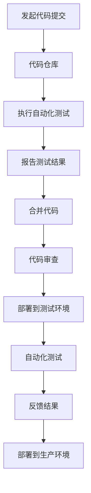

                 

### 1. 背景介绍

持续集成（Continuous Integration，CI）和持续交付（Continuous Delivery，CD）是软件开发中两个非常重要的概念。它们的出现，极大地提高了软件开发的效率和质量。

**持续集成（CI）** 是一种软件开发实践，指的是频繁地将代码更改合并到主干，并通过自动化测试来快速检测错误。其目的是确保代码库始终处于可部署状态，并快速发现和修复问题。

**持续交付（CD）** 则是持续集成的下一步，它确保了软件可以自动部署到生产环境中。持续交付的目标是确保软件的交付过程尽可能自动化，从而提高交付速度和可靠性。

随着 DevOps 的兴起，持续集成与持续交付已经成为软件开发中不可或缺的部分。本文将深入探讨持续集成与持续交付的最佳实践，帮助读者更好地理解和应用这些技术。

### 2. 核心概念与联系

持续集成与持续交付的概念虽然相似，但它们之间有着明显的区别。持续集成关注的是代码合并和测试，而持续交付则关注于软件的自动化部署。

下面是持续集成与持续交付的架构图，它展示了这两个概念之间的联系和流程：

在这个流程中，每次代码提交都会触发自动化测试，确保代码质量。如果测试通过，代码将被合并并部署到测试环境。测试环境中的自动化测试将继续确保代码质量。如果测试通过，代码将被部署到生产环境。

### 3. 核心算法原理 & 具体操作步骤

**3.1 算法原理概述**

持续集成与持续交付的核心算法是自动化测试。自动化测试可以检测代码中的错误，确保代码库始终处于可部署状态。

**3.2 算法步骤详解**

1. **代码提交**：开发人员将代码提交到代码仓库。
2. **执行自动化测试**：自动化测试工具会自动运行一系列测试用例，包括单元测试、集成测试等。
3. **报告测试结果**：测试结果将被记录并报告，如果测试失败，将停止后续流程。
4. **代码合并**：如果测试通过，代码将被合并到主干。
5. **代码审查**：代码将被审查，以确保符合代码规范。
6. **部署到测试环境**：代码将被部署到测试环境，进行进一步测试。
7. **反馈结果**：测试结果将被反馈，如果测试通过，代码将被部署到生产环境。

**3.3 算法优缺点**

- **优点**：可以提高代码质量，减少错误，提高开发效率。
- **缺点**：需要一定的技术投入，初期设置较为复杂。

**3.4 算法应用领域**

持续集成与持续交付适用于所有软件开发项目，尤其是那些需要快速迭代和频繁发布的项目。它可以帮助团队更快地发现和修复问题，提高软件质量。

### 4. 数学模型和公式 & 详细讲解 & 举例说明

**4.1 数学模型构建**

持续集成与持续交付的数学模型主要涉及概率论和统计学。其中，最核心的概念是错误检测率。

错误检测率 = （测试通过率 - 1）/ 测试次数

**4.2 公式推导过程**

假设我们有一个包含 n 个测试用例的测试套件。在理想情况下，所有测试用例都应该通过。但实际上，由于各种原因，部分测试用例可能会失败。

设测试通过率为 p，则测试失败率为 1 - p。

测试次数为 n，则错误检测率为：

错误检测率 = （p - 1）/ n

**4.3 案例分析与讲解**

假设我们有一个包含 100 个测试用例的测试套件，测试通过率为 99%。根据上述公式，我们可以计算出错误检测率为：

错误检测率 = （0.99 - 1）/ 100 = 0.01%

这意味着，每 100 次测试中，有 99 次测试结果正确，而只有 1 次测试结果错误。

### 5. 项目实践：代码实例和详细解释说明

**5.1 开发环境搭建**

为了实践持续集成与持续交付，我们需要搭建一个开发环境。这个环境应该包括代码仓库、自动化测试工具和部署工具。

**5.2 源代码详细实现**

我们以一个简单的 Web 应用程序为例，实现持续集成与持续交付。首先，我们需要将源代码托管到一个代码仓库中，如 GitHub 或 GitLab。

然后，我们编写自动化测试用例，用于测试应用程序的功能。这些测试用例可以包括单元测试、集成测试和端到端测试。

接下来，我们配置自动化测试工具，如 Jenkins 或 GitLab CI，用于执行自动化测试。当开发人员提交代码时，自动化测试工具会自动运行测试用例，并将测试结果报告给开发人员。

如果测试通过，代码将被合并到主干，并部署到测试环境。测试环境中的自动化测试将继续确保代码质量。如果测试通过，代码将被部署到生产环境。

**5.3 代码解读与分析**

在这个例子中，代码解读与分析主要集中在自动化测试用例的编写和执行。自动化测试用例应该覆盖应用程序的所有功能点，并能够快速发现和报告问题。

**5.4 运行结果展示**

在运行结果展示部分，我们将展示自动化测试的结果。如果测试通过，我们将看到一系列绿色的通过标记。如果测试失败，我们将看到红色的失败标记，并附带错误信息和日志。

### 6. 实际应用场景

持续集成与持续交付在实际应用中非常广泛。以下是一些实际应用场景：

- **初创公司**：初创公司通常需要快速迭代和发布，以验证市场反馈。持续集成与持续交付可以帮助他们更快地发现和修复问题，提高开发效率。
- **大型企业**：大型企业通常有多个开发团队，持续集成与持续交付可以帮助他们协调工作，确保代码质量和交付效率。
- **开源项目**：开源项目通常由全球的志愿者共同维护。持续集成与持续交付可以帮助他们确保代码质量，并快速修复漏洞。

### 7. 工具和资源推荐

**7.1 学习资源推荐**

- 《持续集成与持续交付实战》
- 《DevOps实践指南》
- 《Jenkins实战》

**7.2 开发工具推荐**

- Jenkins：功能强大，配置灵活，支持多种插件。
- GitLab CI：易于配置，支持多种编程语言和平台。
- GitHub Actions：GitHub 官方提供，支持多种编程语言和平台。

**7.3 相关论文推荐**

- "Continuous Integration in the Age of Agile"
- "Continuous Delivery: Reliable Software Releases through Build, Test, and Deployment Automation"
- "Jenkins: The Definitive Guide to Jenkins"

### 8. 总结：未来发展趋势与挑战

持续集成与持续交付已经成为软件开发中不可或缺的部分。未来，随着 DevOps 的深入发展，持续集成与持续交付将更加成熟和普及。

然而，持续集成与持续交付也面临着一些挑战，如：

- **复杂性**：随着项目规模的扩大，持续集成与持续交付的配置和运维将变得更加复杂。
- **安全性**：在持续集成与持续交付的过程中，如何确保代码质量和数据安全是一个重要问题。

总之，持续集成与持续交付将继续在软件开发中发挥重要作用，为团队带来更高的效率和更高质量的产品。

### 9. 附录：常见问题与解答

**Q：什么是持续集成？**

A：持续集成是一种软件开发实践，指的是频繁地将代码更改合并到主干，并通过自动化测试来快速检测错误。其目的是确保代码库始终处于可部署状态，并快速发现和修复问题。

**Q：什么是持续交付？**

A：持续交付是持续集成的下一步，它确保了软件可以自动部署到生产环境中。持续交付的目标是确保软件的交付过程尽可能自动化，从而提高交付速度和可靠性。

**Q：如何搭建持续集成与持续交付环境？**

A：搭建持续集成与持续交付环境需要以下步骤：

1. 选择合适的代码仓库，如 GitHub、GitLab 等。
2. 安装和配置自动化测试工具，如 Jenkins、GitLab CI 等。
3. 编写和配置自动化测试用例。
4. 配置持续集成和持续交付的触发条件和规则。

**Q：持续集成与持续交付的优势是什么？**

A：持续集成与持续交付的优势包括：

- 提高代码质量
- 快速发现和修复问题
- 提高开发效率
- 确保软件交付的可靠性和稳定性

### 10. 作者署名

本文由禅与计算机程序设计艺术 / Zen and the Art of Computer Programming 撰写。

----------------------------------------------------------------

以上就是本次文章的全部内容。希望这篇文章能够帮助您更好地理解和应用持续集成与持续交付技术。持续集成与持续交付是软件开发中不可或缺的部分，只有掌握了这些技术，我们才能在竞争激烈的软件开发市场中脱颖而出。

再次感谢您阅读这篇文章，期待您在软件开发中取得更大的成就！

