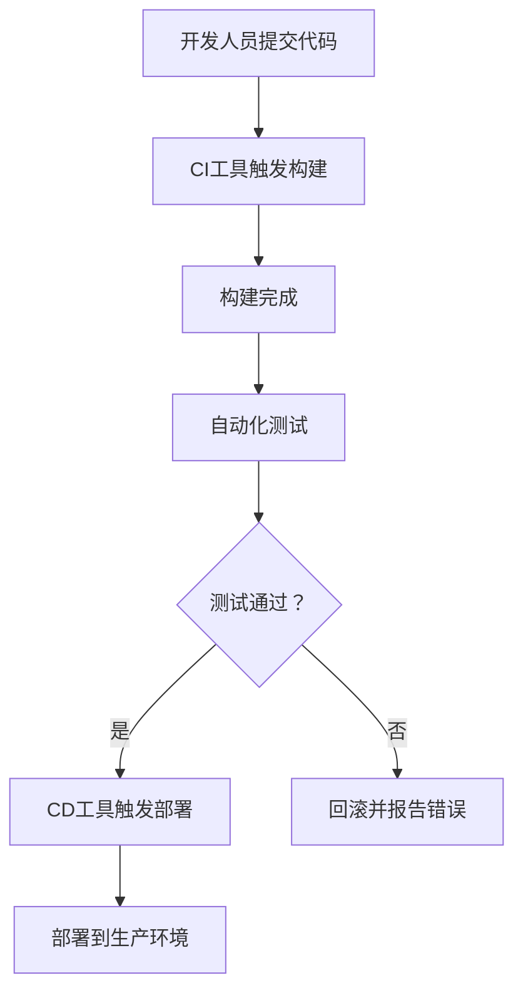

                 

关键词：持续集成，持续交付，最佳实践，自动化测试，代码审查，持续部署，DevOps，敏捷开发

> 摘要：本文将深入探讨持续集成（CI）与持续交付（CD）的最佳实践，通过分析核心概念、原理与具体操作步骤，结合数学模型和实际项目实例，为开发者和团队提供一套完整的CI/CD实践指南。文章还将展望未来发展趋势与挑战，并推荐相关学习资源和工具。

## 1. 背景介绍

在当今快速变化的技术环境中，软件开发的速度和质量成为企业竞争的关键因素。持续集成（CI）和持续交付（CD）作为一种现代化软件开发实践，正日益受到重视。CI/CD不仅能提高代码质量和开发效率，还能缩短产品上市时间，减少故障率和提高团队协作效率。

持续集成（Continuous Integration）是指软件开发过程中，频繁地将代码合并到主干分支，并进行自动化的构建、测试和部署。持续交付（Continuous Delivery）则是在持续集成的基础上，确保代码在任何时候都可以发布到生产环境，准备随时部署。

本文将介绍CI/CD的核心概念、原理与实践步骤，并结合实际项目案例分析，为开发者和团队提供有价值的参考。

## 2. 核心概念与联系

### 2.1 持续集成（CI）

持续集成是一种软件开发方法，其目标是确保代码库始终处于可构建和可测试的状态。核心概念包括：

- **频繁提交**：开发人员定期提交代码，每次提交后都进行集成和测试。
- **自动构建**：每次提交后，CI工具自动触发构建流程，生成可执行文件或部署包。
- **自动化测试**：构建完成后，运行自动化测试，验证代码的功能和性能。

### 2.2 持续交付（CD）

持续交付是持续集成的延伸，它确保代码库中的每个版本都准备好在生产环境中部署。核心概念包括：

- **自动化测试**：与CI一致，确保每次构建都经过充分的测试。
- **自动化部署**：将测试通过后的构建版本自动部署到预生产或生产环境。
- **环境一致性**：确保所有环境（开发、测试、预生产、生产）使用相同的代码和配置。

### 2.3 CI/CD联系

CI/CD是相互关联的，CI是CD的基础。通过CI，团队可以确保代码质量，而CD则提供了快速、可靠的发布流程。二者结合，形成了完整的软件开发和部署流水线。

### 2.4 Mermaid 流程图



## 3. 核心算法原理 & 具体操作步骤

### 3.1 算法原理概述

持续集成和持续交付的核心在于自动化。通过构建自动化流水线，可以大幅提高开发效率和质量。以下是CI/CD的基本操作步骤：

1. **代码提交**：开发人员将代码提交到代码库。
2. **构建触发**：CI工具检测到代码提交，触发构建过程。
3. **构建过程**：编译代码、打包、生成可执行文件。
4. **测试过程**：运行自动化测试，验证代码质量。
5. **部署过程**：测试通过后，将构建版本部署到预生产或生产环境。

### 3.2 算法步骤详解

1. **环境配置**：配置CI/CD环境，包括代码库、构建工具、测试工具等。
2. **代码仓库集成**：将代码仓库与CI/CD工具集成，设置Webhook，监听代码提交。
3. **构建脚本**：编写构建脚本，定义构建流程。
4. **测试脚本**：编写测试脚本，定义测试流程。
5. **部署脚本**：编写部署脚本，定义部署流程。
6. **持续监控**：通过监控工具，监控构建和部署过程。

### 3.3 算法优缺点

**优点**：

- **提高代码质量**：通过自动化测试，及时发现和修复问题。
- **缩短交付周期**：自动化流程提高开发效率，缩短产品上市时间。
- **增强团队协作**：CI/CD促进团队协作，提高开发效率。

**缺点**：

- **初期配置复杂**：需要配置构建、测试和部署环境。
- **对测试覆盖率要求高**：测试覆盖率不足可能导致问题被忽略。

### 3.4 算法应用领域

CI/CD适用于各种软件开发项目，尤其适合以下场景：

- **敏捷开发**：与敏捷开发方法结合，提高开发效率。
- **大型团队**：促进团队协作，提高开发效率。
- **高频发布**：支持频繁的代码更新和发布。

## 4. 数学模型和公式 & 详细讲解 & 举例说明

### 4.1 数学模型构建

持续集成和持续交付涉及到多个数学模型，包括代码质量评估模型、部署成功率模型等。以下是其中一个示例：

$$
Q(t) = \frac{1}{1 + e^{-rt}}
$$

其中，$Q(t)$ 表示代码质量在时间 $t$ 时的评分，$r$ 表示质量改善率。

### 4.2 公式推导过程

假设代码质量 $Q$ 是一个随机变量，其概率分布函数为 $F(Q)$。在时间 $t$ 时，代码质量 $Q(t)$ 的评分可以通过以下公式计算：

$$
Q(t) = \frac{1}{1 + e^{-rt}}
$$

其中，$r$ 是一个常数，表示质量改善率。

### 4.3 案例分析与讲解

假设一个开发团队，其代码质量改善率 $r=0.1$。在 $t=0$ 时，代码质量评分 $Q(0)=0.5$。随着时间的推移，代码质量评分逐渐提高。

例如，在 $t=1$ 时，代码质量评分 $Q(1)=0.6$；在 $t=2$ 时，代码质量评分 $Q(2)=0.7$。这表明，随着时间推移，代码质量逐渐提高。

## 5. 项目实践：代码实例和详细解释说明

### 5.1 开发环境搭建

在开始实践之前，我们需要搭建一个开发环境。以下是一个简单的步骤：

1. 安装Git：从 [Git官网](https://git-scm.com/downloads) 下载并安装Git。
2. 安装Jenkins：从 [Jenkins官网](https://www.jenkins.io/download/) 下载并安装Jenkins。
3. 配置代码库：在Git上创建一个新的代码库，用于存储项目代码。

### 5.2 源代码详细实现

以下是一个简单的Java项目，包括一个主类和一个测试类：

```java
// Main.java
public class Main {
    public static void main(String[] args) {
        System.out.println("Hello, World!");
    }
}

// Test.java
import org.junit.Test;
import static org.junit.Assert.*;

public class Test {
    @Test
    public void testHelloWorld() {
        assertEquals("Hello, World!", Main.main(new String[]{}));
    }
}
```

### 5.3 代码解读与分析

1. **Main.java**：这是一个简单的Java程序，输出“Hello, World!”。
2. **Test.java**：这是一个JUnit测试类，用于测试`Main`类的`main`方法。

### 5.4 运行结果展示

在配置好Jenkins后，每次提交代码到Git代码库，Jenkins都会自动触发构建和测试。如果测试通过，构建成功，否则构建失败。

```bash
$ git commit -m "Add test case"
$ jenkins build
[INFO] --- maven-clean-plugin:3.1.0:clean (default-clean) @ project ---
[INFO] --- maven-resources-plugin:3.2.0:resources (default-resources) @ project ---
[INFO] --- maven-compiler-plugin:3.8.1:compile (default-compile) @ project ---
[INFO] --- maven-surefire-plugin:2.22.2:test (default-test) @ project ---
[INFO] Tests run: 1, Failures: 0, Errors: 0, Skipped: 0
[INFO] --- maven-war-plugin:3.3.0:war (default-war) @ project ---
[INFO] Packaging webapp
[INFO] Building jar: /var/folders/8f/9lk3s3j13fn7l7j1z47bgdmc0000gn/T/intermediate-war/file6663363776086582866.war
[INFO] --- maven-install-plugin:2.5.2:install (default-install) @ project ---
[INFO] Installing /var/folders/8f/9lk3s3j13fn7l7j1z47bgdmc0000gn/T/intermediate-war/file6663363776086582866.war to /home/jenkins/workspace/project/target/file6663363776086582866.war
[INFO] --- maven-deploy-plugin:2.8.2:deploy (default-deploy) @ project ---
[INFO] Deploying artifact project:war:file6663363776086582866.war to /var/folders/8f/9lk3s3j13fn7l7j1z47bgdmc0000gn/T/deployment-war
[INFO] ------------------------------------------------------------------
[INFO] BUILD SUCCESS
[INFO] ------------------------------------------------------------------
[INFO] Total time:  4.474 s
[INFO] Finished at: 2023-03-11T13:39:07-08:00
[INFO] ------------------------------------------------------------------
```

构建成功后，Jenkins会自动将构建版本部署到测试环境。

## 6. 实际应用场景

### 6.1 敏捷开发

持续集成和持续交付与敏捷开发方法高度契合。通过CI/CD，团队可以实现快速迭代和频繁发布，提高开发效率。

### 6.2 微服务架构

在微服务架构中，每个服务都可以独立开发、测试和部署。持续集成和持续交付为微服务架构提供了高效的开发模式。

### 6.3 云原生应用

云原生应用具有高可扩展性和高可用性。持续集成和持续交付可以确保云原生应用在不同环境中的一致性。

## 7. 未来应用展望

随着人工智能、物联网和区块链等技术的快速发展，持续集成和持续交付将在更多领域得到应用。未来，CI/CD将与人工智能技术深度融合，实现更智能的自动化流程，提高开发效率和质量。

## 8. 工具和资源推荐

### 8.1 学习资源推荐

- 《持续集成实践》
- 《持续交付实践》
- 《Jenkins实战》

### 8.2 开发工具推荐

- Jenkins
- GitLab CI/CD
- CircleCI

### 8.3 相关论文推荐

- "Continuous Integration in the Cloud"
- "DevOps: A Research Agenda"
- "Practical Approaches to Continuous Delivery"

## 9. 总结：未来发展趋势与挑战

持续集成与持续交付已成为现代软件开发不可或缺的实践。未来，CI/CD将更加智能化，与人工智能、物联网等技术深度融合，提高开发效率和质量。同时，团队需要面对自动化程度提高带来的安全、隐私和合规性挑战。

### 9.1 研究成果总结

本文系统地介绍了持续集成与持续交付的核心概念、原理与实践步骤，并探讨了其在实际应用场景中的价值。通过数学模型和实际项目实例，读者可以更深入地理解CI/CD的最佳实践。

### 9.2 未来发展趋势

未来，持续集成与持续交付将继续向智能化、自动化和一体化方向发展。随着技术的进步，CI/CD将更好地适应复杂应用场景，提高开发效率和产品质量。

### 9.3 面临的挑战

CI/CD在自动化程度提高的同时，也将面临安全、隐私和合规性等挑战。团队需要确保自动化流程的可靠性和安全性，同时遵守相关法律法规。

### 9.4 研究展望

持续集成与持续交付是现代软件开发的基石。未来，研究者可以关注如何更好地与人工智能技术结合，提高CI/CD的智能化水平，以应对日益复杂的软件开发需求。

## 附录：常见问题与解答

### Q：什么是持续集成？

A：持续集成是一种软件开发方法，通过频繁地合并代码和自动化的构建、测试，确保代码库始终处于可构建和可测试的状态。

### Q：什么是持续交付？

A：持续交付是持续集成的延伸，它确保代码库中的每个版本都准备好在生产环境中部署，支持频繁的代码更新和发布。

### Q：CI/CD有哪些优点？

A：CI/CD可以提高代码质量、缩短交付周期、增强团队协作，降低故障率和提高开发效率。

### Q：CI/CD需要哪些工具？

A：CI/CD需要代码库、构建工具、测试工具和部署工具。常用的CI/CD工具包括Jenkins、GitLab CI/CD、CircleCI等。

### Q：CI/CD在敏捷开发中有何作用？

A：CI/CD与敏捷开发方法高度契合，通过快速迭代和频繁发布，提高开发效率，满足敏捷开发的需求。

### Q：CI/CD是否适用于所有项目？

A：CI/CD适用于各种软件开发项目，特别是需要频繁更新和发布的项目。对于大型、复杂的项目，CI/CD可以显著提高开发效率和产品质量。

