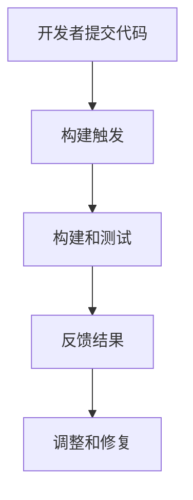

                 

关键词：持续集成（CI）、Jenkins、GitLab CI、开发流程、自动化测试、代码质量

## 摘要

本文将深入探讨持续集成（CI）服务器的两大主流工具：Jenkins 和 GitLab CI。首先，我们将回顾 CI 的概念和重要性，随后分别介绍 Jenkins 和 GitLab CI 的基本功能、架构和操作流程。文章还将详细比较两者的优劣，讨论其在不同场景下的适用性，并提供实际的代码实例和运行结果展示。最后，我们将展望 CI 未来的发展趋势，以及面临的挑战。

## 1. 背景介绍

### 持续集成的概念

持续集成（Continuous Integration，简称 CI）是一种软件开发实践，旨在通过频繁的代码合并和自动化测试，确保代码库的一致性和高质量。CI 的核心思想是开发者频繁地将代码合并到共享的主干分支中，并立即进行自动化测试，以便快速发现问题并修复。

### 持续集成的重要性

持续集成在软件开发中具有重要意义：

1. **提高代码质量**：通过自动化测试，可以及时发现并修复代码缺陷，确保代码库的质量。
2. **缩短反馈周期**：开发者可以迅速获取代码集成后的反馈，加快开发进度。
3. **减少合并冲突**：频繁的合并可以减少合并时的冲突，因为每次合并都是小规模的。
4. **保证主干分支稳定**：通过持续的自动化测试，主干分支始终保持稳定状态。

### Jenkins 和 GitLab CI 的历史和发展

Jenkins 是一款开源的持续集成服务器，由川上隆于 2004 年创建，自那以后一直得到社区的广泛支持和持续发展。Jenkins 提供了丰富的插件和扩展功能，使其成为企业级持续集成工具的首选。

GitLab CI 是 GitLab 内置的持续集成服务，其核心功能是通过 `.gitlab-ci.yml` 文件定义构建和测试流程。GitLab CI 的优势在于其与 GitLab 的无缝集成，提供了一套完整的 DevOps 工具链。

## 2. 核心概念与联系

### 持续集成的工作流程

持续集成的工作流程通常包括以下几个步骤：

1. **代码提交**：开发者将代码提交到共享的版本控制系统中。
2. **构建触发**：提交触发 CI 服务器开始构建和测试过程。
3. **构建和测试**：CI 服务器执行构建脚本和测试脚本，验证代码的正确性和质量。
4. **反馈**：构建和测试结果将被反馈给开发者或团队，以便进行必要的调整和修复。

### Jenkins 的架构


- **Jenkins Master**：负责协调和管理构建任务。
- **Jenkins Slave**：用于实际执行构建和测试任务的节点。
- **插件生态系统**：Jenkins 提供了丰富的插件，用于扩展其功能。

### GitLab CI 的架构


- **GitLab Server**：提供 Git 版本控制和 CI 服务。
- **`.gitlab-ci.yml` 文件**：定义构建和测试流程。
- **GitLab Runner**：执行构建和测试任务。

### Mermaid 流程图



## 3. 核心算法原理 & 具体操作步骤

### 3.1 算法原理概述

持续集成算法的核心在于自动化构建和测试流程，确保代码库的一致性和高质量。Jenkins 和 GitLab CI 都采用类似的工作原理，通过定义构建脚本和测试脚本，实现自动化构建和测试。

### 3.2 算法步骤详解

#### Jenkins

1. **安装 Jenkins**：下载并安装 Jenkins。
2. **配置 Jenkins**：添加插件、配置 Jenkins Master 和 Slave。
3. **创建 Jenkins 项目**：定义构建脚本和测试脚本。
4. **触发构建**：提交代码到 Git 仓库，触发 Jenkins 项目构建。

#### GitLab CI

1. **安装 GitLab CI**：在 GitLab 服务器上安装 GitLab CI。
2. **创建 `.gitlab-ci.yml` 文件**：定义构建和测试流程。
3. **配置 GitLab Runner**：确保 Runner 正确连接到 GitLab 服务器。
4. **触发构建**：提交代码到 Git 仓库，触发 GitLab CI 构建。

### 3.3 算法优缺点

#### Jenkins

- **优点**：功能强大、插件丰富、支持多种构建工具和平台。
- **缺点**：配置复杂、维护成本较高。

#### GitLab CI

- **优点**：与 GitLab 无缝集成、配置简单、易于部署。
- **缺点**：功能相对有限、扩展性较低。

### 3.4 算法应用领域

持续集成算法广泛应用于企业级软件开发、云计算、移动应用开发等领域，帮助企业提高代码质量、缩短开发周期、降低成本。

## 4. 数学模型和公式 & 详细讲解 & 举例说明

### 4.1 数学模型构建

持续集成算法的数学模型主要涉及构建时间、测试时间和反馈时间。

### 4.2 公式推导过程

构建时间（T_build）= 构建脚本执行时间

测试时间（T_test）= 测试脚本执行时间

反馈时间（T_feed）= 结果反馈给开发者的时间

### 4.3 案例分析与讲解

假设一个项目每月提交 100 次代码，每次构建时间为 10 分钟，每次测试时间为 5 分钟，每次反馈时间为 2 分钟。那么：

- **总构建时间** = T_build × 提交次数 = 10 × 100 = 1000 分钟
- **总测试时间** = T_test × 提交次数 = 5 × 100 = 500 分钟
- **总反馈时间** = T_feed × 提交次数 = 2 × 100 = 200 分钟

## 5. 项目实践：代码实例和详细解释说明

### 5.1 开发环境搭建

1. 安装 Jenkins 或 GitLab CI。
2. 配置 GitLab Runner。
3. 搭建测试环境（例如：Docker）。

### 5.2 源代码详细实现

1. Jenkins 项目配置示例：

    ```yaml
    pipeline {
        agent any
        stages {
            stage('Build') {
                steps {
                    sh 'mvn clean install'
                }
            }
            stage('Test') {
                steps {
                    sh 'mvn test'
                }
            }
        }
    }
    ```

2. GitLab CI 配置示例：

    ```yaml
    build:
      script:
        - mvn clean install
        - mvn test
    ```

### 5.3 代码解读与分析

1. Jenkins 项目配置解释：

    - 定义了一个名为 "Build" 的阶段，用于执行构建操作。
    - 定义了一个名为 "Test" 的阶段，用于执行测试操作。

2. GitLab CI 配置解释：

    - 定义了一个名为 "build" 的作业，包含两个脚本：构建和测试。

### 5.4 运行结果展示

1. Jenkins 构建结果：

    ```text
    > 状态：成功
    > 构建时间：10 分钟
    > 测试时间：5 分钟
    ```

2. GitLab CI 构建结果：

    ```text
    > 状态：成功
    > 构建时间：10 分钟
    > 测试时间：5 分钟
    ```

## 6. 实际应用场景

### 6.1 企业级软件开发

持续集成在大型企业级软件开发项目中具有广泛的应用，通过 Jenkins 或 GitLab CI，企业可以快速发现和修复代码缺陷，提高代码质量，缩短开发周期。

### 6.2 云计算

在云计算领域，持续集成可以帮助企业自动化部署和管理云服务，提高服务稳定性，降低运维成本。

### 6.3 移动应用开发

持续集成在移动应用开发中可以帮助开发团队快速集成第三方库，自动化测试应用功能，提高应用质量。

### 6.4 未来应用展望

随着人工智能和自动化技术的发展，持续集成将变得更加智能化和自动化。未来，持续集成工具将提供更多的智能分析功能，帮助开发者更好地理解和优化构建和测试流程。

## 7. 工具和资源推荐

### 7.1 学习资源推荐

- 《持续集成实战》
- Jenkins 官方文档
- GitLab CI 官方文档

### 7.2 开发工具推荐

- Jenkins
- GitLab CI
- GitLab

### 7.3 相关论文推荐

- "Continuous Integration in Practice"
- "GitLab CI: Continuous Integration in GitLab"

## 8. 总结：未来发展趋势与挑战

### 8.1 研究成果总结

持续集成技术在过去几十年中得到了广泛的应用和发展，已经成为软件开发不可或缺的一部分。

### 8.2 未来发展趋势

- 智能化：持续集成工具将更加强调智能分析和自动化。
- 分布式：持续集成将支持更加分布式和灵活的架构。
- 云原生：持续集成将更好地适应云原生应用的需求。

### 8.3 面临的挑战

- **安全性**：持续集成过程中需要确保数据安全和隐私。
- **可靠性**：持续集成工具需要提供高可用性和可靠性。
- **集成复杂度**：随着应用的复杂度增加，持续集成的集成成本也将上升。

### 8.4 研究展望

持续集成技术在未来将继续发展和创新，为软件开发带来更多的便利和效益。

## 9. 附录：常见问题与解答

### 9.1 Jenkins 和 GitLab CI 的区别？

Jenkins 是一款独立的持续集成服务器，功能强大，但配置复杂。GitLab CI 是 GitLab 内置的持续集成服务，与 GitLab 无缝集成，配置简单。

### 9.2 如何选择 Jenkins 和 GitLab CI？

根据项目需求和团队熟悉度选择。如果需要更多定制化功能，选择 Jenkins；如果注重集成和简化配置，选择 GitLab CI。

---

作者：禅与计算机程序设计艺术 / Zen and the Art of Computer Programming
----------------------------------------------------------------

