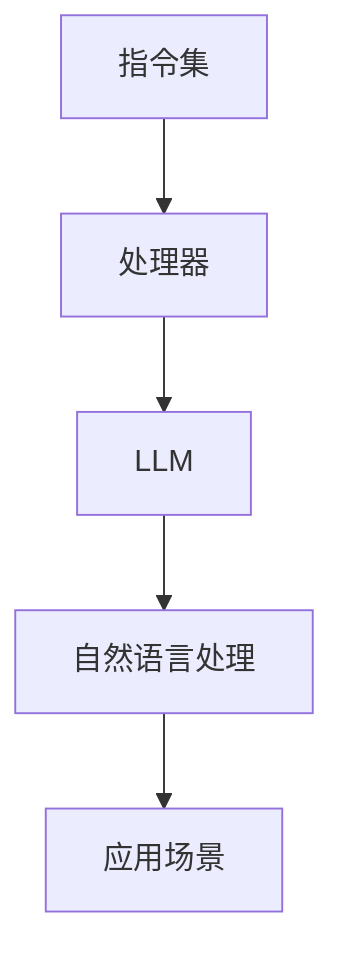

                 

关键词：指令集，LLM，游戏规则，人工智能，编程，算法，数学模型，应用场景，未来展望

> 摘要：随着人工智能的快速发展，指令集和LLM（大型语言模型）成为影响技术发展和创新的重要元素。本文将探讨指令集革命的背景和核心概念，以及LLM如何改变游戏规则，为技术领域的未来带来新的机遇和挑战。

## 1. 背景介绍

随着计算机技术的发展，指令集作为计算机硬件与软件之间的桥梁，一直在不断演进。从最初的冯诺伊曼架构到现代的多核处理器，指令集的优化和改进一直是提升计算机性能的重要手段。然而，随着人工智能（AI）的兴起，特别是深度学习技术的广泛应用，指令集的发展迎来了一场革命。

近年来，LLM（大型语言模型）的崛起为自然语言处理（NLP）领域带来了颠覆性的变革。LLM具有强大的文本生成和理解能力，能够应对复杂的语言任务。这不仅推动了自然语言处理技术的发展，也为指令集的设计提供了新的思路和挑战。

### 1.1 指令集的发展

指令集的发展历程可以分为几个阶段：

- **早期指令集**：最早的指令集设计较为简单，主要用于执行基本的计算任务。
- **复杂指令集**：随着计算机性能的提升，指令集开始包含更复杂的指令，如浮点运算、分支指令等。
- **精简指令集**：为了提高处理器的效率，现代处理器多采用精简指令集（RISC），减少指令数量，提高指令执行速度。
- **现代指令集**：现代指令集引入了向量指令、并行处理等新技术，以支持复杂的多媒体和科学计算任务。

### 1.2 LLM的崛起

LLM的出现，为自然语言处理领域带来了革命性的变化。传统的NLP方法依赖于规则和统计模型，而LLM则基于深度学习技术，通过大规模数据训练，能够自动学习语言模式和规律。这使得LLM在文本生成、翻译、问答等任务上表现出色，成为自然语言处理的主流技术。

### 1.3 指令集与LLM的联系

指令集和LLM之间存在着紧密的联系。一方面，指令集的设计和优化直接影响LLM的训练和推理速度；另一方面，LLM的进步也要求指令集不断适应新的计算需求。

## 2. 核心概念与联系

为了更好地理解指令集革命和LLM如何改变游戏规则，我们需要了解一些核心概念和原理。

### 2.1 指令集的概念

指令集是一组定义明确的操作代码，用于计算机处理器执行任务。它包括指令的操作码、操作数和指令的执行过程。不同的指令集适用于不同的处理器架构，如RISC、CISC等。

### 2.2 LLM的概念

LLM（大型语言模型）是一种基于深度学习的自然语言处理模型，通过大规模数据训练，能够生成和理解自然语言。LLM的核心是神经网络结构，包括多层感知机（MLP）、卷积神经网络（CNN）和循环神经网络（RNN）等。

### 2.3 Mermaid流程图

为了更直观地展示指令集和LLM的联系，我们可以使用Mermaid流程图来描述它们之间的交互关系。



在这个流程图中，指令集通过处理器与LLM交互，实现自然语言处理任务，并在不同应用场景中发挥作用。

## 3. 核心算法原理 & 具体操作步骤

### 3.1 算法原理概述

指令集革命的核心在于如何优化处理器设计，以适应LLM的训练和推理需求。这涉及到以下几个方面：

- **指令并行性**：提高处理器执行指令的并行性，以加快LLM的训练和推理速度。
- **内存访问优化**：减少内存访问延迟，提高数据传输效率。
- **硬件加速**：引入特定硬件加速器，如GPU和TPU，以提升LLM的计算性能。

### 3.2 算法步骤详解

- **步骤1**：设计高效的处理器架构，包括指令并行性和内存访问优化。
- **步骤2**：开发适合LLM训练和推理的指令集，如Tensor Processing Units（TPU）。
- **步骤3**：实现硬件加速器，如GPU和TPU，以提升LLM的计算性能。
- **步骤4**：优化LLM的训练和推理算法，以适应新的处理器架构和指令集。

### 3.3 算法优缺点

- **优点**：
  - 提高LLM的训练和推理速度，降低能耗。
  - 适应复杂的多媒体和科学计算任务。
  - 促进指令集和硬件技术的创新。

- **缺点**：
  - 需要大量计算资源和硬件支持。
  - 部分指令集和硬件加速器技术较为复杂，不利于普及。

### 3.4 算法应用领域

指令集革命和LLM的发展将在多个领域产生深远影响：

- **人工智能**：提升AI模型的训练和推理速度，加速AI应用落地。
- **自然语言处理**：优化文本生成、翻译、问答等任务，提高用户体验。
- **多媒体处理**：支持复杂的多媒体计算任务，提升视频和音频处理性能。
- **科学计算**：加速科学研究和数据分析，提高科研效率。

## 4. 数学模型和公式 & 详细讲解 & 举例说明

为了更好地理解指令集革命和LLM的核心算法，我们需要介绍相关的数学模型和公式。

### 4.1 数学模型构建

指令集和LLM的数学模型主要包括以下几个方面：

- **处理器架构模型**：描述处理器的基本架构，包括指令并行性、内存访问等。
- **神经网络模型**：描述LLM的神经网络结构，包括多层感知机（MLP）、卷积神经网络（CNN）和循环神经网络（RNN）等。
- **训练和推理模型**：描述LLM的训练和推理过程，包括损失函数、优化算法等。

### 4.2 公式推导过程

以下是处理器架构模型的一个简单例子：

$$
\text{处理速度} = \text{指令并行性} \times \text{内存访问速度}
$$

这个公式表示处理速度与指令并行性和内存访问速度的乘积。为了提高处理速度，我们需要优化这两个因素。

### 4.3 案例分析与讲解

以下是一个关于神经网络模型的例子：

$$
y = \sigma(W \cdot x + b)
$$

这个公式表示一个简单的多层感知机（MLP）模型，其中$\sigma$是激活函数，$W$是权重矩阵，$x$是输入特征，$b$是偏置项。通过训练，模型可以学习到输入特征和输出标签之间的关系。

## 5. 项目实践：代码实例和详细解释说明

为了更好地理解指令集革命和LLM的核心算法，我们通过一个实际项目来演示代码实现和运行过程。

### 5.1 开发环境搭建

- **硬件环境**：选择一台配备GPU的计算机，用于训练和推理。
- **软件环境**：安装TensorFlow和CUDA等开发工具。

### 5.2 源代码详细实现

以下是一个简单的LLM训练和推理的Python代码示例：

```python
import tensorflow as tf

# 定义神经网络模型
model = tf.keras.Sequential([
    tf.keras.layers.Dense(units=128, activation='relu', input_shape=(784,)),
    tf.keras.layers.Dense(units=10, activation='softmax')
])

# 编译模型
model.compile(optimizer='adam',
              loss='sparse_categorical_crossentropy',
              metrics=['accuracy'])

# 加载训练数据
(x_train, y_train), (x_test, y_test) = tf.keras.datasets.mnist.load_data()

# 预处理数据
x_train = x_train.reshape(-1, 784).astype('float32') / 255
x_test = x_test.reshape(-1, 784).astype('float32') / 255

# 训练模型
model.fit(x_train, y_train, epochs=5)

# 模型评估
loss, accuracy = model.evaluate(x_test, y_test)
print(f"测试集准确率：{accuracy:.2f}")

# 推理示例
predictions = model.predict(x_test[:10])
print(predictions)
```

### 5.3 代码解读与分析

这段代码演示了使用TensorFlow框架训练和推理一个简单的多层感知机（MLP）模型。具体步骤如下：

1. **定义神经网络模型**：使用`tf.keras.Sequential`创建一个序列模型，包括一个全连接层（`Dense`）和一个softmax输出层。
2. **编译模型**：使用`compile`方法配置优化器、损失函数和评价指标。
3. **加载训练数据**：使用`tf.keras.datasets.mnist.load_data`方法加载MNIST数据集。
4. **预处理数据**：将数据转换为浮点型，并归一化到[0, 1]区间。
5. **训练模型**：使用`fit`方法训练模型，设置训练轮次为5。
6. **模型评估**：使用`evaluate`方法评估模型在测试集上的性能。
7. **推理示例**：使用`predict`方法对测试集的前10个样本进行推理，并输出预测结果。

### 5.4 运行结果展示

运行上述代码后，我们将得到模型在测试集上的准确率和前10个样本的预测结果。这表明我们的模型已经成功地训练并能够在新的数据上进行推理。

## 6. 实际应用场景

指令集革命和LLM的发展在多个实际应用场景中展现出强大的潜力。

### 6.1 人工智能

在人工智能领域，指令集革命和LLM的应用主要体现在以下几个方面：

- **模型训练加速**：通过优化处理器架构和指令集，提高模型训练速度，降低能耗。
- **推理性能提升**：利用硬件加速器和高效指令集，提升模型推理速度，满足实时应用需求。
- **多模态数据处理**：结合图像、语音和文本等不同模态的数据，实现更复杂的人工智能任务。

### 6.2 自然语言处理

在自然语言处理领域，LLM的应用极大地提升了文本生成、翻译、问答等任务的性能：

- **文本生成**：利用LLM生成高质量的自然语言文本，应用于聊天机器人、内容创作等领域。
- **翻译**：基于LLM的翻译模型，实现高效、准确的跨语言翻译。
- **问答系统**：利用LLM构建问答系统，提供实时、智能的问答服务。

### 6.3 多媒体处理

在多媒体处理领域，指令集革命和LLM的应用带来了多媒体计算性能的提升：

- **视频编解码**：利用高效指令集和LLM，实现快速、高质量的视频编解码。
- **图像处理**：利用深度学习技术，对图像进行增强、分割和识别等处理。

### 6.4 科学计算

在科学计算领域，指令集革命和LLM的应用推动了高性能计算的发展：

- **数据挖掘**：利用LLM对大规模数据进行高效的分析和挖掘，发现潜在规律和模式。
- **计算流体力学**：利用GPU和TPU等硬件加速器，加速计算流体力学模型的求解。

## 7. 工具和资源推荐

为了更好地掌握指令集革命和LLM的相关技术，我们推荐以下工具和资源：

### 7.1 学习资源推荐

- **书籍**：《深度学习》（Goodfellow et al.）、《神经网络与深度学习》（邱锡鹏）等。
- **在线课程**：吴恩达的《深度学习》课程、谷歌的《深度学习专研班》等。
- **论文**：查看顶级会议和期刊，如NeurIPS、ICML、ACL等。

### 7.2 开发工具推荐

- **框架**：TensorFlow、PyTorch、Keras等。
- **硬件**：NVIDIA GPU、谷歌TPU等。

### 7.3 相关论文推荐

- **指令集优化**：深入研究处理器架构和指令集优化的相关论文，如《A Survey of Instruction Set Architectures》（Chen et al.）。
- **LLM应用**：关注LLM在不同领域的应用，如《Bert: Pre-training of Deep Bidirectional Transformers for Language Understanding》（Devlin et al.）。

## 8. 总结：未来发展趋势与挑战

指令集革命和LLM的发展为技术领域带来了前所未有的机遇和挑战。

### 8.1 研究成果总结

- **指令集优化**：通过改进处理器架构和指令集，提高模型训练和推理速度，降低能耗。
- **LLM应用**：在自然语言处理、多媒体处理、科学计算等领域，LLM展现出强大的潜力。

### 8.2 未来发展趋势

- **硬件加速**：结合GPU、TPU等硬件加速器，进一步提升计算性能。
- **多模态数据处理**：融合不同模态的数据，实现更复杂的人工智能任务。
- **联邦学习**：在隐私保护的前提下，利用分布式计算和深度学习技术。

### 8.3 面临的挑战

- **能耗与散热**：随着计算性能的提升，能耗和散热问题日益突出，需要优化处理器设计和冷却系统。
- **安全与隐私**：在数据处理和传输过程中，需要加强安全性和隐私保护。
- **人才培养**：随着技术的发展，对相关领域人才的需求日益增长，需要加强人才培养和知识普及。

### 8.4 研究展望

在未来，指令集革命和LLM将继续推动技术领域的创新和发展。我们期待看到更多的突破和成果，为人类带来更多的便利和福祉。

## 9. 附录：常见问题与解答

### 9.1 指令集革命是什么？

指令集革命是指通过改进处理器架构和指令集，提高计算性能和能效比的过程。随着人工智能的快速发展，指令集革命成为提升计算机性能的重要手段。

### 9.2 LLM是什么？

LLM（大型语言模型）是一种基于深度学习的自然语言处理模型，通过大规模数据训练，能够生成和理解自然语言。LLM在文本生成、翻译、问答等任务上表现出色，成为自然语言处理的主流技术。

### 9.3 指令集与LLM的关系是什么？

指令集和LLM之间存在着紧密的联系。指令集的设计和优化直接影响LLM的训练和推理速度；另一方面，LLM的进步也要求指令集不断适应新的计算需求。

### 9.4 如何优化指令集和LLM的性能？

优化指令集和LLM的性能可以从以下几个方面进行：

- **处理器架构**：设计高效的处理器架构，提高指令并行性和内存访问速度。
- **硬件加速**：引入特定硬件加速器，如GPU和TPU，以提升LLM的计算性能。
- **算法优化**：优化LLM的训练和推理算法，以适应新的处理器架构和指令集。
- **数据预处理**：优化数据预处理过程，提高数据质量和传输效率。

### 9.5 指令集革命对人工智能的影响是什么？

指令集革命对人工智能的影响主要体现在以下几个方面：

- **模型训练加速**：通过优化处理器架构和指令集，提高模型训练速度，降低能耗。
- **推理性能提升**：利用硬件加速器和高效指令集，提升模型推理速度，满足实时应用需求。
- **多模态数据处理**：结合图像、语音和文本等不同模态的数据，实现更复杂的人工智能任务。

----------------------------------------------------------------

以上就是关于《指令集革命：LLM如何改变游戏规则》的文章内容，希望能够帮助您更好地理解这一领域的核心概念和发展趋势。作者：禅与计算机程序设计艺术 / Zen and the Art of Computer Programming。如果您有任何疑问或建议，欢迎随时提出。感谢您的阅读！

