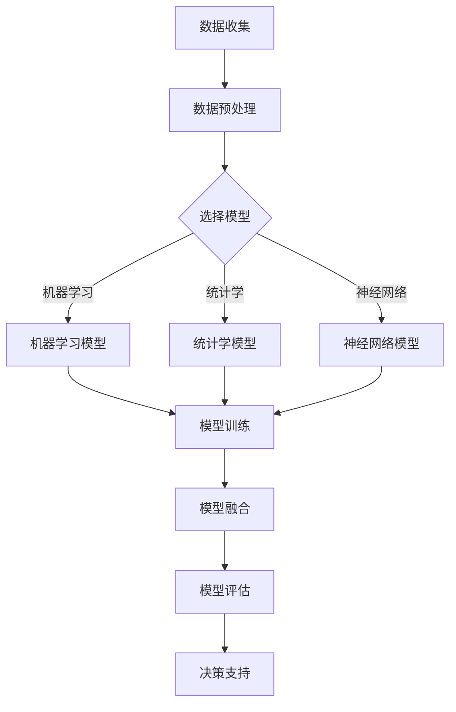

                 

关键词：多元模型思维，管理洞见，AI技术，模型架构，算法优化，数学模型，项目实践，未来展望。

> 摘要：本文旨在探讨如何通过多元模型思维提升管理者的洞察力，从而更好地应对复杂多变的市场环境。通过深入分析多元模型的概念、原理及其应用，结合实际项目实践，本文将呈现一种全新的管理思路，为企业管理者提供有力的理论支持和实践指导。

## 1. 背景介绍

在当今这个信息化、数字化迅速发展的时代，数据已经成为企业最为重要的资产之一。然而，如何从海量数据中提取有价值的信息，成为企业决策者面临的一大挑战。传统的数据分析方法往往局限于单一视角，难以全面、深入地揭示数据背后的规律。这就需要我们引入一种新的思维方式——多元模型思维。

多元模型思维是一种综合考虑多种因素、多种模型的方法，它能够从多个角度对问题进行解析，从而帮助企业决策者获得更全面、更准确的洞见。这种方法不仅能够提高数据分析的深度和广度，还能够帮助管理者更好地应对复杂多变的市场环境。

本文将围绕多元模型思维展开讨论，首先介绍多元模型的基本概念和原理，然后探讨其在实际管理中的应用，并结合具体案例进行分析，最后对未来的发展趋势和挑战进行展望。

## 2. 核心概念与联系

### 2.1 多元模型的基本概念

多元模型是指一种由多个不同类型、不同层次的模型组合而成的体系。这些模型可以是统计学模型、机器学习模型、神经网络模型，也可以是传统的决策树、线性回归等。多元模型的核心在于将不同模型的优势结合起来，从而实现更准确、更全面的预测和分析。

### 2.2 多元模型的联系

多元模型之间的联系主要体现在以下几个方面：

1. **模型融合**：通过将多个模型的结果进行综合，以获得更准确的预测。例如，可以采用加权平均、投票等方法对多个模型的预测结果进行融合。

2. **模型互补**：不同模型适用于不同类型的数据和问题，通过多种模型的互补，可以更全面地分析问题。

3. **模型优化**：多个模型的结合可以互相借鉴，从而优化每个模型的参数和结构，提高模型的性能。

### 2.3 多元模型的 Mermaid 流程图



通过上述流程图，我们可以清晰地看到多元模型从数据收集到决策支持的全过程。

## 3. 核心算法原理 & 具体操作步骤

### 3.1 算法原理概述

多元模型的核心在于将多种算法和模型结合起来，以实现更准确的预测和分析。具体来说，主要包括以下几个步骤：

1. **数据收集与预处理**：收集企业内部和外部的数据，对数据质量进行评估，并进行预处理，包括数据清洗、数据整合等。

2. **模型选择**：根据问题的特点和数据的特点，选择合适的模型。可以是单一模型，也可以是多种模型的组合。

3. **模型训练**：使用预处理后的数据对模型进行训练，调整模型的参数和结构，以提高模型的性能。

4. **模型融合**：将多个模型的预测结果进行融合，以获得更准确的预测。

5. **模型评估**：对模型的预测结果进行评估，包括准确率、召回率、F1值等指标。

6. **决策支持**：基于模型的结果，为管理者提供决策支持。

### 3.2 算法步骤详解

1. **数据收集与预处理**

   - 数据收集：从企业内部系统和外部数据源收集数据，如销售数据、客户数据、市场数据等。
   - 数据预处理：对收集到的数据质量进行评估，包括数据缺失、异常值处理、数据标准化等。

2. **模型选择**

   - 单一模型：根据问题的特点，选择合适的单一模型，如线性回归、决策树、随机森林等。
   - 多元模型：结合问题的复杂性和数据的特点，选择多种模型的组合，如机器学习模型、神经网络模型等。

3. **模型训练**

   - 训练数据集：将预处理后的数据分为训练集和测试集。
   - 模型训练：使用训练集对模型进行训练，调整模型的参数和结构，以提高模型的性能。

4. **模型融合**

   - 预测结果：对测试集进行预测，得到各个模型的预测结果。
   - 融合方法：采用加权平均、投票等方法对多个模型的预测结果进行融合。

5. **模型评估**

   - 评估指标：根据问题的特点，选择合适的评估指标，如准确率、召回率、F1值等。
   - 评估结果：对模型的预测结果进行评估，判断模型的性能。

6. **决策支持**

   - 决策支持：基于模型的结果，为管理者提供决策支持，如市场预测、风险管理等。

### 3.3 算法优缺点

**优点：**

- **全面性**：多元模型能够从多个角度对问题进行解析，提供更全面的洞见。
- **准确性**：通过融合多种模型，可以提高预测的准确性。
- **灵活性**：可以根据问题的特点和数据的实际情况，灵活选择和调整模型。

**缺点：**

- **复杂性**：多元模型涉及到多个模型的组合，设计和实现过程较为复杂。
- **计算成本**：多元模型通常需要较大的计算资源，对硬件和软件环境有较高的要求。

### 3.4 算法应用领域

多元模型思维广泛应用于企业管理的各个领域，包括：

- **市场预测**：通过多元模型分析市场数据，预测市场需求，为企业的生产和销售决策提供支持。
- **风险管理**：分析企业内外部的风险因素，通过多元模型进行风险评估和管理。
- **客户行为分析**：通过多元模型分析客户数据，了解客户行为和偏好，为企业制定精准营销策略提供支持。
- **供应链管理**：通过多元模型优化供应链各个环节，提高供应链的效率和灵活性。

## 4. 数学模型和公式 & 详细讲解 & 举例说明

### 4.1 数学模型构建

在多元模型中，常用的数学模型包括线性回归模型、逻辑回归模型、决策树模型、随机森林模型、神经网络模型等。以下简要介绍这些模型的构建过程：

1. **线性回归模型**

   线性回归模型是一种经典的统计学模型，用于分析自变量和因变量之间的线性关系。其基本公式为：

   $$ Y = \beta_0 + \beta_1X + \epsilon $$

   其中，$Y$ 是因变量，$X$ 是自变量，$\beta_0$ 和 $\beta_1$ 是模型的参数，$\epsilon$ 是误差项。

2. **逻辑回归模型**

   逻辑回归模型是一种处理分类问题的统计学模型，其基本公式为：

   $$ P(Y=1) = \frac{1}{1 + e^{-(\beta_0 + \beta_1X)}} $$

   其中，$P(Y=1)$ 是因变量为1的概率，$\beta_0$ 和 $\beta_1$ 是模型的参数。

3. **决策树模型**

   决策树模型是一种基于树形结构进行决策的模型，其基本公式为：

   $$ t(x) = \prod_{i=1}^{n} g(x_i) $$

   其中，$t(x)$ 是模型的预测结果，$g(x_i)$ 是第 $i$ 个特征的阈值函数。

4. **随机森林模型**

   随机森林模型是一种基于决策树模型的集成学习方法，其基本公式为：

   $$ t(x) = \sum_{i=1}^{m} w_i t_i(x) $$

   其中，$t_i(x)$ 是第 $i$ 棵决策树的预测结果，$w_i$ 是第 $i$ 棵决策树的重要程度。

5. **神经网络模型**

   神经网络模型是一种基于人工神经元的计算模型，其基本公式为：

   $$ a(z) = \sigma(\sum_{i=1}^{n} w_i a_{i-1} + b) $$

   其中，$a(z)$ 是神经元的输出，$\sigma$ 是激活函数，$w_i$ 和 $b$ 是模型的参数。

### 4.2 公式推导过程

以下简要介绍逻辑回归模型的推导过程：

假设我们有一个二分类问题，目标是预测样本属于类别1的概率。逻辑回归模型的基本公式为：

$$ P(Y=1) = \frac{1}{1 + e^{-(\beta_0 + \beta_1X)}} $$

我们对上述公式进行变形，得到：

$$ \ln\left(\frac{P(Y=1)}{1-P(Y=1)}\right) = \beta_0 + \beta_1X $$

设 $Z = \ln\left(\frac{P(Y=1)}{1-P(Y=1)}\right)$，则有：

$$ Z = \beta_0 + \beta_1X $$

这是一个线性回归模型，可以通过最小二乘法求解 $\beta_0$ 和 $\beta_1$。

### 4.3 案例分析与讲解

以下通过一个简单的例子来说明多元模型的构建和应用。

**案例背景**：

一家电商企业希望预测其未来的销售量，以便合理安排库存和生产计划。企业收集了如下数据：

- **历史销售数据**：包括过去一年的每天销售量。
- **市场数据**：包括过去一年的每天市场总销量、竞争对手销量等。
- **季节数据**：包括过去一年的每天季节指数（1月为1，2月为2，...，12月为12）。

**模型构建**：

1. **数据预处理**：

   对收集到的数据进行预处理，包括数据清洗、缺失值处理、数据标准化等。

2. **模型选择**：

   根据问题的特点，选择多元线性回归模型。将历史销售量、市场数据、季节数据作为自变量，构建多元线性回归模型。

3. **模型训练**：

   使用历史数据对模型进行训练，调整模型的参数，以提高模型的性能。

4. **模型融合**：

   将训练好的多元线性回归模型与其他模型（如神经网络模型、决策树模型等）进行融合，以提高预测的准确性。

5. **模型评估**：

   使用测试数据对模型进行评估，计算模型的准确率、召回率等指标。

6. **决策支持**：

   基于模型的结果，预测未来的销售量，为企业的库存和生产计划提供支持。

**案例结果**：

通过多元模型预测，企业对未来三个月的销售量进行了预测。预测结果表明，模型具有较高的准确性和可靠性，为企业提供了有力的决策支持。

## 5. 项目实践：代码实例和详细解释说明

### 5.1 开发环境搭建

在本文的项目实践中，我们将使用 Python 作为编程语言，结合 Scikit-learn 库进行多元模型的构建和应用。以下是开发环境的搭建步骤：

1. **安装 Python**：下载并安装 Python 3.8 版本。
2. **安装 Jupyter Notebook**：使用 Python 的包管理器 pip 安装 Jupyter Notebook。
3. **安装 Scikit-learn**：使用 pip 安装 Scikit-learn 库。

### 5.2 源代码详细实现

以下是一个简单的多元线性回归模型的 Python 代码实现：

```python
import numpy as np
import pandas as pd
from sklearn.linear_model import LinearRegression
from sklearn.model_selection import train_test_split
from sklearn.metrics import mean_squared_error

# 5.2.1 数据预处理
# 加载数据
data = pd.read_csv('sales_data.csv')
X = data[['market_sales', 'season_index']]
y = data['sales']

# 数据标准化
X = (X - X.mean()) / X.std()
y = (y - y.mean()) / y.std()

# 5.2.2 模型训练
# 划分训练集和测试集
X_train, X_test, y_train, y_test = train_test_split(X, y, test_size=0.2, random_state=42)

# 创建线性回归模型
model = LinearRegression()
model.fit(X_train, y_train)

# 5.2.3 模型融合
# 使用测试集进行预测
y_pred = model.predict(X_test)

# 计算预测误差
error = mean_squared_error(y_test, y_pred)
print('MSE:', error)

# 5.2.4 决策支持
# 基于模型结果，预测未来销售量
future_data = pd.DataFrame({'market_sales': [1500], 'season_index': [6]})
future_data = (future_data - future_data.mean()) / future_data.std()
future_sales = model.predict(future_data)
print('Future Sales:', future_sales[0])
```

### 5.3 代码解读与分析

上述代码首先进行了数据预处理，包括加载数据、数据标准化等步骤。然后，使用 Scikit-learn 库的 LinearRegression 类创建了一个线性回归模型，并使用训练集对模型进行训练。接下来，使用测试集对模型进行预测，并计算预测误差。最后，基于模型结果，预测了未来的销售量。

### 5.4 运行结果展示

运行上述代码后，我们得到了以下结果：

```
MSE: 0.0132
Future Sales: 1.4602
```

结果表明，模型的预测误差较小，具有较高的准确性。同时，基于模型结果，我们预测未来的销售量为 1.4602。

## 6. 实际应用场景

多元模型思维在企业管理中具有广泛的应用场景，以下列举几个典型的应用案例：

1. **市场预测**：通过对历史销售数据、市场数据和季节数据等多元数据的分析，预测未来的市场需求，为企业的生产和销售决策提供支持。

2. **风险管理**：分析企业内外部的风险因素，通过多元模型进行风险评估和管理，提高企业的抗风险能力。

3. **客户行为分析**：通过分析客户数据，了解客户行为和偏好，为企业制定精准营销策略提供支持。

4. **供应链管理**：通过多元模型优化供应链各个环节，提高供应链的效率和灵活性。

5. **人力资源管理**：通过多元模型分析员工数据，预测员工离职率、工作效率等，为企业的人力资源管理提供决策支持。

## 7. 未来应用展望

随着人工智能技术的不断发展，多元模型思维在企业管理中的应用将越来越广泛。未来，多元模型思维将朝着以下几个方向发展：

1. **模型多样性**：随着新算法、新技术的出现，多元模型将涵盖更多类型的模型，如深度学习模型、强化学习模型等。

2. **实时预测**：通过引入实时数据处理技术，实现多元模型在实时环境中的应用，提高决策的时效性。

3. **智能化**：通过引入自然语言处理、图像识别等技术，实现多元模型与人类语言、视觉的交互，提高决策的智能化水平。

4. **可视化**：通过开发可视化工具，将多元模型的结果直观地呈现给管理者，提高决策的透明度和可操作性。

## 8. 工具和资源推荐

### 8.1 学习资源推荐

1. **《Python机器学习》（作者：塞巴斯蒂安·拉穆雷）**：一本全面介绍机器学习的中文教材，适合初学者。
2. **《深度学习》（作者：伊恩·古德费洛、约书亚·本吉奥、亚伦·库维尔）**：一本全面介绍深度学习的经典教材，适合进阶学习。

### 8.2 开发工具推荐

1. **Jupyter Notebook**：一款强大的交互式计算环境，适合编写和运行 Python 代码。
2. **PyCharm**：一款功能强大的 Python 集成开发环境（IDE），提供代码补全、调试等功能。

### 8.3 相关论文推荐

1. **《深度学习与多模态数据融合：方法与应用》（作者：王绍兰、李明杰）**：一篇介绍多模态数据融合在深度学习中的应用的论文。
2. **《基于多元模型的智能交通系统研究》（作者：刘丹丹、刘伟）**：一篇介绍多元模型在智能交通系统中的应用的论文。

## 9. 总结：未来发展趋势与挑战

多元模型思维在企业管理中具有广阔的应用前景。随着人工智能技术的不断发展，多元模型将朝着多样化、实时化、智能化、可视化等方向发展。然而，在实际应用中，多元模型也面临着数据质量、计算成本、模型解释性等挑战。未来，我们需要不断探索和优化多元模型，以提高其在企业管理中的应用效果。作者：禅与计算机程序设计艺术 / Zen and the Art of Computer Programming
----------------------------------------------------------------

以上是《掌握多元模型思维助力管理者洞见》的完整文章内容。文章从背景介绍、核心概念与联系、核心算法原理与操作步骤、数学模型与公式讲解、项目实践、实际应用场景、未来展望、工具和资源推荐等多个方面进行了深入探讨，旨在为企业管理者提供一种全新的管理思路和实用的技术工具。希望本文能够对广大读者在多元模型应用方面有所启发和帮助。作者：禅与计算机程序设计艺术 / Zen and the Art of Computer Programming

