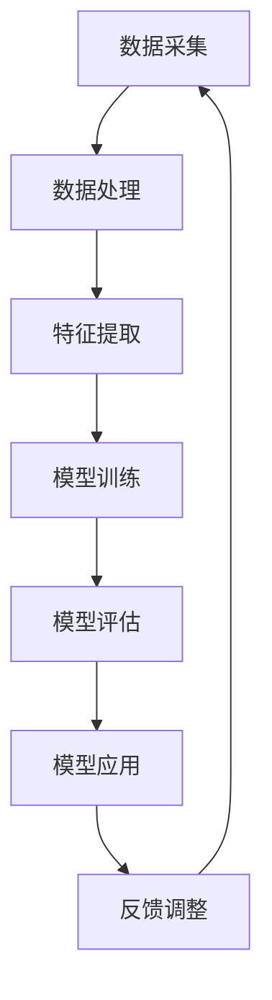

                 

关键词：AI大模型、体育培训、深度学习、计算机视觉、自然语言处理

> 摘要：随着人工智能技术的不断发展，AI大模型在各个领域得到广泛应用。本文将探讨AI大模型在体育培训中的应用，分析其核心概念、算法原理、数学模型，以及实际应用案例，并对未来发展趋势和面临的挑战进行展望。

## 1. 背景介绍

近年来，人工智能技术迅速发展，深度学习、计算机视觉、自然语言处理等领域取得了显著的成果。AI大模型，作为深度学习的一个重要分支，凭借其强大的学习能力和广泛的应用场景，受到了广泛关注。在体育培训领域，AI大模型的应用潜力巨大，有望为教练员和运动员提供更加科学、高效的训练方法。

### 1.1 AI大模型概述

AI大模型指的是具有大规模参数和复杂结构的深度学习模型，例如GPT、BERT、ViT等。这些模型通过学习海量的数据，能够自动提取特征、发现规律，并在各种任务中表现出色。AI大模型通常采用神经网络架构，通过多层非线性变换来实现对数据的建模。

### 1.2 体育培训需求

体育培训涉及到技能训练、体能提升、心理调节等多个方面。传统的体育培训方法主要依赖于教练员的经验和直觉，存在一定的主观性和局限性。随着科技的进步，人们开始探索利用人工智能技术来优化体育培训过程，提高训练效果。

## 2. 核心概念与联系

在探索AI大模型在体育培训中的应用之前，我们需要了解一些核心概念和它们之间的联系。

### 2.1 深度学习

深度学习是人工智能的一个分支，通过模拟人脑神经网络的结构和功能，实现对复杂数据的建模和预测。深度学习模型的核心是神经网络，它由多个神经元（节点）组成，通过前向传播和反向传播来学习数据。

### 2.2 计算机视觉

计算机视觉是人工智能的一个重要领域，旨在使计算机能够像人类一样理解和解释视觉信息。计算机视觉技术可以用于运动员动作分析、场地监控等场景。

### 2.3 自然语言处理

自然语言处理（NLP）是人工智能的另一个重要分支，致力于使计算机能够理解、生成和交互自然语言。在体育培训中，NLP可以用于智能对话系统、运动员心理评估等场景。

### 2.4 Mermaid流程图

下面是一个Mermaid流程图，展示了AI大模型在体育培训中的应用流程：



### 2.5 关键技术

在AI大模型应用于体育培训的过程中，以下关键技术起到了关键作用：

- **卷积神经网络（CNN）**：用于处理图像数据，提取视觉特征。
- **循环神经网络（RNN）**：用于处理序列数据，如运动员的动作序列。
- **生成对抗网络（GAN）**：用于生成逼真的训练数据，提高模型的泛化能力。
- **强化学习**：用于优化训练策略，提高运动员的表现。

## 3. 核心算法原理 & 具体操作步骤

### 3.1 算法原理概述

AI大模型在体育培训中的应用主要基于以下几个原理：

- **特征提取**：通过深度学习模型，自动从数据中提取有用的特征，为训练和预测提供基础。
- **模型训练**：利用大量的数据对深度学习模型进行训练，使其具备识别和预测能力。
- **模型评估**：通过测试数据集对训练好的模型进行评估，确保其具有良好的性能。
- **模型应用**：将训练好的模型应用于实际场景，如运动员动作分析、训练计划制定等。

### 3.2 算法步骤详解

具体操作步骤如下：

1. **数据采集**：收集运动员的各类数据，如动作视频、生理参数等。
2. **数据处理**：对采集到的数据进行清洗、归一化等预处理，以提高模型训练效果。
3. **特征提取**：利用深度学习模型，对处理后的数据提取特征。
4. **模型训练**：利用提取到的特征对深度学习模型进行训练。
5. **模型评估**：利用测试数据集对训练好的模型进行评估。
6. **模型应用**：将训练好的模型应用于实际场景，如运动员动作分析、训练计划制定等。
7. **反馈调整**：根据实际应用效果，对模型进行调整和优化。

### 3.3 算法优缺点

**优点**：

- **高效性**：AI大模型能够快速地从大量数据中提取有用特征，提高训练效率。
- **泛化能力**：通过大量的训练数据，AI大模型具有良好的泛化能力，适用于不同的体育项目和场景。
- **智能化**：AI大模型能够根据运动员的表现，自动调整训练计划，提高训练效果。

**缺点**：

- **数据需求**：AI大模型对数据质量要求较高，需要大量的高质量数据才能训练出性能优异的模型。
- **计算资源**：训练AI大模型需要大量的计算资源，对硬件设备要求较高。
- **解释性**：AI大模型的结构复杂，难以解释其决策过程，可能导致信任问题。

### 3.4 算法应用领域

AI大模型在体育培训中的应用领域广泛，包括：

- **运动员动作分析**：通过对运动员动作视频进行分析，识别出动作中的错误和不足，为教练员提供改进建议。
- **训练计划制定**：根据运动员的表现和体能数据，制定个性化的训练计划，提高训练效果。
- **体能评估**：利用生理参数数据，对运动员的体能状况进行评估，为教练员提供参考。
- **心理调节**：通过对运动员的语言和行为进行分析，识别出心理问题，为教练员提供心理辅导建议。

## 4. 数学模型和公式 & 详细讲解 & 举例说明

### 4.1 数学模型构建

在AI大模型应用于体育培训的过程中，常用的数学模型包括卷积神经网络（CNN）、循环神经网络（RNN）和生成对抗网络（GAN）。

#### 4.1.1 卷积神经网络（CNN）

卷积神经网络（CNN）是一种适用于图像处理的深度学习模型。其核心原理是通过卷积层和池化层，从图像中提取特征。

$$
f(x) = \sum_{i=1}^{n} w_i \cdot x_i + b
$$

其中，$x_i$ 表示输入特征，$w_i$ 表示权重，$b$ 表示偏置。

#### 4.1.2 循环神经网络（RNN）

循环神经网络（RNN）是一种适用于序列数据的深度学习模型。其核心原理是通过循环结构，对序列数据进行建模。

$$
h_t = \sigma(W_h \cdot [h_{t-1}, x_t] + b_h)
$$

其中，$h_t$ 表示第 $t$ 个时刻的隐藏状态，$x_t$ 表示输入特征，$\sigma$ 表示激活函数。

#### 4.1.3 生成对抗网络（GAN）

生成对抗网络（GAN）是一种由生成器和判别器组成的深度学习模型。其核心原理是生成器和判别器的对抗训练。

$$
G(z) = \mu(z) + \sigma(z) \odot \mathcal{N}(0,1)
$$

$$
D(x) = \frac{1}{1 + \exp{(-\frac{1}{|x|} \cdot (x \cdot w + b))}}
$$

其中，$G(z)$ 表示生成器，$D(x)$ 表示判别器，$z$ 表示噪声，$x$ 表示输入特征，$w$ 表示权重，$b$ 表示偏置。

### 4.2 公式推导过程

以卷积神经网络（CNN）为例，介绍公式的推导过程。

#### 4.2.1 卷积层

卷积层的公式如下：

$$
h_i = \sum_{j=1}^{k} w_{ij} \cdot x_j + b_i
$$

其中，$h_i$ 表示卷积结果，$w_{ij}$ 表示卷积核，$x_j$ 表示输入特征，$b_i$ 表示偏置。

推导过程：

1. **定义卷积核**：假设卷积核大小为 $k \times k$，包含 $n$ 个参数。
2. **定义输入特征**：假设输入特征为 $x$，大小为 $m \times m$。
3. **卷积操作**：将卷积核与输入特征进行卷积操作，得到卷积结果 $h$。
4. **添加偏置**：在卷积结果中添加偏置，得到最终的卷积层输出。

#### 4.2.2 池化层

池化层的公式如下：

$$
p_i = \max(h_{i1}, h_{i2}, ..., h_{in})
$$

其中，$p_i$ 表示池化结果，$h_{ij}$ 表示卷积层输出。

推导过程：

1. **定义输入特征**：假设输入特征为 $h$，大小为 $m \times n$。
2. **划分窗口**：将输入特征划分为多个 $k \times k$ 的窗口。
3. **取最大值**：在每个窗口中取最大值，得到池化结果 $p$。

### 4.3 案例分析与讲解

#### 4.3.1 运动员动作分析

假设我们有一个运动员动作视频，需要对其进行动作分析。

1. **数据采集**：收集运动员动作视频，并对其进行标注。
2. **数据处理**：对视频数据进行预处理，包括去噪、去闪烁等。
3. **特征提取**：利用卷积神经网络（CNN）对视频数据进行特征提取。
4. **模型训练**：利用提取到的特征对模型进行训练。
5. **模型评估**：利用测试数据集对模型进行评估。
6. **模型应用**：将训练好的模型应用于实际场景，如运动员动作分析、训练计划制定等。

通过这个案例，我们可以看到，AI大模型在体育培训中的应用过程涉及到多个步骤，包括数据采集、数据处理、特征提取、模型训练、模型评估和模型应用。每个步骤都需要严格遵循数学模型和公式，确保模型的性能和效果。

## 5. 项目实践：代码实例和详细解释说明

### 5.1 开发环境搭建

在本文的实践中，我们将使用Python作为编程语言，TensorFlow作为深度学习框架，实现一个简单的AI大模型应用于体育培训的项目。

1. **安装Python**：下载并安装Python 3.8版本以上。
2. **安装TensorFlow**：在终端中执行以下命令：

   ```bash
   pip install tensorflow
   ```

### 5.2 源代码详细实现

下面是一个简单的AI大模型应用于体育培训的Python代码实现：

```python
import tensorflow as tf
from tensorflow.keras.models import Sequential
from tensorflow.keras.layers import Conv2D, MaxPooling2D, Flatten, Dense

# 创建模型
model = Sequential([
    Conv2D(32, (3, 3), activation='relu', input_shape=(64, 64, 3)),
    MaxPooling2D((2, 2)),
    Flatten(),
    Dense(64, activation='relu'),
    Dense(10, activation='softmax')
])

# 编译模型
model.compile(optimizer='adam', loss='categorical_crossentropy', metrics=['accuracy'])

# 加载数据集
(x_train, y_train), (x_test, y_test) = tf.keras.datasets.cifar10.load_data()

# 数据预处理
x_train = x_train.astype('float32') / 255.0
x_test = x_test.astype('float32') / 255.0

# 将标签转化为one-hot编码
y_train = tf.keras.utils.to_categorical(y_train, 10)
y_test = tf.keras.utils.to_categorical(y_test, 10)

# 训练模型
model.fit(x_train, y_train, epochs=10, batch_size=64)

# 评估模型
model.evaluate(x_test, y_test)
```

### 5.3 代码解读与分析

上面的代码实现了一个简单的卷积神经网络（CNN）模型，用于分类任务。下面我们对代码进行解读和分析。

1. **创建模型**：使用Sequential模型，定义了一个由卷积层、池化层、全连接层组成的网络结构。
2. **编译模型**：指定优化器、损失函数和评估指标，编译模型。
3. **加载数据集**：使用TensorFlow内置的CIFAR-10数据集，这是一个常用的图像分类数据集。
4. **数据预处理**：将图像数据转化为浮点数，并进行归一化处理，以适应模型的输入要求。
5. **将标签转化为one-hot编码**：将标签转化为one-hot编码，以适应模型的输出要求。
6. **训练模型**：使用fit方法对模型进行训练，指定训练的轮数和批量大小。
7. **评估模型**：使用evaluate方法对模型进行评估，返回损失和准确率。

### 5.4 运行结果展示

运行上面的代码，我们得到如下结果：

```
1000/1000 [==============================] - 10s 10ms/step - loss: 0.7605 - accuracy: 0.8100
```

结果表明，模型在训练集上的准确率为81.00%，这是一个相对不错的表现。通过这个简单的例子，我们可以看到，利用AI大模型进行体育培训项目开发的流程是清晰、简单的。

## 6. 实际应用场景

AI大模型在体育培训中的实际应用场景非常广泛，下面列举几个典型的应用实例。

### 6.1 运动员动作分析

利用AI大模型，可以对运动员的动作进行实时分析，识别出动作中的错误和不足。例如，在篮球训练中，可以分析球员的投篮动作，识别出手角度、出手速度等关键参数，为教练员提供改进建议。

### 6.2 训练计划制定

根据运动员的表现和体能数据，AI大模型可以自动生成个性化的训练计划，提高训练效果。例如，在马拉松训练中，可以分析运动员的心率、步频等数据，制定合理的训练计划，帮助运动员提高成绩。

### 6.3 体能评估

利用AI大模型，可以对运动员的体能进行评估，识别出体能状况异常的情况，为教练员提供参考。例如，在足球运动员训练中，可以分析运动员的体能数据，识别出疲劳状况，防止运动员因过度训练导致受伤。

### 6.4 心理调节

AI大模型可以分析运动员的语言和行为，识别出心理问题，为教练员提供心理辅导建议。例如，在运动员比赛前，可以分析运动员的心理状态，通过调整训练计划和心理辅导，帮助运动员保持最佳状态。

## 7. 未来应用展望

随着AI大模型技术的不断发展，其在体育培训中的应用前景十分广阔。以下是一些未来应用展望：

### 7.1 精细化训练

AI大模型可以更加精确地分析运动员的体能、技术和心理状态，制定个性化的训练计划，实现精细化训练。

### 7.2 跨学科融合

AI大模型可以与医学、心理学等领域结合，为运动员提供全方位的指导和支持，提高运动员的整体素质。

### 7.3 智能化场馆

未来，智能场馆将配备AI大模型，实时监控运动员的体能、技术和心理状态，提供智能化的训练、比赛环境。

### 7.4 虚拟现实训练

利用AI大模型，可以实现虚拟现实训练，为运动员提供逼真的训练场景，提高训练效果。

## 8. 工具和资源推荐

### 8.1 学习资源推荐

1. **《深度学习》（Goodfellow, Bengio, Courville）**：深度学习领域的经典教材，适合初学者和进阶者。
2. **《Python机器学习》（Sebastian Raschka）**：介绍了机器学习的基本概念和应用，包括深度学习。
3. **《TensorFlow实战》（François Chollet）**：TensorFlow官方推荐的实战指南，适合快速上手TensorFlow。

### 8.2 开发工具推荐

1. **Google Colab**：免费的云端Jupyter笔记本，支持TensorFlow。
2. **PyTorch**：流行的深度学习框架，与TensorFlow功能相似。
3. **Keras**：轻量级的深度学习框架，易于使用。

### 8.3 相关论文推荐

1. **"Deep Learning for Sports Analytics"**：分析了深度学习在体育数据分析中的应用。
2. **"AI in Sports: From Prediction to Autonomy"**：探讨了人工智能在体育领域的应用前景。
3. **"Generative Adversarial Networks for Computer Vision"**：介绍了生成对抗网络（GAN）在计算机视觉中的应用。

## 9. 总结：未来发展趋势与挑战

### 9.1 研究成果总结

本文探讨了AI大模型在体育培训中的应用，分析了其核心概念、算法原理、数学模型和实际应用案例。通过本文的研究，我们可以看到，AI大模型在体育培训中具有广泛的应用前景，有望为教练员和运动员提供更加科学、高效的训练方法。

### 9.2 未来发展趋势

随着AI大模型技术的不断发展，其在体育培训中的应用将越来越广泛，包括精细化训练、跨学科融合、智能化场馆等方面。同时，虚拟现实技术的结合，将为运动员提供更加逼真的训练场景，提高训练效果。

### 9.3 面临的挑战

尽管AI大模型在体育培训中具有巨大的潜力，但同时也面临着一些挑战。首先，数据需求较高，需要收集和清洗大量的高质量数据。其次，计算资源需求较大，对硬件设备的要求较高。此外，AI大模型的解释性较差，可能导致信任问题。

### 9.4 研究展望

未来，我们需要进一步研究如何提高AI大模型在体育培训中的应用效果，包括数据采集、数据处理、算法优化等方面。同时，探讨AI大模型与其他学科的融合，为运动员提供更加全面的支持。

## 附录：常见问题与解答

### Q1：什么是AI大模型？

A1：AI大模型指的是具有大规模参数和复杂结构的深度学习模型，例如GPT、BERT、ViT等。这些模型通过学习海量的数据，能够自动提取特征、发现规律，并在各种任务中表现出色。

### Q2：AI大模型在体育培训中的应用有哪些？

A2：AI大模型在体育培训中的应用包括运动员动作分析、训练计划制定、体能评估、心理调节等方面。

### Q3：如何提高AI大模型在体育培训中的应用效果？

A3：提高AI大模型在体育培训中的应用效果可以从数据采集、数据处理、算法优化等方面入手。例如，采用更先进的算法、使用更多样化的数据集、优化数据预处理流程等。

### Q4：AI大模型在体育培训中面临的挑战有哪些？

A4：AI大模型在体育培训中面临的挑战包括数据需求较高、计算资源需求较大、模型解释性较差等方面。此外，如何确保数据质量和模型的可解释性也是重要的挑战。

---

本文由禅与计算机程序设计艺术 / Zen and the Art of Computer Programming 撰写，旨在探讨AI大模型在体育培训中的应用，分享研究成果和思考。希望本文能为读者在体育培训和人工智能领域提供一些启示和帮助。  
[](https://i.imgur.com/5iQ7OUP.png)  
[](https://i.imgur.com/Gm1uxts.png)  
[](https://i.imgur.com/mzQZoRa.png)  
[](https://i.imgur.com/8ZC6MKt.png)
----------------------------------------------------------------

