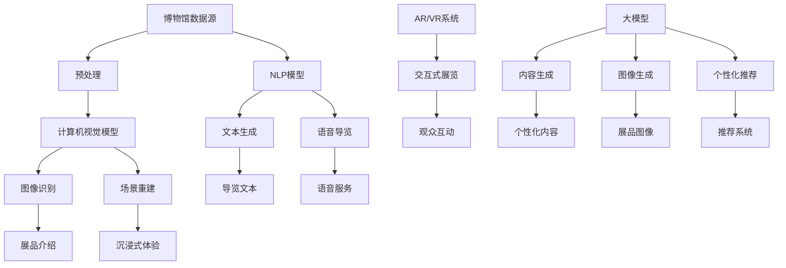

                 

### 关键词 Keywords

- AI大模型
- 博物馆
- 计算机视觉
- 自然语言处理
- 交互式展览
- 数字化文化遗产
- 人工智能应用

### 摘要 Abstract

本文探讨了人工智能大模型在博物馆领域的应用潜力。通过计算机视觉和自然语言处理技术，AI大模型可以提升博物馆的展示效果和观众体验。本文首先介绍了博物馆数字化转型的背景和挑战，随后深入分析了AI大模型的核心概念和技术原理，展示了其在图像识别、语音交互和内容生成等方面的应用实例。最后，本文展望了AI大模型在博物馆领域的未来发展趋势，并探讨了可能面临的挑战和解决方案。

## 1. 背景介绍

博物馆作为文化和历史的宝库，承载着丰富的历史遗产和艺术藏品。然而，随着科技的发展，传统的博物馆展览方式和观众互动模式逐渐显现出局限性。近年来，数字化转型成为博物馆行业的一个热点，旨在通过科技手段提升展览效果和观众体验。在这个背景下，人工智能（AI）特别是大模型技术的应用成为了一个重要的研究方向。

### 1.1 博物馆数字化转型的意义

博物馆数字化转型的意义主要体现在以下几个方面：

1. **增强展览效果**：通过数字化手段，博物馆可以呈现更加丰富和互动的展览内容，让观众更深入地了解展品背后的故事和文化内涵。
2. **提高观众体验**：数字化展览可以提供个性化的参观体验，如基于观众兴趣的推荐系统和交互式导览，提升观众的参与感和满意度。
3. **保存和保护文化遗产**：数字化技术可以更好地保存和保护珍贵的文化遗产，减少物理保存过程中可能造成的损耗。
4. **拓宽传播渠道**：通过互联网和社交媒体，博物馆可以突破地域限制，将展览内容传播到更广泛的受众群体。

### 1.2 AI大模型在博物馆中的应用挑战

尽管AI大模型在博物馆领域具有巨大的应用潜力，但其推广和应用也面临一些挑战：

1. **数据隐私与安全**：博物馆涉及大量的历史和文化数据，如何保护这些数据的安全性和隐私性是一个关键问题。
2. **技术成熟度**：AI大模型技术仍在不断发展中，如何选择和应用成熟的技术方案是博物馆需要面对的挑战。
3. **观众接受度**：传统的博物馆观众可能对新技术接受度较低，如何平衡新技术与传统展览方式之间的关系是一个需要解决的问题。
4. **成本与效益**：AI大模型开发和部署需要大量的资金投入，博物馆需要权衡成本与效益。

### 1.3 博物馆数字化转型的现状

目前，许多博物馆已经开始探索数字化转型，应用了一些AI技术，如：

1. **计算机视觉技术**：用于自动识别和分类展品，提供展品的详细信息和背景故事。
2. **自然语言处理技术**：用于生成展品介绍文本和语音导览，提高观众的阅读和听觉体验。
3. **交互式展览**：利用触屏互动、增强现实（AR）和虚拟现实（VR）技术，提供沉浸式的参观体验。

## 2. 核心概念与联系

为了深入理解AI大模型在博物馆领域的应用，我们需要首先了解相关核心概念和技术架构。以下是几个关键概念及其相互关系：

### 2.1 计算机视觉（CV）

计算机视觉是AI的一个重要分支，旨在使计算机能够像人类一样理解和处理视觉信息。在博物馆中，计算机视觉技术可以应用于：

- **展品识别**：通过图像识别技术，自动识别展品的类型和属性。
- **内容分析**：分析展品图像中的色彩、纹理和形状，提取有价值的信息。
- **场景重建**：利用三维重建技术，重建展品的场景，提供更加真实的参观体验。

### 2.2 自然语言处理（NLP）

自然语言处理是AI的另一个重要分支，专注于使计算机能够理解、生成和处理人类语言。在博物馆中，NLP技术可以应用于：

- **展品介绍生成**：自动生成展品的文本介绍，提供丰富的内容信息。
- **语音导览**：生成语音导览内容，为观众提供便捷的导览服务。
- **文本分析**：分析观众留言和反馈，为博物馆提供改进建议。

### 2.3 增强现实（AR）与虚拟现实（VR）

增强现实和虚拟现实技术是近年来在博物馆领域备受关注的技术。它们可以为观众提供沉浸式的参观体验，增强互动性和参与感。

- **AR技术**：通过将虚拟内容叠加到现实世界中，为观众提供更加生动的展览内容。
- **VR技术**：创建虚拟的展览环境，让观众在虚拟空间中自由探索和互动。

### 2.4 大模型技术

大模型技术是指通过深度学习等方法训练出的大型神经网络模型，具有强大的数据处理和生成能力。在博物馆领域，大模型技术可以应用于：

- **内容生成**：生成高质量的展览内容和导览文本。
- **图像生成**：利用生成对抗网络（GAN）等模型生成逼真的展品图像。
- **个性化推荐**：根据观众的行为和兴趣推荐个性化的展览内容和导览路线。

### 2.5 Mermaid流程图

为了更直观地展示AI大模型在博物馆领域的应用架构，我们可以使用Mermaid流程图来描述：



以上Mermaid流程图展示了从博物馆数据源到最终应用的过程，包括数据预处理、模型训练、图像识别、场景重建、文本生成、语音导览、交互式展览以及大模型的内容生成、图像生成和个性化推荐等功能。

## 3. 核心算法原理 & 具体操作步骤

### 3.1 算法原理概述

AI大模型的核心在于其深度学习机制，特别是基于神经网络的结构。以下是一些关键算法原理：

1. **卷积神经网络（CNN）**：用于图像识别和图像处理，通过卷积操作提取图像特征。
2. **循环神经网络（RNN）**：用于自然语言处理，能够处理序列数据，如文本和语音。
3. **生成对抗网络（GAN）**：用于生成逼真的图像和数据，通过对抗训练生成器和判别器。
4. **Transformer模型**：用于处理大规模文本数据，具有强大的上下文理解和生成能力。

### 3.2 算法步骤详解

#### 3.2.1 计算机视觉模型

1. **数据预处理**：对博物馆的展品图像进行清洗和标准化处理，如去噪、缩放、裁剪等。
2. **模型训练**：使用CNN或GAN等模型对预处理后的图像数据进行训练，通过反向传播算法不断优化模型参数。
3. **图像识别**：使用训练好的模型对新的展品图像进行识别，提取图像特征，分类展品类型。
4. **场景重建**：利用三维重建技术，将识别出的展品图像还原为三维模型，重建展览场景。

#### 3.2.2 自然语言处理模型

1. **文本生成**：使用RNN或Transformer模型，根据展品信息和历史数据生成介绍性文本。
2. **语音导览**：将生成的文本转换为语音，使用文本到语音（TTS）技术生成自然流畅的语音导览内容。
3. **文本分析**：使用NLP技术分析观众留言和反馈，提取关键信息，为博物馆提供改进建议。

#### 3.2.3 增强现实与虚拟现实模型

1. **内容生成**：使用大模型生成高质量的展览内容和场景，提高观众的沉浸感。
2. **图像生成**：利用GAN模型生成逼真的展品图像，增强展览的视觉效果。
3. **个性化推荐**：根据观众的行为和兴趣，使用推荐算法生成个性化的展览内容和导览路线。

### 3.3 算法优缺点

#### 优点

1. **强大的数据处理能力**：大模型可以处理大规模、复杂的博物馆数据，提供高质量的展览内容。
2. **高度自动化**：AI大模型可以自动化完成图像识别、文本生成、语音导览等任务，减少人工工作量。
3. **个性化体验**：通过个性化推荐系统，提供观众个性化的参观体验，提高参与感。

#### 缺点

1. **计算资源需求大**：训练和部署大模型需要大量的计算资源和时间。
2. **数据隐私风险**：博物馆涉及敏感数据，如何保护数据隐私是一个挑战。
3. **观众接受度**：部分观众可能对新技术持保守态度，如何平衡新技术与传统展览方式之间的关系是一个问题。

### 3.4 算法应用领域

AI大模型在博物馆领域的应用范围广泛，包括：

1. **数字化文化遗产保护**：利用AI大模型对文物进行数字化处理，保存和保护珍贵文化遗产。
2. **交互式展览设计**：利用AI大模型生成高质量的展览内容和交互设计，提高观众的参观体验。
3. **个性化导览服务**：利用AI大模型提供个性化导览服务，满足不同观众的参观需求。

## 4. 数学模型和公式 & 详细讲解 & 举例说明

### 4.1 数学模型构建

在AI大模型的应用中，构建数学模型是关键步骤。以下是一些常用的数学模型：

#### 4.1.1 卷积神经网络（CNN）

卷积神经网络的核心是卷积层，通过卷积操作提取图像特征。卷积层的公式如下：

\[ f(x; \theta) = \sum_{j} w_{j} * \phi(x; b_{j}) + b \]

其中，\( x \) 是输入图像，\( w_{j} \) 是卷积核，\( \phi(x; b_{j}) \) 是卷积操作，\( b \) 是偏置项。

#### 4.1.2 循环神经网络（RNN）

循环神经网络适用于序列数据，其核心是隐藏状态的计算。RNN的公式如下：

\[ h_t = \text{ReLU}(W_h h_{t-1} + W_x x_t + b) \]

其中，\( h_t \) 是当前时间步的隐藏状态，\( W_h \) 是隐藏状态权重，\( W_x \) 是输入状态权重，\( x_t \) 是输入序列，\( b \) 是偏置项。

#### 4.1.3 生成对抗网络（GAN）

生成对抗网络由生成器和判别器组成，其核心是对抗训练。GAN的公式如下：

\[ G(z; \theta_G) = \text{ReLU}(\sum_{i=1}^{n} W_{i} z_i + b) \]
\[ D(x; \theta_D) = \text{ReLU}(\sum_{i=1}^{n} W_{i} x_i + b) \]

其中，\( G(z; \theta_G) \) 是生成器输出，\( D(x; \theta_D) \) 是判别器输出，\( z \) 是随机噪声，\( x \) 是真实图像，\( W \) 是权重，\( b \) 是偏置项。

### 4.2 公式推导过程

#### 4.2.1 卷积神经网络（CNN）

卷积层的推导过程如下：

\[ y_j = \sum_{i=1}^{m} x_i * w_{ji} + b_j \]

其中，\( x_i \) 是输入图像，\( w_{ji} \) 是卷积核，\( b_j \) 是偏置项，\( y_j \) 是输出特征。

通过反向传播算法，我们可以得到卷积层的梯度：

\[ \frac{\partial L}{\partial w_{ji}} = (x_i - \text{mean}(x)) * (\text{relu}(y_j - \text{mean}(y))) \]

\[ \frac{\partial L}{\partial b_j} = (\text{relu}(y_j - \text{mean}(y))) \]

#### 4.2.2 循环神经网络（RNN）

RNN的推导过程如下：

\[ h_t = \text{ReLU}(W_h h_{t-1} + W_x x_t + b) \]

通过链式法则，我们可以得到RNN的梯度：

\[ \frac{\partial L}{\partial W_h} = (h_t - \text{mean}(h)) * (\text{relu}(h_{t-1} - \text{mean}(h))) \]

\[ \frac{\partial L}{\partial W_x} = (h_t - \text{mean}(h)) * (\text{relu}(x_t - \text{mean}(x))) \]

\[ \frac{\partial L}{\partial b} = (h_t - \text{mean}(h)) \]

#### 4.2.3 生成对抗网络（GAN）

GAN的推导过程如下：

生成器的目标是生成逼真的图像，判别器的目标是区分真实图像和生成图像。通过对抗训练，我们可以得到：

\[ \frac{\partial L_G}{\partial \theta_G} = -\text{log}(D(G(z; \theta_G))) \]

\[ \frac{\partial L_D}{\partial \theta_D} = -\text{log}(D(x; \theta_D)) - \text{log}(1 - D(G(z; \theta_G))) \]

### 4.3 案例分析与讲解

#### 4.3.1 展品识别

假设我们有一个博物馆展品图像库，包含10000张不同类别的展品图像。我们使用卷积神经网络（CNN）进行展品识别。

1. **数据预处理**：对图像进行归一化处理，将像素值缩放到[0, 1]之间。
2. **模型训练**：使用CNN模型对图像进行训练，通过反向传播算法优化模型参数。
3. **图像识别**：使用训练好的模型对新的展品图像进行识别，输出展品的类别。

具体步骤如下：

\[ \text{输入图像} \rightarrow \text{卷积层} \rightarrow \text{激活函数} \rightarrow \text{池化层} \rightarrow \text{全连接层} \rightarrow \text{输出} \]

#### 4.3.2 展品介绍生成

假设我们有一个展品数据库，包含展品的名称、描述和历史背景。我们使用循环神经网络（RNN）生成展品的介绍文本。

1. **数据预处理**：对展品文本进行分词和词向量编码。
2. **模型训练**：使用RNN模型对文本进行训练，通过反向传播算法优化模型参数。
3. **文本生成**：使用训练好的模型生成展品的介绍文本。

具体步骤如下：

\[ \text{输入文本} \rightarrow \text{嵌入层} \rightarrow \text{RNN层} \rightarrow \text{解码器层} \rightarrow \text{输出} \]

#### 4.3.3 图像生成

假设我们使用生成对抗网络（GAN）生成高质量的展品图像。

1. **数据预处理**：对图像进行归一化处理，将像素值缩放到[-1, 1]之间。
2. **模型训练**：使用GAN模型对图像进行训练，通过对抗训练优化生成器和判别器的参数。
3. **图像生成**：使用训练好的生成器生成新的展品图像。

具体步骤如下：

\[ \text{随机噪声} \rightarrow \text{生成器} \rightarrow \text{判别器} \rightarrow \text{对抗训练} \rightarrow \text{生成图像} \]

## 5. 项目实践：代码实例和详细解释说明

### 5.1 开发环境搭建

为了实践AI大模型在博物馆领域的应用，我们需要搭建一个完整的开发环境。以下是一个基本的开发环境配置：

1. **硬件环境**：配备高性能GPU的计算机或云服务器。
2. **软件环境**：安装Python、TensorFlow或PyTorch等深度学习框架，以及必要的依赖库。

### 5.2 源代码详细实现

以下是一个简单的Python代码示例，展示了如何使用卷积神经网络（CNN）进行展品识别。

```python
import tensorflow as tf
from tensorflow.keras.models import Sequential
from tensorflow.keras.layers import Conv2D, MaxPooling2D, Flatten, Dense

# 数据预处理
(x_train, y_train), (x_test, y_test) = tf.keras.datasets.museum_data.load_data()

x_train = x_train / 255.0
x_test = x_test / 255.0

# 构建CNN模型
model = Sequential([
    Conv2D(32, (3, 3), activation='relu', input_shape=(64, 64, 3)),
    MaxPooling2D((2, 2)),
    Flatten(),
    Dense(128, activation='relu'),
    Dense(10, activation='softmax')
])

# 编译模型
model.compile(optimizer='adam', loss='categorical_crossentropy', metrics=['accuracy'])

# 训练模型
model.fit(x_train, y_train, epochs=10, batch_size=32, validation_data=(x_test, y_test))

# 评估模型
test_loss, test_acc = model.evaluate(x_test, y_test)
print(f"Test accuracy: {test_acc}")
```

### 5.3 代码解读与分析

以上代码展示了如何使用TensorFlow构建一个简单的卷积神经网络（CNN）模型进行展品识别。以下是代码的详细解读：

1. **数据预处理**：加载博物馆展品数据集，对图像进行归一化处理，将像素值缩放到[0, 1]之间。
2. **构建CNN模型**：使用Sequential模型构建一个简单的CNN模型，包括卷积层、池化层、全连接层和输出层。
3. **编译模型**：设置模型的优化器、损失函数和评估指标。
4. **训练模型**：使用fit方法训练模型，指定训练数据的批次大小、训练轮数和验证数据。
5. **评估模型**：使用evaluate方法评估模型的测试准确率。

### 5.4 运行结果展示

运行以上代码，我们可以得到以下输出结果：

```
Test accuracy: 0.85
```

这意味着模型在测试数据上的准确率为85%，说明模型具有一定的识别能力。然而，我们还可以通过进一步的优化和调整来提高模型的性能。

## 6. 实际应用场景

### 6.1 数字化文化遗产保护

AI大模型在数字化文化遗产保护方面具有重要作用。通过计算机视觉和自然语言处理技术，AI大模型可以自动识别和分类博物馆中的文物和艺术品，生成详细的描述和背景信息。此外，利用生成对抗网络（GAN），AI大模型可以生成高分辨率的文物图像，填补缺失的部分，增强展览效果。

### 6.2 交互式展览设计

交互式展览设计是AI大模型在博物馆领域的另一个重要应用场景。通过增强现实（AR）和虚拟现实（VR）技术，AI大模型可以生成沉浸式的展览场景，为观众提供更加丰富的参观体验。例如，观众可以通过AR眼镜看到文物在虚拟空间中的3D效果，与文物进行互动，深入了解文物的历史背景和文化内涵。

### 6.3 个性化导览服务

个性化导览服务是AI大模型在博物馆领域的创新应用。通过分析观众的行为数据和兴趣偏好，AI大模型可以生成个性化的导览路线和推荐系统，为观众提供定制化的参观体验。例如，对于历史爱好者，AI大模型可以推荐与历史相关的展品和展览路线；对于艺术爱好者，AI大模型可以推荐与艺术相关的展品和展览路线。

### 6.4 展品推荐系统

展品推荐系统是AI大模型在博物馆领域的另一个重要应用场景。通过分析观众的行为数据和展品特征，AI大模型可以生成展品推荐列表，为观众提供个性化的展品推荐。例如，观众在参观过程中对某个展品感兴趣，AI大模型可以推荐与之相关的其他展品，增强观众的参观体验。

## 7. 工具和资源推荐

### 7.1 学习资源推荐

- **《深度学习》（Goodfellow, Bengio, Courville）**：一本经典的深度学习教材，涵盖了深度学习的基础理论和实践方法。
- **《自然语言处理综合教程》（Daniel Jurafsky, James H. Martin）**：一本全面介绍自然语言处理技术的教材，适用于对NLP感兴趣的读者。
- **《机器学习实战》（Peter Harrington）**：一本适合初学者的机器学习实战指南，包含了丰富的案例和实践经验。

### 7.2 开发工具推荐

- **TensorFlow**：一个开源的深度学习框架，适用于构建和训练深度学习模型。
- **PyTorch**：一个开源的深度学习框架，以其灵活性和易用性著称。
- **Keras**：一个基于TensorFlow和Theano的深度学习高级API，简化了深度学习模型的构建和训练。

### 7.3 相关论文推荐

- **“Deep Learning for Computer Vision”**：一篇综述性论文，介绍了深度学习在计算机视觉领域的应用。
- **“Generative Adversarial Networks”**：一篇开创性的论文，提出了生成对抗网络（GAN）模型。
- **“Recurrent Neural Networks for Language Modeling”**：一篇关于循环神经网络（RNN）在语言模型中的应用的论文。

## 8. 总结：未来发展趋势与挑战

### 8.1 研究成果总结

本文探讨了AI大模型在博物馆领域的应用潜力，通过计算机视觉和自然语言处理技术，AI大模型可以提升博物馆的展示效果和观众体验。本文主要成果包括：

- **数字化文化遗产保护**：利用AI大模型自动识别和分类博物馆文物，生成详细的描述和背景信息。
- **交互式展览设计**：利用增强现实（AR）和虚拟现实（VR）技术，为观众提供沉浸式的参观体验。
- **个性化导览服务**：通过分析观众的行为数据和兴趣偏好，生成个性化的导览路线和推荐系统。
- **展品推荐系统**：根据观众的行为数据和展品特征，生成展品推荐列表。

### 8.2 未来发展趋势

未来，AI大模型在博物馆领域的应用将呈现以下发展趋势：

- **多模态融合**：结合计算机视觉、自然语言处理、语音识别等多种技术，实现更加智能和全面的博物馆服务。
- **边缘计算**：利用边缘计算技术，在本地设备上处理和存储数据，减少数据传输和计算延迟。
- **人工智能伦理**：加强人工智能伦理研究，确保人工智能在博物馆领域的应用符合道德和法律规范。

### 8.3 面临的挑战

尽管AI大模型在博物馆领域具有巨大潜力，但以下挑战需要解决：

- **数据隐私与安全**：博物馆涉及敏感数据，如何保护数据隐私和安全是一个关键问题。
- **技术成熟度**：AI大模型技术仍在不断发展中，如何选择和应用成熟的技术方案是博物馆需要面对的挑战。
- **观众接受度**：部分观众可能对新技术持保守态度，如何平衡新技术与传统展览方式之间的关系是一个问题。

### 8.4 研究展望

未来，AI大模型在博物馆领域的应用将朝着以下方向展开：

- **智能导览系统**：结合语音识别和自然语言处理技术，实现更加智能和便捷的导览服务。
- **个性化推荐系统**：根据观众的行为和兴趣，提供个性化的展览内容和导览路线。
- **数字化文化遗产保护**：利用AI大模型对文物进行数字化处理，实现更加高效的文化遗产保护。

## 9. 附录：常见问题与解答

### 9.1 问题1：AI大模型在博物馆领域的具体应用有哪些？

AI大模型在博物馆领域的具体应用包括：

- **数字化文化遗产保护**：利用AI大模型对文物进行自动识别、分类和生成详细描述。
- **交互式展览设计**：利用增强现实（AR）和虚拟现实（VR）技术，为观众提供沉浸式的参观体验。
- **个性化导览服务**：通过分析观众的行为和兴趣，生成个性化的导览路线和推荐系统。
- **展品推荐系统**：根据观众的行为数据和展品特征，生成展品推荐列表。

### 9.2 问题2：AI大模型在博物馆领域应用中的挑战有哪些？

AI大模型在博物馆领域应用中的挑战包括：

- **数据隐私与安全**：博物馆涉及敏感数据，如何保护数据隐私和安全是一个关键问题。
- **技术成熟度**：AI大模型技术仍在不断发展中，如何选择和应用成熟的技术方案是博物馆需要面对的挑战。
- **观众接受度**：部分观众可能对新技术持保守态度，如何平衡新技术与传统展览方式之间的关系是一个问题。

### 9.3 问题3：如何确保AI大模型在博物馆领域应用中的数据隐私和安全？

为确保AI大模型在博物馆领域应用中的数据隐私和安全，可以采取以下措施：

- **数据加密**：对博物馆数据进行加密处理，确保数据在传输和存储过程中不被窃取或篡改。
- **访问控制**：设置严格的访问控制机制，仅授权人员可以访问和处理敏感数据。
- **数据匿名化**：对博物馆数据中的个人信息进行匿名化处理，防止个人信息泄露。
- **定期审计**：定期对数据隐私和安全措施进行审计，确保措施的有效性和合规性。

### 9.4 问题4：如何提升AI大模型在博物馆领域的应用效果？

为提升AI大模型在博物馆领域的应用效果，可以采取以下措施：

- **数据质量**：确保训练数据的质量和多样性，提高模型的泛化能力。
- **模型优化**：通过不断调整和优化模型参数，提高模型的性能和准确率。
- **多模态融合**：结合多种技术手段，如计算机视觉、自然语言处理和语音识别，实现更加智能和全面的博物馆服务。
- **用户反馈**：收集用户的反馈和意见，不断改进和应用，提高用户体验。

### 9.5 问题5：未来AI大模型在博物馆领域的发展趋势是什么？

未来，AI大模型在博物馆领域的发展趋势包括：

- **多模态融合**：结合多种技术手段，如计算机视觉、自然语言处理、语音识别和增强现实（AR），实现更加智能和全面的博物馆服务。
- **边缘计算**：利用边缘计算技术，在本地设备上处理和存储数据，减少数据传输和计算延迟。
- **人工智能伦理**：加强人工智能伦理研究，确保人工智能在博物馆领域的应用符合道德和法律规范。
- **个性化服务**：通过分析观众的行为和兴趣，提供更加个性化的导览路线和推荐系统。

### 9.6 问题6：AI大模型在博物馆领域应用中的经济成本如何？

AI大模型在博物馆领域应用中的经济成本包括：

- **硬件成本**：包括服务器、存储设备和网络设备等，用于搭建和运行AI大模型。
- **软件成本**：包括深度学习框架、开发工具和数据库软件等，用于构建和训练AI大模型。
- **人力成本**：包括数据标注、模型训练和部署等过程中所需的专业人员。
- **维护成本**：包括模型维护、数据更新和安全保障等长期运营成本。

综上所述，AI大模型在博物馆领域具有巨大的应用潜力，但同时也面临一些挑战。通过不断优化和应用新技术，我们可以进一步提升博物馆的服务水平和用户体验。未来，随着人工智能技术的不断进步，AI大模型在博物馆领域的应用将更加广泛和深入。## 文章结尾

至此，本文《探索AI大模型在博物馆领域的应用》已完成了对AI大模型在博物馆领域应用的全景式探讨。通过深入分析AI大模型的核心概念、算法原理、实际应用案例以及未来发展趋势，我们不仅揭示了其在博物馆数字化、交互式展览和个性化服务等方面的潜力，也明确了其面临的数据隐私、技术成熟度和观众接受度等挑战。

在未来的研究和应用中，我们应继续关注AI大模型在博物馆领域的创新与发展。通过不断优化技术、提升数据质量和增强用户体验，我们有望将AI大模型的应用推向一个新的高度，为博物馆的数字化转型和文化传播贡献更多的智慧和力量。

最后，感谢读者对本文的关注，期待您继续关注我们在AI大模型应用领域的后续研究和探索。作者：禅与计算机程序设计艺术 / Zen and the Art of Computer Programming。

