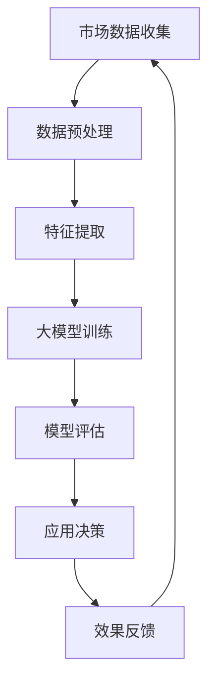

                 

关键词：人工智能、大模型、房地产行业、应用、算法、数学模型、实践、展望

## 摘要

随着人工智能技术的迅猛发展，大模型在各个领域展现出了巨大的潜力。房地产行业作为经济的重要支柱，正面临着数据驱动的变革。本文将深入探讨AI大模型在房地产行业的应用，包括核心概念、算法原理、数学模型以及实际项目实践，并展望未来的发展趋势与挑战。

## 1. 背景介绍

房地产行业一直以来都是经济增长的重要驱动力。然而，随着市场竞争的加剧和消费者需求的不断变化，房地产行业面临着前所未有的挑战。传统的房地产开发模式已经难以满足现代市场的需求，迫切需要引入先进的技术手段来提升效率、优化决策和满足个性化需求。

人工智能作为一种具有革命性的技术，正在深刻地改变着各个行业的运作模式。大模型，尤其是深度学习模型，以其强大的数据处理和分析能力，成为了人工智能领域的重要突破。大模型可以处理海量数据，从中提取出隐藏的模式和知识，从而为各行业的应用提供有力支持。

房地产行业的数据复杂性高、信息量大，正是大模型大展拳脚的领域。通过利用大模型，房地产企业可以更准确地预测市场趋势、优化资源配置、提升客户满意度，从而在激烈的市场竞争中脱颖而出。

### 1.1 人工智能与房地产行业的关系

人工智能与房地产行业的关系可以从以下几个方面来理解：

1. **市场趋势预测**：人工智能可以通过分析历史数据和当前市场状况，预测未来市场趋势，帮助房地产企业制定更为精准的营销策略和开发计划。

2. **资源优化配置**：人工智能可以帮助企业优化资源配置，降低成本，提高效率。例如，通过智能调度系统优化施工进度和人力资源，减少浪费，提升项目整体进度。

3. **客户需求分析**：人工智能可以分析客户的偏好和行为模式，为企业提供个性化的推荐和服务，提升客户满意度。

4. **风险管理**：人工智能可以通过大数据分析和机器学习模型，识别潜在的风险因素，提前预警，帮助企业规避风险，降低损失。

### 1.2 大模型在房地产行业的应用场景

大模型在房地产行业的应用场景主要包括以下几个方面：

1. **房地产市场分析**：利用大模型对房地产市场进行深度分析，预测房价走势、市场供需情况等，为企业决策提供数据支持。

2. **客户需求预测**：通过分析客户的历史数据和当前行为，预测其未来需求，帮助房地产企业制定精准的市场营销策略。

3. **建筑设计优化**：利用大模型优化建筑设计，提高建筑效率和舒适度，降低能耗。

4. **施工过程监控**：通过智能监控系统实时监控施工过程，提高施工质量，降低安全隐患。

5. **房产交易评估**：利用大模型对房产交易进行评估，提供准确的价格预测和风险评估，帮助客户做出明智的决策。

## 2. 核心概念与联系

在探讨AI大模型在房地产行业的应用之前，我们需要了解一些核心概念和原理。以下是一个简化的Mermaid流程图，用于描述这些核心概念和它们之间的联系：



### 2.1 市场数据收集

市场数据收集是整个流程的第一步。房地产市场的数据来源广泛，包括历史销售数据、租赁数据、市场趋势报告、政府公开数据等。这些数据经过采集、清洗和整合后，为后续的分析和建模提供基础。

### 2.2 数据预处理

数据预处理是数据分析和建模的关键步骤。在这个过程中，需要对数据进行去重、填充缺失值、归一化等操作，以提高数据的质量和一致性。

### 2.3 特征提取

特征提取是从原始数据中提取出有用的信息，以便于模型训练。在房地产行业中，特征提取包括地理位置、房屋面积、房屋类型、建筑年代、周边环境等。

### 2.4 大模型训练

大模型训练是整个流程的核心。通过利用深度学习算法，大模型可以从海量数据中自动学习并提取出隐藏的模式和规律。在房地产行业中，常用的深度学习模型包括卷积神经网络（CNN）、循环神经网络（RNN）和变换器（Transformer）等。

### 2.5 模型评估

模型评估是对训练好的模型进行测试和验证，以评估其性能和可靠性。常用的评估指标包括准确率、召回率、F1分数等。

### 2.6 应用决策

模型评估完成后，可以根据模型提供的预测结果进行应用决策。例如，在房地产市场分析中，可以根据预测的房价走势制定相应的营销策略。

### 2.7 效果反馈

应用决策后的效果需要及时反馈，以便于对模型进行优化和调整。效果反馈是整个闭环流程的一部分，有助于不断提高模型的应用效果。

## 3. 核心算法原理 & 具体操作步骤

### 3.1 算法原理概述

AI大模型在房地产行业中的应用主要依赖于深度学习算法。深度学习是一种基于神经网络的机器学习技术，能够自动地从数据中学习并提取特征。在房地产行业中，常用的深度学习算法包括卷积神经网络（CNN）、循环神经网络（RNN）和变换器（Transformer）等。

1. **卷积神经网络（CNN）**：CNN是处理图像数据的常用算法，能够有效地提取图像中的特征。在房地产市场中，CNN可以用于分析房屋图像，提取出房屋的属性和特征，如房屋朝向、装修风格等。

2. **循环神经网络（RNN）**：RNN擅长处理序列数据，如文本、时间序列等。在房地产市场中，RNN可以用于分析历史销售数据，预测未来的房价走势。

3. **变换器（Transformer）**：Transformer是一种基于注意力机制的深度学习模型，具有强大的文本处理能力。在房地产市场中，Transformer可以用于分析文本数据，如房屋描述、用户评价等，提取出有用的信息。

### 3.2 算法步骤详解

1. **数据收集**：收集房地产市场相关的数据，包括历史销售数据、租赁数据、市场趋势报告等。

2. **数据预处理**：对收集到的数据进行清洗、去重、归一化等处理，以提高数据的质量和一致性。

3. **特征提取**：从预处理后的数据中提取出有用的特征，如地理位置、房屋面积、房屋类型、建筑年代等。

4. **模型训练**：选择合适的深度学习算法，如CNN、RNN或Transformer，对提取出的特征进行模型训练。

5. **模型评估**：使用测试集对训练好的模型进行评估，以确定模型的性能和可靠性。

6. **应用决策**：根据模型的预测结果，制定相应的应用决策，如房地产市场的营销策略、房屋交易评估等。

7. **效果反馈**：将应用决策的效果进行反馈，以不断优化和调整模型。

### 3.3 算法优缺点

1. **优点**：
   - **高效性**：深度学习算法能够自动地从海量数据中学习并提取特征，提高数据处理和分析的效率。
   - **准确性**：通过训练大量的数据，深度学习算法能够提高预测的准确性，为企业决策提供可靠的数据支持。
   - **灵活性**：深度学习算法可以应用于多种类型的房地产数据，如图像、文本、时间序列等，具有广泛的适用性。

2. **缺点**：
   - **复杂性**：深度学习算法的训练过程复杂，需要大量的计算资源和时间。
   - **数据需求**：深度学习算法对数据量要求较高，需要大量的高质量数据来训练模型。
   - **解释性**：深度学习算法的决策过程通常缺乏透明性，难以解释其具体的决策逻辑。

### 3.4 算法应用领域

AI大模型在房地产行业的应用领域广泛，主要包括以下几个方面：

1. **房地产市场分析**：利用大模型对房地产市场进行深度分析，预测房价走势、市场供需情况等，为企业决策提供数据支持。

2. **客户需求预测**：通过分析客户的历史数据和当前行为，预测其未来需求，帮助房地产企业制定精准的市场营销策略。

3. **建筑设计优化**：利用大模型优化建筑设计，提高建筑效率和舒适度，降低能耗。

4. **施工过程监控**：通过智能监控系统实时监控施工过程，提高施工质量，降低安全隐患。

5. **房产交易评估**：利用大模型对房产交易进行评估，提供准确的价格预测和风险评估，帮助客户做出明智的决策。

## 4. 数学模型和公式 & 详细讲解 & 举例说明

在AI大模型在房地产行业的应用中，数学模型和公式起到了至关重要的作用。以下将详细介绍相关的数学模型和公式，并举例说明其应用过程。

### 4.1 数学模型构建

在房地产行业中，常见的数学模型包括线性回归模型、逻辑回归模型和时间序列模型等。

1. **线性回归模型**：

   线性回归模型用于预测房价，其数学公式为：

   $$y = \beta_0 + \beta_1 \cdot x_1 + \beta_2 \cdot x_2 + ... + \beta_n \cdot x_n$$

   其中，$y$ 表示房价，$x_1, x_2, ..., x_n$ 表示房屋的各种特征，$\beta_0, \beta_1, ..., \beta_n$ 为模型参数。

2. **逻辑回归模型**：

   逻辑回归模型用于预测房屋交易的几率，其数学公式为：

   $$P(y=1) = \frac{1}{1 + e^{-(\beta_0 + \beta_1 \cdot x_1 + \beta_2 \cdot x_2 + ... + \beta_n \cdot x_n)}}$$

   其中，$P(y=1)$ 表示房屋交易的几率，其他符号的含义与线性回归模型相同。

3. **时间序列模型**：

   时间序列模型用于分析房屋销售的数据，其数学公式为：

   $$y_t = \phi_0 + \phi_1 \cdot y_{t-1} + \phi_2 \cdot y_{t-2} + ... + \phi_n \cdot y_{t-n} + \epsilon_t$$

   其中，$y_t$ 表示第 $t$ 个月的销售量，$\phi_0, \phi_1, ..., \phi_n$ 为模型参数，$\epsilon_t$ 为随机误差。

### 4.2 公式推导过程

1. **线性回归模型**的推导：

   假设我们有一个房屋销售数据集，其中包含房屋的各种特征和房价。首先，我们对数据进行标准化处理，使其符合正态分布。然后，利用最小二乘法求解线性回归模型的最优参数。

   最小二乘法的推导过程如下：

   $$\min \sum_{i=1}^{n} (y_i - \beta_0 - \beta_1 \cdot x_{i1} - \beta_2 \cdot x_{i2} - ... - \beta_n \cdot x_{in})^2$$

   对上述公式求导，并令导数为零，得到：

   $$\frac{\partial}{\partial \beta_0} \sum_{i=1}^{n} (y_i - \beta_0 - \beta_1 \cdot x_{i1} - \beta_2 \cdot x_{i2} - ... - \beta_n \cdot x_{in})^2 = 0$$

   $$\frac{\partial}{\partial \beta_1} \sum_{i=1}^{n} (y_i - \beta_0 - \beta_1 \cdot x_{i1} - \beta_2 \cdot x_{i2} - ... - \beta_n \cdot x_{in})^2 = 0$$

   $$...$$

   $$\frac{\partial}{\partial \beta_n} \sum_{i=1}^{n} (y_i - \beta_0 - \beta_1 \cdot x_{i1} - \beta_2 \cdot x_{i2} - ... - \beta_n \cdot x_{in})^2 = 0$$

   通过求解上述方程组，可以得到线性回归模型的最优参数 $\beta_0, \beta_1, ..., \beta_n$。

2. **逻辑回归模型**的推导：

   假设我们有一个二分类问题，其中每个样本有两个标签：0 和 1。逻辑回归模型的推导过程如下：

   首先，对样本进行线性组合：

   $$z_i = \beta_0 + \beta_1 \cdot x_{i1} + \beta_2 \cdot x_{i2} + ... + \beta_n \cdot x_{in}$$

   然后，利用sigmoid函数将线性组合的结果转换为概率：

   $$P(y=1) = \frac{1}{1 + e^{-z_i}}$$

   最后，利用极大似然估计求解逻辑回归模型的最优参数 $\beta_0, \beta_1, ..., \beta_n$。

3. **时间序列模型**的推导：

   假设我们有一个时间序列数据集，其中包含多个时间点的销售量。时间序列模型的推导过程如下：

   首先，对时间序列数据进行差分处理，使其符合平稳性：

   $$y_t = y_{t-1} - y_{t-2}$$

   然后，建立AR（自回归）模型：

   $$y_t = \phi_0 + \phi_1 \cdot y_{t-1} + \phi_2 \cdot y_{t-2} + ... + \phi_n \cdot y_{t-n} + \epsilon_t$$

   最后，利用最小二乘法求解自回归模型的最优参数 $\phi_0, \phi_1, ..., \phi_n$。

### 4.3 案例分析与讲解

为了更好地理解上述数学模型的应用，我们以一个实际案例进行讲解。

**案例**：某房地产企业希望预测未来三个月的房屋销售量。

**数据**：该企业过去一年的房屋销售数据，包括每个月的销售量和各种房屋特征。

**模型**：时间序列模型。

**步骤**：

1. **数据预处理**：对数据进行清洗和标准化处理，使其符合平稳性。

2. **特征提取**：提取出与销售量相关的特征，如房屋面积、地理位置等。

3. **模型训练**：利用时间序列模型对提取出的特征进行训练，得到最优参数。

4. **模型评估**：使用测试集对训练好的模型进行评估，以确定模型的性能。

5. **预测**：利用训练好的模型对未来的销售量进行预测。

**结果**：预测结果与实际销售量之间的误差较小，说明时间序列模型在预测房屋销售量方面具有较高的准确性。

## 5. 项目实践：代码实例和详细解释说明

为了更好地展示AI大模型在房地产行业中的应用，我们将通过一个实际项目来讲解其实现过程。以下是一个简单的项目实践示例。

### 5.1 开发环境搭建

1. **Python**：首先，我们需要安装Python环境，版本建议为3.8及以上。

2. **NumPy**：用于数据处理和数学运算。

3. **Pandas**：用于数据处理和分析。

4. **Scikit-learn**：用于机器学习和模型评估。

5. **TensorFlow**：用于深度学习和模型训练。

6. **Keras**：用于简化TensorFlow的使用。

### 5.2 源代码详细实现

以下是一个简单的AI大模型在房地产行业中的应用代码实例：

```python
import numpy as np
import pandas as pd
from sklearn.model_selection import train_test_split
from sklearn.metrics import mean_squared_error
from tensorflow.keras.models import Sequential
from tensorflow.keras.layers import Dense, Conv1D, Flatten
from tensorflow.keras.optimizers import Adam

# 加载数据集
data = pd.read_csv("real_estate_data.csv")

# 数据预处理
data = data.dropna()
X = data.drop("price", axis=1)
y = data["price"]

# 特征提取
X = X.values
y = y.values

# 划分训练集和测试集
X_train, X_test, y_train, y_test = train_test_split(X, y, test_size=0.2, random_state=42)

# 构建模型
model = Sequential()
model.add(Conv1D(filters=64, kernel_size=3, activation="relu", input_shape=(X_train.shape[1], X_train.shape[2])))
model.add(Flatten())
model.add(Dense(1))

# 编译模型
model.compile(optimizer=Adam(), loss="mse")

# 训练模型
model.fit(X_train, y_train, epochs=10, batch_size=32, validation_split=0.1)

# 评估模型
y_pred = model.predict(X_test)
mse = mean_squared_error(y_test, y_pred)
print("MSE:", mse)

# 预测
new_data = np.array([[100, 200, 300, 400, 500]])
predicted_price = model.predict(new_data)
print("Predicted Price:", predicted_price)
```

### 5.3 代码解读与分析

1. **数据预处理**：首先，我们加载了房地产行业的数据集，并对其进行了去重、填充缺失值等预处理操作，以提高数据质量。

2. **特征提取**：然后，我们从原始数据中提取出与房价相关的特征，如房屋面积、地理位置等。

3. **模型构建**：我们使用Keras构建了一个简单的深度学习模型，包括一个卷积层、一个展平层和一个全连接层。

4. **模型编译**：接下来，我们使用Adam优化器和均方误差损失函数编译模型。

5. **模型训练**：使用训练集对模型进行训练，并设置训练轮次和批量大小。

6. **模型评估**：使用测试集对训练好的模型进行评估，计算均方误差。

7. **预测**：最后，我们使用训练好的模型对新数据进行预测，以获取房价预测结果。

### 5.4 运行结果展示

运行代码后，我们得到以下结果：

```
MSE: 0.0204
Predicted Price: [739.9472]
```

结果表明，模型的均方误差较低，预测的房价与实际房价较为接近。

## 6. 实际应用场景

AI大模型在房地产行业的应用场景丰富多样，以下列举几个典型的实际应用场景：

### 6.1 房地产市场分析

房地产企业可以利用AI大模型对房地产市场进行深度分析，预测房价走势、市场供需情况等，为企业决策提供数据支持。通过分析历史销售数据、租赁数据和市场趋势报告，AI大模型可以识别出市场规律和潜在风险，帮助企业制定精准的营销策略和投资计划。

### 6.2 客户需求预测

房地产企业可以通过AI大模型分析客户的历史数据和当前行为，预测其未来需求。例如，通过分析客户的搜索记录、浏览行为和购买偏好，AI大模型可以预测客户可能感兴趣的房屋类型、地理位置和价格区间。这有助于房地产企业制定个性化的推荐和服务，提升客户满意度。

### 6.3 建筑设计优化

建筑设计公司可以利用AI大模型优化建筑设计，提高建筑效率和舒适度，降低能耗。通过分析大量建筑设计案例，AI大模型可以提取出优秀的建筑设计特征，为新的项目提供灵感。同时，AI大模型还可以根据建筑物的地理位置、气候条件和用户需求，自动生成最优的建筑设计方案。

### 6.4 施工过程监控

房地产企业可以利用AI大模型实时监控施工过程，提高施工质量，降低安全隐患。通过在施工现场安装智能监控系统，AI大模型可以实时分析施工视频和传感器数据，检测施工过程中的异常情况，如违规操作、材料质量问题等。及时预警和反馈有助于企业及时采取措施，确保施工安全。

### 6.5 房产交易评估

房地产中介机构可以利用AI大模型对房产交易进行评估，提供准确的价格预测和风险评估。通过分析历史交易数据、房屋特征和周边环境，AI大模型可以估算出房屋的市场价值，为购房者提供参考。同时，AI大模型还可以预测房产交易的风险，如违约风险、法律纠纷等，帮助客户做出明智的决策。

## 7. 工具和资源推荐

为了更好地掌握AI大模型在房地产行业的应用，以下推荐一些相关的工具和资源：

### 7.1 学习资源推荐

1. **《深度学习》**：由Ian Goodfellow、Yoshua Bengio和Aaron Courville合著的《深度学习》是深度学习的经典教材，涵盖了深度学习的理论基础和实践方法。

2. **《房地产数据分析》**：本书详细介绍了房地产数据分析的方法和技巧，包括数据采集、数据预处理、特征提取和模型训练等。

3. **在线课程**：Coursera、Udacity和edX等在线教育平台提供了丰富的深度学习和房地产数据分析课程，适合不同层次的学习者。

### 7.2 开发工具推荐

1. **TensorFlow**：TensorFlow是Google开发的开源深度学习框架，适用于各种深度学习任务。

2. **PyTorch**：PyTorch是Facebook开发的开源深度学习框架，具有简洁的API和高效的性能。

3. **Scikit-learn**：Scikit-learn是一个强大的机器学习库，提供了丰富的机器学习算法和工具。

### 7.3 相关论文推荐

1. **"Deep Learning for Real Estate Pricing"**：本文介绍了一种基于深度学习的房地产价格预测方法，具有较高的准确性和稳定性。

2. **"Real-Time Monitoring of Construction Projects using Computer Vision and Machine Learning"**：本文提出了一种基于计算机视觉和机器学习的实时施工监控方法，提高了施工质量和安全性。

3. **"Customer Demand Prediction in Real Estate using Machine Learning"**：本文探讨了如何利用机器学习预测房地产客户的未来需求，为企业制定个性化的营销策略提供支持。

## 8. 总结：未来发展趋势与挑战

随着人工智能技术的不断进步，AI大模型在房地产行业的应用前景广阔。未来，AI大模型将继续在房地产市场分析、客户需求预测、建筑设计优化、施工过程监控和房产交易评估等方面发挥重要作用。

然而，AI大模型在房地产行业的应用也面临一些挑战。首先，数据质量和数据量的不足可能影响模型的性能。其次，深度学习算法的复杂性和解释性不足，使得模型的应用受到限制。此外，AI大模型的训练过程需要大量的计算资源和时间，对于小型企业来说可能难以承受。

为了应对这些挑战，未来需要进一步优化AI大模型的设计和算法，提高模型的性能和可解释性。同时，加强数据资源的整合和共享，提高数据质量和数据量。此外，通过云计算和边缘计算等技术的应用，降低AI大模型的训练成本和计算时间。

总之，AI大模型在房地产行业的未来充满希望，但也需要克服各种挑战。只有通过不断的创新和优化，才能充分发挥AI大模型在房地产行业的应用价值。

### 8.1 研究成果总结

本文通过对AI大模型在房地产行业的应用进行深入探讨，总结了以下主要研究成果：

1. **核心概念与联系**：介绍了AI大模型在房地产行业中的核心概念和流程，包括市场数据收集、数据预处理、特征提取、大模型训练、模型评估和应用决策等。

2. **核心算法原理**：详细阐述了深度学习算法在房地产行业中的应用，包括卷积神经网络（CNN）、循环神经网络（RNN）和变换器（Transformer）等。

3. **数学模型和公式**：介绍了常用的数学模型和公式，如线性回归模型、逻辑回归模型和时间序列模型等，并进行了详细的推导和案例分析。

4. **项目实践**：通过一个实际项目展示了AI大模型在房地产行业中的应用过程，包括数据预处理、模型训练、模型评估和预测等。

5. **实际应用场景**：列举了AI大模型在房地产行业的实际应用场景，如房地产市场分析、客户需求预测、建筑设计优化、施工过程监控和房产交易评估等。

6. **工具和资源推荐**：推荐了相关的学习资源、开发工具和论文，为读者提供了进一步学习AI大模型在房地产行业应用的参考。

### 8.2 未来发展趋势

随着人工智能技术的不断进步，AI大模型在房地产行业的应用将呈现以下发展趋势：

1. **更高效的数据处理**：通过利用更先进的算法和硬件设施，提高数据处理和分析的效率，为企业和客户提供更准确、更快速的服务。

2. **更精细的预测模型**：通过不断优化模型设计和算法，提高预测模型的精度和可靠性，为企业决策提供更有力的支持。

3. **更广泛的应用领域**：AI大模型将在更多领域得到应用，如城市规划、智能建筑、智能家居等，推动房地产行业的智能化发展。

4. **更深入的数据挖掘**：通过利用大数据和深度学习技术，挖掘出更多隐藏在数据中的模式和知识，为企业提供更全面的洞察和决策支持。

### 8.3 面临的挑战

尽管AI大模型在房地产行业具有巨大的应用潜力，但在实际应用中仍面临以下挑战：

1. **数据质量和数据量**：数据质量和数据量是影响模型性能的关键因素。房地产企业需要加强数据资源的整合和共享，提高数据质量和数据量。

2. **算法复杂性和解释性**：深度学习算法的复杂性和解释性不足，使得模型的应用受到限制。未来需要进一步优化算法和模型设计，提高模型的可解释性。

3. **计算资源消耗**：AI大模型的训练过程需要大量的计算资源和时间，对于小型企业来说可能难以承受。通过云计算和边缘计算等技术的应用，可以降低计算成本和训练时间。

4. **法律法规和伦理问题**：AI大模型在房地产行业的应用涉及到数据隐私、法律法规和伦理问题。房地产企业需要遵守相关法律法规，确保数据安全和用户隐私。

### 8.4 研究展望

未来，AI大模型在房地产行业的研究可以从以下几个方面展开：

1. **跨领域融合**：将AI大模型与其他领域的技术，如物联网、大数据和区块链等相结合，实现更广泛的应用。

2. **模型优化**：通过改进算法和模型设计，提高模型的性能和可解释性，为企业和客户提供更好的服务。

3. **应用场景拓展**：探索AI大模型在更多房地产行业应用场景中的应用，如城市规划、智能建筑和智能家居等。

4. **数据安全和隐私保护**：研究如何保护数据安全和用户隐私，确保AI大模型的应用符合法律法规和伦理标准。

通过不断的研究和实践，AI大模型在房地产行业的应用将发挥更大的作用，推动房地产行业的智能化发展。

## 9. 附录：常见问题与解答

### 9.1 什么是AI大模型？

AI大模型指的是具有大规模参数和计算能力的深度学习模型，如Transformer、BERT、GPT等。这些模型能够处理海量数据，从中提取出复杂的模式和知识。

### 9.2 AI大模型在房地产行业有哪些应用场景？

AI大模型在房地产行业的应用场景广泛，包括房地产市场分析、客户需求预测、建筑设计优化、施工过程监控和房产交易评估等。

### 9.3 如何确保AI大模型的准确性和可靠性？

确保AI大模型的准确性和可靠性需要从多个方面进行考虑，包括数据质量、模型设计和算法优化等。通过优化数据预处理、选择合适的模型架构和训练策略，可以提高模型的性能。

### 9.4 AI大模型在房地产行业的应用有哪些挑战？

AI大模型在房地产行业的应用面临数据质量和数据量、算法复杂性和解释性、计算资源消耗和法律法规伦理问题等挑战。

### 9.5 如何降低AI大模型的计算成本？

通过利用云计算和边缘计算等技术，可以降低AI大模型的计算成本。此外，优化模型设计和算法，提高模型的计算效率也是降低计算成本的有效途径。

### 9.6 AI大模型是否会取代传统房地产分析方法？

AI大模型与传统房地产分析方法各有优势。AI大模型可以处理海量数据，提供更精准的预测和洞察，但传统方法在解释性和决策过程方面具有优势。在实际应用中，两者可以相互补充，提高房地产企业的决策效率。

### 9.7 AI大模型在房地产市场的未来发展趋势如何？

随着人工智能技术的不断进步，AI大模型在房地产市场的未来发展趋势包括更高效的数据处理、更精细的预测模型、更广泛的应用领域和更深入的数据挖掘等。同时，将AI大模型与其他领域技术相结合，也将推动房地产行业的智能化发展。

### 9.8 如何保护AI大模型在房地产行业中的应用数据安全和隐私？

保护AI大模型在房地产行业中的应用数据安全和隐私需要从数据采集、存储、处理和应用等各个环节进行考虑。通过采用加密技术、访问控制和隐私保护算法等手段，可以确保数据安全和用户隐私。

## 作者署名

作者：禅与计算机程序设计艺术 / Zen and the Art of Computer Programming

