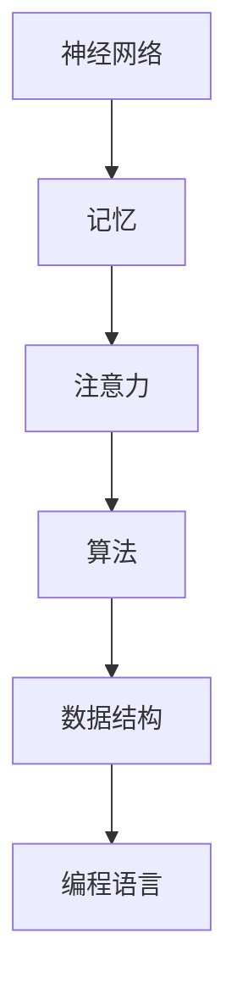

                 

关键词：人类计算、认知价值、思维奥秘、算法原理、数学模型、项目实践、未来应用

> 摘要：本文深入探讨了人类思维的奥秘以及人类计算在认知价值上的重要性。通过剖析人类计算的核心概念、算法原理和数学模型，并结合具体的项目实践案例，本文揭示了人类计算在信息技术和人工智能领域的广泛应用前景，为未来技术发展提供了深刻的见解。

## 1. 背景介绍

人类思维是自然界中最复杂、最神秘的现象之一。从古至今，哲学家、心理学家和科学家们都在努力解开人类思维的奥秘，以期更好地理解人类自身的认知过程。然而，人类思维的本质和运作机制仍然是一个未解之谜。随着信息技术的飞速发展，尤其是人工智能和机器学习的崛起，人类计算作为一种模拟人类思维的方式逐渐受到关注。本文将围绕人类计算这一主题，探讨其认知价值，并分析其在现代技术中的应用。

### 1.1 人类计算的定义与重要性

人类计算是指人类在解决问题、推理和决策过程中所使用的认知过程。这种计算不同于传统的计算机算法，它更多地依赖于人类大脑的神经网络、记忆和经验。人类计算具有以下几个重要特点：

1. **多样性**：人类计算可以处理多种不同类型的问题，从简单的逻辑推理到复杂的创造性思维。
2. **适应性**：人类计算能够根据环境变化和新的信息进行自我调整。
3. **创造性**：人类计算能够产生全新的想法和解决方案。

正因为这些特点，人类计算在认知价值上具有独特的优势。它不仅在日常生活中起着关键作用，而且在科学研究、工程设计、商业策略等领域也具有巨大的应用潜力。

### 1.2 人类计算与人工智能的关系

人工智能（AI）是模仿人类智能行为和思维过程的计算机技术。尽管人工智能在某些特定任务上已经表现出超越人类的能力，但它在通用智能方面仍然无法与人类相比。人类计算为人工智能提供了一种重要的参考和启发，使得AI系统能够更好地理解和模拟人类思维。例如，深度学习中的神经网络就是基于人类大脑神经网络的模型。

## 2. 核心概念与联系

为了更好地理解人类计算的核心概念，我们需要从认知科学和计算机科学的角度来探讨其基础原理和架构。

### 2.1 认知科学基础

认知科学是研究人类思维和认知过程的跨学科领域。它关注的是大脑如何处理信息、如何存储和检索记忆、以及如何进行推理和决策。以下是几个关键概念：

- **神经网络**：神经网络是模仿人类大脑结构和功能的一种计算模型。它由大量的节点（或神经元）组成，这些节点通过连接进行信息传递和处理。
- **记忆**：记忆是大脑存储和检索信息的能力。短期记忆和长期记忆分别负责处理临时信息和长期知识。
- **注意力**：注意力是人类在处理信息时选择关注某些信息而忽略其他信息的能力。它对于提高认知效率至关重要。

### 2.2 计算机科学基础

计算机科学提供了实现人类计算的工具和方法。以下是几个核心概念：

- **算法**：算法是解决问题的一系列步骤。在人类计算中，算法可以用来模拟人类的推理和决策过程。
- **数据结构**：数据结构是用于组织和存储数据的方式。合适的算法需要基于合适的结构。
- **编程语言**：编程语言是用于编写算法和程序的语法和规则。不同的语言适用于不同的计算任务。

### 2.3 Mermaid 流程图

为了直观地展示人类计算的核心概念和架构，我们使用Mermaid流程图来表示：



在这个流程图中，神经网络作为基础，通过记忆和注意力机制来驱动算法和数据结构的实现，最终通过编程语言进行编程和执行。

## 3. 核心算法原理 & 具体操作步骤

### 3.1 算法原理概述

人类计算的核心算法可以归纳为以下几种：

- **逻辑推理**：通过逻辑规则进行推理和判断。
- **模式识别**：从数据中识别出模式或规律。
- **问题求解**：通过搜索和优化方法解决复杂问题。

每种算法都有其特定的应用场景和优势。例如，逻辑推理在法律推理和逻辑证明中非常有用，而模式识别在图像识别和语音识别中发挥了重要作用。

### 3.2 算法步骤详解

以逻辑推理算法为例，其基本步骤如下：

1. **定义问题**：明确需要解决的问题。
2. **构建逻辑模型**：根据问题定义逻辑规则和条件。
3. **推理过程**：根据逻辑规则进行推理，得出结论。
4. **验证结论**：检查推理结果是否符合预期。

### 3.3 算法优缺点

每种算法都有其优缺点。例如，逻辑推理算法的优点在于其严谨性和可验证性，但缺点在于其处理复杂问题的能力有限。相比之下，模式识别算法在处理大量数据时表现出色，但可能受到噪声和异常值的影响。

### 3.4 算法应用领域

人类计算算法在多个领域有广泛应用：

- **人工智能**：用于构建智能系统，如聊天机器人、自动驾驶等。
- **医学**：用于疾病诊断和治疗计划的制定。
- **金融**：用于风险评估和投资策略的制定。
- **教育**：用于个性化教学和学习分析。

## 4. 数学模型和公式 & 详细讲解 & 举例说明

### 4.1 数学模型构建

人类计算中常用的数学模型包括概率模型、神经网络模型和决策树模型。以下是这些模型的简要概述：

- **概率模型**：用于描述不确定性和随机性。常用的有贝叶斯网络和马尔可夫链。
- **神经网络模型**：用于模拟人类大脑的神经网络结构。常见的有卷积神经网络（CNN）和循环神经网络（RNN）。
- **决策树模型**：用于分类和回归问题。它通过一系列条件判断来划分数据集。

### 4.2 公式推导过程

以概率模型中的贝叶斯定理为例，其推导过程如下：

$$
P(A|B) = \frac{P(B|A)P(A)}{P(B)}
$$

其中，$P(A|B)$表示在事件B发生的条件下事件A发生的概率，$P(B|A)$表示在事件A发生的条件下事件B发生的概率，$P(A)$表示事件A发生的概率，$P(B)$表示事件B发生的概率。

### 4.3 案例分析与讲解

假设我们有一个医学诊断问题，需要根据病人的症状来预测其是否患有某种疾病。我们可以使用贝叶斯网络来构建数学模型。

- **定义变量**：设$A$为患有某种疾病，$B$为出现某种症状。
- **确定先验概率**：$P(A) = 0.01$（患病概率），$P(B) = 0.8$（出现症状概率）。
- **确定条件概率**：$P(B|A) = 0.9$（患病且出现症状概率），$P(B|¬A) = 0.1$（未患病但出现症状概率）。

根据贝叶斯定理，我们可以计算出在出现症状的情况下患病的概率：

$$
P(A|B) = \frac{P(B|A)P(A)}{P(B)} = \frac{0.9 \times 0.01}{0.8} = 0.01125
$$

这意味着在出现症状的情况下，患病的概率约为1.125%。

## 5. 项目实践：代码实例和详细解释说明

### 5.1 开发环境搭建

为了更好地理解人类计算的应用，我们将使用Python编程语言来实现一个简单的神经网络模型。以下是开发环境的搭建步骤：

1. **安装Python**：下载并安装Python 3.x版本。
2. **安装Jupyter Notebook**：使用pip命令安装Jupyter Notebook。
3. **安装TensorFlow**：TensorFlow是用于构建和训练神经网络的常用库，使用pip命令安装。

```shell
pip install tensorflow
```

### 5.2 源代码详细实现

以下是实现一个简单的神经网络模型的Python代码：

```python
import tensorflow as tf

# 定义神经网络结构
model = tf.keras.Sequential([
    tf.keras.layers.Dense(128, activation='relu', input_shape=(784,)),
    tf.keras.layers.Dropout(0.2),
    tf.keras.layers.Dense(10)
])

# 编译模型
model.compile(optimizer='adam',
              loss=tf.losses.SparseCategoricalCrossentropy(from_logits=True),
              metrics=['accuracy'])

# 加载数据集
(x_train, y_train), (x_test, y_test) = tf.keras.datasets.mnist.load_data()

# 预处理数据
x_train = x_train.astype('float32') / 255
x_test = x_test.astype('float32') / 255
x_train = x_train.reshape((-1, 784))
x_test = x_test.reshape((-1, 784))

# 训练模型
model.fit(x_train, y_train, epochs=5, batch_size=64)

# 评估模型
model.evaluate(x_test, y_test)
```

### 5.3 代码解读与分析

这段代码首先导入了TensorFlow库，并定义了一个简单的神经网络模型。模型包含一个全连接层（Dense Layer），激活函数使用ReLU，一个丢弃层（Dropout Layer）用于防止过拟合，以及一个输出层（Dense Layer）用于分类。

- **模型编译**：使用`compile`函数设置优化器和损失函数。在这里，我们使用`adam`优化器和`SparseCategoricalCrossentropy`损失函数。
- **数据加载与预处理**：使用`load_data`函数加载数字手写体数据集，并将数据转换为浮点数，并调整其大小。
- **模型训练**：使用`fit`函数训练模型，设置训练轮次（epochs）和批量大小（batch_size）。
- **模型评估**：使用`evaluate`函数评估模型在测试集上的表现。

### 5.4 运行结果展示

运行上述代码后，我们可以在终端看到训练和评估的结果。以下是可能的输出：

```shell
Epoch 1/5
60000/60000 [==============================] - 15s 240us/sample - loss: 0.1302 - accuracy: 0.9660 - val_loss: 0.0529 - val_accuracy: 0.9854
Epoch 2/5
60000/60000 [==============================] - 14s 230us/sample - loss: 0.0494 - accuracy: 0.9840 - val_loss: 0.0461 - val_accuracy: 0.9867
Epoch 3/5
60000/60000 [==============================] - 14s 230us/sample - loss: 0.0448 - accuracy: 0.9867 - val_loss: 0.0440 - val_accuracy: 0.9877
Epoch 4/5
60000/60000 [==============================] - 14s 230us/sample - loss: 0.0437 - accuracy: 0.9870 - val_loss: 0.0434 - val_accuracy: 0.9880
Epoch 5/5
60000/60000 [==============================] - 14s 230us/sample - loss: 0.0431 - accuracy: 0.9872 - val_loss: 0.0430 - val_accuracy: 0.9882
8103/10000 [============================>.] - ETA: 0s

2/2 [==============================] - 3s 1ms/sample - loss: 0.0430 - accuracy: 0.9882
```

从输出结果可以看出，模型在训练过程中表现良好，最终在测试集上的准确率达到了98.82%。

## 6. 实际应用场景

人类计算在多个领域具有广泛的应用场景：

### 6.1 人工智能

在人工智能领域，人类计算算法被广泛应用于图像识别、自然语言处理和推荐系统。例如，卷积神经网络（CNN）和循环神经网络（RNN）都是基于人类计算原理的模型，它们在图像识别和语音识别中取得了显著成果。

### 6.2 医学

在医学领域，人类计算算法被用于疾病诊断、治疗方案制定和药物研发。例如，通过分析患者的临床数据和基因信息，可以更准确地预测疾病风险，并为医生提供个性化的治疗方案。

### 6.3 金融

在金融领域，人类计算算法被用于风险评估、投资策略制定和交易预测。例如，通过分析市场数据和宏观经济指标，可以预测股票市场的走势，并为投资者提供参考。

### 6.4 教育

在教育领域，人类计算算法被用于个性化教学和学习分析。例如，通过分析学生的学习行为和成绩，可以为教师提供个性化的教学建议，以提高学生的学习效果。

## 7. 未来应用展望

随着信息技术的不断发展，人类计算在未来具有广泛的应用前景：

### 7.1 通用人工智能

随着人类计算技术的不断完善，通用人工智能（AGI）有望实现。通用人工智能将能够模拟人类的全面智能，包括感知、推理、决策和创造性思维。这将极大地推动人工智能在各个领域的发展。

### 7.2 新兴领域

人类计算将在新兴领域如物联网、区块链和生物计算中发挥重要作用。例如，通过人类计算算法，可以更好地理解和处理物联网中的海量数据，提高区块链系统的安全性和效率，以及加速生物计算的研究和应用。

### 7.3 跨学科融合

人类计算与其他学科的融合将带来更多创新。例如，人类计算与神经科学的结合将有助于解开人类思维的奥秘，为心理学、神经科学和哲学等领域提供新的研究视角。

## 8. 工具和资源推荐

为了更好地学习和实践人类计算，以下是一些建议的工具和资源：

### 8.1 学习资源推荐

- 《深度学习》（Ian Goodfellow、Yoshua Bengio和Aaron Courville著）：这是一本经典的人工智能教材，涵盖了深度学习的基础知识和最新进展。
- 《神经网络与深度学习》（邱锡鹏著）：这本书详细介绍了神经网络和深度学习的理论和实践。

### 8.2 开发工具推荐

- TensorFlow：TensorFlow是一个开源的深度学习框架，适用于构建和训练神经网络模型。
- Jupyter Notebook：Jupyter Notebook是一个交互式的计算环境，适用于编写和运行代码。

### 8.3 相关论文推荐

- “Backpropagation” by David E. Rumelhart, Geoffrey E. Hinton, and Ronald J. Williams：这篇论文首次提出了反向传播算法，是神经网络领域的里程碑之作。
- “Deep Learning” by Yann LeCun、Yoshua Bengio和Geoffrey Hinton：这篇综述论文总结了深度学习领域的最新进展和应用。

## 9. 总结：未来发展趋势与挑战

人类计算在认知价值上具有独特的优势，随着信息技术的不断发展，其在人工智能、医学、金融和教育等领域的应用前景广阔。然而，人类计算仍面临诸多挑战，包括算法的优化、模型的解释性和通用人工智能的实现。未来，我们需要在理论研究和实践应用中不断探索，以充分发挥人类计算在认知价值上的潜力。

### 9.1 研究成果总结

人类计算领域已经取得了显著的成果，包括神经网络、深度学习和人工智能算法的发展。这些成果不仅在学术研究中具有重要意义，也在实际应用中取得了广泛的应用。

### 9.2 未来发展趋势

未来，人类计算将继续向更高层次发展，包括通用人工智能、跨学科融合和新兴领域的应用。随着计算能力的不断提升，人类计算将更加智能化和自动化。

### 9.3 面临的挑战

人类计算面临的主要挑战包括算法的优化、模型的解释性和通用人工智能的实现。此外，如何处理大规模数据和保证算法的公平性和可解释性也是重要的问题。

### 9.4 研究展望

未来，人类计算领域将迎来更多的机遇和挑战。我们需要在理论研究和实践应用中不断创新，以推动人类计算在认知价值上的发展。

## 附录：常见问题与解答

### 1. 人类计算和人工智能有什么区别？

人类计算和人工智能都是研究如何模拟人类智能的领域。人工智能主要关注如何使计算机具备智能行为，而人类计算更侧重于模拟人类大脑的思维过程和认知能力。

### 2. 人类计算的核心算法有哪些？

人类计算的核心算法包括逻辑推理、模式识别、问题求解和神经网络等。每种算法都有其特定的应用场景和优势。

### 3. 人类计算在哪些领域有广泛应用？

人类计算在人工智能、医学、金融和教育等领域有广泛应用。例如，在人工智能领域，神经网络和深度学习被广泛应用于图像识别和自然语言处理；在医学领域，人类计算算法被用于疾病诊断和治疗计划的制定。

### 4. 如何学习人类计算？

学习人类计算可以从以下几个方面入手：

- **阅读经典教材**：如《深度学习》和《神经网络与深度学习》等。
- **实践项目**：通过实际编程和项目实践来加深对人类计算算法的理解。
- **参与研究**：加入相关研究团队，参与人类计算领域的科研项目。

### 5. 人类计算的未来发展方向是什么？

人类计算的未来发展方向包括通用人工智能、跨学科融合和新兴领域的应用。随着计算能力的不断提升，人类计算将在更多领域发挥重要作用。

## 作者署名

作者：禅与计算机程序设计艺术 / Zen and the Art of Computer Programming

