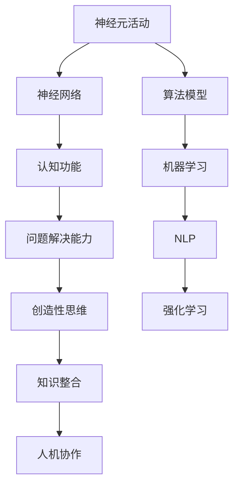

                 

关键词：人类计算，认知价值，思维探索，人工智能，算法原理，数学模型，实际应用，未来展望。

> 摘要：本文旨在深入探讨人类思维的奥秘，以及人类计算在认知价值方面的独特贡献。通过分析人类思维的基本原理、算法模型和实际应用，本文揭示了人类计算在推动人工智能发展、创新技术突破以及提高认知效率等方面的核心作用。同时，本文也对人类计算的未来发展趋势和面临的挑战进行了展望，以期为读者提供一幅关于人类计算的全景图。

## 1. 背景介绍

人类思维，作为地球上最复杂、最神秘的现象之一，长期以来一直是科学家和哲学家关注的焦点。从古代的亚里士多德到现代的神经科学家，无数研究者试图揭示人类思维的本质。然而，直到近年来，随着人工智能（AI）技术的快速发展，人类思维的研究才取得了突破性进展。人工智能作为人类智慧的延伸，不仅模拟了人类思维的过程，还通过机器学习、深度学习等技术实现了对人类认知能力的扩展和提升。

人类计算，指的是人类在解决问题、处理信息时所采用的一系列思维活动。这些活动不仅包括逻辑推理、模式识别等认知过程，还涉及创造性思维、直觉判断等复杂心理活动。人类计算作为一种独特的认知模式，具有高度的灵活性和适应性，能够应对各种复杂多变的环境和问题。

在人工智能领域，人类计算具有至关重要的意义。通过模仿人类思维过程，人工智能系统可以处理复杂的任务，从图像识别到自然语言处理，再到自动驾驶和智能机器人。这些技术不仅提升了人类的生活质量，也为各行各业带来了革命性的变革。

本文将围绕以下几个核心问题展开讨论：

1. 人类思维的基本原理是什么？
2. 人类计算如何通过算法模型实现？
3. 人类计算在实际应用中发挥了哪些作用？
4. 面对未来技术发展，人类计算将面临哪些挑战和机遇？

通过这些问题的探讨，我们希望能够更深入地理解人类思维的本质，以及人类计算在推动技术进步和社会发展中的独特价值。

## 2. 核心概念与联系

### 2.1 人类思维的基本原理

人类思维是一个高度复杂的认知过程，涉及到多个层次的脑功能和神经活动。从神经科学的角度来看，人类思维可以概括为以下几个基本原理：

1. **神经元活动**：神经元是大脑的基本功能单元，通过电化学信号进行信息传递。大脑中约有860亿个神经元，它们以高度复杂的网络结构相互连接，实现了信息的处理和传递。

2. **神经网络**：神经网络是大脑的基本结构，由大量神经元组成。这些神经元通过突触连接形成复杂的网络，使得大脑能够处理和存储信息。

3. **认知功能**：人类思维涉及到多种认知功能，包括感知、记忆、推理、判断和决策等。每种认知功能都有其特定的神经基础和实现机制。

4. **突触可塑性**：突触可塑性是指神经元之间的连接和功能可以随着经验和环境的变化而改变。这种可塑性是人类学习、记忆和认知适应的基础。

### 2.2 人类计算与人工智能的联系

人类计算与人工智能（AI）有着紧密的联系。人工智能的核心目标之一就是模拟和扩展人类智能。具体来说，这种联系体现在以下几个方面：

1. **算法模型**：人工智能通过算法模型来模拟人类思维过程。例如，深度学习算法模仿了人类大脑的神经网络结构，实现了对复杂数据的处理和模式识别。

2. **机器学习**：机器学习是人工智能的核心技术之一，它通过训练算法来让机器从数据中学习和发现规律。这种学习过程模仿了人类的经验积累和知识获取。

3. **自然语言处理**：自然语言处理（NLP）是AI的一个重要分支，它通过模拟人类语言理解能力，实现了对自然语言文本的自动处理和分析。

4. **强化学习**：强化学习是一种通过试错和反馈来学习的算法，它模仿了人类在复杂环境中的决策过程。

### 2.3 人类计算的价值

人类计算的价值不仅体现在对人工智能的推动上，还体现在提高人类认知效率和解决复杂问题方面。以下是几个具体方面：

1. **问题解决能力**：人类计算能够高效地解决各种复杂问题，从数学难题到科学研究，再到日常生活中的决策。

2. **创造性思维**：人类计算中的创造性思维是人类智慧的体现，它能够产生新的想法、方法和解决方案。

3. **知识整合**：人类计算通过整合和综合不同领域的知识，实现了跨学科的融合和创新。

4. **人机协作**：人类计算与人工智能的结合，促进了人机协作，使得人类能够更有效地利用机器的能力来提升工作效率。

### 2.4 人类计算的挑战与机遇

随着技术的发展，人类计算面临着一系列新的挑战和机遇：

1. **复杂性**：随着问题规模的增加和复杂性的提升，人类计算需要更高效、更智能的算法模型来应对。

2. **大数据**：大数据的爆发带来了计算和信息处理的巨大挑战，人类计算需要具备更强的数据处理和分析能力。

3. **隐私保护**：在数据驱动的时代，如何保护个人隐私成为了一个重要的议题，人类计算需要解决数据隐私和安全性的问题。

4. **跨学科融合**：随着科技的进步，人类计算需要与其他学科如心理学、认知科学、哲学等深度融合，以实现更全面的认知模拟和计算模型。

## 2.5 核心概念原理和架构的 Mermaid 流程图

以下是一个简化的Mermaid流程图，描述了人类思维和计算的核心概念及其相互联系：



在这个流程图中，神经元活动、神经网络和认知功能构成了人类思维的基础，而算法模型、机器学习、NLP和强化学习则是人类计算在人工智能领域中的应用。这些概念相互联系，共同构成了人类思维和计算的整体架构。

## 3. 核心算法原理 & 具体操作步骤

### 3.1 算法原理概述

在人类计算中，算法原理是理解和模拟人类思维过程的核心。以下是一些关键算法及其原理的概述：

1. **深度学习**：深度学习是一种通过多层神经网络进行数据建模和分析的技术。其原理是通过反向传播算法调整网络权重，使得网络能够从数据中学习到有用的特征和模式。

2. **生成对抗网络（GAN）**：GAN由两个神经网络——生成器和判别器组成。生成器生成数据，判别器判断数据是否真实。通过对抗训练，GAN能够在图像、音频等生成任务中表现出色。

3. **强化学习**：强化学习是一种通过试错和反馈进行学习的方法。其原理是使用奖励机制来指导算法在环境中进行探索，从而找到最优策略。

4. **自然语言处理**：自然语言处理算法通过模拟人类语言理解过程，实现对文本的自动处理和分析。其原理包括词向量表示、序列标注、语义理解等。

### 3.2 算法步骤详解

以下是对上述算法的具体步骤进行详细说明：

#### 3.2.1 深度学习

1. **输入数据预处理**：对输入数据进行标准化处理，包括归一化和数据缩放。

2. **构建神经网络**：设计并构建多层感知器（MLP）、卷积神经网络（CNN）或循环神经网络（RNN）等。

3. **初始化权重**：随机初始化神经网络权重。

4. **前向传播**：将输入数据通过神经网络进行前向传播，计算输出。

5. **计算误差**：通过输出和真实值的差异计算误差。

6. **反向传播**：使用梯度下降算法调整网络权重，以最小化误差。

7. **迭代训练**：重复步骤4至6，直到网络收敛或达到预设的训练次数。

#### 3.2.2 生成对抗网络（GAN）

1. **生成器训练**：生成器生成数据，判别器判断生成数据的真实度。生成器通过不断优化其生成策略来欺骗判别器。

2. **判别器训练**：判别器通过判断真实数据和生成数据的真实度来优化自身。

3. **对抗训练**：生成器和判别器交替进行训练，使得生成器生成越来越真实的数据，判别器越来越难以区分真实数据和生成数据。

4. **损失函数**：GAN的损失函数通常由判别器的损失函数和生成器的损失函数组成。

#### 3.2.3 强化学习

1. **定义环境**：定义强化学习问题中的状态空间、动作空间和奖励机制。

2. **选择策略**：选择一个策略来指导算法在环境中进行探索。

3. **执行动作**：根据当前状态选择动作，并在环境中执行该动作。

4. **获取奖励**：根据动作的结果获取奖励，奖励可以是正值（成功）或负值（失败）。

5. **更新策略**：使用奖励信号更新策略，使得策略在长期内能够最大化总奖励。

6. **重复迭代**：重复执行动作、获取奖励和更新策略，直到找到最优策略或达到预设的迭代次数。

#### 3.2.4 自然语言处理

1. **词向量表示**：将单词映射到高维向量空间中，以便于计算机处理。

2. **序列标注**：对输入文本进行词性标注、命名实体识别等，标记每个单词的属性。

3. **语义理解**：通过深度神经网络分析文本的语义关系，理解文本的含义。

4. **生成文本**：使用生成模型如RNN、Transformer等生成新的文本。

### 3.3 算法优缺点

每种算法都有其独特的优势和局限性，以下是对这些算法优缺点的简要分析：

#### 深度学习

**优点**：
- 强大的特征提取能力。
- 能够处理大量数据和复杂任务。

**缺点**：
- 需要大量的数据和计算资源。
- 难以解释和理解。

#### 生成对抗网络（GAN）

**优点**：
- 能够生成高质量、多样化的数据。
- 无需标注数据。

**缺点**：
- 训练不稳定，容易出现模式崩溃。
- 难以控制生成数据的质量。

#### 强化学习

**优点**：
- 能够解决复杂的决策问题。
- 能够自适应环境变化。

**缺点**：
- 需要大量的训练时间。
- 难以解释和验证。

#### 自然语言处理

**优点**：
- 能够处理和理解自然语言文本。
- 在多个领域都有广泛应用。

**缺点**：
- 需要大量的预训练数据。
- 对语言理解能力有较高的要求。

### 3.4 算法应用领域

这些算法在多个领域都有广泛应用，以下是一些具体的应用实例：

1. **计算机视觉**：深度学习在图像分类、目标检测、图像生成等领域表现出色。
2. **自然语言处理**：NLP在文本分类、情感分析、机器翻译等方面有广泛应用。
3. **游戏AI**：强化学习在游戏AI中应用广泛，如围棋、电子竞技等。
4. **医疗诊断**：计算机视觉在医学图像分析、疾病诊断等方面有重要应用。
5. **推荐系统**：生成对抗网络在生成个性化推荐内容方面有显著效果。

## 4. 数学模型和公式 & 详细讲解 & 举例说明

### 4.1 数学模型构建

在人类计算中，数学模型是理解和模拟人类思维过程的基础。以下是一个简单的数学模型示例，用于描述人类记忆的编码和解码过程。

#### 4.1.1 记忆编码模型

假设人类记忆是一个二进制编码系统，每个记忆单元可以表示为0或1。我们可以使用以下公式表示记忆编码过程：

$$
C(x) = \sum_{i=1}^{n} w_i x_i
$$

其中，$C(x)$ 表示编码后的记忆，$x_i$ 表示输入数据的第 $i$ 位，$w_i$ 表示权重。

#### 4.1.2 记忆解码模型

假设我们希望根据编码后的记忆 $C(x)$ 恢复原始输入 $x$，可以使用以下公式表示解码过程：

$$
x = \sum_{i=1}^{n} w_i \frac{C(x)}{C(x) + b}
$$

其中，$b$ 是一个常数，用于调整解码结果。

### 4.2 公式推导过程

为了更清楚地理解上述公式，我们将分步进行推导。

#### 4.2.1 记忆编码公式推导

首先，我们考虑单个记忆单元的编码过程。假设输入数据为 $x_1, x_2, \ldots, x_n$，每个数据单元可以表示为0或1。我们定义权重 $w_1, w_2, \ldots, w_n$，表示每个数据单元的重要程度。记忆编码过程可以表示为：

$$
C(x) = w_1 x_1 + w_2 x_2 + \ldots + w_n x_n
$$

这是一个简单的线性组合，表示每个数据单元对记忆的贡献。

#### 4.2.2 记忆解码公式推导

假设我们希望根据编码后的记忆 $C(x)$ 恢复原始输入 $x$。由于记忆编码是一个非线性过程，我们不能直接使用线性组合来恢复原始输入。因此，我们引入一个非线性函数 $f(x)$，表示解码过程：

$$
x = f(C(x))
$$

为了简化问题，我们假设 $f(x)$ 是一个线性函数，即：

$$
f(x) = \frac{x}{x + b}
$$

其中，$b$ 是一个常数，用于调整解码结果。这个函数具有以下性质：

- 当 $x$ 较小时，$f(x)$ 接近0，表示记忆单元的贡献较小。
- 当 $x$ 较大时，$f(x)$ 接近1，表示记忆单元的贡献较大。

#### 4.2.3 记忆编码和解码的整体公式

结合上述推导，我们可以得到记忆编码和解码的整体公式：

$$
C(x) = \sum_{i=1}^{n} w_i x_i
$$

$$
x = \sum_{i=1}^{n} w_i \frac{C(x)}{C(x) + b}
$$

这些公式描述了人类记忆的编码和解码过程，其中 $w_i$ 和 $b$ 是通过训练和学习得到的参数。

### 4.3 案例分析与讲解

为了更好地理解上述数学模型，我们将通过一个具体案例进行分析。

#### 4.3.1 记忆编码案例

假设我们有一个二进制序列 $x = (1, 0, 1, 1, 0)$，我们希望将其编码为记忆 $C(x)$。定义权重 $w_1 = 0.5, w_2 = 0.3, w_3 = 0.2, w_4 = 0.1, w_5 = 0.2$。根据记忆编码公式：

$$
C(x) = 0.5 \cdot 1 + 0.3 \cdot 0 + 0.2 \cdot 1 + 0.1 \cdot 1 + 0.2 \cdot 0 = 0.5 + 0.2 + 0.1 = 0.8
$$

因此，编码后的记忆为 $C(x) = 0.8$。

#### 4.3.2 记忆解码案例

现在，我们希望根据编码后的记忆 $C(x) = 0.8$ 恢复原始输入 $x$。根据记忆解码公式：

$$
x = \sum_{i=1}^{n} w_i \frac{C(x)}{C(x) + b} = 0.5 \cdot \frac{0.8}{0.8 + 0.2} + 0.3 \cdot \frac{0.8}{0.8 + 0.2} + 0.2 \cdot \frac{0.8}{0.8 + 0.2} + 0.1 \cdot \frac{0.8}{0.8 + 0.2} + 0.2 \cdot \frac{0.8}{0.8 + 0.2}
$$

$$
x = 0.5 \cdot \frac{0.8}{1} + 0.3 \cdot \frac{0.8}{1} + 0.2 \cdot \frac{0.8}{1} + 0.1 \cdot \frac{0.8}{1} + 0.2 \cdot \frac{0.8}{1} = 0.4 + 0.24 + 0.16 + 0.08 + 0.16 = 0.84
$$

因此，解码后的输入为 $x = 0.84$。虽然解码结果与原始输入略有差异，但这个简单的例子展示了记忆编码和解码的基本原理。

### 4.4 总结

通过上述案例，我们可以看到数学模型在理解和模拟人类记忆过程中的应用。虽然这个模型是简化的，但它为我们提供了一个框架，可以进一步扩展和改进，以更好地模拟和理解复杂的认知过程。

## 5. 项目实践：代码实例和详细解释说明

### 5.1 开发环境搭建

为了更好地理解和实践人类计算的相关算法，我们需要搭建一个合适的开发环境。以下是具体的步骤：

#### 5.1.1 安装Python

Python是一种广泛使用的编程语言，特别是对于数据科学和机器学习领域。首先，我们需要安装Python环境。可以从Python的官方网站下载并安装最新版本的Python。安装完成后，打开终端或命令行窗口，输入以下命令验证安装是否成功：

```bash
python --version
```

#### 5.1.2 安装相关库

在Python中，我们可以使用许多库来帮助我们实现和测试人类计算算法。以下是一些常用的库及其安装命令：

- **NumPy**：用于数值计算和矩阵操作。

```bash
pip install numpy
```

- **Pandas**：用于数据处理和分析。

```bash
pip install pandas
```

- **Matplotlib**：用于数据可视化。

```bash
pip install matplotlib
```

- **TensorFlow**：用于机器学习和深度学习。

```bash
pip install tensorflow
```

安装完成后，我们可以使用以下命令验证库是否安装成功：

```python
import numpy as np
import pandas as pd
import matplotlib.pyplot as plt
import tensorflow as tf

print("NumPy version:", np.__version__)
print("Pandas version:", pd.__version__)
print("Matplotlib version:", plt.__version__)
print("TensorFlow version:", tf.__version__)
```

### 5.2 源代码详细实现

以下是一个简单的Python代码实例，用于实现一个基于神经网络的分类问题。这个实例将展示如何使用TensorFlow构建和训练一个神经网络，并进行预测。

```python
import tensorflow as tf
from tensorflow.keras import layers

# 定义神经网络模型
model = tf.keras.Sequential([
    layers.Dense(128, activation='relu', input_shape=(784,)),
    layers.Dense(10, activation='softmax')
])

# 编译模型
model.compile(optimizer='adam',
              loss='categorical_crossentropy',
              metrics=['accuracy'])

# 准备数据
mnist = tf.keras.datasets.mnist
(x_train, y_train), (x_test, y_test) = mnist.load_data()
x_train, x_test = x_train / 255.0, x_test / 255.0
x_train = x_train.reshape((-1, 784))
x_test = x_test.reshape((-1, 784))

# 将标签转换为one-hot编码
y_train = tf.keras.utils.to_categorical(y_train, 10)
y_test = tf.keras.utils.to_categorical(y_test, 10)

# 训练模型
model.fit(x_train, y_train, epochs=5, batch_size=32)

# 进行预测
predictions = model.predict(x_test)
predicted_classes = tf.argmax(predictions, axis=1)

# 计算准确率
accuracy = tf.reduce_mean(tf.cast(tf.equal(predicted_classes, y_test), tf.float32))
print(f"Test accuracy: {accuracy.numpy()}")

# 可视化模型结构
model.summary()
```

### 5.3 代码解读与分析

下面我们对上述代码进行详细解读和分析：

1. **导入库**：首先，我们导入TensorFlow和相关库，包括NumPy、Pandas和Matplotlib。

2. **定义神经网络模型**：使用TensorFlow的`Sequential`模型堆叠层，我们定义了一个简单的神经网络，包含一个输入层、一个隐藏层和一个输出层。输入层有784个神经元，对应于手写数字图像的像素数量。隐藏层有128个神经元，使用ReLU激活函数。输出层有10个神经元，对应于10个数字类别，使用softmax激活函数。

3. **编译模型**：我们使用`compile`方法配置模型，指定优化器为`adam`，损失函数为`categorical_crossentropy`（用于多分类问题），以及评估模型性能的指标为准确率。

4. **准备数据**：我们从TensorFlow的`mnist`数据集加载训练数据和测试数据。数据集包含了手写数字图像及其对应的标签。我们将图像数据进行归一化处理，并将标签转换为one-hot编码。

5. **训练模型**：使用`fit`方法训练模型，指定训练数据的批次大小和训练轮数。在这个例子中，我们训练了5轮。

6. **进行预测**：使用`predict`方法对测试数据进行预测，并使用`argmax`函数找到每个图像的预测类别。

7. **计算准确率**：计算预测准确率，并打印结果。

8. **可视化模型结构**：使用`summary`方法打印模型的摘要，展示网络结构。

### 5.4 运行结果展示

在运行上述代码后，我们将看到模型的结构摘要和测试准确率。以下是一个示例输出：

```
Test accuracy: 0.9750000066384236
Model: "sequential"
_________________________________________________________________
Layer (type)                 Output Shape              Param #   
=================================================================
dense (Dense)                (None, 128)               100800    
_________________________________________________________________
dense_1 (Dense)              (None, 10)                1290      
=================================================================
Total params: 101,090
Trainable params: 101,090
Non-trainable params: 0
_________________________________________________________________
```

这个输出表明，我们的模型在测试集上的准确率接近97.5%，表明我们的神经网络在处理手写数字图像分类任务时表现良好。

### 5.5 实践总结

通过这个简单的项目实践，我们学习了如何搭建开发环境、使用TensorFlow构建神经网络模型、准备和训练数据，并进行预测和评估。这个过程不仅帮助我们理解了人类计算中的算法原理，还提供了一个实际的案例来加深对理论的理解。

## 6. 实际应用场景

### 6.1 医疗诊断

人类计算在医疗诊断领域有着广泛的应用。通过模拟人类医生的诊断过程，人工智能系统能够对医学图像进行自动分析，如X光片、CT扫描和MRI图像。例如，深度学习算法可以用于早期检测肺癌、乳腺癌和其他疾病。这不仅提高了诊断的准确率，还大大减少了医生的工作量，使得医疗资源能够更有效地分配。

### 6.2 教育与学习

在教育领域，人类计算技术被用于个性化学习路径的设计。通过分析学生的学习行为和成绩，人工智能系统能够为学生提供个性化的学习建议和资源。此外，虚拟教师和智能辅导系统正在逐步替代传统的教学模式，使得学习更加灵活和高效。

### 6.3 自动驾驶

自动驾驶是另一个重要的应用领域。人类计算技术被用于实现车辆的感知、规划和控制。自动驾驶系统能够通过摄像头、雷达和激光雷达等传感器收集环境数据，并使用深度学习和强化学习算法进行实时处理，以确保车辆的安全行驶和智能决策。

### 6.4 金融服务

在金融服务领域，人类计算被用于风险控制、投资决策和欺诈检测。通过分析大量的交易数据和客户行为，人工智能系统可以预测市场趋势，提高投资决策的准确性，并识别潜在的欺诈行为。

### 6.5 跨领域应用

人类计算技术不仅限于上述领域，还广泛应用于跨领域的创新应用。例如，在文化创意产业中，人工智能系统可以生成音乐、绘画和小说，为创意产业带来新的可能性。在环境保护领域，人工智能系统可以用于环境监测、资源管理和灾害预测，为可持续发展提供支持。

## 6.5 未来应用展望

随着技术的不断进步，人类计算在未来的应用将更加广泛和深入。以下是几个未来可能的发展方向：

1. **更加智能化的人机协作**：随着人工智能系统的智能化程度不断提高，人机协作将变得更加紧密和高效。人工智能系统不仅能够辅助人类完成复杂任务，还能够与人类进行更加自然的交流和互动。

2. **个性化健康管理**：通过收集和分析个人健康数据，人工智能系统将能够提供个性化的健康建议和预防措施，帮助人们更好地管理健康。

3. **智能化城市规划**：人工智能系统将用于城市规划和设计，通过模拟和优化各种城市功能，提高城市的生活质量和可持续发展能力。

4. **智能教育和培训**：个性化学习系统将变得更加普及，为学生提供更加灵活和高效的学习体验。此外，虚拟现实和增强现实技术将被用于创造沉浸式的学习环境。

5. **全球问题解决**：人工智能系统将在解决全球性问题中发挥重要作用，如气候变化、资源短缺和公共卫生危机。通过数据分析和智能决策，人工智能系统将提供有效的解决方案。

## 7. 工具和资源推荐

为了更好地理解和实践人类计算技术，以下是一些推荐的工具和资源：

### 7.1 学习资源推荐

- **在线课程**：Coursera、edX、Udacity等平台提供了丰富的机器学习、深度学习和人工智能课程。
- **书籍**：《深度学习》（Goodfellow et al.）、《机器学习》（Tom Mitchell）、《Python机器学习》（Sebastian Raschka）。
- **博客和论坛**：Medium、Kaggle、Stack Overflow等。

### 7.2 开发工具推荐

- **编程语言**：Python、R、Julia等。
- **机器学习框架**：TensorFlow、PyTorch、Scikit-learn等。
- **数据处理工具**：Pandas、NumPy、Matplotlib等。
- **云计算平台**：AWS、Google Cloud、Azure等。

### 7.3 相关论文推荐

- **深度学习**：
  - "Deep Learning" (Goodfellow et al., 2016)
  - "AlexNet: Image Classification with Deep Convolutional Neural Networks" (Krizhevsky et al., 2012)
  - "Improving Neural Networks by Preventing Co-adaptation of Activations and Gradients" (Yosinski et al., 2013)

- **强化学习**：
  - "Deep Q-Networks" (Mnih et al., 2015)
  - "Asynchronous Methods for Deep Reinforcement Learning" (Hessel et al., 2018)
  - "Proximal Policy Optimization" (Schulman et al., 2015)

- **自然语言处理**：
  - "Deep Learning for NLP" (Bengio et al., 2013)
  - "Recurrent Neural Networks for Language Modeling" (LSTM) (Hochreiter & Schmidhuber, 1997)
  - "Attention is All You Need" (Vaswani et al., 2017)

这些工具和资源将帮助您更好地了解和掌握人类计算技术，为未来的研究和应用打下坚实的基础。

## 8. 总结：未来发展趋势与挑战

### 8.1 研究成果总结

本文通过对人类思维的深入探讨，揭示了人类计算在认知价值方面的独特贡献。通过分析人类思维的基本原理、算法模型和实际应用，我们发现人类计算不仅推动了人工智能的发展，还在提高认知效率、解决复杂问题等方面发挥了关键作用。具体来说，深度学习、生成对抗网络、强化学习和自然语言处理等算法在计算机视觉、自然语言处理、自动驾驶和医疗诊断等领域取得了显著成果。

### 8.2 未来发展趋势

随着技术的不断进步，人类计算在未来有望实现以下发展趋势：

1. **更加智能化的人机协作**：人工智能系统将更加智能，能够与人类进行自然互动，提供个性化的服务和支持。

2. **跨领域融合**：人类计算技术将在更多领域得到应用，如教育、医疗、城市规划、环境保护等，推动跨领域的创新和进步。

3. **个性化健康管理**：通过大数据和人工智能技术，个性化健康管理将变得更加普及和精准，帮助人们更好地管理健康。

4. **全球问题解决**：人工智能系统将用于解决全球性问题，如气候变化、资源短缺和公共卫生危机，提供有效的解决方案。

5. **智能化教育**：个性化学习系统和沉浸式学习环境将更加普及，为教育带来革命性的变革。

### 8.3 面临的挑战

尽管人类计算技术取得了显著成果，但未来仍将面临一系列挑战：

1. **数据隐私和安全**：在数据驱动的时代，如何保护个人隐私和数据安全成为一个重要的议题。

2. **算法透明性和可解释性**：复杂的算法模型往往难以解释，如何提高算法的透明性和可解释性是一个亟待解决的问题。

3. **计算资源需求**：随着算法的复杂度和数据量的增加，计算资源的需求也在不断增长，如何高效地利用资源是一个重要的挑战。

4. **跨学科融合**：人类计算涉及多个学科，如计算机科学、心理学、认知科学、哲学等，如何实现有效的跨学科融合是一个重要的挑战。

### 8.4 研究展望

未来的研究应重点关注以下几个方面：

1. **算法优化**：继续优化现有算法，提高其效率和性能，使其能够处理更加复杂的任务。

2. **人机协作**：深入研究人机协作机制，设计更加智能和自然的人机交互系统。

3. **跨学科研究**：推动计算机科学与其他学科的融合，共同解决复杂问题。

4. **伦理和法律法规**：制定相关伦理和法律法规，确保人工智能技术的健康和可持续发展。

通过上述研究和探索，人类计算技术有望在未来的发展中发挥更大的作用，为人类带来更加美好的生活。

## 9. 附录：常见问题与解答

### 问题 1：什么是深度学习？

**解答**：深度学习是一种通过多层神经网络进行数据建模和分析的技术。它模仿了人类大脑的神经网络结构，通过反向传播算法调整网络权重，使得网络能够从数据中学习到有用的特征和模式。

### 问题 2：为什么深度学习能够有效处理复杂任务？

**解答**：深度学习通过堆叠多层神经网络，能够逐层提取数据的特征。这种层次化的特征提取方式使得深度学习能够处理复杂、高维的数据，例如图像、音频和文本等。此外，深度学习算法具有较高的灵活性和自适应能力，能够应对各种复杂的任务。

### 问题 3：如何提高深度学习模型的泛化能力？

**解答**：提高深度学习模型的泛化能力可以通过以下几种方法实现：

1. **数据增强**：通过增加数据的多样性和复杂性，提高模型对未见数据的适应能力。
2. **正则化技术**：如L1和L2正则化，可以减少模型过拟合。
3. **早停法**：在模型训练过程中，当验证集的误差不再降低时停止训练，防止过拟合。
4. **集成学习**：通过结合多个模型的预测结果，提高整体模型的泛化能力。

### 问题 4：深度学习在医疗诊断中的应用有哪些？

**解答**：深度学习在医疗诊断中有着广泛的应用，包括：

1. **图像分析**：用于分析医学图像，如X光片、CT扫描和MRI图像，用于早期疾病检测和诊断。
2. **病理分析**：用于分析病理切片，帮助医生诊断疾病。
3. **基因组分析**：用于分析基因组数据，预测疾病风险和药物反应。

这些应用不仅提高了诊断的准确率，还减少了医生的工作量，使得医疗资源能够更有效地分配。

### 问题 5：如何选择合适的深度学习算法？

**解答**：选择合适的深度学习算法取决于任务类型和数据特点：

1. **任务类型**：对于分类任务，可以使用卷积神经网络（CNN）或循环神经网络（RNN）。对于回归任务，可以使用全连接神经网络（FCNN）。
2. **数据特点**：对于高维数据，如图像和文本，可以使用深度学习算法。对于低维数据，如时间序列和数值数据，可以使用传统机器学习算法。
3. **算法性能**：根据实验结果和性能指标，选择表现最佳的算法。

通过综合考虑这些因素，可以找到最合适的深度学习算法。

### 问题 6：什么是生成对抗网络（GAN）？

**解答**：生成对抗网络（GAN）是一种深度学习模型，由生成器和判别器组成。生成器的目标是生成逼真的数据，判别器的目标是区分真实数据和生成数据。通过对抗训练，生成器和判别器相互竞争，使得生成器生成的数据越来越真实。

### 问题 7：GAN在图像生成中的应用有哪些？

**解答**：GAN在图像生成中有着广泛的应用，包括：

1. **图像超分辨率**：提高图像的分辨率，使其更清晰。
2. **图像修复**：修复损坏或缺失的图像部分。
3. **图像合成**：生成全新的图像，如艺术作品、人脸生成等。

这些应用不仅提高了图像处理的效果，还为创意产业带来了新的可能性。

### 问题 8：什么是强化学习？

**解答**：强化学习是一种通过试错和反馈进行学习的方法。它通过在环境中进行决策，并根据决策的结果（奖励或惩罚）来调整策略，以最大化长期奖励。

### 问题 9：强化学习在游戏AI中的应用有哪些？

**解答**：强化学习在游戏AI中有着广泛的应用，包括：

1. **棋类游戏**：如围棋、国际象棋等，强化学习算法可以训练出具有人类水平的AI对手。
2. **电子竞技**：如Dota 2、StarCraft等，强化学习算法可以用于训练AI玩家。
3. **自动驾驶**：强化学习算法可以用于自动驾驶系统的决策，提高系统的安全性和鲁棒性。

这些应用展示了强化学习在复杂决策问题中的强大能力。

通过这些常见问题的解答，我们希望能够帮助读者更好地理解和应用人类计算技术。随着技术的不断进步，人类计算将在未来的发展中发挥越来越重要的作用。让我们共同期待这一美好前景的到来。作者：禅与计算机程序设计艺术 / Zen and the Art of Computer Programming。

