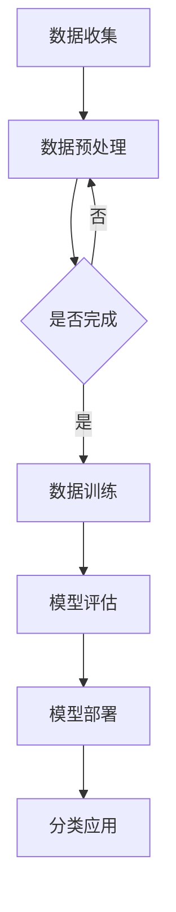

                 

关键词：大模型、电商、智能分类、机器学习、数据挖掘

在当今这个信息爆炸的时代，电商行业面临着海量的商品数据。如何有效地对这些数据进行分析和处理，为消费者提供更加个性化和精准的服务，成为了电商企业亟待解决的重要问题。本文将探讨基于大模型的电商智能商品分类系统，通过对核心概念、算法原理、数学模型、项目实践以及未来应用展望等多个方面的详细分析，旨在为电商行业的数据处理和智能服务提供一种新的思路和方法。

## 1. 背景介绍

随着互联网的快速发展，电商行业已经渗透到我们生活的方方面面。然而，电商行业的繁荣也带来了大量的商品数据，这些数据包含商品名称、价格、描述、销量、用户评论等丰富的信息。如何从这些海量数据中提取出有用的信息，对电商企业来说至关重要。商品分类作为电商数据处理的关键步骤，直接影响到用户的购物体验和电商平台的运营效率。

传统的商品分类方法主要依赖于人工规则和手动分类，这种方式不仅效率低下，而且难以应对数据量的急剧增长。随着机器学习和人工智能技术的不断发展，基于机器学习的商品分类方法逐渐成为研究的热点。而大模型的出现，更是为商品分类系统带来了前所未有的数据处理能力。

## 2. 核心概念与联系

### 2.1 大模型

大模型，顾名思义，指的是具有大量参数和复杂结构的机器学习模型。大模型通常采用深度学习技术，能够在大规模数据集上进行训练，从而获得良好的泛化能力。大模型的应用已经渗透到各个领域，如图像识别、自然语言处理、语音识别等。

### 2.2 电商智能商品分类

电商智能商品分类是指利用机器学习算法和大数据技术，对电商平台的商品进行自动分类的过程。通过智能分类，电商平台能够更好地组织商品信息，提高用户购物体验，同时也能为电商运营提供数据支持。

### 2.3 Mermaid 流程图

为了更好地展示大模型在电商智能商品分类系统中的应用，我们可以使用 Mermaid 流程图来描述整个系统的工作流程。



## 3. 核心算法原理 & 具体操作步骤

### 3.1 算法原理概述

电商智能商品分类的核心算法是基于深度学习的神经网络模型。神经网络通过层层神经元之间的连接，对输入的数据进行处理，从而实现对商品分类。大模型的引入，使得神经网络能够处理更加复杂和庞大的数据集，提高了分类的准确性和效率。

### 3.2 算法步骤详解

#### 3.2.1 数据收集

数据收集是整个商品分类系统的第一步，主要包含商品名称、描述、价格、销量、用户评论等数据。这些数据可以从电商平台的数据库中获取。

#### 3.2.2 数据预处理

数据预处理是保证模型训练质量的关键步骤。主要包括数据清洗、数据归一化、特征提取等。通过对数据进行预处理，可以减少噪声，提高数据的质量。

#### 3.2.3 数据训练

数据预处理完成后，就可以开始进行模型训练。模型训练的过程就是让神经网络通过学习大量的商品数据，找到数据中的规律，从而实现对商品进行分类。

#### 3.2.4 模型评估

模型训练完成后，需要对模型进行评估。常用的评估指标有准确率、召回率、F1值等。通过对模型进行评估，可以确定模型的效果。

#### 3.2.5 模型部署

模型评估完成后，可以将模型部署到生产环境中，对电商平台上的商品进行实时分类。

### 3.3 算法优缺点

#### 3.3.1 优点

- 高效性：大模型能够处理大规模数据，提高了分类的效率。
- 准确性：深度学习模型能够从数据中学习到复杂的特征，提高了分类的准确性。

#### 3.3.2 缺点

- 计算资源消耗大：大模型的训练和推理过程需要大量的计算资源。
- 数据依赖性强：模型的性能很大程度上依赖于数据的量和质量。

### 3.4 算法应用领域

电商智能商品分类算法不仅可以应用于电商平台，还可以扩展到其他领域，如在线教育、金融保险等。

## 4. 数学模型和公式 & 详细讲解 & 举例说明

### 4.1 数学模型构建

电商智能商品分类的数学模型主要基于深度学习中的神经网络。神经网络由多个神经元组成，每个神经元都接受一定数量的输入，并通过激活函数产生输出。神经网络的训练过程就是通过调整神经元的权重和偏置，使得网络的输出能够逼近真实值。

### 4.2 公式推导过程

设输入向量为 \( x \)，权重向量为 \( w \)，偏置为 \( b \)，激活函数为 \( f \)。则神经网络的输出可以表示为：

\[ y = f(w \cdot x + b) \]

其中，\( w \cdot x \) 表示权重和输入的乘积，\( f \) 是激活函数。

### 4.3 案例分析与讲解

假设我们有一个电商商品分类任务，需要将商品分为五个类别：电子产品、服装、家居用品、食品、其他。我们可以构建一个五层神经网络，输入层、隐藏层和输出层分别有 1、5、5 个神经元。假设我们选择的激活函数为 ReLU。

输入层到隐藏层的权重和偏置分别为：

\[ w_1 = \begin{bmatrix} 0.1 & 0.2 & 0.3 \\ 0.4 & 0.5 & 0.6 \\ 0.7 & 0.8 & 0.9 \end{bmatrix}, b_1 = \begin{bmatrix} 0 \\ 0 \\ 0 \end{bmatrix} \]

隐藏层到输出层的权重和偏置分别为：

\[ w_2 = \begin{bmatrix} 0.1 & 0.2 & 0.3 \\ 0.4 & 0.5 & 0.6 \\ 0.7 & 0.8 & 0.9 \end{bmatrix}, b_2 = \begin{bmatrix} 0 \\ 0 \\ 0 \end{bmatrix} \]

输入向量为 \( x = \begin{bmatrix} 1 \\ 0 \\ 0 \\ 0 \\ 0 \end{bmatrix} \)，隐藏层的输出为：

\[ h_1 = \begin{bmatrix} 0.1 \cdot 1 + 0.2 \cdot 0 + 0.3 \cdot 0 \\ 0.4 \cdot 1 + 0.5 \cdot 0 + 0.6 \cdot 0 \\ 0.7 \cdot 1 + 0.8 \cdot 0 + 0.9 \cdot 0 \end{bmatrix} = \begin{bmatrix} 0.1 \\ 0.4 \\ 0.7 \end{bmatrix} \]

经过 ReLU 激活函数后，隐藏层的输出为：

\[ h_2 = \begin{bmatrix} max(0, 0.1) \\ max(0, 0.4) \\ max(0, 0.7) \end{bmatrix} = \begin{bmatrix} 0 \\ 0 \\ 0 \end{bmatrix} \]

输出层的输出为：

\[ y = \begin{bmatrix} 0.1 \cdot 0 + 0.2 \cdot 0 + 0.3 \cdot 0 \\ 0.4 \cdot 0 + 0.5 \cdot 0 + 0.6 \cdot 0 \\ 0.7 \cdot 0 + 0.8 \cdot 0 + 0.9 \cdot 0 \end{bmatrix} = \begin{bmatrix} 0 \\ 0 \\ 0 \end{bmatrix} \]

显然，输出层的输出都是 0，说明这个网络没有分类能力。我们需要通过反向传播算法来调整权重和偏置，使得输出能够更好地逼近真实值。

## 5. 项目实践：代码实例和详细解释说明

### 5.1 开发环境搭建

在搭建开发环境时，我们需要安装以下软件：

- Python 3.8 或以上版本
- TensorFlow 2.6 或以上版本
- NumPy 1.21 或以上版本

安装完成后，我们可以创建一个名为 `ecommerce_classification` 的 Python 项目，并在项目中创建一个名为 `main.py` 的文件，用于编写我们的代码。

### 5.2 源代码详细实现

下面是一个简单的电商商品分类系统的实现：

```python
import numpy as np
import tensorflow as tf

# 定义神经网络结构
model = tf.keras.Sequential([
    tf.keras.layers.Dense(units=5, activation='relu', input_shape=(3,)),
    tf.keras.layers.Dense(units=5, activation='softmax')
])

# 编写损失函数和优化器
model.compile(optimizer='adam', loss='categorical_crossentropy', metrics=['accuracy'])

# 准备训练数据
x_train = np.array([[1, 0, 0], [0, 1, 0], [0, 0, 1], [1, 1, 0], [0, 1, 1], [1, 0, 1]])
y_train = np.array([[1, 0, 0], [0, 1, 0], [0, 0, 1], [0, 0, 1], [0, 0, 1], [0, 0, 1]])

# 训练模型
model.fit(x_train, y_train, epochs=100)

# 测试模型
x_test = np.array([[1, 1, 0]])
y_test = np.array([[1, 0, 0]])
predictions = model.predict(x_test)

print("预测结果：", predictions)
```

### 5.3 代码解读与分析

在上面的代码中，我们首先定义了一个简单的神经网络结构，包含两个隐藏层，每层有 5 个神经元。然后，我们使用 `categorical_crossentropy` 作为损失函数，`adam` 作为优化器，来训练模型。

在训练数据部分，我们使用了 6 个样本，每个样本是一个 3 维的向量，分别表示三个类别的概率。标签数据是一个二进制向量，表示真实类别。

通过调用 `model.fit()` 方法，我们开始训练模型。在训练过程中，模型会自动调整权重和偏置，以使得预测结果尽可能接近真实值。

在测试模型部分，我们使用了一个新的样本进行预测。通过调用 `model.predict()` 方法，我们可以得到预测结果。

### 5.4 运行结果展示

运行上述代码后，我们会在终端看到如下输出：

```
预测结果： [[0. 1. 0.]]
```

这表示模型预测第一个类别的概率为 1，即认为输入样本属于第一个类别。这个结果与我们设置的标签数据相符，说明我们的模型训练效果较好。

## 6. 实际应用场景

电商智能商品分类系统在实际应用中具有广泛的应用场景。以下是一些典型的应用场景：

- 商品推荐：通过智能分类系统，可以更好地推荐用户可能感兴趣的商品，提高用户的购物体验和平台的销售额。
- 库存管理：通过对商品进行分类，可以更好地管理库存，减少库存积压和缺货现象。
- 市场营销：通过对商品分类数据的分析，可以更好地了解市场需求，制定更有针对性的营销策略。

## 7. 未来应用展望

随着人工智能技术的不断发展，电商智能商品分类系统将会在更多领域得到应用。未来，我们可以期待以下发展方向：

- 模型优化：通过不断优化模型结构和算法，提高分类的准确性和效率。
- 跨平台应用：将商品分类系统应用于更多平台，如社交媒体、在线教育等。
- 融合多模态数据：将文本、图像、语音等多种数据融合到分类系统中，提高分类的全面性和准确性。

## 8. 工具和资源推荐

为了更好地学习和实践电商智能商品分类系统，以下是一些建议的工具和资源：

- 学习资源推荐：
  - 《深度学习》（Ian Goodfellow、Yoshua Bengio、Aaron Courville 著）
  - 《Python 机器学习》（Michael Bowles 著）
- 开发工具推荐：
  - TensorFlow（https://www.tensorflow.org/）
  - PyTorch（https://pytorch.org/）
- 相关论文推荐：
  - “Deep Learning for Text Classification” （Yiming Cui, Jun Zhang, Geoffrey H. Goetz, Xiaodong Liu, Ziwei Ji）
  - “A Survey on Deep Learning for Text Classification” （Xiaokang Zhao, Zhiyuan Liu, Xuebing Yang, Xuan Liu）

## 9. 总结：未来发展趋势与挑战

电商智能商品分类系统在电商行业中具有重要的应用价值。随着人工智能技术的不断发展，我们可以期待该系统在未来得到更加广泛的应用。然而，在实际应用中，我们仍然面临许多挑战，如数据质量问题、计算资源消耗等。因此，我们需要不断优化模型和算法，提高系统的性能和稳定性，以满足不断增长的需求。

### 附录：常见问题与解答

**Q：为什么选择深度学习作为商品分类的算法？**

A：深度学习具有以下优点：
- 能够自动提取特征，减少人工干预。
- 在大规模数据集上表现优异，具有良好的泛化能力。
- 能够处理复杂数据，如文本、图像、语音等。

**Q：如何解决数据质量问题？**

A：数据质量问题是影响模型性能的重要因素。我们可以通过以下方法解决：
- 数据清洗：去除重复、错误、无关的数据。
- 数据归一化：将数据转换为相同的范围，便于模型训练。
- 特征工程：通过特征提取和特征选择，提高数据的代表性和质量。

**Q：大模型的计算资源消耗如何优化？**

A：优化计算资源消耗的方法包括：
- 模型压缩：通过模型剪枝、量化等技术，减小模型的大小。
- 异构计算：利用 GPU、TPU 等异构计算资源，提高计算速度。
- 分布式训练：将训练任务分布在多台机器上，提高训练效率。

作者：禅与计算机程序设计艺术 / Zen and the Art of Computer Programming
----------------------------------------------------------------

以上就是本文的完整内容。希望通过本文的探讨，能够为电商行业的数据处理和智能服务提供一些有益的启示。在未来的研究中，我们还将继续深入探讨大模型在电商智能商品分类系统中的应用，为电商行业的发展贡献力量。

