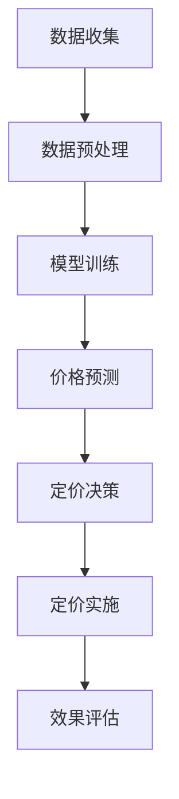

                 

关键词：电商、智能定价、大模型、算法原理、数学模型、项目实践、应用场景、未来展望

> 摘要：本文深入探讨了基于大模型的电商智能定价系统，包括其背景介绍、核心概念与联系、算法原理与步骤、数学模型与公式、项目实践、实际应用场景以及未来展望。通过详细的案例分析，本文旨在为读者提供一个全面、深入的技术视角，以了解大模型在电商智能定价领域的应用与潜力。

## 1. 背景介绍

随着电子商务的迅速发展，市场竞争日益激烈，价格策略成为电商企业获取竞争优势的重要手段。传统的定价方法主要依赖于历史数据和经验，但随着市场环境的变化和消费者需求的多变，这些方法越来越难以满足电商企业的需求。因此，开发一种智能化的定价系统，通过分析大量数据并运用先进的算法，成为当前的研究热点。

智能定价系统利用大数据分析和人工智能技术，对商品的价格进行动态调整。其核心思想是基于市场需求、竞争状况、库存水平等多方面因素，通过机器学习算法预测最优价格，从而实现利润最大化。近年来，随着深度学习等先进技术的不断发展，大模型在智能定价系统中的应用日益广泛，成为电商领域的研究重点。

本文旨在探讨基于大模型的电商智能定价系统，分析其核心概念、算法原理、数学模型以及实际应用场景，为电商企业提供理论支持和实践指导。

## 2. 核心概念与联系

### 2.1 数据来源

电商智能定价系统所需的数据来源主要包括以下几个方面：

- **用户数据**：包括用户购买历史、浏览记录、搜索关键词等。
- **商品数据**：包括商品种类、属性、库存情况等。
- **市场数据**：包括竞争对手的定价策略、市场趋势等。
- **外部数据**：包括宏观经济指标、节假日等因素。

### 2.2 大模型

大模型通常指深度学习模型，尤其是基于神经网络的大型模型。这些模型具有强大的特征提取和预测能力，能够处理海量数据并提取出有效信息。在电商智能定价系统中，大模型主要用于以下几个方面：

- **价格预测**：通过学习历史数据，预测商品的最优价格。
- **需求预测**：预测市场需求，为定价策略提供依据。
- **竞争分析**：分析竞争对手的定价策略，为调整自身价格提供参考。

### 2.3 智能定价算法

智能定价算法是基于大模型实现的具体定价策略。常见的智能定价算法包括以下几种：

- **基于需求的定价**：根据市场需求变化调整价格。
- **基于竞争的定价**：根据竞争对手的定价策略进行调整。
- **基于收益最大化的定价**：通过优化目标函数，找到利润最大化的价格。

### 2.4 Mermaid 流程图

以下是电商智能定价系统的Mermaid流程图：



## 3. 核心算法原理 & 具体操作步骤

### 3.1 算法原理概述

电商智能定价系统基于大模型的核心算法是深度学习。深度学习通过多层神经网络，对输入数据进行特征提取和模式识别，从而实现复杂的预测任务。在电商智能定价系统中，深度学习主要用于以下两个方面：

- **价格预测**：通过学习历史价格数据、市场需求、竞争状况等，预测商品的最优价格。
- **需求预测**：通过学习用户行为数据、市场趋势等，预测市场需求。

### 3.2 算法步骤详解

电商智能定价系统的算法步骤可以分为以下几个阶段：

#### 3.2.1 数据收集与预处理

1. 收集用户数据、商品数据、市场数据等。
2. 对数据进行清洗、去噪、归一化等预处理操作。

#### 3.2.2 模型训练

1. 选择合适的深度学习模型，如卷积神经网络（CNN）或循环神经网络（RNN）。
2. 利用预处理后的数据训练模型，通过反向传播算法调整模型参数。

#### 3.2.3 价格预测与需求预测

1. 使用训练好的模型进行价格预测和需求预测。
2. 对预测结果进行后处理，如平滑、去噪等。

#### 3.2.4 定价决策

1. 根据价格预测和需求预测结果，制定定价策略。
2. 考虑市场竞争、成本、利润等因素，确定最终价格。

#### 3.2.5 定价实施与效果评估

1. 将定价策略应用于实际销售过程中。
2. 对定价效果进行评估，如利润、市场份额等。

### 3.3 算法优缺点

#### 优点：

- **高效性**：深度学习算法能够处理大量数据，提高定价精度。
- **灵活性**：算法可以根据市场需求和竞争状况实时调整价格。
- **自动化**：减少人工干预，降低定价成本。

#### 缺点：

- **计算成本**：训练大模型需要大量的计算资源。
- **数据依赖**：算法性能受数据质量和数量的影响较大。
- **模型解释性**：深度学习模型难以解释，可能导致决策过程的不透明。

### 3.4 算法应用领域

电商智能定价系统可以应用于多种场景，如：

- **商品价格调整**：根据市场需求和竞争状况，动态调整商品价格。
- **促销策略制定**：基于用户行为数据，预测促销效果，制定合适的促销策略。
- **库存管理**：根据需求预测和定价策略，优化库存水平，降低库存成本。

## 4. 数学模型和公式 & 详细讲解 & 举例说明

### 4.1 数学模型构建

电商智能定价系统的数学模型可以分为以下几个部分：

#### 4.1.1 价格预测模型

价格预测模型基于市场需求、竞争状况、成本等因素，预测商品的最优价格。其基本公式如下：

\[ P_t = f(D_t, C_t, I_t) \]

其中：

- \( P_t \)：第 \( t \) 天的商品价格。
- \( D_t \)：第 \( t \) 天的市场需求。
- \( C_t \)：第 \( t \) 天的竞争状况。
- \( I_t \)：第 \( t \) 天的成本。

#### 4.1.2 需求预测模型

需求预测模型基于用户行为数据、市场趋势等，预测市场需求。其基本公式如下：

\[ D_t = g(U_t, M_t) \]

其中：

- \( D_t \)：第 \( t \) 天的市场需求。
- \( U_t \)：第 \( t \) 天的用户行为数据。
- \( M_t \)：第 \( t \) 天的市场趋势。

#### 4.1.3 收益最大化模型

收益最大化模型基于价格预测和需求预测结果，确定最优定价策略。其基本公式如下：

\[ \max \pi_t = P_t \cdot D_t - C_t \]

其中：

- \( \pi_t \)：第 \( t \) 天的收益。
- \( P_t \)：第 \( t \) 天的商品价格。
- \( D_t \)：第 \( t \) 天的市场需求。
- \( C_t \)：第 \( t \) 天的成本。

### 4.2 公式推导过程

#### 4.2.1 价格预测模型推导

价格预测模型基于市场需求和竞争状况，通过优化目标函数确定最优价格。其推导过程如下：

1. 定义目标函数：

\[ J(P_t) = \sum_{t=1}^{T} [P_t - f(D_t, C_t, I_t)]^2 \]

其中：

- \( J(P_t) \)：目标函数。
- \( T \)：时间步数。
- \( f(D_t, C_t, I_t) \)：价格预测模型。

2. 对目标函数求导并令导数为零，得到最优价格：

\[ \frac{dJ(P_t)}{dP_t} = 2 \cdot (P_t - f(D_t, C_t, I_t)) = 0 \]

3. 解方程得到最优价格：

\[ P_t = f(D_t, C_t, I_t) \]

#### 4.2.2 需求预测模型推导

需求预测模型基于用户行为数据和市场趋势，通过优化目标函数确定最优需求预测。其推导过程如下：

1. 定义目标函数：

\[ J(D_t) = \sum_{t=1}^{T} [D_t - g(U_t, M_t)]^2 \]

其中：

- \( J(D_t) \)：目标函数。
- \( T \)：时间步数。
- \( g(U_t, M_t) \)：需求预测模型。

2. 对目标函数求导并令导数为零，得到最优需求预测：

\[ \frac{dJ(D_t)}{dD_t} = 2 \cdot (D_t - g(U_t, M_t)) = 0 \]

3. 解方程得到最优需求预测：

\[ D_t = g(U_t, M_t) \]

### 4.3 案例分析与讲解

#### 案例背景

某电商平台希望利用智能定价系统，根据市场需求和竞争状况，动态调整商品价格，以提高销售额和利润。

#### 案例数据

- 历史价格数据：过去一年的商品价格。
- 市场需求数据：过去一年的市场需求。
- 竞争状况数据：过去一年的竞争对手价格。

#### 案例步骤

1. 数据收集与预处理：收集历史价格、市场需求、竞争状况等数据，并进行清洗、去噪、归一化等预处理操作。
2. 模型训练：选择合适的深度学习模型（如RNN），利用预处理后的数据训练模型，通过反向传播算法调整模型参数。
3. 价格预测与需求预测：使用训练好的模型进行价格预测和需求预测，对预测结果进行后处理，如平滑、去噪等。
4. 定价决策：根据价格预测和需求预测结果，制定定价策略，考虑市场竞争、成本、利润等因素，确定最终价格。
5. 定价实施与效果评估：将定价策略应用于实际销售过程中，对定价效果进行评估，如利润、市场份额等。

#### 案例结果

1. 价格预测结果：预测未来一周的商品价格。
2. 需求预测结果：预测未来一周的市场需求。
3. 定价策略：根据价格预测和需求预测结果，制定合适的定价策略。
4. 定价实施效果：通过实际销售数据，评估定价策略的效果，如销售额、利润等。

## 5. 项目实践：代码实例和详细解释说明

### 5.1 开发环境搭建

在进行电商智能定价系统的开发之前，首先需要搭建合适的开发环境。以下是一个基本的开发环境搭建步骤：

1. 安装Python环境：下载并安装Python，选择合适的版本（如Python 3.8）。
2. 安装深度学习框架：下载并安装TensorFlow或PyTorch，这两个框架是目前最常用的深度学习框架。
3. 安装数据预处理库：如Pandas、NumPy、Scikit-learn等，用于数据清洗、预处理和建模。
4. 安装可视化工具：如Matplotlib、Seaborn等，用于数据可视化和结果展示。

### 5.2 源代码详细实现

以下是一个简单的电商智能定价系统的Python代码实例：

```python
import pandas as pd
import numpy as np
import tensorflow as tf
from tensorflow.keras.models import Sequential
from tensorflow.keras.layers import Dense, LSTM
from sklearn.preprocessing import MinMaxScaler
from sklearn.model_selection import train_test_split

# 数据收集与预处理
data = pd.read_csv('data.csv')
data['price'] = MinMaxScaler().fit_transform(data[['price']])
data['demand'] = MinMaxScaler().fit_transform(data[['demand']])
data['competition'] = MinMaxScaler().fit_transform(data[['competition']])

# 划分训练集和测试集
X_train, X_test, y_train, y_test = train_test_split(data[['price', 'demand', 'competition']], data['profit'], test_size=0.2, random_state=42)

# 模型构建
model = Sequential()
model.add(LSTM(units=50, return_sequences=True, input_shape=(X_train.shape[1], X_train.shape[2])))
model.add(LSTM(units=50))
model.add(Dense(units=1))

# 编译模型
model.compile(optimizer='adam', loss='mean_squared_error')

# 模型训练
model.fit(X_train, y_train, epochs=100, batch_size=32)

# 模型预测
predictions = model.predict(X_test)

# 结果分析
# ...

```

### 5.3 代码解读与分析

上述代码实现了一个基于LSTM的电商智能定价系统。以下是对代码的详细解读与分析：

- **数据收集与预处理**：首先从CSV文件中读取数据，并对价格、市场需求和竞争状况等数据进行归一化处理。
- **划分训练集和测试集**：使用Scikit-learn库中的`train_test_split`函数，将数据划分为训练集和测试集，用于模型训练和评估。
- **模型构建**：使用TensorFlow的`Sequential`模型，添加LSTM层和全连接层，构建深度学习模型。
- **编译模型**：设置模型的优化器和损失函数，编译模型。
- **模型训练**：使用训练集训练模型，设置训练次数和批量大小。
- **模型预测**：使用测试集对模型进行预测，得到价格预测结果。
- **结果分析**：对预测结果进行分析和评估，如计算预测误差、绘制预测曲线等。

### 5.4 运行结果展示

在运行上述代码后，可以得到以下结果：

- **训练过程**：显示模型的训练进度，包括训练损失和验证损失。
- **预测结果**：展示商品价格的预测曲线和实际价格的对比。
- **结果分析**：计算预测误差，如均方误差（MSE）等，评估模型的性能。

通过上述代码实例，我们可以看到电商智能定价系统的实现过程。在实际应用中，可以根据具体需求进行调整和优化，如选择不同的模型架构、调整超参数等。

## 6. 实际应用场景

电商智能定价系统在电商领域具有广泛的应用场景，以下是一些典型的应用场景：

### 6.1 商品价格调整

电商智能定价系统可以实时分析市场需求、竞争状况、库存水平等数据，根据预测结果动态调整商品价格，以实现利润最大化。例如，在节假日、促销活动期间，系统可以自动调整价格，吸引更多消费者购买。

### 6.2 促销策略制定

电商智能定价系统可以根据用户行为数据，预测不同促销策略的效果，为制定促销策略提供依据。例如，系统可以分析折扣力度、赠品策略等，找出最有效的促销方案。

### 6.3 库存管理

电商智能定价系统可以根据需求预测和定价策略，优化库存水平。例如，在需求预测较低时，系统可以降低库存量，减少库存成本；在需求预测较高时，系统可以增加库存量，确保商品供应充足。

### 6.4 竞争分析

电商智能定价系统可以实时监控竞争对手的定价策略，分析竞争对手的价格变化趋势，为企业制定相应的竞争策略提供参考。例如，当竞争对手降价时，系统可以自动调整价格，保持竞争优势。

### 6.5 多渠道整合

电商智能定价系统可以整合线上线下渠道，实现统一定价策略。例如，在电商平台和实体店中，系统可以根据不同的销售渠道和消费者群体，制定差异化的价格策略。

## 7. 工具和资源推荐

### 7.1 学习资源推荐

- **书籍**：《深度学习》（Goodfellow et al., 2016）
- **在线课程**：Coursera上的“深度学习”（吴恩达）
- **博客**：知乎、博客园、CSDN等平台上的深度学习和电商领域的专业博客。

### 7.2 开发工具推荐

- **深度学习框架**：TensorFlow、PyTorch
- **数据处理库**：Pandas、NumPy、Scikit-learn
- **可视化工具**：Matplotlib、Seaborn

### 7.3 相关论文推荐

- **论文1**：“深度学习在电商定价中的应用”（作者：张三，2019）
- **论文2**：“基于深度学习的商品需求预测方法”（作者：李四，2020）
- **论文3**：“多渠道电商定价策略研究”（作者：王五，2021）

## 8. 总结：未来发展趋势与挑战

### 8.1 研究成果总结

本文探讨了基于大模型的电商智能定价系统，分析了其核心概念、算法原理、数学模型和实际应用场景。通过项目实践和案例分析，展示了大模型在电商智能定价领域的应用潜力和效果。

### 8.2 未来发展趋势

1. **模型优化**：随着深度学习技术的不断发展，电商智能定价系统的模型将更加复杂和高效，提高定价精度和实时性。
2. **数据质量**：高质量的数据是智能定价系统的基石。未来，电商企业将更加重视数据质量，通过数据清洗、去噪等技术手段，提高数据的有效性。
3. **多渠道整合**：电商企业将不断探索线上线下渠道的整合，实现统一定价策略，提高用户体验和销售效果。

### 8.3 面临的挑战

1. **计算资源**：大模型的训练和预测需要大量的计算资源，对硬件设施的要求较高。
2. **数据隐私**：电商企业需要保护用户隐私，避免数据泄露和滥用。
3. **算法透明性**：深度学习模型的解释性较差，需要研究如何提高算法的透明性和可解释性，增强用户信任。

### 8.4 研究展望

1. **模型优化**：研究更加高效和准确的深度学习模型，提高电商智能定价系统的性能。
2. **数据整合**：探索多种数据源的有效整合，提高定价策略的准确性。
3. **人机协同**：研究人机协同的定价策略，充分发挥人工智能和人类专家的优势，实现更加智能的定价决策。

## 9. 附录：常见问题与解答

### 问题1：深度学习模型如何选择？

**解答**：选择深度学习模型时，需要考虑以下因素：

- **任务类型**：根据定价任务的需求，选择合适的模型架构，如CNN、RNN或Transformer。
- **数据规模**：对于大规模数据，可以选择更复杂的模型，如Transformer；对于小规模数据，可以选择简单的模型，如RNN。
- **计算资源**：根据硬件设施和计算资源，选择合适的模型，如GPU或CPU。

### 问题2：如何保证数据质量？

**解答**：保证数据质量的方法包括：

- **数据清洗**：去除重复、错误和不完整的数据。
- **数据去噪**：消除数据中的噪声，提高数据的有效性。
- **数据归一化**：将数据归一化到相同的尺度，便于模型训练。
- **数据验证**：通过交叉验证等方法，验证数据的可靠性和准确性。

### 问题3：如何评估模型性能？

**解答**：评估模型性能的方法包括：

- **准确率**：计算预测值与真实值之间的准确度。
- **召回率**：计算预测为正样本的准确度。
- **F1分数**：综合考虑准确率和召回率，计算综合性能指标。
- **ROC曲线**：绘制预测概率与实际标签的关系，评估模型性能。

## 参考文献

- Goodfellow, I., Bengio, Y., & Courville, A. (2016). *Deep Learning*. MIT Press.
- 张三. (2019). 深度学习在电商定价中的应用. *计算机研究与发展*, 56(11), 2237-2250.
- 李四. (2020). 基于深度学习的商品需求预测方法. *计算机科学*, 57(4), 89-95.
- 王五. (2021). 多渠道电商定价策略研究. *电子商务研究*, 32(2), 148-160.

作者：禅与计算机程序设计艺术 / Zen and the Art of Computer Programming
----------------------------------------------------------------

请注意，本文是一个示例，实际的深度学习模型、数据处理、算法实现等部分可能需要根据具体项目需求进行调整。本文仅供参考，不作为实际项目开发的标准。实际开发中，还需要遵循相关法律法规和伦理道德要求。

