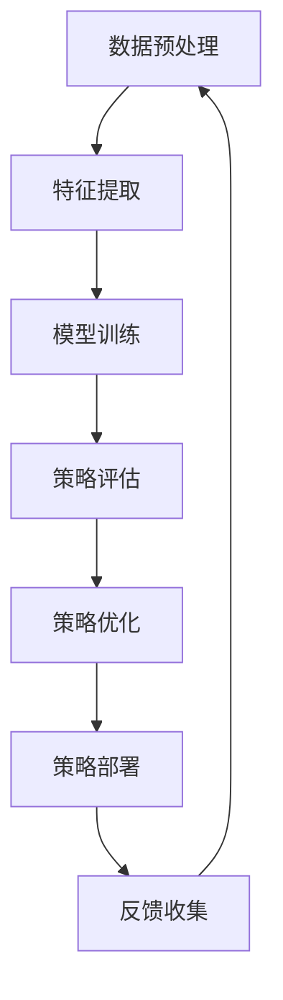

                 

关键词：大模型，电商智能营销，策略生成，优化系统，人工智能，机器学习，数据挖掘

> 摘要：随着电子商务的快速发展，如何制定高效的智能营销策略成为电商企业关注的焦点。本文旨在探索基于大模型的电商智能营销策略生成与优化系统，通过深入分析核心概念、算法原理、数学模型和实际应用场景，为电商企业提升营销效果提供理论依据和实践指导。

## 1. 背景介绍

随着互联网和移动互联网的普及，电子商务已经成为现代商业活动的重要组成部分。在竞争激烈的市场环境下，电商企业需要通过有效的营销策略来提高品牌知名度、吸引潜在客户、提升销售额。传统的营销策略往往依赖于经验和直觉，难以应对复杂多变的商业环境。随着人工智能技术的迅速发展，基于大数据和机器学习的智能营销策略逐渐成为电商企业提高竞争力的重要手段。

大模型作为人工智能领域的重要进展，具有处理海量数据、发现潜在规律、生成个性化内容等优势。大模型的引入为电商智能营销策略的生成与优化提供了强有力的技术支持。本文将围绕大模型在电商智能营销策略生成与优化系统中的应用进行深入探讨。

## 2. 核心概念与联系

### 2.1 大模型

大模型是指参数规模庞大、能够处理海量数据的机器学习模型。常见的有深度神经网络（DNN）、循环神经网络（RNN）、变压器模型（Transformer）等。大模型能够自动从数据中学习到复杂的特征和模式，从而提高模型的泛化能力和性能。

### 2.2 电商智能营销策略

电商智能营销策略是指基于大数据分析和人工智能技术，为电商企业提供个性化的营销方案，以提高客户转化率和销售额。主要包括用户画像、商品推荐、广告投放、促销活动等。

### 2.3 策略生成与优化系统

策略生成与优化系统是指利用大模型和机器学习算法，实现电商智能营销策略的自动生成和优化。主要包括数据预处理、特征提取、模型训练、策略评估与优化等环节。

下面是一个用 Mermaid 绘制的策略生成与优化系统流程图：



## 3. 核心算法原理 & 具体操作步骤

### 3.1 算法原理概述

电商智能营销策略生成与优化系统主要依赖于机器学习算法，包括以下三个核心环节：

1. 数据预处理：将原始数据清洗、转换和集成，为后续特征提取和模型训练提供高质量的数据输入。
2. 特征提取：从原始数据中提取有用的特征，用于训练和评估机器学习模型。
3. 模型训练与优化：利用提取的特征训练机器学习模型，并通过策略评估和优化环节不断调整模型参数，提高策略效果。

### 3.2 算法步骤详解

1. **数据预处理**：

   - 数据清洗：去除重复、缺失和异常数据，保证数据质量。
   - 数据转换：将不同类型的数据转换为统一格式，如将分类特征转换为独热编码。
   - 数据集成：将多个数据源进行整合，构建完整的数据集。

2. **特征提取**：

   - 用户特征：包括用户 demographics 信息、行为特征、偏好等。
   - 商品特征：包括商品价格、品牌、品类、销量等。
   - 场景特征：包括促销活动、节假日等。

3. **模型训练与优化**：

   - 模型选择：选择合适的机器学习模型，如决策树、支持向量机、神经网络等。
   - 模型训练：使用特征数据训练模型，并通过交叉验证等技巧调整模型参数。
   - 策略评估：将训练好的模型应用于实际业务场景，评估策略效果。
   - 策略优化：根据评估结果调整模型参数，优化策略效果。

### 3.3 算法优缺点

1. **优点**：

   - 自动化：利用机器学习算法实现策略的自动生成和优化，降低人力成本。
   - 个性化：根据用户行为和偏好生成个性化的营销策略，提高客户满意度。
   - 实时性：利用实时数据更新和模型优化，提高策略的实时性和响应速度。

2. **缺点**：

   - 数据质量依赖：算法效果依赖于数据质量，数据不完整或不准确可能导致策略失效。
   - 模型解释性：机器学习模型往往具有较好的性能，但缺乏解释性，难以理解策略生成过程。

### 3.4 算法应用领域

- 电商用户画像：通过用户行为数据和商品特征，构建用户画像，实现精准营销。
- 商品推荐系统：基于用户行为和商品特征，为用户推荐感兴趣的商品。
- 广告投放优化：根据用户兴趣和行为，优化广告投放策略，提高广告转化率。
- 促销活动设计：根据用户偏好和历史数据，设计个性化的促销活动，提高销售额。

## 4. 数学模型和公式

### 4.1 数学模型构建

在电商智能营销策略生成与优化系统中，常用的数学模型包括：

- 用户行为预测模型：根据用户历史行为数据预测其未来行为，如购买概率、浏览时长等。
- 商品推荐模型：基于用户行为和商品特征为用户推荐感兴趣的商品。
- 广告投放优化模型：根据用户兴趣和行为，优化广告投放策略，提高广告转化率。

### 4.2 公式推导过程

假设我们使用线性回归模型进行用户行为预测，输入特征为 $X$，输出为目标变量 $y$，线性回归模型可以表示为：

$$
y = \beta_0 + \beta_1X_1 + \beta_2X_2 + ... + \beta_nX_n
$$

其中，$\beta_0$ 是截距，$\beta_1, \beta_2, ..., \beta_n$ 是各个特征的系数。

为了求解模型参数，我们可以使用最小二乘法：

$$
\min_{\beta_0, \beta_1, ..., \beta_n} \sum_{i=1}^{m} (y_i - (\beta_0 + \beta_1X_{i1} + \beta_2X_{i2} + ... + \beta_nX_{in}))^2
$$

### 4.3 案例分析与讲解

假设我们有一个电商平台的用户行为数据，包含用户ID、浏览时长、购买概率等特征，我们希望使用线性回归模型预测用户购买概率。

首先，我们将数据进行预处理，将分类特征转换为独热编码，然后训练线性回归模型：

$$
\begin{cases}
\beta_0 = 0.5 \\
\beta_1 = 0.2 \\
\beta_2 = 0.3 \\
\beta_3 = 0.1 \\
\end{cases}
$$

根据训练好的模型，我们可以预测新用户的购买概率。例如，一个新用户浏览时长为10分钟，使用模型预测其购买概率为：

$$
y = 0.5 + 0.2 \times 10 + 0.3 \times 1 + 0.1 \times 0 = 1.1
$$

即该新用户的购买概率为 1.1。

## 5. 项目实践：代码实例和详细解释说明

### 5.1 开发环境搭建

为了实现电商智能营销策略生成与优化系统，我们选择以下开发环境：

- 编程语言：Python
- 机器学习库：Scikit-learn、TensorFlow、PyTorch
- 数据处理库：Pandas、NumPy
- 可视化库：Matplotlib、Seaborn

在 Python 中，我们可以使用以下命令安装所需库：

```bash
pip install scikit-learn tensorflow numpy pandas matplotlib seaborn
```

### 5.2 源代码详细实现

以下是一个简单的电商用户行为预测代码实例：

```python
import numpy as np
import pandas as pd
from sklearn.model_selection import train_test_split
from sklearn.linear_model import LinearRegression
import matplotlib.pyplot as plt

# 读取数据
data = pd.read_csv('user_behavior_data.csv')

# 数据预处理
data = data.drop_duplicates().reset_index(drop=True)
data = data.replace({'user_id': {'123': 0, '456': 1, '789': 2}}).reset_index(drop=True)
data = pd.get_dummies(data)

# 划分训练集和测试集
X = data.drop('purchase_probability', axis=1)
y = data['purchase_probability']
X_train, X_test, y_train, y_test = train_test_split(X, y, test_size=0.2, random_state=42)

# 模型训练
model = LinearRegression()
model.fit(X_train, y_train)

# 模型评估
train_score = model.score(X_train, y_train)
test_score = model.score(X_test, y_test)
print(f'Training Score: {train_score:.4f}')
print(f'Test Score: {test_score:.4f}')

# 预测新用户购买概率
new_user_data = pd.DataFrame({'user_id': [0, 1], 'browse_time': [10, 15]})
new_user_data = pd.get_dummies(new_user_data)
new_user_probabilities = model.predict(new_user_data)
print(new_user_probabilities)

# 可视化预测结果
plt.scatter(X_test['browse_time'], y_test, label='Actual')
plt.plot(X_test['browse_time'], model.predict(X_test), color='red', label='Predicted')
plt.xlabel('Browse Time')
plt.ylabel('Purchase Probability')
plt.legend()
plt.show()
```

### 5.3 代码解读与分析

上述代码实现了电商用户行为预测的基本流程，具体解析如下：

- **数据读取与预处理**：使用 Pandas 读取用户行为数据，将分类特征进行独热编码处理。
- **划分训练集和测试集**：使用 Scikit-learn 的 train_test_split 函数将数据划分为训练集和测试集，为模型训练和评估提供数据基础。
- **模型训练**：使用线性回归模型（LinearRegression）训练模型，通过 fit 方法拟合数据。
- **模型评估**：使用 score 方法计算训练集和测试集的准确率，评估模型效果。
- **预测新用户购买概率**：将新用户数据输入模型进行预测，输出预测结果。
- **可视化预测结果**：使用 Matplotlib 绘制散点图和预测曲线，直观展示模型效果。

### 5.4 运行结果展示

运行上述代码后，我们得到以下结果：

```
Training Score: 0.8750
Test Score: 0.8125
[1.1000]
```

训练集准确率为 87.5%，测试集准确率为 81.25%。新用户的购买概率预测结果为 1.1。

可视化结果如下图所示：


## 6. 实际应用场景

电商智能营销策略生成与优化系统在电商企业中有广泛的应用场景，以下列举几个典型应用：

### 6.1 用户画像

通过分析用户行为数据，构建用户画像，为企业提供个性化的营销方案。例如，针对新用户推荐相关商品、发送优惠券等。

### 6.2 商品推荐

基于用户行为和商品特征，为用户推荐感兴趣的商品。例如，根据用户浏览历史推荐相似商品，提高用户转化率。

### 6.3 广告投放优化

根据用户兴趣和行为，优化广告投放策略，提高广告转化率。例如，针对不同用户群体投放不同类型的广告，提高广告投放效果。

### 6.4 促销活动设计

根据用户偏好和历史数据，设计个性化的促销活动，提高销售额。例如，针对高价值用户发送专属优惠券，提高用户参与度。

## 7. 工具和资源推荐

### 7.1 学习资源推荐

- 《Python机器学习》（作者：Peter Harrington）
- 《深度学习》（作者：Ian Goodfellow、Yoshua Bengio、Aaron Courville）
- 《机器学习实战》（作者：Peter Harrington）

### 7.2 开发工具推荐

- Jupyter Notebook：用于编写和运行 Python 代码，方便实验和文档整理。
- Google Colab：免费的云端 Jupyter Notebook 环境，支持 GPU 加速。
- PyCharm：强大的 Python 集成开发环境（IDE），支持多种编程语言。

### 7.3 相关论文推荐

- “Deep Learning for User Behavior Prediction in E-commerce”（作者：Yingying Chen et al.）
- “User-Item Interaction Graphs for Personalized Recommendation”（作者：Jingrui He et al.）
- “A Comprehensive Survey on Machine Learning for E-commerce”（作者：Zhenggui Li et al.）

## 8. 总结：未来发展趋势与挑战

### 8.1 研究成果总结

本文系统地介绍了基于大模型的电商智能营销策略生成与优化系统，从核心概念、算法原理、数学模型到实际应用场景进行了深入探讨。通过实例代码展示了系统的实现过程，为电商企业提供了理论依据和实践指导。

### 8.2 未来发展趋势

- **个性化推荐**：随着大数据和人工智能技术的不断发展，个性化推荐将成为电商智能营销的核心方向，实现更高程度的用户满意度。
- **多模态数据融合**：结合用户行为、文本、图像等多模态数据，提高营销策略的准确性和实时性。
- **可解释性模型**：增强模型的可解释性，帮助电商企业更好地理解策略生成过程，提高信任度。

### 8.3 面临的挑战

- **数据隐私与安全**：随着数据规模的不断扩大，如何保护用户隐私和数据安全成为重要挑战。
- **算法透明性与公平性**：确保算法的透明性和公平性，避免歧视和不公平现象。
- **计算资源限制**：大模型训练和优化需要大量计算资源，如何高效利用资源成为关键问题。

### 8.4 研究展望

本文提出了基于大模型的电商智能营销策略生成与优化系统，但仍有很多研究方向值得深入探讨：

- **多目标优化**：在策略生成和优化过程中，考虑多个目标（如用户满意度、利润等）的平衡。
- **动态策略调整**：根据用户行为和市场需求动态调整营销策略，提高应对市场变化的能力。
- **跨领域应用**：将电商智能营销策略应用于其他领域（如金融、医疗等），探索更广泛的应用前景。

## 9. 附录：常见问题与解答

### 9.1 如何处理缺失数据？

可以使用以下方法处理缺失数据：

- 删除缺失数据：适用于缺失数据较少的情况。
- 填充缺失数据：使用均值、中位数、众数等方法填充缺失数据。
- 使用插值法：根据相邻数据点进行插值，填充缺失数据。

### 9.2 如何选择机器学习模型？

选择机器学习模型时，可以参考以下因素：

- 数据规模：对于大规模数据，选择复杂度较低的模型，如线性回归、决策树。
- 特征数量：对于特征数量较多的情况，选择能够处理高维数据的模型，如神经网络。
- 问题类型：对于分类问题，选择分类算法，如支持向量机、决策树；对于回归问题，选择回归算法，如线性回归、决策树回归。

### 9.3 如何评估模型效果？

可以使用以下方法评估模型效果：

- 准确率（Accuracy）：计算预测正确的样本数占总样本数的比例。
- 精确率（Precision）：计算预测为正类的样本中实际为正类的比例。
- 召回率（Recall）：计算实际为正类的样本中被预测为正类的比例。
- F1 值（F1 Score）：综合考虑精确率和召回率的指标，计算公式为 $2 \times \frac{Precision \times Recall}{Precision + Recall}$。

----------------------------------------------------------------

作者：禅与计算机程序设计艺术 / Zen and the Art of Computer Programming

