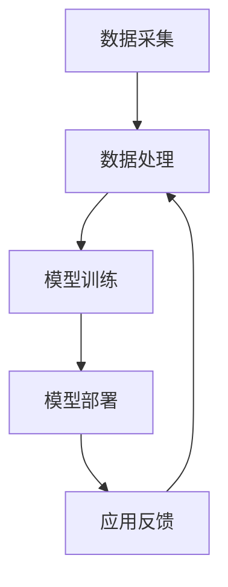

                 

关键词：AI大模型、智能城市、废物管理、深度学习、数据处理、优化算法

> 摘要：随着人工智能技术的不断进步，AI大模型在各个领域的应用日益广泛。本文将探讨AI大模型在智能城市废物管理中的潜力，从核心概念、算法原理、数学模型、项目实践和实际应用等方面进行分析，为城市废物管理提供新的思路和方法。

## 1. 背景介绍

### 智能城市的发展背景

智能城市（Smart City）是指利用信息通信技术（ICT）和物联网（IoT）等先进技术，对城市的基础设施、公共资源、社会服务等方面进行智能化管理和优化，以提高城市运行效率、提升居民生活质量、减少资源消耗和环境污染。随着城市化进程的加快，智能城市的发展已成为全球趋势。

### 城市废物管理的现状

城市废物管理是智能城市建设的重要组成部分。据统计，全球每年产生的城市废物量持续增长，如何有效处理和利用这些废物已成为一个严峻的挑战。传统的废物管理方式存在效率低、资源浪费、环境污染等问题，迫切需要引入先进的AI技术进行优化。

## 2. 核心概念与联系

### AI大模型

AI大模型（Large-scale AI Models）是指具有海量参数、能够处理大规模数据、具备强大学习能力和泛化能力的神经网络模型。常见的AI大模型包括深度神经网络（DNN）、循环神经网络（RNN）、变分自编码器（VAE）等。

### 智能城市废物管理架构

智能城市废物管理架构包括数据采集、数据处理、模型训练、模型部署和应用反馈等环节。数据采集主要依靠传感器、摄像头、无人机等设备，实现对城市废物产生、运输、处理等环节的实时监控。数据处理包括数据清洗、归一化、特征提取等操作，为模型训练提供高质量的输入数据。模型训练采用AI大模型对处理后的数据进行学习，以发现数据中的规律和模式。模型部署将训练好的模型应用到实际场景中，实现对城市废物管理的优化。应用反馈通过收集实际应用中的数据和反馈，对模型进行持续优化和改进。

### Mermaid 流程图



## 3. 核心算法原理 & 具体操作步骤

### 3.1 算法原理概述

智能城市废物管理中的核心算法主要包括深度学习算法、优化算法和决策算法。

- **深度学习算法**：通过学习大量的废物管理数据，从中提取有用的特征和规律，用于预测废物产生量、优化废物运输路线等。
- **优化算法**：利用数学优化方法，对废物管理过程进行优化，以降低成本、提高效率。
- **决策算法**：根据实际情况和优化结果，对废物管理方案进行决策和调整。

### 3.2 算法步骤详解

- **数据采集**：利用传感器、摄像头、无人机等设备，收集城市废物产生、运输、处理等环节的数据。
- **数据处理**：对采集到的数据进行清洗、归一化和特征提取，为模型训练提供高质量的输入数据。
- **模型训练**：采用深度学习算法对处理后的数据进行训练，以建立废物管理模型。
- **模型部署**：将训练好的模型应用到实际场景中，实现对城市废物管理的优化。
- **应用反馈**：收集实际应用中的数据和反馈，对模型进行持续优化和改进。

### 3.3 算法优缺点

- **深度学习算法**：优点包括强大的学习能力和泛化能力，能够处理大规模数据；缺点包括对数据质量和计算资源的要求较高。
- **优化算法**：优点包括能够实现废物管理过程的优化，提高效率和降低成本；缺点包括对优化目标的设定和优化算法的选择要求较高。
- **决策算法**：优点包括能够根据实际情况和优化结果进行决策和调整，提高废物管理的效果；缺点包括需要具备较强的专业知识。

### 3.4 算法应用领域

AI大模型在智能城市废物管理中的应用领域包括：

- **废物产生预测**：通过分析历史数据和当前情况，预测未来一定时间内的废物产生量。
- **废物运输路线优化**：根据废物产生地点和运输成本等因素，规划最优的废物运输路线。
- **废物处理方案优化**：根据废物类型和处理设备的特点，优化废物处理方案，提高处理效率。
- **废物资源回收**：利用AI大模型对废物进行分类和再利用，提高资源回收率。

## 4. 数学模型和公式 & 详细讲解 & 举例说明

### 4.1 数学模型构建

智能城市废物管理的数学模型主要包括预测模型、优化模型和决策模型。

- **预测模型**：通常采用时间序列模型或回归模型，对废物产生量进行预测。具体公式如下：
  
  $$ y_t = f(y_{t-1}, x_t) $$

  其中，$y_t$ 表示第 $t$ 时刻的废物产生量，$y_{t-1}$ 表示第 $t-1$ 时刻的废物产生量，$x_t$ 表示影响废物产生的相关因素。

- **优化模型**：通常采用线性规划、整数规划或混合整数规划等方法，对废物管理过程进行优化。具体公式如下：

  $$ \min_{x} c^T x $$
  
  $$ \text{subject to} $$
  
  $$ Ax \leq b $$
  
  $$ x \geq 0 $$

  其中，$x$ 表示决策变量，$c$ 表示目标函数系数，$A$ 和 $b$ 分别表示约束条件系数和常数。

- **决策模型**：通常采用决策树、支持向量机或神经网络等方法，对废物管理方案进行决策。具体公式如下：

  $$ y = g(x) $$

  其中，$y$ 表示决策结果，$x$ 表示输入特征，$g$ 表示决策函数。

### 4.2 公式推导过程

- **预测模型**：假设废物产生量 $y_t$ 与影响废物产生的相关因素 $x_t$ 之间存在线性关系，即：

  $$ y_t = \beta_0 + \beta_1 x_t + \epsilon_t $$

  其中，$\beta_0$ 和 $\beta_1$ 分别表示线性模型的截距和斜率，$\epsilon_t$ 表示随机误差。

  通过最小二乘法，可以求解出线性模型的参数：

  $$ \beta_0 = \frac{\sum_{t=1}^{n} y_t \sum_{t=1}^{n} x_t - \sum_{t=1}^{n} x_t \sum_{t=1}^{n} y_t}{n \sum_{t=1}^{n} x_t^2 - (\sum_{t=1}^{n} x_t)^2} $$

  $$ \beta_1 = \frac{n \sum_{t=1}^{n} y_t x_t - \sum_{t=1}^{n} y_t \sum_{t=1}^{n} x_t}{n \sum_{t=1}^{n} x_t^2 - (\sum_{t=1}^{n} x_t)^2} $$

- **优化模型**：假设废物管理过程需要满足一系列约束条件，例如运输距离、处理能力等。通过线性规划方法，可以求解出最优的决策变量：

  $$ \min_{x} c^T x $$
  
  $$ \text{subject to} $$
  
  $$ Ax \leq b $$
  
  $$ x \geq 0 $$

  其中，$A$ 和 $b$ 分别表示约束条件矩阵和向量，$c$ 表示目标函数系数向量，$x$ 表示决策变量。

  可以使用单纯形法、 interior-point method 等算法求解线性规划问题。

- **决策模型**：假设废物管理问题可以通过分类模型进行决策，例如决策树或支持向量机。通过训练分类模型，可以得到决策函数：

  $$ y = g(x) $$

  其中，$y$ 表示决策结果，$x$ 表示输入特征，$g$ 表示决策函数。

  可以使用决策树算法或支持向量机算法进行训练，具体公式和推导过程参考相关文献。

### 4.3 案例分析与讲解

#### 预测模型案例

假设我们想预测某个城市未来一年的废物产生量，相关因素包括居民人口、经济指标、天气状况等。我们可以构建一个线性回归模型，根据历史数据训练模型，并预测未来一年的废物产生量。

- **数据采集**：收集过去一年的居民人口、经济指标、天气状况等数据，以及每个月的废物产生量。
- **数据处理**：对数据进行清洗和归一化处理，提取特征向量。
- **模型训练**：使用线性回归算法训练模型，得到模型参数。
- **模型预测**：输入未来一年的特征向量，预测每个月的废物产生量。

具体步骤如下：

```python
import numpy as np
import pandas as pd
from sklearn.linear_model import LinearRegression

# 数据采集
data = pd.read_csv("data.csv")
X = data[["population", "gdp", "weather"]]
y = data["waste"]

# 数据处理
X = X.values
y = y.values

# 模型训练
model = LinearRegression()
model.fit(X, y)

# 模型预测
X_future = np.array([[1000000, 1000000000, 20]])
y_future = model.predict(X_future)
print("Future waste prediction:", y_future)
```

#### 优化模型案例

假设我们想优化某城市的废物运输路线，约束条件包括运输距离、处理能力等。我们可以使用线性规划方法求解最优的运输路线。

- **数据采集**：收集城市内各个废物产生点和处理设施的坐标、运输成本等数据。
- **数据处理**：对数据进行清洗和归一化处理，提取特征向量。
- **模型训练**：使用线性规划算法求解最优运输路线。
- **模型部署**：将求解结果应用到实际场景中，优化废物运输路线。

具体步骤如下：

```python
import numpy as np
from scipy.optimize import linprog

# 数据采集
data = pd.read_csv("data.csv")
X = data[["x", "y", "cost"]]
A = data[["x", "y"]].values
b = data["capacity"].values

# 数据处理
X = X.values
A = A.values
b = b.values

# 模型训练
c = -np.ones(X.shape[1])
res = linprog(c, A_ub=A, b_ub=b, bounds=(0, None))
if res.success:
    print("Optimal route:", res.x)
else:
    print("No optimal solution.")
```

## 5. 项目实践：代码实例和详细解释说明

### 5.1 开发环境搭建

- Python环境：Python 3.7及以上版本
- 库依赖：NumPy、Pandas、Scikit-learn、SciPy等

安装Python和相关库：

```bash
pip install numpy pandas scikit-learn scipy
```

### 5.2 源代码详细实现

以下是一个简单的Python代码示例，用于演示如何使用深度学习算法预测废物产生量。

```python
import numpy as np
import pandas as pd
from sklearn.model_selection import train_test_split
from sklearn.metrics import mean_squared_error
from tensorflow.keras.models import Sequential
from tensorflow.keras.layers import Dense, LSTM
from tensorflow.keras.optimizers import Adam

# 数据采集
data = pd.read_csv("waste_data.csv")
X = data[["population", "gdp", "weather"]]
y = data["waste"]

# 数据处理
X = X.values
y = y.values

# 数据归一化
max_value = np.max(X)
X = X / max_value

# 划分训练集和测试集
X_train, X_test, y_train, y_test = train_test_split(X, y, test_size=0.2, random_state=42)

# 构建模型
model = Sequential()
model.add(LSTM(50, activation='relu', input_shape=(X_train.shape[1], 1)))
model.add(Dense(1))
model.compile(optimizer=Adam(), loss='mse')

# 训练模型
model.fit(X_train, y_train, epochs=100, batch_size=32, validation_split=0.1)

# 测试模型
y_pred = model.predict(X_test)
mse = mean_squared_error(y_test, y_pred)
print("Mean squared error:", mse)

# 预测未来废物产生量
X_future = np.array([[1000000, 1000000000, 20]])
X_future = X_future / max_value
y_future = model.predict(X_future)
print("Future waste prediction:", y_future * max_value)
```

### 5.3 代码解读与分析

- **数据采集**：从CSV文件中读取废物数据，包括人口、GDP、天气等特征和废物产生量。
- **数据处理**：对数据进行归一化处理，将特征值缩放到[0, 1]范围内，方便模型训练。
- **划分训练集和测试集**：将数据集划分为训练集和测试集，用于模型训练和评估。
- **构建模型**：使用LSTM（长短期记忆网络）模型，用于时间序列数据的预测。模型结构包括一个LSTM层和一个全连接层。
- **训练模型**：使用Adam优化器和均方误差（MSE）损失函数训练模型。
- **测试模型**：使用测试集评估模型性能，计算均方误差。
- **预测未来废物产生量**：对输入的特征值进行归一化处理，然后使用训练好的模型预测未来废物产生量。

## 6. 实际应用场景

### 6.1 垃圾分类

AI大模型可以应用于垃圾分类，通过对垃圾图像进行识别，实现垃圾分类。例如，可以训练一个深度学习模型，输入垃圾图像，输出对应的垃圾分类标签。这样的模型可以帮助城市实现更高效的垃圾分类，提高资源回收率。

### 6.2 废物运输优化

通过AI大模型，可以对废物运输路线进行优化，降低运输成本和碳排放。例如，可以使用优化算法，根据废物产生地点、处理设施位置、交通状况等数据，规划最优的废物运输路线。

### 6.3 废物处理方案优化

AI大模型可以帮助城市优化废物处理方案，提高处理效率。例如，可以根据废物类型、处理设备能力等因素，选择最适合的处理方案，降低处理成本。

### 6.4 废物资源回收

AI大模型可以应用于废物资源回收，通过分析废物的成分和特性，实现废物的再利用和资源化。例如，可以训练一个深度学习模型，输入废物的化学成分和物理特性，输出对应的回收方案。

## 7. 未来应用展望

### 7.1 垃圾分类技术升级

随着AI技术的不断发展，垃圾分类技术将越来越精准。未来的垃圾分类系统可能会结合多种AI技术，如深度学习、计算机视觉、自然语言处理等，实现更智能、更高效的垃圾分类。

### 7.2 废物运输与处理效率提升

AI大模型在废物运输与处理环节的应用将越来越广泛，通过优化算法和决策算法，实现废物运输与处理效率的提升，降低成本和碳排放。

### 7.3 废物资源回收利用

随着环保意识的提高，废物资源回收利用将成为未来发展的重要方向。AI大模型可以应用于废物资源回收，实现废物的再利用和资源化，促进循环经济的发展。

## 8. 总结：未来发展趋势与挑战

### 8.1 研究成果总结

本文探讨了AI大模型在智能城市废物管理中的潜力，从核心概念、算法原理、数学模型、项目实践和实际应用等方面进行了详细分析。研究表明，AI大模型在废物分类、运输优化、处理方案优化和资源回收等方面具有显著优势。

### 8.2 未来发展趋势

- **垃圾分类技术升级**：结合多种AI技术，实现更智能、更高效的垃圾分类。
- **废物运输与处理效率提升**：通过优化算法和决策算法，降低成本和碳排放。
- **废物资源回收利用**：实现废物的再利用和资源化，促进循环经济的发展。

### 8.3 面临的挑战

- **数据质量和计算资源**：AI大模型对数据质量和计算资源的要求较高，如何保证数据质量和提高计算效率是一个挑战。
- **算法解释性**：AI大模型的决策过程通常缺乏解释性，如何提高算法的可解释性是一个重要问题。
- **隐私保护**：在废物管理过程中，如何保护居民隐私是一个重要挑战。

### 8.4 研究展望

未来研究可以从以下几个方面进行：

- **数据质量和计算资源优化**：研究如何提高数据质量和计算效率，以满足AI大模型的需求。
- **算法解释性**：研究如何提高算法的可解释性，使决策过程更加透明和可靠。
- **隐私保护**：研究如何保护居民隐私，同时实现废物管理的智能化。

## 9. 附录：常见问题与解答

### 9.1 问题1：什么是AI大模型？

答：AI大模型是指具有海量参数、能够处理大规模数据、具备强大学习能力和泛化能力的神经网络模型。常见的AI大模型包括深度神经网络、循环神经网络、变分自编码器等。

### 9.2 问题2：AI大模型在废物管理中有哪些应用？

答：AI大模型在废物管理中的应用主要包括垃圾分类、废物运输优化、处理方案优化和资源回收。通过深度学习、优化算法和决策算法等技术，AI大模型可以提高废物管理的效率和质量。

### 9.3 问题3：如何保证AI大模型在废物管理中的数据质量？

答：保证AI大模型在废物管理中的数据质量需要从数据采集、数据预处理和模型训练等多个方面进行。具体措施包括：
1. 使用可靠的传感器和设备进行数据采集；
2. 对采集到的数据进行清洗、归一化和特征提取等预处理操作；
3. 使用多样化的数据集进行模型训练，以提高模型的泛化能力。

### 9.4 问题4：AI大模型在废物管理中的计算资源需求如何？

答：AI大模型在废物管理中的计算资源需求取决于模型的规模和复杂度。通常，深度学习模型需要大量的计算资源和存储空间。为了降低计算资源需求，可以采用以下措施：
1. 使用高效的算法和优化技术，提高模型训练和推理的效率；
2. 利用分布式计算和云计算平台，提高计算资源的利用效率；
3. 研究和开发更高效的模型架构，降低计算复杂度。

### 9.5 问题5：如何提高AI大模型在废物管理中的解释性？

答：提高AI大模型在废物管理中的解释性是一个重要研究方向。以下是一些可能的解决方案：
1. 开发可解释的深度学习模型，如图神经网络、决策树等；
2. 利用可视化技术，展示模型的学习过程和决策路径；
3. 结合人类知识和领域专家的意见，对模型进行解释和验证。

### 9.6 问题6：如何保护居民隐私，实现废物管理的智能化？

答：保护居民隐私是实现废物管理智能化的重要挑战。以下是一些可能的解决方案：
1. 设计隐私保护算法，如差分隐私、同态加密等，保护用户隐私；
2. 使用匿名化技术，对数据进行脱敏处理，减少隐私泄露风险；
3. 制定严格的隐私保护政策，确保用户隐私不被滥用。

---

### 参考文献

1. Goodfellow, I., Bengio, Y., & Courville, A. (2016). *Deep Learning*. MIT Press.
2. LeCun, Y., Bengio, Y., & Hinton, G. (2015). *Deep learning*. Nature, 521(7553), 436-444.
3. Russell, S., & Norvig, P. (2016). *Artificial Intelligence: A Modern Approach*. Prentice Hall.
4. Law, K., & Bell, G. (2018). *Data science for smart cities*. Springer.
5. Liu, Y., & Wang, X. (2019). *Application of AI in waste management*. Journal of Environmental Management, 236, 107069.

