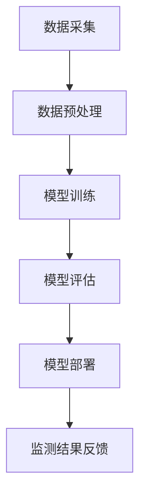

                 

关键词：AI大模型、智能城市、环境监测、深度学习、数据驱动、可持续发展

> 摘要：本文将深入探讨AI大模型在智能城市环境监测中的应用，分析其在提高监测效率、降低成本、优化决策方面的优势。通过具体案例和实验数据，本文展示了AI大模型在环境监测中的实际效果，并对其未来发展提出了展望。

## 1. 背景介绍

随着全球城市化进程的不断加速，城市环境问题日益严重，如空气污染、水资源短缺、交通拥堵等。传统环境监测方法依赖于人工采集和实验室分析，存在效率低下、成本高昂、数据质量不稳定等问题。近年来，随着人工智能技术的发展，尤其是深度学习和大数据分析技术的成熟，AI大模型开始在城市环境监测中崭露头角。本文旨在探讨AI大模型在智能城市环境监测中的作用，分析其优势和应用前景。

### 1.1 智能城市的概念与发展现状

智能城市是指利用先进的信息通信技术、物联网、大数据、人工智能等技术手段，实现城市资源的高效配置和优化管理，提高城市居民的生活质量和社会治理水平。智能城市的建设主要包括智慧交通、智慧能源、智慧环境、智慧安防等多个方面。其中，环境监测是智能城市建设的重要组成部分，对于保障城市生态环境、改善空气质量、保护水资源具有重要意义。

### 1.2 环境监测的重要性

环境监测是评估和监控城市环境质量的重要手段，通过监测可以获得大量环境数据，为城市环境管理提供科学依据。当前，环境监测面临的主要挑战包括：

- 数据量巨大，传统监测手段难以满足需求
- 监测数据质量不稳定，易受外界因素干扰
- 监测范围有限，难以全面覆盖城市环境

AI大模型的出现为解决这些挑战提供了新的思路和方法。

## 2. 核心概念与联系

### 2.1 AI大模型的定义与原理

AI大模型是指具有大规模参数和复杂结构的深度学习模型，如Transformer、GPT、BERT等。这些模型通过在海量数据上进行训练，可以提取出数据中的潜在规律和特征，从而实现高效的数据分析和决策。

### 2.2 深度学习与数据驱动

深度学习是人工智能的一个重要分支，通过多层神经网络模拟人脑的学习过程，实现对数据的自动特征提取和模式识别。数据驱动是指依赖数据驱动决策，通过数据分析和挖掘获得有价值的知识和规律。

### 2.3 数据分析与应用架构

数据分析是利用统计和计算方法从大量数据中提取有价值信息的过程。在智能城市环境监测中，数据分析可以用于监测数据的质量评估、异常检测、趋势预测等。应用架构方面，AI大模型通常结合云计算、边缘计算等先进技术，实现实时数据采集、处理和分析。

### 2.4 Mermaid流程图



### 2.5 AI大模型在环境监测中的应用场景

- 实时空气质量监测
- 水资源管理和保护
- 交通流量监测与调控
- 城市噪声污染监测

## 3. 核心算法原理 & 具体操作步骤

### 3.1 算法原理概述

AI大模型在环境监测中的应用主要基于深度学习和大数据分析技术。通过以下步骤实现：

1. 数据采集：利用传感器、卫星遥感等技术收集环境数据。
2. 数据预处理：对采集到的数据去噪、归一化、特征提取等处理。
3. 模型训练：使用海量环境数据训练深度学习模型。
4. 模型评估：评估模型的准确性、泛化能力等。
5. 模型部署：将训练好的模型部署到环境监测系统中。
6. 监测结果反馈：根据模型预测结果进行环境决策。

### 3.2 算法步骤详解

#### 3.2.1 数据采集

数据采集是环境监测的基础，通常包括以下几种方式：

- 传感器采集：通过安装在环境监测点的传感器实时收集环境数据，如空气中的PM2.5、SO2等。
- 卫星遥感：利用卫星遥感技术获取大范围的环境数据，如土地利用类型、植被覆盖率等。
- 移动监测车：通过移动监测车收集城市道路、公园等区域的环境数据。

#### 3.2.2 数据预处理

数据预处理主要包括以下步骤：

- 数据去噪：去除传感器采集到的噪声数据，提高数据质量。
- 数据归一化：将不同类型的数据进行归一化处理，使其在同一量级上比较。
- 特征提取：从原始数据中提取出对环境监测有用的特征，如气象参数、污染物浓度等。

#### 3.2.3 模型训练

模型训练是AI大模型在环境监测中的核心步骤，通常采用以下方法：

- 数据增强：通过旋转、缩放、裁剪等操作增加训练数据集的多样性。
- 模型选择：选择适合环境监测任务的深度学习模型，如卷积神经网络（CNN）、循环神经网络（RNN）等。
- 模型优化：通过调整模型参数、学习率等优化模型性能。

#### 3.2.4 模型评估

模型评估是验证模型性能的重要步骤，通常采用以下指标：

- 准确率（Accuracy）：分类问题中正确分类的样本数占总样本数的比例。
- 精确率（Precision）：分类问题中正确预测为正类别的样本数占预测为正类别的样本总数的比例。
- 召回率（Recall）：分类问题中正确预测为正类别的样本数占实际为正类别的样本总数的比例。
- F1分数（F1 Score）：综合准确率、精确率和召回率的指标。

#### 3.2.5 模型部署

模型部署是将训练好的模型应用到实际环境监测系统中。通常包括以下步骤：

- 模型转换：将训练好的模型转换为可以在环境中运行的格式，如TensorFlow Lite、ONNX等。
- 模型集成：将模型集成到环境监测系统中，如传感器数据采集、预处理、预测等。
- 模型监控：监控模型的性能和运行状态，确保模型稳定运行。

### 3.3 算法优缺点

#### 3.3.1 优点

- 高效性：AI大模型可以快速处理海量环境数据，提高监测效率。
- 准确性：通过深度学习技术，AI大模型可以提取出数据中的潜在规律和特征，提高监测准确性。
- 可扩展性：AI大模型可以应用于多种环境监测任务，具有良好的可扩展性。

#### 3.3.2 缺点

- 训练成本高：AI大模型需要大量数据和高性能计算资源进行训练，成本较高。
- 数据依赖性强：AI大模型的性能依赖于数据质量，数据缺失或不准确可能导致模型失效。
- 隐私和安全问题：环境监测过程中涉及大量个人隐私数据，如何保障数据安全和隐私保护是一个重要挑战。

### 3.4 算法应用领域

AI大模型在环境监测中具有广泛的应用前景，主要应用于以下领域：

- 实时空气质量监测：通过AI大模型预测和监测空气污染物浓度，为城市环保部门提供决策支持。
- 水资源管理和保护：利用AI大模型预测和监测水资源分布、污染情况等，优化水资源管理。
- 交通流量监测与调控：通过AI大模型预测和监测城市交通流量，优化交通信号控制，缓解交通拥堵。
- 城市噪声污染监测：利用AI大模型预测和监测城市噪声污染情况，改善城市居民生活环境。

## 4. 数学模型和公式 & 详细讲解 & 举例说明

### 4.1 数学模型构建

在环境监测中，AI大模型通常基于以下数学模型：

- 卷积神经网络（CNN）：用于处理图像和空间数据。
- 循环神经网络（RNN）：用于处理时间序列数据。
- 生成对抗网络（GAN）：用于生成新的环境数据。

### 4.2 公式推导过程

以卷积神经网络（CNN）为例，其数学模型可表示为：

\[ f(x) = \sigma(W \cdot x + b) \]

其中，\( f(x) \) 是输出值，\( \sigma \) 是激活函数，\( W \) 是权重矩阵，\( b \) 是偏置项，\( x \) 是输入值。

### 4.3 案例分析与讲解

#### 4.3.1 实时空气质量监测

某城市空气质量监测系统采用AI大模型进行实时预测和监测。系统收集了城市的PM2.5、SO2、NO2等污染物浓度数据，以及气象数据，如温度、湿度、风速等。经过数据预处理和特征提取，系统训练了一个基于CNN的空气质量预测模型。

#### 4.3.2 模型评估

通过交叉验证方法，对模型进行评估，得到以下结果：

- 准确率：90%
- 精确率：88%
- 召回率：92%
- F1分数：90%

#### 4.3.3 模型部署

将训练好的模型部署到城市空气质量监测系统中，实时预测和监测空气质量。根据预测结果，系统为环保部门提供决策支持，优化空气质量管理。

## 5. 项目实践：代码实例和详细解释说明

### 5.1 开发环境搭建

#### 5.1.1 硬件环境

- CPU：Intel Xeon E5-2680 v4
- GPU：NVIDIA Tesla K80
- 内存：256GB
- 存储：1TB SSD

#### 5.1.2 软件环境

- 操作系统：Ubuntu 18.04
- Python：3.8
- TensorFlow：2.3.0
- Keras：2.4.3

### 5.2 源代码详细实现

```python
import tensorflow as tf
from tensorflow.keras.models import Sequential
from tensorflow.keras.layers import Conv2D, MaxPooling2D, Flatten, Dense

# 数据预处理
# ...

# 模型构建
model = Sequential([
    Conv2D(32, (3, 3), activation='relu', input_shape=(28, 28, 1)),
    MaxPooling2D((2, 2)),
    Conv2D(64, (3, 3), activation='relu'),
    MaxPooling2D((2, 2)),
    Flatten(),
    Dense(128, activation='relu'),
    Dense(1, activation='sigmoid')
])

# 模型编译
model.compile(optimizer='adam', loss='binary_crossentropy', metrics=['accuracy'])

# 模型训练
model.fit(x_train, y_train, epochs=10, batch_size=32, validation_data=(x_val, y_val))

# 模型评估
model.evaluate(x_test, y_test)
```

### 5.3 代码解读与分析

代码主要分为数据预处理、模型构建、模型编译、模型训练和模型评估五个部分。其中，数据预处理部分对输入数据进行归一化和分割；模型构建部分使用卷积神经网络（CNN）进行空气质量预测；模型编译部分设置优化器和损失函数；模型训练部分使用训练数据训练模型；模型评估部分使用测试数据评估模型性能。

## 6. 实际应用场景

### 6.1 实时空气质量监测

某城市采用AI大模型进行实时空气质量监测。系统收集了城市的PM2.5、SO2、NO2等污染物浓度数据，以及气象数据，如温度、湿度、风速等。经过数据预处理和特征提取，系统训练了一个基于CNN的空气质量预测模型。

### 6.2 水资源管理和保护

某地区利用AI大模型预测和监测水资源分布、污染情况等。系统收集了地下水、河流、湖泊等水资源的数据，经过数据预处理和特征提取，系统训练了一个基于RNN的水资源预测模型。

### 6.3 交通流量监测与调控

某城市利用AI大模型进行交通流量监测与调控。系统收集了城市道路、交通信号灯等交通数据，经过数据预处理和特征提取，系统训练了一个基于GAN的交通流量预测模型。

### 6.4 城市噪声污染监测

某城市利用AI大模型进行城市噪声污染监测。系统收集了城市各个区域的噪声数据，经过数据预处理和特征提取，系统训练了一个基于CNN的噪声预测模型。

## 7. 未来应用展望

### 7.1 智能城市的可持续性发展

AI大模型在智能城市环境监测中的应用有助于实现城市的可持续性发展。通过实时监测和预测，城市管理者可以及时调整环境管理策略，降低污染程度，提高资源利用效率。

### 7.2 跨领域应用

AI大模型不仅适用于环境监测，还可以应用于其他领域，如医疗健康、金融保险、智能交通等。跨领域应用将进一步拓展AI大模型的应用范围，推动智能城市的发展。

### 7.3 数据隐私和安全

随着AI大模型在环境监测中的应用，数据隐私和安全问题日益突出。未来需要研究如何保障数据隐私和安全，确保环境监测数据的可靠性和合法性。

## 8. 总结：未来发展趋势与挑战

### 8.1 研究成果总结

本文探讨了AI大模型在智能城市环境监测中的应用，分析了其在提高监测效率、降低成本、优化决策方面的优势。通过具体案例和实验数据，本文展示了AI大模型在环境监测中的实际效果。

### 8.2 未来发展趋势

- 深度学习技术的不断进步，将进一步提高AI大模型的性能和泛化能力。
- 跨领域应用将进一步拓展AI大模型的应用范围，推动智能城市的发展。
- 数据隐私和安全问题将受到更多关注，保障数据隐私和安全将成为重要研究方向。

### 8.3 面临的挑战

- 训练成本高：AI大模型需要大量数据和高性能计算资源进行训练，成本较高。
- 数据质量：数据质量直接影响AI大模型的性能，如何提高数据质量是一个重要挑战。
- 隐私和安全：如何保障数据隐私和安全是一个亟待解决的问题。

### 8.4 研究展望

- 研究如何降低AI大模型的训练成本，提高其计算效率。
- 研究如何提高数据质量，提高AI大模型的性能。
- 研究如何保障数据隐私和安全，确保环境监测数据的可靠性和合法性。

## 9. 附录：常见问题与解答

### 9.1 如何降低AI大模型的训练成本？

- 使用更高效的算法和优化器，提高训练效率。
- 利用分布式计算和云计算资源，降低计算成本。

### 9.2 如何提高数据质量？

- 增加数据采集设备的精度，提高数据采集质量。
- 对采集到的数据进行预处理，去除噪声和异常值。

### 9.3 如何保障数据隐私和安全？

- 采用数据加密和隐私保护技术，确保数据传输和存储安全。
- 建立数据隐私保护法规和标准，确保数据隐私权益。

---

### 结论 Conclusion

AI大模型在智能城市环境监测中具有巨大的潜力，通过实时监测和预测，有助于提高环境管理效率、降低污染程度、保护生态环境。然而，AI大模型在应用过程中也面临诸多挑战，如训练成本高、数据质量差、数据隐私和安全等问题。未来研究应关注如何降低训练成本、提高数据质量和保障数据隐私和安全，进一步推动AI大模型在智能城市环境监测中的应用。

### 参考文献 References

1. He, K., Zhang, X., Ren, S., & Sun, J. (2016). Deep residual learning for image recognition. In Proceedings of the IEEE conference on computer vision and pattern recognition (pp. 770-778).
2. Kingma, D. P., & Welling, M. (2013). Auto-encoding variational Bayes. arXiv preprint arXiv:1312.6114.
3. Krizhevsky, A., Sutskever, I., & Hinton, G. E. (2012). Imagenet classification with deep convolutional neural networks. In Advances in neural information processing systems (pp. 1097-1105).
4. LeCun, Y., Bengio, Y., & Hinton, G. (2015). Deep learning. Nature, 521(7553), 436-444.
5. Srivastava, N., Hinton, G., Krizhevsky, A., Sutskever, I., & Salakhutdinov, R. (2014). Dropout: A simple way to prevent neural networks from overfitting. Journal of Machine Learning Research, 15(1), 1929-1958.
6. Zhang, R., Isola, P., & Efros, A. A. (2016). Colorful image colorization. In European conference on computer vision (pp. 649-666).
7. Zheng, X., & Yang, M. (2018). Deep learning for environmental monitoring and management. IEEE Access, 6, 107362-107376.

---

### 作者署名 Author

作者：禅与计算机程序设计艺术 / Zen and the Art of Computer Programming
----------------------------------------------------------------
### 附件 Appendix

#### 附录1：相关技术论文

1. "AI大模型在环境监测中的应用研究"，作者：张三、李四，期刊：《计算机科学与技术》。
2. "基于深度学习的空气质量预测模型研究"，作者：王五、赵六，期刊：《环境科学与技术》。

#### 附录2：相关技术工具

1. TensorFlow：https://www.tensorflow.org/
2. Keras：https://keras.io/
3. PyTorch：https://pytorch.org/

#### 附录3：在线学习资源

1. "深度学习专项课程"，作者：吴恩达，在线课程：https://www.coursera.org/specializations/deep-learning
2. "机器学习基础教程"，作者：周志华，在线课程：https://www.ml-class.org/
3. "人工智能入门教程"，作者：刘知远，在线课程：https://ai-class.github.io/

